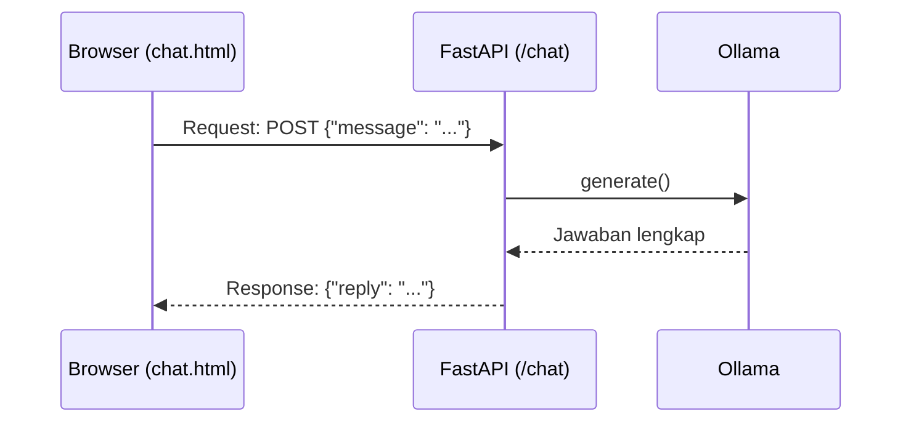
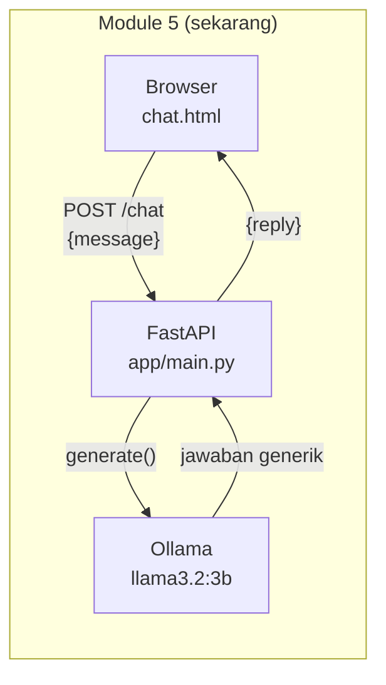

# Module 5: Chat UI Dasar

## Tujuan

Membangun antarmuka web dasar (`chat.html`) yang terhubung ke endpoint `/chat` Module 1-4 lewat FastAPI — endpoint paling sederhana yang mungkin (kirim satu pesan, tunggu, terima satu balasan utuh), dipakai untuk memverifikasi fondasi (Docker, network, model) sebelum kompleksitas apa pun ditambahkan. ⚠️ **`/chat` di module ini bersifat sementara**: begitu Module 6 menambahkan streaming, `/chat` **digantikan total** oleh `/chat/stream` — bukan hidup berdampingan. Lihat Module 6 Bagian 2 untuk penjelasan kenapa NALA sengaja pindah ke satu endpoint saja, bukan mempertahankan dua kontrak paralel.

## Definisi

**Endpoint** adalah satu alamat URL plus method HTTP tertentu (misalnya `POST /chat`) yang FastAPI "dengarkan" dan proses begitu ada request yang masuk ke situ — satu aplikasi web bisa punya banyak endpoint, dan tiap endpoint punya tugasnya masing-masing. Cara kerjanya mengikuti pola **request/response cycle**: browser (atau `curl`) mengirim **request** (misalnya `{"message": "..."}`), server memprosesnya, lalu mengirim balik **response** (`{"reply": "..."}`) — seluruh komunikasi NALA dengan browser, sepanjang Module 5-14, mengikuti pola ini dalam berbagai bentuk, cuma bentuk request/response-nya yang berubah dari module ke module.

Bentuk data yang disepakati antara pengirim dan penerima request itu disebut **kontrak API** — di module ini, kontraknya adalah `ChatRequest{message}` → `ChatResponse{reply}`. Selama kontrak ini tidak berubah, pemanggilnya (`chat.html`) tidak perlu tahu apa yang sebenarnya terjadi di baliknya (Bagian 2) — itulah yang membuat frontend dan backend bisa dikembangkan agak independen satu sama lain. **Chat UI** sendiri adalah antarmuka web tempat user mengetik pertanyaan dan membaca jawaban — di NALA diwakili satu file `chat.html`, dirender lewat Jinja2 (Bagian 3 Tahap C).



## Hasil Akhir yang Diharapkan

- `http://localhost:8000` menampilkan halaman chat yang bisa dipakai lewat browser, bukan lagi cuma `curl`
- Mengirim pesan dari UI mengembalikan balasan NALA (masih generik/pengetahuan umum, belum RAG)
- Kontrak `ChatRequest{message}` → `ChatResponse{reply}` terbukti tidak berubah dari Module 1-4
- Tidak ada error di log container `api` saat chat dikirim dari UI
- Kita punya baseline jawaban "sebelum RAG" untuk dibandingkan setelah Module 11 selesai
- Kita paham `/chat` di module ini adalah **fondasi sementara** — Module 6 akan menggantikannya total dengan `/chat/stream`, bukan menambah endpoint di sampingnya

## 1. Kenapa Mulai dari UI, Bukan Dokumen

Module 1-4 sudah membuktikan bahwa NALA bisa menjawab lewat `curl` — tapi `curl` bukan sesuatu yang akan dipakai staff PT Nusantara Finance sehari-hari. Sebelum Module 5-14 menumpuk kompleksitas baru (chunking, embedding, vector store, Airflow), langkah pertama adalah memastikan NALA bisa diakses lewat **antarmuka web** yang sama, yang nantinya dipakai sepanjang Module 5-27 — tanpa RAG dulu sama sekali.

Ini bukan langkah kosmetik. Ada dua hal konkret yang divalidasi di sini:

1. **Kontrak `/chat` tidak berubah dari Module 1-4 ke Module 5-14.** `ChatRequest{message}` → `ChatResponse{reply}` persis sama — bukti bahwa fondasi Module 1-4 (Docker, Ollama, `NALA_SYSTEM_PROMPT`) memang portable, bukan kebetulan yang cuma jalan sekali. `/chat` sendiri cuma bertahan sampai Module 6 (lihat Bagian 2) — begitu streaming dibutuhkan, endpoint ini digantikan total, bukan dipertahankan di samping yang baru.
2. **Masalah infrastruktur (Docker, network antar-container, model belum ter-pull) terdeteksi lebih awal**, sebelum ditumpuk dengan OpenSearch dan Airflow yang baru dikenalkan di Module 10 dan 14. Kalau chat dasar saja sudah gagal, jauh lebih mudah didiagnosis sekarang daripada setelah 3 service tambahan ikut jalan.



## 2. Kontrak `/chat`: Stabil untuk Satu Module Saja, dan Itu Disengaja

`POST /chat` — kirim `{"message": "..."}`, terima `{"reply": "..."}` — persis sama dengan Module 1-4, dan terbukti stabil selama module ini dijalankan: fondasi (FastAPI + Ollama + `NALA_SYSTEM_PROMPT`) bekerja tanpa modifikasi apa pun. Ini penting untuk **memisahkan masalah**: kalau chat dasar saja sudah gagal di titik ini, jauh lebih mudah didiagnosis sekarang daripada setelah HTML, streaming, dan RAG semuanya ikut ditumpuk.

Tapi kontrak ini **tidak dirancang untuk bertahan selamanya**. Begitu Module 6 butuh streaming (jawaban muncul token demi token) dan riwayat multi-turn (butuh mengirim **array** pesan, bukan satu `message`), kontrak `{"message"} → {"reply"}` sudah tidak cukup — bentuknya sendiri (satu request, satu response JSON utuh) bertentangan dengan cara kerja streaming. Daripada mempertahankan dua endpoint dengan dua kontrak berbeda selamanya (satu untuk kompatibilitas lama, satu untuk fitur baru), Module 6 **mengganti total**: `/chat` dihapus, `/chat/stream` menjadi satu-satunya endpoint chat NALA sejak saat itu — konsisten dengan keputusan "NALA seluruhnya berbasis streaming mulai Module 6" (lihat Module 6 Bagian 2 untuk alasan lengkapnya).

`chat.html` sendiri **akan berubah lebih awal dari yang mungkin terlihat wajar** — sudah di Module 6 (bukan menunggu sampai Module 11), karena streaming dan riwayat multi-turn butuh cara berbeda mengirim dan menampilkan pesan. Anggap Module 5 sebagai **jembatan sekali pakai**: cukup untuk membuktikan UI ↔ FastAPI ↔ Ollama tersambung, sebelum bentuk akhirnya (streaming) dibangun di atasnya.

## 3. Struktur Kode yang Ditambahkan

Dibanding starter code Module 1-4, ada tiga penambahan di `resources/starter-code/day-2/nala/`. Daripada langsung ditunjukkan kode lengkap, mari bangun **secara bertahap dalam 3 tahap besar** — tiap tahap menambah satu kemampuan baru di atas tahap sebelumnya, dan bisa langsung dites sebelum lanjut ke tahap berikutnya:

1. **Tahap A — Salin & verifikasi kode Module 1-4**, belum ada HTML sama sekali. Fokus: pastikan fondasi (FastAPI + Ollama + `NALA_SYSTEM_PROMPT`) masih jalan persis seperti Module 1-4, sebelum menambah apa pun.
2. **Tahap B — Buat file halaman dulu** (`chat.html`, `style.css`), belum terhubung ke FastAPI sama sekali. Fokus: menulis halamannya sendiri dulu sebagai unit yang berdiri sendiri, sebelum dipikirkan cara "menyambungkannya".
3. **Tahap C — Hubungkan**: tambah dependency `jinja2`, pasang `Jinja2Templates`/`StaticFiles`, dan buat endpoint `GET "/"` yang merender file dari Tahap B.

**Target akhirnya satu file yang sama: `resources/starter-code/day-2/nala/app/main.py`** (plus `chat.html`, `style.css`). Kode lengkapnya sudah tersedia di `resources/starter-code/day-2-reference/nala/` sebagai referensi/jawaban — ikuti Langkah 1-6 berikut untuk menulis sendiri bertahap, lalu cocokkan hasil akhirnya di Langkah 6.

### Tahap A — Salin & verifikasi kode Module 1-4 (belum ada HTML)

**Langkah 1 — Salin file yang identik dari Module 1-4**

`docker-compose.yml`, `Dockerfile`, `requirements.txt`, `app/ollama_client.py`, `app/system_prompt.py`, dan `app/main.py` **tidak berubah sama sekali** dari Module 1-4 di titik ini — salin langsung, tidak perlu ditulis ulang:

```bash
cd resources/starter-code
cp day-1/nala/docker-compose.yml day-2/nala/docker-compose.yml
cp day-1/nala/Dockerfile day-2/nala/Dockerfile
cp day-1/nala/requirements.txt day-2/nala/requirements.txt
cp day-1/nala/app/ollama_client.py day-2/nala/app/ollama_client.py
cp day-1/nala/app/system_prompt.py day-2/nala/app/system_prompt.py
cp day-1/nala/app/main.py day-2/nala/app/main.py
touch day-2/nala/app/__init__.py day-2/nala/tests/__init__.py
```

Belum ada alasan untuk mengubah isinya — perubahan baru muncul di Tahap C, begitu kita butuh sesuatu yang Module 1-4 tidak punya (merender HTML).

**▶️ Jalankan & lihat hasilnya**

```bash
cd resources/starter-code/day-2/nala
docker compose up --build --no-deps ollama api
```

Terminal baru, pull model (kalau belum):
```bash
docker compose exec ollama ollama pull llama3.2:3b
```

Tes kedua endpoint, harus **identik persis** dengan Module 1-4:
```bash
curl http://localhost:8000/health
curl -X POST http://localhost:8000/chat \
  -H "Content-Type: application/json" \
  -d '{"message": "Halo, kamu siapa?"}'
```

✅ **Indikator sukses**: `/health` → `{"status":"ok"}`. `/chat` → jawaban NALA seperti di Module 1-4. Belum ada apa pun yang baru — ini cuma bukti fondasinya masih solid sebelum ditambah. Biarkan `docker compose up` tetap jalan, lanjut ke Tahap B.

<details>
<summary><strong>Pakai Claude Code? Salin prompt berikut, paste untuk eksekusi Langkah 1</strong></summary>

```
Salin 6 file dari resources/starter-code/day-1/nala/ ke
resources/starter-code/day-2/nala/ TANPA modifikasi apa pun, plus
buat 2 file kosong baru.

GOAL:
- Salin persis (isi tidak berubah sedikit pun):
  - docker-compose.yml
  - Dockerfile
  - requirements.txt
  - app/ollama_client.py
  - app/system_prompt.py
  - app/main.py
- Buat 2 file kosong (0 baris): app/__init__.py dan tests/__init__.py
  di dalam resources/starter-code/day-2/nala/

CONTEXT:
- Source: resources/starter-code/day-1/nala/
- Target: resources/starter-code/day-2/nala/ (folder app/, app/templates/,
  app/static/, tests/ sudah ada tapi kosong)

GUARDRAIL:
- JANGAN ubah isi file apa pun saat menyalin — copy verbatim.
- JANGAN buat file lain di luar 6 file + 2 file kosong di atas.
- JANGAN sentuh apa pun di resources/starter-code/day-1/nala/ maupun
  resources/starter-code/day-2-reference/nala/.
```

</details>

**📄 Kode lengkap Tahap A** (persis `main.py` Module 1-4, belum ada HTML sama sekali):

```python
import os

from fastapi import FastAPI
from pydantic import BaseModel

from app.ollama_client import OllamaClient
from app.system_prompt import NALA_SYSTEM_PROMPT

app = FastAPI()

ollama_client = OllamaClient(
    base_url=os.environ.get("OLLAMA_BASE_URL", "http://localhost:11434"),
    model=os.environ.get("OLLAMA_MODEL", "llama3.2:3b"),
)


class ChatRequest(BaseModel):
    message: str


class ChatResponse(BaseModel):
    reply: str


@app.get("/health")
def health_check():
    return {"status": "ok"}


@app.post("/chat", response_model=ChatResponse)
def chat(request: ChatRequest) -> ChatResponse:
    reply = ollama_client.generate(
        system_prompt=NALA_SYSTEM_PROMPT,
        user_message=request.message,
    )
    return ChatResponse(reply=reply)
```

### Tahap B — Buat file halaman dulu (belum terhubung ke FastAPI)

Di Tahap A, `main.py` sudah solid tapi belum ada satu pun HTML. Daripada langsung memasang "pipa" (`Jinja2Templates`, `StaticFiles`) ke file yang belum ada, di tahap ini kita tulis dulu **halamannya sendiri** sebagai unit yang berdiri sendiri — baru di Tahap C dihubungkan ke FastAPI. Urutan ini sengaja dibalik dari kebiasaan "siapkan infrastruktur dulu, baru isi": lebih mudah menyambungkan sesuatu yang sudah nyata ada, daripada memasang pipa ke ruang kosong.

**Langkah 2 — Buat `app/templates/chat.html`**

```bash
mkdir -p app/templates app/static
```

```html
<!-- app/templates/chat.html -->
<!DOCTYPE html>
<html lang="id">
<head>
    <meta charset="UTF-8">
    <title>NALA — Chat</title>
    <link rel="stylesheet" href="/static/style.css">
</head>
<body>
    <div class="container">
        <h1>NALA — Nusantara Assistant</h1>
        <nav><a href="/">Chat</a></nav>
        <div id="history"></div>
        <form id="chat-form">
            <input type="text" id="message" placeholder="Tanya NALA seputar SOP..." required>
            <button type="submit">Kirim</button>
        </form>
    </div>
    <script>
        const form = document.getElementById("chat-form");
        const history = document.getElementById("history");
        const input = document.getElementById("message");

        function escapeHtml(text) {
            const div = document.createElement("div");
            div.textContent = text;
            return div.innerHTML;
        }

        form.addEventListener("submit", async (e) => {
            e.preventDefault();
            const message = input.value;
            history.innerHTML += `<p class="user"><b>Anda:</b> ${escapeHtml(message)}</p>`;
            input.value = "";

            const response = await fetch("/chat", {
                method: "POST",
                headers: { "Content-Type": "application/json" },
                body: JSON.stringify({ message }),
            });
            const data = await response.json();
            history.innerHTML += `<p class="nala"><b>NALA:</b> ${escapeHtml(data.reply)}</p>`;
            history.scrollTop = history.scrollHeight;
        });
    </script>
</body>
</html>
```

Ini HTML biasa dengan sedikit JavaScript (`fetch()`) untuk memanggil `/chat` tanpa reload halaman — bukan framework, bukan build step. `escapeHtml()` mencegah karakter HTML di pesan (user atau balasan NALA) dieksekusi begitu saja lewat `innerHTML` — pesan selalu ditampilkan sebagai teks polos, bukan HTML aktif. Perhatikan: `fetch("/chat", ...)` di sini memanggil endpoint yang **sudah ada** sejak Tahap A — file ini "menebak" endpoint yang benar tanpa perlu FastAPI tahu file ini ada.

**Langkah 3 — Buat `app/static/style.css`**

```css
/* app/static/style.css */
body {
    font-family: system-ui, sans-serif;
    max-width: 640px;
    margin: 40px auto;
    padding: 0 20px;
    color: #1a1a1a;
}

nav {
    margin-bottom: 20px;
}

nav a {
    margin-right: 12px;
}

#history {
    border: 1px solid #ddd;
    border-radius: 8px;
    padding: 16px;
    height: 320px;
    overflow-y: auto;
    margin-bottom: 12px;
}

.user {
    color: #1a1a1a;
}

.nala {
    color: #1e3a5f;
}

#chat-form {
    display: flex;
    gap: 8px;
}

#message {
    flex: 1;
    padding: 8px;
}
```

**▶️ Jalankan & lihat hasilnya**

Belum ada server yang tahu kedua file ini ada (`main.py` belum diubah) — jadi belum bisa dites lewat `curl`/`docker compose`. Cukup buka filenya langsung di browser lewat path lokal (bukan `http://localhost:8000`):

```
file:///path/ke/resources/starter-code/day-2/nala/app/templates/chat.html
```

✅ **Indikator sukses**: struktur halaman (judul, kolom input, tombol "Kirim") tampil — tapi **styling tidak akan muncul benar** (CSS-nya `404`, karena path `/static/style.css` cuma valid kalau diakses lewat server FastAPI, bukan `file://`), dan tombol "Kirim" belum berfungsi (`fetch("/chat")` akan gagal, tidak ada server di `file://`). Itu **normal** — bukti keduanya sudah tertulis benar secara struktur; sambungan sungguhannya baru terjadi di Tahap C.

<details>
<summary><strong>Pakai Claude Code? Salin prompt berikut, paste untuk eksekusi Langkah 2-3</strong></summary>

```
Buat halaman chat NALA (Module 5, Tahap B) — chat.html dan style.css,
BELUM dihubungkan ke FastAPI (main.py TIDAK diubah di tahap ini).

GOAL:
1. Buat folder resources/starter-code/day-2/nala/app/templates/ dan
   app/static/ (boleh sudah ada).
2. Buat resources/starter-code/day-2/nala/app/templates/chat.html —
   HTML biasa dengan form input pesan (id="chat-form"), area riwayat
   (id="history"), dan JavaScript fetch() ke POST /chat (kirim
   {message}, tampilkan data.reply). WAJIB ada fungsi escapeHtml()
   yang membungkus setiap teks sebelum dimasukkan ke innerHTML —
   baik pesan user maupun balasan NALA.
3. Buat resources/starter-code/day-2/nala/app/static/style.css —
   styling dasar: body max-width 640px center, #history dengan
   border+scroll, .user dan .nala dibedakan warna teks.

CONTEXT:
- app/main.py TIDAK disentuh sama sekali di tahap ini — endpoint
  /chat yang dipanggil chat.html sudah ada sejak Module 1-4/Tahap A.
- Referensi lengkap isi file (kalau ingin mencocokkan persis):
  resources/starter-code/day-2-reference/nala/app/templates/chat.html
  dan .../app/static/style.css

GUARDRAIL:
- JANGAN ubah app/main.py sama sekali — belum ada endpoint GET "/"
  atau StaticFiles/Jinja2Templates, itu baru Tahap C.
- JANGAN tambah fitur lain (streaming, riwayat percakapan, upload).
- WAJIB ada escapeHtml() atau setara.
```

</details>

### Tahap C — Hubungkan: tambah dependency, wiring, dan endpoint

**Langkah 4 — Tambah dependency `jinja2`, tepat saat dibutuhkan**

`requirements.txt` Module 1-4 belum punya `jinja2`, karena Module 1-4 tidak pernah merender HTML. Begitu kita mau **menghubungkan** `chat.html` (Tahap B) ke FastAPI, kita baru butuh `Jinja2Templates` — dan itu artinya `jinja2` harus ditambahkan **di titik ini**, bukan dari awal. Buka `requirements.txt`, tambahkan satu baris di akhir:

```
jinja2==3.1.4
```

Pola ini akan berulang di module-module berikutnya: `python-multipart` ditambahkan tepat saat Module 12 butuh upload file, dependency OpenSearch/Airflow ditambahkan tepat saat Module 10 dan 14 membutuhkannya — bukan diborong semua di awal.

**Langkah 5 — Pasang `Jinja2Templates` & mount `StaticFiles`**

Di `app/main.py`, tambahkan tiga import baru di baris atas, dan ubah baris `app = FastAPI()`:

```python
from fastapi import FastAPI, Request
from fastapi.staticfiles import StaticFiles
from fastapi.templating import Jinja2Templates
```

- **`FastAPI`**: sudah dipakai sejak Module 1-4 (bikin `app`), tidak berubah.
- **`Request`**: tipe data yang mewakili satu request HTTP yang masuk. Dibutuhkan karena `Jinja2Templates.TemplateResponse()` (dipakai di Langkah berikutnya) **mewajibkan** parameter `request` dikirim — konvensi Starlette/FastAPI, bukan pilihan bebas.
- **`StaticFiles`**: class untuk "menyajikan" file mentah (CSS, JS, gambar) langsung dari sebuah folder lewat URL, tanpa perlu bikin endpoint satu-satu per file.
- **`Jinja2Templates`**: penghubung FastAPI ke library `Jinja2` (baru ditambahkan ke `requirements.txt` di Langkah 4) — tugasnya merender file `.html` jadi HTML sungguhan yang dikirim ke browser.

Perhatikan: `StaticFiles` dan `Jinja2Templates` **tidak** ikut di `from fastapi import ...` seperti `FastAPI`/`Request` — keduanya ada di submodule terpisah (`fastapi.staticfiles`, `fastapi.templating`), karena keduanya fitur "opsional/tambahan", bukan inti FastAPI yang dipakai semua aplikasi.

```python
app = FastAPI(title="NALA")
app.mount("/static", StaticFiles(directory="app/static"), name="static")
templates = Jinja2Templates(directory="app/templates")
```

- **`FastAPI(title="NALA")`**: sama seperti Module 1-4, tapi sekarang dengan `title="NALA"` — cuma memengaruhi nama yang ditampilkan di dokumentasi otomatis FastAPI (Swagger UI di `/docs`), tidak mengubah perilaku endpoint apa pun.
- **`app.mount("/static", StaticFiles(directory="app/static"), name="static")`**: mendaftarkan URL prefix `/static` — setiap request ke `/static/apa-saja` akan dijawab dengan mencari file yang cocok di folder `app/static/` (dibuat Tahap B) pada disk. Sekarang `style.css` yang tadi cuma "file lokal" di Tahap B, resmi bisa diakses lewat `http://localhost:8000/static/style.css`.
- **`templates = Jinja2Templates(directory="app/templates")`**: membuat satu instance mesin Jinja2, menunjuk ke folder `app/templates/` (isinya `chat.html` dari Tahap B). Ini baru **membuat objeknya saja** — belum ada endpoint yang memanggilnya, itu Langkah 6.

**Langkah 6 — Tambahkan endpoint `GET "/"` yang merender `chat.html`**

Di bagian bawah `app/main.py`, setelah endpoint `/chat` yang sudah ada, tambahkan import baru dan endpoint-nya:

```python
from fastapi.responses import HTMLResponse


@app.get("/", response_class=HTMLResponse)
def chat_page(request: Request):
    return templates.TemplateResponse("chat.html", {"request": request})
```

- **`response_class=HTMLResponse`**: memberi tahu FastAPI bahwa endpoint ini mengembalikan HTML, bukan JSON seperti `/health`/`/chat`.
- **`templates.TemplateResponse("chat.html", {"request": request})`**: inilah momen "menghubungkan" — merender persis file `chat.html` yang ditulis di Tahap B (Langkah 2), lewat mesin Jinja2 yang disiapkan Langkah 5.

**▶️ Jalankan & lihat hasilnya**

`requirements.txt` berubah (ada `jinja2` baru), jadi image perlu dibangun ulang:

```bash
docker compose up --build --no-deps ollama api
```

Buka `http://localhost:8000/` di **browser** (bukan `file://` lagi) — sekarang harus muncul halaman chat dengan styling yang benar (bandingkan dengan Tahap B yang CSS-nya `404`). Coba kirim pesan apa saja, misalnya "Halo, kamu siapa?".

✅ **Indikator sukses**: halaman chat tampil lengkap dengan styling, dan mengirim pesan menghasilkan balasan dari NALA di `#history` — koneksi UI → FastAPI → Ollama bekerja penuh, dan `chat.html`/`style.css` dari Tahap B sekarang benar-benar tersambung, bukan cuma file lokal.

<details>
<summary><strong>Pakai Claude Code? Salin prompt berikut, paste untuk eksekusi Langkah 4-6</strong></summary>

```
Hubungkan chat.html/style.css (sudah dibuat di Tahap B) ke FastAPI —
tambah dependency jinja2, pasang StaticFiles/Jinja2Templates, dan
endpoint GET "/".

GOAL:
1. Di resources/starter-code/day-2/nala/requirements.txt: tambahkan
   satu baris baru di akhir file: jinja2==3.1.4
2. Di resources/starter-code/day-2/nala/app/main.py:
   a. Tambahkan ke import yang sudah ada: `Request` dari `fastapi`,
      `StaticFiles` dari `fastapi.staticfiles`, `Jinja2Templates`
      dari `fastapi.templating`, `HTMLResponse` dari
      `fastapi.responses`.
   b. Ubah baris `app = FastAPI()` menjadi tiga baris:
      app = FastAPI(title="NALA")
      app.mount("/static", StaticFiles(directory="app/static"), name="static")
      templates = Jinja2Templates(directory="app/templates")
   c. Tambahkan endpoint baru di bagian PALING BAWAH file (setelah
      endpoint /chat yang sudah ada):
      @app.get("/", response_class=HTMLResponse)
      def chat_page(request: Request):
          return templates.TemplateResponse("chat.html", {"request": request})

CONTEXT:
- app/templates/chat.html dan app/static/style.css sudah dibuat di
  Tahap B — JANGAN dibuat ulang atau diubah isinya.
- Referensi lengkap kalau perlu: resources/starter-code/day-2-reference/nala/

GUARDRAIL:
- JANGAN ubah endpoint /health atau /chat sama sekali.
- JANGAN ubah isi chat.html/style.css — file itu sudah final dari
  Tahap B, tugas di sini murni menyambungkan lewat main.py.
```

</details>

**📄 Kode lengkap Tahap C** (versi final Module 5):

```python
import os

from fastapi import FastAPI, Request
from fastapi.responses import HTMLResponse
from fastapi.staticfiles import StaticFiles
from fastapi.templating import Jinja2Templates
from pydantic import BaseModel

from app.ollama_client import OllamaClient
from app.system_prompt import NALA_SYSTEM_PROMPT

app = FastAPI(title="NALA")
app.mount("/static", StaticFiles(directory="app/static"), name="static")
templates = Jinja2Templates(directory="app/templates")

ollama_client = OllamaClient(
    base_url=os.environ.get("OLLAMA_BASE_URL", "http://localhost:11434"),
    model=os.environ.get("OLLAMA_MODEL", "llama3.2:3b"),
)


class ChatRequest(BaseModel):
    message: str


class ChatResponse(BaseModel):
    reply: str


@app.get("/health")
def health_check():
    return {"status": "ok"}


@app.post("/chat", response_model=ChatResponse)
def chat(request: ChatRequest) -> ChatResponse:
    reply = ollama_client.generate(
        system_prompt=NALA_SYSTEM_PROMPT,
        user_message=request.message,
    )
    return ChatResponse(reply=reply)


@app.get("/", response_class=HTMLResponse)
def chat_page(request: Request):
    return templates.TemplateResponse("chat.html", {"request": request})
```

Dibandingkan **Kode lengkap Tahap A**: tambah 4 import (`Request`, `HTMLResponse`, `StaticFiles`, `Jinja2Templates`), dua baris `mount`/`templates`, dan satu endpoint baru di bagian bawah. **Tidak ada satu baris pun di `/health` atau `/chat` yang berubah** — itulah inti Tahap C: menghubungkan halaman yang sudah jadi (Tahap B) tanpa menyentuh yang sudah jalan (Tahap A).

**Langkah 7 — Bandingkan dengan file aslinya**

Setelah Langkah 1-6 (Tahap A-C), `app/main.py` Anda seharusnya sama isinya dengan `resources/starter-code/day-2-reference/nala/app/main.py` (susunan boleh sedikit beda, isinya yang harus sama).

## 4. Apa yang TIDAK Ada di Module Ini

Untuk menjaga fokus, Module 5 sengaja **tidak** menyentuh:
- Streaming atau riwayat multi-turn (Module 6 — endpoint `/chat/stream` **menggantikan** `/chat`, dibangun di atas fondasi module ini)
- Konsep RAG (Module 7), data seed (Module 8, belum ada chunking)
- Embedding (Module 9), vector search (Module 10)
- Retrieval yang benar-benar dipakai `/chat/stream` (Module 11, versi tanpa chunking)
- Chunking (Module 12) dan upload dokumen (Module 13, halaman `/upload`)
- Airflow (Module 14)

Kalau dicoba di titik ini, jawaban NALA akan terasa "biasa saja" — sama seperti Module 1-4 — dan itu **memang tujuannya**: memberi kita garis dasar (baseline) yang jelas untuk dibandingkan setelah RAG mulai aktif di Module 11. Perbedaan sebelum-dan-sesudah ini adalah salah satu momen belajar paling nyata di Module 5-14.

## 5. Checkpoint Praktik

Langkah eksekusi lengkap (menjalankan `docker compose up`, membuka `http://localhost:8000`, dan mencoba chat) ada di **bagian Panduan Praktik di bawah, Langkah 1-4**. Yang perlu dipastikan sebelum lanjut ke Module 6:

- [ ] `http://localhost:8000` menampilkan halaman chat (bukan JSON mentah)
- [ ] Mengirim pesan dari UI mengembalikan balasan dari NALA (walau jawabannya generik)
- [ ] Tidak ada error di log container `api` saat chat dikirim

Begitu ketiga hal ini terverifikasi, lanjut ke Module 6 — yang membuat balasan NALA terasa hidup lewat streaming dan mengingat konteks percakapan sebelumnya (multi-turn), sebelum Module 5-14 menumpuk kompleksitas dokumen/RAG.

## Panduan Praktik

### Dua folder kode Module 5-14 — jangan tertukar

- **`resources/starter-code/day-2/nala/`** — folder kerja Anda. Panduan Module 5-14 membangunnya **bertahap, module demi module**: di awal Module 5 isinya baru mencakup module ini, bertambah setiap kali sebuah module selesai. Semua perintah di panduan ini dijalankan di folder ini.
- **`resources/starter-code/day-2-reference/nala/`** — kode jadi lengkap dari kesembilan module yang menghasilkan kode (Module 5-6, 8-14 — Module 7 murni konsep/diskusi, tidak ada langkah kode), frozen kecuali saat scope Module 5-14 sendiri berubah (misal dukungan PDF ditambahkan ke semua modul yang relevan sekaligus, bukan cuma salah satu). Dipakai sebagai jawaban/pembanding kalau ingin mengecek hasil akhir suatu module — bukan tempat menjalankan `docker compose`.

### Prasyarat
- Sudah menyelesaikan **Module 1-4** (Docker Desktop terinstall, `llama3.2:3b` pernah dipakai, familiar dengan `docker compose up --build`)
- Docker Desktop sudah dialokasikan resource yang cukup — lihat catatan RAM di bawah

#### Matikan dulu container Module 1-4 — Anda tidak akan kembali ke situ

`resources/starter-code/day-2/nala/` **bukan project terpisah** dari Module 1-4 — ia dibuat dengan menyalin seluruh kode `day-1/nala/` lebih dulu (`ollama_client.py`, `system_prompt.py`, `main.py`, `docker-compose.yml`, dst), baru ditambah fitur-fitur baru Module 5-14 di atasnya (streaming, multi-turn, RAG chain, chunking, embedding, vector store, upload, Airflow). Dengan kata lain, **`day-2/nala/` sudah mencakup semua yang ada di Module 1-4, plus lebih banyak lagi**.

Konsekuensinya: mulai sekarang, **jalankan `docker compose` dari `day-2/nala/`, bukan lagi `day-1/nala/`**. Karena nama folder `day-1/nala` dan `day-2/nala` sama-sama `nala`, Docker Compose (yang memakai **nama folder**, bukan path lengkap, sebagai *project name* secara default) memperlakukan keduanya sebagai **project yang sama** — ini disengaja, bukan sesuatu yang perlu dihindari: kalau tiap module punya project Docker terpisah, `ollama` (dan service lain ke depannya) akan berjalan duplikat, membengkakkan RAM tanpa perlu. Dengan project yang sama, `day-2/nala/docker-compose.yml` cukup **mengambil alih** container yang sudah berjalan sejak Module 1-4 — model Ollama yang sudah di-pull otomatis ikut terbawa, tidak perlu di-pull ulang.

Tidak perlu langkah "matikan dulu" secara eksplisit — cukup jalankan compose dari `day-2/nala/` seperti biasa (Langkah 2 di bawah), Docker Compose otomatis merecreate container yang definisinya berubah. Kalau Anda tetap ingin memulai dari kondisi bersih (opsional), bisa jalankan dulu:

```bash
cd resources/starter-code/day-1/nala
docker compose down
```

Cek dengan `docker ps` untuk memastikan container mana yang aktif sebelum lanjut ke Langkah 1 di bawah.

#### Catatan penting: naikkan alokasi RAM Docker Desktop

Module 5-14 menambahkan **dua service baru** di atas stack Module 1-4: **OpenSearch** (vector store, mulai Module 10) dan **Airflow** (orchestrator, mode `standalone`, mulai Module 14). Kedua service ini jauh lebih berat dibanding FastAPI/Ollama saja — OpenSearch adalah JVM yang butuh heap tersendiri, dan Airflow standalone menjalankan webserver + scheduler + database sekaligus dalam satu container.

Kalau di Module 1-4 Anda mengalokasikan Docker Desktop di batas minimal (8–12GB), **naikkan ke 16GB+** untuk Module 5-14. Ikuti langkah yang sama seperti **Langkah 0 di `Module-04-Setup-Infra-Docker-Compose/materi.md`, bagian Panduan Praktik** (Docker Desktop → ⚙️ Settings → tab Resources):

| Setting | Minimal Module 5-14 | Direkomendasikan | Alasan |
|---|---|---|---|
| **Memory (RAM)** | 8 GB | 16 GB+ | `llama3.2:3b` (~4-6GB) + `nomic-embed-text` + OpenSearch (heap `-Xms512m -Xmx512m` minimal, tapi JVM + OS overhead-nya lebih besar dari itu) + Airflow standalone (webserver+scheduler+metadata DB dalam satu proses) berjalan bersamaan. |
| **CPUs** | 4 | 4+ | 4 service (ollama, opensearch, airflow, api) aktif sekaligus. |
| **Disk image size** | 80 GB | 100 GB+ | Image `opensearchproject/opensearch` dan `apache/airflow` cukup besar (>1GB masing-masing), ditambah image Module 1-4 yang mungkin masih tersimpan. |
| **Swap** | 1 GB | 2 GB | Buffer tambahan kalau Memory limit sempat mepet saat semua service start bersamaan. |

Kalau Anda sudah mengubah setting ini di Module 1-4 ke 16GB+, tidak perlu diubah lagi. Setelah mengubah, klik **Apply & Restart**.

Catatan: panduan Module 5-14 menyalakan service **secara bertahap**, mengikuti urutan module: `ollama`+`api` dulu di Langkah 2 di bawah (Module 5-8 cuma butuh ini — Module 7 malah tidak butuh service apa pun, murni diskusi), `opensearch` menyusul di Module 10, `airflow` terakhir di Module 14 — jadi beban RAM di Module 5-9 jauh lebih ringan dari 16GB. Alokasi 16GB+ tetap perlu disiapkan sebelum Module 14, begitu keempat service jalan bersamaan.

Kalau disk mulai penuh, bersihkan image/volume lama yang tidak terpakai (lihat peringatan di `Module-04-Setup-Infra-Docker-Compose/materi.md`, bagian Panduan Praktik, soal `docker system prune -a --volumes` — perintah ini menghapus model Ollama yang sudah di-pull juga).

### Langkah 1: Masuk ke folder starter code

```bash
cd resources/starter-code/day-2/nala
```

### Langkah 2: Jalankan Ollama + API dulu (belum semua service)

Stack Module 5-14 total punya 4 service (`ollama`, `opensearch`, `airflow`, `api`), tapi Module 5-8 (chat UI, streaming/multi-turn, konsep RAG, data seed — Module 7 murni diskusi konsep, tidak butuh service sama sekali) cuma butuh **dua yang pertama** — `opensearch` baru dipakai mulai Module 10, `airflow` baru dipakai mulai Module 14. Supaya urutan belajar juga terasa di infrastrukturnya — bertahap, bukan langsung semua nyala sekaligus — nyalakan `ollama` dan `api` saja dulu, skip dua yang lain:

```bash
docker compose up --build --no-deps ollama api
```

Flag `--no-deps` penting: tanpa itu, Docker Compose otomatis ikut menyalakan `opensearch` karena `api` punya `depends_on: opensearch` di `docker-compose.yml`. Dengan `--no-deps`, benar-benar hanya 2 container yang jalan.

Ini aman meski `api` "seharusnya" nantinya butuh OpenSearch — belum sekarang. Di titik ini (`day-2/nala` baru sampai Module 5), `/chat` belum menyentuh OpenSearch sama sekali. Nanti begitu Module 11 (`/chat/stream` jadi RAG-aware) dan Module 13 (`/upload`) selesai dibangun, kedua endpoint itu akan membungkus setiap panggilan ke OpenSearch dalam `try/except httpx.HTTPError` — kalau `opensearch` tidak jalan, koneksi gagal secara terkontrol dan otomatis fallback (mode tanpa-konteks untuk chat, "tersimpan tapi belum ter-index" untuk upload), bukan crash. Lihat Module 11 Bagian 2 Langkah 3 dan Module 13 Bagian 2 Tahap B untuk penjelasan desainnya begitu Anda sampai di situ.

Tunggu sampai log `api` menunjukkan `Uvicorn running on http://0.0.0.0:8000`. Prosesnya jauh lebih cepat dari menyalakan keempat service sekaligus, karena tidak perlu menunggu inisialisasi cluster OpenSearch atau database metadata Airflow.

### Langkah 3: Pull model untuk chat (di terminal baru)

Sama seperti Module 1-4, Ollama di dalam container punya storage terpisah — model perlu di-pull ulang khusus untuk container ini. Di titik ini kita baru butuh **satu model**: `llama3.2:3b` untuk chat/generation. Model untuk embedding (`nomic-embed-text`) belum dibutuhkan — itu baru dipakai mulai Module 9, jadi baru kita pull nanti di Module 9 Langkah 1 (bukan sekarang, supaya jelas step mana yang butuh apa).

Buka **terminal baru** (biarkan terminal Langkah 2 tetap berjalan), masuk ke folder yang sama (`resources/starter-code/day-2/nala`), lalu:

```bash
docker compose exec ollama ollama pull llama3.2:3b
```

⚠️ Tag `:3b` wajib ditulis persis — harus sama dengan `OLLAMA_MODEL` di `docker-compose.yml`.

Verifikasi model sudah ada:

```bash
docker compose exec ollama ollama list
```

`llama3.2:3b` harus muncul di daftar.

### Langkah 4: Coba chat dulu lewat `/chat`, sebelum ada dokumen

Sebelum menyentuh dokumen sama sekali, buka `http://localhost:8000` di browser — ini halaman chat (`chat.html`) versi paling sederhana, memakai endpoint `/chat` (kirim satu pesan, tunggu, terima satu balasan utuh). Coba kirim pesan apa saja, misalnya:

> "Halo, kamu siapa?"

NALA akan tetap membalas — koneksi UI → FastAPI → Ollama sudah bekerja — tapi jawabannya generik karena belum ada dokumen internal untuk dirujuk sama sekali (belum ada RAG di titik ini). Tujuannya memverifikasi dulu bahwa fondasi chat sudah jalan, sebelum lapisan streaming (Module 6) dan RAG (Module 8-14) ditambahkan di atasnya.

⚠️ **`/chat` di langkah ini bersifat sementara** — Module 6 Langkah 1 akan **menghapus total** endpoint ini dan menggantikannya dengan `/chat/stream`. Sengaja dibangun dulu di sini supaya fondasi (Docker, network, model) terverifikasi dengan kontrak paling sederhana, sebelum kompleksitas streaming ditambahkan.

Kalau ingin memverifikasi lewat `curl` juga bisa, response-nya tetap `{"reply": "..."}` seperti Module 1-4:

```bash
curl -X POST http://localhost:8000/chat \
  -H "Content-Type: application/json" \
  -d '{"message": "Halo, kamu siapa?"}'
```

### Troubleshooting

- **`no configuration file provided: not found`**: `docker compose` dijalankan bukan dari folder yang berisi `docker-compose.yml`. Pastikan Anda berada persis di `resources/starter-code/day-2/nala/` (cek dengan `ls`).
- **`failed to read dockerfile: open Dockerfile: no such file or directory`**: nama file salah — harus persis `Dockerfile`. Cek dengan `ls` dan rename kalau perlu: `mv DockerFile Dockerfile`.
- **`Internal Server Error` saat chat**: cek dulu model Ollama sudah ter-pull (`docker compose exec ollama ollama list`) — di titik ini baru `llama3.2:3b` (Langkah 3) yang dibutuhkan. Detail traceback Python bisa dilihat di log container `api` (terminal yang menjalankan Langkah 2).
- **Port sudah dipakai (8000/11434)**: ubah mapping port di `docker-compose.yml` untuk service yang bentrok (misal `8001:8000`).
- **Semua service terasa sangat lambat / laptop panas / container ter-*kill***: kemungkinan besar alokasi RAM Docker Desktop kurang — lihat bagian Prasyarat di atas. Cek pemakaian resource real-time dengan `docker stats`. Beban RAM di module ini masih ringan (cuma `ollama`+`api`); ini jadi penting begitu `opensearch` (Module 10) dan `airflow` (Module 14) ikut menyala.
