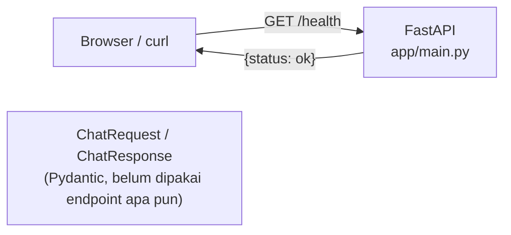
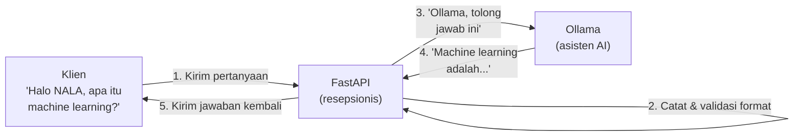

# Module 5: FastAPI Dasar

## Tujuan

Kita memahami FastAPI sebagai framework API, lalu membangun endpoint `/health` dan "cetakan" `ChatRequest`/`ChatResponse` (Pydantic) — murni FastAPI, **belum tersambung ke Ollama sama sekali**. Koneksi ke Ollama (Dockerfile, docker-compose.yml, environment variable, model, system prompt) dibahas terpisah dan pelan-pelan di Module 6.

## Definisi

**FastAPI** adalah *framework* Python untuk membangun REST API — lapisan yang menerima request HTTP dari luar (browser, `curl`, aplikasi lain), memvalidasi bentuk datanya, memprosesnya, lalu mengembalikan response. Di NALA, FastAPI berperan sebagai "resepsionis" yang menerima pertanyaan user dan meneruskannya ke Ollama (mulai Module 6).

**Pydantic** adalah library Python untuk mendefinisikan "bentuk data yang wajib dipenuhi" — dipakai FastAPI untuk memvalidasi request yang masuk (`ChatRequest`) dan menstrukturkan response yang keluar (`ChatResponse`), otomatis menolak data yang salah bentuk sebelum kode kita sempat dijalankan.



## Hasil Akhir yang Diharapkan

- Kita paham konsep dasar FastAPI: `app`, endpoint, decorator `@app.get`/`@app.post`
- Endpoint `/health` berfungsi, dites lewat `uvicorn` lokal (belum butuh Docker)
- `ChatRequest`/`ChatResponse` (Pydantic) sudah didefinisikan — "cetakan" data masuk/keluar, belum dipakai endpoint apa pun
- Kita paham **secara mendalam** bagaimana Pydantic memvalidasi data lewat type hints, termasuk contoh konkret response error saat data salah bentuk
- Kita siap lanjut ke Module 6 untuk menyambungkan `main.py` ini ke Ollama

## 1. Konsep Dasar FastAPI

FastAPI adalah framework Python modern untuk membangun API (Application Programming Interface). API adalah "pintu masuk" untuk aplikasi lain berkomunikasi dengan sistem Anda. Mari kita pahami FastAPI dari dua perspektif: **non-teknis** dan **teknis**.

### 1.1 Penjelasan Non-Teknis

**Bayangan Sederhana:**
Jika NALA adalah "asisten AI", maka FastAPI adalah "resepsionis" yang menerima pertanyaan dari klien (user, aplikasi lain, website) dan melempar pertanyaan tersebut ke asisten. Setelah asisten menjawab, resepsionis mengirim jawaban kembali ke klien.

**Alur Komunikasi (Non-teknis):**



**Keuntungan FastAPI untuk NALA:**
- **Cepat**: Salah satu framework tercepat di Python (comparable dengan Node.js)
- **Mudah**: Syntax clean dan intuitive; cocok untuk learners
- **Automatic documentation**: FastAPI auto-generate dokumentasi interaktif (Swagger UI)
- **Type safety**: Validasi input otomatis dengan Python type hints
- **Async-ready**: Support concurrent requests (banyak user sekaligus)

### 1.2 Penjelasan Teknis

#### 1.2.1 Struktur Dasar FastAPI, Bertahap

Daripada langsung ditunjukkan kode lengkap, mari bangun aplikasi FastAPI **secara bertahap** — tiap langkah menambah satu kemampuan baru di atas langkah sebelumnya, dan bisa langsung dites sebelum lanjut ke langkah berikutnya. Module ini fokus **murni ke FastAPI**, belum tersambung ke Ollama sama sekali — memahami `app`, endpoint, dan Pydantic model dulu sebagai konsep HTTP API yang berdiri sendiri. Menyambungkannya ke Ollama (Dockerfile, docker-compose.yml, environment variable, model, system prompt) dibahas terpisah, pelan-pelan, di Module 6.

**Target akhirnya: `Nala/app/main.py`.** File ini sudah tersedia lengkap di starter code (sebagai referensi/jawaban) — ikuti Langkah 1-4 berikut untuk menulis ulang isinya sendiri bertahap, lalu lanjut ke Module 6 untuk menyambungkannya ke Ollama.

### Tahap A — FastAPI saja (belum ada Ollama)

**Langkah 1 — Buat aplikasi paling minimal**

1. Buka folder `Nala/app/`.
2. Buat (atau buka) file `main.py`.
3. Tulis dua baris ini sebagai isi paling awal:

```python
from fastapi import FastAPI

app = FastAPI()
```

Apa yang sebenarnya terjadi di dua baris ini?

- **`from fastapi import FastAPI`**: mengambil *class* `FastAPI` dari library FastAPI yang sudah di-install.
- **`app = FastAPI()`**: memanggil class tersebut untuk membuat satu **instance** (objek nyata) dari `FastAPI`, lalu menyimpannya ke variabel bernama `app`.

Kenapa butuh instance, bukan langsung pakai class-nya? Karena `app` inilah yang nanti jadi "wadah pusat" tempat semua endpoint didaftarkan (lihat Langkah 2), dan `app` juga yang nanti dirujuk oleh server saat menjalankan aplikasi (`uvicorn main:app` — dibahas di 1.2.6 — kata `app` di situ merujuk persis ke variabel ini). Nama variabelnya **harus** `app` (atau nama lain yang konsisten dipakai saat menjalankan server) — bukan aturan Python, tapi konvensi yang dipakai FastAPI/uvicorn untuk saling menemukan.

Baru dua baris, belum ada endpoint apa pun — tapi ini sudah aplikasi FastAPI yang valid. Di file asli `app/main.py`, baris ini ditulis sedikit lebih lengkap: `app = FastAPI(title="NALA")` — `title` dipakai untuk mempercantik dokumentasi otomatis (Swagger UI, lihat 1.2.6), tapi konsepnya sama persis. Boleh dulu tulis `FastAPI()` polos, nanti ditambah `title` di Langkah 8.

**▶️ Jalankan & lihat hasilnya**

Sampai sini `main.py` belum butuh Ollama sama sekali, jadi belum perlu Docker — cukup `uvicorn` lokal:

```bash
cd Nala
pip install fastapi uvicorn
uvicorn app.main:app --reload
```

Buka `http://127.0.0.1:8000` di browser. Yang muncul: `{"detail":"Not Found"}`. Ini **bukan error** — ini bukti nyata: servernya sudah menyala, tapi belum ada "pintu" (endpoint) yang didaftarkan ke `app`. Biarkan `uvicorn` tetap jalan (jangan `Ctrl+C` dulu — `--reload` akan otomatis membaca ulang file setiap kali disimpan), lanjut ke Langkah 2.

**Langkah 2 — Tambah satu endpoint paling sederhana**

Endpoint adalah "pintu" yang bisa diakses dari luar. Di file `main.py` yang sama, tambahkan endpoint paling sederhana: cek status.

1. Di bawah baris `app = FastAPI()`, tambahkan:

```python
@app.get("/health")
def health_check():
    return {"status": "ok"}
```

2. Simpan file.

- **`@app.get("/health")`**: ini disebut *decorator* — cara FastAPI tahu "kalau ada yang akses path `/health` dengan method GET, jalankan fungsi di bawah ini".
- **`def health_check(): return {"status": "ok"}`**: fungsi biasa, mengembalikan dictionary Python — FastAPI otomatis mengubahnya jadi JSON.

**▶️ Jalankan & lihat hasilnya**

Karena `uvicorn --reload` masih jalan dari Langkah 1, file otomatis ke-reload begitu disimpan (lihat log terminal: `Reloading...`). Buka terminal baru, lalu:

```bash
curl http://127.0.0.1:8000/health
```

Harus muncul `{"status":"ok"}` — beda dari `{"detail":"Not Found"}` di Langkah 1, karena sekarang `/health` sudah terdaftar. Sengaja belum ada endpoint `/chat` — itu langkah berikutnya, karena `/chat` butuh konsep tambahan: data yang dikirim *dari* klien (bukan cuma dikembalikan *ke* klien).

**Langkah 3 — Definisikan bentuk data yang diharapkan (Pydantic)**

Endpoint `/health` tadi gampang — dia tidak butuh apa-apa dari orang yang mengaksesnya, cuma dipanggil lalu jawab "ok". Tapi `/chat` beda: NALA perlu tahu dulu **apa pertanyaan** yang mau ditanyakan user. Di sinilah **Pydantic** dipakai — library Python untuk mendefinisikan "bentuk data yang wajib dipenuhi".

**Bayangkan begini:** sebelum kotak saran boleh diisi orang, biasanya disediakan dulu selembar formulir kosong, bukan kertas polos. Formulirnya sudah ada kolom bertuliskan "Pertanyaan Anda: ___________". Siapa pun yang mau bertanya, **wajib** isi kolom itu — tidak bisa kirim kertas kosong atau coret-coretan bebas. Pydantic itu fungsinya persis seperti formulir ini, tapi ditulis dalam kode.

### Apa Sebenarnya Pydantic Itu

Tanpa Pydantic, setiap endpoint yang menerima data harus divalidasi **manual**: cek apakah field-nya ada, cek tipe datanya benar, cek formatnya sesuai — semua ditulis sendiri dengan `if`/`else` berlapis, dan gampang ada yang kelupaan. Pydantic mengotomatiskan seluruh pengecekan itu lewat satu mekanisme: **Python type hints**.

```python
class ChatRequest(BaseModel):
    message: str
```

Baris `message: str` ini bukan sekadar komentar/dokumentasi seperti type hint biasa di Python murni — Pydantic benar-benar **membaca** anotasi tipe itu dan menegakkannya saat runtime. Kalau `message` tidak dikirim, atau dikirim sebagai angka bukan teks, Pydantic akan menolak data itu **sebelum** kode `def chat(...)` sempat dijalankan sama sekali.

**Contoh konkret — apa yang terjadi kalau data yang dikirim salah bentuk** (baru bisa dicoba nanti setelah endpoint `/chat` aktif di Langkah 7, tapi perilakunya sudah ditentukan oleh `ChatRequest` yang ditulis di langkah ini):

```bash
curl -X POST http://localhost:8000/chat \
  -H "Content-Type: application/json" \
  -d '{"pesan": "Halo"}'
```

Karena field yang dikirim namanya `pesan` (bukan `message`), FastAPI/Pydantic otomatis menjawab dengan status `422 Unprocessable Entity` dan detail error seperti ini — tanpa kode `chat()` Anda menulis satu baris pun logika validasi:

```json
{
  "detail": [
    {
      "type": "missing",
      "loc": ["body", "message"],
      "msg": "Field required"
    }
  ]
}
```

### Field Wajib vs Opsional, dan Tipe Data Lain

`ChatRequest` di NALA sengaja cuma punya satu field wajib (`message: str`) — tapi Pydantic mendukung pola yang lebih kaya, berguna diketahui walau belum dipakai NALA sekarang:

| Pola | Contoh | Artinya |
|---|---|---|
| Field wajib | `message: str` | Harus selalu dikirim, tipe harus `str` |
| Field opsional dengan default | `top_k: int = 3` | Boleh tidak dikirim — kalau tidak ada, otomatis bernilai `3` |
| Field opsional, boleh kosong (`None`) | `session_id: str \| None = None` | Boleh tidak dikirim, atau dikirim `null` — dua-duanya valid |
| Tipe list | `history: list[str] = []` | Menerima daftar/array, default-nya list kosong |
| Tipe bersarang (nested model) | `metadata: Metadata` (`Metadata` adalah `BaseModel` lain) | Menerima objek JSON bersarang, divalidasi rekursif |

**Kenapa `ChatRequest` NALA tidak pakai semua ini sekaligus?** Konsisten dengan pola berulang sepanjang training: mulai sesederhana mungkin (satu field wajib), baru diperluas **tepat saat dibutuhkan**. Kalau nanti NALA butuh parameter tambahan (misal `top_k` yang bisa diatur user), `ChatRequest` akan ditambah field baru dengan default value — bukan mengganti struktur yang sudah ada.

### Kenapa Validasi Otomatis Ini Penting untuk NALA

- **Keamanan dasar**: mencegah data yang bentuknya aneh/tidak terduga sampai ke `ollama_client.generate()` (dibangun Tahap B) — kalau `message` bisa berupa apa saja (termasuk `null` atau angka), kode di bawahnya harus menangani semua kemungkinan itu sendiri.
- **Dokumentasi otomatis**: definisi `ChatRequest`/`ChatResponse` ini juga yang dibaca FastAPI untuk membuat Swagger UI (`/docs`, dibahas Bagian 1.2.6) — jadi satu definisi, dua manfaat sekaligus (validasi + dokumentasi).
- **Error message yang jelas**: dibanding error generik "Internal Server Error", klien (misal `chat.html` nanti di Module 6) dapat tahu persis field mana yang salah dan kenapa, langsung dari response `422` di atas.

Masih di file `main.py` yang sama:

1. Di baris paling atas file, tambahkan import Pydantic: `from pydantic import BaseModel`
2. Di bawah `app = FastAPI()` (sebelum endpoint `/health`), tambahkan:

```python
class ChatRequest(BaseModel):
    message: str
```

Cara bacanya: **`ChatRequest`** ini nama "formulir"-nya (bebas dinamai apa saja, tapi dikasih nama yang menjelaskan isinya — "permintaan chat"). Di dalamnya cuma ada satu baris, `message: str` — artinya formulir ini punya **satu kolom wajib** bernama `message`, dan isinya **harus** berupa teks (`str`, singkatan dari *string*). Kalau nanti ada yang kirim data tanpa kolom `message`, atau isi `message` dengan angka, FastAPI akan **otomatis menolak** duluan sebelum kode Anda sempat dijalankan — Anda tidak perlu repot menulis pengecekan manual sendiri.

Perhatikan: sejauh ini baru **bikin formulirnya saja**. Belum ditempel ke pintu (endpoint) mana pun — itu baru terjadi nanti di Langkah 7.

**▶️ Jalankan & lihat hasilnya**

Simpan file, biarkan `uvicorn` reload. Belum ada endpoint baru yang memakai `ChatRequest`, jadi belum ada hal baru untuk di-`curl` — cukup pastikan **tidak ada error** di log terminal `uvicorn` (kalau ada salah ketik/indentasi, errornya akan langsung terlihat di sana). `curl http://127.0.0.1:8000/health` masih harus tetap `{"status":"ok"}` seperti Langkah 2, tanda file masih valid.

**Langkah 4 — Definisikan juga bentuk data yang dikembalikan**

Kalau Langkah 3 tadi formulir **untuk pertanyaan yang masuk**, Langkah 4 ini formulir **untuk jawaban yang keluar** — semacam "struk balasan" yang dikembalikan NALA ke user. Tambahkan tepat di bawah `ChatRequest`:

```python
class ChatResponse(BaseModel):
    reply: str
```

Polanya sama persis seperti Langkah 3: nama "formulir"-nya `ChatResponse`, dan cuma ada satu kolom wajib, `reply` (isinya teks) — ini yang nanti diisi jawaban NALA. Sekarang ada dua "formulir": `ChatRequest` (apa yang **masuk**, dari user) dan `ChatResponse` (apa yang **keluar**, dari NALA). Keduanya masih murni Pydantic — belum tersambung ke Ollama sama sekali, baru "cetakan"-nya saja.

**▶️ Jalankan & lihat hasilnya**

Sama seperti Langkah 3 — simpan, cek log `uvicorn` tidak error, `curl .../health` masih `{"status":"ok"}`. Setelah ini, `Ctrl+C` di terminal `uvicorn` untuk berhenti — mulai Langkah 7, cara menjalankannya berpindah ke Docker.

<details>
<summary><strong>Pakai Claude Code? Salin prompt berikut, paste untuk eksekusi Langkah 1-4</strong></summary>

```
Tulis app/main.py NALA Tahap A — murni FastAPI, BELUM ada koneksi
ke Ollama sama sekali.

GOAL:
- Buat/timpa Nala/app/main.py persis
  isinya:

  from fastapi import FastAPI
  from pydantic import BaseModel

  app = FastAPI()


  class ChatRequest(BaseModel):
      message: str


  class ChatResponse(BaseModel):
      reply: str


  @app.get("/health")
  def health_check():
      return {"status": "ok"}

CONTEXT:
- Ini tahap paling awal endpoint /chat NALA — ChatRequest/ChatResponse
  didefinisikan tapi SENGAJA belum dipakai di endpoint mana pun.
- File ini dites lewat `uvicorn app.main:app --reload` (bukan Docker),
  jadi tidak butuh Ollama, docker-compose.yml, atau Dockerfile aktif.

GUARDRAIL:
- JANGAN tambahkan endpoint /chat — itu baru Tahap B.
- JANGAN import atau sentuh app/ollama_client.py, app/system_prompt.py
  — keduanya belum relevan di tahap ini.
- JANGAN tambahkan `title="NALA"` ke `FastAPI()` — itu detail Langkah
  6, bukan di sini.
```

</details>

**📄 Kode lengkap Tahap A** (murni FastAPI, belum ada Ollama sama sekali):

```python
from fastapi import FastAPI
from pydantic import BaseModel

app = FastAPI()


class ChatRequest(BaseModel):
    message: str


class ChatResponse(BaseModel):
    reply: str


@app.get("/health")
def health_check():
    return {"status": "ok"}
```

Perhatikan: `ChatRequest` dan `ChatResponse` sudah ada, tapi **belum dipakai di endpoint mana pun** — belum ada `/chat`. Itu jugalah kenapa file ini masih bisa jalan hanya dengan `uvicorn`, tanpa Docker/Ollama sama sekali.

⚠️ **Kenapa Ollama baru disambungkan di Module 6, bukan di sini:** `/chat` akan memanggil Ollama, dan Ollama jalan sebagai **container terpisah** (service `ollama` di `docker-compose.yml`, sudah dibangun & diverifikasi di Module 4) — bukan proses yang bisa diakses `uvicorn` lokal. Module 6 akan membangun `Dockerfile`, menambahkan service `api` ke `docker-compose.yml`, lalu menyambungkan `main.py` ini ke Ollama tahap demi tahap — Dockerfile dulu, baru docker-compose.yml, baru environment variable, baru model, baru endpoint, baru system prompt. File `main.py` di titik ini (akhir Tahap A) **tetap seperti apa adanya** — Module 6 melanjutkan mengedit file yang sama, bukan menulis ulang dari nol.

---


#### 1.2.2 HTTP Method & Semantics

| Method | Semantik | Contoh Use Case |
|--------|----------|-----------------|
| **GET** | Retrieve data (safe, idempotent) | `/health` — cek status service |
| **POST** | Create/process data (can modify state) | `/chat` dengan request body — process pertanyaan |
| **PUT** | Replace resource | `/config/{id}` — update konfigurasi model |
| **DELETE** | Remove resource | `/chat-history/{id}` — delete riwayat chat |

Untuk NALA, **GET** dan **POST** adalah yang paling penting.

#### 1.2.3 Request-Response Model (Pydantic)

Pydantic adalah library untuk data validation dan parsing. Pydantic model define struktur data yang diharapkan.

**Contoh:**

```python
from pydantic import BaseModel

class ChatRequest(BaseModel):
    """Model untuk request ke NALA"""
    message: str  # Required

class ChatResponse(BaseModel):
    """Model untuk response dari NALA"""
    reply: str

@app.post("/chat", response_model=ChatResponse)
def chat(request: ChatRequest) -> ChatResponse:
    """
    Endpoint dengan input validation dan output schema
    - Input: ChatRequest (auto-validated)
    - Output: ChatResponse (JSON schema enforced)
    """
    # Process pertanyaan
    reply = ollama_client.generate(system_prompt=NALA_SYSTEM_PROMPT, user_message=request.message)

    # Return response sesuai ChatResponse schema
    return ChatResponse(reply=reply)
```

**Keuntungan Pydantic:**
- **Auto-validation**: Jika client kirim data yang salah (misalnya `temperature: "not-a-number"`), Pydantic auto-reject dengan error message
- **Auto-serialization**: Python object → JSON otomatis
- **Auto-documentation**: Pydantic schema → OpenAPI schema → Swagger UI

#### 1.2.4 Async/Await untuk Concurrent Requests

FastAPI support async handling, memungkinkan multiple requests diproses sekaligus tanpa blocking.

```python
import httpx
from fastapi import FastAPI
from pydantic import BaseModel

from app.system_prompt import NALA_SYSTEM_PROMPT  # hasil latihan Module 3

app = FastAPI()

class ChatRequest(BaseModel):
    message: str

class ChatResponse(BaseModel):
    reply: str

# Async function untuk call external API (Ollama)
async def ask_ollama(message: str, model: str, system_prompt: str):
    """Non-blocking call ke Ollama API"""
    async with httpx.AsyncClient() as client:
        response = await client.post(
            "http://ollama:11434/api/generate",
            json={
                "model": model,
                "prompt": message,
                "system": system_prompt,  # system prompt NALA v1 dari Module 3
                "stream": False,          # tanpa ini, Ollama mengembalikan newline-delimited
                                          # JSON per token, bukan satu objek JSON utuh
            }
        )
    return response.json()

@app.post("/chat", response_model=ChatResponse)
async def chat(request: ChatRequest) -> ChatResponse:
    """
    Async endpoint — dapat handle multiple requests concurrently
    Input tetap lewat Pydantic model (ChatRequest), bukan raw query parameter
    """
    result = await ask_ollama(request.message, model="llama3.2:3b", system_prompt=NALA_SYSTEM_PROMPT)
    return ChatResponse(reply=result["response"])

# Simulasi: 2 requests bisa diproses "simultaneously"
# Request 1: async function menunggu response dari Ollama → tidak block
# Request 2: selama Request 1 menunggu, FastAPI process Request 2
```

#### 1.2.5 Routing & Path Parameters

```python
class MessageRequest(BaseModel):
    message: str

@app.get("/chat/{chat_id}")
async def get_chat(chat_id: int):
    """
    Get chat history untuk chat_id tertentu
    - Path parameter: chat_id diambil dari URL
    - Contoh: GET /chat/123 → chat_id = 123
    """
    return {"chat_id": chat_id, "messages": [...]}

@app.post("/chat/{chat_id}/message")
async def add_message(chat_id: int, request: MessageRequest):
    """
    Add message ke chat tertentu
    - Path parameter: chat_id dari URL
    - Request body: MessageRequest (Pydantic model), bukan raw query parameter
    """
    return {"chat_id": chat_id, "message": request.message, "status": "added"}
```

#### 1.2.6 Running FastAPI Server

```bash
# Install uvicorn (ASGI server untuk FastAPI)
pip install fastapi uvicorn

# Jalankan server
uvicorn main:app --host 0.0.0.0 --port 8000 --reload

# Server akan berjalan di http://localhost:8000
# Swagger UI (dokumentasi interaktif) di http://localhost:8000/docs
```

### 1.3 Ringkasan: FastAPI untuk NALA

| Aspek | Penjelasan |
|-------|-----------|
| **Purpose** | Menyediakan HTTP API untuk aplikasi lain berkomunikasi dengan NALA |
| **Key Concept (Non-teknis)** | Resepsionis yang menerima pertanyaan, melempar ke asisten (Ollama), kembalikan jawaban |
| **Key Concept (Teknis)** | Framework Python untuk build REST API dengan automatic validation, documentation, async support |
| **Untuk NALA (Module 1-4)** | FastAPI app yang menerima request user di `/chat`, kirim ke Ollama, return jawaban |
| **Untuk NALA (Module 19+)** | FastAPI app juga integrate dengan PostgreSQL, LangGraph Agent, OpenSearch (hybrid search) untuk full-featured RAG + agentic system |

### 1.4 Contoh Endpoint NALA yang Akan Dibangun

Selama training, Anda akan implement endpoint seperti:

```python
# Module 1-4
@app.post("/chat", response_model=ChatResponse)
def chat(request: ChatRequest) -> ChatResponse:
    """Simple Q&A endpoint"""
    reply = ollama_client.generate(system_prompt=NALA_SYSTEM_PROMPT, user_message=request.message)
    return ChatResponse(reply=reply)

# Module 11+
@app.post("/rag/ask")
async def rag_ask(query: str):
    """RAG: retrieve relevant docs (dari OpenSearch) + generate answer"""
    retrieved_docs = opensearch.search(query)
    context = "\n".join([doc for doc in retrieved_docs])
    prompt = f"Context: {context}\n\nQuestion: {query}"
    answer = ollama_inference(prompt)
    return {"query": query, "answer": answer, "sources": retrieved_docs}

# Module 19+
@app.post("/agent/ask")
async def agent_ask(query: str):
    """Agentic: LangGraph agent decides which tools to use"""
    state = agent.invoke({"query": query})
    return {"query": query, "answer": state["answer"], "tools_used": state["tools"]}
```

---

## Ringkasan & Next Steps

Anda telah memahami:

✅ **Konsep dasar FastAPI** — HTTP framework untuk build API, request/response models, routing, async support
✅ **Endpoint `/health`** — dibangun dan dites lewat `uvicorn` lokal, tanpa Docker/Ollama sama sekali
✅ **Pydantic secara mendalam** — `ChatRequest`/`ChatResponse`, type hints sebagai mekanisme validasi, contoh konkret response error, pola field wajib/opsional/list/nested

**Next Steps:**
- **Starter code**: `Nala/` — `app/main.py` berisi FastAPI murni: `/health`, `ChatRequest`/`ChatResponse` belum dipakai
- **Module 6**: Menyambungkan `main.py` ini ke Ollama — Dockerfile, docker-compose.yml, environment variable, model, dan system prompt, dibahas satu per satu
