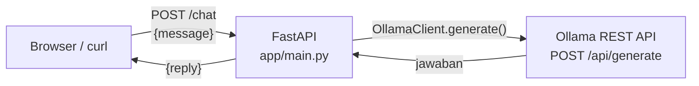
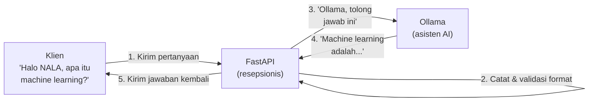

# Module 5: FastAPI & Koneksi ke Ollama

## Tujuan

Kita memahami FastAPI sebagai framework API, lalu membangun sendiri secara bertahap endpoint `/chat` NALA yang terhubung ke Ollama (di atas fondasi Docker yang sudah diverifikasi di Module 4) dan memakai `NALA_SYSTEM_PROMPT` hasil Module 3.

## Definisi

**FastAPI** adalah *framework* Python untuk membangun REST API — lapisan yang menerima request HTTP dari luar (browser, `curl`, aplikasi lain), memvalidasi bentuk datanya, memprosesnya, lalu mengembalikan response. Di NALA, FastAPI berperan sebagai "resepsionis" yang menerima pertanyaan user dan meneruskannya ke Ollama.

**REST API** (di module ini spesifik ke API bawaan Ollama sendiri, bukan API yang kita bangun) adalah sekumpulan endpoint HTTP yang sudah disediakan Ollama begitu servicenya menyala — dipakai lewat `curl` atau library HTTP seperti `httpx`, tanpa perlu CLI `ollama`. `OllamaClient` yang dibangun di module ini pada dasarnya cuma "membungkus" satu endpoint tertentu (`/api/generate`) dengan kode Python yang lebih nyaman dipakai berulang — permukaan lengkap REST API Ollama (`/api/chat`, `/api/tags`, `/api/embed`, dst) sudah dibahas di Module 4.

**Pydantic** adalah library Python untuk mendefinisikan "bentuk data yang wajib dipenuhi" — dipakai FastAPI untuk memvalidasi request yang masuk (`ChatRequest`) dan menstrukturkan response yang keluar (`ChatResponse`), otomatis menolak data yang salah bentuk sebelum kode kita sempat dijalankan.



## Hasil Akhir yang Diharapkan

- Kita paham alur request FastAPI ↔ Ollama serta konsep Pydantic request/response model
- Service `api` (FastAPI) berhasil ditambahkan ke `docker-compose.yml` di samping `ollama` yang sudah berjalan sejak Module 4
- Endpoint `/health` dan `/chat` di `app/main.py` berfungsi — `/chat` memanggil Ollama lewat `OllamaClient` dan mengembalikan jawaban
- Endpoint `/chat` sudah memakai `NALA_SYSTEM_PROMPT` hasil Module 3, terbukti dari jawaban yang berkarakter NALA, bukan lagi generik
- Kita paham kapan menggunakan `docker compose up --build` vs `up` vs `down` setiap kali kode diubah

## 1. Konsep Dasar FastAPI

FastAPI adalah framework Python modern untuk membangun API (Application Programming Interface). API adalah "pintu masuk" untuk aplikasi lain berkomunikasi dengan sistem Anda. Mari kita pahami FastAPI dari dua perspektif: **non-teknis** dan **teknis**.

### 1.1 Penjelasan Non-Teknis

**Bayangan Sederhana:**
Jika NALA adalah "asisten AI", maka FastAPI adalah "resepsionis" yang menerima pertanyaan dari klien (user, aplikasi lain, website) dan melempar pertanyaan tersebut ke asisten. Setelah asisten menjawab, resepsionis mengirim jawaban kembali ke klien.

**Alur Komunikasi (Non-teknis):**



**Keuntungan FastAPI untuk NALA:**
- **Cepat**: Salah satu framework tercepat di Python (comparable dengan Node.js)
- **Mudah**: Syntax clean dan intuitive; cocok untuk learners
- **Automatic documentation**: FastAPI auto-generate dokumentasi interaktif (Swagger UI)
- **Type safety**: Validasi input otomatis dengan Python type hints
- **Async-ready**: Support concurrent requests (banyak user sekaligus)

### 1.2 Penjelasan Teknis

#### 1.2.1 Struktur Dasar FastAPI, Bertahap

Daripada langsung ditunjukkan kode lengkap, mari bangun aplikasi FastAPI **secara bertahap dalam 3 tahap besar** — tiap tahap menambah satu kemampuan baru di atas tahap sebelumnya, dan bisa langsung dites sebelum lanjut ke tahap berikutnya:

1. **Tahap A — FastAPI saja**, belum tersambung ke Ollama sama sekali. Fokus: memahami `app`, endpoint, dan Pydantic model murni sebagai konsep HTTP API.
2. **Tahap B — Hubungkan ke Ollama**, pakai system prompt generik dulu (misal "Kamu adalah asisten AI"). Fokus: memahami cara FastAPI memanggil layanan lain (Ollama) dan meneruskan hasilnya sebagai response.
3. **Tahap C — Integrasikan system prompt NALA**, mengganti prompt generik dengan `NALA_SYSTEM_PROMPT` hasil latihan Module 3. Fokus: bagaimana satu baris konfigurasi (system prompt) mengubah kepribadian & batasan asisten, tanpa mengubah struktur endpoint sama sekali.

**Target akhirnya tetap satu file yang sama: `Nala/app/main.py`.** File ini sudah tersedia lengkap di starter code (sebagai referensi/jawaban) — ikuti Langkah 1-9 berikut untuk menulis ulang isinya sendiri bertahap sesuai 3 tahap di atas, lalu cocokkan hasil akhirnya di Langkah 9.

### Tahap A — FastAPI saja (belum ada Ollama)

**Langkah 1 — Buat aplikasi paling minimal**

1. Buka folder `Nala/app/`.
2. Buat (atau buka) file `main.py`.
3. Tulis dua baris ini sebagai isi paling awal:

```python
from fastapi import FastAPI

app = FastAPI()
```

Apa yang sebenarnya terjadi di dua baris ini?

- **`from fastapi import FastAPI`**: mengambil *class* `FastAPI` dari library FastAPI yang sudah di-install.
- **`app = FastAPI()`**: memanggil class tersebut untuk membuat satu **instance** (objek nyata) dari `FastAPI`, lalu menyimpannya ke variabel bernama `app`.

Kenapa butuh instance, bukan langsung pakai class-nya? Karena `app` inilah yang nanti jadi "wadah pusat" tempat semua endpoint didaftarkan (lihat Langkah 2), dan `app` juga yang nanti dirujuk oleh server saat menjalankan aplikasi (`uvicorn main:app` — dibahas di 1.2.6 — kata `app` di situ merujuk persis ke variabel ini). Nama variabelnya **harus** `app` (atau nama lain yang konsisten dipakai saat menjalankan server) — bukan aturan Python, tapi konvensi yang dipakai FastAPI/uvicorn untuk saling menemukan.

Baru dua baris, belum ada endpoint apa pun — tapi ini sudah aplikasi FastAPI yang valid. Di file asli `app/main.py`, baris ini ditulis sedikit lebih lengkap: `app = FastAPI(title="NALA")` — `title` dipakai untuk mempercantik dokumentasi otomatis (Swagger UI, lihat 1.2.6), tapi konsepnya sama persis. Boleh dulu tulis `FastAPI()` polos, nanti ditambah `title` di Langkah 8.

**▶️ Jalankan & lihat hasilnya**

Sampai sini `main.py` belum butuh Ollama sama sekali, jadi belum perlu Docker — cukup `uvicorn` lokal:

```bash
cd Nala
pip install fastapi uvicorn
uvicorn app.main:app --reload
```

Buka `http://127.0.0.1:8000` di browser. Yang muncul: `{"detail":"Not Found"}`. Ini **bukan error** — ini bukti nyata: servernya sudah menyala, tapi belum ada "pintu" (endpoint) yang didaftarkan ke `app`. Biarkan `uvicorn` tetap jalan (jangan `Ctrl+C` dulu — `--reload` akan otomatis membaca ulang file setiap kali disimpan), lanjut ke Langkah 2.

**Langkah 2 — Tambah satu endpoint paling sederhana**

Endpoint adalah "pintu" yang bisa diakses dari luar. Di file `main.py` yang sama, tambahkan endpoint paling sederhana: cek status.

1. Di bawah baris `app = FastAPI()`, tambahkan:

```python
@app.get("/health")
def health_check():
    return {"status": "ok"}
```

2. Simpan file.

- **`@app.get("/health")`**: ini disebut *decorator* — cara FastAPI tahu "kalau ada yang akses path `/health` dengan method GET, jalankan fungsi di bawah ini".
- **`def health_check(): return {"status": "ok"}`**: fungsi biasa, mengembalikan dictionary Python — FastAPI otomatis mengubahnya jadi JSON.

**▶️ Jalankan & lihat hasilnya**

Karena `uvicorn --reload` masih jalan dari Langkah 1, file otomatis ke-reload begitu disimpan (lihat log terminal: `Reloading...`). Buka terminal baru, lalu:

```bash
curl http://127.0.0.1:8000/health
```

Harus muncul `{"status":"ok"}` — beda dari `{"detail":"Not Found"}` di Langkah 1, karena sekarang `/health` sudah terdaftar. Sengaja belum ada endpoint `/chat` — itu langkah berikutnya, karena `/chat` butuh konsep tambahan: data yang dikirim *dari* klien (bukan cuma dikembalikan *ke* klien).

**Langkah 3 — Definisikan bentuk data yang diharapkan (Pydantic)**

Endpoint `/health` tadi gampang — dia tidak butuh apa-apa dari orang yang mengaksesnya, cuma dipanggil lalu jawab "ok". Tapi `/chat` beda: NALA perlu tahu dulu **apa pertanyaan** yang mau ditanyakan user. Di sinilah **Pydantic** dipakai — library Python untuk mendefinisikan "bentuk data yang wajib dipenuhi".

**Bayangkan begini:** sebelum kotak saran boleh diisi orang, biasanya disediakan dulu selembar formulir kosong, bukan kertas polos. Formulirnya sudah ada kolom bertuliskan "Pertanyaan Anda: ___________". Siapa pun yang mau bertanya, **wajib** isi kolom itu — tidak bisa kirim kertas kosong atau coret-coretan bebas. Pydantic itu fungsinya persis seperti formulir ini, tapi ditulis dalam kode.

### Apa Sebenarnya Pydantic Itu

Tanpa Pydantic, setiap endpoint yang menerima data harus divalidasi **manual**: cek apakah field-nya ada, cek tipe datanya benar, cek formatnya sesuai — semua ditulis sendiri dengan `if`/`else` berlapis, dan gampang ada yang kelupaan. Pydantic mengotomatiskan seluruh pengecekan itu lewat satu mekanisme: **Python type hints**.

```python
class ChatRequest(BaseModel):
    message: str
```

Baris `message: str` ini bukan sekadar komentar/dokumentasi seperti type hint biasa di Python murni — Pydantic benar-benar **membaca** anotasi tipe itu dan menegakkannya saat runtime. Kalau `message` tidak dikirim, atau dikirim sebagai angka bukan teks, Pydantic akan menolak data itu **sebelum** kode `def chat(...)` sempat dijalankan sama sekali.

**Contoh konkret — apa yang terjadi kalau data yang dikirim salah bentuk** (baru bisa dicoba nanti setelah endpoint `/chat` aktif di Langkah 7, tapi perilakunya sudah ditentukan oleh `ChatRequest` yang ditulis di langkah ini):

```bash
curl -X POST http://localhost:8000/chat \
  -H "Content-Type: application/json" \
  -d '{"pesan": "Halo"}'
```

Karena field yang dikirim namanya `pesan` (bukan `message`), FastAPI/Pydantic otomatis menjawab dengan status `422 Unprocessable Entity` dan detail error seperti ini — tanpa kode `chat()` Anda menulis satu baris pun logika validasi:

```json
{
  "detail": [
    {
      "type": "missing",
      "loc": ["body", "message"],
      "msg": "Field required"
    }
  ]
}
```

### Field Wajib vs Opsional, dan Tipe Data Lain

`ChatRequest` di NALA sengaja cuma punya satu field wajib (`message: str`) — tapi Pydantic mendukung pola yang lebih kaya, berguna diketahui walau belum dipakai NALA sekarang:

| Pola | Contoh | Artinya |
|---|---|---|
| Field wajib | `message: str` | Harus selalu dikirim, tipe harus `str` |
| Field opsional dengan default | `top_k: int = 3` | Boleh tidak dikirim — kalau tidak ada, otomatis bernilai `3` |
| Field opsional, boleh kosong (`None`) | `session_id: str \| None = None` | Boleh tidak dikirim, atau dikirim `null` — dua-duanya valid |
| Tipe list | `history: list[str] = []` | Menerima daftar/array, default-nya list kosong |
| Tipe bersarang (nested model) | `metadata: Metadata` (`Metadata` adalah `BaseModel` lain) | Menerima objek JSON bersarang, divalidasi rekursif |

**Kenapa `ChatRequest` NALA tidak pakai semua ini sekaligus?** Konsisten dengan pola berulang sepanjang training: mulai sesederhana mungkin (satu field wajib), baru diperluas **tepat saat dibutuhkan**. Kalau nanti NALA butuh parameter tambahan (misal `top_k` yang bisa diatur user), `ChatRequest` akan ditambah field baru dengan default value — bukan mengganti struktur yang sudah ada.

### Kenapa Validasi Otomatis Ini Penting untuk NALA

- **Keamanan dasar**: mencegah data yang bentuknya aneh/tidak terduga sampai ke `ollama_client.generate()` (dibangun Tahap B) — kalau `message` bisa berupa apa saja (termasuk `null` atau angka), kode di bawahnya harus menangani semua kemungkinan itu sendiri.
- **Dokumentasi otomatis**: definisi `ChatRequest`/`ChatResponse` ini juga yang dibaca FastAPI untuk membuat Swagger UI (`/docs`, dibahas Bagian 1.2.6) — jadi satu definisi, dua manfaat sekaligus (validasi + dokumentasi).
- **Error message yang jelas**: dibanding error generik "Internal Server Error", klien (misal `chat.html` nanti di Module 6) dapat tahu persis field mana yang salah dan kenapa, langsung dari response `422` di atas.

Masih di file `main.py` yang sama:

1. Di baris paling atas file, tambahkan import Pydantic: `from pydantic import BaseModel`
2. Di bawah `app = FastAPI()` (sebelum endpoint `/health`), tambahkan:

```python
class ChatRequest(BaseModel):
    message: str
```

Cara bacanya: **`ChatRequest`** ini nama "formulir"-nya (bebas dinamai apa saja, tapi dikasih nama yang menjelaskan isinya — "permintaan chat"). Di dalamnya cuma ada satu baris, `message: str` — artinya formulir ini punya **satu kolom wajib** bernama `message`, dan isinya **harus** berupa teks (`str`, singkatan dari *string*). Kalau nanti ada yang kirim data tanpa kolom `message`, atau isi `message` dengan angka, FastAPI akan **otomatis menolak** duluan sebelum kode Anda sempat dijalankan — Anda tidak perlu repot menulis pengecekan manual sendiri.

Perhatikan: sejauh ini baru **bikin formulirnya saja**. Belum ditempel ke pintu (endpoint) mana pun — itu baru terjadi nanti di Langkah 7.

**▶️ Jalankan & lihat hasilnya**

Simpan file, biarkan `uvicorn` reload. Belum ada endpoint baru yang memakai `ChatRequest`, jadi belum ada hal baru untuk di-`curl` — cukup pastikan **tidak ada error** di log terminal `uvicorn` (kalau ada salah ketik/indentasi, errornya akan langsung terlihat di sana). `curl http://127.0.0.1:8000/health` masih harus tetap `{"status":"ok"}` seperti Langkah 2, tanda file masih valid.

**Langkah 4 — Definisikan juga bentuk data yang dikembalikan**

Kalau Langkah 3 tadi formulir **untuk pertanyaan yang masuk**, Langkah 4 ini formulir **untuk jawaban yang keluar** — semacam "struk balasan" yang dikembalikan NALA ke user. Tambahkan tepat di bawah `ChatRequest`:

```python
class ChatResponse(BaseModel):
    reply: str
```

Polanya sama persis seperti Langkah 3: nama "formulir"-nya `ChatResponse`, dan cuma ada satu kolom wajib, `reply` (isinya teks) — ini yang nanti diisi jawaban NALA. Sekarang ada dua "formulir": `ChatRequest` (apa yang **masuk**, dari user) dan `ChatResponse` (apa yang **keluar**, dari NALA). Keduanya masih murni Pydantic — belum tersambung ke Ollama sama sekali, baru "cetakan"-nya saja.

**▶️ Jalankan & lihat hasilnya**

Sama seperti Langkah 3 — simpan, cek log `uvicorn` tidak error, `curl .../health` masih `{"status":"ok"}`. Setelah ini, `Ctrl+C` di terminal `uvicorn` untuk berhenti — mulai Langkah 7, cara menjalankannya berpindah ke Docker.

<details>
<summary><strong>Pakai Claude Code? Salin prompt berikut, paste untuk eksekusi Langkah 1-4</strong></summary>

```
Tulis app/main.py NALA Tahap A — murni FastAPI, BELUM ada koneksi
ke Ollama sama sekali.

GOAL:
- Buat/timpa Nala/app/main.py persis
  isinya:

  from fastapi import FastAPI
  from pydantic import BaseModel

  app = FastAPI()


  class ChatRequest(BaseModel):
      message: str


  class ChatResponse(BaseModel):
      reply: str


  @app.get("/health")
  def health_check():
      return {"status": "ok"}

CONTEXT:
- Ini tahap paling awal endpoint /chat NALA — ChatRequest/ChatResponse
  didefinisikan tapi SENGAJA belum dipakai di endpoint mana pun.
- File ini dites lewat `uvicorn app.main:app --reload` (bukan Docker),
  jadi tidak butuh Ollama, docker-compose.yml, atau Dockerfile aktif.

GUARDRAIL:
- JANGAN tambahkan endpoint /chat — itu baru Tahap B.
- JANGAN import atau sentuh app/ollama_client.py, app/system_prompt.py
  — keduanya belum relevan di tahap ini.
- JANGAN tambahkan `title="NALA"` ke `FastAPI()` — itu detail Langkah
  6, bukan di sini.
```

</details>

**📄 Kode lengkap Tahap A** (murni FastAPI, belum ada Ollama sama sekali):

```python
from fastapi import FastAPI
from pydantic import BaseModel

app = FastAPI()


class ChatRequest(BaseModel):
    message: str


class ChatResponse(BaseModel):
    reply: str


@app.get("/health")
def health_check():
    return {"status": "ok"}
```

Perhatikan: `ChatRequest` dan `ChatResponse` sudah ada, tapi **belum dipakai di endpoint mana pun** — belum ada `/chat`. Itu jugalah kenapa file ini masih bisa jalan hanya dengan `uvicorn`, tanpa Docker/Ollama sama sekali.

⚠️ **Kenapa pindah ke Docker mulai Langkah 7:** `/chat` akan memanggil Ollama, dan Ollama di sini jalan sebagai **container terpisah** (service `ollama` di `docker-compose.yml`) — bukan proses yang bisa diakses `uvicorn` lokal. `docker compose up --build` di Langkah 7 akan **build image** service `api` dari `Dockerfile` (isinya persis `main.py` Anda + dependency di `requirements.txt`) dan menyambungkannya ke `ollama` lewat `docker-compose.yml` (`OLLAMA_BASE_URL=http://ollama:11434`).

### Tahap B — Hubungkan ke Ollama (system prompt generik dulu)

FastAPI-nya sudah siap (Tahap A). Ollama sendiri sudah dinyalakan & diverifikasi jalan di Docker sejak Module 4 — kalau belum, selesaikan dulu di sana sebelum lanjut. Sekarang keduanya disambungkan lewat Docker.

**Langkah 5 — Buat `Dockerfile`**

Sebelum `docker-compose.yml` bisa mem-*build* service `api`, `Dockerfile`-nya harus **sudah ada duluan** — `docker-compose.yml` di Langkah 6 nanti cuma **merujuk** ke `Dockerfile` ini lewat `build: .`, bukan mendefinisikan isinya. Urutannya penting: menulis `build: .` di `docker-compose.yml` sebelum `Dockerfile`-nya ada akan menghasilkan error `failed to read dockerfile` begitu `docker compose up` dijalankan.

Buat file baru `Nala/Dockerfile` (persis nama itu, tanpa ekstensi apa pun):

```dockerfile
FROM python:3.11-slim

WORKDIR /app

COPY requirements.txt .
RUN pip install --no-cache-dir -r requirements.txt

COPY app ./app

CMD ["uvicorn", "app.main:app", "--host", "0.0.0.0", "--port", "8000"]
```

**Penjelasan tiap baris:**
- **`FROM python:3.11-slim`** — base image: mulai dari image resmi Python 3.11 versi "slim" (lebih kecil dari image Python biasa, cuma berisi yang perlu untuk menjalankan Python). Ini instruksi **wajib jadi baris pertama** setiap Dockerfile — menentukan image dasar yang jadi titik tolak.
- **`WORKDIR /app`** — menetapkan `/app` sebagai working directory **di dalam container**; semua instruksi `COPY`/`RUN` setelah ini berjalan relatif terhadap folder ini.
- **`COPY requirements.txt .`** — salin `requirements.txt` dari `Nala/` (di laptop Anda) ke `/app/` (di dalam image). Sengaja **cuma file ini dulu**, bukan seluruh folder — alasannya di catatan layer caching di bawah.
- **`RUN pip install --no-cache-dir -r requirements.txt`** — install semua dependency Python (FastAPI, `httpx`, dll) ke dalam image, persis saat image di-*build* (bukan saat container dijalankan).
- **`COPY app ./app`** — baru sekarang folder `app/` (kode `main.py`, `ollama_client.py`, dst) disalin ke image.
- **`CMD [...]`** — perintah yang dijalankan **saat container start** (bukan saat build): menyalakan `uvicorn` untuk serve `app.main:app` di `0.0.0.0:8000` — pola yang sama seperti `uvicorn app.main:app --reload` yang Anda jalankan manual di Langkah 1, cuma tanpa `--reload` (reload otomatis cuma berguna untuk development lokal, bukan container production) dan `--host 0.0.0.0` (supaya bisa diakses dari luar container, bukan cuma `127.0.0.1` di dalamnya sendiri).

**Kenapa `requirements.txt` di-*copy* dan di-*install* terpisah, sebelum `COPY app ./app`?** Ini pola *layer caching* Docker: tiap instruksi (`COPY`, `RUN`) jadi satu "layer" yang di-cache. Kalau cuma kode di `app/` yang berubah (skenario paling sering selama Anda coding), Docker bisa **memakai ulang** layer `pip install` yang sudah di-cache — tidak perlu install ulang semua dependency dari nol setiap kali `main.py` diedit. Rebuild jadi jauh lebih cepat (detik, bukan menit) — inilah yang membuat `docker compose up --build api` di langkah-langkah berikutnya terasa ringan setelah build pertama.

**▶️ Jalankan & lihat hasilnya**

Belum ada `docker-compose.yml` yang merujuk ke `Dockerfile` ini (itu Langkah 6), jadi belum bisa langsung di-build sendiri lewat `docker compose`. Cukup pastikan filenya tersimpan dengan nama & isi yang benar:

```bash
cd Nala
cat Dockerfile
```

<details>
<summary><strong>Pakai Claude Code? Salin prompt berikut, paste untuk eksekusi Langkah 5</strong></summary>

```
Buat Dockerfile untuk service api NALA — BELUM mengubah
docker-compose.yml sama sekali di langkah ini.

GOAL:
- Buat/timpa Nala/Dockerfile persis isinya:

  FROM python:3.11-slim

  WORKDIR /app

  COPY requirements.txt .
  RUN pip install --no-cache-dir -r requirements.txt

  COPY app ./app

  CMD ["uvicorn", "app.main:app", "--host", "0.0.0.0", "--port", "8000"]

CONTEXT:
- Ini Dockerfile untuk service `api` yang akan dirujuk lewat `build: .`
  di docker-compose.yml pada Langkah 6 — belum dipakai di langkah ini.

GUARDRAIL:
- JANGAN ubah docker-compose.yml — itu Langkah 6.
- JANGAN ubah urutan instruksi (COPY requirements.txt sebelum RUN pip
  install, sebelum COPY app ./app) — urutan ini sengaja untuk layer
  caching Docker.
```

</details>

**Langkah 6 — Tambahkan service `api` ke `docker-compose.yml`**

`Dockerfile` sudah ada dari Langkah 5. Sekarang buka `docker-compose.yml`, tambahkan blok `api` di samping `ollama` — blok ini yang akan **merujuk** ke `Dockerfile` itu lewat `build: .`:

```yaml
services:
  ollama:
    image: ollama/ollama:latest
    ports:
      - "11434:11434"
    volumes:
      - ollama_data:/root/.ollama

  api:
    build: .
    ports:
      - "8000:8000"
    environment:
      - OLLAMA_BASE_URL=http://ollama:11434
      - OLLAMA_MODEL=llama3.2:3b
    depends_on:
      - ollama

volumes:
  ollama_data:
```

**Penjelasan blok `api`:**
- **`build: .`** — beda dari `ollama` yang pakai `image:` (image jadi dari Docker Hub), `api` di-**build** dari `Dockerfile` yang baru dibuat di Langkah 5 — sehingga dependency Python (FastAPI, `httpx`, dll di `requirements.txt`) ter-install ke dalam image custom ini.
- **`environment: OLLAMA_BASE_URL=http://ollama:11434`** — perhatikan host-nya `ollama`, **bukan** `localhost`. Di dalam jaringan internal Docker Compose, tiap service bisa saling memanggil pakai **nama service**-nya sebagai hostname — `api` memanggil `ollama` lewat nama itu, bukan lewat `localhost:11434` seperti kalau Anda mengetes dari laptop langsung (section 3.4 Langkah D).
- **`depends_on: - ollama`** — memberi tahu Docker Compose untuk menyalakan `ollama` **lebih dulu** sebelum `api`. Ini cuma menjamin urutan start container, **bukan** menjamin Ollama sudah selesai loading model saat `api` mulai menerima request — itu sebabnya Ollama diverifikasi sehat dulu secara terpisah di section 3.4, bukan diandalkan ke `depends_on` saja.

Untuk "menghubungi" Ollama dari kode Python, dibutuhkan beberapa file tambahan:

1. `app/ollama_client.py` — isinya class `OllamaClient` (menggunakan library `httpx` untuk memanggil API Ollama lewat HTTP).
2. `app/__init__.py` — file kosong (0 baris), tapi keberadaannya wajib: ini yang membuat Python mengenali folder `app/` sebagai *package*, supaya `from app.ollama_client import ...` bisa jalan.

**Pre-flight check**

- [ ] `app/__init__.py` ada (boleh kosong, 0 baris)
- [ ] `app/ollama_client.py` ada

```bash
ls app/
```

> ⚠️ **Kalau `ollama_client.py` tidak ada** (pernah terjadi kalau folder `app/` di-duplikat lewat Finder/VS Code — "duplicate" kadang memindah, bukan menyalin), buat manual dengan isi berikut:
> ```python
> # app/ollama_client.py
> import httpx
>
>
> class OllamaClient:
>     def __init__(self, base_url: str, model: str):
>         self.base_url = base_url
>         self.model = model
>
>     def generate(self, system_prompt: str, user_message: str) -> str:
>         with httpx.Client() as client:
>             response = client.post(
>                 f"{self.base_url}/api/generate",
>                 json={
>                     "model": self.model,
>                     "system": system_prompt,
>                     "prompt": user_message,
>                     "stream": False,
>                 },
>                 timeout=60.0,
>             )
>             response.raise_for_status()
>             return response.json()["response"]
> ```
> **Penjelasan Singkat**
> - **`__init__(self, base_url, model)`**: ini *constructor* — kode yang otomatis jalan sekali, tepat saat `OllamaClient(...)` dipanggil (lihat Langkah 7, `ollama_client = OllamaClient(...)`). Tugasnya cuma menyimpan `base_url` (alamat server Ollama, misal `http://ollama:11434`) dan `model` (nama model, misal `llama3.2:3b`) ke dalam objeknya sendiri (`self.base_url`, `self.model`), supaya nanti bisa dipakai lagi di method lain — tanpa perlu diketik ulang tiap kali.
> - **`generate(self, system_prompt, user_message)`**: ini method yang **benar-benar mengirim pertanyaan ke Ollama** dan menunggu jawabannya. Alurnya: (1) susun request HTTP `POST` ke `{base_url}/api/generate` — endpoint bawaan Ollama — berisi `model`, `system` (system prompt), dan `prompt` (pertanyaan user); (2) `response.raise_for_status()` melempar error kalau Ollama merespons gagal (misal model belum di-pull); (3) `response.json()["response"]` mengambil teks jawabannya saja dari balasan Ollama, lalu dikembalikan sebagai string biasa. Inilah yang dipanggil `main.py` lewat `ollama_client.generate(system_prompt=..., user_message=...)` di Langkah 7.
>
> Kalau `__init__.py` juga tidak ada, buat file kosong dengan nama itu — tanpa file ini, `from app.ollama_client import ...` gagal dengan `ModuleNotFoundError: No module named 'app.ollama_client'` (persis error kalau `ollama_client.py` sendiri yang hilang). Error yang sama padahal kedua file sudah ada → cek `python3 -m pip show httpx`.

> ⚠️ **Kalau muncul `ModuleNotFoundError: No module named 'httpx'` saat Anda coba jalankan dengan `uvicorn` lokal**: itu tandanya `httpx` belum ter-install di Python lokal Anda — wajar, karena `httpx` cuma otomatis ter-install **di dalam container** lewat `requirements.txt`, bukan di komputer Anda langsung. Kalau sekadar mau membetulkan error importnya: `python3 -m pip install httpx` (atau `pip3 install httpx`). Tapi ingat: **mulai Tahap B ini seharusnya dijalankan pakai `docker compose up --build`, bukan `uvicorn` lokal** — walau error `httpx` sudah beres, `uvicorn` lokal tetap akan gagal manggil `/chat` karena tidak ada Ollama yang bisa dihubungi di `http://localhost:11434` dari luar container.

**Langkah 7 — Tambahkan koneksi ke Ollama dengan system prompt generik**

1. Tambah import di baris atas: `import os` dan `from app.ollama_client import OllamaClient`.
2. Buat instance-nya di bawah `app = FastAPI()`:
   ```python
   ollama_client = OllamaClient(
       base_url=os.environ.get("OLLAMA_BASE_URL", "http://localhost:11434"),
       model=os.environ.get("OLLAMA_MODEL", "llama3.2:3b"),
   )
   ```
3. Tambahkan endpoint `/chat`, memakai dua model dari Langkah 3-4, dengan system prompt **generik dulu** (bukan `NALA_SYSTEM_PROMPT` — itu Tahap C):
   ```python
   @app.post("/chat", response_model=ChatResponse)
   def chat(request: ChatRequest) -> ChatResponse:
       reply = ollama_client.generate(
           system_prompt="Kamu adalah asisten AI yang menjawab singkat dan jelas.",
           user_message=request.message,
       )
       return ChatResponse(reply=reply)
   ```

**Penjelasan Singkat**

- **`@app.post("/chat", ...)`**: beda dari `/health` (GET) — **POST**, karena klien mengirim data, bukan cuma menerima.
- **`request: ChatRequest`**: FastAPI otomatis baca JSON masuk & validasi sesuai `ChatRequest` (Langkah 3); data salah bentuk otomatis ditolak sebelum masuk fungsi.
- **`ollama_client.generate(...)`**: titik hubung FastAPI ↔ Ollama — mengirim request, menunggu jawaban.
- **`ChatResponse(reply=reply)`**: dibungkus balik jadi JSON sesuai `ChatResponse` (Langkah 4).

**Jalankan**

Simpan file. Mulai dari sini pakai Docker (bukan `uvicorn` lagi):

```bash
cd Nala
docker compose up --build
```

Docker Compose cukup pintar untuk tidak membuat ulang container yang sudah berjalan dan tidak berubah konfigurasinya — `ollama` (sudah menyala sejak Module 4) langsung dipakai apa adanya, yang benar-benar di-*build* dan dinyalakan di sini cuma `api`. Kalau log menunjukkan `ollama` langsung "Up" tanpa proses pull image, itu perilaku normal, bukan error.

**Output yang Diharapkan**
```
... Uvicorn running on http://0.0.0.0:8000
```

Model `llama3.2:3b` **tidak perlu** di-pull ulang di sini — sudah dilakukan di Module 4 Langkah 3, dan tersimpan permanen di volume `ollama_data` selama volume itu tidak dihapus. Kalau ingin memastikan, cek lagi:
```bash
docker compose exec ollama ollama list
```

Tes kedua endpoint:
```bash
curl http://localhost:8000/health
curl -X POST http://localhost:8000/chat \
  -H "Content-Type: application/json" \
  -d '{"message": "Halo, kamu siapa?"}'
```

✅ **Indikator sukses**: `/health` → `{"status":"ok"}`. `/chat` → jawaban **generik** ("saya asisten AI..."), belum berkarakter NALA — wajar, system prompt-nya masih placeholder. Biarkan `docker compose up` tetap berjalan, lanjut ke Langkah 8.

<details>
<summary><strong>Pakai Claude Code? Salin prompt berikut, paste untuk eksekusi Langkah 6-7</strong></summary>

```
Sambungkan NALA ke Ollama — tambah service api ke docker-compose.yml,
buat ollama_client.py, dan tambah endpoint /chat dengan system prompt
GENERIK dulu (bukan NALA_SYSTEM_PROMPT).

GOAL:
1. Di Nala/docker-compose.yml, tambahkan
   blok `api` di samping `ollama` yang sudah ada:

   api:
     build: .
     ports:
       - "8000:8000"
     environment:
       - OLLAMA_BASE_URL=http://ollama:11434
       - OLLAMA_MODEL=llama3.2:3b
     depends_on:
       - ollama

2. Buat Nala/app/ollama_client.py:

   import httpx


   class OllamaClient:
       def __init__(self, base_url: str, model: str):
           self.base_url = base_url
           self.model = model

       def generate(self, system_prompt: str, user_message: str) -> str:
           with httpx.Client() as client:
               response = client.post(
                   f"{self.base_url}/api/generate",
                   json={
                       "model": self.model,
                       "system": system_prompt,
                       "prompt": user_message,
                       "stream": False,
                   },
                   timeout=60.0,
               )
               response.raise_for_status()
               return response.json()["response"]

3. Buat file kosong (0 baris) Nala/app/__init__.py
   kalau belum ada.

4. Di Nala/app/main.py, tambahkan di
   baris atas: `import os` dan
   `from app.ollama_client import OllamaClient`. Di bawah
   `app = FastAPI()`, tambahkan:

   ollama_client = OllamaClient(
       base_url=os.environ.get("OLLAMA_BASE_URL", "http://localhost:11434"),
       model=os.environ.get("OLLAMA_MODEL", "llama3.2:3b"),
   )

   Lalu tambahkan endpoint baru di bagian bawah file (setelah /health):

   @app.post("/chat", response_model=ChatResponse)
   def chat(request: ChatRequest) -> ChatResponse:
       reply = ollama_client.generate(
           system_prompt="Kamu adalah asisten AI yang menjawab singkat dan jelas.",
           user_message=request.message,
       )
       return ChatResponse(reply=reply)

CONTEXT:
- Service `ollama` di docker-compose.yml sudah ada dan sudah
  diverifikasi berjalan (Module 4) — jangan diubah, cuma
  ditambah blok `api` di sampingnya.
- `ChatRequest`/`ChatResponse` sudah ada di main.py dari Tahap A —
  JANGAN didefinisikan ulang, cukup dipakai di endpoint baru.
- System prompt di langkah ini SENGAJA masih string generik — draft
  `NALA_SYSTEM_PROMPT` baru dipasang di Langkah 8 (Tahap C).

GUARDRAIL:
- JANGAN pakai `NALA_SYSTEM_PROMPT` atau import
  `app.system_prompt` di tahap ini — itu Tahap C.
- JANGAN ubah endpoint `/health` yang sudah ada.
- JANGAN ubah service `ollama` yang sudah ada di docker-compose.yml,
  cuma tambahkan blok `api`.
```

</details>

**Kapan pakai command Docker yang mana**

Mulai sini sampai akhir Tahap C, Anda akan bolak-balik edit kode lalu perlu menjalankannya lagi. Command yang dipakai **beda-beda tergantung apa yang diubah**:

| Situasi | Command | Kenapa |
|---|---|---|
| Ubah isi `main.py`, `system_prompt.py`, atau file lain di `app/` | `docker compose up --build api` | `docker-compose.yml` **tidak** me-mount folder `app/` ke dalam container — kode di-`COPY` ke image cuma sekali saat `build` (lihat `Dockerfile`). `restart` cuma menyalakan ulang container dari image yang sama persis, jadi kode lama yang tetap terpakai. Rebuild ini **cepat** (beberapa detik) karena layer `pip install` di-cache — cuma langkah `COPY app ./app` yang diulang. |
| Ubah `requirements.txt` atau `Dockerfile` | `docker compose up --build api` | Command sama persis seperti di atas — bedanya cuma rebuild-nya **lebih lambat**, karena layer `pip install` ikut di-*invalidate* dan harus jalan ulang, bukan cuma layer `COPY app`. |
| Mau berhenti sepenuhnya (tutup laptop, selesai sesi latihan) | `docker compose down` | Mematikan **dan menghapus** container (bukan cuma pause) — port `8000`/`11434` jadi bebas lagi. Model Ollama yang sudah di-*pull* **tidak ikut hilang** (tersimpan di volume `ollama_data`, lihat `docker-compose.yml`). |
| Mau lanjut lagi setelah `down`, tidak ada perubahan kode sejak terakhir | `docker compose up` (tanpa `--build`) | Image sebelumnya masih ada dan masih sesuai kode terakhir, tidak perlu dibangun ulang dari nol — lebih cepat. |
| Container `api` error/nyangkut, tidak jelas kenapa | `docker compose down` lalu `docker compose up --build` | "Matikan total, nyalakan dari nol" — cara paling ampuh membersihkan state yang aneh. |

> 💡 **Aturan cepat**: `restart` **tidak pernah cukup** untuk perubahan kode apa pun di setup ini — selalu `docker compose up --build api` setiap kali file di `app/`, `requirements.txt`, atau `Dockerfile` berubah. Satu-satunya yang berbeda adalah kecepatannya (detik vs lebih lama), bukan apakah `--build`-nya perlu atau tidak.

**📄 Kode lengkap Tahap B** (sudah tersambung ke Ollama, system prompt masih generik):

```python
import os

from fastapi import FastAPI
from pydantic import BaseModel

from app.ollama_client import OllamaClient

app = FastAPI()

ollama_client = OllamaClient(
    base_url=os.environ.get("OLLAMA_BASE_URL", "http://localhost:11434"),
    model=os.environ.get("OLLAMA_MODEL", "llama3.2:3b"),
)


class ChatRequest(BaseModel):
    message: str


class ChatResponse(BaseModel):
    reply: str


@app.get("/health")
def health_check():
    return {"status": "ok"}


@app.post("/chat", response_model=ChatResponse)
def chat(request: ChatRequest) -> ChatResponse:
    reply = ollama_client.generate(
        system_prompt="Kamu adalah asisten AI yang menjawab singkat dan jelas.",
        user_message=request.message,
    )
    return ChatResponse(reply=reply)
```

Dibandingkan **Kode lengkap Tahap A**, yang berubah cuma 3 hal: (1) tambah `import os` dan `from app.ollama_client import OllamaClient`, (2) tambah baris `ollama_client = OllamaClient(...)`, dan (3) endpoint `/chat` sekarang benar-benar terisi (sebelumnya cuma "cetakan" `ChatRequest`/`ChatResponse` yang belum dipakai).

### Tahap C — Integrasikan system prompt NALA

**Langkah 8 — Ganti system prompt generik dengan `NALA_SYSTEM_PROMPT`**

Di Langkah 7, asisten AI-nya sudah tersambung, tapi "kepribadiannya" masih generik — cuma dibisiki "kamu asisten AI yang menjawab singkat dan jelas". **System prompt** itu ibarat **briefing** yang diberikan ke asisten sebelum dia mulai kerja: siapa dia, tugasnya apa, batasannya apa. Sekarang briefing generik itu diganti dengan briefing yang sesungguhnya, khusus untuk NALA.

File tetangga kedua yang dibutuhkan adalah `app/system_prompt.py` — isinya satu konstanta, `NALA_SYSTEM_PROMPT = "..."`, yaitu **hasil latihan Module 3** (Prompt Engineering Dasar) yang sudah Anda susun sendiri di sana. File ini cuma "membungkus" teks briefing itu jadi konstanta Python.

**✅ Cek dulu sebelum lanjut**: `ls app/` — harus ada `system_prompt.py`. Kalau belum ada, buat filenya manual, isinya konstanta `NALA_SYSTEM_PROMPT` dengan teks hasil latihan Module 3 Anda sendiri, contoh bentuknya:

```python
# app/system_prompt.py
NALA_SYSTEM_PROMPT = """Kamu adalah NALA, asisten AI internal PT Nusantara Finance.
Tugasmu adalah menjawab pertanyaan staff seputar SOP, kebijakan, dan data operasional perusahaan.
Aturan:
- Jawab singkat, jelas, dan dalam Bahasa Indonesia.
- Jika kamu tidak yakin atau informasinya tidak tersedia, katakan dengan jujur bahwa kamu tidak memiliki informasi tersebut. Jangan mengarang jawaban.
- Jangan menjawab pertanyaan di luar konteks pekerjaan PT Nusantara Finance.
"""
```

Ganti isi teksnya sesuai hasil latihan Module 3 Anda sendiri — contoh di atas cuma template kalau filenya hilang/belum dibuat. Kalau nanti mau bereksperimen ulang dengan isi prompt-nya, edit file ini (lihat bagian Panduan Praktik di bawah, Langkah 8) — bukan tulis ulang `main.py`.

1. Tambahkan import: `from app.system_prompt import NALA_SYSTEM_PROMPT`
2. Di endpoint `/chat`, ganti string generik dari Langkah 7 dengan `NALA_SYSTEM_PROMPT`:

```python
@app.post("/chat", response_model=ChatResponse)
def chat(request: ChatRequest) -> ChatResponse:
    reply = ollama_client.generate(
        system_prompt=NALA_SYSTEM_PROMPT,
        user_message=request.message,
    )
    return ChatResponse(reply=reply)
```

Perhatikan: **struktur endpoint sama sekali tidak berubah** dari Langkah 7 — cuma satu argumen yang diganti. Ini poin pentingnya: system prompt adalah *konfigurasi kepribadian & batasan* asisten, terpisah total dari *struktur* endpoint-nya. Ganti isi `NALA_SYSTEM_PROMPT` kapan pun tanpa perlu menyentuh `main.py`.

**▶️ Jalankan & lihat hasilnya**

`docker compose up` dari Langkah 7 masih boleh tetap jalan. Simpan file, lalu rebuild `api` supaya kode terbaru terbaca — cukup cepat karena cuma `system_prompt.py`/`main.py` yang berubah, bukan `requirements.txt` (lihat tabel "Kapan pakai command Docker yang mana" di atas: `restart` saja **tidak cukup**, kode di-`COPY` ke image cuma sekali saat `build`):

```bash
docker compose up --build api
```

Ulangi tes `/chat` yang **sama persis** seperti di Langkah 7:

```bash
curl -X POST http://localhost:8000/chat \
  -H "Content-Type: application/json" \
  -d '{"message": "Halo, kamu siapa?"}'
```

Bandingkan jawabannya dengan Langkah 7: sekarang harus terasa lebih spesifik sesuai aturan di `NALA_SYSTEM_PROMPT` (jawab dalam Bahasa Indonesia, tidak mengarang jawaban, dsb) — bukan lagi jawaban generik "saya asisten AI...".

<details>
<summary><strong>Pakai Claude Code? Salin prompt berikut, paste untuk eksekusi Langkah 8</strong></summary>

```
Ganti system prompt generik di /chat dengan NALA_SYSTEM_PROMPT hasil
Module 3.

GOAL:
1. Buat Nala/app/system_prompt.py kalau
   belum ada, isinya satu konstanta NALA_SYSTEM_PROMPT — isi teksnya
   ambil dari draft hasil latihan Module 3 (System Prompt NALA v1)
   yang sudah divalidasi di sana. Kalau belum punya draft sendiri,
   pakai contoh ini sebagai placeholder:

   NALA_SYSTEM_PROMPT = """Kamu adalah NALA, asisten AI internal PT Nusantara Finance.
   Tugasmu adalah menjawab pertanyaan staff seputar SOP, kebijakan, dan data operasional perusahaan.
   Aturan:
   - Jawab singkat, jelas, dan dalam Bahasa Indonesia.
   - Jika kamu tidak yakin atau informasinya tidak tersedia, katakan dengan jujur bahwa kamu tidak memiliki informasi tersebut. Jangan mengarang jawaban.
   - Jangan menjawab pertanyaan di luar konteks pekerjaan PT Nusantara Finance.
   """

2. Di Nala/app/main.py, tambahkan
   import: `from app.system_prompt import NALA_SYSTEM_PROMPT`.
3. Di endpoint `/chat`, ganti argumen `system_prompt="Kamu adalah
   asisten AI yang menjawab singkat dan jelas."` menjadi
   `system_prompt=NALA_SYSTEM_PROMPT`. Tidak ada bagian lain dari
   endpoint yang berubah.

CONTEXT:
- Endpoint `/chat` dan `OllamaClient` sudah lengkap dari Tahap B —
  hanya satu argumen yang diganti di sini, strukturnya tetap sama.

GUARDRAIL:
- JANGAN ubah struktur endpoint `/chat` selain argumen
  `system_prompt` — tidak ada parameter baru, tidak ada endpoint baru.
- JANGAN ubah `app/ollama_client.py` atau `docker-compose.yml` sama
  sekali di langkah ini.
```

</details>

**📄 Kode lengkap Tahap C** dibandingkan **Kode lengkap Tahap B**: hanya 2 baris yang berubah — `system_prompt="Kamu adalah asisten AI..."` (string generik) diganti `system_prompt=NALA_SYSTEM_PROMPT` (import dari `app/system_prompt.py`), plus satu baris import tambahan di atas. **Tidak ada satu pun baris struktur endpoint yang berubah** — itulah inti pelajaran Tahap C.

**Langkah 9 — Bandingkan dengan file aslinya**

Setelah Langkah 1-9 (Tahap A-C), file `main.py` Anda seharusnya berisi ini — ini juga sekaligus **Kode lengkap Tahap C**, versi final (susunan file boleh sedikit beda, isinya yang harus sama):

```python
import os

from fastapi import FastAPI
from pydantic import BaseModel

from app.ollama_client import OllamaClient
from app.system_prompt import NALA_SYSTEM_PROMPT

app = FastAPI(title="NALA")

ollama_client = OllamaClient(
    base_url=os.environ.get("OLLAMA_BASE_URL", "http://localhost:11434"),
    model=os.environ.get("OLLAMA_MODEL", "llama3.2:3b"),
)


class ChatRequest(BaseModel):
    message: str


class ChatResponse(BaseModel):
    reply: str


@app.get("/health")
def health() -> dict:
    return {"status": "ok"}


@app.post("/chat", response_model=ChatResponse)
def chat(request: ChatRequest) -> ChatResponse:
    reply = ollama_client.generate(
        system_prompt=NALA_SYSTEM_PROMPT,
        user_message=request.message,
    )
    return ChatResponse(reply=reply)
```

Buka file asli `Nala/app/main.py` dan bandingkan — ini persis isinya. Kalau tiap langkah/tahap di atas sudah masuk akal, file ini seharusnya juga langsung masuk akal, meski susunan baris atau nama variabel Anda sedikit berbeda.

Detail lengkap menjalankan stack ini termasuk troubleshooting (error Docker, port bentrok, dll) ada di bagian Panduan Praktik di bawah.

#### 1.2.2 HTTP Method & Semantics

| Method | Semantik | Contoh Use Case |
|--------|----------|-----------------|
| **GET** | Retrieve data (safe, idempotent) | `/health` — cek status service |
| **POST** | Create/process data (can modify state) | `/chat` dengan request body — process pertanyaan |
| **PUT** | Replace resource | `/config/{id}` — update konfigurasi model |
| **DELETE** | Remove resource | `/chat-history/{id}` — delete riwayat chat |

Untuk NALA, **GET** dan **POST** adalah yang paling penting.

#### 1.2.3 Request-Response Model (Pydantic)

Pydantic adalah library untuk data validation dan parsing. Pydantic model define struktur data yang diharapkan.

**Contoh:**

```python
from pydantic import BaseModel

class ChatRequest(BaseModel):
    """Model untuk request ke NALA"""
    message: str  # Required

class ChatResponse(BaseModel):
    """Model untuk response dari NALA"""
    reply: str

@app.post("/chat", response_model=ChatResponse)
def chat(request: ChatRequest) -> ChatResponse:
    """
    Endpoint dengan input validation dan output schema
    - Input: ChatRequest (auto-validated)
    - Output: ChatResponse (JSON schema enforced)
    """
    # Process pertanyaan
    reply = ollama_client.generate(system_prompt=NALA_SYSTEM_PROMPT, user_message=request.message)

    # Return response sesuai ChatResponse schema
    return ChatResponse(reply=reply)
```

**Keuntungan Pydantic:**
- **Auto-validation**: Jika client kirim data yang salah (misalnya `temperature: "not-a-number"`), Pydantic auto-reject dengan error message
- **Auto-serialization**: Python object → JSON otomatis
- **Auto-documentation**: Pydantic schema → OpenAPI schema → Swagger UI

#### 1.2.4 Async/Await untuk Concurrent Requests

FastAPI support async handling, memungkinkan multiple requests diproses sekaligus tanpa blocking.

```python
import httpx
from fastapi import FastAPI
from pydantic import BaseModel

from app.system_prompt import NALA_SYSTEM_PROMPT  # hasil latihan Module 3

app = FastAPI()

class ChatRequest(BaseModel):
    message: str

class ChatResponse(BaseModel):
    reply: str

# Async function untuk call external API (Ollama)
async def ask_ollama(message: str, model: str, system_prompt: str):
    """Non-blocking call ke Ollama API"""
    async with httpx.AsyncClient() as client:
        response = await client.post(
            "http://ollama:11434/api/generate",
            json={
                "model": model,
                "prompt": message,
                "system": system_prompt,  # system prompt NALA v1 dari Module 3
                "stream": False,          # tanpa ini, Ollama mengembalikan newline-delimited
                                          # JSON per token, bukan satu objek JSON utuh
            }
        )
    return response.json()

@app.post("/chat", response_model=ChatResponse)
async def chat(request: ChatRequest) -> ChatResponse:
    """
    Async endpoint — dapat handle multiple requests concurrently
    Input tetap lewat Pydantic model (ChatRequest), bukan raw query parameter
    """
    result = await ask_ollama(request.message, model="llama3.2:3b", system_prompt=NALA_SYSTEM_PROMPT)
    return ChatResponse(reply=result["response"])

# Simulasi: 2 requests bisa diproses "simultaneously"
# Request 1: async function menunggu response dari Ollama → tidak block
# Request 2: selama Request 1 menunggu, FastAPI process Request 2
```

#### 1.2.5 Routing & Path Parameters

```python
class MessageRequest(BaseModel):
    message: str

@app.get("/chat/{chat_id}")
async def get_chat(chat_id: int):
    """
    Get chat history untuk chat_id tertentu
    - Path parameter: chat_id diambil dari URL
    - Contoh: GET /chat/123 → chat_id = 123
    """
    return {"chat_id": chat_id, "messages": [...]}

@app.post("/chat/{chat_id}/message")
async def add_message(chat_id: int, request: MessageRequest):
    """
    Add message ke chat tertentu
    - Path parameter: chat_id dari URL
    - Request body: MessageRequest (Pydantic model), bukan raw query parameter
    """
    return {"chat_id": chat_id, "message": request.message, "status": "added"}
```

#### 1.2.6 Running FastAPI Server

```bash
# Install uvicorn (ASGI server untuk FastAPI)
pip install fastapi uvicorn

# Jalankan server
uvicorn main:app --host 0.0.0.0 --port 8000 --reload

# Server akan berjalan di http://localhost:8000
# Swagger UI (dokumentasi interaktif) di http://localhost:8000/docs
```

### 1.3 Ringkasan: FastAPI untuk NALA

| Aspek | Penjelasan |
|-------|-----------|
| **Purpose** | Menyediakan HTTP API untuk aplikasi lain berkomunikasi dengan NALA |
| **Key Concept (Non-teknis)** | Resepsionis yang menerima pertanyaan, melempar ke asisten (Ollama), kembalikan jawaban |
| **Key Concept (Teknis)** | Framework Python untuk build REST API dengan automatic validation, documentation, async support |
| **Untuk NALA (Module 1-4)** | FastAPI app yang menerima request user di `/chat`, kirim ke Ollama, return jawaban |
| **Untuk NALA (Module 19+)** | FastAPI app juga integrate dengan PostgreSQL, LangGraph Agent, OpenSearch (hybrid search) untuk full-featured RAG + agentic system |

### 1.4 Contoh Endpoint NALA yang Akan Dibangun

Selama training, Anda akan implement endpoint seperti:

```python
# Module 1-4
@app.post("/chat", response_model=ChatResponse)
def chat(request: ChatRequest) -> ChatResponse:
    """Simple Q&A endpoint"""
    reply = ollama_client.generate(system_prompt=NALA_SYSTEM_PROMPT, user_message=request.message)
    return ChatResponse(reply=reply)

# Module 11+
@app.post("/rag/ask")
async def rag_ask(query: str):
    """RAG: retrieve relevant docs (dari OpenSearch) + generate answer"""
    retrieved_docs = opensearch.search(query)
    context = "\n".join([doc for doc in retrieved_docs])
    prompt = f"Context: {context}\n\nQuestion: {query}"
    answer = ollama_inference(prompt)
    return {"query": query, "answer": answer, "sources": retrieved_docs}

# Module 19+
@app.post("/agent/ask")
async def agent_ask(query: str):
    """Agentic: LangGraph agent decides which tools to use"""
    state = agent.invoke({"query": query})
    return {"query": query, "answer": state["answer"], "tools_used": state["tools"]}
```

---

## Panduan Praktik

> 📌 Langkah di bagian ini (Langkah 1-4) bernomor terpisah dari Langkah pembangunan kode `main.py` di section 1.2 di atas (Langkah 1-9, Tahap A-C) — keduanya adalah dua urutan "Langkah" yang berbeda dan tidak saling melanjutkan satu sama lain.

### Prasyarat
- Sudah menyelesaikan Module 4 (Setup Infra Docker Compose) — service `ollama` sudah berjalan & terverifikasi di Docker
- Sudah menyelesaikan Module 3 (Prompt Engineering Dasar) — Langkah 4 di bawah menggunakan system prompt yang disusun di sana

Ollama sudah terverifikasi sehat di Module 4. Sekarang service `api` ditambahkan ke `docker-compose.yml` yang sama (lihat Tahap B di section 1.2 di atas untuk penjelasan lengkap blok `api` — `build: .`, `environment`, `depends_on`), dan kode `app/main.py` dibangun bertahap mengikuti section 1 Tahap A-C di atas.

### Langkah 1: Jalankan seluruh service

```bash
docker compose up --build
```

Tunggu sampai log menunjukkan `Uvicorn running on http://0.0.0.0:8000`. Container `ollama` yang sudah berjalan sejak Module 4 langsung dipakai apa adanya (tidak dibuat ulang dari nol) — yang di-*build* dan dinyalakan di sini cuma `api`. Kalau log menunjukkan `ollama` langsung "Up" tanpa proses pull image, itu perilaku normal, bukan error.

### Langkah 2: Cek health check

```bash
curl http://localhost:8000/health
```

Harus mengembalikan: `{"status":"ok"}`

### Langkah 3: Coba chat dengan NALA

```bash
curl -X POST http://localhost:8000/chat \
  -H "Content-Type: application/json" \
  -d '{"message": "Halo, kamu siapa?"}'
```

Model `llama3.2:3b` **tidak perlu** di-pull ulang di sini — sudah dilakukan di Module 4, dan tersimpan permanen di volume `ollama_data`. NALA harus merespons sesuai system prompt yang sudah dipelajari di Module 3.

### Langkah 4: Eksperimen system prompt

Buka `app/system_prompt.py`, ubah `NALA_SYSTEM_PROMPT` sesuai hasil latihan Module 3, lalu build ulang (⚠️ `restart` saja **tidak cukup** — kode di-`COPY` ke image cuma sekali saat `build`, `docker-compose.yml` tidak mem-*mount* folder `app/`, jadi container tidak otomatis membaca perubahan file):

```bash
docker compose up --build api
```

Ulangi Langkah 3 dan bandingkan hasilnya.

### Troubleshooting

- **`no configuration file provided: not found`**: `docker compose` dijalankan bukan dari folder yang berisi `docker-compose.yml`. Pastikan Anda berada persis di `Nala/` (cek dengan `ls` — harus ada `docker-compose.yml`).
- **`failed to read dockerfile: open Dockerfile: no such file or directory`**: nama file salah — harus persis `Dockerfile` (huruf besar hanya di "D"). Kalau Anda beri nama lain seperti `DockerFile` atau `dockerfile`, Docker tidak akan menemukannya walau terlihat mirip di Finder/Explorer. Cek dengan `ls` dan rename kalau perlu: `mv DockerFile Dockerfile`.
- **`failed to compute cache key: ... "/app": not found`**: normal terjadi **sebelum** folder `app/` (kode Python NALA) dibuat — tinggal lanjut membuat folder `app/` sesuai Tahap A di atas.
- **`curl: (7) Failed to connect`**: pastikan `docker compose up` masih berjalan dan tidak ada error di log.
- **`Internal Server Error` saat POST `/chat`**: hampir selalu berarti Ollama di dalam container **belum punya model** `llama3.2:3b` (lihat Module 4) — bukan error di kode FastAPI-nya. Cek dengan `docker compose exec ollama ollama list`. Detail error Python-nya (traceback) selalu bisa dilihat di terminal yang menjalankan Langkah 1 (log container `api`).
- **Port 8000 sudah dipakai**: ubah mapping port di `docker-compose.yml` (misal `8001:8000`).

---

## Ringkasan & Next Steps

Anda telah memahami:

✅ **Konsep dasar FastAPI** — HTTP framework untuk build API, request/response models, routing, async support
✅ **Endpoint `/health` dan `/chat`** — dibangun bertahap (Tahap A-C), dari FastAPI murni sampai tersambung ke Ollama dengan `NALA_SYSTEM_PROMPT`
✅ **Service `api` di `docker-compose.yml`** — berjalan berdampingan dengan `ollama` yang sudah diverifikasi di Module 4

**Next Steps:**
- **Praktik langsung**: lihat bagian Panduan Praktik di atas
- **Starter code**: `Nala/` — struktur project FastAPI app dan docker-compose NALA (sekarang lengkap `ollama` + `api`)
- **Module 6+**: Extend docker-compose.yml dengan service tambahan (OpenSearch, Airflow, PostgreSQL, dsb)
