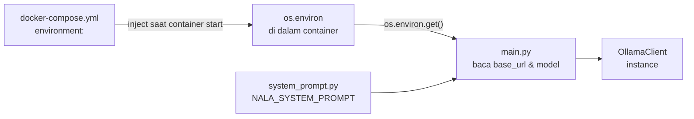

# Module 6: Integrasi Ollama — Environment, Model & System Prompt

## Tujuan

Kita menyambungkan FastAPI (dibangun murni di Module 5, belum tahu apa-apa soal Ollama) ke Ollama yang sudah berjalan di Docker sejak Module 4 — dibahas bertahap dan pelan-pelan: Dockerfile dulu, lalu docker-compose.yml, lalu cara kode Python membaca environment variable, lalu konfigurasi model, baru sambungan endpoint dengan system prompt generik, dan terakhir `NALA_SYSTEM_PROMPT` hasil Module 3. Tiap bagian dibahas satu per satu — bukan digabung jadi satu langkah besar.

## Definisi

**Environment variable** adalah nilai konfigurasi yang di-*set* dari luar kode program (lewat OS, atau di NALA lewat `docker-compose.yml`), bukan ditulis langsung (*hardcode*) di dalam kode Python. Kode cukup **membaca** nilainya saat runtime — kode yang sama bisa berjalan dengan konfigurasi berbeda tanpa perlu diedit.

**Model** (di konteks module ini) merujuk ke nama model Ollama yang dipakai NALA untuk generate jawaban (`llama3.2:3b`) — dikonfigurasi lewat environment variable `OLLAMA_MODEL`, bukan ditulis langsung di kode `OllamaClient`.

**System prompt** adalah instruksi "briefing" yang diberikan ke LLM sebelum menjawab pertanyaan user — menentukan persona, batasan, dan gaya jawaban. Di NALA, disimpan sebagai konstanta `NALA_SYSTEM_PROMPT` di file terpisah (`app/system_prompt.py`), hasil latihan Module 3.



## Hasil Akhir yang Diharapkan

- `Dockerfile` dan service `api` di `docker-compose.yml` berhasil dibuat, berjalan berdampingan dengan `ollama` yang sudah diverifikasi di Module 4
- Kita paham **secara terpisah**: bagaimana environment variable di-*set* di `docker-compose.yml`, bagaimana Python membacanya (`os.environ.get()`), dan kenapa `OLLAMA_MODEL` dikonfigurasi lewat env var alih-alih ditulis langsung di kode
- Endpoint `/chat` berfungsi — terhubung ke Ollama lewat `OllamaClient`, mula-mula dengan system prompt generik
- Endpoint `/chat` sudah memakai `NALA_SYSTEM_PROMPT` hasil Module 3, terbukti dari jawaban yang berkarakter NALA, bukan lagi generik
- Kita paham kapan menggunakan `docker compose up --build` vs `up` vs `down` setiap kali kode diubah

## 1. Buat `Dockerfile`

**Prasyarat sebelum mulai:**
- [ ] Module 5 (FastAPI, Tahap A) sudah selesai — `app/main.py` murni FastAPI tanpa Ollama, `ChatRequest`/`ChatResponse` sudah didefinisikan
- [ ] Module 4 (Setup Infra Docker Compose) sudah selesai — service `ollama` sudah berjalan & terverifikasi di Docker
- [ ] Module 3 (Prompt Engineering Dasar) sudah selesai — hasilnya dipakai nanti di Bagian 6

FastAPI-nya sudah siap dari Module 5 (Tahap A) — murni `uvicorn` lokal, belum tersambung ke apa pun. Ollama sendiri sudah dinyalakan & diverifikasi jalan di Docker sejak Module 4. Sekarang keduanya disambungkan lewat Docker, dimulai dari `Dockerfile`.

Sebelum `docker-compose.yml` bisa mem-*build* service `api`, `Dockerfile`-nya harus **sudah ada duluan** — `docker-compose.yml` di Bagian 2 nanti cuma **merujuk** ke `Dockerfile` ini lewat `build: .`, bukan mendefinisikan isinya. Urutannya penting: menulis `build: .` di `docker-compose.yml` sebelum `Dockerfile`-nya ada akan menghasilkan error `failed to read dockerfile` begitu `docker compose up` dijalankan.

Buat file baru `Nala/Dockerfile` (persis nama itu, tanpa ekstensi apa pun):

```dockerfile
FROM python:3.11-slim

WORKDIR /app

COPY requirements.txt .
RUN pip install --no-cache-dir -r requirements.txt

COPY app ./app

CMD ["uvicorn", "app.main:app", "--host", "0.0.0.0", "--port", "8000"]
```

**Penjelasan tiap baris:**
- **`FROM python:3.11-slim`** — base image: mulai dari image resmi Python 3.11 versi "slim" (lebih kecil dari image Python biasa, cuma berisi yang perlu untuk menjalankan Python). Ini instruksi **wajib jadi baris pertama** setiap Dockerfile — menentukan image dasar yang jadi titik tolak.
- **`WORKDIR /app`** — menetapkan `/app` sebagai working directory **di dalam container**; semua instruksi `COPY`/`RUN` setelah ini berjalan relatif terhadap folder ini.
- **`COPY requirements.txt .`** — salin `requirements.txt` dari `Nala/` (di laptop Anda) ke `/app/` (di dalam image). Sengaja **cuma file ini dulu**, bukan seluruh folder — alasannya di catatan layer caching di bawah.
- **`RUN pip install --no-cache-dir -r requirements.txt`** — install semua dependency Python (FastAPI, `httpx`, dll) ke dalam image, persis saat image di-*build* (bukan saat container dijalankan).
- **`COPY app ./app`** — baru sekarang folder `app/` (kode `main.py`, dst) disalin ke image.
- **`CMD [...]`** — perintah yang dijalankan **saat container start** (bukan saat build): menyalakan `uvicorn` untuk serve `app.main:app` di `0.0.0.0:8000` — pola yang sama seperti `uvicorn app.main:app --reload` yang dijalankan manual di Module 5, cuma tanpa `--reload` (reload otomatis cuma berguna untuk development lokal, bukan container production) dan `--host 0.0.0.0` (supaya bisa diakses dari luar container, bukan cuma `127.0.0.1` di dalamnya sendiri).

**Kenapa `requirements.txt` di-*copy* dan di-*install* terpisah, sebelum `COPY app ./app`?** Ini pola *layer caching* Docker: tiap instruksi (`COPY`, `RUN`) jadi satu "layer" yang di-cache. Kalau cuma kode di `app/` yang berubah (skenario paling sering selama Anda coding), Docker bisa **memakai ulang** layer `pip install` yang sudah di-cache — tidak perlu install ulang semua dependency dari nol setiap kali `main.py` diedit. Rebuild jadi jauh lebih cepat (detik, bukan menit) — inilah yang membuat `docker compose up --build api` di bagian-bagian berikutnya terasa ringan setelah build pertama.

**▶️ Jalankan & lihat hasilnya**

Belum ada `docker-compose.yml` yang merujuk ke `Dockerfile` ini (itu Bagian 2), jadi belum bisa langsung di-build sendiri lewat `docker compose`. Cukup pastikan filenya tersimpan dengan nama & isi yang benar:

```bash
cd Nala
cat Dockerfile
```

> ⚠️ **`failed to read dockerfile: open Dockerfile: no such file or directory`** (muncul nanti saat `docker compose up --build` di Bagian 5): nama file salah — harus persis `Dockerfile` (huruf besar hanya di "D"). Kalau Anda beri nama lain seperti `DockerFile` atau `dockerfile`, Docker tidak akan menemukannya walau terlihat mirip di Finder/Explorer. Cek dengan `ls` dan rename kalau perlu: `mv DockerFile Dockerfile`.
> ⚠️ **`failed to compute cache key: ... "/app": not found`**: normal terjadi **sebelum** folder `app/` (kode Python NALA) dibuat — tinggal lanjut membuat folder `app/` sesuai Module 5.

<details>
<summary><strong>Pakai Claude Code? Salin prompt berikut, paste untuk eksekusi Bagian 1</strong></summary>

```
Buat Dockerfile untuk service api NALA — BELUM mengubah
docker-compose.yml sama sekali di langkah ini.

GOAL:
- Buat/timpa Nala/Dockerfile persis isinya:

  FROM python:3.11-slim

  WORKDIR /app

  COPY requirements.txt .
  RUN pip install --no-cache-dir -r requirements.txt

  COPY app ./app

  CMD ["uvicorn", "app.main:app", "--host", "0.0.0.0", "--port", "8000"]

CONTEXT:
- Ini Dockerfile untuk service `api` yang akan dirujuk lewat `build: .`
  di docker-compose.yml pada Bagian 2 — belum dipakai di langkah ini.

GUARDRAIL:
- JANGAN ubah docker-compose.yml — itu Bagian 2.
- JANGAN ubah urutan instruksi (COPY requirements.txt sebelum RUN pip
  install, sebelum COPY app ./app) — urutan ini sengaja untuk layer
  caching Docker.
```

</details>

## 2. Tambahkan Service `api` ke `docker-compose.yml`

`Dockerfile` sudah ada dari Bagian 1. Sekarang buka `docker-compose.yml`, tambahkan blok `api` di samping `ollama` — blok ini yang akan **merujuk** ke `Dockerfile` itu lewat `build: .`:

```yaml
services:
  ollama:
    image: ollama/ollama:latest
    ports:
      - "11434:11434"
    volumes:
      - ollama_data:/root/.ollama

  api:
    build: .
    ports:
      - "8000:8000"
    environment:
      - OLLAMA_BASE_URL=http://ollama:11434
      - OLLAMA_MODEL=llama3.2:3b
    depends_on:
      - ollama

volumes:
  ollama_data:
```

**Penjelasan blok `api`:**
- **`build: .`** — beda dari `ollama` yang pakai `image:` (image jadi dari Docker Hub), `api` di-**build** dari `Dockerfile` yang baru dibuat di Bagian 1 — sehingga dependency Python (FastAPI, `httpx`, dll di `requirements.txt`) ter-install ke dalam image custom ini.
- **`depends_on: - ollama`** — memberi tahu Docker Compose untuk menyalakan `ollama` **lebih dulu** sebelum `api`. Ini cuma menjamin urutan start container, **bukan** menjamin Ollama sudah selesai loading model saat `api` mulai menerima request — itu sebabnya Ollama diverifikasi sehat dulu secara terpisah di Module 4, bukan diandalkan ke `depends_on` saja.
- **`environment:`** — dua baris ini (`OLLAMA_BASE_URL`, `OLLAMA_MODEL`) adalah **titik awal** dari topik environment variable & model yang dibahas detail di Bagian 3-4 berikut. Untuk sekarang, cukup tahu: baris ini yang men-*set* nilainya dari sisi Docker Compose — belum dibahas bagaimana kode Python **membaca**-nya, itu langkah berikutnya.

## 3. Baca Environment Variable di Python

Blok `environment:` di Bagian 2 tadi **men-set** dua nilai (`OLLAMA_BASE_URL`, `OLLAMA_MODEL`) — tapi men-set saja tidak otomatis membuat kode Python "tahu" nilainya. Perlu satu langkah lagi: kode Python harus secara eksplisit **membaca** environment variable itu.

Python punya modul bawaan `os` untuk ini. Tambahkan import di baris paling atas `app/main.py`:

```python
import os
```

`os.environ` adalah objek mirip dictionary yang berisi **semua** environment variable yang aktif di proses saat ini — termasuk dua yang baru di-set di `docker-compose.yml` (`OLLAMA_BASE_URL`, `OLLAMA_MODEL`), plus variable bawaan sistem lain yang tidak relevan untuk NALA.

**Dua cara membaca environment variable, dan kenapa NALA pakai salah satunya:**

| Cara | Contoh | Perilaku kalau variable tidak ada |
|---|---|---|
| `os.environ["OLLAMA_BASE_URL"]` | Akses langsung seperti dictionary | **Error** (`KeyError`) — program crash |
| `os.environ.get("OLLAMA_BASE_URL", "http://localhost:11434")` | Method `.get()` dengan **default value** | Tidak error — otomatis pakai nilai default yang ditulis di argumen kedua |

NALA pakai cara kedua, `.get()` dengan default. Alasannya konkret: kalau `main.py` dijalankan **lokal** lewat `uvicorn` (seperti di Module 5, Tahap A — belum lewat Docker), environment variable `OLLAMA_BASE_URL` **tidak ada** sama sekali (itu cuma di-set lewat `docker-compose.yml`, yang berarti cuma aktif kalau dijalankan lewat `docker compose up`). Kalau kode pakai `os.environ["..."]` langsung, program akan **crash** duluan setiap kali dites lokal. Dengan `.get(..., default)`, kode tetap jalan di kedua skenario — di Docker (baca dari env var yang di-set) maupun lokal (pakai default `http://localhost:11434`).

**▶️ Coba lihat sendiri perbedaannya** (opsional, murni demonstrasi konsep — tidak mengubah `main.py`):

```bash
python3 -c "import os; print(os.environ.get('OLLAMA_BASE_URL', 'DEFAULT_DIPAKAI'))"
```

Dijalankan di terminal biasa (bukan di dalam container), ini akan mencetak `DEFAULT_DIPAKAI` — karena `OLLAMA_BASE_URL` memang tidak ada di environment terminal Anda. Begitu `main.py` yang sama dijalankan **di dalam container** `api` (lewat `docker compose up`), `os.environ.get(...)` akan mengembalikan `http://ollama:11434` — nilai yang di-set lewat `environment:` di Bagian 2 — bukan default-nya.

## 4. Konfigurasi Model Lewat Environment Variable

Pola yang sama (Bagian 3) dipakai lagi untuk `OLLAMA_MODEL` — tapi nilainya beda maknanya: bukan alamat server, melainkan **nama model** yang diminta ke Ollama saat generate jawaban.

**Kenapa nama model dikonfigurasi lewat environment variable, bukan ditulis langsung (`model = "llama3.2:3b"`) di kode?** Tiga alasan konkret:
- **Ganti model tanpa ubah kode**: kalau suatu saat ingin coba model lain (misal `qwen2.5:7b`, dibahas sebagai opsi upgrade di README root), cukup ubah satu baris di `docker-compose.yml` — tidak perlu edit `main.py` sama sekali, apalagi rebuild logic aplikasi.
- **Konsisten dengan `OLLAMA_BASE_URL`**: keduanya sama-sama "informasi tentang lingkungan tempat aplikasi berjalan", bukan bagian dari logika aplikasi itu sendiri — konsisten diperlakukan dengan cara yang sama.
- **Textbook *twelve-factor app* practice**: konfigurasi yang berbeda antar environment (development, staging, production) sebaiknya dipisah dari kode — prinsip umum di pengembangan aplikasi modern, bukan sesuatu yang NALA-spesifik.

```bash
docker compose exec ollama ollama list
```

Nilai `llama3.2:3b` di `OLLAMA_MODEL` (Bagian 2) **harus** cocok persis dengan salah satu model yang muncul di output ini — kalau modelnya belum di-pull atau namanya beda (misal `llama3.2` tanpa tag `:3b`), `ollama_client.generate()` nanti (Bagian 5) akan gagal dengan error dari Ollama, bukan error dari kode FastAPI.

## 5. Buat `OllamaClient` dan Sambungkan Endpoint `/chat`

Environment variable (Bagian 3) dan model (Bagian 4) sudah dipahami terpisah. Sekarang keduanya dipakai bersama untuk membuat **satu objek** yang jadi jembatan FastAPI ↔ Ollama: `OllamaClient`.

Untuk "menghubungi" Ollama dari kode Python, dibutuhkan beberapa file tambahan:

1. `app/ollama_client.py` — isinya class `OllamaClient` (menggunakan library `httpx` untuk memanggil API Ollama lewat HTTP — lihat Module 4 Bagian 4 untuk permukaan lengkap REST API Ollama).
2. `app/__init__.py` — file kosong (0 baris), tapi keberadaannya wajib: ini yang membuat Python mengenali folder `app/` sebagai *package*, supaya `from app.ollama_client import ...` bisa jalan.

**Pre-flight check**

- [ ] `app/__init__.py` ada (boleh kosong, 0 baris)
- [ ] `app/ollama_client.py` ada

```bash
ls app/
```

> ⚠️ **Kalau `ollama_client.py` tidak ada** (pernah terjadi kalau folder `app/` di-duplikat lewat Finder/VS Code — "duplicate" kadang memindah, bukan menyalin), buat manual dengan isi berikut:
> ```python
> # app/ollama_client.py
> import httpx
>
>
> class OllamaClient:
>     def __init__(self, base_url: str, model: str):
>         self.base_url = base_url
>         self.model = model
>
>     def generate(self, system_prompt: str, user_message: str) -> str:
>         with httpx.Client() as client:
>             response = client.post(
>                 f"{self.base_url}/api/generate",
>                 json={
>                     "model": self.model,
>                     "system": system_prompt,
>                     "prompt": user_message,
>                     "stream": False,
>                 },
>                 timeout=60.0,
>             )
>             response.raise_for_status()
>             return response.json()["response"]
> ```
> **Penjelasan Singkat**
> - **`__init__(self, base_url, model)`**: ini *constructor* — kode yang otomatis jalan sekali, tepat saat `OllamaClient(...)` dipanggil di bawah. Tugasnya cuma menyimpan `base_url` (hasil Bagian 3) dan `model` (hasil Bagian 4) ke dalam objeknya sendiri (`self.base_url`, `self.model`), supaya nanti bisa dipakai lagi di method lain — tanpa perlu diketik ulang tiap kali.
> - **`generate(self, system_prompt, user_message)`**: ini method yang **benar-benar mengirim pertanyaan ke Ollama** dan menunggu jawabannya. Alurnya: (1) susun request HTTP `POST` ke `{base_url}/api/generate` — endpoint bawaan Ollama — berisi `model`, `system` (system prompt), dan `prompt` (pertanyaan user); (2) `response.raise_for_status()` melempar error kalau Ollama merespons gagal (misal model belum di-pull); (3) `response.json()["response"]` mengambil teks jawabannya saja dari balasan Ollama, lalu dikembalikan sebagai string biasa.
>
> Kalau `__init__.py` juga tidak ada, buat file kosong dengan nama itu — tanpa file ini, `from app.ollama_client import ...` gagal dengan `ModuleNotFoundError: No module named 'app.ollama_client'` (persis error kalau `ollama_client.py` sendiri yang hilang). Error yang sama padahal kedua file sudah ada → cek `python3 -m pip show httpx`.

> ⚠️ **Kalau muncul `ModuleNotFoundError: No module named 'httpx'` saat Anda coba jalankan dengan `uvicorn` lokal**: itu tandanya `httpx` belum ter-install di Python lokal Anda — wajar, karena `httpx` cuma otomatis ter-install **di dalam container** lewat `requirements.txt`, bukan di komputer Anda langsung. Kalau sekadar mau membetulkan error importnya: `python3 -m pip install httpx` (atau `pip3 install httpx`). Tapi ingat: **mulai bagian ini seharusnya dijalankan pakai `docker compose up --build`, bukan `uvicorn` lokal** — walau error `httpx` sudah beres, `uvicorn` lokal tetap akan gagal manggil `/chat` karena tidak ada Ollama yang bisa dihubungi di `http://localhost:11434` dari luar container.

Sekarang gabungkan semuanya di `app/main.py`:

1. Tambah import di baris atas: `import os` (Bagian 3) dan `from app.ollama_client import OllamaClient`.
2. Buat instance-nya di bawah `app = FastAPI()` — inilah titik pertemuan Bagian 3 dan Bagian 4, dua `os.environ.get()` yang dulunya dibahas terpisah, sekarang dipakai bersama untuk membuat satu objek:
   ```python
   ollama_client = OllamaClient(
       base_url=os.environ.get("OLLAMA_BASE_URL", "http://localhost:11434"),
       model=os.environ.get("OLLAMA_MODEL", "llama3.2:3b"),
   )
   ```
3. Tambahkan endpoint `/chat`, memakai `ChatRequest`/`ChatResponse` dari Module 5, dengan system prompt **generik dulu** (bukan `NALA_SYSTEM_PROMPT` — itu Bagian 6):
   ```python
   @app.post("/chat", response_model=ChatResponse)
   def chat(request: ChatRequest) -> ChatResponse:
       reply = ollama_client.generate(
           system_prompt="Kamu adalah asisten AI yang menjawab singkat dan jelas.",
           user_message=request.message,
       )
       return ChatResponse(reply=reply)
   ```

**Penjelasan Singkat**

- **`@app.post("/chat", ...)`**: beda dari `/health` (GET) — **POST**, karena klien mengirim data, bukan cuma menerima.
- **`request: ChatRequest`**: FastAPI otomatis baca JSON masuk & validasi sesuai `ChatRequest` (Module 5); data salah bentuk otomatis ditolak sebelum masuk fungsi.
- **`ollama_client.generate(...)`**: titik hubung FastAPI ↔ Ollama — mengirim request, menunggu jawaban.
- **`ChatResponse(reply=reply)`**: dibungkus balik jadi JSON sesuai `ChatResponse` (Module 5).

**Jalankan**

Simpan file. Mulai dari sini pakai Docker (bukan `uvicorn` lagi):

```bash
cd Nala
docker compose up --build
```

Docker Compose cukup pintar untuk tidak membuat ulang container yang sudah berjalan dan tidak berubah konfigurasinya — `ollama` (sudah menyala sejak Module 4) langsung dipakai apa adanya, yang benar-benar di-*build* dan dinyalakan di sini cuma `api`. Kalau log menunjukkan `ollama` langsung "Up" tanpa proses pull image, itu perilaku normal, bukan error.

> ⚠️ **`no configuration file provided: not found`**: `docker compose` dijalankan bukan dari folder yang berisi `docker-compose.yml`. Pastikan Anda berada persis di `Nala/` (cek dengan `ls` — harus ada `docker-compose.yml`).
> ⚠️ **Port 8000 sudah dipakai**: ubah mapping port di `docker-compose.yml` (misal `8001:8000`).

**Output yang Diharapkan**
```
... Uvicorn running on http://0.0.0.0:8000
```

Tunggu sampai log menunjukkan baris ini sebelum lanjut ke `curl` di bawah.

Tes kedua endpoint:
```bash
curl http://localhost:8000/health
curl -X POST http://localhost:8000/chat \
  -H "Content-Type: application/json" \
  -d '{"message": "Halo, kamu siapa?"}'
```

✅ **Indikator sukses**: `/health` → `{"status":"ok"}`. `/chat` → jawaban **generik** ("saya asisten AI..."), belum berkarakter NALA — wajar, system prompt-nya masih placeholder. Biarkan `docker compose up` tetap berjalan, lanjut ke Bagian 6.

> ⚠️ **`curl: (7) Failed to connect`**: pastikan `docker compose up` masih berjalan dan tidak ada error di log.
> ⚠️ **`Internal Server Error` saat POST `/chat`**: hampir selalu berarti Ollama di dalam container **belum punya model** `llama3.2:3b` (lihat Bagian 4 & Module 4) — bukan error di kode FastAPI-nya. Cek dengan `docker compose exec ollama ollama list`. Detail error Python-nya (traceback) selalu bisa dilihat di terminal yang menjalankan `docker compose up` (log container `api`).

<details>
<summary><strong>Pakai Claude Code? Salin prompt berikut, paste untuk eksekusi Bagian 3-5</strong></summary>

```
Sambungkan NALA ke Ollama — tambah service api ke docker-compose.yml,
buat ollama_client.py, dan tambah endpoint /chat dengan system prompt
GENERIK dulu (bukan NALA_SYSTEM_PROMPT).

GOAL:
1. Di Nala/docker-compose.yml, tambahkan
   blok `api` di samping `ollama` yang sudah ada:

   api:
     build: .
     ports:
       - "8000:8000"
     environment:
       - OLLAMA_BASE_URL=http://ollama:11434
       - OLLAMA_MODEL=llama3.2:3b
     depends_on:
       - ollama

2. Buat Nala/app/ollama_client.py:

   import httpx


   class OllamaClient:
       def __init__(self, base_url: str, model: str):
           self.base_url = base_url
           self.model = model

       def generate(self, system_prompt: str, user_message: str) -> str:
           with httpx.Client() as client:
               response = client.post(
                   f"{self.base_url}/api/generate",
                   json={
                       "model": self.model,
                       "system": system_prompt,
                       "prompt": user_message,
                       "stream": False,
                   },
                   timeout=60.0,
               )
               response.raise_for_status()
               return response.json()["response"]

3. Buat file kosong (0 baris) Nala/app/__init__.py
   kalau belum ada.

4. Di Nala/app/main.py, tambahkan di
   baris atas: `import os` dan
   `from app.ollama_client import OllamaClient`. Di bawah
   `app = FastAPI()`, tambahkan:

   ollama_client = OllamaClient(
       base_url=os.environ.get("OLLAMA_BASE_URL", "http://localhost:11434"),
       model=os.environ.get("OLLAMA_MODEL", "llama3.2:3b"),
   )

   Lalu tambahkan endpoint baru di bagian bawah file (setelah /health):

   @app.post("/chat", response_model=ChatResponse)
   def chat(request: ChatRequest) -> ChatResponse:
       reply = ollama_client.generate(
           system_prompt="Kamu adalah asisten AI yang menjawab singkat dan jelas.",
           user_message=request.message,
       )
       return ChatResponse(reply=reply)

CONTEXT:
- Service `ollama` di docker-compose.yml sudah ada dan sudah
  diverifikasi berjalan (Module 4) — jangan diubah, cuma
  ditambah blok `api` di sampingnya.
- `ChatRequest`/`ChatResponse` sudah ada di main.py dari Module 5 —
  JANGAN didefinisikan ulang, cukup dipakai di endpoint baru.
- System prompt di langkah ini SENGAJA masih string generik — draft
  `NALA_SYSTEM_PROMPT` baru dipasang di Bagian 6.

GUARDRAIL:
- JANGAN pakai `NALA_SYSTEM_PROMPT` atau import
  `app.system_prompt` di tahap ini — itu Bagian 6.
- JANGAN ubah endpoint `/health` yang sudah ada.
- JANGAN ubah service `ollama` yang sudah ada di docker-compose.yml,
  cuma tambahkan blok `api`.
```

</details>

**Kapan pakai command Docker yang mana**

Mulai sini sampai akhir module ini, Anda akan bolak-balik edit kode lalu perlu menjalankannya lagi. Command yang dipakai **beda-beda tergantung apa yang diubah**:

| Situasi | Command | Kenapa |
|---|---|---|
| Ubah isi `main.py`, `system_prompt.py`, atau file lain di `app/` | `docker compose up --build api` | `docker-compose.yml` **tidak** me-mount folder `app/` ke dalam container — kode di-`COPY` ke image cuma sekali saat `build` (lihat `Dockerfile`). `restart` cuma menyalakan ulang container dari image yang sama persis, jadi kode lama yang tetap terpakai. Rebuild ini **cepat** (beberapa detik) karena layer `pip install` di-cache — cuma langkah `COPY app ./app` yang diulang. |
| Ubah `requirements.txt` atau `Dockerfile` | `docker compose up --build api` | Command sama persis seperti di atas — bedanya cuma rebuild-nya **lebih lambat**, karena layer `pip install` ikut di-*invalidate* dan harus jalan ulang, bukan cuma layer `COPY app`. |
| Mau berhenti sepenuhnya (tutup laptop, selesai sesi latihan) | `docker compose down` | Mematikan **dan menghapus** container (bukan cuma pause) — port `8000`/`11434` jadi bebas lagi. Model Ollama yang sudah di-*pull* **tidak ikut hilang** (tersimpan di volume `ollama_data`, lihat `docker-compose.yml`). |
| Mau lanjut lagi setelah `down`, tidak ada perubahan kode sejak terakhir | `docker compose up` (tanpa `--build`) | Image sebelumnya masih ada dan masih sesuai kode terakhir, tidak perlu dibangun ulang dari nol — lebih cepat. |
| Container `api` error/nyangkut, tidak jelas kenapa | `docker compose down` lalu `docker compose up --build` | "Matikan total, nyalakan dari nol" — cara paling ampuh membersihkan state yang aneh. |

> 💡 **Aturan cepat**: `restart` **tidak pernah cukup** untuk perubahan kode apa pun di setup ini — selalu `docker compose up --build api` setiap kali file di `app/`, `requirements.txt`, atau `Dockerfile` berubah. Satu-satunya yang berbeda adalah kecepatannya (detik vs lebih lama), bukan apakah `--build`-nya perlu atau tidak.

**📄 Kode `main.py` setelah Bagian 5** (sudah tersambung ke Ollama, system prompt masih generik):

```python
import os

from fastapi import FastAPI
from pydantic import BaseModel

from app.ollama_client import OllamaClient

app = FastAPI()

ollama_client = OllamaClient(
    base_url=os.environ.get("OLLAMA_BASE_URL", "http://localhost:11434"),
    model=os.environ.get("OLLAMA_MODEL", "llama3.2:3b"),
)


class ChatRequest(BaseModel):
    message: str


class ChatResponse(BaseModel):
    reply: str


@app.get("/health")
def health_check():
    return {"status": "ok"}


@app.post("/chat", response_model=ChatResponse)
def chat(request: ChatRequest) -> ChatResponse:
    reply = ollama_client.generate(
        system_prompt="Kamu adalah asisten AI yang menjawab singkat dan jelas.",
        user_message=request.message,
    )
    return ChatResponse(reply=reply)
```

Dibandingkan kode Module 5 (Tahap A), yang berubah cuma 3 hal: (1) tambah `import os` dan `from app.ollama_client import OllamaClient`, (2) tambah baris `ollama_client = OllamaClient(...)`, dan (3) endpoint `/chat` sekarang benar-benar terisi (sebelumnya cuma "cetakan" `ChatRequest`/`ChatResponse` yang belum dipakai).

## 6. System Prompt NALA

Di Bagian 5, asisten AI-nya sudah tersambung, tapi "kepribadiannya" masih generik — cuma dibisiki "kamu asisten AI yang menjawab singkat dan jelas". **System prompt** itu ibarat **briefing** yang diberikan ke asisten sebelum dia mulai kerja: siapa dia, tugasnya apa, batasannya apa. Sekarang briefing generik itu diganti dengan briefing yang sesungguhnya, khusus untuk NALA.

File tetangga kedua yang dibutuhkan adalah `app/system_prompt.py` — isinya satu konstanta, `NALA_SYSTEM_PROMPT = "..."`, yaitu **hasil latihan Module 3** (Prompt Engineering Dasar) yang sudah Anda susun sendiri di sana. File ini cuma "membungkus" teks briefing itu jadi konstanta Python.

**✅ Cek dulu sebelum lanjut**: `ls app/` — harus ada `system_prompt.py`. Kalau belum ada, buat filenya manual, isinya konstanta `NALA_SYSTEM_PROMPT` dengan teks hasil latihan Module 3 Anda sendiri, contoh bentuknya:

```python
# app/system_prompt.py
NALA_SYSTEM_PROMPT = """Kamu adalah NALA, asisten AI internal PT Nusantara Finance.
Tugasmu adalah menjawab pertanyaan staff seputar SOP, kebijakan, dan data operasional perusahaan.
Aturan:
- Jawab singkat, jelas, dan dalam Bahasa Indonesia.
- Jika kamu tidak yakin atau informasinya tidak tersedia, katakan dengan jujur bahwa kamu tidak memiliki informasi tersebut. Jangan mengarang jawaban.
- Jangan menjawab pertanyaan di luar konteks pekerjaan PT Nusantara Finance.
"""
```

Ganti isi teksnya sesuai hasil latihan Module 3 Anda sendiri — contoh di atas cuma template kalau filenya hilang/belum dibuat. Kalau nanti mau bereksperimen ulang dengan isi prompt-nya, cukup edit file ini dan ulangi langkah "Jalankan & lihat hasilnya" di bawah — bukan tulis ulang `main.py`.

1. Tambahkan import: `from app.system_prompt import NALA_SYSTEM_PROMPT`
2. Di endpoint `/chat`, ganti string generik dari Bagian 5 dengan `NALA_SYSTEM_PROMPT`:

```python
@app.post("/chat", response_model=ChatResponse)
def chat(request: ChatRequest) -> ChatResponse:
    reply = ollama_client.generate(
        system_prompt=NALA_SYSTEM_PROMPT,
        user_message=request.message,
    )
    return ChatResponse(reply=reply)
```

Perhatikan: **struktur endpoint sama sekali tidak berubah** dari Bagian 5 — cuma satu argumen yang diganti. Ini poin pentingnya: system prompt adalah *konfigurasi kepribadian & batasan* asisten, terpisah total dari *struktur* endpoint-nya — persis seperti `OLLAMA_MODEL` (Bagian 4) yang juga sekadar konfigurasi, bukan bagian dari logika endpoint. Ganti isi `NALA_SYSTEM_PROMPT` kapan pun tanpa perlu menyentuh `main.py`.

**▶️ Jalankan & lihat hasilnya**

`docker compose up` dari Bagian 5 masih boleh tetap jalan. Simpan file, lalu rebuild `api` supaya kode terbaru terbaca — cukup cepat karena cuma `system_prompt.py`/`main.py` yang berubah, bukan `requirements.txt` (lihat tabel "Kapan pakai command Docker yang mana" di atas: `restart` saja **tidak cukup**, kode di-`COPY` ke image cuma sekali saat `build`):

```bash
docker compose up --build api
```

Ulangi tes `/chat` yang **sama persis** seperti di Bagian 5:

```bash
curl -X POST http://localhost:8000/chat \
  -H "Content-Type: application/json" \
  -d '{"message": "Halo, kamu siapa?"}'
```

Model `llama3.2:3b` **tidak perlu** di-pull ulang di sini — sudah dilakukan di Module 4, dan tersimpan permanen di volume `ollama_data`.

Bandingkan jawabannya dengan Bagian 5: sekarang harus terasa lebih spesifik sesuai aturan di `NALA_SYSTEM_PROMPT` (jawab dalam Bahasa Indonesia, tidak mengarang jawaban, dsb) — bukan lagi jawaban generik "saya asisten AI...".

<details>
<summary><strong>Pakai Claude Code? Salin prompt berikut, paste untuk eksekusi Bagian 6</strong></summary>

```
Ganti system prompt generik di /chat dengan NALA_SYSTEM_PROMPT hasil
Module 3.

GOAL:
1. Buat Nala/app/system_prompt.py kalau
   belum ada, isinya satu konstanta NALA_SYSTEM_PROMPT — isi teksnya
   ambil dari draft hasil latihan Module 3 (System Prompt NALA v1)
   yang sudah divalidasi di sana. Kalau belum punya draft sendiri,
   pakai contoh ini sebagai placeholder:

   NALA_SYSTEM_PROMPT = """Kamu adalah NALA, asisten AI internal PT Nusantara Finance.
   Tugasmu adalah menjawab pertanyaan staff seputar SOP, kebijakan, dan data operasional perusahaan.
   Aturan:
   - Jawab singkat, jelas, dan dalam Bahasa Indonesia.
   - Jika kamu tidak yakin atau informasinya tidak tersedia, katakan dengan jujur bahwa kamu tidak memiliki informasi tersebut. Jangan mengarang jawaban.
   - Jangan menjawab pertanyaan di luar konteks pekerjaan PT Nusantara Finance.
   """

2. Di Nala/app/main.py, tambahkan
   import: `from app.system_prompt import NALA_SYSTEM_PROMPT`.
3. Di endpoint `/chat`, ganti argumen `system_prompt="Kamu adalah
   asisten AI yang menjawab singkat dan jelas."` menjadi
   `system_prompt=NALA_SYSTEM_PROMPT`. Tidak ada bagian lain dari
   endpoint yang berubah.

CONTEXT:
- Endpoint `/chat` dan `OllamaClient` sudah lengkap dari Bagian 5 —
  hanya satu argumen yang diganti di sini, strukturnya tetap sama.

GUARDRAIL:
- JANGAN ubah struktur endpoint `/chat` selain argumen
  `system_prompt` — tidak ada parameter baru, tidak ada endpoint baru.
- JANGAN ubah `app/ollama_client.py` atau `docker-compose.yml` sama
  sekali di langkah ini.
```

</details>

**📄 Kode lengkap `main.py`** dibandingkan Bagian 5: hanya 2 baris yang berubah — `system_prompt="Kamu adalah asisten AI..."` (string generik) diganti `system_prompt=NALA_SYSTEM_PROMPT` (import dari `app/system_prompt.py`), plus satu baris import tambahan di atas. **Tidak ada satu pun baris struktur endpoint yang berubah** — itulah inti pelajaran Bagian 6.

## 7. Bandingkan dengan File Aslinya

Setelah Bagian 1-6, file `main.py` Anda seharusnya berisi ini (susunan file boleh sedikit beda, isinya yang harus sama):

```python
import os

from fastapi import FastAPI
from pydantic import BaseModel

from app.ollama_client import OllamaClient
from app.system_prompt import NALA_SYSTEM_PROMPT

app = FastAPI(title="NALA")

ollama_client = OllamaClient(
    base_url=os.environ.get("OLLAMA_BASE_URL", "http://localhost:11434"),
    model=os.environ.get("OLLAMA_MODEL", "llama3.2:3b"),
)


class ChatRequest(BaseModel):
    message: str


class ChatResponse(BaseModel):
    reply: str


@app.get("/health")
def health() -> dict:
    return {"status": "ok"}


@app.post("/chat", response_model=ChatResponse)
def chat(request: ChatRequest) -> ChatResponse:
    reply = ollama_client.generate(
        system_prompt=NALA_SYSTEM_PROMPT,
        user_message=request.message,
    )
    return ChatResponse(reply=reply)
```

Buka file asli `Nala/app/main.py` dan bandingkan — ini persis isinya. Kalau tiap bagian di atas sudah masuk akal, file ini seharusnya juga langsung masuk akal, meski susunan baris atau nama variabel Anda sedikit berbeda.

Detail lengkap menjalankan stack ini termasuk troubleshooting (error Docker, port bentrok, dll) ada di Bagian 1 dan Bagian 5 di atas.

---

## Ringkasan & Next Steps

Anda telah memahami:

✅ **`Dockerfile`** — resep membangun image custom `api`, dan kenapa urutannya harus dibuat sebelum `docker-compose.yml` merujuknya
✅ **Environment variable** — bagaimana `docker-compose.yml` men-*set* nilai, dan bagaimana Python membacanya lewat `os.environ.get()` dengan default value
✅ **Konfigurasi model** — kenapa `OLLAMA_MODEL` dikonfigurasi lewat environment variable, bukan ditulis langsung di kode
✅ **Endpoint `/chat`** — tersambung ke Ollama lewat `OllamaClient`, mula-mula system prompt generik
✅ **System prompt NALA** — `NALA_SYSTEM_PROMPT` hasil Module 3 terintegrasi, tanpa mengubah struktur endpoint

**Next Steps:**
- **Praktik langsung**: ikuti Bagian 1-6 di atas berurutan — tiap bagian sudah lengkap dengan penjelasan, command, dan checkpoint-nya sendiri
- **Starter code**: `Nala/` — struktur project FastAPI app dan docker-compose NALA (sekarang lengkap `ollama` + `api`)
- **Module 7+**: Extend docker-compose.yml dengan service tambahan (OpenSearch, Airflow, PostgreSQL, dsb)
