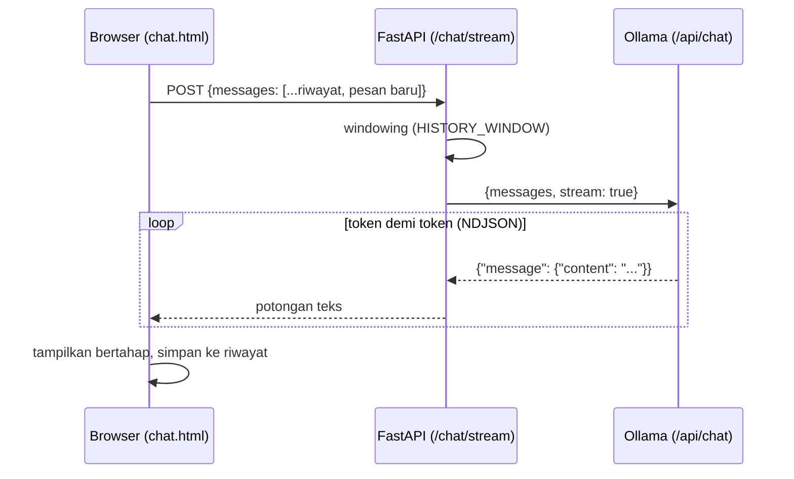
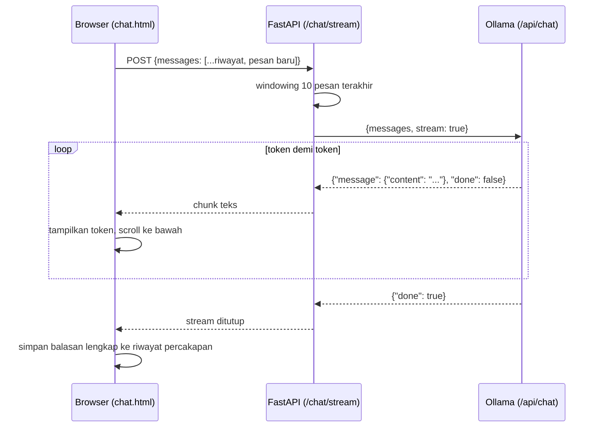

# Module 6: Streaming & Multi-Turn Conversation

## Tujuan

Mengganti total endpoint `/chat` (Module 5) dengan `POST /chat/stream` — menjawab secara streaming (token demi token) dan mengingat riwayat percakapan (multi-turn). Mulai module ini, **NALA seluruhnya berbasis streaming**: `/chat/stream` menjadi satu-satunya endpoint chat, dipakai terus sampai Module 5-14 selesai (RAG di Module 11, chunking di Module 12, upload di Module 13 semuanya dibangun di atas endpoint ini, bukan endpoint baru lagi) — belum ada RAG di module ini, itu baru masuk Module 11.

## Definisi

**Streaming** berarti jawaban dikirim bertahap — **token** demi token (satu-satuan terkecil teks yang dihasilkan model, kira-kira sepotong kata) begitu tersedia, bukan menunggu jawaban selesai total baru dikirim sekaligus di akhir (Bagian 1). Di balik layar, Ollama mengirim tiap token itu dalam format **NDJSON** — satu objek JSON per baris, bukan satu JSON besar — dan FastAPI meneruskannya langsung ke browser tanpa menunggu baris berikutnya (Bagian 3 Tahap A). Inilah yang membuat jawaban NALA terlihat "mengetik" secara bertahap, persis seperti ChatGPT atau WhatsApp, bukan muncul mendadak sekaligus.

**Multi-turn conversation** adalah percakapan yang terdiri dari beberapa pertanyaan-jawaban berurutan, di mana pertanyaan berikutnya bisa merujuk balik ke konteks sebelumnya (misalnya "kalau untuk nasabah lama?") tanpa perlu mengulang kata kunci — ini cuma bisa terjadi kalau **riwayat percakapan** ikut dikirim ke model di setiap request, bukan cuma pesan yang baru saja diketik. Supaya riwayat ini tidak membengkak tanpa batas dan membebani model, dipakai **windowing** — strategi membatasi riwayat yang dikirim ke sejumlah pesan terakhir saja (`HISTORY_WINDOW`, Bagian 4), bukan seluruh riwayat sejak awal percakapan.



## Hasil Akhir yang Diharapkan

- Jawaban NALA muncul bertahap (kata demi kata) di `chat.html`, bukan sekaligus di akhir
- Pertanyaan lanjutan yang tidak menyebut ulang konteks (mis. "Kalau untuk nasabah lama?") tetap dipahami lewat riwayat percakapan
- Riwayat dibatasi lewat windowing 10 pesan terakhir (`HISTORY_WINDOW`), dengan peringatan di UI setelah pesan ke-9
- Tombol reset percakapan berfungsi dan meminta konfirmasi sebelum mengosongkan riwayat
- Endpoint `/chat` (Module 5) **sudah dihapus** dari `app/main.py` — `POST /chat` mengembalikan `404`, dibuktikan lewat `curl`
- NALA terasa lebih hidup secara UX, tapi jawabannya masih dari pengetahuan umum — belum ada dokumen/RAG

## 1. Dua Masalah UX yang Belum Diselesaikan

Module 5 sudah membuktikan `/chat` bisa diakses lewat browser — tapi dua hal masih terasa kaku dibanding chatbot yang biasa dipakai staff sehari-hari (WhatsApp, ChatGPT, dsb):

1. **Tidak ada streaming.** `/chat` menunggu `ollama_client.generate()` selesai total sebelum mengembalikan jawaban. Untuk jawaban panjang (beberapa kalimat SOP), user menatap layar kosong selama beberapa detik tanpa tanda apa pun sedang terjadi.
2. **Tidak ada memori percakapan.** Setiap pesan diperlakukan sebagai percakapan baru. Kalau user bertanya "Berapa lama proses kredit?" lalu lanjut "Kalau untuk nasabah lama?", NALA tidak tahu "itu" merujuk ke pertanyaan sebelumnya — karena `/chat` hanya menerima satu `message`, tanpa riwayat.

Module ini menyelesaikan keduanya sekaligus lewat satu endpoint baru: `POST /chat/stream`, yang **menggantikan** `/chat` sepenuhnya (Bagian 2 menjelaskan kenapa mengganti, bukan menambah). **Belum ada RAG di titik ini** — Module 7-10 belum dikerjakan, jadi belum ada konsep RAG yang dibahas, dokumen, embedding, atau vector store untuk di-retrieve. `/chat/stream` di module ini murni streaming + riwayat, memakai `NALA_SYSTEM_PROMPT` polos yang sama seperti `/chat` sebelumnya. Module 11 nanti yang menambahkan retrieval ke endpoint ini — satu-satunya endpoint chat yang tersisa sejak module ini.



## 2. Kenapa Mengganti Total, Bukan Menambah Endpoint di Samping `/chat`

Ada dua pilihan desain di titik ini: (a) tambah `/chat/stream` **di samping** `/chat` yang sudah ada, biarkan keduanya hidup berdampingan selamanya, atau (b) **ganti total** — hapus `/chat`, `/chat/stream` jadi satu-satunya endpoint chat. NALA memilih **(b)**, dan alasannya bukan sekadar selera:

- **Dua endpoint dengan dua kontrak berarti dua jalur kode yang harus terus disinkronkan.** Mulai Module 11, retrieval (RAG) ditambahkan ke endpoint chat — kalau ada dua endpoint, setiap fitur baru (retrieval Module 11, tuning `top_k` Module 12) harus ditulis **dua kali**, dengan risiko nyata keduanya diam-diam jadi tidak sinkron (satu di-update, satu lupa). Satu endpoint berarti satu jalur kode, satu tempat untuk tiap fitur baru.
- **Kontrak `/chat` (`{"message"} → {"reply"}`, satu response JSON utuh) secara fundamental tidak cocok dengan streaming** — bukan soal "belum diperbarui", tapi bentuknya sendiri mengasumsikan jawaban selesai dulu baru dikirim. Mempertahankannya di samping `/chat/stream` bukan backward-compatibility yang berguna, cuma dua cara berbeda melakukan hal yang sama, salah satunya terasa jauh lebih kaku (Langkah 4 di Module 5).
- **Staff PT Nusantara Finance cuma akan pakai satu antarmuka** (`chat.html`) — tidak ada kebutuhan nyata di NALA untuk endpoint non-streaming yang dipakai paralel oleh sistem lain. Kalau kebutuhan itu muncul nanti, lebih jelas membangunnya sebagai endpoint terpisah dengan tujuan eksplisit, bukan mempertahankan sisa dari Module 5 "karena mungkin masih dipakai".

`/chat/stream` berdiri dengan kontrak baru: menerima **array pesan** (bukan satu `message`), dan mengembalikan **teks mengalir** (bukan JSON). `chat.html` yang tadinya memanggil `/chat` sekarang beralih memanggil `/chat/stream` — **dan `/chat` sendiri dihapus dari `app/main.py`** di Tahap B Langkah 4 di bawah, bukan cuma ditinggalkan begitu saja tanpa dipanggil.

## 3. Struktur Kode yang Ditambahkan

Dibanding akhir Module 5, ada beberapa perubahan di `resources/starter-code/day-2/nala/`. Sama seperti Module 5, dibangun **bertahap dalam 3 tahap**:

1. **Tahap A — Tambah kemampuan streaming di `OllamaClient`**, method baru `chat_stream()` di `app/ollama_client.py`. Belum ada yang memanggilnya — murni menambah kapabilitas di client, tanpa menyentuh `generate()` (masih dipakai `/chat` sampai Tahap B).
2. **Tahap B — Endpoint `/chat/stream` baru** di `app/main.py`, memakai `chat_stream()` dari Tahap A — **dan endpoint `/chat` lama dihapus** di langkah yang sama, bukan dibiarkan menumpuk di samping yang baru.
3. **Tahap C — Frontend**: ubah `chat.html` supaya membaca stream secara bertahap dan mengirim riwayat percakapan, bukan satu pesan.

Kode lengkapnya sudah tersedia di `resources/starter-code/day-2-reference/nala/` sebagai referensi/jawaban.

### Tahap A — Tambah `chat_stream()` di `app/ollama_client.py`

**Langkah 1 — Tambah `import json` dan method `chat_stream()`**

Ollama punya dua endpoint generation:

| | `/api/generate` (dipakai `/chat` sejak Module 1-4) | `/api/chat` (dipakai `/chat/stream`) |
|---|---|---|
| Input | `system` + `prompt` (satu string) | `messages: [{role, content}, ...]` |
| Riwayat multi-turn | Harus disusun manual jadi satu string prompt | Native — array `messages` sudah berbentuk riwayat |
| Streaming | Bisa (`stream: true`), tapi jarang dipakai untuk single-turn | Sama-sama bisa |

Karena kebutuhan Module ini adalah riwayat multi-turn, `/api/chat` adalah pilihan yang lebih pas — bukan sekadar preferensi, formatnya memang didesain untuk kasus ini. `generate()` (Module 1-4, dipakai `/chat`) **tidak disentuh sama sekali**; method baru ditambahkan di sampingnya:

```python
# app/ollama_client.py
import json

import httpx


class OllamaClient:
    def __init__(self, base_url: str, model: str):
        self.base_url = base_url
        self.model = model

    def generate(self, system_prompt: str, user_message: str) -> str:
        with httpx.Client() as client:
            response = client.post(
                f"{self.base_url}/api/generate",
                json={
                    "model": self.model,
                    "system": system_prompt,
                    "prompt": user_message,
                    "stream": False,
                },
                timeout=60.0,
            )
            response.raise_for_status()
            return response.json()["response"]

    def chat_stream(self, messages: list[dict]):
        with httpx.Client() as client:
            with client.stream(
                "POST",
                f"{self.base_url}/api/chat",
                json={"model": self.model, "messages": messages, "stream": True},
                timeout=60.0,
            ) as response:
                response.raise_for_status()
                for line in response.iter_lines():
                    if not line:
                        continue
                    chunk = json.loads(line)
                    content = chunk.get("message", {}).get("content", "")
                    if content:
                        yield content
                    if chunk.get("done"):
                        break
```

- **`import json`**: baru dipakai di module ini — Module 1-4 tidak pernah men-decode JSON secara manual (`response.json()` bawaan `httpx` sudah cukup untuk respons non-streaming). Di sini dibutuhkan karena tiap baris NDJSON harus di-parse satu-satu dengan `json.loads()`.
- Ollama mengirim `/api/chat` dengan `stream: true` sebagai **NDJSON** (satu objek JSON per baris, bukan satu JSON besar) — tiap baris berisi potongan token terbaru di `message.content`, dan baris terakhir punya `"done": true`.
- `chat_stream()` adalah **generator** (pakai `yield`, bukan `return`): setiap kali dipanggil dalam loop, ia menjeda eksekusi tepat setelah mengirim satu token, menunggu diminta lagi. Ini yang nanti memungkinkan FastAPI (Tahap B) meneruskan token ke browser satu per satu, bukan menunggu semuanya terkumpul dulu.
- Signature-nya menerima `messages: list[dict]` (bukan `system_prompt` + `user_message` terpisah seperti `generate()`) — bentuk ini yang dipakai `/api/chat`, disiapkan langsung oleh pemanggil di Tahap B.

**▶️ Jalankan & lihat hasilnya**

Belum ada endpoint HTTP yang memanggil `chat_stream()` — jadi belum bisa dites lewat `curl`. Cukup pastikan tidak ada `SyntaxError`/`ImportError` dengan me-restart container (perubahan `.py` butuh rebuild, bukan `restart` saja — lihat Module 4 bagian "Kapan pakai command Docker yang mana" kalau lupa kenapa):

```bash
docker compose up --build api
```

✅ **Indikator sukses**: log `api` tetap menunjukkan `Uvicorn running on http://0.0.0.0:8000` tanpa traceback saat startup, dan `/chat` (Tahap A Module 5) masih berfungsi seperti biasa — `chat_stream()` belum dipanggil siapa pun, jadi tidak mungkin mempengaruhi endpoint yang sudah ada.

<details>
<summary><strong>Pakai Claude Code? Salin prompt berikut, paste untuk eksekusi Langkah 1</strong></summary>

```
Tambah method chat_stream() di OllamaClient (Module 6, Tahap A) —
kemampuan streaming baru, belum dipakai endpoint apa pun.

GOAL:
- Di resources/starter-code/day-2/nala/app/ollama_client.py:
  - Tambah `import json` di baris paling atas file.
  - Tambah method baru `chat_stream(self, messages: list[dict])`
    di dalam class OllamaClient, generator (pakai yield) yang
    memanggil POST {base_url}/api/chat dengan
    {"model": self.model, "messages": messages, "stream": True},
    lalu iterasi response.iter_lines(), parse tiap baris non-kosong
    dengan json.loads(), yield chunk["message"]["content"] kalau ada
    isinya, dan break setelah baris dengan "done": true.

CONTEXT:
- File: resources/starter-code/day-2/nala/app/ollama_client.py
  (saat ini cuma berisi class OllamaClient dengan method generate())
- generate() dipakai `/api/generate` (non-streaming), chat_stream()
  baru ini dipakai `/api/chat` (streaming, format messages array)

GUARDRAIL:
- JANGAN ubah method generate() sama sekali — dipakai endpoint /chat
  yang sudah ada, harus tetap identik.
- JANGAN tambah endpoint FastAPI apa pun di langkah ini — itu Tahap B.
- JANGAN sentuh app/main.py di langkah ini.
```

</details>

### Tahap B — Endpoint `/chat/stream` baru di `app/main.py`

**Langkah 2 — Tambah import baru**

```python
# app/main.py
from fastapi import FastAPI, HTTPException, Request
from fastapi.responses import HTMLResponse, StreamingResponse
```

- **`HTTPException`**: dipakai untuk menolak request dengan status code tertentu (di sini `400`) kalau `messages` kosong atau elemen terakhirnya bukan `role: "user"` — validasi yang Pydantic saja tidak bisa lakukan (Pydantic cuma memastikan *bentuk* data benar, bukan *isi*nya masuk akal).
- **`StreamingResponse`**: kelas response FastAPI/Starlette yang menerima generator (di sini `chat_stream()` dari Tahap A) dan meneruskan setiap `yield` langsung ke koneksi HTTP begitu tersedia — inilah mekanisme FastAPI untuk streaming. Sebelumnya Module 5 hanya butuh `HTMLResponse` untuk merender halaman; di sini keduanya diimpor dari modul yang sama, `fastapi.responses`.

**Langkah 3 — Tambah Pydantic models dan `HISTORY_WINDOW`**

```python
# app/main.py
class ChatMessage(BaseModel):
    role: str
    content: str


class ChatStreamRequest(BaseModel):
    messages: list[ChatMessage]


HISTORY_WINDOW = 10
```

Taruh persis di bawah `ChatResponse` (model Module 5) yang sudah ada. `ChatMessage` merepresentasikan satu pesan dalam riwayat (`role`: `"user"` atau `"assistant"`, `content`: isi pesan) — `ChatStreamRequest` membungkusnya jadi array, kontras dengan `ChatRequest{message: str}` yang dipakai `/chat`. `HISTORY_WINDOW = 10` didefinisikan sebagai konstanta modul-level (bukan di dalam fungsi) supaya nilainya gampang diubah tanpa mencari-cari di dalam badan endpoint — dipakai di Langkah 4, dijelaskan lebih lanjut di Bagian 4 di bawah.

**Langkah 4 — Tambah endpoint `POST /chat/stream`, hapus `POST /chat`**

```python
# app/main.py — endpoint /chat (Module 5) DIHAPUS, digantikan endpoint ini
@app.post("/chat/stream")
def chat_stream(request: ChatStreamRequest) -> StreamingResponse:
    if not request.messages or request.messages[-1].role != "user":
        raise HTTPException(
            status_code=400,
            detail="messages harus non-kosong dan elemen terakhir harus role 'user'",
        )

    recent = request.messages[-HISTORY_WINDOW:]

    ollama_messages = [{"role": "system", "content": NALA_SYSTEM_PROMPT}]
    ollama_messages += [{"role": m.role, "content": m.content} for m in recent]

    return StreamingResponse(
        ollama_client.chat_stream(ollama_messages), media_type="text/plain"
    )
```

Di `app/main.py`, hapus seluruh fungsi `chat()` (`@app.post("/chat", response_model=ChatResponse)` beserta isinya, dari Module 5) — endpoint di atas menggantikannya, bukan menambahinya. `ChatRequest` dan `ChatResponse` (Pydantic models, Module 5) juga boleh dihapus sekalian karena sejak titik ini tidak ada lagi yang memakainya.

- **Validasi eksplisit**: pesan terakhir wajib `role: "user"` — kalau tidak, FastAPI langsung menolak dengan `400`, sebelum sempat memanggil Ollama sama sekali.
- **Belum ada retrieval** — `ollama_messages` disusun langsung dari `NALA_SYSTEM_PROMPT` + riwayat pesan, tanpa langkah pencarian dokumen apa pun. Ini konsisten dengan `/chat` di Module 5 (juga belum RAG). Module 11 yang nanti menambahkan retrieval ke endpoint ini — **satu-satunya** endpoint chat yang tersisa.
- `StreamingResponse(ollama_client.chat_stream(...), media_type="text/plain")` — generator dari Tahap A dipasangkan langsung sebagai body response, `media_type="text/plain"` karena responnya teks biasa, bukan JSON.

**▶️ Jalankan & lihat hasilnya**

```bash
docker compose up --build api
```

```bash
curl -N -X POST http://localhost:8000/chat/stream \
  -H "Content-Type: application/json" \
  -d '{"messages": [{"role": "user", "content": "Halo, kamu siapa?"}]}'
```

✅ **Indikator sukses**: teks balasan NALA muncul **bertahap** di terminal (flag `-N` mencegah `curl` buffer output) — bukan sekaligus di akhir. Coba juga kirim `messages` kosong (`{"messages": []}`) dan pastikan responsnya `400`, bukan `500` atau hang.

Verifikasi juga bahwa `/chat` benar-benar sudah hilang:

```bash
curl -s -o /dev/null -w "%{http_code}\n" -X POST http://localhost:8000/chat \
  -H "Content-Type: application/json" -d '{"message": "test"}'
```

✅ **Indikator sukses**: `404` (bukan `200`) — bukti `/chat` sudah dihapus, bukan cuma tidak dipakai `chat.html` lagi.

<details>
<summary><strong>Pakai Claude Code? Salin prompt berikut, paste untuk eksekusi Langkah 2-4</strong></summary>

```
Tambah endpoint POST /chat/stream di main.py (Module 6, Tahap B), DAN
hapus total endpoint POST /chat lama (Module 5) — bukan menambah di
sampingnya.

GOAL:
- Di resources/starter-code/day-2/nala/app/main.py:
  - Ubah import `from fastapi import FastAPI` jadi
    `from fastapi import FastAPI, HTTPException, Request` (kalau
    Request belum ada dari Module 5) dan tambah baris baru
    `from fastapi.responses import HTMLResponse, StreamingResponse`
    (kalau HTMLResponse sudah diimpor dari sini di Module 5, gabung
    jadi satu baris, jangan duplikat import).
  - HAPUS fungsi chat() (@app.post("/chat", response_model=ChatResponse))
    beserta model ChatRequest dan ChatResponse — sudah tidak dipakai
    sama sekali sejak endpoint baru di bawah menggantikannya.
  - Tambah dua Pydantic model baru: ChatMessage(role: str, content: str)
    dan ChatStreamRequest(messages: list[ChatMessage]).
  - Tambah konstanta modul-level HISTORY_WINDOW = 10 setelah kedua
    model itu.
  - Tambah endpoint @app.post("/chat/stream") def chat_stream(request:
    ChatStreamRequest) -> StreamingResponse: yang (a) raise
    HTTPException 400 kalau messages kosong atau elemen terakhir
    bukan role "user", (b) window ke HISTORY_WINDOW pesan terakhir,
    (c) susun ollama_messages = [{"role": "system", "content":
    NALA_SYSTEM_PROMPT}] + isi window, (d) return
    StreamingResponse(ollama_client.chat_stream(ollama_messages),
    media_type="text/plain"). BELUM ada retrieval/RAG apa pun di
    endpoint ini.

CONTEXT:
- File: resources/starter-code/day-2/nala/app/main.py
- chat_stream() generator sudah ada di app/ollama_client.py (Tahap A)
- NALA_SYSTEM_PROMPT sudah diimpor sejak Module 5
- Ini penggantian, bukan penambahan — /chat/stream jadi satu-satunya
  endpoint chat sejak langkah ini.

GUARDRAIL:
- JANGAN ubah endpoint /health atau / (GET) yang sudah ada.
- JANGAN biarkan endpoint /chat, ChatRequest, atau ChatResponse tetap
  ada — hapus semuanya, jangan cuma berhenti memanggilnya dari
  chat.html.
- JANGAN tambah logika retrieval/embedding/vector search — itu baru
  masuk di Module 11.
- JANGAN ubah app/templates/chat.html di langkah ini — itu Tahap C.
```

</details>

**📄 Kode lengkap Tahap B** (`app/main.py`, versi setelah Module 6 Tahap B):

```python
import os

from fastapi import FastAPI, HTTPException, Request
from fastapi.responses import HTMLResponse, StreamingResponse
from fastapi.staticfiles import StaticFiles
from fastapi.templating import Jinja2Templates
from pydantic import BaseModel

from app.ollama_client import OllamaClient
from app.system_prompt import NALA_SYSTEM_PROMPT

app = FastAPI(title="NALA")
app.mount("/static", StaticFiles(directory="app/static"), name="static")
templates = Jinja2Templates(directory="app/templates")

ollama_client = OllamaClient(
    base_url=os.environ.get("OLLAMA_BASE_URL", "http://localhost:11434"),
    model=os.environ.get("OLLAMA_MODEL", "llama3.2:3b"),
)


class ChatMessage(BaseModel):
    role: str
    content: str


class ChatStreamRequest(BaseModel):
    messages: list[ChatMessage]


HISTORY_WINDOW = 10


@app.get("/health")
def health_check():
    return {"status": "ok"}


@app.post("/chat/stream")
def chat_stream(request: ChatStreamRequest) -> StreamingResponse:
    if not request.messages or request.messages[-1].role != "user":
        raise HTTPException(
            status_code=400,
            detail="messages harus non-kosong dan elemen terakhir harus role 'user'",
        )

    recent = request.messages[-HISTORY_WINDOW:]

    ollama_messages = [{"role": "system", "content": NALA_SYSTEM_PROMPT}]
    ollama_messages += [{"role": m.role, "content": m.content} for m in recent]

    return StreamingResponse(
        ollama_client.chat_stream(ollama_messages), media_type="text/plain"
    )


@app.get("/", response_class=HTMLResponse)
def chat_page(request: Request):
    return templates.TemplateResponse("chat.html", {"request": request})
```

Dibandingkan akhir Module 5: dua import baru (`HTTPException`, `StreamingResponse`), dua model baru (`ChatMessage`, `ChatStreamRequest`) **menggantikan** `ChatRequest`/`ChatResponse` (dihapus), satu konstanta (`HISTORY_WINDOW`), dan `/chat/stream` **menggantikan** `/chat` (dihapus). **`/health` dan `/` tidak berubah sama sekali** — cuma endpoint chat yang diganti total.

### Tahap C — Frontend: baca stream + ingat riwayat percakapan

**Langkah 5 — Ubah `chat.html` supaya memanggil `/chat/stream` dan membaca token bertahap**

```html
<!-- app/templates/chat.html -->
<script>
    const form = document.getElementById("chat-form");
    const history = document.getElementById("history");
    const input = document.getElementById("message");

    let conversation = [];  // riwayat percakapan, hidup di memori browser saja

    function escapeHtml(text) {
        const div = document.createElement("div");
        div.textContent = text;
        return div.innerHTML;
    }

    form.addEventListener("submit", async (e) => {
        e.preventDefault();
        const message = input.value;
        input.value = "";

        conversation.push({ role: "user", content: message });
        history.innerHTML += `<p class="user"><b>Anda:</b> ${escapeHtml(message)}</p>`;
        const replyEl = document.createElement("p");
        replyEl.className = "nala";
        replyEl.innerHTML = "<b>NALA:</b> ";
        history.appendChild(replyEl);

        const response = await fetch("/chat/stream", {
            method: "POST",
            headers: { "Content-Type": "application/json" },
            body: JSON.stringify({ messages: conversation }),
        });

        const reader = response.body.getReader();
        const decoder = new TextDecoder();
        let fullReply = "";

        while (true) {
            const { done, value } = await reader.read();
            if (done) break;
            fullReply += decoder.decode(value, { stream: true });
            replyEl.innerHTML = `<b>NALA:</b> ${escapeHtml(fullReply)}`;
            history.scrollTop = history.scrollHeight;
        }

        conversation.push({ role: "assistant", content: fullReply });
    });
</script>
```

- **`conversation`**: array yang menyimpan seluruh riwayat pesan (bertambah tiap kirim/terima), dikirim **utuh** di setiap request ke `/chat/stream` — beda dari Module 5 yang cuma mengirim satu `message`.
- **`response.body.getReader()`**: Web API standar untuk membaca `ReadableStream` — setiap `reader.read()` mengembalikan potongan byte begitu tersedia dari server, di-decode jadi teks lewat `TextDecoder`, lalu ditambahkan (bukan menggantikan) ke `fullReply` dan ditampilkan ulang. Efeknya: teks NALA muncul kata demi kata, bukan muncul sekaligus di akhir seperti Module 5.
- Elemen `<p class="nala">` dibuat **kosong** sebelum stream mulai (`replyEl`), lalu isinya di-update berulang kali selama loop `while (true)` — beda dari Module 5 yang langsung menambahkan HTML lengkap setelah `response.json()` selesai.
- `escapeHtml()` tetap dipakai di setiap update tampilan (bukan cuma sekali di akhir) — mencegah karakter HTML dalam token yang baru diterima dieksekusi di `innerHTML`.
- Riwayat (`conversation`) **hanya hidup di memori tab browser** — tidak disimpan ke server maupun `localStorage`. Reload halaman berarti riwayat hilang; ini konsisten dengan desain NALA yang stateless di sisi server.

**Langkah 6 — Tambah badge jumlah pesan dan tombol reset**

```html
<!-- app/templates/chat.html, di dalam <div class="container">, sebelum #history -->
<div class="chat-meta">
    <span id="message-count">0 pesan</span>
    <span id="windowing-note" hidden>— windowing aktif, hanya 10 pesan terakhir dikirim ke NALA</span>
    <button id="reset-btn" type="button">Mulai percakapan baru</button>
</div>
```

Badge dan keterangan windowing di atas perlu di-update di **dua tempat** — setiap selesai kirim pesan, dan setiap kali reset. Daripada menulis dua baris `document.getElementById(...)` yang sama persis di dua tempat berbeda, bungkus jadi satu fungsi kecil dulu:

```html
<!-- app/templates/chat.html, tambahan di dalam <script>, setelah escapeHtml() -->
function updateMeta() {
    document.getElementById("message-count").textContent = `${conversation.length} pesan`;
    document.getElementById("windowing-note").hidden = conversation.length <= 8;
}
```

Lalu panggil `updateMeta()` di **dua tempat**. Pertama, di handler submit (Langkah 5) — tambahkan satu baris tepat setelah `conversation.push({ role: "assistant", ... })`, baris terakhir sebelum handler itu ditutup:

```html
<!-- app/templates/chat.html, di dalam handler submit, baris terakhir sebelum penutup } -->
conversation.push({ role: "assistant", content: fullReply });
updateMeta();
```

⚠️ Ini yang paling gampang kelewat — badge dan `#windowing-note` tidak akan pernah ter-update kalau baris ini lupa ditambahkan, walau `updateMeta()`-nya sendiri sudah benar dan dipanggil di handler reset.

Kedua, di handler tombol reset:

```html
<!-- app/templates/chat.html, tambahan di akhir <script> -->
document.getElementById("reset-btn").addEventListener("click", () => {
    if (!confirm("Mulai percakapan baru? Riwayat saat ini akan hilang.")) return;
    conversation = [];
    history.innerHTML = "";
    updateMeta();
});
```

- **Badge jumlah pesan** (`{n} pesan`) — dihitung dari panjang `conversation`, di-update lewat `updateMeta()` setiap selesai satu pertukaran pesan **atau** setelah reset. Begitu melewati 8 pesan, keterangan "windowing aktif" muncul — mengingatkan bahwa `HISTORY_WINDOW = 10` di backend (Tahap B, Langkah 3) mulai memangkas riwayat dari sisi paling lama.
- **Tombol reset** meminta konfirmasi (`confirm()`) sebelum mengosongkan `conversation` dan tampilan `#history`, lalu memanggil `updateMeta()` yang sama supaya badge ikut kembali ke "0 pesan" — konfirmasi wajib ada supaya user tidak kehilangan riwayat karena salah klik.

**▶️ Jalankan & lihat hasilnya**

```bash
docker compose up --build api
```

Buka `http://localhost:8000`, kirim pertanyaan, amati jawaban muncul bertahap. Lanjutkan dengan pertanyaan kedua yang merujuk balik ke pertanyaan pertama (misalnya "Berapa lama proses kredit?" lalu "Kalau untuk nasabah lama?") dan pastikan NALA memahami konteksnya.

✅ **Indikator sukses**: jawaban muncul kata demi kata, badge pesan bertambah, keterangan windowing muncul setelah 8 pesan, tombol reset berfungsi dengan konfirmasi.

<details>
<summary><strong>Pakai Claude Code? Salin prompt berikut, paste untuk eksekusi Langkah 5-6</strong></summary>

```
Ubah chat.html supaya membaca /chat/stream secara bertahap dan
mengirim riwayat percakapan (Module 6, Tahap C).

GOAL:
- Di resources/starter-code/day-2/nala/app/templates/chat.html:
  - Tambah variabel `let conversation = [];` di awal <script>.
  - Ubah handler submit form: push pesan user ke conversation, fetch
    ke "/chat/stream" (bukan "/chat") dengan body
    JSON.stringify({ messages: conversation }), baca response.body
    lewat getReader()/TextDecoder secara bertahap (loop while(true)
    dengan reader.read()), update elemen balasan NALA setiap ada
    potongan baru (pakai escapeHtml()), lalu push balasan lengkap ke
    conversation setelah stream selesai.
  - Tambah elemen badge jumlah pesan (id="message-count") dan
    keterangan windowing (id="windowing-note", hidden di bawah 9
    pesan) di atas #history, di-update setiap selesai satu
    pertukaran pesan.
  - Tambah tombol reset (id="reset-btn") yang minta confirm()
    sebelum mengosongkan conversation dan #history.

CONTEXT:
- File: resources/starter-code/day-2/nala/app/templates/chat.html
  (saat ini dari Module 5: fetch ke "/chat" dengan body {message},
  tanpa riwayat, tanpa streaming)
- Endpoint /chat/stream sudah ada sejak Tahap B, terima
  {"messages": [{"role", "content"}, ...]}, balas teks streaming
  (bukan JSON)

GUARDRAIL:
- JANGAN ubah app/static/style.css kecuali menambah styling minimal
  untuk .chat-meta/#reset-btn (opsional, jangan redesign).
- app/main.py sudah tidak punya endpoint /chat sejak Tahap B — file
  ini (chat.html) memang tidak pernah menyentuh main.py, jadi tidak
  ada guardrail khusus soal itu di sini.
- Pertahankan escapeHtml() dan mekanisme XSS-safe rendering yang
  sudah ada dari Module 5.
```

</details>

**📄 Kode lengkap Tahap C** (`app/templates/chat.html`, versi final Module 6):

```html
<!DOCTYPE html>
<html lang="id">
<head>
    <meta charset="UTF-8">
    <title>NALA — Chat</title>
    <link rel="stylesheet" href="/static/style.css">
</head>
<body>
    <div class="container">
        <h1>NALA — Nusantara Assistant</h1>
        <nav><a href="/">Chat</a></nav>
        <div class="chat-meta">
            <span id="message-count">0 pesan</span>
            <span id="windowing-note" hidden>— windowing aktif, hanya 10 pesan terakhir dikirim ke NALA</span>
            <button id="reset-btn" type="button">Mulai percakapan baru</button>
        </div>
        <div id="history"></div>
        <form id="chat-form">
            <input type="text" id="message" placeholder="Tanya NALA seputar SOP..." required>
            <button type="submit">Kirim</button>
        </form>
    </div>
    <script>
        const form = document.getElementById("chat-form");
        const history = document.getElementById("history");
        const input = document.getElementById("message");

        let conversation = [];

        function escapeHtml(text) {
            const div = document.createElement("div");
            div.textContent = text;
            return div.innerHTML;
        }

        function updateMeta() {
            document.getElementById("message-count").textContent = `${conversation.length} pesan`;
            document.getElementById("windowing-note").hidden = conversation.length <= 8;
        }

        form.addEventListener("submit", async (e) => {
            e.preventDefault();
            const message = input.value;
            input.value = "";

            conversation.push({ role: "user", content: message });
            history.innerHTML += `<p class="user"><b>Anda:</b> ${escapeHtml(message)}</p>`;
            const replyEl = document.createElement("p");
            replyEl.className = "nala";
            replyEl.innerHTML = "<b>NALA:</b> ";
            history.appendChild(replyEl);

            const response = await fetch("/chat/stream", {
                method: "POST",
                headers: { "Content-Type": "application/json" },
                body: JSON.stringify({ messages: conversation }),
            });

            const reader = response.body.getReader();
            const decoder = new TextDecoder();
            let fullReply = "";

            while (true) {
                const { done, value } = await reader.read();
                if (done) break;
                fullReply += decoder.decode(value, { stream: true });
                replyEl.innerHTML = `<b>NALA:</b> ${escapeHtml(fullReply)}`;
                history.scrollTop = history.scrollHeight;
            }

            conversation.push({ role: "assistant", content: fullReply });
            updateMeta();
        });

        document.getElementById("reset-btn").addEventListener("click", () => {
            if (!confirm("Mulai percakapan baru? Riwayat saat ini akan hilang.")) return;
            conversation = [];
            history.innerHTML = "";
            updateMeta();
        });
    </script>
</body>
</html>
```

## 4. Windowing: Kenapa Riwayat Dibatasi 10 Pesan

Mengirim **seluruh** riwayat percakapan ke Ollama di setiap request punya dua masalah:

1. **Context window model terbatas.** `llama3.2:3b` punya batas token yang jauh lebih kecil dari model-model besar — riwayat yang terus bertambah akhirnya melampaui batas ini dan menyebabkan error atau model "lupa" instruksi awal.
2. **Biaya komputasi naik linear.** Setiap pesan tambahan berarti lebih banyak token yang harus diproses ulang oleh model di setiap request — percakapan panjang jadi terasa makin lambat.

`HISTORY_WINDOW = 10` di `app/main.py` (Tahap B, Langkah 3) membatasi jumlah pesan yang dikirim ke 10 pesan **terakhir** saja (`request.messages[-HISTORY_WINDOW:]`) — pesan yang lebih lama tetap tersimpan di browser (state `conversation` di `chat.html`) untuk ditampilkan, tapi tidak lagi dikirim ke model. Ini strategi paling sederhana untuk membatasi context; alternatif yang lebih canggih (ringkasan otomatis atas riwayat lama, retrieval atas riwayat panjang) ada di luar cakupan Module 5-14.

## 5. Checkpoint Praktik

Langkah uji coba lengkap (kirim pertanyaan berurutan, amati streaming, amati windowing, coba reset) ada di **bagian Panduan Praktik di bawah, Langkah 1-2**. Yang perlu diverifikasi sebelum lanjut ke Module 7:

- [ ] Jawaban NALA muncul bertahap (kata demi kata), bukan sekaligus
- [ ] Pertanyaan lanjutan ("Kalau untuk nasabah lama?") dijawab dengan memahami konteks pertanyaan sebelumnya
- [ ] Badge jumlah pesan bertambah setiap kali chat, dan peringatan windowing muncul setelah pesan ke-9
- [ ] Tombol reset meminta konfirmasi dan benar-benar mengosongkan riwayat
- [ ] `/chat` (endpoint lama Module 5) sudah **dihapus** — `POST /chat` mengembalikan `404`, dites lewat `curl` seperti di Langkah 4

Begitu kelima hal ini terverifikasi, lanjut ke Module 7 — yang menjawab pertanyaan "kenapa NALA butuh dokumen sama sekali?" secara konsep, sebelum Module 8 mulai membangun jawabannya secara teknis ("dokumen SOP-nya sendiri masuk ke NALA lewat mana?"). NALA di titik ini sudah terasa hidup (streaming, ingat konteks) dan **seluruhnya berbasis satu endpoint streaming** (`/chat/stream`) — tidak akan ada endpoint chat baru lagi sepanjang Module 5-14, cuma endpoint ini yang terus diperkaya (retrieval di Module 11). Jawabannya masih dari pengetahuan umum model — RAG baru masuk di Module 11.

## Panduan Praktik

### Prasyarat
- Sudah menyelesaikan **Module 5** (Chat UI Dasar) — container `ollama`+`api` dari `resources/starter-code/day-2/nala/` masih berjalan (kalau tidak, ulangi Module 5 Langkah 2)
- Belum butuh `opensearch` atau `airflow` di module ini

### Langkah 1: `/chat/stream` menggantikan `/chat` total, coba streaming

Halaman chat (`http://localhost:8000`) sekarang memanggil `/chat/stream`, dan **`/chat` sudah dihapus** dari `app/main.py` — bukan cuma tidak dipanggil lagi dari frontend. Kirim pertanyaan apa saja dan perhatikan jawaban NALA **muncul bertahap kata demi kata**, bukan langsung muncul utuh seperti di Module 5. Kalau koneksi lambat, jeda antar-token akan terlihat jelas — itu tanda streaming benar-benar berjalan token-demi-token dari Ollama, bukan efek animasi di frontend.

Belum ada dokumen atau RAG di titik ini — jawabannya akan tetap generik seperti Module 5, bedanya cuma **cara** jawabannya muncul (bertahap, bukan sekaligus). Lihat Bagian 2 di atas kenapa NALA sengaja pindah ke **satu** endpoint chat saja mulai sekarang — bukan mempertahankan `/chat` dan `/chat/stream` berdampingan. Streaming dulu, RAG menyusul mulai Module 11.

Verifikasi bahwa `/chat` benar-benar sudah hilang, bukan cuma tidak dipakai:

```bash
curl -s -o /dev/null -w "%{http_code}\n" -X POST http://localhost:8000/chat \
  -H "Content-Type: application/json" -d '{"message": "test"}'
```

✅ Harus `404`.

Kalau ingin memverifikasi `/chat/stream` lewat `curl` (perhatikan flag `-N` supaya curl tidak buffer output dan token terlihat muncul bertahap di terminal):

```bash
curl -N -X POST http://localhost:8000/chat/stream \
  -H "Content-Type: application/json" \
  -d '{"messages": [{"role": "user", "content": "Halo, kamu siapa?"}]}'
```

Perhatikan bedanya dari `/chat` (sudah dihapus): body sekarang `messages` (array), bukan `message` (string tunggal), dan responsnya teks mengalir — bukan JSON `{"reply": "..."}`. **Mulai langkah ini, `/chat/stream` adalah satu-satunya endpoint chat NALA sepanjang sisa Module 5-14** — tidak akan ada endpoint chat baru lagi.

### Langkah 2: Coba percakapan multi-turn

Di halaman chat yang sama, kirim dua pertanyaan berurutan **tanpa reload**:

1. "Berapa lama proses pengajuan kredit?"
2. Lanjutkan dengan: "Kalau untuk nasabah yang sudah lama jadi customer?"

Pertanyaan kedua tidak menyebut "kredit" atau "proses" sama sekali — NALA seharusnya tetap paham bahwa ini masih soal proses kredit, karena riwayat percakapan (termasuk pertanyaan dan jawaban pertama) ikut terkirim di `messages`. Amati juga:

- **Badge jumlah pesan** di atas kolom chat bertambah setiap kali Anda mengirim pesan.
- Kirim beberapa pertanyaan lagi sampai lebih dari 8 pesan — keterangan "windowing aktif" akan muncul, menandakan hanya 10 pesan terakhir yang dikirim ke NALA.
- Klik **"Mulai percakapan baru"** — dialog konfirmasi muncul; setelah dikonfirmasi, riwayat kosong dan pertanyaan lanjutan tidak lagi memahami konteks sebelumnya (membuktikan riwayat benar-benar direset, bukan cuma tampilan yang dibersihkan).

### Troubleshooting

- **`/chat` mengembalikan 404 setelah Langkah 1**: ini **normal**, bukan bug — `/chat` sengaja dihapus total di module ini, digantikan `/chat/stream`. Kalau Anda masih mencoba memanggil `/chat` di Langkah 2 dan seterusnya (di module-module berikutnya), gunakan `/chat/stream` (body `messages`, bukan `message`).
- **`400 Bad Request` saat memanggil `/chat/stream`**: hampir selalu berarti body request salah bentuk — pastikan mengirim `messages` (array of `{role, content}`), bukan `message` (string, itu format `/chat` yang sudah dihapus sejak Langkah 1), dan pastikan elemen **terakhir** di array selalu `role: "user"`.
- **Streaming di browser terasa "meledak sekaligus" (tidak bertahap)**: kemungkinan proxy/antivirus lokal melakukan buffering. Coba dulu lewat `curl -N` (Langkah 1) untuk memastikan server memang mengirim bertahap — kalau `curl` juga terlihat sekaligus, cek apakah `StreamingResponse` di `app/main.py` benar-benar dipanggil (bukan tertimpa jadi response biasa).
- **Pertanyaan lanjutan tidak nyambung meski sudah di percakapan yang sama**: cek di DevTools browser (tab Network) apakah body request ke `/chat/stream` benar-benar berisi seluruh `conversation` (bukan cuma pesan terakhir) — kemungkinan state `conversation` di `chat.html` ter-reset tanpa sengaja, atau halaman sempat di-reload di antara pertanyaan.
- **Chat menjawab generik / bilang belum ada dokumen internal**: ini **selalu normal** di module ini — `/chat/stream` belum punya logika retrieval sama sekali (baru ditambahkan di Module 11), jadi memang selalu menjawab generik, bukan tanda ada yang salah.
