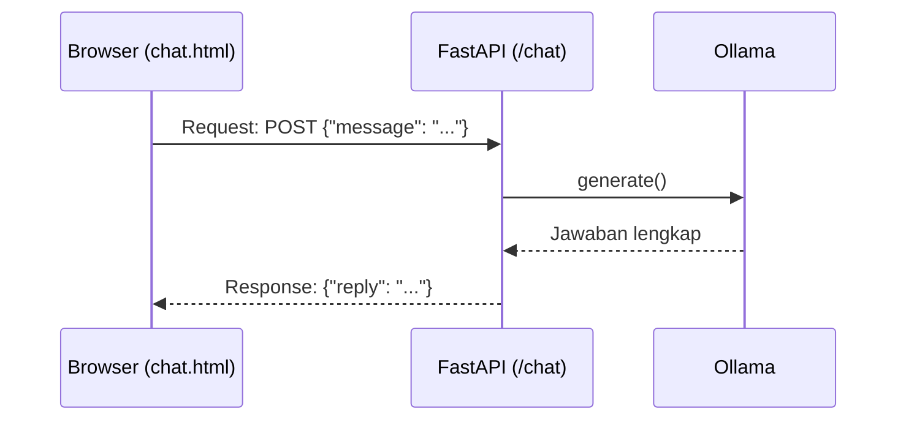
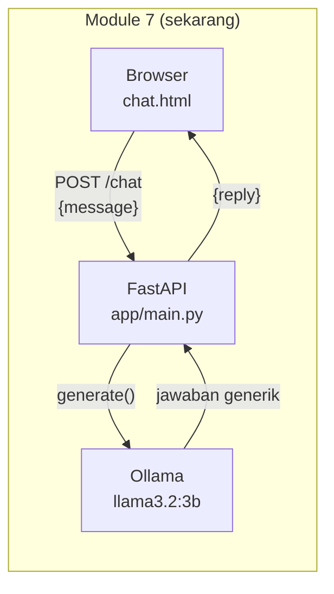

# Module 7: Chat UI Dasar

## Tujuan

Membangun antarmuka web dasar (`chat.html`) yang terhubung ke endpoint `/chat` Module 1-6 lewat FastAPI — endpoint paling sederhana yang mungkin (kirim satu pesan, tunggu, terima satu balasan utuh), dipakai untuk memverifikasi fondasi (Docker, network, model) sebelum kompleksitas apa pun ditambahkan. ⚠️ **`/chat` di module ini bersifat sementara**: begitu Module 8 menambahkan streaming, `/chat` **digantikan total** oleh `/chat/stream` — bukan hidup berdampingan. Lihat Module 8 Bagian 2 untuk penjelasan kenapa NALA sengaja pindah ke satu endpoint saja, bukan mempertahankan dua kontrak paralel.

## Definisi

**Endpoint** adalah satu alamat URL plus method HTTP tertentu (misalnya `POST /chat`) yang FastAPI "dengarkan" dan proses begitu ada request yang masuk ke situ — satu aplikasi web bisa punya banyak endpoint, dan tiap endpoint punya tugasnya masing-masing. Cara kerjanya mengikuti pola **request/response cycle**: browser (atau `curl`) mengirim **request** (misalnya `{"message": "..."}`), server memprosesnya, lalu mengirim balik **response** (`{"reply": "..."}`) — seluruh komunikasi NALA dengan browser, sepanjang Module 7-17, mengikuti pola ini dalam berbagai bentuk, cuma bentuk request/response-nya yang berubah dari module ke module.

Bentuk data yang disepakati antara pengirim dan penerima request itu disebut **kontrak API** — di module ini, kontraknya adalah `ChatRequest{message}` → `ChatResponse{reply}`. Selama kontrak ini tidak berubah, pemanggilnya (`chat.html`) tidak perlu tahu apa yang sebenarnya terjadi di baliknya (Bagian 2) — itulah yang membuat frontend dan backend bisa dikembangkan agak independen satu sama lain. **Chat UI** sendiri adalah antarmuka web tempat user mengetik pertanyaan dan membaca jawaban — di NALA diwakili satu file `chat.html`, dirender lewat Jinja2 (Bagian 3 Tahap C).



## Hasil Akhir yang Diharapkan

- `http://localhost:8000` menampilkan halaman chat yang bisa dipakai lewat browser, bukan lagi cuma `curl`
- Mengirim pesan dari UI mengembalikan balasan NALA (masih generik/pengetahuan umum, belum RAG)
- Kontrak `ChatRequest{message}` → `ChatResponse{reply}` terbukti tidak berubah dari Module 1-6
- Tidak ada error di log container `api` saat chat dikirim dari UI
- Kita punya baseline jawaban "sebelum RAG" untuk dibandingkan setelah Module 14 selesai
- Kita paham `/chat` di module ini adalah **fondasi sementara** — Module 8 akan menggantikannya total dengan `/chat/stream`, bukan menambah endpoint di sampingnya

## 1. Kenapa Mulai dari UI, Bukan Dokumen

Module 1-6 sudah membuktikan bahwa NALA bisa menjawab lewat `curl` — tapi `curl` bukan sesuatu yang akan dipakai staff PT Nusantara Finance sehari-hari. Sebelum Module 7-17 menumpuk kompleksitas baru (chunking, embedding, vector store, Airflow), langkah pertama adalah memastikan NALA bisa diakses lewat **antarmuka web** yang sama, yang nantinya dipakai sepanjang Module 7-30 — tanpa RAG dulu sama sekali.

Ini bukan langkah kosmetik. Ada dua hal konkret yang divalidasi di sini:

1. **Kontrak `/chat` tidak berubah dari Module 1-6 ke Module 7-17.** `ChatRequest{message}` → `ChatResponse{reply}` persis sama — bukti bahwa fondasi Module 1-6 (Docker, Ollama, `NALA_SYSTEM_PROMPT`) memang portable, bukan kebetulan yang cuma jalan sekali. `/chat` sendiri cuma bertahan sampai Module 8 (lihat Bagian 2) — begitu streaming dibutuhkan, endpoint ini digantikan total, bukan dipertahankan di samping yang baru.
2. **Masalah infrastruktur (Docker, network antar-container, model belum ter-pull) terdeteksi lebih awal**, sebelum ditumpuk dengan OpenSearch dan Airflow yang baru dikenalkan di Module 12 dan 15. Kalau chat dasar saja sudah gagal, jauh lebih mudah didiagnosis sekarang daripada setelah 3 service tambahan ikut jalan.



## 2. Kontrak `/chat`: Stabil untuk Satu Module Saja, dan Itu Disengaja

`POST /chat` — kirim `{"message": "..."}`, terima `{"reply": "..."}` — persis sama dengan Module 1-6, dan terbukti stabil selama module ini dijalankan: fondasi (FastAPI + Ollama + `NALA_SYSTEM_PROMPT`) bekerja tanpa modifikasi apa pun. Ini penting untuk **memisahkan masalah**: kalau chat dasar saja sudah gagal di titik ini, jauh lebih mudah didiagnosis sekarang daripada setelah HTML, streaming, dan RAG semuanya ikut ditumpuk.

Tapi kontrak ini **tidak dirancang untuk bertahan selamanya**. Begitu Module 8 butuh streaming (jawaban muncul token demi token) dan riwayat multi-turn (butuh mengirim **array** pesan, bukan satu `message`), kontrak `{"message"} → {"reply"}` sudah tidak cukup — bentuknya sendiri (satu request, satu response JSON utuh) bertentangan dengan cara kerja streaming. Daripada mempertahankan dua endpoint dengan dua kontrak berbeda selamanya (satu untuk kompatibilitas lama, satu untuk fitur baru), Module 8 **mengganti total**: `/chat` dihapus, `/chat/stream` menjadi satu-satunya endpoint chat NALA sejak saat itu — konsisten dengan keputusan "NALA seluruhnya berbasis streaming mulai Module 8" (lihat Module 8 Bagian 2 untuk alasan lengkapnya).

`chat.html` sendiri **akan berubah lebih awal dari yang mungkin terlihat wajar** — sudah di Module 8 (bukan menunggu sampai Module 14), karena streaming dan riwayat multi-turn butuh cara berbeda mengirim dan menampilkan pesan. Anggap Module 7 sebagai **jembatan sekali pakai**: cukup untuk membuktikan UI ↔ FastAPI ↔ Ollama tersambung, sebelum bentuk akhirnya (streaming) dibangun di atasnya.

## 3. Struktur Kode yang Ditambahkan

Dibanding starter code Module 1-6, ada tiga penambahan di `Nala/`. Daripada langsung ditunjukkan kode lengkap, mari bangun **secara bertahap dalam 3 tahap besar** — tiap tahap menambah satu kemampuan baru di atas tahap sebelumnya, dan bisa langsung dites sebelum lanjut ke tahap berikutnya:

1. **Tahap A — Verifikasi kode Module 1-6**, belum ada HTML sama sekali. Fokus: pastikan fondasi (FastAPI + Ollama + `NALA_SYSTEM_PROMPT`) masih jalan persis seperti Module 1-6, sebelum menambah apa pun.
2. **Tahap B — Buat file halaman dulu** (`chat.html`, `style.css`), belum terhubung ke FastAPI sama sekali. Fokus: menulis halamannya sendiri dulu sebagai unit yang berdiri sendiri, sebelum dipikirkan cara "menyambungkannya".
3. **Tahap C — Hubungkan**: tambah dependency `jinja2`, pasang `Jinja2Templates`/`StaticFiles`, dan buat endpoint `GET "/"` yang merender file dari Tahap B.

**Target akhirnya satu file yang sama: `Nala/app/main.py`** (plus `chat.html`, `style.css`) — file yang sama yang sudah Anda edit sejak Module 1-6, langsung di tempat. Ikuti Langkah 0-6 berikut untuk menulis kodenya bertahap.

### Tahap A — Verifikasi kode Module 1-6 (belum ada HTML)

**Langkah 0 — Prasyarat sebelum mulai**

- Sudah menyelesaikan **Module 1-6** (Docker Desktop terinstall, `llama3.2:3b` pernah dipakai, familiar dengan `docker compose up --build`).
- **`Nala/`** adalah satu-satunya folder kerja Anda, dipakai sejak Module 1-6 dan terus sama sepanjang Module 7-30 — panduan Module 7-17 membangunnya **bertahap, module demi module, langsung di tempat**, bukan disalin ke folder baru. `ollama_client.py`, `system_prompt.py`, `main.py`, `docker-compose.yml`, dan seterusnya sudah ada di sana dari Module 1-6. Konsekuensinya: **tidak ada folder lain untuk dipindahkan, dan tidak ada container yang perlu dimatikan** — container Ollama yang sudah jalan sejak Module 1-6 terus dipakai apa adanya (project Docker Compose-nya sama, karena foldernya sama), dan model yang sudah di-pull otomatis ikut terbawa, tidak perlu di-pull ulang.

⚠️ **Naikkan alokasi RAM Docker Desktop sebelum Module 17.** Module 7-17 menambahkan dua service baru di atas stack Module 1-6: **OpenSearch** (vector store, mulai Module 12) dan **Airflow** (orchestrator, mode `standalone`, mulai Module 17) — keduanya jauh lebih berat dibanding FastAPI/Ollama saja: OpenSearch adalah JVM yang butuh heap tersendiri, dan Airflow standalone menjalankan webserver + scheduler + database sekaligus dalam satu container. Kalau di Module 1-6 Anda mengalokasikan Docker Desktop di batas minimal (8–12GB), **naikkan ke 16GB+**. Ikuti langkah yang sama seperti **Langkah 0 di `Module-04-Setup-Infra-Docker-Compose/materi.md`, section 3.4** (Docker Desktop → ⚙️ Settings → tab Resources):

| Setting | Minimal Module 7-17 | Direkomendasikan | Alasan |
|---|---|---|---|
| **Memory (RAM)** | 8 GB | 16 GB+ | `llama3.2:3b` (~4-6GB) + `nomic-embed-text` + OpenSearch (heap `-Xms512m -Xmx512m` minimal, tapi JVM + OS overhead-nya lebih besar dari itu) + Airflow standalone (webserver+scheduler+metadata DB dalam satu proses) berjalan bersamaan. |
| **CPUs** | 4 | 4+ | 4 service (ollama, opensearch, airflow, api) aktif sekaligus. |
| **Disk image size** | 80 GB | 100 GB+ | Image `opensearchproject/opensearch` dan `apache/airflow` cukup besar (>1GB masing-masing), ditambah image Module 1-6 yang mungkin masih tersimpan. |
| **Swap** | 1 GB | 2 GB | Buffer tambahan kalau Memory limit sempat mepet saat semua service start bersamaan. |

Kalau Anda sudah mengubah setting ini di Module 1-6 ke 16GB+, tidak perlu diubah lagi. Setelah mengubah, klik **Apply & Restart**.

Catatan: panduan Module 7-17 menyalakan service **secara bertahap**, mengikuti urutan module — `ollama`+`api` dulu di Langkah 1 di bawah (Module 7-10 cuma butuh ini — Module 9 malah tidak butuh service apa pun, murni diskusi), `opensearch` menyusul di Module 12, `airflow` terakhir di Module 17 — jadi beban RAM di Module 7-11 jauh lebih ringan dari 16GB. Alokasi 16GB+ tetap perlu disiapkan sebelum Module 17, begitu keempat service jalan bersamaan.

Kalau disk mulai penuh, bersihkan image/volume lama yang tidak terpakai (lihat peringatan di `Module-04-Setup-Infra-Docker-Compose/materi.md`, section 3.4, soal `docker system prune -a --volumes` — perintah ini menghapus model Ollama yang sudah di-pull juga).

**Langkah 1 — Pastikan fondasi Module 1-6 masih utuh**

`docker-compose.yml`, `Dockerfile`, `requirements.txt`, `app/ollama_client.py`, `app/system_prompt.py`, dan `app/main.py` **tidak berubah sama sekali** dari Module 1-6 di titik ini — file-file ini sudah ada di `Nala/` dari module sebelumnya, tidak perlu disalin ulang atau ditulis ulang. Cukup pastikan `app/__init__.py` dan `tests/__init__.py` sudah ada (buat kalau belum):

```bash
cd Nala
touch app/__init__.py tests/__init__.py
```

Belum ada alasan untuk mengubah isi file yang sudah ada — perubahan baru muncul di Tahap C, begitu kita butuh sesuatu yang Module 1-6 tidak punya (merender HTML).

**▶️ Jalankan & lihat hasilnya**

```bash
cd Nala
docker compose up --build --no-deps ollama api
```

Stack Module 7-17 total punya 4 service (`ollama`, `opensearch`, `airflow`, `api`), tapi Module 7-10 (chat UI, streaming/multi-turn, konsep RAG, data seed — Module 9 murni diskusi konsep, tidak butuh service sama sekali) cuma butuh **dua yang pertama** — `opensearch` baru dipakai mulai Module 12, `airflow` baru dipakai mulai Module 17. Flag `--no-deps` penting: tanpa itu, Docker Compose otomatis ikut menyalakan `opensearch` karena `api` punya `depends_on: opensearch` di `docker-compose.yml`. Dengan `--no-deps`, benar-benar hanya 2 container yang jalan — dan ini aman meski `api` "seharusnya" nantinya butuh OpenSearch, karena di titik ini `/chat` belum menyentuh OpenSearch sama sekali (lihat Module 14 Bagian 2 Langkah 3 dan Module 16 Bagian 2 Tahap B untuk penjelasan fallback-nya begitu Anda sampai di situ).

Tunggu sampai log `api` menunjukkan `Uvicorn running on http://0.0.0.0:8000` — jauh lebih cepat dari menyalakan keempat service sekaligus, karena tidak perlu menunggu inisialisasi cluster OpenSearch atau database metadata Airflow.

Terminal baru, pull model (kalau belum) — di titik ini kita baru butuh `llama3.2:3b` untuk chat/generation; model embedding (`nomic-embed-text`) baru dipakai mulai Module 11, jadi baru di-pull nanti di Module 11 Langkah 1:
```bash
docker compose exec ollama ollama pull llama3.2:3b
```

⚠️ Tag `:3b` wajib ditulis persis — harus sama dengan `OLLAMA_MODEL` di `docker-compose.yml`. Verifikasi model sudah ada:

```bash
docker compose exec ollama ollama list
```

`llama3.2:3b` harus muncul di daftar.

Tes kedua endpoint, harus **identik persis** dengan Module 1-6:
```bash
curl http://localhost:8000/health
curl -X POST http://localhost:8000/chat \
  -H "Content-Type: application/json" \
  -d '{"message": "Halo, kamu siapa?"}'
```

✅ **Indikator sukses**: `/health` → `{"status":"ok"}`. `/chat` → jawaban NALA seperti di Module 1-6. Belum ada apa pun yang baru — ini cuma bukti fondasinya masih solid sebelum ditambah. Biarkan `docker compose up` tetap jalan, lanjut ke Tahap B.

**Troubleshooting**

- **`no configuration file provided: not found`**: `docker compose` dijalankan bukan dari folder yang berisi `docker-compose.yml`. Pastikan Anda berada persis di `Nala/` (cek dengan `ls`).
- **`failed to read dockerfile: open Dockerfile: no such file or directory`**: nama file salah — harus persis `Dockerfile`. Cek dengan `ls` dan rename kalau perlu: `mv DockerFile Dockerfile`.
- **`Internal Server Error` saat chat**: cek dulu model Ollama sudah ter-pull (`docker compose exec ollama ollama list`) — di titik ini baru `llama3.2:3b` yang dibutuhkan. Detail traceback Python bisa dilihat di log container `api` (terminal yang menjalankan `docker compose up` di atas).
- **Port sudah dipakai (8000/11434)**: ubah mapping port di `docker-compose.yml` untuk service yang bentrok (misal `8001:8000`).
- **Semua service terasa sangat lambat / laptop panas / container ter-*kill***: kemungkinan besar alokasi RAM Docker Desktop kurang — lihat Langkah 0 di atas. Cek pemakaian resource real-time dengan `docker stats`. Beban RAM di module ini masih ringan (cuma `ollama`+`api`); ini jadi penting begitu `opensearch` (Module 12) dan `airflow` (Module 17) ikut menyala.

<details>
<summary><strong>Pakai Claude Code? Salin prompt berikut, paste untuk eksekusi Langkah 1</strong></summary>

```
Pastikan file-file inti Module 1-6 masih utuh di Nala/
(tidak perlu disalin — sudah ada di sana dari module sebelumnya), lalu
buat 2 file kosong baru yang belum ada.

GOAL:
- Verifikasi 6 file berikut ada dan isinya belum berubah dari Module 1-6:
  - docker-compose.yml
  - Dockerfile
  - requirements.txt
  - app/ollama_client.py
  - app/system_prompt.py
  - app/main.py
- Buat 2 file kosong (0 baris) kalau belum ada: app/__init__.py dan
  tests/__init__.py di dalam Nala/

CONTEXT:
- Semua file berada di satu folder: Nala/
  (folder app/, app/templates/, app/static/, tests/ sudah ada tapi kosong)

GUARDRAIL:
- JANGAN ubah isi 6 file di atas — biarkan persis seperti Module 1-6.
- JANGAN buat file lain di luar 2 file kosong di atas.
```

</details>

**📄 Kode lengkap Tahap A** (persis `main.py` Module 1-6, belum ada HTML sama sekali):

```python
import os

from fastapi import FastAPI
from pydantic import BaseModel

from app.ollama_client import OllamaClient
from app.system_prompt import NALA_SYSTEM_PROMPT

app = FastAPI()

ollama_client = OllamaClient(
    base_url=os.environ.get("OLLAMA_BASE_URL", "http://localhost:11434"),
    model=os.environ.get("OLLAMA_MODEL", "llama3.2:3b"),
)


class ChatRequest(BaseModel):
    message: str


class ChatResponse(BaseModel):
    reply: str


@app.get("/health")
def health_check():
    return {"status": "ok"}


@app.post("/chat", response_model=ChatResponse)
def chat(request: ChatRequest) -> ChatResponse:
    reply = ollama_client.generate(
        system_prompt=NALA_SYSTEM_PROMPT,
        user_message=request.message,
    )
    return ChatResponse(reply=reply)
```

### Tahap B — Buat file halaman dulu (belum terhubung ke FastAPI)

Di Tahap A, `main.py` sudah solid tapi belum ada satu pun HTML. Daripada langsung memasang "pipa" (`Jinja2Templates`, `StaticFiles`) ke file yang belum ada, di tahap ini kita tulis dulu **halamannya sendiri** sebagai unit yang berdiri sendiri — baru di Tahap C dihubungkan ke FastAPI. Urutan ini sengaja dibalik dari kebiasaan "siapkan infrastruktur dulu, baru isi": lebih mudah menyambungkan sesuatu yang sudah nyata ada, daripada memasang pipa ke ruang kosong.

**Langkah 2 — Buat `app/templates/chat.html`**

```bash
mkdir -p app/templates app/static
```

```html
<!-- app/templates/chat.html -->
<!DOCTYPE html>
<html lang="id">
<head>
    <meta charset="UTF-8">
    <title>NALA — Chat</title>
    <link rel="stylesheet" href="/static/style.css">
</head>
<body>
    <div class="container">
        <h1>NALA — Nusantara Assistant</h1>
        <nav><a href="/">Chat</a></nav>
        <div id="history"></div>
        <form id="chat-form">
            <input type="text" id="message" placeholder="Tanya NALA seputar SOP..." required>
            <button type="submit">Kirim</button>
        </form>
    </div>
    <script>
        const form = document.getElementById("chat-form");
        const history = document.getElementById("history");
        const input = document.getElementById("message");

        function escapeHtml(text) {
            const div = document.createElement("div");
            div.textContent = text;
            return div.innerHTML;
        }

        form.addEventListener("submit", async (e) => {
            e.preventDefault();
            const message = input.value;
            history.innerHTML += `<p class="user"><b>Anda:</b> ${escapeHtml(message)}</p>`;
            input.value = "";

            const response = await fetch("/chat", {
                method: "POST",
                headers: { "Content-Type": "application/json" },
                body: JSON.stringify({ message }),
            });
            const data = await response.json();
            history.innerHTML += `<p class="nala"><b>NALA:</b> ${escapeHtml(data.reply)}</p>`;
            history.scrollTop = history.scrollHeight;
        });
    </script>
</body>
</html>
```

Ini HTML biasa dengan sedikit JavaScript (`fetch()`) untuk memanggil `/chat` tanpa reload halaman — bukan framework, bukan build step. `escapeHtml()` mencegah karakter HTML di pesan (user atau balasan NALA) dieksekusi begitu saja lewat `innerHTML` — pesan selalu ditampilkan sebagai teks polos, bukan HTML aktif. Perhatikan: `fetch("/chat", ...)` di sini memanggil endpoint yang **sudah ada** sejak Tahap A — file ini "menebak" endpoint yang benar tanpa perlu FastAPI tahu file ini ada.

<details>
<summary><strong>Pakai Claude Code? Salin prompt berikut, paste untuk eksekusi Langkah 2</strong></summary>

```
Buat halaman chat.html NALA (Module 7, Langkah 2) — HTML + JS murni,
BELUM ada style.css, BELUM dihubungkan ke FastAPI.

GOAL:
1. Buat folder Nala/app/templates/ dan
   Nala/app/static/ (boleh sudah ada, belum diisi apa pun).
2. Buat Nala/app/templates/chat.html —
   HTML biasa dengan form input pesan (id="chat-form"), area riwayat
   (id="history"), link ke /static/style.css (belum dibuat, wajar
   404 untuk sekarang), dan JavaScript fetch() ke POST /chat (kirim
   {message}, tampilkan data.reply). WAJIB ada fungsi escapeHtml()
   yang membungkus setiap teks sebelum dimasukkan ke innerHTML —
   baik pesan user maupun balasan NALA.

CONTEXT:
- app/main.py TIDAK disentuh sama sekali di langkah ini — endpoint
  /chat yang dipanggil chat.html sudah ada sejak Module 1-6/Tahap A.

GUARDRAIL:
- JANGAN ubah app/main.py sama sekali.
- JANGAN buat app/static/style.css di langkah ini — itu Langkah 3.
- JANGAN tambah fitur lain (streaming, riwayat percakapan, upload).
- WAJIB ada escapeHtml() atau setara.
```

</details>

**Langkah 3 — Buat `app/static/style.css`**

```css
/* app/static/style.css */
body {
    font-family: system-ui, sans-serif;
    max-width: 640px;
    margin: 40px auto;
    padding: 0 20px;
    color: #1a1a1a;
}

nav {
    margin-bottom: 20px;
}

nav a {
    margin-right: 12px;
}

#history {
    border: 1px solid #ddd;
    border-radius: 8px;
    padding: 16px;
    height: 320px;
    overflow-y: auto;
    margin-bottom: 12px;
}

.user {
    color: #1a1a1a;
}

.nala {
    color: #1e3a5f;
}

#chat-form {
    display: flex;
    gap: 8px;
}

#message {
    flex: 1;
    padding: 8px;
}
```

**▶️ Jalankan & lihat hasilnya**

Belum ada server yang tahu kedua file ini ada (`main.py` belum diubah) — jadi belum bisa dites lewat `curl`/`docker compose`. Cukup buka filenya langsung di browser lewat path lokal (bukan `http://localhost:8000`):

```
file:///path/ke/Nala/app/templates/chat.html
```

✅ **Indikator sukses**: struktur halaman (judul, kolom input, tombol "Kirim") tampil — tapi **styling tidak akan muncul benar** (CSS-nya `404`, karena path `/static/style.css` cuma valid kalau diakses lewat server FastAPI, bukan `file://`), dan tombol "Kirim" belum berfungsi (`fetch("/chat")` akan gagal, tidak ada server di `file://`). Itu **normal** — bukti keduanya sudah tertulis benar secara struktur; sambungan sungguhannya baru terjadi di Tahap C.

<details>
<summary><strong>Pakai Claude Code? Salin prompt berikut, paste untuk eksekusi Langkah 3</strong></summary>

```
Buat style.css NALA (Module 7, Langkah 3) — styling dasar untuk
chat.html yang sudah dibuat Langkah 2.

GOAL:
- Buat Nala/app/static/style.css —
  styling dasar: body max-width 640px center, #history dengan
  border+scroll, .user dan .nala dibedakan warna teks.

CONTEXT:
- app/templates/chat.html sudah dibuat di Langkah 2 dan sudah
  mereferensikan /static/style.css lewat tag <link> — JANGAN
  diubah isinya.
- app/main.py TIDAK disentuh sama sekali di langkah ini — belum ada
  endpoint GET "/" atau StaticFiles/Jinja2Templates, itu baru Tahap C.

GUARDRAIL:
- JANGAN ubah app/templates/chat.html.
- JANGAN ubah app/main.py sama sekali.
```

</details>

### Tahap C — Hubungkan: tambah dependency, wiring, dan endpoint

**Langkah 4 — Tambah dependency `jinja2`, tepat saat dibutuhkan**

`requirements.txt` Module 1-6 belum punya `jinja2`, karena Module 1-6 tidak pernah merender HTML. Begitu kita mau **menghubungkan** `chat.html` (Tahap B) ke FastAPI, kita baru butuh `Jinja2Templates` — dan itu artinya `jinja2` harus ditambahkan **di titik ini**, bukan dari awal. Buka `requirements.txt`, tambahkan satu baris di akhir:

```
jinja2==3.1.4
```

Pola ini akan berulang di module-module berikutnya: `python-multipart` ditambahkan tepat saat Module 15 butuh upload file, dependency OpenSearch/Airflow ditambahkan tepat saat Module 12 dan 15 membutuhkannya — bukan diborong semua di awal.

<details>
<summary><strong>Pakai Claude Code? Salin prompt berikut, paste untuk eksekusi Langkah 4</strong></summary>

```
Tambah dependency jinja2 ke requirements.txt NALA (Module 7,
Langkah 4) — BELUM mengubah main.py sama sekali.

GOAL:
- Di Nala/requirements.txt: tambahkan satu baris baru di akhir
  file: jinja2==3.1.4

CONTEXT:
- Dependency ini baru dibutuhkan sekarang karena Langkah 5 akan
  memakai Jinja2Templates untuk merender chat.html (dibuat Tahap B).

GUARDRAIL:
- JANGAN ubah app/main.py di langkah ini — itu Langkah 5-6.
- JANGAN tambah dependency lain yang tidak diminta.
```

</details>

**Langkah 5 — Pasang `Jinja2Templates` & mount `StaticFiles`**

Di `app/main.py`, tambahkan tiga import baru di baris atas, dan ubah baris `app = FastAPI()`:

```python
from fastapi import FastAPI, Request
from fastapi.staticfiles import StaticFiles
from fastapi.templating import Jinja2Templates
```

- **`FastAPI`**: sudah dipakai sejak Module 1-6 (bikin `app`), tidak berubah.
- **`Request`**: tipe data yang mewakili satu request HTTP yang masuk. Dibutuhkan karena `Jinja2Templates.TemplateResponse()` (dipakai di Langkah berikutnya) **mewajibkan** parameter `request` dikirim — konvensi Starlette/FastAPI, bukan pilihan bebas.
- **`StaticFiles`**: class untuk "menyajikan" file mentah (CSS, JS, gambar) langsung dari sebuah folder lewat URL, tanpa perlu bikin endpoint satu-satu per file.
- **`Jinja2Templates`**: penghubung FastAPI ke library `Jinja2` (baru ditambahkan ke `requirements.txt` di Langkah 4) — tugasnya merender file `.html` jadi HTML sungguhan yang dikirim ke browser.

Perhatikan: `StaticFiles` dan `Jinja2Templates` **tidak** ikut di `from fastapi import ...` seperti `FastAPI`/`Request` — keduanya ada di submodule terpisah (`fastapi.staticfiles`, `fastapi.templating`), karena keduanya fitur "opsional/tambahan", bukan inti FastAPI yang dipakai semua aplikasi.

```python
app = FastAPI(title="NALA")
app.mount("/static", StaticFiles(directory="app/static"), name="static")
templates = Jinja2Templates(directory="app/templates")
```

- **`FastAPI(title="NALA")`**: sama seperti Module 1-6, tapi sekarang dengan `title="NALA"` — cuma memengaruhi nama yang ditampilkan di dokumentasi otomatis FastAPI (Swagger UI di `/docs`), tidak mengubah perilaku endpoint apa pun.
- **`app.mount("/static", StaticFiles(directory="app/static"), name="static")`**: mendaftarkan URL prefix `/static` — setiap request ke `/static/apa-saja` akan dijawab dengan mencari file yang cocok di folder `app/static/` (dibuat Tahap B) pada disk. Sekarang `style.css` yang tadi cuma "file lokal" di Tahap B, resmi bisa diakses lewat `http://localhost:8000/static/style.css`.
- **`templates = Jinja2Templates(directory="app/templates")`**: membuat satu instance mesin Jinja2, menunjuk ke folder `app/templates/` (isinya `chat.html` dari Tahap B). Ini baru **membuat objeknya saja** — belum ada endpoint yang memanggilnya, itu Langkah 6.

<details>
<summary><strong>Pakai Claude Code? Salin prompt berikut, paste untuk eksekusi Langkah 5</strong></summary>

```
Pasang Jinja2Templates & mount StaticFiles di main.py NALA (Module 7,
Langkah 5) — BELUM menambah endpoint baru.

GOAL:
1. Di Nala/app/main.py, tambahkan ke import yang sudah ada:
   `Request` dari `fastapi`, `StaticFiles` dari
   `fastapi.staticfiles`, `Jinja2Templates` dari
   `fastapi.templating`.
2. Ubah baris `app = FastAPI()` menjadi tiga baris:
   app = FastAPI(title="NALA")
   app.mount("/static", StaticFiles(directory="app/static"), name="static")
   templates = Jinja2Templates(directory="app/templates")

CONTEXT:
- jinja2 sudah ditambahkan ke requirements.txt di Langkah 4.
- app/static/style.css dan app/templates/chat.html sudah ada dari
  Tahap B — JANGAN diubah isinya.

GUARDRAIL:
- JANGAN tambahkan endpoint baru di langkah ini — itu Langkah 6.
- JANGAN ubah endpoint /health atau /chat yang sudah ada.
```

</details>

**Langkah 6 — Tambahkan endpoint `GET "/"` yang merender `chat.html`**

Di bagian bawah `app/main.py`, setelah endpoint `/chat` yang sudah ada, tambahkan import baru dan endpoint-nya:

```python
from fastapi.responses import HTMLResponse


@app.get("/", response_class=HTMLResponse)
def chat_page(request: Request):
    return templates.TemplateResponse("chat.html", {"request": request})
```

- **`response_class=HTMLResponse`**: memberi tahu FastAPI bahwa endpoint ini mengembalikan HTML, bukan JSON seperti `/health`/`/chat`.
- **`templates.TemplateResponse("chat.html", {"request": request})`**: inilah momen "menghubungkan" — merender persis file `chat.html` yang ditulis di Tahap B (Langkah 2), lewat mesin Jinja2 yang disiapkan Langkah 5.

**▶️ Jalankan & lihat hasilnya**

`requirements.txt` berubah (ada `jinja2` baru), jadi image perlu dibangun ulang:

```bash
docker compose up --build --no-deps ollama api
```

Buka `http://localhost:8000/` di **browser** (bukan `file://` lagi) — sekarang harus muncul halaman chat dengan styling yang benar (bandingkan dengan Tahap B yang CSS-nya `404`). Coba kirim pesan apa saja, misalnya "Halo, kamu siapa?".

✅ **Indikator sukses**: halaman chat tampil lengkap dengan styling, dan mengirim pesan menghasilkan balasan dari NALA di `#history` — koneksi UI → FastAPI → Ollama bekerja penuh, dan `chat.html`/`style.css` dari Tahap B sekarang benar-benar tersambung, bukan cuma file lokal.

<details>
<summary><strong>Pakai Claude Code? Salin prompt berikut, paste untuk eksekusi Langkah 6</strong></summary>

```
Tambahkan endpoint GET "/" di main.py NALA (Module 7, Langkah 6) —
momen chat.html benar-benar tersambung ke FastAPI.

GOAL:
- Di Nala/app/main.py, tambahkan import baru dan endpoint baru di
  bagian PALING BAWAH file (setelah endpoint /chat yang sudah ada):

  from fastapi.responses import HTMLResponse


  @app.get("/", response_class=HTMLResponse)
  def chat_page(request: Request):
      return templates.TemplateResponse("chat.html", {"request": request})

CONTEXT:
- `templates` (instance Jinja2Templates) dan `Request` sudah
  diimpor/dibuat di Langkah 5 — JANGAN didefinisikan ulang.
- app/templates/chat.html dan app/static/style.css sudah dibuat di
  Tahap B — JANGAN dibuat ulang atau diubah isinya.

GUARDRAIL:
- JANGAN ubah endpoint /health atau /chat sama sekali.
- JANGAN ubah isi chat.html/style.css — file itu sudah final dari
  Tahap B, tugas di sini murni menyambungkan lewat main.py.
```

</details>

**📄 Kode lengkap Tahap C** (versi final Module 7):

```python
import os

from fastapi import FastAPI, Request
from fastapi.responses import HTMLResponse
from fastapi.staticfiles import StaticFiles
from fastapi.templating import Jinja2Templates
from pydantic import BaseModel

from app.ollama_client import OllamaClient
from app.system_prompt import NALA_SYSTEM_PROMPT

app = FastAPI(title="NALA")
app.mount("/static", StaticFiles(directory="app/static"), name="static")
templates = Jinja2Templates(directory="app/templates")

ollama_client = OllamaClient(
    base_url=os.environ.get("OLLAMA_BASE_URL", "http://localhost:11434"),
    model=os.environ.get("OLLAMA_MODEL", "llama3.2:3b"),
)


class ChatRequest(BaseModel):
    message: str


class ChatResponse(BaseModel):
    reply: str


@app.get("/health")
def health_check():
    return {"status": "ok"}


@app.post("/chat", response_model=ChatResponse)
def chat(request: ChatRequest) -> ChatResponse:
    reply = ollama_client.generate(
        system_prompt=NALA_SYSTEM_PROMPT,
        user_message=request.message,
    )
    return ChatResponse(reply=reply)


@app.get("/", response_class=HTMLResponse)
def chat_page(request: Request):
    return templates.TemplateResponse("chat.html", {"request": request})
```

Dibandingkan **Kode lengkap Tahap A**: tambah 4 import (`Request`, `HTMLResponse`, `StaticFiles`, `Jinja2Templates`), dua baris `mount`/`templates`, dan satu endpoint baru di bagian bawah. **Tidak ada satu baris pun di `/health` atau `/chat` yang berubah** — itulah inti Tahap C: menghubungkan halaman yang sudah jadi (Tahap B) tanpa menyentuh yang sudah jalan (Tahap A).

**Langkah 7 — Verifikasi hasil akhir**

Setelah Langkah 1-6 (Tahap A-C), `app/main.py` Anda seharusnya cocok dengan **📄 Kode lengkap Tahap C** di atas (susunan boleh sedikit beda, isinya yang harus sama).

## 4. Apa yang TIDAK Ada di Module Ini

Untuk menjaga fokus, Module 7 sengaja **tidak** menyentuh:
- Streaming atau riwayat multi-turn (Module 8 — endpoint `/chat/stream` **menggantikan** `/chat`, dibangun di atas fondasi module ini)
- Konsep RAG (Module 9), data seed (Module 10, belum ada chunking)
- Embedding (Module 11), vector search (Module 13)
- Retrieval yang benar-benar dipakai `/chat/stream` (Module 14, versi tanpa chunking)
- Chunking (Module 15) dan upload dokumen (Module 16, halaman `/upload`)
- Airflow (Module 17)

Kalau dicoba di titik ini, jawaban NALA akan terasa "biasa saja" — sama seperti Module 1-6 — dan itu **memang tujuannya**: memberi kita garis dasar (baseline) yang jelas untuk dibandingkan setelah RAG mulai aktif di Module 14. Perbedaan sebelum-dan-sesudah ini adalah salah satu momen belajar paling nyata di Module 7-17.

## 5. Checkpoint Praktik

Langkah eksekusi lengkap (menjalankan `docker compose up`, membuka `http://localhost:8000`, dan mencoba chat) ada di **Bagian 3 di atas, Tahap A Langkah 0-1 (setup & jalankan) sampai Tahap C Langkah 6 (buka browser & chat)**. Yang perlu dipastikan sebelum lanjut ke Module 8:

- [ ] `http://localhost:8000` menampilkan halaman chat (bukan JSON mentah)
- [ ] Mengirim pesan dari UI mengembalikan balasan dari NALA (walau jawabannya generik)
- [ ] Tidak ada error di log container `api` saat chat dikirim

Begitu ketiga hal ini terverifikasi, lanjut ke Module 8 — yang membuat balasan NALA terasa hidup lewat streaming dan mengingat konteks percakapan sebelumnya (multi-turn), sebelum Module 7-17 menumpuk kompleksitas dokumen/RAG.
