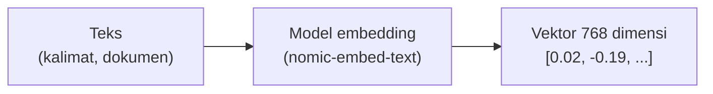

# Module 9: Embedding

## Tujuan

Mengubah teks jadi representasi vektor numerik yang menangkap makna semantiknya, memakai model embedding lokal `nomic-embed-text` lewat Ollama — fondasi yang dibutuhkan sebelum Module 10 (vector store) bisa menyimpan dan mencari berdasarkan kemiripan makna. Di Module 11, `embed_text()` ini akan dipanggil untuk **satu dokumen SOP utuh sekaligus** (belum ada chunking — itu baru masuk Module 12), jadi fungsinya sendiri tidak peduli apakah inputnya satu kalimat pendek atau satu dokumen penuh, selama masih di bawah batas context window model.

## Definisi

**Embedding** adalah representasi teks sebagai **vektor** — daftar angka dengan panjang tetap (di sini 768 angka desimal) — yang menangkap makna semantik teks itu, bukan cuma susunan hurufnya. Teks yang maknanya mirip akan menghasilkan vektor yang "berdekatan" secara matematis, sementara teks yang maknanya jauh berbeda menghasilkan vektor yang "berjauhan" — inilah dasar dari pencarian berbasis makna yang dibahas lebih detail di Module 10 (Bagian 1).

Proses mengubah teks jadi vektor itu dilakukan oleh **model embedding** — model AI yang tugasnya cuma menghasilkan vektor, bukan menghasilkan teks baru seperti model chat (`llama3.2:3b`). NALA memakai `nomic-embed-text` untuk keperluan ini (Bagian 2). Sifat penting model embedding, dan yang membedakannya dari model chat: hasilnya **deterministik** — teks masukan yang sama selalu menghasilkan vektor yang sama persis, tanpa elemen acak, berbeda dengan `generate()`/`chat_stream()` yang jawabannya bisa bervariasi tiap kali dipanggil (Bagian 4).



## Hasil Akhir yang Diharapkan

- Model `nomic-embed-text` ter-pull dan terdaftar di Ollama, sejajar dengan `llama3.2:3b`
- `embed_text()` menghasilkan vektor 768 dimensi dari teks input
- Kita paham kenapa embedding yang sama untuk teks yang sama selalu identik (tidak ada elemen acak, beda dengan `generate()`/`chat_stream()`)
- `/chat/stream` (Module 5, 6) tetap berfungsi seperti sebelumnya

## 1. Apa itu Embedding

Embedding adalah proses mengubah teks menjadi representasi vektor numerik yang menangkap makna semantik dari teks tersebut. Setiap kata atau dokumen dipetakan ke dalam ruang vektor berdimensi tinggi, di mana:

- **Teks dengan makna mirip** akan memiliki vektor yang "berdekatan" dalam ruang vektor tersebut
- **Teks dengan makna berbeda** akan memiliki vektor yang "jauh" satu sama lain
- **Jarak/kesamaan antar vektor** bisa diukur dengan metrik seperti cosine similarity, Euclidean distance, atau dot product (dibahas detail di Module 10 Bagian 5, setelah vector store-nya sendiri dibangun)

Contoh: frasa "kucing domestik" dan "kucing rumahan" akan memiliki vektor yang sangat mirip karena maknanya serupa, meskipun kata-katanya berbeda.

**Keuntungan embedding** dibanding pencocokan kata kunci murni: menangkap makna semantik (bukan cuma pencocokan kata), memungkinkan pencarian lebih akurat dan kontekstual, bisa mendeteksi sinonim dan variasi bahasa — jadi dasar untuk retrieval berbasis kemiripan dalam RAG (Module 7 Bagian 4).

## 2. Model Embedding Lokal: `nomic-embed-text`

`nomic-embed-text` adalah model embedding open-source yang dirancang menghasilkan vektor berkualitas tinggi dengan footprint kecil, dijalankan **secara lokal** lewat Ollama — tanpa ketergantungan API pihak ketiga (konsisten dengan prinsip privasi Module 1-4).

**Karakteristik**: output vektor 768 dimensi, ukuran model ~270 MB (jauh lebih kecil dari model chat), gratis, berjalan lokal tanpa biaya inference. Cara kerjanya sama seperti model chat lewat Ollama, tapi **output-nya vektor numerik**, bukan teks.

⚠️ **Batas context window**: seperti model chat, model embedding juga punya batas panjang input (`nomic-embed-text` sekitar 8192 token). Kedua SOP contoh (Module 8 Bagian 2) masih jauh di bawah batas ini, jadi Module 11 aman meng-embed dokumen utuh. Tapi ini bukan batas yang aman diandalkan selamanya — dokumen SOP yang lebih panjang, atau hasil scan PDF berhalaman banyak, bisa saja melewatinya. Ini salah satu alasan konkret kenapa Module 12 menambahkan chunking: memecah dokumen panjang jadi potongan kecil otomatis menjaga tiap potongan tetap di bawah batas ini, terlepas dari seberapa panjang dokumen aslinya.

## 3. Instalasi Model Embedding

**Langkah 1 — Pull model `nomic-embed-text`**

Belum pernah dipakai sejak Module 1-8 — di-pull tepat sekarang karena baru sekarang dibutuhkan. Pull-nya lewat **`docker compose exec`** (di dalam container), sama seperti `llama3.2:3b` di Module 1-4:

```bash
docker compose exec ollama ollama pull nomic-embed-text
```

```bash
docker compose exec ollama ollama list
```

`llama3.2:3b` (Module 5) dan `nomic-embed-text` harus muncul berdua di daftar.

**Test manual lewat `curl`** (opsional, tidak perlu Python untuk sekadar verifikasi):

```bash
curl http://localhost:11434/api/embed \
  -d '{"model": "nomic-embed-text", "input": "Ini adalah contoh teks untuk di-embed"}'
```

Response-nya JSON berisi `"embeddings": [[...768 angka...]]` — hitung panjang array untuk memastikan benar 768 dimensi.

## 4. Struktur Kode yang Ditambahkan

**Langkah 2 — Buat `app/embeddings.py`**

```python
# app/embeddings.py
import httpx


def embed_text(text: str, base_url: str, model: str = "nomic-embed-text") -> list[float]:
    with httpx.Client() as client:
        response = client.post(
            f"{base_url}/api/embed",
            json={"model": model, "input": text},
            timeout=60.0,
        )
        response.raise_for_status()
        return response.json()["embeddings"][0]
```

- Memanggil `/api/embed` Ollama (endpoint berbeda dari `/api/generate` yang dipakai `generate()` dan `/api/chat` yang dipakai `chat_stream()`) — dipilih Ollama karena curl test Bagian 3 juga memakai endpoint yang sama persis.
- `response.json()["embeddings"][0]`: Ollama selalu mengembalikan `embeddings` sebagai **array of array** (mendukung banyak input sekaligus), meski di sini cuma kirim satu `text` — makanya diambil elemen `[0]`.
- File terpisah (`app/embeddings.py`, bukan ditambahkan ke `ollama_client.py`) karena secara konsep ini bukan bagian dari "client chat" — ini utilitas embedding yang nanti dipakai `app/ingest.py` (Module 11) maupun `/chat`/`/chat/stream` (juga Module 11) untuk retrieval, bukan untuk chat langsung.

**▶️ Jalankan & lihat hasilnya**

```bash
docker compose up --build api
```

```bash
docker compose exec api python -c "
from app.embeddings import embed_text
vec = embed_text('Kantor cabang Surabaya buka Senin-Jumat', base_url='http://ollama:11434')
print(f'Dimensi: {len(vec)}')
print(f'Contoh nilai: {vec[:3]}')
"
```

✅ **Indikator sukses**: `Dimensi: 768`, dan `Contoh nilai` menampilkan 3 angka desimal, contohnya:

```
Dimensi: 768
Contoh nilai: [-0.029345576, 0.008089973, -0.13369113]
```

Angka persisnya di komputer Anda mungkin sedikit berbeda, tapi untuk teks masukan yang **sama**, `embed_text()` akan selalu mengembalikan vektor yang **sama persis** kalau dijalankan berulang kali — beda dengan `generate()`/`chat_stream()` yang jawabannya bisa bervariasi tiap kali (ada elemen "kreativitas" dari sampling LLM). Embedding tidak punya elemen acak semacam itu — murni hasil perhitungan matematis dari teks masukan. Yang penting **dimensinya selalu 768** dan nilainya berupa pecahan desimal, bukan `None`/error.

<details>
<summary><strong>Pakai Claude Code? Salin prompt berikut, paste untuk eksekusi Langkah 2</strong></summary>

```
Buat app/embeddings.py dengan fungsi embed_text() (Module 9, Tahap A).

GOAL:
- Buat resources/starter-code/day-2/nala/app/embeddings.py berisi
  fungsi embed_text(text: str, base_url: str, model: str =
  "nomic-embed-text") -> list[float] yang POST ke {base_url}/api/embed
  dengan json {"model": model, "input": text}, timeout 60.0, lalu
  return response.json()["embeddings"][0] (ambil elemen pertama,
  karena Ollama selalu balas array of array).

CONTEXT:
- File baru, terpisah dari app/ollama_client.py — ini utilitas
  embedding, bukan bagian dari chat client.
- Model nomic-embed-text sudah di-pull (Langkah 1).

GUARDRAIL:
- JANGAN ubah app/ollama_client.py, app/main.py, atau file lain.
- JANGAN tambah class atau fungsi lain di app/embeddings.py selain
  embed_text().
```

</details>

## 5. Checkpoint Praktik

Yang perlu dipastikan sebelum lanjut ke Module 10:

- [ ] `nomic-embed-text` ter-pull dan muncul di `docker compose exec ollama ollama list`
- [ ] `embed_text()` menghasilkan vektor 768 dimensi
- [ ] Embedding untuk teks yang sama selalu identik kalau dipanggil berulang kali
- [ ] `/chat`, `/chat/stream` (Module 5, 6) masih berfungsi seperti sebelumnya

Begitu keempat hal ini terverifikasi, lanjut ke Module 10 — menyimpan vektor-vektor ini di OpenSearch supaya bisa dicari berdasarkan kemiripan makna, sekaligus membahas detail metrik kemiripan (L2, cosine similarity, dot product) yang jadi dasar pencarian semantik.
