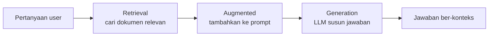
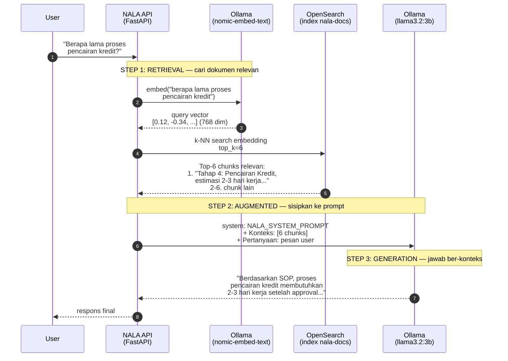

# Module 9: Konsep RAG

## Tujuan

Sebelum membangun satu baris kode pun untuk upload, embedding, chunking, atau Airflow — kita perlu paham **kenapa** semua itu dibutuhkan. Module ini menjawab pertanyaan itu murni lewat konsep dan diskusi: kenapa LLM saja tidak cukup untuk NALA (halusinasi), analogi yang memudahkan intuisi (ujian *closed-book* vs *open-book*), definisi RAG, alur kerjanya secara garis besar, dan — sama pentingnya — kapan RAG **bukan** jawaban yang tepat.

**Prasyarat**: sudah menyelesaikan **Module 8** (Streaming & Multi-Turn Conversation).

Tidak ada kode atau perintah terminal di module ini — Module 9 murni sesi konsep/diskusi, tidak butuh container apa pun menyala.

## Definisi

Module ini murni tentang mendefinisikan istilah — ringkasannya di sini, penjelasan lengkap di Bagian 1-5. **Halusinasi** adalah ketika LLM menjawab dengan percaya diri walau jawabannya salah atau sepenuhnya dikarang, karena model tidak benar-benar "tahu" di mana batas pengetahuannya sendiri (Bagian 1). Cara paling intuitif memahaminya lewat analogi **closed-book vs open-book**: LLM murni seperti siswa ujian *closed-book* yang cuma boleh menjawab dari ingatan, sementara LLM dengan RAG seperti siswa ujian *open-book* yang boleh membuka catatan/dokumen relevan dulu sebelum menjawab (Bagian 2).

**RAG (Retrieval-Augmented Generation)** adalah teknik memperkaya jawaban LLM dengan dokumen relevan yang dicari lebih dulu, sebelum LLM menyusun jawaban akhirnya — namanya sendiri menjelaskan dua langkah utamanya. **Retrieval** adalah langkah mencari dan mengambil dokumen atau potongan teks yang relevan dengan pertanyaan user, dari sekumpulan dokumen yang sudah disiapkan sebelumnya (Bagian 4). **Generation** adalah langkah LLM menyusun jawaban akhir berdasarkan konteks yang sudah ditemukan tadi — sama seperti generation biasa, bedanya sekarang model punya bahan rujukan konkret, bukan cuma mengandalkan ingatan internalnya.

## Hasil Akhir yang Diharapkan

- Kita bisa menjelaskan apa itu halusinasi LLM dan kenapa itu risiko nyata untuk asisten internal PT Nusantara Finance, bukan sekadar kelemahan teoretis
- Kita bisa menjelaskan RAG lewat analogi ujian *closed-book* vs *open-book* dengan kata-kata sendiri
- Kita paham definisi RAG (*Retrieval-Augmented Generation*) dan dua komponen utamanya: retrieval dan generation
- Kita bisa menggambarkan alur kerja RAG secara garis besar — dari pertanyaan user sampai jawaban ber-konteks — tanpa perlu tahu detail implementasi (itu Module 10-17)
- Kita paham RAG punya batasan: bisa menyebutkan minimal dua situasi di mana RAG bukan solusi yang tepat
- **Tidak ada kode yang ditulis di module ini** — murni fondasi konsep untuk Module 10-17

## 1. Kelemahan LLM: Halusinasi

Module 1 sudah membahas kenapa PT Nusantara Finance butuh LLM **privat** (privasi data). Module ini membahas masalah berbeda yang sama pentingnya: privat atau tidak, LLM murni (tanpa bantuan apa pun) punya kelemahan struktural yang disebut **halusinasi**.

**Halusinasi** adalah ketika LLM menghasilkan jawaban yang terdengar meyakinkan, lancar, dan percaya diri — tapi salah, atau bahkan sepenuhnya dikarang. Ini bukan "bug" yang bisa diperbaiki dengan patch, tapi konsekuensi langsung dari cara LLM bekerja (Module 1 Bagian 1): LLM memprediksi kata paling mungkin berikutnya berdasarkan pola statistik dari data training — ia tidak "mengecek fakta" ke sumber mana pun sebelum menjawab, karena memang tidak ada sumber yang bisa dicek. Kalau pola statistiknya mengarah ke jawaban yang terdengar masuk akal tapi salah, LLM tidak tahu bedanya dengan jawaban yang benar — keduanya sama-sama "hasil prediksi kata paling mungkin".

**Kenapa ini risiko nyata untuk NALA, bukan kekhawatiran abstrak:**

- LLM `llama3.2:3b` (atau model apa pun) **tidak pernah dilatih dengan SOP internal PT Nusantara Finance** — dokumen itu tidak ada di data training-nya sama sekali. Kalau ditanya "berapa lama proses pencairan kredit di PT Nusantara Finance?", model tidak punya jawaban yang benar-benar diketahuinya — tapi ia tetap bisa saja menjawab dengan angka yang terdengar masuk akal (mengarang berdasarkan pola umum proses kredit yang pernah dilihat di data training-nya), bukan angka yang benar-benar berlaku di perusahaan ini.
- Staff yang bertanya ke NALA **tidak selalu tahu jawabannya salah** — kalau jawabannya terdengar profesional dan percaya diri, staff cenderung memercayainya begitu saja. Untuk institusi finansial, kesalahan seperti ini (misal salah menyebut syarat pengajuan kredit, salah menyebut estimasi waktu proses) bisa berdampak nyata ke keputusan bisnis atau layanan ke nasabah.
- Halusinasi **tidak hilang** hanya karena modelnya lebih besar/canggih — model besar sekalipun (GPT-4, Claude) tetap bisa berhalusinasi kalau ditanya sesuatu yang tidak ada di pengetahuannya. Yang berubah cuma frekuensinya, bukan kemungkinannya jadi nol.

⚠️ **Yang TIDAK bisa menyelesaikan halusinasi**: memperbaiki system prompt (Module 3) membantu mengurangi *cara* model menjawab (misal instruksi "jangan mengarang, jujur kalau tidak tahu"), tapi itu cuma instruksi — model tetap bisa saja mengabaikannya kalau pola statistiknya kuat mengarah ke jawaban yang salah. Prompt engineering mengurangi gejala, bukan akar masalah: model tetap tidak punya akses ke fakta sebenarnya tentang PT Nusantara Finance.

## 2. Analogi: Ujian *Closed-Book* vs *Open-Book*

Cara paling intuitif memahami masalah ini dan solusinya: bayangkan LLM sebagai siswa yang mengikuti ujian.

**Ujian *closed-book*** (LLM murni, tanpa bantuan apa pun): siswa masuk ruang ujian tanpa boleh membawa catatan atau buku apa pun. Semua jawaban harus berasal dari **ingatan** — apa yang pernah dipelajari/dibaca sebelumnya. Kalau soalnya tentang sesuatu yang memang pernah dipelajari dengan baik, jawabannya bisa akurat. Tapi kalau soalnya tentang sesuatu yang **tidak pernah diajarkan** (misal SOP internal perusahaan yang baru siswa itu masuki kerja), siswa yang pintar sekalipun akan **menebak** berdasarkan pengetahuan umum yang mirip-mirip — dan tebakan yang percaya diri itu bisa terdengar meyakinkan padahal salah. Ini persis situasi LLM murni menjawab pertanyaan tentang PT Nusantara Finance: menjawab dari "ingatan" (data training umum), bukan dari fakta sebenarnya perusahaan ini.

**Ujian *open-book*** (LLM dengan RAG): siswa yang sama, tapi sekarang **boleh membuka buku catatan/referensi yang relevan sebelum menjawab**. Kalau ditanya soal SOP pengajuan kredit, siswa ini tinggal membuka halaman SOP yang tepat, membaca isinya, lalu menjawab **berdasarkan apa yang baru saja dibaca** — bukan menebak dari ingatan samar. Jawabannya jauh lebih akurat, bukan karena siswanya jadi lebih pintar, tapi karena ia **diberi akses ke sumber yang benar** tepat sebelum menjawab.

| | Closed-book (LLM murni) | Open-book (LLM + RAG) |
|---|---|---|
| Sumber jawaban | Ingatan/pengetahuan umum model | Dokumen relevan yang diambilkan tepat sebelum menjawab |
| Kalau topiknya tidak pernah "diajarkan" | Menebak — berisiko halusinasi | Tetap bisa dijawab, selama dokumennya ada di knowledge base |
| Kejujuran saat tidak tahu | Sering tetap menjawab dengan percaya diri | Bisa dirancang untuk mengaku "tidak ditemukan" kalau dokumennya memang tidak ada (Module 14 Bagian 4) |

RAG, secara sederhana, adalah cara **mengubah LLM dari siswa ujian closed-book jadi siswa ujian open-book** — bukan dengan melatih ulang modelnya (mahal, lambat, perlu data training baru tiap kali SOP berubah), tapi dengan **memberi rujukan yang relevan tepat sebelum ia menjawab**.

## 3. Apa itu RAG?

**RAG** singkatan dari ***Retrieval-Augmented Generation*** — tiga kata yang masing-masing punya arti spesifik:

- **Retrieval** (pengambilan) — proses **mencari dan mengambil** potongan informasi yang relevan dengan pertanyaan, dari kumpulan dokumen yang sudah disiapkan sebelumnya (knowledge base).
- **Augmented** (diperkaya) — informasi yang berhasil diambil itu **ditambahkan** ke dalam prompt yang dikirim ke LLM, sebagai konteks tambahan sebelum pertanyaan aslinya.
- **Generation** (penghasilan jawaban) — LLM tetap yang menghasilkan jawaban akhir dalam bahasa natural, tapi sekarang dengan konteks yang relevan sudah "disodorkan" ke dalam prompt, bukan hanya mengandalkan ingatan internalnya.

Definisi singkatnya: **RAG adalah teknik yang menggabungkan pencarian informasi (retrieval) dengan kemampuan LLM menyusun jawaban (generation), supaya jawaban yang dihasilkan didasarkan pada dokumen sungguhan — bukan sekadar ingatan/tebakan model.**

Poin penting yang perlu ditekankan: **RAG bukan model baru, bukan juga melatih ulang LLM yang sudah ada.** `llama3.2:3b` yang dipakai NALA tetap model yang sama persis sejak Module 1-4 — tidak ada proses training tambahan apa pun. RAG murni soal **apa yang dimasukkan ke dalam prompt** sebelum dikirim ke model itu. Ini kenapa RAG jadi pendekatan yang praktis dan murah dibanding melatih ulang model dari nol tiap kali ada SOP baru — cukup tambahkan dokumen ke knowledge base (Module 10), sistem retrieval yang akan mencarikan bagian relevannya secara otomatis.

## 4. Alur Kerja RAG

Secara garis besar (detail teknis tiap panah di bawah ini adalah materi Module 10-15), begini alur RAG bekerja setiap kali ada pertanyaan masuk:

Perhatikan dua hal yang membedakan alur ini dari LLM murni: **STEP 1 (retrieval)** terjadi **sebelum** LLM pernah dipanggil sama sekali — LLM (`llama3.2:3b`) baru masuk di **STEP 3**, dan saat itu ia sudah dibekali konteks dari dokumen sungguhan (STEP 2), bukan mengandalkan ingatan internalnya. `Embedding Model` dan `LLM` di diagram ini **sama-sama Ollama**, cuma dipanggil dengan model berbeda untuk tugas berbeda (`nomic-embed-text` untuk mengubah teks jadi vektor pencarian, `llama3.2:3b` untuk menyusun jawaban akhir) — bukan dua sistem terpisah.

Lima langkah ini, dan di module mana masing-masing dibangun sepanjang Module 7-17:

1. **Pertanyaan user masuk** — sudah ada sejak Module 7 (`/chat`) dan Module 8 (`/chat/stream`), belum berubah bentuknya.
2. **Retrieval** — sistem mencari dokumen mana yang relevan dengan pertanyaan itu, bukan dengan mencocokkan kata kunci secara harfiah, tapi lewat **kemiripan makna** (*semantic search*) — pertanyaan diubah jadi vektor (Module 11, "embedding"), lalu dicari kemiripannya di vector store (Module 13).
3. **Ambil potongan (chunk) paling relevan** — dokumen sungguhan (SOP, kebijakan) biasanya panjang; potongan-potongan kecil ini sudah disiapkan lebih dulu saat proses indexing (Module 10, "chunking") — retrieval di langkah 2 tinggal mengembalikan potongan yang **paling relevan saja**, bukan seluruh dokumen.
4. **Augmented** — potongan yang relevan itu digabungkan ke dalam prompt yang dikirim ke LLM, sebagai "konteks" tambahan sebelum pertanyaan asli (dibangun di Module 14, sekaligus menyatukan retrieval ke `/chat` dan `/chat/stream` — inilah titik RAG benar-benar "hidup" untuk pertama kalinya).
5. **Generation** — LLM (`llama3.2:3b`, model yang sama sejak Module 1-4) menghasilkan jawaban akhir, sekarang dengan konteks yang relevan sudah tersedia — persis siswa ujian *open-book* yang sudah membuka halaman yang tepat.

Satu proses **tambahan** yang tidak terlihat di alur "tanya-jawab" di atas, tapi wajib terjadi lebih dulu: dokumen harus **masuk** ke knowledge base dan **ter-index** dulu sebelum bisa di-retrieve sama sekali. Itu tugas Module 10-14 (data seed, embedding, vector store, RAG chain pertama) untuk mengisi index awal, lalu Module 15 menambahkan chunking (retrieval jadi lebih presisi) sekaligus form upload web, dan Module 16 (Airflow, otomasi pipeline ingest) menambahkan cara lain data itu bisa terus bertambah — mengisi "rak buku" yang nanti dibuka siswa di langkah retrieval.

## 5. Kapan RAG Tidak Tepat

Sama pentingnya dengan memahami kekuatan RAG: memahami **batasannya**. RAG bukan solusi universal untuk semua masalah LLM — ada situasi di mana RAG bukan pendekatan yang tepat, atau butuh pendekatan lain sebagai pelengkap:

- **Data yang berubah sangat cepat / transaksional** — RAG mengandalkan dokumen yang sudah di-index sebelumnya (lewat upload atau Airflow). Untuk pertanyaan seperti *"berapa status pengajuan kredit nasabah N-00231 sekarang?"*, jawabannya ada di **database transaksi** yang berubah setiap saat, bukan di dokumen SOP yang statis — RAG terhadap dokumen tidak akan pernah bisa menjawab ini akurat, karena datanya memang bukan dokumen. Ini persis yang dibahas Module 25: NALA akan punya **tool SQL terpisah** untuk data operasional, dan agent yang memutuskan kapan pakai RAG vs kapan pakai SQL (Module 26, "Routing RAG vs SQL").
- **Pertanyaan yang butuh perhitungan/reasoning, bukan pencarian fakta** — RAG bagus untuk "cari fakta yang sudah tertulis di suatu tempat", tapi tidak secara otomatis membuat LLM lebih pintar berhitung atau bernalar kompleks. Kalau pertanyaannya "hitungkan estimasi bunga majemuk untuk pinjaman X selama Y tahun", RAG bisa membantu mencari *aturan* perhitungan kalau itu terdokumentasi, tapi eksekusi hitungannya tetap bergantung kemampuan reasoning model itu sendiri.
- **Knowledge base yang sangat kecil** — kalau seluruh "pengetahuan" yang dibutuhkan cuma muat dalam beberapa paragraf, memasukkan semuanya langsung ke system prompt (tanpa retrieval sama sekali) bisa lebih sederhana dan lebih murah daripada membangun infrastruktur RAG penuh (OpenSearch, embedding, chunking, dst). RAG jadi bernilai justru ketika knowledge base-nya **terlalu besar** untuk muat sekaligus di context window model.
- **Kebutuhan jawaban real-time dari sumber yang belum pernah di-ingest** — RAG hanya seakurat data yang **sudah** ter-index. Dokumen yang baru saja diubah tapi belum di-upload/di-ingest ulang tidak akan "diketahui" NALA, walau secara teori dokumennya sudah ada di suatu tempat. ⚠️ **Bukan berarti RAG "real-time"** — ada jeda antara dokumen berubah dan NALA benar-benar tahu perubahan itu (dibahas lebih lanjut trade-off Airflow vs upload manual di Module 16 Bagian 2).
- **Kualitas retrieval yang belum sempurna tetap bisa jadi masalah** — bahkan dengan RAG terpasang, sistem retrieval yang naif (murni vector search, seperti yang dibangun Module 7-17 ini) bisa saja gagal menemukan chunk yang tepat kalau pertanyaannya ambigu atau chunk-nya "tenggelam" di antara chunk lain yang skor kemiripannya kebetulan lebih tinggi (preview masalah ini justru akan langsung ditemukan sendiri di Module 14 Bagian 7, sebagai motivasi nyata Module 18: hybrid search dan reranking).

**Intinya**: RAG mengurangi halusinasi untuk pertanyaan yang jawabannya memang ada di dokumen — RAG **bukan** jaminan jawaban selalu benar, dan RAG **bukan** pengganti untuk kasus yang butuh data transaksional, perhitungan, atau sumber yang belum ter-index. Memahami batasan ini sejak awal supaya ekspektasi terhadap NALA realistis — persis semangat kejujuran teknis yang dipegang sepanjang training ini.

## Checkpoint Diskusi

Tidak ada checklist teknis di module ini (tidak ada kode yang ditulis) — sebagai gantinya, sebelum lanjut membangun potongan-potongan teknis RAG (Module 10 dan seterusnya), pastikan poin-poin berikut sudah didiskusikan bersama fasilitator (lihat Bagian 1-5 untuk materi lengkapnya):

- [ ] Kita bisa memberi **contoh konkret** halusinasi yang mungkin terjadi kalau NALA ditanya soal SOP PT Nusantara Finance tanpa RAG
- [ ] Kita bisa menjelaskan analogi *closed-book* vs *open-book* dengan kata-kata sendiri (bukan menghafal definisi)
- [ ] Kita bisa menyebutkan urutan garis besar alur RAG (retrieval → augmented → generation) tanpa perlu detail teknis
- [ ] Kita bisa menyebutkan **minimal dua** situasi di mana RAG bukan solusi yang tepat
- [ ] Kita paham bahwa Module 10-17 akan membangun, satu per satu, potongan-potongan yang membuat alur RAG di Bagian 4 benar-benar berfungsi

## Kesimpulan

Module ini tidak menulis kode apa pun — tapi menjadi fondasi kenapa Module 10-17 layak dibangun sama sekali. Halusinasi adalah masalah nyata dan struktural pada LLM murni, terutama untuk pertanyaan spesifik perusahaan yang tidak pernah ada di data training model mana pun. RAG mengatasinya bukan dengan melatih ulang model, tapi dengan mengubah LLM dari "siswa ujian closed-book" jadi "siswa ujian open-book" — memberi rujukan yang relevan tepat sebelum menjawab. Alur kerjanya (retrieval → augmented → generation) akan dibangun bertahap, sesederhana mungkin dulu: Module 10 menyiapkan data seed (belum ada chunking), Module 11 mengenalkan cara teks diubah jadi sesuatu yang bisa dicari (embedding), Module 12-13 menyimpannya di vector store, Module 14 menyatukan semuanya jadi satu alur tanya-jawab yang benar-benar berfungsi — **RAG mulai hidup di sini**, memakai satu vektor per dokumen — sebelum akhirnya Module 15 menambahkan chunking (memecah dokumen jadi potongan yang lebih presisi), Module 16 menambahkan form upload web, dan Module 17 (Airflow) menambahkan cara lain data terus bertambah di atas fondasi yang sudah bekerja. Tapi RAG bukan solusi ajaib untuk semua masalah — memahami kapan RAG tidak tepat (data transaksional, kebutuhan reasoning, sumber yang belum ter-index) sama pentingnya, dan akan terus relevan sampai Module 26 saat NALA belajar memutuskan sendiri kapan pakai RAG dan kapan pakai tool lain.

Tidak ada Troubleshooting untuk module ini — lanjut ke Module 10 begitu diskusi selesai.
