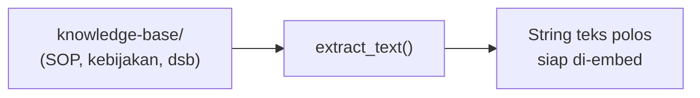
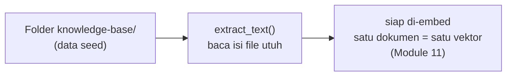

# Module 10: Setup Knowledge Base & Data Dasar Awal

## Tujuan

Menyiapkan **fondasi data** untuk RAG: folder `knowledge-base/` berisi dokumen SOP contoh, lalu membangun `extract_text()` — fungsi untuk membaca isi file `.md`/`.txt`/`.pdf` jadi string. Module ini **tidak menyentuh** Ollama atau OpenSearch sama sekali — murni operasi file, sebagai persiapan sebelum Module 11 (embedding) mengubah isi dokumen ini jadi vektor numerik.

⚠️ **Perubahan urutan dari rencana awal**: draft pertama Module 7-16 membangun endpoint upload (form web) duluan sebagai "pintu masuk dokumen", baru belakangan membahas embedding/vector store/chunking secara terpisah dengan contoh teks bebas. Urutan ini diubah — kita bangun **mesin RAG dulu** (data → embedding → vector store → tersambung ke `/chat/stream`) sampai benar-benar bisa menjawab dari dokumen sungguhan, **baru** menambahkan chunking (Module 14) dan UI upload (Module 15) sebagai cara menambah dokumen baru ke sistem yang sudah hidup.

⚠️ **Belum ada chunking di module ini** — sengaja. Versi pertama RAG (Module 13) meng-embed **satu dokumen utuh** jadi satu vektor, bukan dipecah jadi potongan-potongan kecil dulu. Ini membuat mesin RAG-nya jauh lebih sederhana untuk pertama kali dibangun — cuma tiga langkah (baca dokumen → embed → simpan), tanpa perlu memahami konsep chunking sama sekali. **Chunking baru diperkenalkan di Module 14**, tepat pada momen alasannya jadi konkret: dokumen baru yang diupload staff bisa jauh lebih panjang dari dua SOP contoh di sini, dan di situlah keterbatasan "satu dokumen = satu vektor" mulai terasa nyata.

## Definisi

**Knowledge base** adalah kumpulan dokumen sumber — bisa berupa SOP, kebijakan, atau panduan internal — yang jadi satu-satunya bahan yang boleh dipakai NALA untuk menjawab pertanyaan staff. Di NALA, knowledge base ini diwakili folder `knowledge-base/` (bind mount ke `resources/sample-knowledge-base/`) — sekumpulan file `.md`/`.txt`/`.pdf` biasa di disk, bukan database terstruktur dengan tabel dan kolom.

Isi awal folder itu disebut **data seed** — dokumen yang sudah disiapkan tim sejak sebelum ada jalur input dari user seperti form upload, supaya mesin RAG bisa langsung dites dari awal tanpa menunggu fitur upload selesai dibangun (Bagian 1-2). Untuk membaca isi tiap dokumen apa pun formatnya (Markdown, teks polos, atau PDF) jadi satu string teks polos yang siap diproses lebih lanjut, module ini membangun `extract_text()` — langkah pertama sebelum teks itu bisa diubah jadi vektor di Module 11.



## Hasil Akhir yang Diharapkan

- Folder `knowledge-base/` ada dan berisi minimal dua dokumen SOP contoh
- `extract_text()` pada file `.md` mengembalikan isi file apa adanya, pada `.pdf` mengekstrak teks lewat `pypdf`
- `/chat/stream` (Module 7, 7) tetap berfungsi seperti sebelumnya — module ini belum menyentuhnya sama sekali

## 1. Kenapa Data Dulu, Bukan UI Dulu

Module 9 sudah menjelaskan **kenapa** RAG dibutuhkan (halusinasi, analogi *open-book*) dan **alur garis besarnya** (retrieval → augmented → generation). Sekarang saatnya mulai membangun — dan langkah pertama yang paling masuk akal secara teknis adalah **menyiapkan datanya**, sebelum satu baris kode pemrosesan pun ditulis. Tanpa dokumen yang ada di suatu tempat, tidak ada yang bisa di-embed, tidak ada yang bisa disimpan di vector store, tidak ada yang bisa di-retrieve.

Alih-alih menunggu staff mengupload dokumen lewat form web (yang belum dibangun sampai Module 14), kita siapkan **data dasar awal** langsung: sebuah folder `knowledge-base/` berisi 1-2 dokumen SOP contoh yang sudah disiapkan tim (persis seperti `resources/sample-knowledge-base/` yang sudah ada sejak awal training). Ini bukan cara "curang" — ini pola umum di proyek RAG sungguhan: ada **data seed** untuk development/testing sebelum jalur input dari user (upload, sinkronisasi otomatis, dst) dibangun.



## 2. Data Dasar Awal: Dua Dokumen SOP Contoh

**Prasyarat**: sudah menyelesaikan Module 9 (Konsep RAG), dan container `ollama`+`api` dari `Nala/` masih berjalan (kalau tidak, ulangi Module 7 Langkah 2) — module ini belum butuh `opensearch`/`airflow`.

Sepanjang Module 7-16, kita memakai **dua dokumen SOP contoh** sebagai knowledge base untuk mendemonstrasikan sistem RAG. Contoh isi dokumennya juga tersedia langsung di folder module ini (`Module-10-Setup-Knowledge-Base/`) untuk dibaca — file yang sama persis dengan yang ada di `resources/sample-knowledge-base/`, yang dipakai `Nala/` saat runtime:

### a. SOP Pengajuan Kredit (`sop-pengajuan-kredit.md`)
- **Syarat Umum**: usia minimal 21 tahun, menjadi customer 6 bulan, memiliki rekening aktif
- **Tahapan Proses**: (1) Persiapan dokumen, (2) Submisi aplikasi online, (3) Verifikasi data, (4) Penilaian kredit, (5) Approval/Rejection, (6) Pencairan dana
- **Dokumen yang Diperlukan**: KTP, NPWP, laporan keuangan, bukti penghasilan, surat referensi
- **Estimasi Waktu**: 3-5 hari kerja dari submisi hingga keputusan

Dokumen ini jadi baseline untuk testing pertanyaan seperti *"Berapa lama approval kredit?"* atau *"Dokumen apa yang saya butuhkan?"*

### b. SOP Klaim Asuransi (`sop-klaim-asuransi.md`)
- **Jenis Klaim**: asuransi kesehatan, asuransi kendaraan, asuransi jiwa
- **Tahapan Proses**: (1) Pelaporan klaim dalam 30 hari, (2) Pengumpulan dokumen pendukung, (3) Verifikasi klaim, (4) Penilaian klaim, (5) Pembayaran klaim
- **Dokumen yang Diperlukan**: bukti asuransi aktif, medical report (untuk kesehatan), police report (untuk kendaraan)
- **Estimasi Waktu**: 5-10 hari kerja untuk proses verifikasi dan pembayaran

Dengan dua dokumen pendek ini, versi pertama RAG (Module 13) bisa meng-embed **masing-masing dokumen secara utuh** tanpa masalah — keduanya jauh di bawah batas context window model embedding. Nanti setelah Module 14 menambahkan chunking, kedua dokumen ini akan di-index ulang jadi beberapa chunk per dokumen — perbandingan sebelum/sesudah ini justru jadi cara paling konkret melihat kenapa chunking penting.

**Format dokumen yang didukung NALA**: Markdown, plain text, dan PDF. Markdown dan plain text mudah diparsing tanpa library eksternal; PDF ditambahkan karena di dunia nyata, SOP dan kebijakan perusahaan sering sudah dalam bentuk PDF (hasil ekspor Word, atau dokumen resmi) — mengabaikannya berarti NALA tidak bisa dipakai untuk sebagian besar dokumen yang sudah ada. Contoh filenya juga ada di folder module ini: `sop-pembukaan-rekening-tabungan.pdf`. ⚠️ **Tetap di luar scope training ini**: DOCX dan PDF hasil scan gambar (butuh OCR) — keduanya butuh library terpisah yang tidak dibahas di training ini.

**Langkah 1 — Bind mount folder data seed ke dalam container**

Folder `resources/sample-knowledge-base/` (di root project, sudah berisi kedua dokumen SOP di atas plus satu file PDF contoh) baru tersedia **di laptop Anda** — container `api` belum bisa mengaksesnya sama sekali, karena belum ada volume yang menghubungkan keduanya. Tambahkan satu `volumes:` baru ke service `api` di `docker-compose.yml`:

```yaml
services:
  ollama:
    image: ollama/ollama:latest
    ports:
      - "11434:11434"
    volumes:
      - ollama_data:/root/.ollama

  api:
    build: .
    ports:
      - "8000:8000"
    environment:
      - OLLAMA_BASE_URL=http://ollama:11434
      - OLLAMA_MODEL=llama3.2:3b
    volumes:
      - ../resources/sample-knowledge-base:/app/knowledge-base
    depends_on:
      - ollama

volumes:
  ollama_data:
```

- **`../resources/sample-knowledge-base:/app/knowledge-base`** — path host-nya relatif terhadap lokasi `docker-compose.yml` (`Nala/`), jadi `../resources/...` naik satu level ke root project. Path container-nya (`/app/knowledge-base`) inilah yang dipakai kode Python sepanjang module ini dan seterusnya.
- Ini **bind mount**, bukan named volume seperti `ollama_data` — perubahan file di `resources/sample-knowledge-base/` (tambah/hapus/edit) langsung terlihat di dalam container tanpa perlu rebuild, karena keduanya menunjuk fisik ke folder yang sama.

**▶️ Jalankan & lihat hasilnya**

```bash
docker compose up --build -d api
docker compose exec api ls -la /app/knowledge-base
```

✅ **Indikator sukses**: `sop-pengajuan-kredit.md`, `sop-klaim-asuransi.md`, dan `sop-pembukaan-rekening-tabungan.pdf` muncul di listing — dari **dalam** container, bukan cuma di laptop Anda (`ls resources/sample-knowledge-base/` di host akan menunjukkan isi yang sama persis, karena bind mount menyamakan keduanya).

<details>
<summary><strong>Pakai Claude Code? Salin prompt berikut, paste untuk eksekusi Langkah 1</strong></summary>

```
Tambahkan bind mount folder knowledge base ke service api
(Module 10) — belum ada sebelumnya.

GOAL:
- Di Nala/docker-compose.yml, tambahkan key `volumes:` baru ke
  service `api` (sejajar dengan `environment:` dan `depends_on:`
  yang sudah ada), isinya persis satu baris:
  - ../resources/sample-knowledge-base:/app/knowledge-base

CONTEXT:
- Service `api` sekarang cuma punya build/ports/environment/depends_on
  — belum ada volumes sama sekali.
- docker-compose.yml ada di Nala/, folder resources/sample-knowledge-base
  ada satu level di atas (root project), makanya pakai ../.

GUARDRAIL:
- JANGAN ubah service `ollama` atau bagian lain docker-compose.yml.
- JANGAN tambah environment variable baru — cukup volumes.
```

</details>

## 3. Struktur Kode yang Ditambahkan: `extract_text()`

Model embedding (Module 11) menerima **string**, bukan path file — dan file `.pdf` adalah format biner, bukan teks polos. `extract_text()` menjembatani keduanya: baca isi file apa pun formatnya, kembalikan sebagai satu string utuh siap di-embed.

File baru `app/ingest.py` — isinya akan terus bertambah: chunking di Module 14, lalu `ingest_documents()` yang menyatukan semuanya (Module 13, lalu di-upgrade lagi di Module 14).

**Langkah 2 — Tambah dependency `pypdf`, lalu `extract_text()`**

Tambahkan satu baris baru di `requirements.txt`:

```
pypdf==5.1.0
```

```python
# app/ingest.py
from pypdf import PdfReader


def extract_text(file_path: str) -> str:
    if file_path.endswith(".pdf"):
        reader = PdfReader(file_path)
        return "\n".join(page.extract_text() or "" for page in reader.pages)
    with open(file_path, "r") as f:
        return f.read()
```

- **`PdfReader(file_path)`**: membuka file PDF dan mem-parsing strukturnya — tiap halaman diakses lewat `reader.pages`.
- **`page.extract_text() or ""`**: `extract_text()` bisa mengembalikan `None` untuk halaman yang teksnya tidak bisa diekstrak — `or ""` mencegah `None` ikut ter-gabung ke `"\n".join(...)`, yang akan menyebabkan `TypeError`.
- Untuk `.md`/`.txt`, cukup `open(path, "r").read()` — isi file dikembalikan **apa adanya, utuh, tidak dipecah**. Ini beda dengan yang akan terjadi setelah Module 14 — di situ hasil `extract_text()` baru dipecah jadi beberapa chunk sebelum di-embed.
- Fungsi ini **belum dipanggil dari mana pun** — pemanggilnya (`ingest_documents()`) baru ditulis di Module 13.

**▶️ Jalankan & lihat hasilnya**

```bash
docker compose up --build api
```

```bash
docker compose exec api python -c "
from app.ingest import extract_text
text = extract_text('/app/knowledge-base/sop-pengajuan-kredit.md')
print(repr(text[:60]))
print(f'Panjang total: {len(text)} karakter')
"
```

✅ **Indikator sukses**: mengembalikan potongan teks awal `sop-pengajuan-kredit.md`, contohnya `'# SOP Pengajuan Kredit - PT Nusantara Finance\n\n## 1. Tujuan '`, dengan panjang total dokumen (bukan potongan) tercetak.

Cabang `.pdf` juga bisa langsung dites karena satu file PDF contoh (`sop-pembukaan-rekening-tabungan.pdf`) sudah ada di `knowledge-base/`:

```bash
docker compose exec api python -c "
from app.ingest import extract_text
text = extract_text('/app/knowledge-base/sop-pembukaan-rekening-tabungan.pdf')
print(repr(text[:60]))
print(f'Panjang total: {len(text)} karakter')
"
```

<details>
<summary><strong>Pakai Claude Code? Salin prompt berikut, paste untuk eksekusi Langkah 2</strong></summary>

```
Buat extract_text() di app/ingest.py, plus dependency pypdf
(Module 10) — baca isi file .md/.txt/.pdf jadi string utuh.

GOAL:
- Tambah `pypdf==5.1.0` di baris baru akhir
  Nala/requirements.txt.
- Buat Nala/app/ingest.py berisi: `from
  pypdf import PdfReader` di baris paling atas, lalu satu fungsi
  extract_text(file_path: str) -> str: kalau file_path berakhiran
  ".pdf", buka lewat PdfReader, gabungkan page.extract_text()
  (fallback "" kalau None) dari semua halaman dengan
  "\n".join(...); selain itu, buka file biasa dengan
  open(file_path, "r") dan return isinya.

CONTEXT:
- File baru, belum ada apa pun di app/ingest.py.
- Fungsi ini belum dipanggil dari mana pun — pemanggilnya
  (ingest_documents()) baru ditulis di Module 13. TIDAK ADA chunking
  di module ini — itu baru masuk Module 14.

GUARDRAIL:
- JANGAN tambah fungsi chunk_text()/chunk_markdown()/ingest_documents()
  di file ini — semuanya masuk module berikutnya.
- JANGAN sentuh app/main.py, docker-compose.yml.
```

</details>

## 4. Checkpoint Praktik

Yang perlu dipastikan sebelum lanjut ke Module 11:

- [ ] Folder `knowledge-base/` berisi minimal dua dokumen SOP contoh
- [ ] `extract_text()` pada file `.md` mengembalikan isi file apa adanya, utuh (bukan dipotong)
- [ ] `extract_text()` pada file `.pdf` berhasil mengekstrak teks lewat `pypdf`
- [ ] `/chat/stream` (Module 7) masih berfungsi seperti sebelumnya

Begitu keempat hal ini terverifikasi, lanjut ke Module 11 — mengubah isi dokumen ini jadi vektor numerik (embedding).
