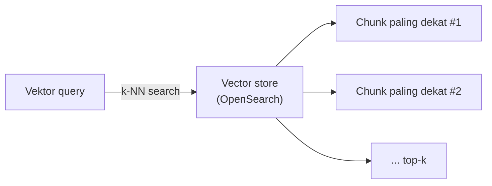
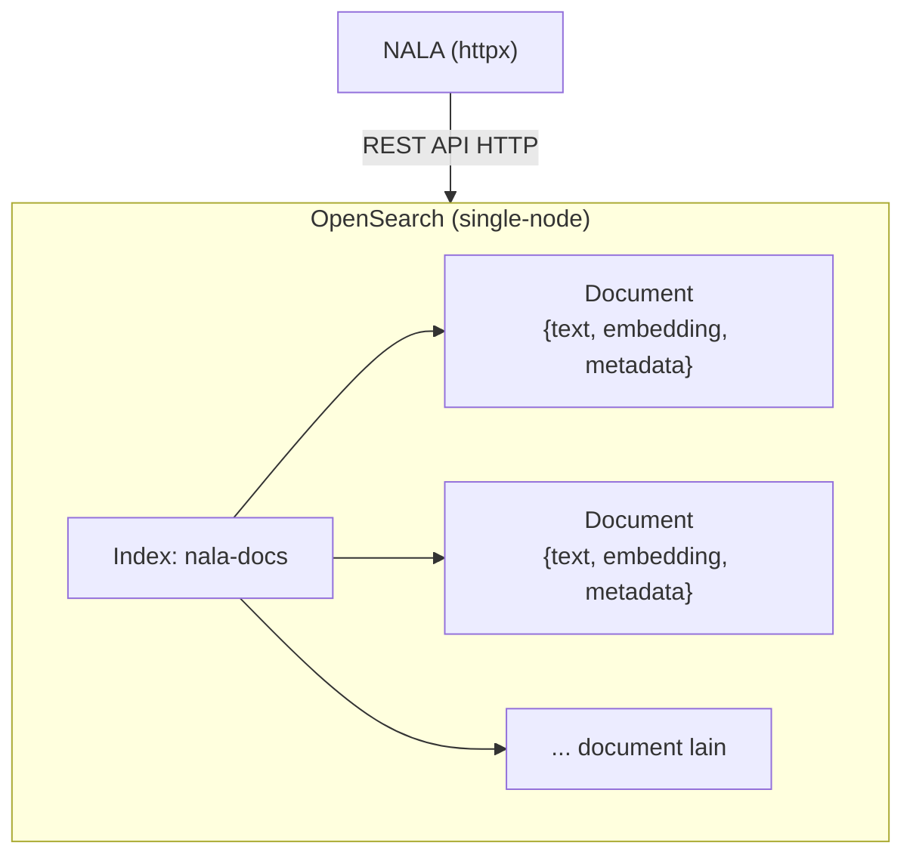
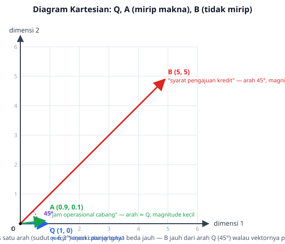

# Module 10: Vector Store & Semantic Search

## Tujuan

Menyimpan vektor hasil embedding (Module 9) di **OpenSearch** supaya bisa dicari berdasarkan kemiripan makna — bukan pencocokan kata kunci. Module ini juga membahas **secara detail** bagaimana "kemiripan" itu sebenarnya dihitung secara matematis (L2/Euclidean distance, cosine similarity, dot product), supaya kita tidak cuma tahu "semantic search berhasil" tapi juga paham **kenapa** dan **metrik apa** yang sebenarnya bekerja di balik layar — plus lanskap vector database secara umum, supaya keputusan memilih OpenSearch (Bagian 4) terasa sebagai perbandingan sadar, bukan pilihan tunggal tanpa alternatif.

## Definisi

**Vector store** adalah sistem penyimpanan yang dioptimalkan untuk menyimpan dan mencari vektor secara efisien — NALA memakai OpenSearch untuk keperluan ini (Bagian 4), bukan database relasional biasa dengan tabel dan kolom. Kegunaannya adalah menjalankan **semantic search** (pencarian semantik): mencari berdasarkan kemiripan **makna** vektor, bukan kecocokan kata kunci persis — query "kapan cabang buka" bisa menemukan dokumen berisi "jam operasional", walau kata-katanya sama sekali berbeda (Bagian 1).

Di balik layar, pencarian ini dijalankan lewat algoritma **k-NN (k-Nearest Neighbors)** — OpenSearch mencari `k` vektor yang **paling dekat** dengan vektor pertanyaan user, dan itulah dasar teknis di balik `VectorStore.search()` (Bagian 6). "Paling dekat" itu sendiri bisa diukur dengan beberapa metrik matematis berbeda — **cosine similarity**, **Euclidean distance (L2)**, dan **dot product** — dibahas detail di Bagian 5, termasuk kenapa ketiganya ternyata menghasilkan urutan hasil yang identik untuk vektor ternormalisasi seperti keluaran `nomic-embed-text`.



## Hasil Akhir yang Diharapkan

- OpenSearch berjalan sehat (`docker compose logs opensearch` menunjukkan cluster health `green`/`yellow`)
- Kita bisa menyebutkan minimal dua kategori vector database lain selain OpenSearch, dan kapan masing-masing lebih cocok dipakai
- Kita paham apa itu OpenSearch secara umum (asal-usulnya, konsep index/document, akses lewat REST API) — bukan cuma tahu cara memakainya
- Kita bisa menjelaskan perbedaan cosine similarity, Euclidean distance (L2), dan dot product — termasuk kapan hasilnya identik dan kapan berbeda
- `VectorStore.ensure_index()`, `.index_document()`, dan `.search()` berjalan tanpa error
- Query dengan kata berbeda dari dokumen asli tapi makna serupa tetap menemukan dokumen yang di-index — bukti pencarian semantik, bukan keyword matching
- Kita paham metrik mana yang **benar-benar** dipakai `VectorStore` NALA (default OpenSearch) dan kenapa itu tetap valid untuk `nomic-embed-text`
- `/chat/stream` (Module 5, 6) tetap berfungsi seperti sebelumnya

## 1. Apa itu Vector Search / Vector Store

**Vector Search** adalah teknik pencarian yang memakai **kemiripan vektor** sebagai dasar menemukan dokumen relevan, bukan pencocokan kata kunci tradisional. **Vector Store** adalah database/sistem penyimpanan khusus yang dioptimalkan menyimpan dan mencari vektor secara efisien.

**Cara kerja vector search secara garis besar**: (1) pertanyaan pengguna diubah jadi vektor lewat model embedding yang sama (Module 9), (2) sistem menghitung kemiripan antara vektor query dan vektor dokumen yang tersimpan, (3) dokumen diurutkan berdasarkan skor kemiripan, (4) top-K dokumen/chunk paling relevan dikembalikan.

## 2. Macam-Macam Vector Database

Sebelum masuk ke kenapa NALA memilih OpenSearch (Bagian 4), penting dulu melihat lanskapnya — OpenSearch **bukan** satu-satunya cara menyimpan dan mencari vektor, dan pilihan ini seharusnya terasa sebagai perbandingan sadar, bukan kebetulan. Secara garis besar, vector database yang beredar hari ini bisa dikelompokkan jadi tiga kategori:

**a. Vector database khusus (purpose-built)** — dibangun dari nol khusus untuk menyimpan dan mencari vektor, tidak punya "identitas lain" sebagai database. Contohnya **Pinecone** (layanan cloud/SaaS, tidak bisa di-hosting sendiri), **Weaviate**, **Milvus**, dan **Qdrant** (ketiganya open-source, bisa di-hosting sendiri), serta **Chroma** (ringan, populer untuk prototyping lokal). Kelebihannya performa pencarian vektor murni biasanya paling cepat, dengan fitur filtering dan indexing yang matang. Kekurangannya: **BM25 (keyword search klasik) bukan fondasi asli kategori ini** — Chroma dan Pinecone (versi lama) memang murni pencarian vektor, tanpa keyword search sama sekali. Beberapa produk yang lebih baru mulai menambahkan kemampuan pencarian kata kunci, tapi caranya beda-beda dan sifatnya "tempelan belakangan", bukan fondasi: Weaviate punya BM25 asli yang bisa digabung jadi hybrid search; Milvus versi baru dan Pinecone menambahkan *sparse vector* (mirip BM25 secara konsep — sama-sama memberi bobot tinggi ke kata jarang/penting — tapi bukan implementasi BM25 klasik yang sama persis); Qdrant baru mendukung sparse vector secara terbatas. Intinya: kapan pun kemampuan itu ada, ia ditambahkan **setelah** fondasi vector search-nya jadi, bukan dibangun bersamaan sejak awal seperti di OpenSearch (kategori c di bawah).

**b. Vector extension pada database yang sudah ada** — menambahkan kemampuan pencarian vektor ke database yang sebelumnya tidak punya fitur itu. Contoh paling umum: **pgvector**, extension untuk PostgreSQL. Kelebihannya jelas: kalau sebuah tim sudah punya PostgreSQL berjalan untuk data operasional (seperti NALA nanti di Module 19), tinggal tambah extension, tidak perlu service baru sama sekali — data relasional dan data vektor hidup di database yang sama. Kekurangannya: performa pencarian vektor pada skala besar biasanya kalah dibanding vector database khusus (kategori a), karena PostgreSQL tidak dirancang dari awal untuk beban kerja ini.

**c. Search engine dengan kemampuan vector search** — awalnya dibangun sebagai mesin pencari **teks/kata kunci** (full-text search, berbasis algoritma BM25), lalu belakangan ditambahi kemampuan k-NN vector search. Contohnya **Elasticsearch** dan **OpenSearch** (turunan open-source dari Elasticsearch). Kelebihan utamanya: satu platform bisa menjalankan **keyword search** dan **vector search** sekaligus, bahkan digabung jadi *hybrid search* — persis yang dibutuhkan NALA mulai Module 15. Kekurangannya: sebagai "spesialis vektor", performa murni pencarian vektor pada skala sangat besar biasanya sedikit di bawah vector database khusus (kategori a).

| Kategori | Contoh | Kelebihan Utama | Trade-off |
|---|---|---|---|
| Vector database khusus | Pinecone, Weaviate, Milvus, Qdrant, Chroma | Performa vector search tercepat, fitur paling matang | Infrastruktur terpisah; BM25/keyword search bukan fondasi asli — kalau ada, sifatnya tempelan belakangan dan beda-beda tiap produk |
| Extension di database yang sudah ada | pgvector (PostgreSQL) | Tidak perlu service baru kalau sudah pakai database itu | Performa vector search skala besar biasanya lebih lambat |
| Search engine + vector search | OpenSearch, Elasticsearch | Satu platform untuk keyword **dan** vector search (hybrid) | Performa vector search murni sedikit di bawah kategori khusus |

**Analogi sederhana — toko buku**: bayangkan tiga toko yang sama-sama bisa membantu Anda menemukan buku, tapi didirikan dengan cara berbeda.

- **Vector database khusus (kategori a)** seperti toko buku yang dari awal dibangun **khusus** untuk merekomendasikan buku berdasarkan "nuansa cerita yang mirip" — misalnya Anda bilang "saya mau yang mirip Harry Potter", tokonya langsung jago menebak. Semua rak, sistem, dan pegawainya dilatih untuk itu. Tapi kalau Anda datang membawa judul persis dan cuma mau tahu ada atau tidak ("Judul: SOP-2024-001"), toko ini bukan yang paling sigap — dia dirancang untuk kemiripan, bukan pencocokan persis.
- **pgvector (kategori b)** seperti rak "buku mirip" kecil yang ditambahkan di **minimarket** yang sudah lama berdiri dan sudah menjual macam-macam kebutuhan lain (data operasional NALA, nanti di Module 19). Praktis — tidak perlu bangun toko baru, tinggal pasang rak — tapi rak itu bukan didesain sejak awal untuk urusan rekomendasi buku, jadi begitu koleksinya makin besar, mencarinya mulai terasa lebih lambat dibanding toko yang memang spesialis.
- **OpenSearch (kategori c)** seperti toko buku yang dari awal **jago mencari lewat katalog/judul persis** (keyword search — "cari judul yang mengandung kata X"), lalu belakangan belajar kemampuan baru: "cariin yang nuansa ceritanya mirip" (vector search). Jadi satu toko, dua cara mencari — bisa dipakai satu-satu atau **digabung sekaligus**. Ini persis yang NALA butuhkan: staff kadang mencari dengan istilah spesifik (nomor SOP, nama dokumen), kadang dengan pertanyaan yang maknanya mirip tapi kata-katanya beda — dan Module 15 nanti menggabungkan keduanya jadi satu pencarian (*hybrid search*).

Tidak ada satu kategori yang "paling benar" secara universal — pilihannya tergantung kebutuhan. NALA jatuh ke kategori (c), dan Bagian 4 menjelaskan kenapa itu paling cocok untuk kasus penggunaannya secara spesifik. Tapi sebelum sampai ke situ, ada baiknya kenalan dulu dengan OpenSearch itu sendiri — bukan cuma sebagai "salah satu opsi vector store", tapi apa sebenarnya produk ini.

## 3. Apa itu OpenSearch

Bayangkan OpenSearch sebagai **"mesin pencari pribadi"** — seperti Google, tapi bukan untuk mencari di seluruh internet, melainkan khusus mencari di dalam dokumen-dokumen milik NALA sendiri. Tugas utamanya dari dulu sampai sekarang sama: menerima jutaan dokumen, lalu menemukan dengan cepat mana yang paling relevan begitu ada pertanyaan masuk. Kemampuan "mencari berdasarkan kemiripan makna" (vector search) yang dipakai di module ini (Bagian 5, Bagian 6) sebenarnya **fitur tambahan** — kemampuan aslinya, sejak awal dibuat, adalah mencari dokumen berdasarkan **kata kunci** yang persis disebut, mirip cara kerja kolom pencarian di situs berita atau marketplace. Nama teknis "cara menilai kecocokan kata kunci" ini adalah **BM25** — sebuah rumus yang menghitung skor relevansi dokumen berdasarkan seberapa sering dan seberapa "penting" kata-kata pencarian muncul di dalamnya (dokumen yang mengandung kata langka/spesifik dari query dinilai lebih relevan daripada yang cuma mengandung kata umum) — istilah ini akan muncul lagi di Module 15 saat NALA menggabungkannya dengan vector search.

Asal-usulnya juga sederhana untuk dipahami: OpenSearch adalah "anak" dari produk bernama **Elasticsearch**. Beberapa tahun lalu, perusahaan pembuat Elasticsearch mengubah aturan pemakaiannya jadi lebih terbatas — komunitas dan Amazon (AWS) tidak setuju, lalu mereka meneruskan versi terakhir yang masih bebas dipakai siapa saja, dan memberinya nama baru: **OpenSearch**. Jadi kalau Anda pernah dengar nama Elasticsearch, anggap saja OpenSearch adalah versi "sepupu dekat"-nya — cara kerja dan istilah-istilahnya sangat mirip. Mesin pencarinya sendiri, jauh di dalam "mesin"-nya, dibangun di atas komponen bernama **Apache Lucene** — semacam "mesin mobil" generik yang dipakai bersama oleh OpenSearch, Elasticsearch, dan beberapa mesin pencari lain; OpenSearch dan Elasticsearch ibarat dua mobil berbeda merek yang kebetulan memakai mesin dasar yang sama.

Dua istilah yang perlu dikenal sebelum melihat kode di Bagian 6, dan keduanya sebenarnya konsep yang sudah akrab sehari-hari: **index** itu seperti satu **lemari arsip** — tempat menyimpan dokumen-dokumen yang sejenis (di NALA, satu lemari arsip bernama `nala-docs` menyimpan semua potongan dokumen SOP). **Document** itu seperti satu **lembar formulir** di dalam lemari arsip itu — satu formulir untuk satu potongan dokumen, isinya tiga kolom: teks aslinya, "sidik jari makna"-nya (vektor/embedding), dan keterangan tambahan (metadata). Untuk mengisi lemari arsip ini atau mencari isinya, NALA cukup "mengirim surat" lewat internet (disebut REST API) — tidak perlu aplikasi atau alat khusus, alasan kenapa NALA bisa berkomunikasi dengan OpenSearch memakai `httpx` yang sama dipakai untuk Ollama sejak Module 1-4.

⚠️ **Satu hal yang perlu diluruskan**: bukan berarti OpenSearch menyimpan formulir-formulir itu lalu membaca ulang **satu per satu** setiap kali ada pencarian — itu akan sangat lambat kalau dokumennya jutaan. Di belakang layar, begitu satu formulir masuk, OpenSearch diam-diam menyusun **daftar indeks/catatan bantuan** dari isinya (mirip daftar isi atau indeks di belakang buku tebal — makanya disebut "index") supaya pencarian berikutnya bisa langsung "lompat" ke bagian yang relevan, tanpa perlu membuka semua formulir satu-satu. Dua daftar bantuan ini punya nama teknis masing-masing, dan berbeda tergantung jenis pencariannya: untuk pencarian kata kunci (BM25), daftar bantuannya disebut **inverted index** — bayangkan seperti indeks di belakang buku tebal yang mendaftar "kata apa muncul di halaman berapa", cuma dibalik: bukan "halaman → kata apa saja isinya", tapi "kata apa → ada di dokumen mana saja". Untuk pencarian kemiripan makna (vector search), daftar bantuannya disebut **HNSW** (*Hierarchical Navigable Small World*) — semacam peta jaringan pertemanan antar vektor, supaya OpenSearch bisa "meloncat" dari satu vektor ke vektor tetangganya yang mirip tanpa perlu membandingkan ke **semua** vektor yang ada satu-satu, mirip cara Anda menemukan kenalan lewat "teman dari teman" dibanding menghubungi semua orang di kota satu-satu. Formulir aslinya (JSON) tetap tersimpan utuh dan itulah yang dikembalikan sebagai hasil pencarian — cuma **cara mencarinya** yang sudah dioptimalkan lewat kedua struktur bantuan ini, bukan sekadar menyisir semua data dari atas ke bawah.

Satu istilah lagi yang muncul di konfigurasi Bagian 6: **cluster** dan **node** — anggap saja **node** itu satu "gedung kantor cabang" tempat OpenSearch bekerja, dan **cluster** adalah kumpulan beberapa gedung yang bekerja sama. Di lingkungan production sungguhan, biasanya dipakai beberapa gedung (node) sekaligus supaya kalau satu gedung bermasalah, gedung lain tetap bisa melayani, dan pekerjaannya juga terbagi rata. Untuk training ini, cukup **satu gedung saja** (`discovery.type=single-node`) — jauh lebih ringan buat laptop, dan cara kerjanya tetap sama persis dengan yang dipakai di lingkungan production sungguhan.



## 4. Kenapa Akhirnya OpenSearch untuk NALA

Merujuk balik ke tiga kategori di Bagian 2: NALA memilih **OpenSearch** — kategori (c), search engine dengan kemampuan vector search — bukan Pinecone/Weaviate/Milvus/Qdrant (kategori a) maupun pgvector (kategori b). Alasannya konkret, bukan sekadar "yang paling populer":

- **Dual Role, alasan paling menentukan**: di titik ini (Module 10) OpenSearch dipakai sebagai *pure vector store*; nanti (Module 15) bisa di-upgrade jadi *hybrid search* (BM25 keyword + vector) **tanpa mengganti infrastruktur** — satu platform untuk dua kebutuhan. Vector database khusus (kategori a) tidak punya kemampuan keyword search bawaan sekuat ini; kalau dipilih, Module 15 harus menambah **sistem search terpisah** di luar vector database-nya sendiri, lalu menggabungkan hasil keduanya secara manual — kompleksitas ekstra yang tidak perlu untuk skala training ini.
- **pgvector sempat jadi kandidat, tapi ditunda**: karena NALA nanti (Module 19) juga akan memakai PostgreSQL untuk data operasional, pgvector (kategori b) terlihat menarik supaya tidak perlu service tambahan. Tapi di Module 5-14 ini PostgreSQL belum ada sama sekali di stack NALA — menambahkannya di titik ini cuma untuk vector store berarti mengenalkan service baru yang lebih awal dari waktunya, dan performa pencarian vektornya pada skala data yang akan terus tumbuh (ribuan dokumen ke depan) kalah dibanding search engine yang memang dioptimalkan untuk ini.
- **Production-ready**: distribusi open-source dari Elasticsearch (AWS), battle-tested di enterprise, dokumentasi lengkap.
- **Security & control**: bisa dijalankan on-premises, kontrol penuh atas data dan privasi — konsisten dengan prinsip Module 1-4.
- **Integration ready**: OpenSearch punya REST API HTTP biasa — NALA mengaksesnya langsung lewat `httpx` (dependency yang sudah dipakai sejak Module 1-4 untuk Ollama), **bukan** library client resmi `opensearch-py`. Satu HTTP client dipakai konsisten untuk semua pemanggilan eksternal, tanpa menambah dependency baru.

## 5. Metrik Kemiripan: Bagaimana "Mirip" Sebenarnya Dihitung

Ini bagian yang sering dilewatkan begitu saja ("pokoknya semantic search"), padahal pemahaman metrik ini penting untuk debugging kualitas retrieval nanti (Module 11, dan Module 15). Ada tiga metrik yang paling umum dipakai untuk mengukur kemiripan/jarak antar vektor embedding:

### a. Cosine Similarity

Mengukur **sudut** antara dua vektor, mengabaikan panjangnya (*magnitude*). Formulanya:

```
cosine_similarity(A, B) = (A · B) / (‖A‖ × ‖B‖)
```

di mana `A · B` adalah dot product (Bagian 5.c), dan `‖A‖`/`‖B‖` adalah panjang (*norm*) masing-masing vektor. Hasilnya berkisar **-1 sampai 1**:

- **1** — kedua vektor mengarah ke arah yang **persis sama** (paling mirip)
- **0** — kedua vektor **tegak lurus** (tidak berhubungan)
- **-1** — kedua vektor mengarah ke arah yang **berlawanan** (paling tidak mirip)

Untuk embedding teks, nilai negatif jarang terjadi — kebanyakan pasangan teks (bahkan yang tidak berhubungan) tetap punya cosine similarity positif kecil, karena model embedding cenderung memetakan semua teks ke area ruang vektor yang serupa.

**Kenapa cosine sering jadi pilihan default untuk embedding teks**: cosine similarity **tidak peduli panjang vektor**, cuma arahnya. Dua kalimat dengan makna sama tapi panjang teks berbeda (misal "kredit ditolak" vs "pengajuan kredit Anda ditolak karena beberapa alasan") bisa saja menghasilkan vektor dengan magnitude berbeda, tapi kalau arahnya mirip, cosine similarity-nya tetap tinggi — pas untuk kasus "makna serupa, panjang teks beda".

### b. Euclidean Distance (L2)

Mengukur **jarak geometris** antar dua titik di ruang vektor — sama seperti rumus jarak yang diajarkan di sekolah, cuma diperluas ke banyak dimensi (768, untuk `nomic-embed-text`). Formulanya:

```
L2(A, B) = √( (a₁-b₁)² + (a₂-b₂)² + ... + (a₇₆₈-b₇₆₈)² )
```

Berbeda dari cosine similarity, **L2 adalah jarak (distance), bukan similarity** — semakin **kecil** nilainya, semakin **mirip** dua vektor itu (kebalikan dari cosine, di mana semakin **besar** semakin mirip). L2 memperhitungkan **kedua** hal: arah **dan** magnitude vektor — dua vektor yang arahnya sama tapi magnitude-nya jauh berbeda akan punya L2 distance yang besar, walau cosine similarity-nya tetap tinggi.

### c. Dot Product

Operasi paling sederhana secara komputasi — perkalian elemen-per-elemen lalu dijumlahkan:

```
dot_product(A, B) = a₁×b₁ + a₂×b₂ + ... + a₇₆₈×b₇₆₈
```

Dot product **memperhitungkan magnitude** (sama seperti L2, beda dengan cosine) — vektor yang lebih "panjang" cenderung menghasilkan dot product lebih besar, terlepas dari seberapa mirip arahnya. Untuk **vektor yang sudah ternormalisasi** (magnitude = 1, dijelaskan Bagian 5.d), dot product **secara matematis identik** dengan cosine similarity — karena pembagi `‖A‖ × ‖B‖` di formula cosine jadi `1 × 1 = 1`, jadi tidak mengubah apa pun.

### d. Vektor Ternormalisasi: Kenapa Ketiga Metrik Bisa "Sama Saja" dalam Praktik

**Vektor ternormalisasi** adalah vektor yang panjangnya (magnitude/norm) sudah diskalakan jadi tepat 1. `nomic-embed-text` menghasilkan vektor yang **sudah (mendekati) ternormalisasi** — ini fakta penting yang mengubah bagaimana ketiga metrik di atas berperilaku dalam praktik:

- **Cosine similarity vs dot product**: untuk vektor ternormalisasi, keduanya **identik secara matematis** (Bagian 5.c) — tidak ada bedanya secara hasil, cuma beda cara hitung (dot product sedikit lebih murah secara komputasi karena tidak perlu menghitung ulang normalisasi).
- **Cosine similarity vs L2 (Euclidean)**: untuk vektor ternormalisasi, **urutan ranking dari keduanya identik** — walau nilai mentahnya beda (satu naik saat mirip, satu turun saat mirip), keduanya jadi fungsi **monoton** dari sudut antar vektor. Secara matematis: `L2(A, B)² = 2 - 2 × cosine_similarity(A, B)` ketika `‖A‖ = ‖B‖ = 1` — semakin tinggi cosine similarity, semakin kecil L2 distance, **selalu**, tanpa pengecualian. Jadi urutan dokumen dari yang paling mirip ke paling tidak mirip **sama persis**, apa pun metriknya dipakai.

**Konsekuensi praktis untuk NALA**: karena `nomic-embed-text` menghasilkan vektor ternormalisasi, **tidak masalah** metrik mana yang dipakai OpenSearch — hasil pencarian (urutan dokumen relevan) akan sama saja. Ini penting dipahami **sebelum** melihat kode `ensure_index()` di Bagian 6 — mapping index NALA **tidak** menyetel metrik secara eksplisit, memakai default OpenSearch (**L2**), dan itu bukan kelalaian, itu keputusan sadar yang aman justru karena fakta normalisasi ini.

### e. Contoh Kasus: Menghitung Ketiganya pada Data yang Sama

Teori di atas lebih mudah dicerna lewat angka konkret. Vektor `nomic-embed-text` sungguhan berdimensi 768 — mustahil dihitung manual — jadi contoh ini memakai vektor **2 dimensi** sebagai ilustrasi. Matematikanya **persis sama**, cuma dimensinya disederhanakan supaya bisa dihitung di kertas.

**Skenario**: query "kapan cabang buka" dibandingkan dengan dua chunk — satu yang **maknanya mirip** ("jam operasional cabang"), satu yang **maknanya tidak berhubungan** ("syarat pengajuan kredit"). Anggap model embedding (yang belum ternormalisasi) menghasilkan vektor berikut:

| Teks | Vektor | Keterangan |
|---|---|---|
| Query: "kapan cabang buka" | `Q = (1, 0)` | vektor acuan |
| Chunk A: "jam operasional cabang" (mirip makna) | `A = (0.9, 0.1)` | arah hampir sama dengan Q, magnitude **kecil** (~0,91) |
| Chunk B: "syarat pengajuan kredit" (tidak berhubungan) | `B = (5, 5)` | arah 45° dari Q, magnitude **besar** (~7,07) — misalnya karena chunk ini jauh lebih panjang/padat |

Diagram kartesian di bawah ini memplot ketiga vektor itu — perhatikan Q dan A nyaris berimpit arahnya (sudut ≈ 6,3°) walau panjangnya jauh berbeda, sementara B melenceng 45° dari Q meski vektornya paling panjang:



**Langkah 1 — Dot product (belum dinormalisasi):**

```
dot(Q, A) = (1×0.9) + (0×0.1) = 0.9
dot(Q, B) = (1×5)   + (0×5)   = 5.0
```

❌ **Dot product mentah bilang Chunk B (5.0) "lebih mirip" daripada Chunk A (0.9)** — padahal secara makna, Chunk A jelas lebih relevan (arahnya nyaris sama dengan query). Ini persis kelemahan yang dijelaskan Bagian 5.c: dot product ikut terpengaruh magnitude, dan magnitude besar Chunk B (mungkin karena chunk itu lebih panjang) membuatnya menang secara angka walau arahnya jauh berbeda.

**Langkah 2 — Cosine similarity (mengabaikan magnitude):**

```
cosine(Q, A) = dot(Q,A) / (‖Q‖×‖A‖) = 0.9 / (1 × 0.906) ≈ 0.994
cosine(Q, B) = dot(Q,B) / (‖Q‖×‖B‖) = 5.0 / (1 × 7.071) ≈ 0.707
```

✅ **Cosine similarity membetulkan urutannya**: Chunk A (0.994) jauh lebih mirip daripada Chunk B (0.707) — sesuai intuisi makna, karena cosine cuma peduli **sudut**, bukan seberapa "panjang" vektornya.

**Langkah 3 — Euclidean distance (L2):**

```
L2(Q, A) = √((1−0.9)² + (0−0.1)²) = √0.02 ≈ 0.141
L2(Q, B) = √((1−5)²   + (0−5)²)   = √41   ≈ 6.403
```

✅ **L2 juga membetulkan urutannya** (jarak lebih kecil = lebih mirip): Chunk A (0.141) jauh lebih dekat ke query dibanding Chunk B (6.403) — sejalan dengan cosine, kontras dengan dot product mentah di Langkah 1.

**Langkah 4 — Sekarang normalisasikan A dan B, ulangi dot product:**

```
A_ternormalisasi = (0.9/0.906, 0.1/0.906) ≈ (0.994, 0.110)
B_ternormalisasi = (5/7.071,   5/7.071)   ≈ (0.707, 0.707)

dot(Q, A_ternormalisasi) = (1×0.994) + (0×0.110) ≈ 0.994
dot(Q, B_ternormalisasi) = (1×0.707) + (0×0.707) ≈ 0.707
```

✅ **Setelah dinormalisasi, dot product menghasilkan angka yang sama persis dengan cosine similarity** (0.994 dan 0.707) — dan urutannya kini benar, cocok dengan L2. Inilah bukti konkret klaim Bagian 5.d: begitu vektornya ternormalisasi, ketiga metrik sepakat, tidak peduli mana yang dipakai OpenSearch di balik layar.

| Metrik | Chunk A (mirip) | Chunk B (tidak mirip) | Urutan benar? |
|---|---|---|---|
| Dot product (belum dinormalisasi) | 0.9 | **5.0** | ❌ Terbalik — B menang cuma karena magnitude besar |
| Cosine similarity | **0.994** | 0.707 | ✅ Benar |
| L2 distance | **0.141** (kecil = mirip) | 6.403 | ✅ Benar |
| Dot product (sudah dinormalisasi) | **0.994** | 0.707 | ✅ Benar — sama persis dengan cosine |

| Metrik | Yang diukur | Peduli magnitude? | Range | Semakin mirip = |
|---|---|---|---|---|
| Cosine Similarity | Sudut antar vektor | Tidak | -1 sampai 1 | Nilai lebih **besar** |
| Euclidean Distance (L2) | Jarak geometris | Ya | 0 sampai ∞ | Nilai lebih **kecil** |
| Dot Product | Perkalian elemen + magnitude | Ya | -∞ sampai ∞ | Nilai lebih **besar** |
| Untuk vektor ternormalisasi | — | — | — | **Ranking identik di ketiganya** |

**f. Jadi, Mana yang Paling Cocok Dipakai?**

Ketiganya menghasilkan ranking identik untuk vektor ternormalisasi seperti `nomic-embed-text` (Bagian 5.d-5.e), tapi itu tidak berarti ketiganya "sama cocoknya" untuk dipilih — masing-masing punya alasan konseptual berbeda kenapa layak/tidak layak jadi pilihan default:

| Metrik | Paling cocok untuk | Kenapa |
|---|---|---|
| **Cosine Similarity** | **Semantic search / RAG teks** (pilihan NALA) | Murni mengukur **makna** (sudut), mengabaikan magnitude yang sebagian besar cuma artefak panjang kalimat — bukan sinyal relevansi. Paling **menyampaikan maksud** secara langsung untuk kasus embedding teks. |
| **Euclidean Distance (L2)** | Data numerik/spasial (koordinat, sensor, fitur hasil scaling) — **bukan teks** | Cocok kalau magnitude vektor memang membawa informasi penting. Untuk embedding teks, aman dipakai hanya karena vektornya kebetulan ternormalisasi, bukan karena secara konsep paling pas. |
| **Dot Product** | Optimisasi performa pada skala besar (jutaan vektor), dengan syarat vektor sudah ternormalisasi | Operasi paling murah secara komputasi (tanpa pembagian/akar). Bukan dipilih karena "cocok secara konsep", tapi karena **matematis identik** dengan cosine setelah normalisasi — jadi hasilnya sama, hitungannya lebih cepat. |

**Kesimpulan untuk NALA**: cosine similarity adalah pilihan paling tepat secara konsep (sesuai keputusan eksplisit di `space_type: "cosinesimil"` pada Bagian 6), dot product adalah alternatif yang secara matematis setara dan lebih cepat kalau suatu saat skalanya membesar, sementara L2 tetap aman dipakai tapi bukan pilihan yang paling langsung menyampaikan maksud "mengukur makna".

## 6. Struktur Kode yang Ditambahkan

**Langkah 1 — Tambah service `opensearch` di `docker-compose.yml`**

```yaml
# docker-compose.yml
services:
  ollama:
    image: ollama/ollama:latest
    ports:
      - '11434:11434'
    volumes:
      - ollama_data:/root/.ollama

  opensearch:
    image: opensearchproject/opensearch:2.11.0
    environment:
      - discovery.type=single-node
      - plugins.security.disabled=true
      - OPENSEARCH_JAVA_OPTS=-Xms512m -Xmx512m
      - DISABLE_INSTALL_DEMO_CONFIG=true
    ports:
      - '9200:9200'
    volumes:
      - opensearch_data:/usr/share/opensearch/data

  api:
    build: .
    ports:
      - '8000:8000'
    environment:
      - OLLAMA_BASE_URL=http://ollama:11434
      - OLLAMA_MODEL=llama3.2:3b
      - KNOWLEDGE_BASE_PATH=/app/knowledge-base
      - OPENSEARCH_BASE_URL=http://opensearch:9200
    volumes:
      - ../../../sample-knowledge-base:/app/knowledge-base
    depends_on:
      - ollama
      - opensearch

volumes:
  ollama_data:
  opensearch_data:
```

- **`discovery.type=single-node`**: OpenSearch normalnya didesain untuk cluster banyak node — flag ini bilang "cuma ada 1 node", supaya tidak menunggu node lain yang tidak akan pernah muncul.
- **`plugins.security.disabled=true`**: mematikan autentikasi/TLS bawaan, wajar untuk lingkungan training lokal supaya `httpx` bisa langsung `PUT`/`POST` tanpa perlu setup certificate/credential.
- **`OPENSEARCH_BASE_URL=http://opensearch:9200`** di service `api`: env var baru, dibaca `VectorStore` (Langkah 2).

> **📝 Catatan opsional — UI untuk melihat isi OpenSearch**: **OpenSearch Dashboards** (setara Kibana) bisa ditambahkan sebagai service tambahan kalau mau tampilan visual (Dev Tools untuk query, Discover untuk lihat data per baris) — **tidak wajib** untuk Module 5-14, murni kenyamanan development, dan menambah ~512MB-1GB RAM. Setup detailnya di luar cakupan training ini.

**Langkah 2 — Buat `app/vector_store.py`**

```python
# app/vector_store.py
from urllib.parse import quote

import httpx


class VectorStore:
    def __init__(self, base_url: str, index_name: str):
        self.base_url = base_url
        self.index_name = index_name

    def ensure_index(self, dims: int = 768) -> None:
        with httpx.Client() as client:
            check = client.head(f"{self.base_url}/{self.index_name}", timeout=10.0)
            if check.status_code == 200:
                return
            response = client.put(
                f"{self.base_url}/{self.index_name}",
                json={
                    "settings": {"index": {"knn": True}},
                    "mappings": {
                        "properties": {
                            "text": {"type": "text"},
                            "embedding": {
                                "type": "knn_vector",
                                "dimension": dims,
                                "method": {
                                    "engine": "nmslib",
                                    "space_type": "cosinesimil",
                                    "name": "hnsw",
                                },
                            },
                            "metadata": {"type": "object"},
                        }
                    },
                },
                timeout=30.0,
            )
            response.raise_for_status()

    def index_document(
        self, doc_id: str, text: str, embedding: list[float], metadata: dict
    ) -> None:
        with httpx.Client() as client:
            response = client.put(
                f"{self.base_url}/{self.index_name}/_doc/{quote(doc_id, safe='')}",
                json={"text": text, "embedding": embedding, "metadata": metadata},
                params={"refresh": "true"},
                timeout=30.0,
            )
            response.raise_for_status()

    def search(self, query_embedding: list[float], top_k: int = 3) -> list[dict]:
        with httpx.Client() as client:
            response = client.post(
                f"{self.base_url}/{self.index_name}/_search",
                json={
                    "size": top_k,
                    "query": {
                        "knn": {"embedding": {"vector": query_embedding, "k": top_k}}
                    },
                },
                timeout=30.0,
            )
            response.raise_for_status()
            hits = response.json()["hits"]["hits"]
            return [
                {
                    "text": hit["_source"]["text"],
                    "score": hit["_score"],
                    "metadata": hit["_source"]["metadata"],
                }
                for hit in hits
            ]
```

- **`ensure_index()`**: `client.head(...)` mengecek index sudah ada (status `200`) sebelum mencoba membuatnya — mencegah error kalau dipanggil berulang kali. Mapping `"embedding": {"type": "knn_vector", "dimension": dims, "method": {...}}` memberi tahu OpenSearch bahwa field ini vektor 768-dimensi yang bisa dicari lewat k-NN, bukan field teks biasa. **Perhatikan**: `space_type` di-set **eksplisit ke `"cosinesimil"`** (bukan dibiarkan default L2) — `engine: "nmslib"` dan `name: "hnsw"` memilih struktur pencarian HNSW yang sudah dibahas di Bagian 5.c. Untuk `nomic-embed-text`, hasil ranking-nya identik dengan default L2 (Bagian 5.d menunjukkan kenapa — vektornya sudah ternormalisasi), tapi memilih cosine secara eksplisit di sini membuat maksud kode lebih jelas dibaca dan tetap benar seandainya suatu saat model embedding diganti ke yang outputnya **tidak** ternormalisasi.
- **`index_document()`**: menyimpan satu chunk. `params={"refresh": "true"}` **wajib** — tanpa ini, dokumen yang baru ditulis baru bisa dicari lewat `search()` setelah *refresh interval* berikutnya (default ~1 detik), bukan seketika. Kalau `index_document()` dan `search()` dipanggil berurutan cepat (persis seperti checkpoint di bawah), tanpa `refresh: true` hasilnya bisa `[]` kosong padahal dokumennya **sudah** tersimpan.
- **`search()`**: `"knn": {"embedding": {"vector": query_embedding, "k": top_k}}` adalah query k-NN bawaan OpenSearch — mencari `top_k` dokumen dengan `embedding` paling dekat ke `query_embedding`, memakai metrik cosine similarity (sesuai `space_type` di mapping) di balik layar.
- **Kalau index sudah pernah dibuat sebelum perubahan ini**: mengubah `space_type` di mapping **tidak** memperbarui index yang sudah ada — OpenSearch tidak bisa mengubah `method` sebuah field `knn_vector` in-place. Index lama harus dihapus (`DELETE /{index_name}`) lalu dibuat ulang lewat `ensure_index()`, dan semua dokumen di-index ulang.
- Tidak ada satu pun class/fungsi di sini yang tahu soal chunking atau Ollama — `VectorStore` murni tentang menyimpan dan mencari vektor, generik terhadap dari mana vektornya berasal.

**▶️ Jalankan & lihat hasilnya**

```bash
docker compose up -d --build opensearch
```

Tunggu OpenSearch siap:

```bash
docker compose logs -f opensearch
```

Tunggu sampai muncul log cluster health `green` atau `yellow` (bukan `red`), lalu `Ctrl+C`. Rebuild `api`:

```bash
docker compose up --build -d api
```

```bash
docker compose exec api python -c "
from app.embeddings import embed_text
from app.vector_store import VectorStore

store = VectorStore(base_url='http://opensearch:9200', index_name='nala-docs')
store.ensure_index()

vec = embed_text('Kantor cabang Surabaya buka Senin-Jumat', base_url='http://ollama:11434')
store.index_document(doc_id='test-1', text='Kantor cabang Surabaya buka Senin-Jumat', embedding=vec, metadata={'source': 'test'})

query_vec = embed_text('kapan cabang Surabaya beroperasi', base_url='http://ollama:11434')
results = store.search(query_vec, top_k=3)
print(results)
"
```

✅ **Indikator sukses**: tidak ada error, dan `results` menampilkan list berisi minimal satu dict dengan `text` yang sama dengan yang baru di-index — membuktikan pencarian semantik bekerja walau kata-kata query ("kapan", "beroperasi") berbeda dari kata-kata dokumen ("buka"), memakai metrik L2 di balik layar (Bagian 5.d).

<details>
<summary><strong>Pakai Claude Code? Salin prompt berikut, paste untuk eksekusi Langkah 1-2</strong></summary>

```
Tambah service opensearch di docker-compose.yml dan buat
app/vector_store.py dengan class VectorStore (Module 10).

GOAL:
- Di resources/starter-code/nala/docker-compose.yml: tambah
  service baru `opensearch` (image opensearchproject/opensearch:2.11.0,
  environment discovery.type=single-node,
  plugins.security.disabled=true,
  OPENSEARCH_JAVA_OPTS=-Xms512m -Xmx512m,
  DISABLE_INSTALL_DEMO_CONFIG=true, port 9200:9200, volume
  opensearch_data:/usr/share/opensearch/data), tambah
  `- OPENSEARCH_BASE_URL=http://opensearch:9200` ke environment
  service `api`, tambah `opensearch` ke depends_on service `api`, dan
  tambah `opensearch_data:` ke top-level volumes.
- Buat resources/starter-code/nala/app/vector_store.py berisi
  class VectorStore(base_url, index_name) dengan 3 method:
  ensure_index(dims=768) (HEAD cek index ada, kalau belum PUT index
  baru dengan mapping knn_vector dimension=dims), index_document
  (doc_id, text, embedding, metadata) (PUT ke
  {index_name}/_doc/{doc_id yang di-quote}, WAJIB kirim
  params={"refresh": "true"}), dan search(query_embedding, top_k=3)
  (POST query knn ke {index_name}/_search, return list of {text,
  score, metadata} dari hits.hits).

CONTEXT:
- app/embeddings.py (embed_text) sudah ada dari Module 9.
- Pakai httpx (bukan opensearch-py) — konsisten dengan seluruh
  codebase NALA.

GUARDRAIL:
- JANGAN tambah opensearch-py atau library client OpenSearch lain ke
  requirements.txt — semua akses OpenSearch lewat httpx langsung.
- JANGAN ubah app/main.py, app/ingest.py, atau file lain.
- JANGAN tambah service airflow — itu baru masuk Module 13.
```

</details>

## 7. Checkpoint Praktik

Yang perlu dipastikan sebelum lanjut ke Module 11:

- [ ] `docker compose logs opensearch` menunjukkan cluster health `green`/`yellow`, bukan `red`
- [ ] Kita bisa menyebutkan tiga kategori vector database (khusus, extension database, search engine) dan di kategori mana OpenSearch berada
- [ ] Kita paham OpenSearch pada dasarnya adalah full-text search engine (fork open-source Elasticsearch) yang belakangan ditambahi kemampuan vector search — bukan produk yang dari awal dibangun cuma untuk vektor
- [ ] Kita bisa menjelaskan konsep index dan document di OpenSearch, dan kenapa NALA mengaksesnya lewat REST API HTTP biasa (`httpx`), bukan library client khusus
- [ ] Kita bisa menjelaskan bedanya cosine similarity, L2, dan dot product — dan kenapa ketiganya jadi "sama saja" untuk vektor ternormalisasi
- [ ] Kita bisa menelusuri contoh kasus Bagian 5.e dan menjelaskan kenapa dot product mentah bisa salah ranking, tapi cosine/L2/dot-product-setelah-normalisasi selalu benar
- [ ] `VectorStore.ensure_index()`, `.index_document()`, `.search()` berjalan tanpa error
- [ ] Query dengan kata berbeda dari dokumen asli (tapi makna serupa) tetap menemukan dokumen yang di-index
- [ ] `/chat/stream` (Module 5, 6) masih berfungsi seperti sebelumnya

Begitu keenam hal ini terverifikasi, lanjut ke Module 11 — menyatukan `extract_text()` (Module 8), embedding (Module 9), dan vector store (module ini) jadi satu fungsi `ingest_documents()` versi pertama (satu dokumen = satu vektor, belum ada chunking), memakai data seed untuk mengisi index untuk pertama kali, lalu **menyambungkan retrieval ke `/chat/stream`** — titik di mana RAG benar-benar "hidup" untuk pertama kalinya.

## Panduan Praktik

### Prasyarat
- Sudah menyelesaikan **Module 9** (Embedding)
- RAM Docker Desktop sudah dinaikkan ke 16GB+ (lihat Module 5, bagian Panduan Praktik — catatan RAM) sebelum menyalakan OpenSearch di langkah ini

### Langkah 1: Nyalakan OpenSearch, coba `VectorStore`

```bash
docker compose up -d --build opensearch
```

Flag `-d` (detached) supaya tidak perlu buka terminal baru — service ini jalan di background, sementara terminal `ollama`+`api` (Module 5, bagian Panduan Praktik, Langkah 2) tetap seperti semula. **Proses ini akan terasa lama** — OpenSearch butuh waktu untuk inisialisasi cluster single-node. Jangan panik kalau terlihat "diam" beberapa menit.

Pantau log untuk memastikan sudah siap:

```bash
docker compose logs -f opensearch
```

Tunggu sampai muncul log yang menyebutkan cluster health `green` atau `yellow` (bukan `red`), lalu `Ctrl+C` untuk keluar dari `logs -f` (service tetap jalan di background).

Rebuild `api` supaya `OPENSEARCH_BASE_URL` (env var baru dari module ini) ter-load:

```bash
docker compose up --build -d api
```

```bash
docker compose exec api python -c "
from app.embeddings import embed_text
from app.vector_store import VectorStore

store = VectorStore(base_url='http://opensearch:9200', index_name='nala-docs')
store.ensure_index()

vec = embed_text('Kantor cabang Surabaya buka Senin-Jumat', base_url='http://ollama:11434')
store.index_document(doc_id='test-1', text='Kantor cabang Surabaya buka Senin-Jumat', embedding=vec, metadata={'source': 'test'})

query_vec = embed_text('kapan cabang Surabaya beroperasi', base_url='http://ollama:11434')
results = store.search(query_vec, top_k=3)
print(results)
"
```

Harus tidak ada error, dan `results` menampilkan dokumen yang baru di-index **seketika** (`index_document()` minta OpenSearch refresh segera lewat `params={"refresh": "true"}` — tanpa ini, `search()` yang dipanggil langsung setelah `index_document()` bisa saja kembali kosong `[]` karena index belum sempat ter-refresh) walau kata-kata query berbeda dari kata-kata dokumen — bukti pencarian semantik bekerja. Lihat Bagian 3 di atas untuk penjelasan apa itu OpenSearch, Bagian 5 untuk penjelasan detail metrik kemiripan (cosine, L2, dot product) di balik pencarian ini, dan Bagian 6 untuk penjelasan tiap method `VectorStore`.

### Troubleshooting

- **OpenSearch gagal start / restart terus / error terkait `vm.max_map_count`**: OpenSearch butuh `vm.max_map_count` minimal 262144 di level OS host, sementara default macOS/Windows (lewat Docker Desktop VM) sering lebih rendah. Perbaiki dengan menjalankan (sekali saja, akan reset lagi setelah restart Docker Desktop/laptop):
  ```bash
  docker run --rm --privileged --pid=host alpine sysctl -w vm.max_map_count=262144
  ```
  Setelah itu jalankan ulang `docker compose up -d --build opensearch` (Langkah 1). Error yang sama juga bisa muncul saat menyalakan `airflow` (Module 14) — perbaikannya identik.
- **Semua service terasa sangat lambat / laptop panas / container ter-*kill***: kemungkinan besar alokasi RAM Docker Desktop kurang — lihat Prasyarat di atas dan catatan RAM di Module 5, bagian Panduan Praktik. Cek pemakaian resource real-time dengan `docker stats`.
- **Port sudah dipakai (8000/9200/11434)**: ubah mapping port di `docker-compose.yml` untuk service yang bentrok.
