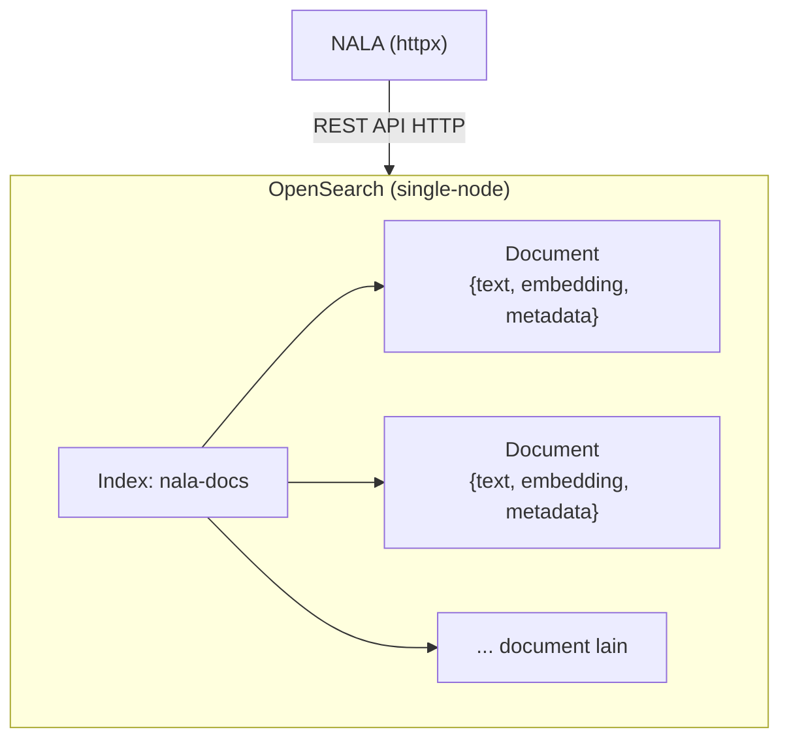

# Module 12: Vector Store — Menyalakan OpenSearch

## Tujuan

Menyiapkan **OpenSearch** sebagai vector store untuk NALA — memahami apa itu OpenSearch, kenapa dipilih dibanding alternatif lain, dan menyalakannya sehat di Docker Compose. Module ini fokus **infrastruktur**: OpenSearch benar-benar berjalan dan siap dipakai. Module 13 melanjutkan dari sini untuk membangun **semantic search** sungguhan di atasnya (metrik kemiripan, class `VectorStore`).

## Definisi

**Vector store** adalah sistem penyimpanan yang dioptimalkan untuk menyimpan dan mencari vektor secara efisien — NALA memakai **OpenSearch** untuk keperluan ini (Bagian 3), bukan database relasional biasa dengan tabel dan kolom. Kegunaan intinya: menjalankan **semantic search** (pencarian semantik) — mencari berdasarkan kemiripan **makna** vektor, bukan kecocokan kata kunci persis. Detail bagaimana "mirip" itu sebenarnya diukur (metrik matematis) dan bagaimana kode `VectorStore` NALA memanfaatkannya baru dibahas lengkap di Module 13 — di module ini, fokusnya dulu memahami **apa** OpenSearch itu dan **menyalakannya**.


## Hasil Akhir yang Diharapkan

- OpenSearch berjalan sehat (`docker compose logs opensearch` menunjukkan cluster health `green`/`yellow`)
- Kita paham apa itu OpenSearch secara umum (asal-usulnya, konsep index/document, akses lewat REST API) — bukan cuma tahu cara memakainya
- Kita paham kenapa NALA akhirnya memilih OpenSearch dibanding alternatif lain
- `/chat/stream` (Module 7) tetap berfungsi seperti sebelumnya

## 1. Apa itu Vector Search / Vector Store

**Vector Search** adalah teknik pencarian yang memakai **kemiripan vektor** sebagai dasar menemukan dokumen relevan, bukan pencocokan kata kunci tradisional. **Vector Store** adalah database/sistem penyimpanan khusus yang dioptimalkan menyimpan dan mencari vektor secara efisien.

**Cara kerja vector search secara garis besar**: (1) pertanyaan pengguna diubah jadi vektor lewat model embedding yang sama (Module 11), (2) sistem menghitung kemiripan antara vektor query dan vektor dokumen yang tersimpan, (3) dokumen diurutkan berdasarkan skor kemiripan, (4) top-K dokumen/chunk paling relevan dikembalikan. Langkah (2) — **bagaimana** "kemiripan" itu sebenarnya dihitung, dan lanskap vector database di luar OpenSearch — dibahas detail di Module 13 Bagian 1-2. Di module ini, kita fokus dulu ke tempat penyimpanannya: OpenSearch itu sendiri.

## 2. Apa itu OpenSearch

Bayangkan OpenSearch sebagai **"mesin pencari pribadi"** — seperti Google, tapi bukan untuk mencari di seluruh internet, melainkan khusus mencari di dalam dokumen-dokumen milik NALA sendiri. Tugas utamanya dari dulu sampai sekarang sama: menerima jutaan dokumen, lalu menemukan dengan cepat mana yang paling relevan begitu ada pertanyaan masuk. Kemampuan "mencari berdasarkan kemiripan makna" (vector search, dibahas Module 13) sebenarnya **fitur tambahan** — kemampuan aslinya, sejak awal dibuat, adalah mencari dokumen berdasarkan **kata kunci** yang persis disebut, mirip cara kerja kolom pencarian di situs berita atau marketplace. Nama teknis "cara menilai kecocokan kata kunci" ini adalah **BM25** — sebuah rumus yang menghitung skor relevansi dokumen berdasarkan seberapa sering dan seberapa "penting" kata-kata pencarian muncul di dalamnya (dokumen yang mengandung kata langka/spesifik dari query dinilai lebih relevan daripada yang cuma mengandung kata umum) — istilah ini akan muncul lagi di Module 18 saat NALA menggabungkannya dengan vector search.

Asal-usulnya juga sederhana untuk dipahami: OpenSearch adalah "anak" dari produk bernama **Elasticsearch**. Beberapa tahun lalu, perusahaan pembuat Elasticsearch mengubah aturan pemakaiannya jadi lebih terbatas — komunitas dan Amazon (AWS) tidak setuju, lalu mereka meneruskan versi terakhir yang masih bebas dipakai siapa saja, dan memberinya nama baru: **OpenSearch**. Jadi kalau Anda pernah dengar nama Elasticsearch, anggap saja OpenSearch adalah versi "sepupu dekat"-nya — cara kerja dan istilah-istilahnya sangat mirip. Mesin pencarinya sendiri, jauh di dalam "mesin"-nya, dibangun di atas komponen bernama **Apache Lucene** — semacam "mesin mobil" generik yang dipakai bersama oleh OpenSearch, Elasticsearch, dan beberapa mesin pencari lain; OpenSearch dan Elasticsearch ibarat dua mobil berbeda merek yang kebetulan memakai mesin dasar yang sama.

Dua istilah yang perlu dikenal sebelum melihat kode di Bagian 4, dan keduanya sebenarnya konsep yang sudah akrab sehari-hari: **index** itu seperti satu **lemari arsip** — tempat menyimpan dokumen-dokumen yang sejenis (di NALA, satu lemari arsip bernama `nala-docs` menyimpan semua potongan dokumen SOP). **Document** itu seperti satu **lembar formulir** di dalam lemari arsip itu — satu formulir untuk satu potongan dokumen, isinya tiga kolom: teks aslinya, "sidik jari makna"-nya (vektor/embedding), dan keterangan tambahan (metadata). Untuk mengisi lemari arsip ini atau mencari isinya, NALA cukup "mengirim surat" lewat internet (disebut REST API) — tidak perlu aplikasi atau alat khusus, alasan kenapa NALA bisa berkomunikasi dengan OpenSearch memakai `httpx` yang sama dipakai untuk Ollama sejak Module 1-6.

⚠️ **Satu hal yang perlu diluruskan**: bukan berarti OpenSearch menyimpan formulir-formulir itu lalu membaca ulang **satu per satu** setiap kali ada pencarian — itu akan sangat lambat kalau dokumennya jutaan. Di belakang layar, begitu satu formulir masuk, OpenSearch diam-diam menyusun **daftar indeks/catatan bantuan** dari isinya (mirip daftar isi atau indeks di belakang buku tebal — makanya disebut "index") supaya pencarian berikutnya bisa langsung "lompat" ke bagian yang relevan, tanpa perlu membuka semua formulir satu-satu. Dua daftar bantuan ini punya nama teknis masing-masing, dan berbeda tergantung jenis pencariannya: untuk pencarian kata kunci (BM25), daftar bantuannya disebut **inverted index** — bayangkan seperti indeks di belakang buku tebal yang mendaftar "kata apa muncul di halaman berapa", cuma dibalik: bukan "halaman → kata apa saja isinya", tapi "kata apa → ada di dokumen mana saja". Untuk pencarian kemiripan makna (vector search, Module 13), daftar bantuannya disebut **HNSW** (*Hierarchical Navigable Small World*) — semacam peta jaringan pertemanan antar vektor, supaya OpenSearch bisa "meloncat" dari satu vektor ke vektor tetangganya yang mirip tanpa perlu membandingkan ke **semua** vektor yang ada satu-satu, mirip cara Anda menemukan kenalan lewat "teman dari teman" dibanding menghubungi semua orang di kota satu-satu. Formulir aslinya (JSON) tetap tersimpan utuh dan itulah yang dikembalikan sebagai hasil pencarian — cuma **cara mencarinya** yang sudah dioptimalkan lewat kedua struktur bantuan ini, bukan sekadar menyisir semua data dari atas ke bawah.

Satu istilah lagi yang muncul di konfigurasi Bagian 4: **cluster** dan **node** — anggap saja **node** itu satu "gedung kantor cabang" tempat OpenSearch bekerja, dan **cluster** adalah kumpulan beberapa gedung yang bekerja sama. Di lingkungan production sungguhan, biasanya dipakai beberapa gedung (node) sekaligus supaya kalau satu gedung bermasalah, gedung lain tetap bisa melayani, dan pekerjaannya juga terbagi rata. Untuk training ini, cukup **satu gedung saja** (`discovery.type=single-node`) — jauh lebih ringan buat laptop, dan cara kerjanya tetap sama persis dengan yang dipakai di lingkungan production sungguhan.



## 3. Kenapa Akhirnya OpenSearch untuk NALA

Vector database di luar OpenSearch bisa dikelompokkan jadi tiga kategori besar (dibahas lengkap dengan contoh dan analogi di **Module 13 Bagian 1**): (a) vector database khusus seperti Pinecone/Weaviate/Milvus/Qdrant/Chroma, (b) extension pada database yang sudah ada seperti pgvector untuk PostgreSQL, dan (c) search engine dengan kemampuan vector search seperti OpenSearch/Elasticsearch. NALA memilih **OpenSearch** — kategori (c) — bukan Pinecone/Weaviate/Milvus/Qdrant (kategori a) maupun pgvector (kategori b). Alasannya konkret, bukan sekadar "yang paling populer":

- **Dual Role, alasan paling menentukan**: di titik ini (Module 12) OpenSearch dipakai sebagai *pure vector store*; nanti (Module 18) bisa di-upgrade jadi *hybrid search* (BM25 keyword + vector) **tanpa mengganti infrastruktur** — satu platform untuk dua kebutuhan. Vector database khusus (kategori a) tidak punya kemampuan keyword search bawaan sekuat ini; kalau dipilih, Module 18 harus menambah **sistem search terpisah** di luar vector database-nya sendiri, lalu menggabungkan hasil keduanya secara manual — kompleksitas ekstra yang tidak perlu untuk skala training ini.
- **pgvector sempat jadi kandidat, tapi ditunda**: karena NALA nanti (Module 22) juga akan memakai PostgreSQL untuk data operasional, pgvector (kategori b) terlihat menarik supaya tidak perlu service tambahan. Tapi di Module 7-17 ini PostgreSQL belum ada sama sekali di stack NALA — menambahkannya di titik ini cuma untuk vector store berarti mengenalkan service baru yang lebih awal dari waktunya, dan performa pencarian vektornya pada skala data yang akan terus tumbuh (ribuan dokumen ke depan) kalah dibanding search engine yang memang dioptimalkan untuk ini.
- **Production-ready**: distribusi open-source dari Elasticsearch (AWS), battle-tested di enterprise, dokumentasi lengkap.
- **Security & control**: bisa dijalankan on-premises, kontrol penuh atas data dan privasi — konsisten dengan prinsip Module 1-4.
- **Integration ready**: OpenSearch punya REST API HTTP biasa — NALA mengaksesnya langsung lewat `httpx` (dependency yang sudah dipakai sejak Module 1-6 untuk Ollama), **bukan** library client resmi `opensearch-py`. Satu HTTP client dipakai konsisten untuk semua pemanggilan eksternal, tanpa menambah dependency baru.

Tidak ada satu kategori yang "paling benar" secara universal — pilihannya tergantung kebutuhan. NALA jatuh ke kategori (c) karena alasan-alasan di atas. Perbandingan lengkap ketiga kategori — termasuk analogi toko buku dan tabel trade-off — ada di **Module 13 Bagian 1**.

## 4. Struktur yang Ditambahkan: Service `opensearch` di `docker-compose.yml`

```yaml
# docker-compose.yml
services:
  ollama:
    image: ollama/ollama:latest
    ports:
      - '11434:11434'
    volumes:
      - ollama_data:/root/.ollama

  opensearch:
    image: opensearchproject/opensearch:2.11.0
    environment:
      - discovery.type=single-node
      - plugins.security.disabled=true
      - OPENSEARCH_JAVA_OPTS=-Xms512m -Xmx512m
      - DISABLE_INSTALL_DEMO_CONFIG=true
    ports:
      - '9200:9200'
    volumes:
      - opensearch_data:/usr/share/opensearch/data

  api:
    build: .
    ports:
      - '8000:8000'
    environment:
      - OLLAMA_BASE_URL=http://ollama:11434
      - OLLAMA_MODEL=llama3.2:3b
      - KNOWLEDGE_BASE_PATH=/app/knowledge-base
      - OPENSEARCH_BASE_URL=http://opensearch:9200
    volumes:
      - ./knowledge-base:/app/knowledge-base
    depends_on:
      - ollama
      - opensearch

volumes:
  ollama_data:
  opensearch_data:
```

- **`discovery.type=single-node`**: OpenSearch normalnya didesain untuk cluster banyak node — flag ini bilang "cuma ada 1 node", supaya tidak menunggu node lain yang tidak akan pernah muncul.
- **`plugins.security.disabled=true`**: mematikan autentikasi/TLS bawaan, wajar untuk lingkungan training lokal supaya `httpx` bisa langsung `PUT`/`POST` tanpa perlu setup certificate/credential.
- **`OPENSEARCH_BASE_URL=http://opensearch:9200`** di service `api`: env var baru, disiapkan untuk dibaca `VectorStore` yang baru dibangun di Module 13 — belum ada kode yang memakainya di module ini.

> **📝 Catatan opsional — UI untuk melihat isi OpenSearch**: **OpenSearch Dashboards** (setara Kibana) bisa ditambahkan sebagai service tambahan kalau mau tampilan visual (Dev Tools untuk query, Discover untuk lihat data per baris) — **tidak wajib** untuk Module 7-17, murni kenyamanan development, dan menambah ~512MB-1GB RAM. Setup detailnya di luar cakupan training ini.

**▶️ Jalankan & lihat hasilnya**

> **Prasyarat RAM**: pastikan alokasi RAM Docker Desktop sudah dinaikkan ke 16GB+ (lihat Module 7, bagian setup — catatan RAM) sebelum menyalakan OpenSearch di langkah ini. OpenSearch cukup berat untuk RAM Docker yang mepet.

```bash
docker compose up -d --build opensearch
```

Flag `-d` (detached) supaya tidak perlu buka terminal baru — service ini jalan di background, sementara terminal `ollama`+`api` (Module 7) tetap seperti semula. **Proses ini akan terasa lama** — OpenSearch butuh waktu untuk inisialisasi cluster single-node. Jangan panik kalau terlihat "diam" beberapa menit.

Tunggu OpenSearch siap:

```bash
docker compose logs -f opensearch
```

Tunggu sampai muncul log cluster health `green` atau `yellow` (bukan `red`), lalu `Ctrl+C` untuk keluar dari `logs -f` (service tetap jalan di background). Rebuild `api` supaya `OPENSEARCH_BASE_URL` (env var baru dari module ini) ter-load:

```bash
docker compose up --build -d api
```

✅ **Indikator sukses**: `docker compose logs opensearch` menunjukkan cluster health `green`/`yellow` (bukan `red`), dan `docker compose ps` menunjukkan `opensearch` berstatus `running`/`healthy`. Belum ada kode Python yang memanggil OpenSearch — itu baru terjadi di Module 13, begitu class `VectorStore` dibangun.

**Troubleshooting**

- **OpenSearch gagal start / restart terus / error terkait `vm.max_map_count`**: OpenSearch butuh `vm.max_map_count` minimal 262144 di level OS host, sementara default macOS/Windows (lewat Docker Desktop VM) sering lebih rendah. Perbaiki dengan menjalankan (sekali saja, akan reset lagi setelah restart Docker Desktop/laptop):
  ```bash
  docker run --rm --privileged --pid=host alpine sysctl -w vm.max_map_count=262144
  ```
  Setelah itu jalankan ulang `docker compose up -d --build opensearch`. Error yang sama juga bisa muncul saat menyalakan `airflow` (Module 17) — perbaikannya identik.
- **Semua service terasa sangat lambat / laptop panas / container ter-*kill***: kemungkinan besar alokasi RAM Docker Desktop kurang — lihat catatan Prasyarat RAM di atas dan Module 7. Cek pemakaian resource real-time dengan `docker stats`.
- **Port sudah dipakai (8000/9200/11434)**: ubah mapping port di `docker-compose.yml` untuk service yang bentrok.

<details>
<summary><strong>Pakai Claude Code? Salin prompt berikut, paste untuk eksekusi Bagian 4</strong></summary>

```
Tambah service opensearch di docker-compose.yml NALA (Module 12) —
BELUM membuat kode Python apa pun.

GOAL:
- Di Nala/docker-compose.yml: tambah
  service baru `opensearch` (image opensearchproject/opensearch:2.11.0,
  environment discovery.type=single-node,
  plugins.security.disabled=true,
  OPENSEARCH_JAVA_OPTS=-Xms512m -Xmx512m,
  DISABLE_INSTALL_DEMO_CONFIG=true, port 9200:9200, volume
  opensearch_data:/usr/share/opensearch/data), tambah
  `- OPENSEARCH_BASE_URL=http://opensearch:9200` ke environment
  service `api`, tambah `opensearch` ke depends_on service `api`, dan
  tambah `opensearch_data:` ke top-level volumes.

CONTEXT:
- Env var OPENSEARCH_BASE_URL disiapkan untuk dibaca class VectorStore
  yang baru dibangun di Module 13 — belum ada kode yang memakainya
  di module ini.

GUARDRAIL:
- JANGAN buat app/vector_store.py di langkah ini — itu Module 13.
- JANGAN ubah service ollama atau api selain menambah environment
  dan depends_on yang disebutkan.
- JANGAN tambah service airflow — itu baru masuk Module 17.
```

</details>

## 5. Checkpoint Praktik

Yang perlu dipastikan sebelum lanjut ke Module 13:

- [ ] `docker compose logs opensearch` menunjukkan cluster health `green`/`yellow`, bukan `red`
- [ ] Kita paham OpenSearch pada dasarnya adalah full-text search engine (fork open-source Elasticsearch) yang belakangan ditambahi kemampuan vector search — bukan produk yang dari awal dibangun cuma untuk vektor
- [ ] Kita bisa menjelaskan konsep index dan document di OpenSearch, dan kenapa NALA mengaksesnya lewat REST API HTTP biasa (`httpx`), bukan library client khusus
- [ ] Kita paham alasan utama NALA memilih OpenSearch dibanding vector database khusus atau pgvector
- [ ] `/chat/stream` (Module 7) masih berfungsi seperti sebelumnya

Begitu kelima hal ini terverifikasi, lanjut ke Module 13 — membangun **semantic search** sungguhan di atas OpenSearch yang sudah menyala ini: memahami metrik kemiripan (cosine similarity, L2, dot product) dan membangun class `VectorStore` yang menyambungkan embedding (Module 11) ke OpenSearch (module ini).
