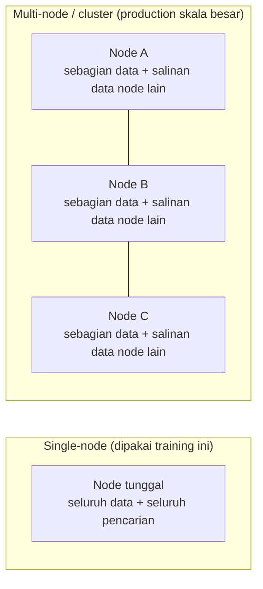
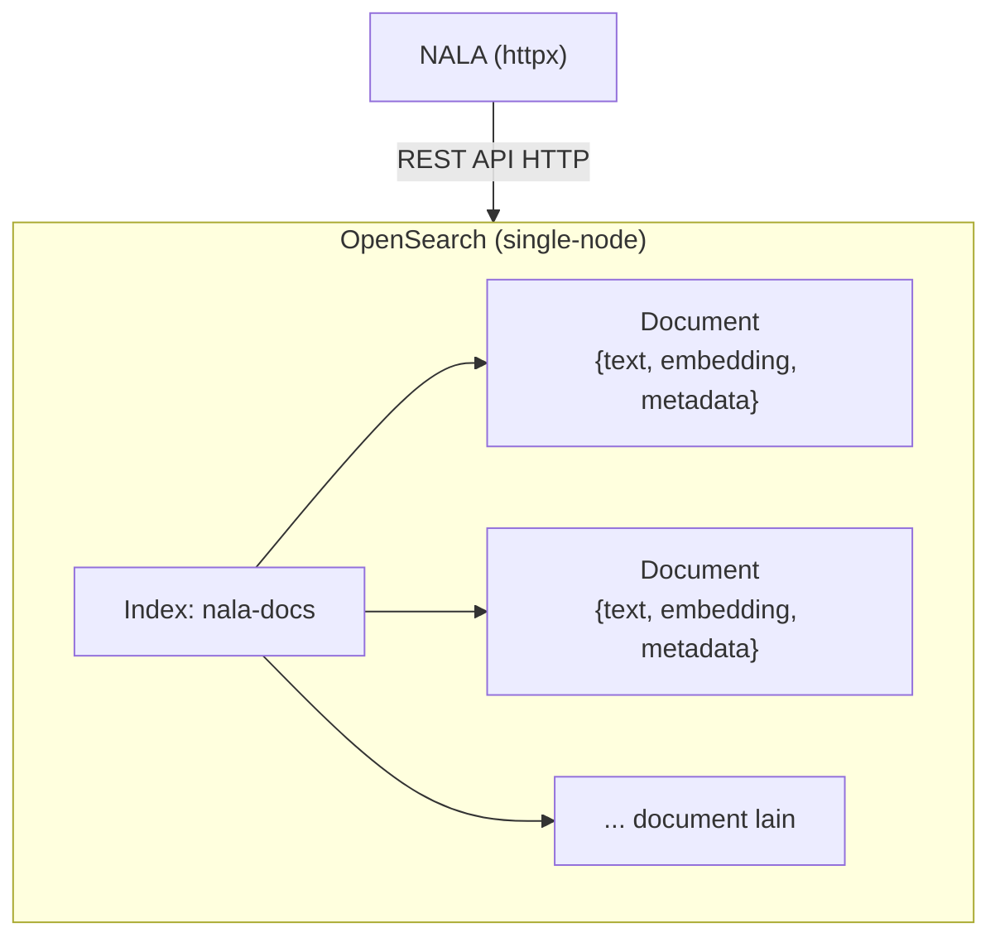

# Module 12: Vector Store — Menyalakan OpenSearch

## Tujuan

Menyiapkan **OpenSearch** sebagai vector store untuk NALA — memahami apa itu OpenSearch, kenapa dipilih dibanding alternatif lain, dan menyalakannya sehat di Docker Compose. Module ini fokus **infrastruktur**: OpenSearch benar-benar berjalan dan siap dipakai. Module 13 melanjutkan dari sini untuk membangun **semantic search** sungguhan di atasnya (metrik kemiripan, class `VectorStore`).

## Definisi

**Vector store** adalah sistem penyimpanan yang dioptimalkan untuk menyimpan dan mencari vektor secara efisien — NALA memakai **OpenSearch** untuk keperluan ini (Bagian 3), bukan database relasional biasa dengan tabel dan kolom. Kegunaan intinya: menjalankan **semantic search** (pencarian semantik) — mencari berdasarkan kemiripan **makna** vektor, bukan kecocokan kata kunci persis. Detail bagaimana "mirip" itu sebenarnya diukur (metrik matematis) dan bagaimana kode `VectorStore` NALA memanfaatkannya baru dibahas lengkap di Module 13 — di module ini, fokusnya dulu memahami **apa** OpenSearch itu dan **menyalakannya**.


## Hasil Akhir yang Diharapkan

- OpenSearch berjalan sehat (`docker compose logs opensearch` menunjukkan cluster health `green`/`yellow`)
- `http://localhost:5601` (OpenSearch Dashboards) bisa dibuka di browser untuk menjelajahi isi OpenSearch secara visual
- Terbukti lewat Dev Tools bahwa OpenSearch sudah bisa menyimpan & mencari vektor sungguhan
- Kita paham apa itu OpenSearch secara umum (asal-usulnya, konsep index/document, akses lewat REST API) — bukan cuma tahu cara memakainya
- Kita paham kenapa NALA akhirnya memilih OpenSearch dibanding alternatif lain
- `/chat/stream` (Module 7) tetap berfungsi seperti sebelumnya

## 1. Apa itu Vector Search / Vector Store

**Vector Search** adalah teknik pencarian yang memakai **kemiripan vektor** sebagai dasar menemukan dokumen relevan, bukan pencocokan kata kunci tradisional. **Vector Store** adalah database/sistem penyimpanan khusus yang dioptimalkan menyimpan dan mencari vektor secara efisien.

**Cara kerja vector search secara garis besar**: (1) pertanyaan pengguna diubah jadi vektor lewat model embedding yang sama (Module 11), (2) sistem menghitung kemiripan antara vektor query dan vektor dokumen yang tersimpan, (3) dokumen diurutkan berdasarkan skor kemiripan, (4) top-K dokumen/chunk paling relevan dikembalikan. Langkah (2) — **bagaimana** "kemiripan" itu sebenarnya dihitung, dan lanskap vector database di luar OpenSearch — dibahas detail di Module 13 Bagian 1-2. Di module ini, kita fokus dulu ke tempat penyimpanannya: OpenSearch itu sendiri.

## 2. Apa itu OpenSearch

Bayangkan OpenSearch sebagai **"mesin pencari pribadi"** — seperti Google, tapi bukan untuk mencari di seluruh internet, melainkan khusus mencari di dalam dokumen-dokumen milik NALA sendiri. Tugas utamanya dari dulu sampai sekarang sama: menerima jutaan dokumen, lalu menemukan dengan cepat mana yang paling relevan begitu ada pertanyaan masuk. Kemampuan "mencari berdasarkan kemiripan makna" (vector search, dibahas Module 13) sebenarnya **fitur tambahan** — kemampuan aslinya, sejak awal dibuat, adalah mencari dokumen berdasarkan **kata kunci** yang persis disebut, mirip cara kerja kolom pencarian di situs berita atau marketplace. Nama teknis "cara menilai kecocokan kata kunci" ini adalah **BM25** — sebuah rumus yang menghitung skor relevansi dokumen berdasarkan seberapa sering dan seberapa "penting" kata-kata pencarian muncul di dalamnya (dokumen yang mengandung kata langka/spesifik dari query dinilai lebih relevan daripada yang cuma mengandung kata umum) — istilah ini akan muncul lagi di Module 18 saat NALA menggabungkannya dengan vector search.

Asal-usulnya juga sederhana untuk dipahami: OpenSearch adalah "anak" dari produk bernama **Elasticsearch**. Beberapa tahun lalu, perusahaan pembuat Elasticsearch mengubah aturan pemakaiannya jadi lebih terbatas — komunitas dan Amazon (AWS) tidak setuju, lalu mereka meneruskan versi terakhir yang masih bebas dipakai siapa saja, dan memberinya nama baru: **OpenSearch**. Jadi kalau Anda pernah dengar nama Elasticsearch, anggap saja OpenSearch adalah versi "sepupu dekat"-nya — cara kerja dan istilah-istilahnya sangat mirip. Mesin pencarinya sendiri, jauh di dalam "mesin"-nya, dibangun di atas komponen bernama **Apache Lucene** — semacam "mesin mobil" generik yang dipakai bersama oleh OpenSearch, Elasticsearch, dan beberapa mesin pencari lain; OpenSearch dan Elasticsearch ibarat dua mobil berbeda merek yang kebetulan memakai mesin dasar yang sama.

Dua istilah yang perlu dikenal sebelum melihat kode di Bagian 4, dan keduanya sebenarnya konsep yang sudah akrab sehari-hari: **index** itu seperti satu **lemari arsip** — tempat menyimpan dokumen-dokumen yang sejenis (di NALA, satu lemari arsip bernama `nala-docs` menyimpan semua potongan dokumen SOP). **Document** itu seperti satu **lembar formulir** di dalam lemari arsip itu — satu formulir untuk satu potongan dokumen, isinya tiga kolom: teks aslinya, "sidik jari makna"-nya (vektor/embedding), dan keterangan tambahan (metadata). Untuk mengisi lemari arsip ini atau mencari isinya, NALA cukup "mengirim surat" lewat internet (disebut REST API) — tidak perlu aplikasi atau alat khusus, alasan kenapa NALA bisa berkomunikasi dengan OpenSearch memakai `httpx` yang sama dipakai untuk Ollama sejak Module 1-6.

⚠️ **Satu hal yang perlu diluruskan**: bukan berarti OpenSearch menyimpan formulir-formulir itu lalu membaca ulang **satu per satu** setiap kali ada pencarian — itu akan sangat lambat kalau dokumennya jutaan. Di belakang layar, begitu satu formulir masuk, OpenSearch diam-diam menyusun **daftar indeks/catatan bantuan** dari isinya (mirip daftar isi atau indeks di belakang buku tebal — makanya disebut "index") supaya pencarian berikutnya bisa langsung "lompat" ke bagian yang relevan, tanpa perlu membuka semua formulir satu-satu. Dua daftar bantuan ini punya nama teknis masing-masing, dan berbeda tergantung jenis pencariannya: untuk pencarian kata kunci (BM25), daftar bantuannya disebut **inverted index** — bayangkan seperti indeks di belakang buku tebal yang mendaftar "kata apa muncul di halaman berapa", cuma dibalik: bukan "halaman → kata apa saja isinya", tapi "kata apa → ada di dokumen mana saja". Untuk pencarian kemiripan makna (vector search, Module 13), daftar bantuannya disebut **HNSW** (*Hierarchical Navigable Small World*) — semacam peta jaringan pertemanan antar vektor, supaya OpenSearch bisa "meloncat" dari satu vektor ke vektor tetangganya yang mirip tanpa perlu membandingkan ke **semua** vektor yang ada satu-satu, mirip cara Anda menemukan kenalan lewat "teman dari teman" dibanding menghubungi semua orang di kota satu-satu. Formulir aslinya (JSON) tetap tersimpan utuh dan itulah yang dikembalikan sebagai hasil pencarian — cuma **cara mencarinya** yang sudah dioptimalkan lewat kedua struktur bantuan ini, bukan sekadar menyisir semua data dari atas ke bawah.

Satu istilah lagi yang muncul di konfigurasi Bagian 4: **cluster** dan **node** — anggap saja **node** itu satu "gedung kantor cabang" tempat OpenSearch bekerja, dan **cluster** adalah kumpulan beberapa gedung yang bekerja sama. Di lingkungan production sungguhan, biasanya dipakai beberapa gedung (node) sekaligus supaya kalau satu gedung bermasalah, gedung lain tetap bisa melayani, dan pekerjaannya juga terbagi rata. Untuk training ini, cukup **satu gedung saja** (`discovery.type=single-node`) — jauh lebih ringan buat laptop, dan cara kerjanya tetap sama persis dengan yang dipakai di lingkungan production sungguhan.

**Single-node** berarti cuma **satu** proses OpenSearch yang menyimpan **seluruh** data dan mengerjakan **seluruh** pencarian sendirian — kalau container ini mati, seluruh sistem pencarian ikut mati, tidak ada cadangan. **Multi-node** (cluster sungguhan) memecah satu index yang sama jadi beberapa potongan yang disebar ke beberapa node (disebut *sharding*), dan tiap potongan biasanya punya salinan/cadangan di node lain (disebut *replica*) — aplikasi tetap bicara ke "satu alamat cluster" seolah-olah itu satu mesin, tapi di baliknya permintaan pencarian otomatis dipecah, dikerjakan paralel di beberapa node, lalu hasilnya digabung. Kalau satu node mati, data yang tadi cuma ada di situ masih bisa diambil dari salinannya di node lain.



**Apakah NALA perlu multi-node?** Tidak, untuk skala dan kebutuhannya sekarang:
- **Skala datanya kecil** — dokumen SOP/kebijakan internal, paling ratusan sampai ribuan chunk, bukan jutaan dokumen. Single-node sanggup menangani ini tanpa masalah performa.
- **Ini aplikasi internal, bukan layanan publik skala besar** — multi-node menyelesaikan masalah "banyak user mengakses bersamaan dalam jumlah besar" dan/atau "data terlalu besar untuk satu mesin". Staff yang memakai NALA jumlahnya terbatas, bukan jutaan user simultan.
- **High availability (HA) biasanya krusial untuk sistem yang tidak boleh down sama sekali** (misal sistem pembayaran real-time). Kalau OpenSearch NALA sempat down beberapa menit karena container di-restart, dampaknya cuma staff tidak bisa pakai chatbot sebentar — bukan kerugian finansial langsung. Kompleksitas setup multi-node (beberapa mesin/VM, jaringan antar node, koordinasi cluster) tidak sepadan dengan manfaatnya di skala ini.
- **Migrasi ke multi-node nanti, kalau memang dibutuhkan, tidak perlu mengubah kode aplikasi sama sekali** — `VectorStore` bicara ke OpenSearch lewat REST API biasa (`httpx`), endpoint-nya sama persis baik di belakangnya satu node atau sepuluh node. Yang berubah cuma konfigurasi infrastruktur, bukan `app/vector_store.py` (Module 13).

Jadi single-node di sini bukan "versi murah/kurang lengkap" — untuk skala dan kebutuhan NALA, itu memang pilihan yang tepat, bukan kompromi sementara.



## 3. Kenapa Akhirnya OpenSearch untuk NALA

Vector database di luar OpenSearch bisa dikelompokkan jadi tiga kategori besar (dibahas lengkap dengan contoh dan analogi di **Module 13 Bagian 1**): (a) vector database khusus seperti Pinecone/Weaviate/Milvus/Qdrant/Chroma, (b) extension pada database yang sudah ada seperti pgvector untuk PostgreSQL, dan (c) search engine dengan kemampuan vector search seperti OpenSearch/Elasticsearch. NALA memilih **OpenSearch** — kategori (c) — bukan Pinecone/Weaviate/Milvus/Qdrant (kategori a) maupun pgvector (kategori b). Alasannya konkret, bukan sekadar "yang paling populer":

- **Dual Role, alasan paling menentukan**: di titik ini (Module 12) OpenSearch dipakai sebagai *pure vector store*; nanti (Module 18) bisa di-upgrade jadi *hybrid search* (BM25 keyword + vector) **tanpa mengganti infrastruktur** — satu platform untuk dua kebutuhan. Vector database khusus (kategori a) tidak punya kemampuan keyword search bawaan sekuat ini; kalau dipilih, Module 18 harus menambah **sistem search terpisah** di luar vector database-nya sendiri, lalu menggabungkan hasil keduanya secara manual — kompleksitas ekstra yang tidak perlu untuk skala training ini.
- **pgvector sempat jadi kandidat, tapi ditunda**: karena NALA nanti (Module 22) juga akan memakai PostgreSQL untuk data operasional, pgvector (kategori b) terlihat menarik supaya tidak perlu service tambahan. Tapi di Module 7-17 ini PostgreSQL belum ada sama sekali di stack NALA — menambahkannya di titik ini cuma untuk vector store berarti mengenalkan service baru yang lebih awal dari waktunya, dan performa pencarian vektornya pada skala data yang akan terus tumbuh (ribuan dokumen ke depan) kalah dibanding search engine yang memang dioptimalkan untuk ini.
- **Production-ready**: distribusi open-source dari Elasticsearch (AWS), battle-tested di enterprise, dokumentasi lengkap.
- **Security & control**: bisa dijalankan on-premises, kontrol penuh atas data dan privasi — konsisten dengan prinsip Module 1-4.
- **Integration ready**: OpenSearch punya REST API HTTP biasa — NALA mengaksesnya langsung lewat `httpx` (dependency yang sudah dipakai sejak Module 1-6 untuk Ollama), **bukan** library client resmi `opensearch-py`. Satu HTTP client dipakai konsisten untuk semua pemanggilan eksternal, tanpa menambah dependency baru.

Tidak ada satu kategori yang "paling benar" secara universal — pilihannya tergantung kebutuhan. NALA jatuh ke kategori (c) karena alasan-alasan di atas. Perbandingan lengkap ketiga kategori — termasuk analogi toko buku dan tabel trade-off — ada di **Module 13 Bagian 1**.

## 4. Struktur yang Ditambahkan: Service `opensearch` dan `opensearch-dashboards`

**Langkah 1 — Service `opensearch`**

```yaml
# docker-compose.yml
services:
  ollama:
    image: ollama/ollama:latest
    ports:
      - '11434:11434'
    volumes:
      - ollama_data:/root/.ollama

  opensearch:
    image: opensearchproject/opensearch:2.11.0
    environment:
      - discovery.type=single-node
      - plugins.security.disabled=true
      - OPENSEARCH_JAVA_OPTS=-Xms512m -Xmx512m
      - DISABLE_INSTALL_DEMO_CONFIG=true
    ports:
      - '9200:9200'
    volumes:
      - opensearch_data:/usr/share/opensearch/data

  api:
    build: .
    ports:
      - '8000:8000'
    environment:
      - OLLAMA_BASE_URL=http://ollama:11434
      - OLLAMA_MODEL=llama3.2:3b
      - KNOWLEDGE_BASE_PATH=/app/knowledge-base
      - OPENSEARCH_BASE_URL=http://opensearch:9200
    volumes:
      - ./knowledge-base:/app/knowledge-base
    depends_on:
      - ollama
      - opensearch

volumes:
  ollama_data:
  opensearch_data:
```

- **`discovery.type=single-node`**: OpenSearch normalnya didesain untuk cluster banyak node — flag ini bilang "cuma ada 1 node", supaya tidak menunggu node lain yang tidak akan pernah muncul.
- **`plugins.security.disabled=true`**: mematikan autentikasi/TLS bawaan, wajar untuk lingkungan training lokal supaya `httpx` bisa langsung `PUT`/`POST` tanpa perlu setup certificate/credential.
- **`DISABLE_INSTALL_DEMO_CONFIG=true`**: mencegah OpenSearch **menginstall konfigurasi keamanan demo** saat pertama kali start — normalnya (tanpa flag ini), OpenSearch otomatis membuat sertifikat TLS demo dan user default (`admin`/`admin`, password bawaan yang sudah dikenal publik) sebagai bagian dari setup awal plugin security. Flag ini relevan meski `plugins.security.disabled=true` sudah mematikan plugin-nya, karena dua alasan: (1) *belt-and-suspenders* — proses instalasi demo config bisa saja tetap berjalan duluan sebelum plugin itu benar-benar nonaktif, flag ini mencegah langkah instalasinya sama sekali, bukan cuma menonaktifkan hasilnya; (2) startup lebih cepat dan bersih — generate sertifikat + setup user demo butuh waktu dan menghasilkan log tambahan setiap kali container start, overhead yang tidak perlu untuk training lokal yang memang tidak butuh autentikasi sama sekali. Tidak relevan untuk production (yang justru harus mengaktifkan security sungguhan, bukan mematikannya).
- **`OPENSEARCH_BASE_URL=http://opensearch:9200`** di service `api`: env var baru, disiapkan untuk dibaca `VectorStore` yang baru dibangun di Module 13 — belum ada kode yang memakainya di module ini.

**▶️ Jalankan & lihat hasilnya**

> **Prasyarat RAM**: pastikan alokasi RAM Docker Desktop sudah dinaikkan ke 16GB+ (lihat Module 7, bagian setup — catatan RAM) sebelum menyalakan OpenSearch di langkah ini. OpenSearch cukup berat untuk RAM Docker yang mepet.

```bash
docker compose up -d --build opensearch
```

Flag `-d` (detached) supaya tidak perlu buka terminal baru — service ini jalan di background, sementara terminal `ollama`+`api` (Module 7) tetap seperti semula. **Proses ini akan terasa lama** — OpenSearch butuh waktu untuk inisialisasi cluster single-node. Jangan panik kalau terlihat "diam" beberapa menit.

Tunggu OpenSearch siap:

```bash
docker compose logs -f opensearch
```

Tunggu sampai muncul log cluster health `green` atau `yellow` (bukan `red`), lalu `Ctrl+C` untuk keluar dari `logs -f` (service tetap jalan di background). Rebuild `api` supaya `OPENSEARCH_BASE_URL` (env var baru dari module ini) ter-load:

```bash
docker compose up --build -d api
```

✅ **Indikator sukses**: `docker compose logs opensearch` menunjukkan cluster health `green`/`yellow` (bukan `red`), dan `docker compose ps` menunjukkan `opensearch` berstatus `running`/`healthy`. Belum ada kode Python yang memanggil OpenSearch — itu baru terjadi di Module 13, begitu class `VectorStore` dibangun.

**Troubleshooting**

- **OpenSearch gagal start / restart terus / error terkait `vm.max_map_count`**: OpenSearch butuh `vm.max_map_count` minimal 262144 di level OS host, sementara default macOS/Windows (lewat Docker Desktop VM) sering lebih rendah. Perbaiki dengan menjalankan (sekali saja, akan reset lagi setelah restart Docker Desktop/laptop):
  ```bash
  docker run --rm --privileged --pid=host alpine sysctl -w vm.max_map_count=262144
  ```
  Setelah itu jalankan ulang `docker compose up -d --build opensearch`. Error yang sama juga bisa muncul saat menyalakan `airflow` (Module 17) — perbaikannya identik.
- **Semua service terasa sangat lambat / laptop panas / container ter-*kill***: kemungkinan besar alokasi RAM Docker Desktop kurang — lihat catatan Prasyarat RAM di atas dan Module 7. Cek pemakaian resource real-time dengan `docker stats`.
- **Port sudah dipakai (8000/9200/11434)**: ubah mapping port di `docker-compose.yml` untuk service yang bentrok.

<details>
<summary><strong>Pakai Claude Code? Salin prompt berikut, paste untuk eksekusi Langkah 1</strong></summary>

```
Tambah service opensearch di docker-compose.yml NALA (Module 12) —
BELUM membuat kode Python apa pun.

GOAL:
- Di Nala/docker-compose.yml: tambah
  service baru `opensearch` (image opensearchproject/opensearch:2.11.0,
  environment discovery.type=single-node,
  plugins.security.disabled=true,
  OPENSEARCH_JAVA_OPTS=-Xms512m -Xmx512m,
  DISABLE_INSTALL_DEMO_CONFIG=true, port 9200:9200, volume
  opensearch_data:/usr/share/opensearch/data), tambah
  `- OPENSEARCH_BASE_URL=http://opensearch:9200` ke environment
  service `api`, tambah `opensearch` ke depends_on service `api`, dan
  tambah `opensearch_data:` ke top-level volumes.

CONTEXT:
- Env var OPENSEARCH_BASE_URL disiapkan untuk dibaca class VectorStore
  yang baru dibangun di Module 13 — belum ada kode yang memakainya
  di module ini.

GUARDRAIL:
- JANGAN buat app/vector_store.py di langkah ini — itu Module 13.
- JANGAN ubah service ollama atau api selain menambah environment
  dan depends_on yang disebutkan.
- JANGAN tambah service airflow — itu baru masuk Module 17.
```

</details>

**Langkah 2 — Service `opensearch-dashboards` (UI visual untuk OpenSearch)**

Sejauh ini, satu-satunya cara "melihat" isi OpenSearch adalah lewat `curl`/Postman — cukup untuk verifikasi cepat, tapi tidak praktis untuk menjelajahi data atau menulis query lebih rumit. **OpenSearch Dashboards** (setara Kibana) memberi tampilan web visual: **Dev Tools** untuk menulis & menjalankan query langsung dari browser (tanpa perlu `curl`/file `.json` terpisah), dan **Discover** untuk menelusuri isi index per baris tanpa perlu mengetik query sama sekali. Tambahkan sebagai service baru di `docker-compose.yml`, sejajar dengan `opensearch`:

```yaml
  opensearch-dashboards:
    image: opensearchproject/opensearch-dashboards:2.11.0
    environment:
      - 'OPENSEARCH_HOSTS=["http://opensearch:9200"]'
      - DISABLE_SECURITY_DASHBOARDS_PLUGIN=true
    ports:
      - '5601:5601'
    depends_on:
      - opensearch
```

- **`OPENSEARCH_HOSTS`**: memberi tahu Dashboards di mana OpenSearch-nya — pakai hostname `opensearch` (nama service di Docker Compose network), bukan `localhost`, karena Dashboards mengaksesnya dari **dalam** container lain, bukan dari laptop Anda.
- **`DISABLE_SECURITY_DASHBOARDS_PLUGIN=true`**: pasangan dari `plugins.security.disabled=true` di service `opensearch` — Dashboards juga punya plugin security sendiri yang harus dimatikan senada, supaya tidak minta login padahal OpenSearch di baliknya sudah tanpa autentikasi sama sekali.
- **`depends_on: opensearch`**: Dashboards tidak ada gunanya kalau OpenSearch-nya sendiri belum menyala — urutan start dijamin, walau (seperti biasa) `depends_on` tanpa `condition` cuma menjamin urutan *start*, bukan urutan *siap* (dibahas lebih detail nanti di Module 27).
- **Tambahan RAM**: ~512MB-1GB di atas kebutuhan `opensearch` sendiri — total alokasi RAM Docker Desktop 16GB+ (Module 7) sudah memperhitungkan ini.

**▶️ Jalankan & lihat hasilnya**

```bash
docker compose up -d --build opensearch-dashboards
```

Tunggu sampai siap (biasanya lebih cepat dari `opensearch` sendiri):

```bash
docker compose logs -f opensearch-dashboards
```

Tunggu sampai muncul log semacam `Server running at http://0.0.0.0:5601`, lalu `Ctrl+C`. Buka `http://localhost:5601` di browser — halaman OpenSearch Dashboards akan muncul (skip langkah "create tenant"/login kalau muncul, karena security plugin sudah dimatikan).

✅ **Indikator sukses**: `http://localhost:5601` terbuka di browser tanpa error, dan lewat menu **Dev Tools** Anda bisa menjalankan `GET nala-docs/_count` (setelah index `nala-docs` dibuat di Module 13) dan melihat hasilnya langsung di layar, tanpa terminal.

<details>
<summary><strong>Pakai Claude Code? Salin prompt berikut, paste untuk eksekusi Langkah 2</strong></summary>

```
Tambah service opensearch-dashboards di docker-compose.yml NALA
(Module 12, Langkah 2) — BELUM membuat kode Python apa pun.

GOAL:
- Di Nala/docker-compose.yml: tambah service baru
  `opensearch-dashboards` (image
  opensearchproject/opensearch-dashboards:2.11.0, environment
  OPENSEARCH_HOSTS=["http://opensearch:9200"] dan
  DISABLE_SECURITY_DASHBOARDS_PLUGIN=true, port 5601:5601,
  depends_on: opensearch).

CONTEXT:
- Service opensearch sudah ada dari Langkah 1 — opensearch-dashboards
  cuma UI visual tambahan untuk melihat isinya, tidak dipanggil oleh
  kode Python NALA sama sekali.

GUARDRAIL:
- JANGAN ubah service opensearch, api, atau ollama.
- JANGAN tambah volume baru — opensearch-dashboards tidak menyimpan
  data sendiri, semua datanya ada di opensearch.
```

</details>

**Langkah 3 — Uji simpan & cari vektor sungguhan lewat Dev Tools**

Sejauh ini OpenSearch baru terbukti **menyala** — belum pernah dibuktikan bisa benar-benar **menyimpan dan mencari vektor**. Sebelum Module 13 mengotomasi ini lewat kode Python (`VectorStore`), buktikan dulu secara manual lewat **Dev Tools** di OpenSearch Dashboards — supaya saat kode Python-nya ditulis nanti, Anda sudah tahu persis apa yang sebenarnya terjadi di baliknya, bukan cuma percaya begitu saja.

Buka `http://localhost:5601` → menu **Dev Tools** (ikon di kiri, atau lewat menu hamburger ☰ → Management → Dev Tools).

**a. Buat index `nala-docs`** — paste ini di Dev Tools, lalu klik ikon ▶️ (atau `Ctrl+Enter`/`Cmd+Enter`):

```
PUT nala-docs
{
  "settings": { "index": { "knn": true } },
  "mappings": {
    "properties": {
      "text": { "type": "text" },
      "embedding": {
        "type": "knn_vector",
        "dimension": 768,
        "method": { "engine": "nmslib", "space_type": "cosinesimil", "name": "hnsw" }
      },
      "metadata": { "type": "object" }
    }
  }
}
```

Respons `{"acknowledged": true, ...}` berarti index berhasil dibuat — ini persis mapping yang sama yang nanti ditulis ulang jadi kode di `ensure_index()` (Module 13), cuma sekarang dijalankan manual dulu.

**Penjelasan tiap baris:**

- **`PUT nala-docs`** — permintaan buat index baru bernama `nala-docs`, ibarat "buat lemari arsip baru" (istilah dari Bagian 2).
- **`"settings": { "index": { "knn": true } }`** — mengaktifkan kemampuan k-NN di level index ini. Tanpa baris ini, OpenSearch akan **menolak** field bertipe `knn_vector` di bawah — settingnya harus dinyalakan dulu sebelum index boleh punya field vektor.
- **`"mappings": { "properties": { ... } }`** — mendefinisikan struktur/skema dokumen yang akan disimpan: field apa saja yang ada, dan tipe datanya masing-masing. Seperti menentukan "kolom apa saja yang ada di formulir" sebelum formulirnya mulai diisi.
- **`"text": { "type": "text" }`** — field untuk teks asli chunk dokumen. Tipe `"text"` artinya field ini **dianalisis/dipecah jadi kata-kata** (tokenized) di belakang layar — inilah yang memungkinkan pencarian kata kunci (BM25) nanti bekerja di field ini (dibahas Module 18).
- **`"embedding": { "type": "knn_vector", ... }`** — field untuk vektor hasil embedding:
  - `"type": "knn_vector"` — tipe field khusus, memberi tahu OpenSearch "ini bukan teks biasa, ini array angka yang bisa dicari lewat k-NN".
  - `"dimension": 768` — jumlah angka dalam satu vektor. **Wajib** persis sama dengan output model embedding yang dipakai (`nomic-embed-text` menghasilkan 768 angka) — kalau beda, OpenSearch menolak menyimpan dokumennya.
  - `"method"` — cara mencari kemiripan di field ini: `"engine": "nmslib"` adalah **library** yang menjalankan algoritmanya di balik layar (salah satu dari beberapa pilihan OpenSearch: `nmslib`, `faiss`, `lucene`); `"space_type": "cosinesimil"` adalah **metrik kemiripan** yang dipakai (cosine similarity, dibahas panjang lebar di Module 13 Bagian 2 — eksplisit dipilih, bukan dibiarkan default L2); `"name": "hnsw"` adalah **algoritma pencarian**-nya (Hierarchical Navigable Small World — analogi "teman dari teman" dari Bagian 2).
- **`"metadata": { "type": "object" }`** — field untuk data tambahan bebas bentuk (misal `{"source": "manual-test"}`). Tipe `"object"` artinya boleh berisi JSON apa saja di dalamnya, tidak dibatasi struktur tertentu, cocok untuk informasi pendukung yang formatnya bisa berubah-ubah antar dokumen.

**b. Ambil satu embedding sungguhan** — di terminal (bukan Dev Tools, karena ini memanggil Ollama, bukan OpenSearch), pola yang sama seperti Module 4 Bagian 4.1:

```bash
curl http://localhost:11434/api/embed -d '{
  "model": "nomic-embed-text",
  "input": "Kantor cabang Surabaya buka Senin-Jumat"
}'
```

Responsnya berisi `"embeddings": [[...768 angka...]]`. **Salin seluruh array angka di dalamnya** (dari `[` sampai `]` yang paling dalam) — akan ditempel ke Dev Tools di langkah berikutnya.

**c. Simpan dokumen berisi vektor itu** — kembali ke Dev Tools, tempel array yang disalin ke field `embedding`:

```
PUT nala-docs/_doc/test-1?refresh=true
{
  "text": "Kantor cabang Surabaya buka Senin-Jumat",
  "embedding": [ ...tempel array 768 angka di sini... ],
  "metadata": { "source": "manual-test" }
}
```

`?refresh=true` supaya dokumen langsung bisa dicari seketika (sama alasannya dengan `params={"refresh": "true"}` yang nanti dipakai `index_document()` di Module 13).

**d. Cari lagi pakai pertanyaan yang kata-katanya beda** — ulangi Langkah b dengan kalimat query berbeda:

```bash
curl http://localhost:11434/api/embed -d '{
  "model": "nomic-embed-text",
  "input": "kapan cabang Surabaya beroperasi"
}'
```

Salin embedding hasilnya, lalu jalankan query k-NN di Dev Tools:

```
POST nala-docs/_search
{
  "size": 3,
  "query": {
    "knn": { "embedding": { "vector": [ ...tempel array embedding query di sini... ], "k": 3 } }
  }
}
```

**Penjelasan tiap baris:**

- **`POST nala-docs/_search`** — permintaan **mencari** dokumen di index `nala-docs`. `POST` (bukan `GET`) dipakai karena request pencariannya butuh mengirim body JSON (query-nya) — beda dengan `GET nala-docs/_count` sebelumnya yang tidak butuh body sama sekali.
- **`"size": 3`** — jumlah hasil maksimal yang dikembalikan, alias **top-K** yang sudah dibahas di Bagian 1 (di kode Python nanti, ini jadi parameter `top_k`).
- **`"query": { "knn": { ... } }`** — jenis query-nya: **k-NN** (k-Nearest Neighbors), bukan query kata kunci biasa (`match`) — inilah yang membuat pencarian ini **semantik**, bukan pencocokan kata literal.
- **`"embedding": { "vector": [...], "k": 3 }`** — parameter query k-NN-nya:
  - `"vector"` — vektor **query**-nya (hasil embed pertanyaan Anda di Langkah d), dibandingkan kemiripannya dengan vektor `embedding` di setiap dokumen yang tersimpan.
  - `"k": 3` — jumlah tetangga terdekat yang dicari **per shard** secara internal, sebelum digabung dan dipotong jadi `"size"` di atas — untuk index kecil single-node seperti ini, nilainya biasanya disamakan saja dengan `"size"`.

✅ **Indikator sukses**: hasil pencarian menampilkan dokumen `test-1` walau kata-kata query ("kapan", "beroperasi") sama sekali berbeda dari kata-kata dokumen aslinya ("buka") — bukti nyata pencarian semantik bekerja, dilakukan manual lewat Dev Tools, **sebelum** satu baris kode Python pun ditulis. Module 13 mengotomasi persis alur a-d ini jadi tiga method (`ensure_index()`, `index_document()`, `search()`) di class `VectorStore`.

⚠️ **Kenapa cuma manual di sini, bukan otomatis**: menyalin-tempel array 768 angka jelas tidak praktis untuk dipakai sungguhan — ini murni latihan pembuktian konsep. Begitu jelas OpenSearch memang bisa menyimpan dan mencari vektor seperti yang diharapkan, Module 13 menulis kode Python yang melakukan proses identik secara otomatis (memanggil `embed_text()`, mengirim hasilnya ke OpenSearch, tanpa copy-paste manual).

## 5. Referensi: Operasi yang Tersedia di OpenSearch REST API

Uji coba di Bagian 4 baru memakai beberapa operasi (buat index, simpan dokumen, cari lewat k-NN, hitung jumlah dokumen) — itu bukan **semua** yang bisa dilakukan OpenSearch lewat REST API-nya. Mengenal permukaan lengkapnya berguna sebelum Module 13 membangun `VectorStore` yang cuma membungkus sebagian kecil dari semua ini, sama seperti Module 4 mengenalkan permukaan lengkap REST API Ollama sebelum `OllamaClient` dibangun.

### 5.1 Operasi yang Sudah/Akan Dipakai NALA

| Operasi | Endpoint | Dipakai di NALA |
|---|---|---|
| Cek index ada | `HEAD /{index}` | `VectorStore.ensure_index()` (Module 13) — cek dulu sebelum membuat, supaya tidak error kalau dipanggil berulang |
| Buat index + mapping | `PUT /{index}` | `VectorStore.ensure_index()` (Module 13) — sudah dicoba manual di Bagian 4 |
| Simpan/timpa dokumen | `PUT /{index}/_doc/{id}` | `VectorStore.index_document()` (Module 13) — sudah dicoba manual di Bagian 4 |
| Cari dokumen (k-NN vector) | `POST /{index}/_search` (query `knn`) | `VectorStore.search()` (Module 13) — sudah dicoba manual di Bagian 4 |
| Cari dokumen (BM25 keyword) | `POST /{index}/_search` (query `match`) | Belum dipakai sampai Module 18 (hybrid search) |
| Hitung jumlah dokumen | `GET /{index}/_count` | Dipakai untuk verifikasi manual di Bagian 4 |

### 5.2 Operasi Lain yang Tersedia (Belum Dipakai NALA)

| Operasi | Endpoint | Fungsi |
|---|---|---|
| Ambil satu dokumen | `GET /{index}/_doc/{id}` | Ambil kembali satu dokumen persis apa adanya (termasuk field `embedding` mentah) berdasarkan ID-nya — beda dengan `_search` yang mencari berdasarkan kemiripan/kata kunci |
| Cek dokumen ada | `HEAD /{index}/_doc/{id}` | Cek keberadaan satu dokumen tanpa mengambil isinya, lebih ringan dari `GET` kalau cuma butuh tahu ada/tidak |
| Update sebagian field | `POST /{index}/_update/{id}` | Ubah sebagian field dokumen (mis. `metadata` saja) tanpa perlu mengirim ulang seluruh dokumen termasuk `embedding`-nya |
| Hapus satu dokumen | `DELETE /{index}/_doc/{id}` | Hapus satu dokumen — relevan kalau nanti NALA butuh fitur "hapus dokumen dari knowledge base" |
| Hapus index (semua isinya) | `DELETE /{index}` | Hapus index beserta seluruh dokumen di dalamnya — dipakai manual kalau mapping perlu diubah total (lihat catatan `space_type` di Module 13 Bagian 3) |
| Lihat mapping index | `GET /{index}/_mapping` | Lihat struktur field yang sudah ditetapkan untuk sebuah index — cara cepat mengecek `space_type`/`dimension` yang aktif tanpa buka kode |
| Operasi massal (bulk) | `POST /_bulk` | Kirim banyak operasi (index/update/delete) sekaligus dalam satu request — jauh lebih cepat daripada memanggil `_doc` satu per satu untuk ratusan dokumen; relevan kalau `ingest_documents()` (Module 14) suatu saat perlu dioptimasi untuk dataset besar |
| Kesehatan cluster | `GET /_cluster/health` | Detail status cluster (jumlah node, jumlah shard aktif, dst.) — versi lebih rinci dari yang terlihat di `docker compose logs opensearch` |
| Daftar semua index | `GET /_cat/indices?v` | Lihat semua index yang ada di OpenSearch beserta ukuran dan jumlah dokumennya masing-masing, dalam format tabel yang mudah dibaca manusia |
| Info node | `GET /_cat/nodes?v` | Lihat node yang aktif di cluster — untuk single-node training ini, hasilnya cuma satu baris |

### 5.3 Contoh Cepat: Memanggil Beberapa Operasi Lain Lewat `curl`

Operasi-operasi di Bagian 5.2 tidak dipakai kode NALA saat ini, tapi bisa dicoba langsung untuk memastikan pemahamannya — jalankan sambil container `opensearch` masih aktif:

```bash
# Ambil kembali dokumen test-1 yang sudah disimpan di Bagian 4
curl http://localhost:9200/nala-docs/_doc/test-1

# Lihat mapping index nala-docs (cek space_type/dimension yang aktif)
curl http://localhost:9200/nala-docs/_mapping

# Daftar semua index beserta ukuran & jumlah dokumen, format tabel
curl "http://localhost:9200/_cat/indices?v"

# Kesehatan cluster secara detail
curl http://localhost:9200/_cluster/health
```

**`POST /_update`** — ubah `metadata` tanpa mengirim ulang `text`/`embedding`:

```bash
curl -X POST "http://localhost:9200/nala-docs/_update/test-1" -H 'Content-Type: application/json' -d '{
  "doc": { "metadata": { "source": "manual-test", "verified": true } }
}'
```

**`DELETE /{index}/_doc/{id}`** — hapus dokumen `test-1` (data uji coba dari Bagian 4, aman dihapus kapan saja):

```bash
curl -X DELETE http://localhost:9200/nala-docs/_doc/test-1
```

### 5.4 Kenapa `VectorStore` (Module 13) Nanti Cuma Membungkus Sebagian Kecil

Dari daftar di atas, `VectorStore` yang dibangun Module 13 sengaja **tidak** membungkus semua operasi OpenSearch — cuma `ensure_index()`, `index_document()`, dan `search()`, karena itulah yang dibutuhkan NALA saat itu. Ini konsisten dengan pola yang berulang sepanjang training: tambahkan kemampuan **tepat saat dibutuhkan**, bukan diborong di awal. Kalau nanti NALA butuh menghapus dokumen atau melakukan operasi massal, `VectorStore` akan diperluas dengan method baru yang memanggil operasi terkait — bukan mengganti method yang sudah ada.

## 6. Checkpoint Praktik

Yang perlu dipastikan sebelum lanjut ke Module 13:

- [ ] `docker compose logs opensearch` menunjukkan cluster health `green`/`yellow`, bukan `red`
- [ ] `http://localhost:5601` (OpenSearch Dashboards) terbuka di browser tanpa error
- [ ] Index `nala-docs` berhasil dibuat dan diisi lewat Dev Tools (Langkah 3), dan pencarian k-NN manual menemukan dokumen walau kata query berbeda dari kata dokumen aslinya
- [ ] Kita paham OpenSearch pada dasarnya adalah full-text search engine (fork open-source Elasticsearch) yang belakangan ditambahi kemampuan vector search — bukan produk yang dari awal dibangun cuma untuk vektor
- [ ] Kita bisa menjelaskan konsep index dan document di OpenSearch, dan kenapa NALA mengaksesnya lewat REST API HTTP biasa (`httpx`), bukan library client khusus
- [ ] Kita paham alasan utama NALA memilih OpenSearch dibanding vector database khusus atau pgvector
- [ ] `/chat/stream` (Module 7) masih berfungsi seperti sebelumnya

Begitu ketujuh hal ini terverifikasi, lanjut ke Module 13 — membangun **semantic search** sungguhan di atas OpenSearch yang sudah menyala ini: memahami metrik kemiripan (cosine similarity, L2, dot product) dan membangun class `VectorStore` yang menyambungkan embedding (Module 11) ke OpenSearch (module ini).
