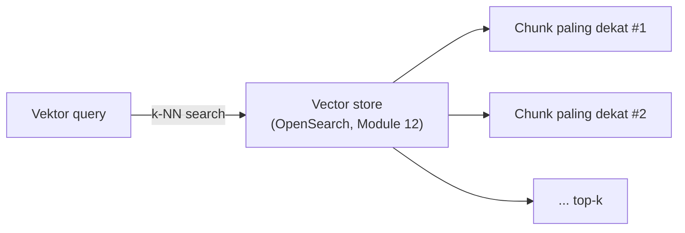

# Module 13: Semantic Search — Metrik Kemiripan & VectorStore

## Tujuan

Membangun **semantic search** sungguhan di atas OpenSearch yang sudah menyala sehat (Module 12): memahami lanskap vector database secara umum supaya keputusan memilih OpenSearch terasa sebagai perbandingan sadar, membahas **secara detail** bagaimana "kemiripan" itu sebenarnya dihitung secara matematis (cosine similarity, Euclidean distance/L2, dot product), lalu menyatukan semuanya jadi class `VectorStore` yang menyambungkan embedding (Module 11) ke OpenSearch (Module 12).

## Definisi

Di balik layar, pencarian semantik dijalankan lewat algoritma **k-NN (k-Nearest Neighbors)** — OpenSearch mencari `k` vektor yang **paling dekat** dengan vektor pertanyaan user, dan itulah dasar teknis di balik `VectorStore.search()` (Bagian 3). "Paling dekat" itu sendiri bisa diukur dengan beberapa metrik matematis berbeda — **cosine similarity**, **Euclidean distance (L2)**, dan **dot product** — dibahas detail di Bagian 2, termasuk kenapa ketiganya ternyata menghasilkan urutan hasil yang identik untuk vektor ternormalisasi seperti keluaran `nomic-embed-text`.



## Hasil Akhir yang Diharapkan

- Kita bisa menyebutkan minimal dua kategori vector database lain selain OpenSearch, dan kapan masing-masing lebih cocok dipakai
- Kita bisa menjelaskan perbedaan cosine similarity, Euclidean distance (L2), dan dot product — termasuk kapan hasilnya identik dan kapan berbeda
- `VectorStore.ensure_index()`, `.index_document()`, dan `.search()` berjalan tanpa error
- Query dengan kata berbeda dari dokumen asli tapi makna serupa tetap menemukan dokumen yang di-index — bukti pencarian semantik, bukan keyword matching
- Kita paham metrik mana yang **benar-benar** dipakai `VectorStore` NALA — **cosine similarity, di-set eksplisit** (bukan default OpenSearch) — dan kenapa pilihan itu tetap valid untuk `nomic-embed-text`
- `/chat/stream` (Module 7) tetap berfungsi seperti sebelumnya

## 1. Macam-Macam Vector Database

Sebelum masuk ke kenapa NALA memilih OpenSearch (Module 12 Bagian 3), penting dulu melihat lanskapnya — OpenSearch **bukan** satu-satunya cara menyimpan dan mencari vektor, dan pilihan ini seharusnya terasa sebagai perbandingan sadar, bukan kebetulan. Secara garis besar, vector database yang beredar hari ini bisa dikelompokkan jadi tiga kategori:

**a. Vector database khusus (purpose-built)** — dibangun dari nol khusus untuk menyimpan dan mencari vektor, tidak punya "identitas lain" sebagai database. Contohnya **Pinecone** (layanan cloud/SaaS, tidak bisa di-hosting sendiri), **Weaviate**, **Milvus**, dan **Qdrant** (ketiganya open-source, bisa di-hosting sendiri), serta **Chroma** (ringan, populer untuk prototyping lokal). Kelebihannya performa pencarian vektor murni biasanya paling cepat, dengan fitur filtering dan indexing yang matang. Kekurangannya: **BM25 (keyword search klasik) bukan fondasi asli kategori ini** — Chroma dan Pinecone (versi lama) memang murni pencarian vektor, tanpa keyword search sama sekali. Beberapa produk yang lebih baru mulai menambahkan kemampuan pencarian kata kunci, tapi caranya beda-beda dan sifatnya "tempelan belakangan", bukan fondasi: Weaviate punya BM25 asli yang bisa digabung jadi hybrid search; Milvus versi baru dan Pinecone menambahkan *sparse vector* (mirip BM25 secara konsep — sama-sama memberi bobot tinggi ke kata jarang/penting — tapi bukan implementasi BM25 klasik yang sama persis); Qdrant baru mendukung sparse vector secara terbatas. Intinya: kapan pun kemampuan itu ada, ia ditambahkan **setelah** fondasi vector search-nya jadi, bukan dibangun bersamaan sejak awal seperti di OpenSearch (kategori c di bawah).

**b. Vector extension pada database yang sudah ada** — menambahkan kemampuan pencarian vektor ke database yang sebelumnya tidak punya fitur itu. Contoh paling umum: **pgvector**, extension untuk PostgreSQL. Kelebihannya jelas: kalau sebuah tim sudah punya PostgreSQL berjalan untuk data operasional (seperti NALA nanti di Module 23), tinggal tambah extension, tidak perlu service baru sama sekali — data relasional dan data vektor hidup di database yang sama. Kekurangannya: performa pencarian vektor pada skala besar biasanya kalah dibanding vector database khusus (kategori a), karena PostgreSQL tidak dirancang dari awal untuk beban kerja ini.

**c. Search engine dengan kemampuan vector search** — awalnya dibangun sebagai mesin pencari **teks/kata kunci** (full-text search, berbasis algoritma BM25), lalu belakangan ditambahi kemampuan k-NN vector search. Contohnya **Elasticsearch** dan **OpenSearch** (turunan open-source dari Elasticsearch, dibahas Module 12). Kelebihan utamanya: satu platform bisa menjalankan **keyword search** dan **vector search** sekaligus, bahkan digabung jadi *hybrid search* — persis yang dibutuhkan NALA mulai Module 18. Kekurangannya: sebagai "spesialis vektor", performa murni pencarian vektor pada skala sangat besar biasanya sedikit di bawah vector database khusus (kategori a).

| Kategori | Contoh | Kelebihan Utama | Trade-off |
|---|---|---|---|
| Vector database khusus | Pinecone, Weaviate, Milvus, Qdrant, Chroma | Performa vector search tercepat, fitur paling matang | Infrastruktur terpisah; BM25/keyword search bukan fondasi asli — kalau ada, sifatnya tempelan belakangan dan beda-beda tiap produk |
| Extension di database yang sudah ada | pgvector (PostgreSQL) | Tidak perlu service baru kalau sudah pakai database itu | Performa vector search skala besar biasanya lebih lambat |
| Search engine + vector search | OpenSearch, Elasticsearch | Satu platform untuk keyword **dan** vector search (hybrid) | Performa vector search murni sedikit di bawah kategori khusus |

**Analogi sederhana — toko buku**: bayangkan tiga toko yang sama-sama bisa membantu Anda menemukan buku, tapi didirikan dengan cara berbeda.

- **Vector database khusus (kategori a)** seperti toko buku yang dari awal dibangun **khusus** untuk merekomendasikan buku berdasarkan "nuansa cerita yang mirip" — misalnya Anda bilang "saya mau yang mirip Harry Potter", tokonya langsung jago menebak. Semua rak, sistem, dan pegawainya dilatih untuk itu. Tapi kalau Anda datang membawa judul persis dan cuma mau tahu ada atau tidak ("Judul: SOP-2024-001"), toko ini bukan yang paling sigap — dia dirancang untuk kemiripan, bukan pencocokan persis.
- **pgvector (kategori b)** seperti rak "buku mirip" kecil yang ditambahkan di **minimarket** yang sudah lama berdiri dan sudah menjual macam-macam kebutuhan lain (data operasional NALA, nanti di Module 23). Praktis — tidak perlu bangun toko baru, tinggal pasang rak — tapi rak itu bukan didesain sejak awal untuk urusan rekomendasi buku, jadi begitu koleksinya makin besar, mencarinya mulai terasa lebih lambat dibanding toko yang memang spesialis.
- **OpenSearch (kategori c)** seperti toko buku yang dari awal **jago mencari lewat katalog/judul persis** (keyword search — "cari judul yang mengandung kata X"), lalu belakangan belajar kemampuan baru: "cariin yang nuansa ceritanya mirip" (vector search). Jadi satu toko, dua cara mencari — bisa dipakai satu-satu atau **digabung sekaligus**. Ini persis yang NALA butuhkan: staff kadang mencari dengan istilah spesifik (nomor SOP, nama dokumen), kadang dengan pertanyaan yang maknanya mirip tapi kata-katanya beda — dan Module 18 nanti menggabungkan keduanya jadi satu pencarian (*hybrid search*).

Tidak ada satu kategori yang "paling benar" secara universal — pilihannya tergantung kebutuhan. NALA jatuh ke kategori (c), dan Module 12 Bagian 3 sudah menjelaskan kenapa itu paling cocok untuk kasus penggunaannya secara spesifik.

## 2. Metrik Kemiripan: Bagaimana "Mirip" Sebenarnya Dihitung

Ini bagian yang sering dilewatkan begitu saja ("pokoknya semantic search"), padahal pemahaman metrik ini penting untuk debugging kualitas retrieval nanti (Module 15, dan Module 18). Ada tiga metrik yang paling umum dipakai untuk mengukur kemiripan/jarak antar vektor embedding:

### a. Cosine Similarity

Mengukur **sudut** antara dua vektor, mengabaikan panjangnya (*magnitude*). Formulanya:

```
cosine_similarity(A, B) = (A · B) / (‖A‖ × ‖B‖)
```

di mana `A · B` adalah dot product (Bagian 2.c), dan `‖A‖`/`‖B‖` adalah panjang (*norm*) masing-masing vektor. Hasilnya berkisar **-1 sampai 1**:

**Cara menghitung `‖V‖` (panjang/norm sebuah vektor)** — rumus Pythagoras yang diperluas ke banyak dimensi:

```
‖V‖ = √(v₁² + v₂² + ... + vₙ²)
```

Kuadratkan tiap angka di dalam vektor, jumlahkan semuanya, lalu akar-kan hasilnya. Kalau divisualisasikan sebagai panah dari titik `(0,0)`, `‖V‖` adalah panjang panah itu. Untuk vektor 768 dimensi (`nomic-embed-text` sungguhan), caranya sama persis — cuma ada 768 suku yang dikuadratkan dan dijumlahkan sebelum di-akar-kan, bukan cuma 2 seperti contoh di Bagian 2.e.

- **1** — kedua vektor mengarah ke arah yang **persis sama** (paling mirip)
- **0** — kedua vektor **tegak lurus** (tidak berhubungan)
- **-1** — kedua vektor mengarah ke arah yang **berlawanan** (paling tidak mirip)

Untuk embedding teks, nilai negatif jarang terjadi — kebanyakan pasangan teks (bahkan yang tidak berhubungan) tetap punya cosine similarity positif kecil, karena model embedding cenderung memetakan semua teks ke area ruang vektor yang serupa.

**Kenapa cosine sering jadi pilihan default untuk embedding teks**: cosine similarity **tidak peduli panjang vektor**, cuma arahnya. Dua kalimat dengan makna sama tapi panjang teks berbeda (misal "kredit ditolak" vs "pengajuan kredit Anda ditolak karena beberapa alasan") bisa saja menghasilkan vektor dengan magnitude berbeda, tapi kalau arahnya mirip, cosine similarity-nya tetap tinggi — pas untuk kasus "makna serupa, panjang teks beda".

### b. Euclidean Distance (L2)

Mengukur **jarak geometris** antar dua titik di ruang vektor — sama seperti rumus jarak yang diajarkan di sekolah, cuma diperluas ke banyak dimensi (768, untuk `nomic-embed-text`). Formulanya:

```
L2(A, B) = √( (a₁-b₁)² + (a₂-b₂)² + ... + (a₇₆₈-b₇₆₈)² )
```

Berbeda dari cosine similarity, **L2 adalah jarak (distance), bukan similarity** — semakin **kecil** nilainya, semakin **mirip** dua vektor itu (kebalikan dari cosine, di mana semakin **besar** semakin mirip). L2 memperhitungkan **kedua** hal: arah **dan** magnitude vektor — dua vektor yang arahnya sama tapi magnitude-nya jauh berbeda akan punya L2 distance yang besar, walau cosine similarity-nya tetap tinggi.

### c. Dot Product

Operasi paling sederhana secara komputasi — perkalian elemen-per-elemen lalu dijumlahkan:

```
dot_product(A, B) = a₁×b₁ + a₂×b₂ + ... + a₇₆₈×b₇₆₈
```

Dot product **memperhitungkan magnitude** (sama seperti L2, beda dengan cosine) — vektor yang lebih "panjang" cenderung menghasilkan dot product lebih besar, terlepas dari seberapa mirip arahnya. Untuk **vektor yang sudah ternormalisasi** (magnitude = 1, dijelaskan Bagian 2.d), dot product **secara matematis identik** dengan cosine similarity — karena pembagi `‖A‖ × ‖B‖` di formula cosine jadi `1 × 1 = 1`, jadi tidak mengubah apa pun.

### d. Vektor Ternormalisasi: Kenapa Ketiga Metrik Bisa "Sama Saja" dalam Praktik

**Vektor ternormalisasi** adalah vektor yang panjangnya (magnitude/norm) sudah diskalakan jadi tepat 1. `nomic-embed-text` menghasilkan vektor yang **sudah (mendekati) ternormalisasi** — ini fakta penting yang mengubah bagaimana ketiga metrik di atas berperilaku dalam praktik:

- **Cosine similarity vs dot product**: untuk vektor ternormalisasi, keduanya **identik secara matematis** (Bagian 2.c) — tidak ada bedanya secara hasil, cuma beda cara hitung (dot product sedikit lebih murah secara komputasi karena tidak perlu menghitung ulang normalisasi).
- **Cosine similarity vs L2 (Euclidean)**: untuk vektor ternormalisasi, **urutan ranking dari keduanya identik** — walau nilai mentahnya beda (satu naik saat mirip, satu turun saat mirip), keduanya jadi fungsi **monoton** dari sudut antar vektor. Secara matematis: `L2(A, B)² = 2 - 2 × cosine_similarity(A, B)` ketika `‖A‖ = ‖B‖ = 1` — semakin tinggi cosine similarity, semakin kecil L2 distance, **selalu**, tanpa pengecualian. Jadi urutan dokumen dari yang paling mirip ke paling tidak mirip **sama persis**, apa pun metriknya dipakai.

**Konsekuensi praktis untuk NALA**: karena `nomic-embed-text` menghasilkan vektor ternormalisasi, secara ranking **tidak masalah** metrik mana yang dipakai OpenSearch — hasil pencarian (urutan dokumen relevan) akan sama saja, entah cosine, L2, atau dot product. Ini pembahasan **konseptual** dulu — ketiga metrik ditimbang di Bagian 2 ini sebelum ada keputusan final apa pun. Keputusan sebenarnya baru diambil di kode `ensure_index()` (Bagian 3): mapping index NALA **menyetel metrik secara eksplisit** ke **cosine similarity** (`space_type: "cosinesimil"`) — bukan dibiarkan memakai default OpenSearch (L2). Karena fakta normalisasi ini, memilih cosine secara eksplisit sama validnya dengan membiarkan default L2 dari sisi hasil ranking — tapi cosine tetap dipilih karena **paling menyampaikan maksud** secara langsung untuk kasus semantic search teks (alasan lengkapnya di Bagian 2.f).

### e. Contoh Kasus: Menghitung Ketiganya pada Data yang Sama

Teori di atas lebih mudah dicerna lewat angka konkret. Vektor `nomic-embed-text` sungguhan berdimensi 768 — mustahil dihitung manual — jadi contoh ini memakai vektor **2 dimensi** sebagai ilustrasi. Matematikanya **persis sama**, cuma dimensinya disederhanakan supaya bisa dihitung di kertas.

**Skenario**: query "kapan cabang buka" dibandingkan dengan dua chunk — satu yang **maknanya mirip** ("jam operasional cabang"), satu yang **maknanya tidak berhubungan** ("syarat pengajuan kredit"). Anggap model embedding (yang belum ternormalisasi) menghasilkan vektor berikut:

| Teks | Vektor | Keterangan |
|---|---|---|
| Query: "kapan cabang buka" | `Q = (1, 0)` | vektor acuan |
| Chunk A: "jam operasional cabang" (mirip makna) | `A = (0.9, 0.1)` | arah hampir sama dengan Q, magnitude **kecil** (~0,91) |
| Chunk B: "syarat pengajuan kredit" (tidak berhubungan) | `B = (5, 5)` | arah 45° dari Q, magnitude **besar** (~7,07) — misalnya karena chunk ini jauh lebih panjang/padat |

Diagram kartesian di bawah ini memplot ketiga vektor itu — perhatikan Q dan A nyaris berimpit arahnya (sudut ≈ 6,3°) walau panjangnya jauh berbeda, sementara B melenceng 45° dari Q meski vektornya paling panjang:


**Langkah 1 — Dot product (belum dinormalisasi):**

```
dot(Q, A) = (1×0.9) + (0×0.1) = 0.9
dot(Q, B) = (1×5)   + (0×5)   = 5.0
```

❌ **Dot product mentah bilang Chunk B (5.0) "lebih mirip" daripada Chunk A (0.9)** — padahal secara makna, Chunk A jelas lebih relevan (arahnya nyaris sama dengan query). Ini persis kelemahan yang dijelaskan Bagian 2.c: dot product ikut terpengaruh magnitude, dan magnitude besar Chunk B (mungkin karena chunk itu lebih panjang) membuatnya menang secara angka walau arahnya jauh berbeda.

**Langkah 2 — Hitung `‖Q‖`, `‖A‖`, `‖B‖` (panjang/norm tiap vektor):**

```
‖Q‖ = √(1² + 0²) = √1     = 1
‖A‖ = √(0.9² + 0.1²) = √0.82 ≈ 0.906
‖B‖ = √(5² + 5²)     = √50   ≈ 7.071
```

Kuadratkan tiap angka di dalam vektor, jumlahkan, lalu akar-kan (rumus Pythagoras yang diperluas — dibahas di Bagian 2.a). Angka-angka inilah yang dipakai sebagai pembagi di Langkah 3.

**Langkah 3 — Cosine similarity (mengabaikan magnitude):**

```
cosine(Q, A) = dot(Q,A) / (‖Q‖×‖A‖) = 0.9 / (1 × 0.906) ≈ 0.994
cosine(Q, B) = dot(Q,B) / (‖Q‖×‖B‖) = 5.0 / (1 × 7.071) ≈ 0.707
```

✅ **Cosine similarity membetulkan urutannya**: Chunk A (0.994) jauh lebih mirip daripada Chunk B (0.707) — sesuai intuisi makna, karena cosine cuma peduli **sudut**, bukan seberapa "panjang" vektornya.

**Langkah 4 — Euclidean distance (L2):**

```
L2(Q, A) = √((1−0.9)² + (0−0.1)²) = √0.02 ≈ 0.141
L2(Q, B) = √((1−5)²   + (0−5)²)   = √41   ≈ 6.403
```

✅ **L2 juga membetulkan urutannya** (jarak lebih kecil = lebih mirip): Chunk A (0.141) jauh lebih dekat ke query dibanding Chunk B (6.403) — sejalan dengan cosine, kontras dengan dot product mentah di Langkah 1.

**Langkah 5 — Sekarang normalisasikan A dan B, ulangi dot product:**

```
A_ternormalisasi = (0.9/0.906, 0.1/0.906) ≈ (0.994, 0.110)
B_ternormalisasi = (5/7.071,   5/7.071)   ≈ (0.707, 0.707)

dot(Q, A_ternormalisasi) = (1×0.994) + (0×0.110) ≈ 0.994
dot(Q, B_ternormalisasi) = (1×0.707) + (0×0.707) ≈ 0.707
```

✅ **Setelah dinormalisasi, dot product menghasilkan angka yang sama persis dengan cosine similarity** (0.994 dan 0.707) — dan urutannya kini benar, cocok dengan L2. Inilah bukti konkret klaim Bagian 2.d: begitu vektornya ternormalisasi, ketiga metrik sepakat, tidak peduli mana yang dipakai OpenSearch di balik layar.

| Metrik | Chunk A (mirip) | Chunk B (tidak mirip) | Urutan benar? |
|---|---|---|---|
| Dot product (belum dinormalisasi) | 0.9 | **5.0** | ❌ Terbalik — B menang cuma karena magnitude besar |
| Cosine similarity | **0.994** | 0.707 | ✅ Benar |
| L2 distance | **0.141** (kecil = mirip) | 6.403 | ✅ Benar |
| Dot product (sudah dinormalisasi) | **0.994** | 0.707 | ✅ Benar — sama persis dengan cosine |

| Metrik | Yang diukur | Peduli magnitude? | Range | Semakin mirip = |
|---|---|---|---|---|
| Cosine Similarity | Sudut antar vektor | Tidak | -1 sampai 1 | Nilai lebih **besar** |
| Euclidean Distance (L2) | Jarak geometris | Ya | 0 sampai ∞ | Nilai lebih **kecil** |
| Dot Product | Perkalian elemen + magnitude | Ya | -∞ sampai ∞ | Nilai lebih **besar** |
| Untuk vektor ternormalisasi | — | — | — | **Ranking identik di ketiganya** |

**f. Jadi, Mana yang Paling Cocok Dipakai?**

Ketiganya menghasilkan ranking identik untuk vektor ternormalisasi seperti `nomic-embed-text` (Bagian 2.d-2.e), tapi itu tidak berarti ketiganya "sama cocoknya" untuk dipilih — masing-masing punya alasan konseptual berbeda kenapa layak/tidak layak jadi pilihan default:

| Metrik | Paling cocok untuk | Kenapa |
|---|---|---|
| **Cosine Similarity** | **Semantic search / RAG teks** (pilihan NALA) | Murni mengukur **makna** (sudut), mengabaikan magnitude yang sebagian besar cuma artefak panjang kalimat — bukan sinyal relevansi. Paling **menyampaikan maksud** secara langsung untuk kasus embedding teks. |
| **Euclidean Distance (L2)** | Data numerik/spasial (koordinat, sensor, fitur hasil scaling) — **bukan teks** | Cocok kalau magnitude vektor memang membawa informasi penting. Untuk embedding teks, aman dipakai hanya karena vektornya kebetulan ternormalisasi, bukan karena secara konsep paling pas. |
| **Dot Product** | Optimisasi performa pada skala besar (jutaan vektor), dengan syarat vektor sudah ternormalisasi | Operasi paling murah secara komputasi (tanpa pembagian/akar). Bukan dipilih karena "cocok secara konsep", tapi karena **matematis identik** dengan cosine setelah normalisasi — jadi hasilnya sama, hitungannya lebih cepat. |

**Kesimpulan untuk NALA**: cosine similarity adalah pilihan paling tepat secara konsep (sesuai keputusan eksplisit di `space_type: "cosinesimil"` pada Bagian 3), dot product adalah alternatif yang secara matematis setara dan lebih cepat kalau suatu saat skalanya membesar, sementara L2 tetap aman dipakai tapi bukan pilihan yang paling langsung menyampaikan maksud "mengukur makna".

**g. Konfigurasi Praktis: Cara Mengaktifkan Tiap Metrik di Mapping OpenSearch**

Ketiga metrik di atas bukan cuma teori — di OpenSearch, memilih salah satunya semudah mengganti **satu nilai** (`space_type`) di dalam `method` pada mapping index (field `embedding`, dibahas lengkap di Bagian 3). Untuk `engine: "nmslib"` yang dipakai NALA, tiga nilai `space_type` ini yang berpadanan langsung dengan tiga metrik yang sudah dibahas:

| Metrik | Nilai `space_type` | Kapan dipakai |
|---|---|---|
| Cosine Similarity | `"cosinesimil"` | **Pilihan NALA** — lihat Bagian 3 |
| Euclidean Distance (L2) | `"l2"` | Data numerik/spasial, bukan embedding teks (Bagian 2.f) |
| Dot Product | `"innerproduct"` | Optimisasi performa skala besar, vektor sudah ternormalisasi (Bagian 2.f) |

Perhatikan: cuma nilai `"method.space_type"` yang berbeda — struktur mapping selebihnya (nama field, `"type": "knn_vector"`, `"dimension"`, `"engine"`, `"name": "hnsw"`) **persis sama** di ketiganya. Berikut tiga versi mapping index `nala-docs`, berdampingan supaya perbedaannya jelas:

**Cosine Similarity** (yang sebenarnya dipakai NALA, lihat Bagian 3):
```json
"embedding": {
  "type": "knn_vector",
  "dimension": 768,
  "method": { "engine": "nmslib", "space_type": "cosinesimil", "name": "hnsw" }
}
```

**Euclidean Distance / L2** (seandainya dipilih — bukan yang dipakai NALA):
```json
"embedding": {
  "type": "knn_vector",
  "dimension": 768,
  "method": { "engine": "nmslib", "space_type": "l2", "name": "hnsw" }
}
```

**Dot Product / Inner Product** (seandainya dipilih — bukan yang dipakai NALA):
```json
"embedding": {
  "type": "knn_vector",
  "dimension": 768,
  "method": { "engine": "nmslib", "space_type": "innerproduct", "name": "hnsw" }
}
```

**Cara mencobanya sendiri** (opsional, tidak wajib untuk lanjut ke Bagian 3) — di Dev Tools (Module 12 Bagian 4 Langkah 3), buat index percobaan dengan nama berbeda supaya tidak bentrok dengan `nala-docs`, misal `PUT nala-docs-test-l2` memakai mapping L2 di atas, lalu ulangi Langkah 3.b-d (index satu dokumen, cari lagi) — untuk `nomic-embed-text` yang sudah ternormalisasi, urutan hasilnya akan **identik** dengan `nala-docs` (cosine), persis seperti yang dibuktikan di Bagian 2.d-2.e, cuma nilai skor mentahnya yang tampil beda.

⚠️ **Satu hal yang perlu diingat**: `space_type` sebuah index **tidak bisa diubah setelah index dibuat** — mengubah field ini di mapping yang sudah ada tidak akan berpengaruh pada index yang sudah berjalan (dibahas lagi di catatan Bagian 3). Kalau suatu saat perlu ganti metrik untuk index yang sudah terisi data, satu-satunya cara adalah hapus index (`DELETE /{index}`) dan buat ulang dari awal dengan `space_type` baru, lalu index ulang semua dokumennya.

## 3. Struktur Kode yang Ditambahkan: `app/vector_store.py`

**Prasyarat**: OpenSearch sudah menyala sehat (Module 12) — `docker compose logs opensearch` menunjukkan cluster health `green`/`yellow`, dan `OPENSEARCH_BASE_URL` sudah ada di `environment:` service `api`.

```python
# app/vector_store.py
from urllib.parse import quote

import httpx


class VectorStore:
    def __init__(self, base_url: str, index_name: str):
        self.base_url = base_url
        self.index_name = index_name

    def ensure_index(self, dims: int = 768) -> None:
        with httpx.Client() as client:
            check = client.head(f"{self.base_url}/{self.index_name}", timeout=10.0)
            if check.status_code == 200:
                return
            response = client.put(
                f"{self.base_url}/{self.index_name}",
                json={
                    "settings": {"index": {"knn": True}},
                    "mappings": {
                        "properties": {
                            "text": {"type": "text"},
                            "embedding": {
                                "type": "knn_vector",
                                "dimension": dims,
                                "method": {
                                    "engine": "nmslib",
                                    "space_type": "cosinesimil",
                                    "name": "hnsw",
                                },
                            },
                            "metadata": {"type": "object"},
                        }
                    },
                },
                timeout=30.0,
            )
            response.raise_for_status()

    def index_document(
        self, doc_id: str, text: str, embedding: list[float], metadata: dict
    ) -> None:
        with httpx.Client() as client:
            response = client.put(
                f"{self.base_url}/{self.index_name}/_doc/{quote(doc_id, safe='')}",
                json={"text": text, "embedding": embedding, "metadata": metadata},
                params={"refresh": "true"},
                timeout=30.0,
            )
            response.raise_for_status()

    def search(self, query_embedding: list[float], top_k: int = 3) -> list[dict]:
        with httpx.Client() as client:
            response = client.post(
                f"{self.base_url}/{self.index_name}/_search",
                json={
                    "size": top_k,
                    "query": {
                        "knn": {"embedding": {"vector": query_embedding, "k": top_k}}
                    },
                },
                timeout=30.0,
            )
            response.raise_for_status()
            hits = response.json()["hits"]["hits"]
            return [
                {
                    "text": hit["_source"]["text"],
                    "score": hit["_score"],
                    "metadata": hit["_source"]["metadata"],
                }
                for hit in hits
            ]
```

- **`ensure_index()`**: `client.head(...)` mengecek index sudah ada (status `200`) sebelum mencoba membuatnya — mencegah error kalau dipanggil berulang kali. Mapping `"embedding": {"type": "knn_vector", "dimension": dims, "method": {...}}` memberi tahu OpenSearch bahwa field ini vektor 768-dimensi yang bisa dicari lewat k-NN, bukan field teks biasa. **Perhatikan**: `space_type` di-set **eksplisit ke `"cosinesimil"`** (bukan dibiarkan default L2) — `engine: "nmslib"` dan `name: "hnsw"` memilih struktur pencarian HNSW yang sudah dibahas di Module 12 Bagian 2. Untuk `nomic-embed-text`, hasil ranking-nya identik dengan default L2 (Bagian 2.d menunjukkan kenapa — vektornya sudah ternormalisasi), tapi memilih cosine secara eksplisit di sini membuat maksud kode lebih jelas dibaca dan tetap benar seandainya suatu saat model embedding diganti ke yang outputnya **tidak** ternormalisasi.
- **`index_document()`**: menyimpan satu chunk. `params={"refresh": "true"}` **wajib** — tanpa ini, dokumen yang baru ditulis baru bisa dicari lewat `search()` setelah *refresh interval* berikutnya (default ~1 detik), bukan seketika. Kalau `index_document()` dan `search()` dipanggil berurutan cepat (persis seperti checkpoint di bawah), tanpa `refresh: true` hasilnya bisa `[]` kosong padahal dokumennya **sudah** tersimpan.
- **`search()`**: `"knn": {"embedding": {"vector": query_embedding, "k": top_k}}` adalah query k-NN bawaan OpenSearch — mencari `top_k` dokumen dengan `embedding` paling dekat ke `query_embedding`, memakai metrik cosine similarity (sesuai `space_type` di mapping) di balik layar.
- **Kalau index sudah pernah dibuat sebelum perubahan ini**: mengubah `space_type` di mapping **tidak** memperbarui index yang sudah ada — OpenSearch tidak bisa mengubah `method` sebuah field `knn_vector` in-place. Index lama harus dihapus (`DELETE /{index_name}`) lalu dibuat ulang lewat `ensure_index()`, dan semua dokumen di-index ulang.
- Tidak ada satu pun class/fungsi di sini yang tahu soal chunking atau Ollama — `VectorStore` murni tentang menyimpan dan mencari vektor, generik terhadap dari mana vektornya berasal.

**▶️ Jalankan & lihat hasilnya**

```bash
docker compose exec api python -c "
from app.embeddings import embed_text
from app.vector_store import VectorStore

store = VectorStore(base_url='http://opensearch:9200', index_name='nala-docs')
store.ensure_index()

vec = embed_text('Kantor cabang Surabaya buka Senin-Jumat', base_url='http://ollama:11434')
store.index_document(doc_id='test-1', text='Kantor cabang Surabaya buka Senin-Jumat', embedding=vec, metadata={'source': 'test'})

query_vec = embed_text('kapan cabang Surabaya beroperasi', base_url='http://ollama:11434')
results = store.search(query_vec, top_k=3)
print(results)
"
```

✅ **Indikator sukses**: tidak ada error, dan `results` menampilkan list berisi minimal satu dict dengan `text` yang sama dengan yang baru di-index, muncul **seketika** (bukan kosong `[]`) berkat `params={"refresh": "true"}` di `index_document()` — membuktikan pencarian semantik bekerja walau kata-kata query ("kapan", "beroperasi") berbeda dari kata-kata dokumen ("buka"), memakai metrik cosine similarity yang di-set eksplisit (Bagian 3).

<details>
<summary><strong>Pakai Claude Code? Salin prompt berikut, paste untuk eksekusi Bagian 3</strong></summary>

```
Buat app/vector_store.py dengan class VectorStore (Module 13).

GOAL:
- Buat Nala/app/vector_store.py berisi
  class VectorStore(base_url, index_name) dengan 3 method:
  ensure_index(dims=768) (HEAD cek index ada, kalau belum PUT index
  baru dengan mapping knn_vector dimension=dims), index_document
  (doc_id, text, embedding, metadata) (PUT ke
  {index_name}/_doc/{doc_id yang di-quote}, WAJIB kirim
  params={"refresh": "true"}), dan search(query_embedding, top_k=3)
  (POST query knn ke {index_name}/_search, return list of {text,
  score, metadata} dari hits.hits).

CONTEXT:
- Service opensearch dan env var OPENSEARCH_BASE_URL sudah
  ditambahkan ke docker-compose.yml di Module 12.
- app/embeddings.py (embed_text) sudah ada dari Module 11.
- Pakai httpx (bukan opensearch-py) — konsisten dengan seluruh
  codebase NALA.

GUARDRAIL:
- JANGAN tambah opensearch-py atau library client OpenSearch lain ke
  requirements.txt — semua akses OpenSearch lewat httpx langsung.
- JANGAN ubah app/main.py, app/ingest.py, docker-compose.yml, atau
  file lain.
- JANGAN tambah service airflow — itu baru masuk Module 17.
```

</details>

## 4. Checkpoint Praktik

Yang perlu dipastikan sebelum lanjut ke Module 15:

- [ ] Kita bisa menyebutkan tiga kategori vector database (khusus, extension database, search engine) dan di kategori mana OpenSearch berada
- [ ] Kita bisa menjelaskan bedanya cosine similarity, L2, dan dot product — dan kenapa ketiganya jadi "sama saja" untuk vektor ternormalisasi
- [ ] Kita bisa menelusuri contoh kasus Bagian 2.e dan menjelaskan kenapa dot product mentah bisa salah ranking, tapi cosine/L2/dot-product-setelah-normalisasi selalu benar
- [ ] `VectorStore.ensure_index()`, `.index_document()`, `.search()` berjalan tanpa error
- [ ] Query dengan kata berbeda dari dokumen asli (tapi makna serupa) tetap menemukan dokumen yang di-index
- [ ] `/chat/stream` (Module 7) masih berfungsi seperti sebelumnya

Begitu keenam hal ini terverifikasi, lanjut ke Module 15 — menyatukan `extract_text()` (Module 10), embedding (Module 11), dan vector store (Module 12-13) jadi satu fungsi `ingest_documents()` versi pertama (satu dokumen = satu vektor, belum ada chunking), memakai data seed untuk mengisi index untuk pertama kali, lalu **menyambungkan retrieval ke `/chat/stream`** — titik di mana RAG benar-benar "hidup" untuk pertama kalinya.
