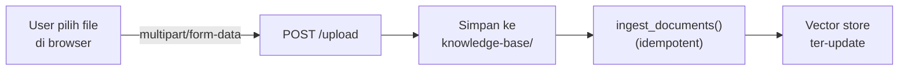
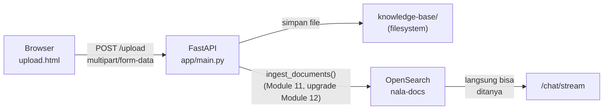

# Module 13: Upload Dokumen — Menambah Data ke Sistem yang Sudah Hidup

## Tujuan

Membangun halaman "Knowledge Base" (`GET /upload` dan `POST /upload`) supaya staff bisa menambahkan dokumen SOP ke NALA lewat web, tanpa akses server dan tanpa perlu memanggil `ingest_documents()` manual dari terminal seperti di Module 11-12. Karena pipeline ingest (chunking → embedding → vector store) **sudah ada dan sudah terbukti bekerja level-chunk** sejak Module 12, upload di sini langsung tersambung ke `ingest_documents()` — tidak ada lagi jeda "simpan dulu, proses belakangan".

## Definisi

**Upload pipeline** adalah alur end-to-end dari file yang dipilih user di browser sampai file itu tersimpan **dan** ter-index, seluruhnya dalam satu request HTTP — bukan dua langkah terpisah (simpan dulu, proses belakangan). File dikirim dari form HTML memakai format **`multipart/form-data`** — format pengiriman data HTTP yang berbeda dari JSON biasa yang dipakai `/chat/stream`, dan memang dirancang khusus untuk mengirim file (dibahas Bagian 2 Langkah 7).

Setiap kali upload terjadi, seluruh folder knowledge base di-scan dan di-ingest ulang, bukan cuma file yang baru — ini aman karena `ingest_documents()` bersifat **idempotent**: hasil akhirnya tetap sama walau dijalankan berkali-kali dengan input yang sama, karena `doc_id`-nya deterministik (dijelaskan Module 11 Bagian 1). Penting dipahami di sini karena upload sebenarnya memicu ulang seluruh proses ingest, bukan cuma memproses dokumen yang baru diunggah.



## Hasil Akhir yang Diharapkan

- `http://localhost:8000/upload` menampilkan form upload dan daftar dokumen yang sudah ada (termasuk data seed dari Module 8)
- Link "Knowledge Base" dari halaman chat berfungsi menuju halaman ini
- Upload file `.md`/`.pdf` langsung **tersimpan dan ter-index** (level-chunk) — pesan konfirmasi menyebut jumlah chunk, bukan cuma "tersimpan"
- Dokumen yang baru diupload **langsung bisa ditanyakan** ke `/chat/stream` tanpa restart apa pun — bukti pipeline upload → index → retrieve end-to-end
- `/chat/stream` (Module 5, 6, 11, 12) tetap berfungsi seperti sebelumnya

## 1. Kenapa Sekarang, Bukan Modul Pertama

Draft awal Module 5-14 membangun halaman upload ini sebagai Module 8 — pintu masuk dokumen paling awal, sengaja dibuat "cuma menyimpan file" karena pipeline pemrosesannya belum ada sama sekali. Urutan itu diubah (lihat Module 8 Bagian 1): kita bangun dulu mesin RAG-nya sampai benar-benar bekerja (Module 8-11 tanpa chunking, lalu Module 12 menambahkan chunking) memakai data seed, **baru** sekarang menambahkan cara staff menambah dokumen sendiri.

Konsekuensinya: **tidak ada lagi alasan menunda pemrosesan**. `ingest_documents()` sudah ada sejak Module 11 Bagian 1 dan sudah di-upgrade ke level-chunk di Module 12 Bagian 8 — jadi endpoint upload di module ini bisa langsung memanggilnya, tanpa dua-tahap seperti rencana awal.

Dalam operasional NALA, staff sering perlu menambahkan dokumen baru ke knowledge base tanpa menunggu jadwal pipeline Airflow (Module 14). Contoh kasus:
- Head of Legal ingin update SOP Pengajuan Kredit karena ada perubahan regulasi baru, dan ingin perubahan itu langsung tersedia untuk NALA menjawab pertanyaan staff lain.
- Product Manager ingin menambahkan dokumentasi promo baru yang tiba-tiba harus diluncurkan besok pagi.



## 2. Struktur Kode yang Ditambahkan

Dua Tahap: **Tahap A** — halaman upload (`upload.html`), belum terhubung ke FastAPI. **Tahap B** — hubungkan ke FastAPI, langsung panggil `ingest_documents()` versi chunking (Module 12).

### Tahap A — Buat halaman upload dulu (belum terhubung ke FastAPI)

**Langkah 1 — Buat `app/templates/upload.html`**

```html
<!-- app/templates/upload.html -->
<!DOCTYPE html>
<html lang="id">
<head>
    <meta charset="UTF-8">
    <title>NALA — Knowledge Base</title>
    <link rel="stylesheet" href="/static/style.css">
</head>
<body>
    <div class="container">
        <h1>Knowledge Base</h1>
        <nav><a href="/">Chat</a> | <a href="/upload">Knowledge Base</a></nav>
        
        <p class="success">{{ message }}</p>
        
        <form action="/upload" method="post" enctype="multipart/form-data">
            <input type="file" name="file" accept=".md,.txt,.pdf" required>
            <button type="submit">Upload</button>
        </form>
        <p class="hint">Format yang didukung: .md, .txt, .pdf</p>
        <h2>Dokumen di Knowledge Base</h2>
        
        <ul class="doc-list">
            
            <li>{{ doc }}</li>
            
        </ul>
        
        <p class="hint">Belum ada dokumen di knowledge base.</p>
        
    </div>
</body>
</html>
```

Berbeda dengan `chat.html`, `upload.html` **tidak memakai JavaScript sama sekali** — form HTML biasa yang submit langsung ke server (server-side POST, full page reload). Perhatikan:

- **`...`**: sintaks Jinja2 — blok ini cuma tampil kalau variabel `message` dikirim dan tidak kosong.
- **`enctype="multipart/form-data"`**: wajib ada di `<form>` supaya browser mengirim file sebagai `multipart/form-data` — format yang dibutuhkan FastAPI untuk membaca `UploadFile`.
- **``**: sintaks perulangan Jinja2, merender satu `<li>` per nama file dalam list `documents`.

Tambahkan juga class CSS baru di `app/static/style.css`:

```css
/* app/static/style.css, tambahan di akhir file */
.success {
    background: #e7f5e9;
    padding: 10px;
    border-radius: 6px;
}

.hint {
    color: #666;
    font-size: 0.9em;
}

.doc-list {
    padding-left: 20px;
}

.doc-list li {
    margin-bottom: 4px;
}
```

**▶️ Jalankan & lihat hasilnya**

```
file:///path/ke/resources/starter-code/day-2/nala/app/templates/upload.html
```

✅ **Indikator sukses**: struktur halaman (judul, input file, tombol "Upload") tampil, tapi styling tidak muncul benar dan submit form belum berfungsi (tidak ada server di `file://`). Ini **normal** — sambungan sungguhannya di Tahap B.

<details>
<summary><strong>Pakai Claude Code? Salin prompt berikut, paste untuk eksekusi Langkah 1</strong></summary>

```
Buat halaman upload dokumen NALA (Module 13, Tahap A) — upload.html,
belum terhubung ke FastAPI.

GOAL:
- Buat resources/starter-code/day-2/nala/app/templates/upload.html:
  form HTML biasa (method="post", action="/upload",
  enctype="multipart/form-data") dengan satu <input type="file"
  name="file" accept=".md,.txt,.pdf" required> dan tombol submit, nav
  link ke "/" (Chat) dan "/upload" (Knowledge Base), blok Jinja2
  ... untuk pesan konfirmasi, dan blok
  ...<li>{{ doc }}</li>
  ...... untuk daftar dokumen.
  TIDAK ADA JavaScript di file ini.
- Tambah class CSS baru di akhir
  resources/starter-code/day-2/nala/app/static/style.css: .success,
  .hint, .doc-list, .doc-list li.

CONTEXT:
- File referensi struktur (BUKAN untuk disalin isinya): app/templates/chat.html
  dan app/static/style.css di folder yang sama, dari Module 5.

GUARDRAIL:
- JANGAN sentuh app/main.py atau app/templates/chat.html — itu Tahap B.
- JANGAN tambah JavaScript apa pun ke upload.html.
- JANGAN tambah endpoint atau logika upload sungguhan — file ini murni
  HTML statis di titik ini.
```

</details>

### Tahap B — Hubungkan: dependency, docker-compose, dan endpoint (langsung ter-index sebagai chunk)

**Langkah 2 — Tambah volume `knowledge-base` di `docker-compose.yml`**

`/upload` butuh tempat menyimpan file di **luar** container (supaya tidak hilang saat container di-rebuild). Ini sudah ada sejak Module 8 (`KNOWLEDGE_BASE_PATH`, bind mount ke `resources/sample-knowledge-base/`) — tidak ada perubahan `docker-compose.yml` di langkah ini.

**Langkah 3 — Tambah dependency `python-multipart`**

FastAPI butuh library ini untuk mem-parsing `multipart/form-data` — walau tidak pernah diimpor langsung, FastAPI memakainya secara internal begitu ada parameter `UploadFile`.

```
python-multipart==0.0.12
```

Tambahkan sebagai baris baru di akhir `requirements.txt`.

**Langkah 4 — Tambah import dan fungsi `list_knowledge_base_documents()` di `app/main.py`**

```python
# app/main.py
from fastapi import FastAPI, File, HTTPException, Request, UploadFile
```

```python
# app/main.py, di dekat KNOWLEDGE_BASE_PATH yang sudah ada
def list_knowledge_base_documents() -> list[str]:
    if not os.path.isdir(KNOWLEDGE_BASE_PATH):
        return []
    return sorted(
        f for f in os.listdir(KNOWLEDGE_BASE_PATH)
        if f.endswith((".md", ".txt", ".pdf"))
    )
```

- **`File`**: dipakai bersama `UploadFile` sebagai default value parameter (`file: UploadFile = File(...)`) — memberi tahu FastAPI parameter ini datang dari bagian file di `multipart/form-data`.
- **`list_knowledge_base_documents()`**: fungsi kecil terpisah supaya logika "ambil daftar file" tidak ditulis dua kali (sekali untuk `GET`, sekali untuk `POST`). Ini tetap daftar **nama dokumen**, bukan daftar chunk — chunking terjadi di belakang layar saat `ingest_documents()` dipanggil, tidak terlihat di UI ini.
- **`os.path.isdir(...)` guard**: jaga-jaga kalau `KNOWLEDGE_BASE_PATH` belum pernah ada isinya — `os.listdir()` akan melempar `FileNotFoundError` kalau dipanggil ke folder yang tidak ada.

**Langkah 5 — Tambah endpoint `GET`/`POST /upload`, langsung panggil `ingest_documents()` versi chunking**

```python
# app/main.py
@app.get("/upload", response_class=HTMLResponse)
def upload_page(request: Request):
    return templates.TemplateResponse(
        "upload.html",
        {"request": request, "message": None, "documents": list_knowledge_base_documents()},
    )


@app.post("/upload", response_class=HTMLResponse)
def upload_document(request: Request, file: UploadFile = File(...)):
    os.makedirs(KNOWLEDGE_BASE_PATH, exist_ok=True)
    dest_path = os.path.join(KNOWLEDGE_BASE_PATH, file.filename)
    with open(dest_path, "wb") as f:
        f.write(file.file.read())

    try:
        count = ingest_documents(KNOWLEDGE_BASE_PATH)
        message = f"Dokumen '{file.filename}' berhasil diunggah dan di-index ({count} chunk total di knowledge base)."
    except httpx.HTTPError:
        message = (
            f"Dokumen '{file.filename}' berhasil disimpan, tapi belum sempat di-index "
            "(OpenSearch belum terjangkau) — akan otomatis diproses begitu pipeline-nya berjalan."
        )
    return templates.TemplateResponse(
        "upload.html",
        {"request": request, "message": message, "documents": list_knowledge_base_documents()},
    )
```

Butuh tambahan import di baris atas `app/main.py` (kalau belum ada dari Module 11):

```python
# app/main.py
import httpx
from app.ingest import ingest_documents
```

- **`GET /upload`**: merender form kosong (`message: None`) plus daftar dokumen yang sudah ada — dipanggil saat user pertama kali membuka `/upload`.
- **`POST /upload`**: `os.makedirs`/`open(...).write()` menyimpan file **apa adanya**. Disusul `ingest_documents(KNOWLEDGE_BASE_PATH)` di dalam `try/except` — fungsi ini **sekarang** memecah dokumen jadi chunk dulu (Module 12), jadi pesan konfirmasi menyebut jumlah **chunk**, bukan jumlah dokumen. Kalau berhasil, pesan menyebut jumlah chunk yang ter-index; kalau `httpx.HTTPError` (OpenSearch tidak terjangkau), pesan tetap ramah — file tetap tersimpan, bukan error 500.
- **`ingest_documents()` yang dipanggil di sini** fungsi yang **sama persis** yang dipanggil manual dari terminal di Module 11 Bagian 1 (lalu di-upgrade Module 12 Bagian 8) — tidak ada logika baru di `main.py`, cuma dipicu dari endpoint web alih-alih CLI. Karena scan ulang seluruh folder (bukan cuma file baru), dokumen lama yang sudah ada juga ikut ter-chunk-dan-embed ulang — konsisten dengan catatan idempotency di Module 11 Bagian 1 (lihat juga Definisi di atas).

**▶️ Jalankan & lihat hasilnya**

```bash
docker compose up --build api
```

```bash
echo "Kantor cabang NALA di Bandung buka setiap hari Selasa sampai Sabtu, pukul 09.00 sampai 17.00 WIB." > catatan-cabang-bandung.md

curl -X POST http://localhost:8000/upload -F "file=@catatan-cabang-bandung.md"

curl -N -X POST http://localhost:8000/chat/stream \
  -H "Content-Type: application/json" \
  -d '{"messages": [{"role": "user", "content": "Kapan kantor cabang Bandung buka?"}]}'
```

✅ **Indikator sukses**: halaman menampilkan pesan **"berhasil diunggah dan di-index (N chunk...)"**, nama filenya langsung muncul di daftar dokumen, dan `/chat/stream` langsung bisa menjawab dari dokumen yang baru diupload **tanpa** `docker compose restart` apa pun di antaranya — buktinya pipeline upload → chunking → embedding → index → retrieve benar-benar tersambung end-to-end.

Coba juga link "Knowledge Base" di halaman chat (`http://localhost:8000`) — harus berpindah ke `/upload`. Ganti `<nav><a href="/">Chat</a></nav>` di `chat.html` jadi `<nav><a href="/">Chat</a> | <a href="/upload">Knowledge Base</a></nav>` kalau belum ada.

<details>
<summary><strong>Pakai Claude Code? Salin prompt berikut, paste untuk eksekusi Langkah 2-5</strong></summary>

```
Hubungkan upload.html ke FastAPI — endpoint GET/POST /upload yang
langsung memanggil ingest_documents() versi chunking (Module 13,
Tahap B).

GOAL:
- Di resources/starter-code/day-2/nala/requirements.txt: tambah baris
  `python-multipart==0.0.12` di akhir file.
- Di resources/starter-code/day-2/nala/app/main.py:
  - Tambah import File, UploadFile dari fastapi (gabungkan dengan
    import yang sudah ada, jangan duplikat).
  - Tambah `import httpx` dan `from app.ingest import
    ingest_documents` kalau belum ada dari Module 11.
  - Tambah fungsi list_knowledge_base_documents() -> list[str]: return
    [] kalau KNOWLEDGE_BASE_PATH bukan folder yang ada, selain itu
    return sorted(...) daftar nama file di KNOWLEDGE_BASE_PATH yang
    berakhiran .md/.txt/.pdf.
  - Tambah endpoint @app.get("/upload") yang render upload.html dengan
    message=None dan documents=list_knowledge_base_documents(), dan
    @app.post("/upload") yang terima file: UploadFile = File(...),
    simpan ke KNOWLEDGE_BASE_PATH/file.filename (bikin folder dulu
    dengan os.makedirs exist_ok=True), lalu try: panggil count =
    ingest_documents(KNOWLEDGE_BASE_PATH), set message dengan jumlah
    chunk; except httpx.HTTPError: set message fallback. Render ulang
    upload.html dengan message dan documents yang baru.
- Di resources/starter-code/day-2/nala/app/templates/chat.html: ganti
  <nav><a href="/">Chat</a></nav> jadi <nav><a href="/">Chat</a> |
  <a href="/upload">Knowledge Base</a></nav> kalau belum ada.

CONTEXT:
- upload.html sudah ada dari Tahap A.
- ingest_documents() sudah ada dari Module 11, sudah di-upgrade untuk
  chunking di Module 12 — panggil langsung, jangan tulis ulang
  logikanya.

GUARDRAIL:
- JANGAN ubah endpoint /chat/stream, /health, atau / (GET).
- JANGAN tambah logika chunking/embedding/vector search baru di
  main.py — semua itu sudah ada di app/ingest.py, tinggal panggil
  ingest_documents().
```

</details>

## 3. Checkpoint Praktik

Yang perlu dipastikan sebelum lanjut ke Module 14:

- [ ] `http://localhost:8000/upload` menampilkan form upload dan daftar dokumen yang sudah ada
- [ ] Link "Knowledge Base" di halaman chat berfungsi
- [ ] Upload file `.md`/`.pdf` menampilkan pesan "berhasil diunggah dan di-index (N chunk...)"
- [ ] Dokumen yang baru diupload langsung muncul di daftar tanpa refresh manual kedua kalinya
- [ ] Dokumen yang baru diupload **langsung bisa ditanyakan** ke `/chat/stream` tanpa restart apa pun
- [ ] `/chat/stream` (Module 5, 6, 11, 12) masih berfungsi seperti sebelumnya

Begitu keenam hal ini terverifikasi, lanjut ke Module 14 — Airflow, cara **lain** memicu `ingest_documents()` yang sama, cocok untuk skenario batch/terjadwal yang tidak dicakup form upload satu-file ini.

## Panduan Praktik

### Prasyarat
- Sudah menyelesaikan **Module 12** (Chunking) — `ingest_documents()` sudah level-chunk

### Langkah 1: Upload dokumen baru lewat halaman `/upload`

Buka `http://localhost:8000/upload` di browser. Halaman ini punya form upload dengan input file yang membatasi tipe ke `.md`, `.txt`, atau `.pdf` (lihat `accept=".md,.txt,.pdf"` di `app/templates/upload.html`).

1. Siapkan file teks singkat baru (misalnya `catatan-test.md`) berisi satu-dua kalimat — contoh: "Kantor cabang NALA di Surabaya buka setiap hari Senin sampai Jumat pukul 08.00-16.00." Atau pakai salah satu dari 10 dokumen PDF latihan di `resources/sample-knowledge-base/`.
2. Upload file tersebut lewat form.
3. Halaman akan menampilkan pesan **"berhasil diunggah dan di-index (N chunk...)"** — `ingest_documents()` (sudah ada sejak Module 11, sudah di-upgrade untuk chunking di Module 12) langsung dipanggil, tidak ada jeda "simpan dulu proses belakangan". Lihat Bagian 1 di atas untuk penjelasan lengkap.
4. Cek file benar-benar tersimpan — dua cara, pilih salah satu:
   - Di dalam container: `docker compose exec api ls -la /app/knowledge-base`
   - Langsung di laptop Anda (tanpa masuk container): `ls resources/sample-knowledge-base/` — folder ini adalah bind mount yang sama persis dengan `/app/knowledge-base` di container, jadi isinya selalu identik.

   Nama file yang Anda upload harus muncul di kedua tempat itu.
5. Halaman `/upload` juga menampilkan **daftar dokumen di knowledge base** — dokumen contoh yang sudah ada sejak awal (termasuk 10 PDF latihan) harus langsung terlihat begitu halaman dibuka, dan dokumen yang baru Anda upload harus langsung muncul di daftar itu setelah halaman reload, tanpa perlu refresh manual kedua kalinya.
6. Coba tanyakan isi dokumen yang baru diupload ke `/chat/stream`, misalnya "Kapan kantor cabang Surabaya buka?" — NALA harus bisa menjawab **tanpa restart apa pun**, membuktikan pipeline upload → chunking → index → retrieve berjalan end-to-end:

```bash
curl -N -X POST http://localhost:8000/chat/stream \
  -H "Content-Type: application/json" \
  -d '{"messages": [{"role": "user", "content": "Kapan kantor cabang Surabaya buka?"}]}'
```
