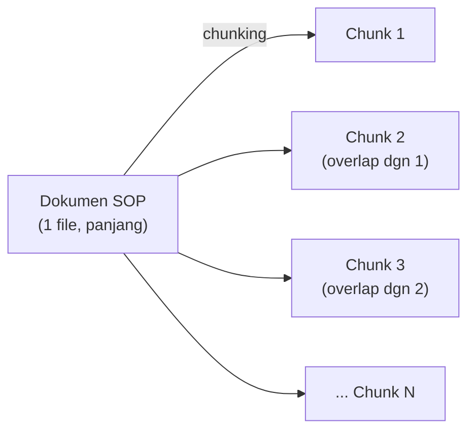
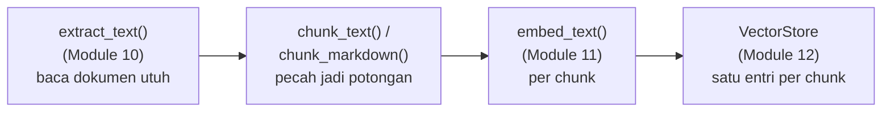

# Module 14: Chunking — Dari Level-Dokumen ke Level-Chunk

## Tujuan

Menambahkan **chunking** — memecah dokumen jadi potongan-potongan kecil sebelum di-embed — dan meng-upgrade `ingest_documents()` (Module 13) dari "satu dokumen = satu vektor" jadi "satu chunk = satu vektor". Module ini murni tentang mesin RAG-nya sendiri (`app/ingest.py`, `app/main.py`) — belum menyentuh cara staff menambah dokumen baru, itu baru Module 15 (Upload).

## Definisi

**Chunk** adalah satu potongan kecil dari sebuah dokumen — beberapa kalimat atau satu bagian SOP, bukan seluruh dokumen sekaligus. Kalau `sop-pengajuan-kredit.md` dipecah jadi 13 chunk, artinya ada 13 potongan teks terpisah, dan masing-masing di-embed serta disimpan sebagai entri sendiri di vector store. Proses memecah dokumen jadi chunk-chunk seperti ini disebut **chunking**, dan module ini membahas dua strategi untuk melakukannya: *fixed-size* — memotong berdasarkan jumlah karakter tetap tanpa peduli struktur dokumen (Bagian 3) — dan *structure-aware* — memotong mengikuti struktur dokumen, di sini heading Markdown, supaya tiap chunk tetap jadi satu unit makna yang utuh (Bagian 4).

Supaya kalimat penting tidak terputus persis di batas antar potongan, dipakai **overlap** — sejumlah karakter yang sengaja diulang di awal chunk berikutnya dari akhir chunk sebelumnya, memastikan konteks di garis sambung dua chunk tetap tersambung (Bagian 3).



## Hasil Akhir yang Diharapkan

- `chunk_text()` pada teks 1200 karakter menghasilkan 3 chunk berukuran `[500, 500, 300]` sesuai parameter `chunk_size=500`/`overlap=50`
- Teks lebih pendek dari `chunk_size` menghasilkan tepat 1 chunk, dan chunk berurutan terbukti overlap 50 karakter
- `chunk_markdown()` pada `sop-pengajuan-kredit.md` menghasilkan chunk yang tiap potongannya mulai dari baris heading, bukan potongan sembarang
- `ingest_documents()` ter-upgrade: sekarang mengembalikan jumlah **chunk** (bukan dokumen), lebih besar dari hasil Module 13
- `/chat/stream` tetap menjawab dengan benar setelah `top_k` dinaikkan dan index diisi ulang dengan chunk
- Kita memahami keterbatasan nyata retrieval semantic murni **level-chunk** (Bagian 9) sebagai motivasi jujur untuk hybrid search + reranking di Module 17
- `/chat/stream` (Module 7, 7, 12) tetap berfungsi seperti sebelumnya

## 1. Kenapa Sekarang, Bukan dari Awal

Module 13 sengaja membangun RAG **tanpa** chunking dulu — satu dokumen SOP di-embed utuh jadi satu vektor, supaya mesin RAG-nya cepat terbukti bekerja dengan langkah paling sedikit. Bagian 7 di Module 13 sudah menunjukkan **kenapa** pendekatan itu terbatas: satu vektor tidak bisa mewakili banyak sub-topik dokumen dengan baik, dan seluruh isi dokumen (bukan cuma bagian relevan) selalu ikut terkirim sebagai konteks.

Sekarang saatnya mengatasi itu. Alasan yang sama juga berlaku ke depan untuk Module 15 (Upload): staff bisa saja mengupload dokumen yang jauh lebih panjang dari dua SOP contoh (Module 10 Bagian 2), atau PDF berhalaman banyak yang mendekati/melewati batas context window model embedding (Module 11 Bagian 3). Membangun chunking di module tersendiri, **sebelum** Upload dibangun, berarti begitu Module 15 datang, ia tinggal memanggil `ingest_documents()` yang sudah level-chunk — tidak perlu mikirkan chunking sebagai bagian dari alur upload itu sendiri.



## 2. Kenapa Dokumen Perlu Di-Chunk

Model bahasa (LLM) dan model embedding punya batasan konteks (*context window*) yang terbatas. Dokumen SOP di NALA sering kali cukup panjang — SOP Pengajuan Kredit saja mencakup beberapa tahapan, kondisi khusus, dan referensi. Tanpa dipecah — persis seperti yang dibuktikan Module 13 Bagian 7 — seluruh dokumen tidak bisa diproses secara efektif atau menjadi konteks yang kurang relevan saat di-retrieve.

Dengan **chunking** (pemecahan dokumen), dokumen besar dibagi jadi potongan-potongan kecil yang tetap mempertahankan kohesi semantik — cukup kecil untuk diproses LLM, cukup besar untuk mempertahankan konteks dan makna. Ini memungkinkan sistem RAG menemukan dan mengambil **hanya chunk yang relevan** dengan pertanyaan, bukan seluruh dokumen sekaligus.

## 3. Strategi Chunking Sederhana: Fixed-Size dengan Overlap

Strategi paling sederhana: **fixed-size chunking dengan overlap** — memotong dokumen berdasarkan jumlah karakter tetap, dengan beberapa karakter overlap antar chunk untuk mempertahankan konteks di batas-batas potongan.

Parameter yang dipakai NALA:
- **chunk_size = 500 karakter**: setiap chunk berisi sekitar 500 karakter, setara 75-100 kata
- **overlap = 50 karakter**: setiap chunk berikutnya dimulai 50 karakter sebelum akhir chunk sebelumnya, memastikan tidak ada konten penting yang hilang di garis sambung dua chunk

Contoh konkret: kalau dokumen berisi "...kredit otomatis ditolak jika pengajuan tidak lengkap. Dokumen yang diperlukan adalah...", dengan overlap 50 karakter, frasa "tapi lengkap. Dokumen yang" akan muncul di kedua chunk — memastikan konteks tentang persyaratan dokumen tidak terputus hanya karena kebetulan jatuh di batas potongan.

## 4. Chunking Berbasis Struktur: Markdown Heading

Fixed-size chunking (Bagian 3) punya satu kelemahan nyata: batas potongannya **buta terhadap makna**. Chunk bisa saja berhenti di tengah kalimat, atau menggabungkan akhir satu bagian SOP dengan awal bagian yang tidak berhubungan — cuma karena kebetulan keduanya jatuh di rentang 500 karakter yang sama.

Untuk dokumen `.md` yang terstruktur rapi (seperti `sop-pengajuan-kredit.md`, tiap bagiannya ditandai heading `##`), ada alternatif: **structure-aware chunking** — pecah berdasarkan heading Markdown, bukan jumlah karakter. Tiap `## Bagian` beserta isinya jadi satu chunk utuh (satu unit semantik).

**Trade-off dibanding fixed-size:**

| | Fixed-size (`chunk_text`) | Structure-aware (`chunk_markdown`) |
|---|---|---|
| Batas potongan | Jumlah karakter tetap, bisa memutus kalimat/bagian | Mengikuti heading — satu bagian SOP = satu chunk |
| Ukuran chunk | Konsisten (~500 karakter) | Bervariasi — bagian pendek jadi chunk kecil, bagian panjang tetap perlu dipecah lebih lanjut |
| Berlaku untuk format apa | Semua (`.md`, `.txt`, isi PDF setelah `extract_text()`) | Cuma `.md` — `.txt` dan PDF tidak punya heading Markdown untuk dijadikan acuan |
| Kompleksitas | Sederhana, satu loop | Perlu deteksi heading, plus fallback ke fixed-size untuk bagian yang masih terlalu panjang |

**Keputusan untuk NALA**: pakai **keduanya**, dipilih otomatis berdasarkan ekstensi file — `chunk_markdown()` untuk `.md` (strukturnya bisa dimanfaatkan), `chunk_text()` untuk `.txt` dan PDF (setelah `extract_text()`, keduanya cuma teks polos tanpa heading yang bisa diandalkan). `chunk_markdown()` **dibangun di atas** `chunk_text()`, bukan menggantikannya — kalau satu bagian Markdown ternyata lebih panjang dari `chunk_size`, ia dipecah lagi pakai `chunk_text()` sebagai fallback.

## 5. Trade-Off Ukuran Chunk

**Chunk Kecil (200-300 karakter)**: retrieval lebih presisi (lebih mudah mengidentifikasi bagian paling relevan), tapi konteks tiap chunk terbatas — LLM mungkin perlu beberapa chunk sekaligus untuk memahami gambaran lengkap.

**Chunk Besar (1.000-2.000 karakter)**: konteks lebih kaya dan lengkap per chunk, tapi retrieval kurang presisi (chunk mencakup banyak topik berbeda), biaya embedding lebih tinggi, dan chunk mungkin mengandung informasi tidak relevan dengan pertanyaan.

Pilihan **chunk_size=500 karakter** adalah kompromi yang baik untuk NALA: cukup presisi untuk membedakan tahapan berbeda dalam SOP, tapi tetap mempertahankan konteks lokal yang memadai.

## 6. Latihan Konsep (Tanpa Kode)

**Tujuan**: memahami konsep chunking secara manual sebelum melihat implementasi otomatis di Bagian 7.

Diberikan paragraf berikut dari SOP Pengajuan Kredit:

> "Proses pengajuan kredit di NALA Enterprise terdiri dari enam tahapan utama. Pertama, calon peminjam harus menyiapkan dokumen yang diperlukan termasuk KTP, NPWP, laporan keuangan terbaru, dan bukti penghasilan yang valid. Kedua, aplikasi disubmit melalui portal online dengan formulir yang lengkap. Ketiga, tim verifikasi data kami akan menghubungi peminjam untuk mengkonfirmasi informasi dalam waktu 24 jam. Keempat, proses penilaian kredit dilakukan oleh analisis kredit kami berdasarkan skor kredit dan kapasitas pembayaran. Kelima, keputusan approval atau rejection diberikan dalam waktu 3-5 hari kerja. Keenam, dana akan langsung dicairkan ke rekening peminjam jika permohonan disetujui."

**Tugas**: (1) bagi jadi 2-3 chunk dengan `chunk_size ≈ 200-300 karakter`, (2) tentukan overlap yang masuk akal (minimal 20-30 karakter), (3) diskusikan dalam kelompok: kenapa overlap penting? Apa yang bisa salah tanpanya?

**Referensi Jawaban** (bandingkan dengan hasil kita sendiri): tanpa overlap, kita mungkin tidak menyadari bahwa tahapan "penilaian kredit" adalah konteks penting untuk memahami kenapa keputusan butuh waktu 3-5 hari — dengan overlap, kedua chunk mempertahankan hubungan sebab-akibat, memudahkan LLM di fase retrieval memberi jawaban holistik.

## 7. Struktur Kode: `chunk_text()` dan `chunk_markdown()`

**Prasyarat**: sudah menyelesaikan Module 13 (RAG Chain) — RAG sudah "hidup", index `nala-docs` sudah terisi minimal sekali.

`app/ingest.py` sekarang berisi `extract_text()` (Module 10) dan `ingest_documents()` (Module 13). Dua Tahap: **Tahap A** — `chunk_text()`, pure function tanpa I/O; **Tahap B** — `chunk_markdown()`, versi structure-aware khusus `.md`. Keduanya belum butuh Ollama atau OpenSearch, jadi tidak ada perubahan `docker-compose.yml` di tahap ini — upgrade `ingest_documents()` untuk memakainya baru terjadi di Bagian 8.

### Tahap A — Buat `chunk_text()` di `app/ingest.py`

**Langkah 1 — Implementasi fixed-size chunking dengan overlap**

```python
# app/ingest.py, di bawah extract_text()
def chunk_text(text: str, chunk_size: int = 500, overlap: int = 50) -> list[str]:
    chunks = []
    start = 0
    while start < len(text):
        end = start + chunk_size
        chunks.append(text[start:end])
        if end >= len(text):
            break
        start = end - overlap
    return chunks
```

- **`chunk_size: int = 500`, `overlap: int = 50`**: parameter default sesuai keputusan Bagian 5 — bisa di-override pemanggil.
- **`start = end - overlap`**: inilah yang membuat chunk berikutnya **mundur** 50 karakter dari akhir chunk sebelumnya sebelum maju lagi — bukan `start = end` (tanpa overlap sama sekali).
- **`if end >= len(text): break`**: berhenti begitu chunk terakhir sudah mencakup sisa teks — tanpa ini, loop akan terus membuat chunk kosong/duplikat.
- Fungsi ini **tidak melakukan I/O apa pun** — murni operasi string, bisa dites tanpa Ollama atau OpenSearch menyala.

**Contoh jejak eksekusi** — `chunk_text(text, chunk_size=500, overlap=50)` untuk teks 1200 karakter:

| Langkah | `start` | `end` | Isi chunk | Panjang |
|---|---|---|---|---|
| 1 | 0 | 500 | `text[0:500]` | 500 |
| 2 | 450 (500 − 50) | 950 | `text[450:950]` | 500 |
| 3 | 900 (950 − 50) | 1400 | `text[900:1200]` (terpotong, teks cuma 1200) | **300** |

Hasilnya `[500, 500, 300]` — dua titik overlap (masing-masing 50 karakter) membuat total `1300 − 50 − 50 = 1200`, pas kembali ke panjang teks asli.

**▶️ Jalankan & lihat hasilnya**

```bash
docker compose up --build api
```

```bash
docker compose exec api python -c "
from app.ingest import chunk_text
text = 'x' * 1200
chunks = chunk_text(text)
print(f'Jumlah chunk: {len(chunks)}')
print(f'Panjang tiap chunk: {[len(c) for c in chunks]}')
"
```

✅ **Indikator sukses**: dengan teks 1200 karakter, hasilnya 3 chunk `[500, 500, 300]`. Coba juga teks lebih pendek dari `chunk_size` (misal 100 karakter) — harus tepat 1 chunk, bukan error/kosong.

<details>
<summary><strong>Pakai Claude Code? Salin prompt berikut, paste untuk eksekusi Langkah 1</strong></summary>

```
Buat fungsi chunk_text() di app/ingest.py yang sudah ada (Module 14,
Tahap A) — fixed-size chunking dengan overlap, pure function tanpa
I/O.

GOAL:
- Tambah fungsi chunk_text(text: str, chunk_size: int = 500,
  overlap: int = 50) -> list[str] di
  Nala/app/ingest.py, di BAWAH
  extract_text() yang sudah ada. Logikanya: potong text jadi
  potongan chunk_size karakter, tiap potongan berikutnya mundur
  overlap karakter dari akhir potongan sebelumnya sebelum maju lagi,
  berhenti begitu potongan terakhir sudah mencakup sisa teks.

CONTEXT:
- extract_text() dan ingest_documents() (versi tanpa chunking, dari
  Module 13) sudah ada di file yang sama — jangan diubah di langkah
  ini.
- Fungsi ini akan dipakai untuk meng-upgrade ingest_documents() di
  Bagian 8 — belum sekarang.

GUARDRAIL:
- JANGAN tambah import apa pun (httpx, app.embeddings, dst) — fungsi
  ini murni operasi string, tidak butuh dependency baru.
- JANGAN ubah extract_text() atau ingest_documents() yang sudah ada.
- JANGAN sentuh app/main.py, docker-compose.yml, atau requirements.txt
  — langkah ini tidak butuh perubahan apa pun di situ.
```

</details>

### Tahap B — `chunk_markdown()`: Structure-Aware Chunking untuk `.md`

Seperti dijelaskan Bagian 4, `.md` yang terstruktur rapi bisa di-chunk berdasarkan heading, bukan cuma jumlah karakter. Tahap ini menambahkan `chunk_markdown()` — dipakai **hanya** untuk file `.md` (dipilih otomatis di Bagian 8, berdasarkan ekstensi file), sementara `.txt` dan PDF tetap pakai `chunk_text()` dari Tahap A.

**Langkah 2 — Tambah `import re`, lalu `chunk_markdown()`**

```python
# app/ingest.py
import re
```

Tambahkan di baris atas, sejajar dengan `import os` yang sudah ada.

```python
# app/ingest.py, di bawah chunk_text()
def chunk_markdown(text: str, chunk_size: int = 500, overlap: int = 50) -> list[str]:
    sections = re.split(r"\n(?=#{1,6} )", text)
    chunks = []
    for section in sections:
        section = section.strip()
        if not section:
            continue
        if len(section) <= chunk_size:
            chunks.append(section)
        else:
            chunks.extend(chunk_text(section, chunk_size=chunk_size, overlap=overlap))
    return chunks
```

- **`re.split(r"\n(?=#{1,6} )", text)`**: memecah `text` di setiap baris baru yang **diikuti** heading Markdown (`#` sampai `######`, lalu spasi) — `(?=...)` adalah *lookahead*, tanda heading tetap utuh sebagai awal potongan berikutnya.
- **`if len(section) <= chunk_size: ... else: chunks.extend(chunk_text(section, ...))`**: fallback — kalau satu bagian ternyata lebih panjang dari `chunk_size`, dipecah lagi pakai `chunk_text()` (Tahap A), bukan dibiarkan jadi satu chunk raksasa.

**▶️ Jalankan & lihat hasilnya**

```bash
docker compose up --build api
```

```bash
docker compose exec api python -c "
from app.ingest import chunk_markdown, chunk_text, extract_text
text = extract_text('/app/knowledge-base/sop-pengajuan-kredit.md')
print('chunk_text:', len(chunk_text(text)), 'chunk')
print('chunk_markdown:', len(chunk_markdown(text)), 'chunk')
print('Chunk pertama (markdown):', chunk_markdown(text)[0])
"
```

✅ **Indikator sukses**: `chunk_markdown()` menghasilkan **13 chunk** untuk `sop-pengajuan-kredit.md`, dibandingkan `chunk_text()` yang cuma **8 chunk** pada file yang sama — dan tiap chunk `chunk_markdown()` dimulai dengan baris heading (`#`/`##`), bukan potongan sembarang di tengah kalimat. Chunk pertama harus berupa satu heading utuh (`# SOP Pengajuan Kredit...`), bukan potongan 500 karakter sembarang. Bandingkan juga dengan Module 13 Bagian 1: dokumen ini sebelumnya jadi **1 vektor tunggal** — sekarang jadi 13 vektor yang masing-masing fokus ke satu bagian.

<details>
<summary><strong>Pakai Claude Code? Salin prompt berikut, paste untuk eksekusi Langkah 2</strong></summary>

```
Tambah chunk_markdown() ke app/ingest.py yang sudah ada (Module 14,
Tahap B) — structure-aware chunking berdasarkan heading Markdown,
dengan fallback ke chunk_text() untuk bagian yang masih terlalu
panjang.

GOAL:
- Tambah `import re` di baris atas
  Nala/app/ingest.py, sejajar dengan
  `import os` yang sudah ada.
- Tambah fungsi baru chunk_markdown(text: str, chunk_size: int = 500,
  overlap: int = 50) -> list[str] di BAWAH chunk_text() (jangan ubah
  chunk_text() atau extract_text() yang sudah ada): pecah text dengan
  re.split(r"\n(?=#{1,6} )", text) supaya tiap heading Markdown jadi
  awal section baru, strip() tiap section dan skip yang kosong, kalau
  panjang section <= chunk_size masukkan apa adanya ke hasil, kalau
  lebih panjang pecah lagi pakai chunk_text(section, chunk_size=chunk_size,
  overlap=overlap) dan extend hasilnya ke list.

CONTEXT:
- chunk_text() dan extract_text() sudah ada, jangan diubah.
- Dispatch-nya (ingest_documents() memilih chunk_markdown() untuk
  .md, chunk_text() untuk selain itu) baru ditulis di Bagian 8.

GUARDRAIL:
- JANGAN ubah ingest_documents() yang sudah ada dari Module 13 —
  itu diubah di Bagian 8, bukan di sini.
- JANGAN ubah chunk_text() atau extract_text() yang sudah ada.
- JANGAN sentuh app/main.py atau docker-compose.yml.
```

</details>

## 8. Upgrade `ingest_documents()`: dari Level-Dokumen ke Level-Chunk

Sekarang `chunk_text()` dan `chunk_markdown()` sudah ada (Bagian 7) — saatnya mengubah `ingest_documents()` (Module 13 Bagian 1) supaya memecah tiap dokumen jadi beberapa chunk **sebelum** di-embed, bukan meng-embed dokumen utuh.

**Langkah 3 — Ubah `ingest_documents()` di `app/ingest.py`**

```python
# app/ingest.py — ganti isi ingest_documents() yang sudah ada
def ingest_documents(folder_path: str) -> int:
    store = VectorStore(base_url=OPENSEARCH_BASE_URL, index_name="nala-docs")
    store.ensure_index()

    total_chunks = 0
    for filename in sorted(os.listdir(folder_path)):
        if not filename.endswith((".md", ".txt", ".pdf")):
            continue
        content = extract_text(os.path.join(folder_path, filename))
        chunks = chunk_markdown(content) if filename.endswith(".md") else chunk_text(content)

        for i, chunk in enumerate(chunks):
            embedding = embed_text(chunk, base_url=OLLAMA_BASE_URL)
            store.index_document(
                doc_id=f"{filename}-{i}",
                text=chunk,
                embedding=embedding,
                metadata={"source": filename},
            )
            total_chunks += 1

    return total_chunks
```

Yang berubah dibanding Module 13 Bagian 1: (1) setelah `extract_text()`, konten dipecah dulu — `chunk_markdown()` untuk `.md`, `chunk_text()` untuk `.txt`/PDF; (2) loop tambahan `for i, chunk in enumerate(chunks)` — tiap **chunk** (bukan tiap dokumen) di-embed dan di-index terpisah; (3) `doc_id` berubah dari `filename` jadi `f"{filename}-{i}"` — supaya tiap chunk dari dokumen yang sama tetap dapat ID unik, deterministik (idempotent, sama seperti dijelaskan Module 13 Bagian 1).

**Langkah 4 — Naikkan `top_k` di `/chat/stream`**

Module 13 memakai `top_k=2` — masuk akal saat index cuma berisi segelintir dokumen utuh. Sekarang index berisi puluhan chunk (13 dari `sop-pengajuan-kredit.md` saja), jadi `top_k=2` terlalu kecil — retrieval harus bisa memilih dari lebih banyak kandidat chunk yang jauh lebih fokus.

Di `app/main.py`, ubah `top_k=2` jadi `top_k=6` di `chat_stream()` — **satu-satunya** endpoint chat sejak Module 8, jadi cuma satu tempat yang perlu diubah:

```python
# app/main.py — di dalam chat_stream(), ganti top_k=2 jadi:
results = vector_store.search(query_embedding, top_k=6)
```

⚠️ **Kenapa `top_k=6`, bukan angka lain**: nilai ini diuji ke 5 skenario checklist Bagian 10 di bawah — `top_k=3` kadang memotong chunk yang relevan tapi berperingkat sedikit lebih rendah dari 3 besar. `top_k=6` memberi margin aman lebih untuk skenario umum **tanpa** menyelesaikan masalah retrieval yang lebih dalam — lihat Bagian 9 untuk kasus di mana bahkan `top_k=6` tidak cukup.

**▶️ Jalankan & lihat hasilnya**

```bash
docker compose up --build api
```

Re-ingest data seed supaya index terisi chunk (bukan lagi dokumen utuh dari Module 13):

```bash
docker compose exec api python -c "from app.ingest import ingest_documents; print(ingest_documents('/app/knowledge-base'))"
```

✅ **Indikator sukses**: angka yang dikembalikan **jauh lebih besar** dari hasil Module 13 Bagian 1 (dulu = jumlah dokumen, misal 5; sekarang = jumlah chunk, puluhan). `curl "http://localhost:9200/nala-docs/_count"` juga harus menunjukkan angka yang sama. Coba lagi lewat `/chat/stream` pertanyaan spesifik yang terasa kurang fokus di Module 13 — retrieval sekarang seharusnya lebih presisi karena tiap chunk mewakili satu sub-topik, bukan seluruh dokumen. Lihat Bagian 9 di bawah untuk kasus di mana bahkan chunking pun belum cukup (motivasi Module 17).

<details>
<summary><strong>Pakai Claude Code? Salin prompt berikut, paste untuk eksekusi Langkah 3</strong></summary>

```
Upgrade ingest_documents() supaya memakai chunking, bukan meng-embed
dokumen utuh (Module 14, Langkah 3).

GOAL:
- Di Nala/app/ingest.py: ganti ISI fungsi
  ingest_documents(folder_path: str) -> int yang sudah ada (dari
  Module 13) supaya: setelah content = extract_text(...), tambah
  chunks = chunk_markdown(content) if filename.endswith(".md") else
  chunk_text(content); lalu loop for i, chunk in enumerate(chunks):
  embed_text(chunk, ...), store.index_document(doc_id=f"{filename}-{i}",
  text=chunk, embedding=embedding, metadata={"source": filename}),
  total_chunks += 1. Return total_chunks. JANGAN ubah signature fungsi
  atau bagian ensure_index()/VectorStore setup di awal fungsi.

CONTEXT:
- chunk_text() dan chunk_markdown() sudah ada dari Bagian 7 (Tahap A, B).
- ingest_documents() versi lama (Module 13, tanpa chunking) sudah ada
  dan sedang di-upgrade di sini — bukan dibuat dari nol.

GUARDRAIL:
- JANGAN ubah extract_text(), chunk_text(), atau chunk_markdown().
- JANGAN sentuh app/main.py — itu diubah di Langkah 4, bukan di sini.
- JANGAN sentuh docker-compose.yml.
```

</details>

<details>
<summary><strong>Pakai Claude Code? Salin prompt berikut, paste untuk eksekusi Langkah 4</strong></summary>

```
Naikkan top_k di /chat/stream dari 2 jadi 6 (Module 14, Langkah 4).

GOAL:
- Di Nala/app/main.py: cari pemanggilan
  vector_store.search(query_embedding, top_k=2) di dalam chat_stream()
  (satu-satunya endpoint chat), ganti top_k=2 jadi top_k=6.

CONTEXT:
- chat_stream() adalah satu-satunya endpoint chat sejak Module 8 —
  tidak ada endpoint /chat lain yang perlu diubah.
- ingest_documents() sudah di-upgrade untuk memakai chunking di
  Langkah 3 — index sekarang berisi puluhan chunk, bukan segelintir
  dokumen utuh, jadi top_k=2 terlalu kecil.

GUARDRAIL:
- JANGAN ubah bagian lain chat_stream() selain angka top_k.
- JANGAN sentuh app/ingest.py atau docker-compose.yml.
```

</details>

## 9. Catatan: Keterbatasan Retrieval Semantic Murni (Preview Module 17)

Kalau Anda coba pertanyaan spesifik seperti *"Apa saja syarat pengajuan kredit untuk nasabah perorangan?"* dan jawabannya terasa kurang lengkap atau bilang "tidak ditemukan" padahal Anda tahu isinya ada di dokumen — itu **bukan bug**, tapi keterbatasan nyata dari vector search murni, bahkan setelah chunking (Bagian 1-Bagian 8) diterapkan.

**Kenapa ini masih terjadi**: chunk pendek berisi heading saja (misal `## 2. Syarat dan Ketentuan Pengajuan Kredit`) sering mendapat *similarity score* lebih tinggi dibanding chunk panjang yang justru berisi jawaban detailnya (`### 2.1 Untuk Nasabah Perorangan: - Fotokopi KTP...`). Model embedding merangkum seluruh isi teks jadi satu vektor — teks pendek & fokus menghasilkan vektor yang "tajam" mendekati makna query yang juga pendek, sementara teks panjang berisi banyak sub-konsep menghasilkan vektor yang "diencerkan", sehingga jaraknya ke query jadi lebih jauh walau secara isi paling relevan.

**Sudah dibuktikan langsung** (diuji ulang ke index OpenSearch yang berjalan): chunk jawaban `### 2.1 Untuk Nasabah Perorangan` berperingkat **#11 dari 14** chunk berdasarkan k-NN similarity — jauh di luar jangkauan `top_k=6` (Bagian 8 Langkah 4). Menaikkan `top_k` bukan solusi murah — mengirim lebih banyak chunk (mayoritas tidak relevan) ke `llama3.2:3b` (model kecil, context window terbatas) berisiko lebih banyak "mengencerkan" fokus model daripada membantu.

Ini **persis** motivasi Module 17: **hybrid search** (kombinasi BM25 keyword-matching + vector semantic search) dan **reranking** (cross-encoder menyortir ulang top-N besar jadi top-K yang benar-benar relevan). Grounding yang sudah dibangun di Module 13 Bagian 4 sudah bekerja **benar** — yang belum optimal adalah retrieval-nya, bukan generation-nya. Chunking (module ini) sudah jadi perbaikan nyata dibanding Module 13 (level-dokumen) — tapi belum jadi solusi lengkap.

## 10. Bentuk Uji Coba per Checklist

Skenario konkret dipakai untuk menentukan `top_k=6` (Bagian 8 Langkah 4): 5 pertanyaan uji dijalankan ke `/chat/stream`, dibandingkan hasilnya dengan `top_k=3` — kasus "syarat nasabah perorangan" tetap gagal di kedua nilai (Bagian 9), tapi 4 skenario lain (pertanyaan tentang estimasi waktu, dokumen yang diperlukan, tahapan proses) lebih konsisten ter-retrieve dengan `top_k=6`.

## 11. Checkpoint Praktik

Yang perlu dipastikan sebelum lanjut ke Module 15:

- [ ] `chunk_text()` dengan teks 1200 karakter menghasilkan 3 chunk berukuran `[500, 500, 300]`
- [ ] `chunk_markdown()` pada `sop-pengajuan-kredit.md` menghasilkan 13 chunk, tiap potongannya dimulai dari baris heading
- [ ] `ingest_documents()` sekarang mengembalikan jumlah chunk (jauh lebih besar dari jumlah dokumen di Module 13)
- [ ] `top_k=6` sudah dipakai di `/chat/stream` (bukan lagi `top_k=2`)
- [ ] Kita paham keterbatasan retrieval semantic murni level-chunk (Bagian 9) sebagai motivasi Module 17
- [ ] `/chat/stream` (Module 7, 7, 12) masih berfungsi seperti sebelumnya, dengan jawaban yang sekarang berbasis chunk yang lebih fokus

Begitu semua hal di atas terverifikasi, lanjut ke Module 15 — form upload web, cara staff menambahkan dokumen baru ke sistem yang **sudah hidup dan sudah level-chunk** ini.
