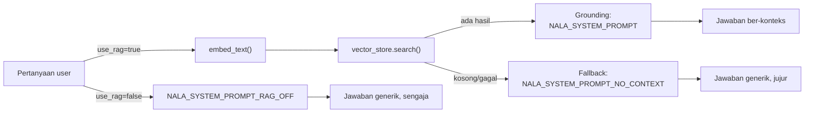

# Module 14: RAG Chain v1 — RAG Mulai "Hidup"

## Tujuan

Menyatukan tiga potongan yang sudah dibangun (`extract_text()` Module 10, `embed_text()` Module 11, `VectorStore` Module 13) jadi satu fungsi `ingest_documents()` **versi pertama** — belum ada chunking, satu dokumen di-embed jadi **satu vektor utuh**. Memakainya untuk mengisi index dengan **data seed** (Bagian 2), lalu menyambungkan `/chat/stream` — satu-satunya endpoint chat NALA sejak Module 8 — ke retrieval, sekaligus memberi user **kendali** untuk memilih pakai RAG atau tidak lewat switch `use_rag` (Bagian 2 Langkah 4). Ini titik paling penting Module 7-17 sejauh ini: **RAG benar-benar bekerja untuk pertama kalinya** — NALA menjawab dari dokumen sungguhan, bukan lagi generik. Chunking (Module 15) akan meng-upgrade `ingest_documents()` ini nanti — bukan menggantinya dari nol.

## Definisi

`ingest_documents()` adalah fungsi yang menyatukan seluruh pipeline — baca dokumen, embed, simpan ke vector store — jadi satu pemanggilan. "Ingest" sendiri berarti "memasukkan data ke dalam sistem" (Bagian 1), dan begitu fungsi ini tersambung ke endpoint chat, terbentuklah **RAG chain**: rangkaian lengkap retrieval → augmented → generation yang benar-benar tersambung end-to-end, dari pertanyaan user sampai jawaban ber-konteks — inilah yang "hidup" untuk pertama kalinya di module ini (lihat Module 9 Bagian 4 untuk alur konsepnya).

Supaya jawaban yang dihasilkan benar-benar berdasarkan dokumen (bukan mengarang), dipakai **grounding** — instruksi eksplisit ke LLM supaya menjawab hanya dari konteks yang diberikan, bukan dari pengetahuan umum model (Bagian 4). Tapi grounding cuma berguna kalau ada konteks untuk dijadikan pegangan — kalau retrieval gagal atau tidak menemukan apa-apa, sistem butuh **fallback**: jalur cadangan yang tetap memberi jawaban yang jujur. Di NALA, `NALA_SYSTEM_PROMPT_NO_CONTEXT` dipakai sebagai fallback itu (Bagian 2 Langkah 3).



## Hasil Akhir yang Diharapkan

- `ingest_documents()` menyatukan `extract_text()` + embedding + vector store, mengembalikan jumlah dokumen yang ter-index (satu vektor per dokumen)
- Index OpenSearch terisi dari data seed (Bagian 2) lewat pemanggilan manual satu kali
- `/chat/stream` menjawab berdasarkan isi dokumen SOP yang ter-index, bukan generik lagi, untuk pertanyaan yang jawabannya ada di knowledge base
- Multi-turn (Module 8) tetap berfungsi setelah retrieval ditambahkan — pertanyaan lanjutan tanpa kata kunci eksplisit tetap dipahami dan tetap memicu retrieval baru
- Index kosong/OpenSearch tak terjangkau menghasilkan fallback ke `NALA_SYSTEM_PROMPT_NO_CONTEXT` (jawaban tetap mengalir normal, bukan error)
- User bisa memilih pakai RAG atau tidak lewat toggle di `chat.html` (atau field `use_rag` di request API) — mematikan RAG benar-benar melewati retrieval, bukan cuma mengabaikan hasilnya
- Kita memahami keterbatasan nyata retrieval **level-dokumen** (Bagian 7) sebagai motivasi jujur untuk chunking di Module 15 — bukan diklaim sebagai retrieval yang sudah optimal

## 1. Menyatukan Tiga Potongan: `ingest_documents()` v1

**Prasyarat**: sudah menyelesaikan **Module 12-13** (OpenSearch & Semantic Search) — `opensearch` sudah menyala dan sehat.

Module 10-13 membangun tiga alat terpisah: `extract_text()` (Module 10), `embed_text()` (Module 11), dan `VectorStore` (Module 13). Sekarang saatnya menyatukan ketiganya jadi satu fungsi — `ingest_documents()`, yang menerima path folder dan mengembalikan jumlah dokumen yang ter-index.

⚠️ **Belum ada chunking di versi ini**: tiap dokumen dibaca `extract_text()` **secara utuh**, langsung di-embed **secara utuh** jadi satu vektor, lalu disimpan sebagai **satu entri** di OpenSearch (`doc_id` = nama file apa adanya, bukan `filename-0`, `filename-1`, dst). Ini sengaja — versi pertama RAG dibuat sesederhana mungkin supaya cepat terbukti bekerja. Bagian 7 di bawah akan menunjukkan keterbatasan nyata dari pendekatan ini, yang jadi alasan konkret Module 15 menambahkan chunking.

**Langkah 1 — Tambah `ingest_document()` dan `ingest_documents()` di `app/ingest.py`**

`app/ingest.py` sejak Module 10 berisi `extract_text()`. Tambahkan import dan konstanta baru di baris paling atas:

```python
# app/ingest.py
import os

from pypdf import PdfReader

from app.embeddings import embed_text
from app.vector_store import VectorStore

OLLAMA_BASE_URL = os.environ.get("OLLAMA_BASE_URL", "http://localhost:11434")
OPENSEARCH_BASE_URL = os.environ.get("OPENSEARCH_BASE_URL", "http://localhost:9200")
```

Sebelum membangun versi "satu folder sekaligus", bangun dulu bagian intinya: fungsi untuk **satu dokumen spesifik**. Tambahkan di akhir file:

```python
# app/ingest.py, di bawah extract_text()
def ingest_document(file_path: str) -> None:
    store = VectorStore(base_url=OPENSEARCH_BASE_URL, index_name="nala-docs")
    store.ensure_index()

    filename = os.path.basename(file_path)
    content = extract_text(file_path)
    embedding = embed_text(content, base_url=OLLAMA_BASE_URL)
    store.index_document(
        doc_id=filename,
        text=content,
        embedding=embedding,
        metadata={"source": filename},
    )
```

`ingest_document()` (tunggal) menerima **path satu file spesifik** — bukan folder — lalu memproses cuma file itu: memastikan index OpenSearch sudah ada (`ensure_index()`), baca isinya jadi string utuh (`extract_text`, Module 10), embed **seluruh isi dokumen sekaligus** (`embed_text`, Module 11), lalu index-kan ke OpenSearch (`store.index_document`, Module 13) dengan `doc_id` = nama filenya sendiri (`os.path.basename(file_path)`, supaya sama persis dengan `doc_id` yang dipakai `ingest_documents()` di bawah, tidak peduli path lengkap yang diberikan). Inilah titik di mana ketiga potongan (ekstraksi teks, embedding, vector store) akhirnya bertemu di satu file — versi paling sederhana yang mungkin, untuk **satu** dokumen.

Sekarang bangun versi "satu folder sekaligus" **di atas** fungsi tunggal itu — bukan menulis ulang logikanya:

```python
# app/ingest.py, di bawah ingest_document()
def ingest_documents(folder_path: str) -> int:
    total_documents = 0
    for filename in sorted(os.listdir(folder_path)):
        if not filename.endswith((".md", ".txt", ".pdf")):
            continue
        ingest_document(os.path.join(folder_path, filename))
        total_documents += 1

    return total_documents
```

`ingest_documents()` (jamak) sekarang cuma **loop** — scan semua file `.md`/`.txt`/`.pdf` di folder tersebut (urut alfabetis), panggil `ingest_document()` untuk tiap file satu per satu, hitung berapa yang berhasil diproses. Tidak ada logika baca/embed/simpan yang diduplikasi antara keduanya — satu-satunya "kebenaran" soal bagaimana **satu** dokumen diproses ada di `ingest_document()`, `ingest_documents()` cuma memanggilnya berulang.

> **📝 Kenapa dipisah jadi dua fungsi, bukan satu**: `ingest_documents()` (folder) tetap dipakai untuk mengisi index pertama kali (Langkah ini) dan untuk Airflow (Module 17, yang men-scan ulang seluruh folder secara berkala). Tapi begitu Module 16 (Upload Dokumen) menambahkan endpoint upload, cuma **satu** file baru yang perlu di-ingest — memanggil `ingest_documents()` (scan+embed ulang **seluruh** folder) untuk itu jelas boros, apalagi kalau folder-nya sudah berisi banyak dokumen lama yang tidak berubah. `ingest_document()` (tunggal) memungkinkan Module 16 nanti meng-ingest **cuma dokumen yang baru diupload**, tanpa menyentuh dokumen lain sama sekali.

⚠️ **`doc_id` deterministik membuat keduanya aman dipanggil berkali-kali (idempotent)**: `doc_id=filename` selalu sama untuk dokumen yang sama, jadi `index_document()` **menimpa** (overwrite) entri lama, bukan menduplikasi. Bedanya cuma soal **berapa banyak yang ikut diproses ulang**: `ingest_documents()` (folder) scan ulang **seluruh isi folder** setiap kali dipanggil — makin banyak dokumen lama, makin banyak panggilan Ollama yang sebenarnya tidak perlu (dokumennya tidak berubah, tapi tetap di-embed ulang). `ingest_document()` (tunggal) **tidak** punya masalah ini — cuma file yang disebutkan yang diproses, dokumen lain sama sekali tidak tersentuh. Di production nyata, `ingest_documents()` biasanya ditambah pengecekan `mtime`/hash file untuk skip dokumen yang tidak berubah — di luar cakupan training ini, demi kesederhanaan belajar konsep.

**▶️ Jalankan & lihat hasilnya**

```bash
docker compose up --build api
```

Uji dulu `ingest_document()` (tunggal) ke **satu** file spesifik — ini yang paling sering dipakai sehari-hari (dan nanti jadi dasar Module 16):

```bash
docker compose exec api python -c "from app.ingest import ingest_document; ingest_document('/app/knowledge-base/sop-pengajuan-kredit.md')"
```

Tidak ada nilai balik (return `None`). Verifikasi lewat OpenSearch langsung — cek dokumen itu memang tersimpan, pakai `doc_id`-nya (nama file):

```bash
curl "http://localhost:9200/nala-docs/_doc/sop-pengajuan-kredit.md"
```

✅ **Indikator sukses**: `"found": true`, dengan `_source.text` berisi isi file itu dan `_source.embedding` berisi array angka (vektor). Jalankan perintah `ingest_document()` yang sama sekali lagi — hasilnya tetap satu dokumen tersimpan (menimpa, bukan menduplikasi), sesuai penjelasan idempotency di atas.

Setelah itu, isi **seluruh** folder sekaligus pakai `ingest_documents()` (jamak) — perlu untuk Bagian 3 nanti (RAG butuh semua SOP, bukan cuma satu):

```bash
docker compose exec api python -c "from app.ingest import ingest_documents; print(ingest_documents('/app/knowledge-base'))"
```

✅ **Indikator sukses**: mengembalikan angka sesuai jumlah dokumen `.md`/`.txt`/`.pdf` di `Nala/knowledge-base/` (lihat Module 10 Bagian 2) — normalnya `2` (dua SOP contoh wajib), atau `3` kalau Anda juga sudah menyalin file PDF opsional. Verifikasi lewat OpenSearch langsung:

```bash
curl "http://localhost:9200/nala-docs/_count"
```

harus menunjukkan angka yang sama.

> 🔧 **Troubleshooting — chat menjawab generik / bilang belum ada dokumen internal padahal sudah ingest**: `/chat/stream` (Bagian 2) otomatis jatuh ke mode tanpa-konteks saat index OpenSearch masih kosong (atau belum menyala) — itu normal, bukan error, tapi tandanya ingest belum berhasil. Cek lagi `curl http://localhost:9200/nala-docs/_count` — kalau `count` bernilai 0, index memang kosong, jalankan ulang Langkah 1 ini.

> **📝 Catatan — beda dengan Module 15 nanti**: angka yang dikembalikan di sini adalah jumlah **dokumen**, bukan jumlah chunk — karena belum ada chunking. Setelah Module 15 meng-upgrade `ingest_documents()` untuk memecah tiap dokumen jadi beberapa chunk dulu sebelum di-embed, angka yang sama akan jauh lebih besar (satu dokumen bisa jadi 8-13 chunk, tergantung strategi chunking-nya) — perbandingan langsung ini jadi bukti konkret kenapa chunking penting, bukan cuma teori.

**Ini juga langkah "data dasar awal" yang dijanjikan Module 10 Bagian 1** — index sekarang terisi dari data seed, tanpa perlu form upload apa pun (itu baru Module 16). Kita sudah bisa lanjut ke Bagian 3 di bawah dan melihat RAG bekerja.

<details>
<summary><strong>Pakai Claude Code? Salin prompt berikut, paste untuk eksekusi Langkah 1</strong></summary>

```
Tambah ingest_document() dan ingest_documents() v1 ke app/ingest.py
yang sudah ada (Module 14) — menyatukan extract_text() (Module 10)
dengan embed_text() (Module 11) dan VectorStore (Module 13). BELUM
ADA CHUNKING.

GOAL:
- Di Nala/app/ingest.py (saat ini berisi
  extract_text(), plus import `from pypdf import PdfReader`):
  - Tambah di baris PALING ATAS file: `import os`, `from
    app.embeddings import embed_text`, `from app.vector_store import
    VectorStore`, lalu dua konstanta OLLAMA_BASE_URL dan
    OPENSEARCH_BASE_URL masing-masing dari os.environ.get(...) dengan
    default http://localhost:11434 dan http://localhost:9200.
  - Tambah fungsi baru ingest_document(file_path: str) -> None di
    BAWAH extract_text() (jangan ubah extract_text() yang sudah ada):
    bikin VectorStore(base_url=OPENSEARCH_BASE_URL,
    index_name="nala-docs"), panggil store.ensure_index(), ambil
    filename dari os.path.basename(file_path), panggil extract_text()
    untuk dapat isinya UTUH (bukan dipecah), embed_text() isinya
    sekaligus, lalu store.index_document(doc_id=filename,
    text=content, embedding=embedding, metadata={"source": filename}).
    Fungsi ini memproses SATU file saja, tidak ada return value.
  - Tambah fungsi baru ingest_documents(folder_path: str) -> int di
    BAWAH ingest_document(): untuk tiap file .md/.txt/.pdf di
    folder_path (urut alfabetis), panggil ingest_document() dengan
    path lengkap file itu. JANGAN duplikasi logika
    ensure_index()/extract_text()/embed_text()/index_document() di
    sini — cukup panggil ingest_document() per file. Return total
    jumlah DOKUMEN (bukan chunk) yang ter-index.

CONTEXT:
- app/embeddings.py (Module 11) dan app/vector_store.py (Module 13)
  sudah ada dan tidak perlu diubah.
- ingest_document() (tunggal) adalah building block atomik; nantinya
  Module 16 (Upload Dokumen) akan memanggilnya untuk meng-ingest satu
  file yang baru diupload, tanpa scan ulang seluruh folder.
- BELUM ADA chunking di versi ini — satu dokumen = satu vektor. Itu
  baru ditambahkan Module 15.

GUARDRAIL:
- JANGAN ubah extract_text() yang sudah ada.
- JANGAN tambah fungsi chunk_text()/chunk_markdown() di file ini —
  itu Module 15.
- JANGAN sentuh app/main.py, docker-compose.yml, atau requirements.txt
  di langkah ini.
```

</details>

## 2. Sambungkan Retrieval ke `/chat/stream`

Sekarang index sudah terisi (Bagian 1) — saatnya membuat `/chat/stream` benar-benar **membaca** dari index itu sebelum menjawab. `/chat/stream` adalah **satu-satunya** endpoint chat sejak Module 8 (`/chat` sudah dihapus total) — jadi retrieval cukup ditambahkan di satu tempat, tidak ada endpoint kedua yang perlu disinkronkan. Tiga Langkah: **Langkah 2** menyiapkan fondasi (prompt fallback + import + koneksi `VectorStore`), **Langkah 3** mengubah `/chat/stream` itu sendiri, **Langkah 4** menambah switch `use_rag` supaya user bisa memilih pakai RAG atau tidak.

**Langkah 2 — Tambah `NALA_SYSTEM_PROMPT_NO_CONTEXT` dan setup `VectorStore` di `main.py`**

Di `app/system_prompt.py` (byte-identical dari Module 1-6 sejak Module 7) cuma ada `NALA_SYSTEM_PROMPT`. Tambahkan satu konstanta baru di baris paling bawah:

```python
# app/system_prompt.py
NALA_SYSTEM_PROMPT_NO_CONTEXT = """Kamu adalah NALA, asisten AI internal PT Nusantara Finance.
Tugasmu adalah menjawab pertanyaan staff seputar SOP, kebijakan, dan data operasional perusahaan.
Aturan:
- Jawab singkat, jelas, dan dalam Bahasa Indonesia.
- Jika kamu tidak yakin atau informasinya tidak tersedia, katakan dengan jujur bahwa kamu tidak memiliki informasi tersebut. Jangan mengarang jawaban.
- Jangan menjawab pertanyaan di luar konteks pekerjaan PT Nusantara Finance.
- Belum ada dokumen internal yang terhubung ke kamu saat ini, jadi jawab berdasarkan pengetahuan umum saja dan sebutkan bahwa jawaban akan lebih akurat setelah dokumen SOP diunggah.
"""
```

Lalu di `app/main.py`, tambah import dan setup baru — di baris atas:

```python
# app/main.py
import httpx

from app.embeddings import embed_text
from app.system_prompt import NALA_SYSTEM_PROMPT, NALA_SYSTEM_PROMPT_NO_CONTEXT
from app.vector_store import VectorStore
```

`from app.system_prompt import NALA_SYSTEM_PROMPT` (yang sudah ada sejak Module 7) diganti jadi baris di atas. `import httpx` juga baru — sejauh ini `httpx` cuma dipakai di dalam `app/ollama_client.py`, `app/embeddings.py`, dan `app/vector_store.py`, belum pernah diimpor langsung di `app/main.py`. Langkah 3 di bawah menangkap `httpx.HTTPError` langsung di `main.py`, jadi importnya wajib ada di sini — kalau terlewat, blok `except` itu akan gagal dengan `NameError` begitu benar-benar dieksekusi.

Lalu tambah konstanta dan instance `VectorStore` baru, di dekat `KNOWLEDGE_BASE_PATH`:

```python
# app/main.py
OPENSEARCH_BASE_URL = os.environ.get("OPENSEARCH_BASE_URL", "http://localhost:9200")
vector_store = VectorStore(base_url=OPENSEARCH_BASE_URL, index_name="nala-docs")
```

Belum ada satu baris pun endpoint yang berubah di Langkah ini — cuma menyiapkan alat yang akan dipakai Langkah 3.

**▶️ Jalankan & lihat hasilnya**

```bash
docker compose up --build api
```

✅ **Indikator sukses**: log `api` tetap menunjukkan `Uvicorn running` tanpa traceback, dan `/chat/stream` masih menjawab generik seperti sebelumnya — belum ada yang berubah secara fungsional.

<details>
<summary><strong>Pakai Claude Code? Salin prompt berikut, paste untuk eksekusi Langkah 2</strong></summary>

```
Tambah NALA_SYSTEM_PROMPT_NO_CONTEXT dan setup VectorStore di main.py
(Module 14, Langkah 2) — fondasi untuk retrieval, belum mengubah
endpoint apa pun.

GOAL:
- Di Nala/app/system_prompt.py: tambah
  konstanta baru NALA_SYSTEM_PROMPT_NO_CONTEXT (string multi-baris)
  di bawah NALA_SYSTEM_PROMPT yang sudah ada — isinya sama persis
  dengan NALA_SYSTEM_PROMPT kecuali aturan terakhir diganti jadi:
  "Belum ada dokumen internal yang terhubung ke kamu saat ini, jadi
  jawab berdasarkan pengetahuan umum saja dan sebutkan bahwa jawaban
  akan lebih akurat setelah dokumen SOP diunggah."
- Di Nala/app/main.py:
  - Tambah `import httpx` di baris import paling atas (belum pernah
    diimpor langsung di main.py sebelumnya — cuma dipakai di dalam
    ollama_client.py, embeddings.py, vector_store.py).
  - Ganti `from app.system_prompt import NALA_SYSTEM_PROMPT` jadi
    `from app.system_prompt import NALA_SYSTEM_PROMPT,
    NALA_SYSTEM_PROMPT_NO_CONTEXT`.
  - Tambah `from app.embeddings import embed_text` dan `from
    app.vector_store import VectorStore`.
  - Tambah konstanta OPENSEARCH_BASE_URL =
    os.environ.get("OPENSEARCH_BASE_URL", "http://localhost:9200")
    dan `vector_store = VectorStore(base_url=OPENSEARCH_BASE_URL,
    index_name="nala-docs")`, ditaruh dekat KNOWLEDGE_BASE_PATH.

CONTEXT:
- app/embeddings.py dan app/vector_store.py sudah ada dari Module 11-13.
- BELUM mengubah endpoint /chat/stream sama sekali.

GUARDRAIL:
- JANGAN ubah isi fungsi chat_stream() — itu Langkah 3.
- JANGAN hapus NALA_SYSTEM_PROMPT yang sudah ada.
```

</details>

**Langkah 3 — Ubah endpoint `/chat/stream`**

`/chat/stream` (dibangun di Module 8, menggantikan `/chat` total) sampai sekarang masih murni streaming + riwayat, tanpa retrieval. Langkah ini menambahkan retrieval ke endpoint itu — query yang di-embed adalah **pesan user terakhir saja** (bukan seluruh riwayat), karena riwayat percakapan sebelumnya belum tentu relevan sebagai kata kunci pencarian dokumen.

```python
# app/main.py
@app.post("/chat/stream")
def chat_stream(request: ChatStreamRequest) -> StreamingResponse:
    if not request.messages or request.messages[-1].role != "user":
        raise HTTPException(
            status_code=400,
            detail="messages harus non-kosong dan elemen terakhir harus role 'user'",
        )

    recent = request.messages[-HISTORY_WINDOW:]
    last_user_message = recent[-1].content

    try:
        query_embedding = embed_text(last_user_message, base_url=OLLAMA_BASE_URL)
        results = vector_store.search(query_embedding, top_k=2)
    except httpx.HTTPError:
        results = []

    if results:
        context = "\n\n".join(r["text"] for r in results)
        system_prompt = NALA_SYSTEM_PROMPT
        grounded_content = f"Konteks:\n{context}\n\nPertanyaan: {last_user_message}"
    else:
        system_prompt = NALA_SYSTEM_PROMPT_NO_CONTEXT
        grounded_content = last_user_message

    ollama_messages = [{"role": "system", "content": system_prompt}]
    ollama_messages += [{"role": m.role, "content": m.content} for m in recent[:-1]]
    ollama_messages.append({"role": "user", "content": grounded_content})

    return StreamingResponse(
        ollama_client.chat_stream(ollama_messages), media_type="text/plain"
    )
```

- **Embedding pesan user**: `embed_text(last_user_message, ...)` — model yang sama (`nomic-embed-text`, Module 11) yang dipakai saat indexing (Bagian 1), menghasilkan vektor 768-dimensi, dari pesan **terakhir** di riwayat (bukan seluruh percakapan).
- **Retrieval**: `vector_store.search(query_embedding, top_k=2)` — mengambil top-2 dokumen berdasarkan k-NN similarity (Module 13). `top_k` kecil sengaja — index baru berisi segelintir dokumen utuh (Bagian 1), bukan puluhan chunk, jadi tidak ada gunanya minta lebih dari yang ada.
- **Fallback**: dua kondisi masuk ke cabang `else` (tanpa `results`): (1) `embed_text()`/`vector_store.search()` melempar `httpx.HTTPError` (OpenSearch tidak terjangkau), atau (2) keduanya berhasil tapi `results` kosong (index belum pernah di-ingest, atau tidak ada dokumen relevan). Di kedua kasus, `NALA_SYSTEM_PROMPT_NO_CONTEXT` dipakai sebagai pengganti — isinya sama persis kecuali instruksi terakhir: alih-alih "jawab HANYA dari konteks", mengizinkan jawaban dari pengetahuan umum sambil jujur bilang belum ada dokumen internal yang terhubung.
- **Kalau retrieval berhasil**: teks dokumen (utuh, belum dipecah) digabungkan jadi satu string konteks, `grounded_content` menggantikan isi pesan user terakhir sebelum dikirim ke Ollama — riwayat pesan-pesan **sebelumnya** (`recent[:-1]`) tetap dikirim apa adanya, tidak ikut di-grounding. `windowing` (`HISTORY_WINDOW = 10`, Module 8 Bagian 4) tidak berubah sama sekali.

**▶️ Jalankan & lihat hasilnya**

```bash
docker compose up --build api
```

```bash
curl -N -X POST http://localhost:8000/chat/stream \
  -H "Content-Type: application/json" \
  -d '{"messages": [{"role": "user", "content": "Berapa lama proses pengajuan kredit sampai pencairan dana?"}]}'
```

✅ **Indikator sukses**: jawaban menyebut angka dari dokumen (bukan estimasi generik), muncul bertahap (streaming) — **ini pertama kalinya sepanjang Module 7-17, NALA benar-benar menjawab dari dokumen sungguhan.** Bandingkan dengan jawaban Module 7-8 (sebelum RAG) yang selalu generik. Coba juga percakapan multi-turn (pertanyaan lanjutan tanpa menyebut kata kunci) — harus tetap dipahami **dan** tetap memicu retrieval baru untuk tiap pesan.

<details>
<summary><strong>Pakai Claude Code? Salin prompt berikut, paste untuk eksekusi Langkah 3</strong></summary>

```
Ubah endpoint POST /chat/stream supaya retrieval-augmented (Module 14,
Langkah 3).

GOAL:
- Di Nala/app/main.py, PASTIKAN `import httpx` sudah ada di baris
  import paling atas (harusnya sudah ditambahkan di Langkah 2 — kalau
  belum ada, tambahkan sekarang; blok except di bawah butuh ini,
  kalau tidak ada NameError saat except itu dieksekusi).
- Di Nala/app/main.py, di dalam fungsi
  chat_stream() (endpoint POST /chat/stream), SETELAH baris
  `recent = request.messages[-HISTORY_WINDOW:]` yang sudah ada,
  tambahkan: last_user_message = recent[-1].content; try/except:
  di dalam try, query_embedding = embed_text(last_user_message,
  base_url=OLLAMA_BASE_URL), lalu results =
  vector_store.search(query_embedding, top_k=2); di except
  httpx.HTTPError: results = []. Kalau results ada isinya, susun
  context dari r["text"] tiap hasil, system_prompt =
  NALA_SYSTEM_PROMPT, grounded_content = f"Konteks:\n{context}\n\n
  Pertanyaan: {last_user_message}"; kalau tidak, system_prompt =
  NALA_SYSTEM_PROMPT_NO_CONTEXT, grounded_content =
  last_user_message. Lalu ganti baris penyusunan ollama_messages yang
  sudah ada supaya: [{"role": "system", "content": system_prompt}] +
  [{"role": m.role, "content": m.content} for m in recent[:-1]] +
  [{"role": "user", "content": grounded_content}].

CONTEXT:
- vector_store, embed_text, NALA_SYSTEM_PROMPT_NO_CONTEXT sudah
  di-setup di Langkah 2.
- Validasi 400 dan windowing (HISTORY_WINDOW) yang sudah ada dari
  Module 8 TIDAK berubah.
- Ini SATU-SATUNYA endpoint chat sejak Module 8 — tidak ada endpoint
  /chat lain yang perlu disinkronkan.

GUARDRAIL:
- JANGAN ubah endpoint /health atau /.
- JANGAN ubah signature chat_stream() atau model ChatStreamRequest/ChatMessage.
```

</details>

**Langkah 4 — Switch `use_rag`: biarkan user memilih pakai RAG atau tidak**

Sejauh ini, retrieval **selalu** dicoba setiap kali ada pesan — user tidak punya kendali untuk mematikannya. Kadang itu tidak diinginkan: staff mungkin cuma mau tanya hal umum di luar SOP (mis. "apa itu suku bunga acuan?" — pertanyaan konsep, bukan spesifik ke dokumen internal), dan proses retrieval yang tidak perlu (satu panggilan embed + satu pencarian OpenSearch) cuma menambah latensi tanpa manfaat. Tambahkan field `use_rag` di request supaya user (lewat UI) yang memutuskan, bukan selalu otomatis.

Pertama, tambah satu prompt baru di `app/system_prompt.py` — khusus untuk kasus **user sengaja mematikan RAG** (beda dari `NALA_SYSTEM_PROMPT_NO_CONTEXT` yang isinya soal "belum ada dokumen terhubung"; di sini dokumennya **ada**, cuma sengaja tidak dipakai):

```python
# app/system_prompt.py
NALA_SYSTEM_PROMPT_RAG_OFF = """Kamu adalah NALA, asisten AI internal PT Nusantara Finance.
Tugasmu adalah menjawab pertanyaan staff seputar SOP, kebijakan, dan data operasional perusahaan.
Aturan:
- Jawab singkat, jelas, dan dalam Bahasa Indonesia.
- Mode pencarian dokumen internal sedang DIMATIKAN atas permintaan pengguna saat ini — jawab berdasarkan pengetahuan umum saja, dan kalau relevan, ingatkan bahwa jawaban akan lebih akurat dan spesifik kalau mode pencarian dokumen dinyalakan kembali.
- Jangan berpura-pura tahu detail SOP/kebijakan spesifik PT Nusantara Finance kalau sebenarnya kamu tidak diberi konteks dokumennya.
- Jangan menjawab pertanyaan di luar konteks pekerjaan PT Nusantara Finance.
"""
```

Lalu di `app/main.py`, tambah field baru ke `ChatStreamRequest` (model ini sudah ada sejak Module 8 — cuma menambah satu field, bukan menulis ulang):

```python
# app/main.py
class ChatStreamRequest(BaseModel):
    messages: list[ChatMessage]
    use_rag: bool = True
```

`= True` sebagai default **penting** — request lama tanpa field `use_rag` sama sekali (misal dari `curl` yang sudah ditulis di Langkah 3) tetap valid dan tetap berperilaku seperti sebelumnya (retrieval otomatis), tidak ada yang rusak begitu field baru ini ditambahkan.

Import prompt barunya, lalu ubah logika di `chat_stream()` — retrieval cuma dicoba kalau `request.use_rag` bernilai `True`:

```python
# app/main.py
from app.system_prompt import (
    NALA_SYSTEM_PROMPT,
    NALA_SYSTEM_PROMPT_NO_CONTEXT,
    NALA_SYSTEM_PROMPT_RAG_OFF,
)
```

```python
# app/main.py, di dalam chat_stream(), menggantikan blok try/except dan if/else yang ada
    if request.use_rag:
        try:
            query_embedding = embed_text(last_user_message, base_url=OLLAMA_BASE_URL)
            results = vector_store.search(query_embedding, top_k=2)
        except httpx.HTTPError:
            results = []
    else:
        results = []

    if request.use_rag and results:
        context = "\n\n".join(r["text"] for r in results)
        system_prompt = NALA_SYSTEM_PROMPT
        grounded_content = f"Konteks:\n{context}\n\nPertanyaan: {last_user_message}"
    elif request.use_rag:
        system_prompt = NALA_SYSTEM_PROMPT_NO_CONTEXT
        grounded_content = last_user_message
    else:
        system_prompt = NALA_SYSTEM_PROMPT_RAG_OFF
        grounded_content = last_user_message
```

- **`if request.use_rag: ... else: results = []`**: kalau `use_rag=False`, `embed_text()`/`vector_store.search()` **sama sekali tidak dipanggil** — bukan cuma diabaikan hasilnya. Ini sengaja, supaya mematikan RAG benar-benar menghemat satu panggilan Ollama (embed) dan satu request OpenSearch, bukan cuma "pura-pura tidak pakai" hasilnya.
- **Tiga cabang, bukan dua**: `use_rag=True` + `results` ada isinya → grounded (seperti sebelumnya); `use_rag=True` + `results` kosong/gagal → fallback `NALA_SYSTEM_PROMPT_NO_CONTEXT` (seperti sebelumnya, situasi tidak disengaja); `use_rag=False` → `NALA_SYSTEM_PROMPT_RAG_OFF` (situasi **disengaja** oleh user, pesannya beda supaya tidak membingungkan — bukan "belum ada dokumen", tapi "sengaja tidak dipakai").

Terakhir, tambah **toggle** di `chat.html` (dibangun Module 8) supaya user bisa mengatur `use_rag` dari browser:

```html
<!-- app/templates/chat.html -->
<label class="rag-toggle">
  <input type="checkbox" id="useRagToggle" checked>
  Pakai RAG (cari dari dokumen)
</label>
```

Lalu sertakan nilainya saat mengirim request (menggantikan `body: JSON.stringify({ messages: conversation })` dari Module 8):

```javascript
// app/templates/chat.html, di dalam handler submit
const useRag = document.getElementById("useRagToggle").checked;

const response = await fetch("/chat/stream", {
  method: "POST",
  headers: { "Content-Type": "application/json" },
  body: JSON.stringify({ messages: conversation, use_rag: useRag }),
});
```

**▶️ Jalankan & lihat hasilnya**

```bash
docker compose up --build api
```

Uji lewat `curl` dulu (sebelum coba dari browser) — kirim pertanyaan yang jawabannya ada di dokumen, tapi dengan `use_rag: false`:

```bash
curl -N -X POST http://localhost:8000/chat/stream \
  -H "Content-Type: application/json" \
  -d '{"messages": [{"role": "user", "content": "Berapa lama proses pengajuan kredit sampai pencairan dana?"}], "use_rag": false}'
```

✅ **Indikator sukses**: walau pertanyaannya sama persis dengan uji Bagian 2 Langkah 3 (yang jawabannya menyebut angka dari dokumen), kali ini jawabannya **generik** — bukti `use_rag: false` benar-benar melewati retrieval. Buka `http://localhost:8000` di browser, matikan toggle "Pakai RAG", kirim pertanyaan yang sama — hasilnya harus terasa sama generiknya. Nyalakan lagi togglenya, kirim ulang — jawaban kembali menyebut angka dari dokumen.

<details>
<summary><strong>Pakai Claude Code? Salin prompt berikut, paste untuk eksekusi Langkah 4</strong></summary>

```
Tambah switch use_rag supaya user bisa memilih pakai RAG atau tidak
(Module 14, Langkah 4).

GOAL:
- Di Nala/app/system_prompt.py: tambah konstanta baru
  NALA_SYSTEM_PROMPT_RAG_OFF (string multi-baris) di bawah
  NALA_SYSTEM_PROMPT_NO_CONTEXT yang sudah ada — isinya menjelaskan
  bahwa mode pencarian dokumen sedang dimatikan ATAS PERMINTAAN USER
  (beda pesan dari NALA_SYSTEM_PROMPT_NO_CONTEXT yang soal "belum ada
  dokumen terhubung").
- Di Nala/app/main.py:
  - Tambah field `use_rag: bool = True` ke model ChatStreamRequest
    yang sudah ada (jangan hapus field messages yang sudah ada).
  - Tambah NALA_SYSTEM_PROMPT_RAG_OFF ke import dari
    app.system_prompt yang sudah ada.
  - Di dalam chat_stream(), ubah logika retrieval: kalau
    request.use_rag False, SKIP pemanggilan embed_text() dan
    vector_store.search() sama sekali (langsung results = []). Kalau
    request.use_rag True DAN results ada isinya, pakai NALA_SYSTEM_PROMPT
    + context seperti sebelumnya. Kalau request.use_rag True TAPI
    results kosong, pakai NALA_SYSTEM_PROMPT_NO_CONTEXT seperti
    sebelumnya. Kalau request.use_rag False, pakai
    NALA_SYSTEM_PROMPT_RAG_OFF (bukan NALA_SYSTEM_PROMPT_NO_CONTEXT).
- Di Nala/app/templates/chat.html: tambah checkbox
  `<input type="checkbox" id="useRagToggle" checked>` dengan label
  "Pakai RAG (cari dari dokumen)" di dekat form input pesan. Di
  handler submit form yang sudah ada, baca nilai checkbox itu, dan
  tambahkan `use_rag: <nilai checkbox>` ke body JSON yang dikirim
  fetch ke /chat/stream (selain messages yang sudah ada).

CONTEXT:
- ChatStreamRequest dan chat_stream() sudah ada dari Module 8,
  ditambah retrieval di Langkah 2-3 module ini.
- Default use_rag=True penting supaya request lama tanpa field ini
  tetap berperilaku sama seperti sebelum Langkah ini ditambahkan.

GUARDRAIL:
- JANGAN hapus atau ubah NALA_SYSTEM_PROMPT dan
  NALA_SYSTEM_PROMPT_NO_CONTEXT yang sudah ada.
- JANGAN ubah HISTORY_WINDOW, validasi 400, atau logika windowing
  yang sudah ada dari Module 8.
- JANGAN ubah endpoint /health, /, atau file lain di luar yang
  disebutkan.
```

</details>

## 3. NALA Sekarang Menjawab dari Dokumen — Verifikasi Menyeluruh

Coba beberapa skenario untuk memastikan RAG benar-benar bekerja:

**a. Pertanyaan yang jawabannya ada di dokumen:**
```bash
curl -N -X POST http://localhost:8000/chat/stream \
  -H "Content-Type: application/json" \
  -d '{"messages": [{"role": "user", "content": "Dokumen apa saja yang saya butuhkan untuk mengajukan kredit?"}]}'
```
✅ Jawaban menyebut KTP, NPWP, laporan keuangan, dst — persis dari `sop-pengajuan-kredit.md`.

**b. Index kosong → fallback, bukan crash:**
```bash
curl -X DELETE http://localhost:9200/nala-docs
curl -N -X POST http://localhost:8000/chat/stream \
  -H "Content-Type: application/json" \
  -d '{"messages": [{"role": "user", "content": "Berapa lama proses pengajuan kredit?"}]}'
```
✅ Stream tetap mengalir normal (bukan error/hang), jawaban terasa generik. Jalankan ulang `ingest_documents()` (Bagian 1) untuk mengisi index kembali.

**c. Multi-turn tetap jalan setelah retrieval ditambahkan:**
```bash
curl -N -X POST http://localhost:8000/chat/stream \
  -H "Content-Type: application/json" \
  -d '{"messages": [
    {"role": "user", "content": "Berapa lama proses pengajuan kredit sampai pencairan dana?"},
    {"role": "assistant", "content": "Menurut konteks yang diberikan, waktu estimasi untuk proses pengajuan kredit sampai pencairan dana adalah 2-3 hari kerja setelah mendapatkan persetujuan (approval)."},
    {"role": "user", "content": "Kalau untuk nasabah yang sudah lama jadi customer, apakah lebih cepat?"}
  ]}'
```
✅ Pertanyaan kedua tidak menyebut kata "kredit" sama sekali — NALA harus tetap paham ini masih soal proses kredit, sekaligus tetap melakukan retrieval baru untuk pertanyaan lanjutan ini.

**d. Switch `use_rag` benar-benar mematikan retrieval (Bagian 2 Langkah 4):**
```bash
curl -N -X POST http://localhost:8000/chat/stream \
  -H "Content-Type: application/json" \
  -d '{"messages": [{"role": "user", "content": "Dokumen apa saja yang saya butuhkan untuk mengajukan kredit?"}], "use_rag": false}'
```
✅ Bandingkan dengan skenario **a** di atas (pertanyaan sama persis, `use_rag` tidak disebut = default `true`) — kali ini jawabannya generik, tidak menyebut KTP/NPWP dari dokumen, karena `embed_text()`/`vector_store.search()` sama sekali tidak dipanggil.

## 4. Grounding: Kenapa NALA Tidak (Selalu) Mengarang

`NALA_SYSTEM_PROMPT` (Module 1-6, tidak diganti nama) sudah mencakup instruksi **grounding** — memaksa model menjawab **hanya** dari konteks yang diberikan, bukan dari pengetahuan umum. Dua prompt lain dipakai untuk dua situasi "tidak ada konteks" yang **penyebabnya beda**, jadi pesannya sengaja dibedakan juga: `NALA_SYSTEM_PROMPT_NO_CONTEXT` (Bagian 2 Langkah 2) dipakai saat retrieval **gagal/kosong tanpa disengaja** (index belum ter-isi, atau OpenSearch tak terjangkau) — jujur bilang belum ada dokumen terhubung. `NALA_SYSTEM_PROMPT_RAG_OFF` (Bagian 2 Langkah 4) dipakai saat user **sengaja mematikan** RAG lewat switch `use_rag` — dokumennya sebenarnya ada dan siap dipakai, cuma user memilih tidak memakainya saat itu, jadi pesannya tidak bilang "belum ada dokumen" (yang akan menyesatkan). Ketiganya sama-sama instruksi grounding yang membuat jawaban Module 7-8, 9-11 (sebelum ada retrieval, atau saat index kosong/RAG dimatikan) terasa "generik tapi jujur", bukan mengarang seolah tahu SOP internal — konsisten dengan pembahasan halusinasi di Module 9 Bagian 1.

⚠️ Grounding lewat instruksi prompt **membantu**, tapi bukan jaminan mutlak — model kecil (`llama3.2:3b`) tetap bisa sesekali mengabaikan instruksi ini. Ini akan dibahas lebih detail konsistensinya di Module 23 saat model dipakai untuk tool-calling.

## 5. Data Operasional: Upload vs Airflow (Preview Module 16-17)

Sejauh ini, data seed (Bagian 1) diisi lewat pemanggilan `ingest_documents()` secara manual dari terminal. Module 15 dulu meng-**upgrade** `ingest_documents()` supaya memecah dokumen jadi chunk sebelum embed, baru Module 16-17 menambahkan **dua cara lain** memicu proses yang sudah di-upgrade itu:

| Aspek | Endpoint Upload (Module 16) | Airflow Pipeline (Module 17) |
|---|---|---|
| Trigger | Staff upload lewat form web | Manual trigger di Airflow UI/CLI |
| Cocok untuk | Satu dokumen, cepat, reaktif | Batch, audit trail, siap upgrade ke terjadwal |
| Kode yang dipanggil | `ingest_documents()` — versi **upgrade** dari Module 15 | `ingest_documents()` — fungsi **sama persis** dengan yang dipanggil Upload |

**Poin penting**: kode `/chat/stream` di module ini **tidak akan berubah sama sekali** setelah Module 15-17 selesai — chunking, upload, dan Airflow cuma menambah/mengubah **cara mengisi index**, retrieval-nya tetap membaca index `nala-docs` apa adanya, tidak peduli dokumen itu masuk lewat CLI manual (Bagian 1), form upload (Module 16), atau Airflow (Module 17), dan tidak peduli isinya satu vektor per dokumen (sekarang) atau beberapa chunk per dokumen (setelah Module 15). Ini dibuktikan langsung setelah Module 16-17 selesai.

## 6. Bentuk Uji Coba per Checklist

Skenario konkret untuk memverifikasi Bagian 3 — pakai pertanyaan yang jawabannya cukup jelas ada di salah satu dari dua dokumen SOP, supaya hasilnya bisa diprediksi. Karena retrieval di module ini masih level-dokumen (Bagian 7), pertanyaan yang **sangat spesifik** ke sub-bagian dokumen (misal "syarat nasabah perorangan") tetap terjawab — seluruh dokumen ikut jadi konteks — tapi jawabannya bisa terasa kurang fokus dibanding setelah Module 15 menambahkan chunking.

Contoh konkret: coba tanyakan "Apa saja syarat pengajuan kredit untuk nasabah perorangan?" — jawabannya mungkin terasa kurang fokus (seluruh dokumen ikut jadi konteks, bukan cuma bagian yang relevan). Ini **bukan bug** — lihat Bagian 7 untuk penjelasan kenapa ini terjadi dan kenapa itu jadi motivasi Module 15 (chunking).

## 7. Catatan: Keterbatasan Retrieval Level-Dokumen (Preview Module 15)

RAG sudah bekerja (Bagian 3) — tapi retrieval-nya masih sangat kasar: **satu dokumen SOP yang panjang di-embed jadi satu vektor tunggal**, lalu **seluruh isinya** (bisa ribuan karakter) dikirim utuh sebagai konteks ke LLM, walau pertanyaan user cuma butuh satu-dua kalimat spesifik di dalamnya.

**Dua konsekuensi nyata dari ini**:

1. **Konteks yang dikirim ke LLM jauh lebih besar dari yang perlu.** Kalau ada 2 dokumen SOP relevan (`top_k=2`), keduanya dikirim **utuh** — model kecil (`llama3.2:3b`, context window terbatas) harus "menyaring" sendiri bagian mana yang relevan dari ribuan karakter, alih-alih menerima langsung bagian yang sudah difokuskan.
2. **Satu vektor tidak bisa mewakili banyak sub-topik sekaligus dengan baik.** Model embedding merangkum **seluruh** isi dokumen (semua tahapan, semua syarat, semua istilah) jadi satu vektor 768-dimensi — makna spesifik seperti "syarat khusus nasabah perorangan" jadi "diencerkan" oleh bagian-bagian lain dokumen yang tidak berhubungan (misal bagian tentang pencairan dana atau kontak layanan). Akibatnya, similarity antara query yang sangat spesifik dan vektor dokumen yang "umum" ini tidak setajam kalau saja ada representasi yang fokus ke bagian itu saja.

**Ini persis motivasi Module 15**: chunking memecah tiap dokumen jadi potongan-potongan kecil **sebelum** di-embed, supaya tiap vektor mewakili satu sub-topik yang fokus (misal satu vektor khusus untuk bagian "syarat nasabah perorangan"), dan konteks yang dikirim ke LLM jadi jauh lebih ringkas dan relevan. Setelah Module 15, kita akan mengulang perbandingan retrieval sebelum/sesudah chunking secara langsung — termasuk kasus di mana bahkan chunking pun ternyata belum menyelesaikan semuanya (motivasi lebih lanjut untuk hybrid search + reranking di Module 18).

## 8. Checkpoint Praktik

Yang perlu dipastikan sebelum lanjut ke Module 15:

- [ ] `ingest_documents()` mengembalikan jumlah dokumen lebih dari 0 (satu vektor per dokumen, bukan per chunk)
- [ ] `/chat/stream` menjawab berdasarkan isi dokumen SOP (bukan generik) untuk pertanyaan yang jawabannya ada di knowledge base, sambil tetap streaming bertahap
- [ ] Percakapan multi-turn tetap berfungsi setelah retrieval ditambahkan
- [ ] Index kosong menghasilkan fallback ke jawaban generik, bukan crash
- [ ] `use_rag: false` (lewat toggle UI atau field request) benar-benar melewati retrieval — pertanyaan yang sama menghasilkan jawaban generik, bukan jawaban dari dokumen
- [ ] Kita paham keterbatasan retrieval level-dokumen (Bagian 7) sebagai motivasi Module 15, bukan dianggap "RAG sudah optimal"

Begitu keenam hal ini terverifikasi, lanjut ke Module 15 — menambahkan chunking (memecah dokumen jadi potongan fokus sebelum di-embed), sebelum Module 16 menambah form upload web sebagai cara staff menambahkan dokumen baru ke sistem yang **sudah hidup** ini.

---

> 📌 **Catatan untuk fasilitator**: setelah Module 15 (Chunking), Module 16 (Upload), dan Module 17 (Airflow) selesai dibangun, kembali ke module ini untuk verifikasi tambahan — pastikan dokumen yang diupload lewat form web atau di-trigger lewat Airflow **langsung bisa ditanyakan** ke `/chat/stream` tanpa mengubah satu baris pun kode di module ini. Ini bukti nyata desain "retrieval generik terhadap sumber data" yang dijelaskan Bagian 5.
