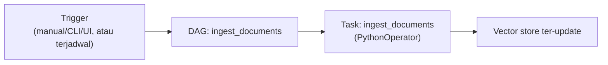
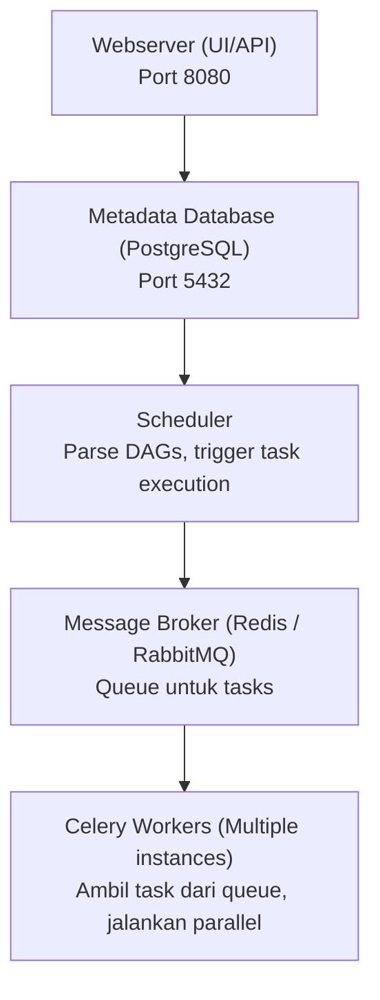
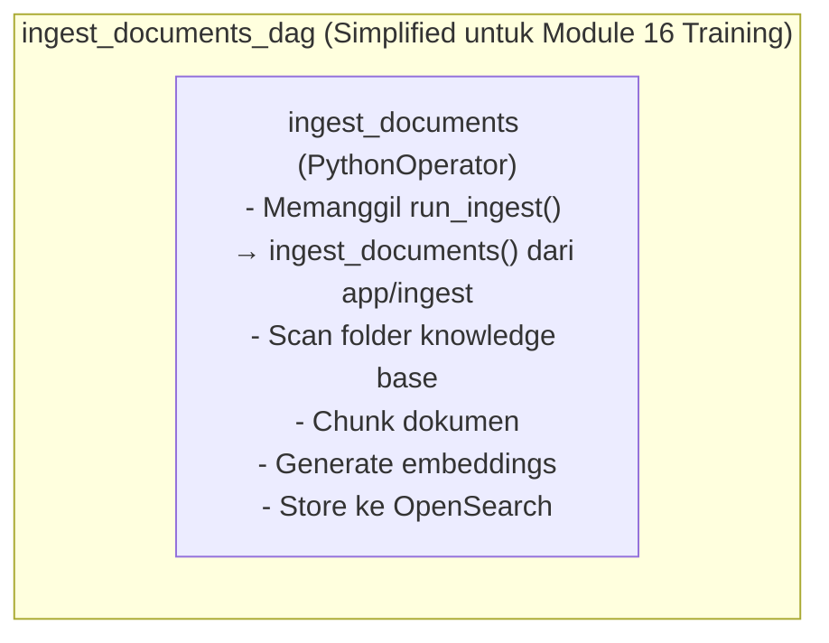

# Module 16: Airflow Ingest Pipeline

## Tujuan

Menambahkan **cara lain** memicu `ingest_documents()` (dibuat di Module 13, di-upgrade untuk chunking di Module 14, juga dipakai Module 15 lewat form upload) — lewat DAG Airflow yang bisa di-trigger manual dari UI/CLI. Beda dari upload (satu dokumen, reaktif, lewat web), Airflow cocok untuk skenario batch/operasional yang lebih besar: banyak dokumen sekaligus, audit trail, dan siap upgrade ke terjadwal.

## Definisi

**Orchestration** (orkestrasi) berarti mengatur *kapan* dan *bagaimana* beberapa langkah kerja dijalankan secara terpusat dan terpantau, bukan menjalankannya satu-satu secara manual dari terminal. Satu rangkaian langkah kerja yang diatur seperti ini disebut **workflow** — di NALA, diwakili satu **DAG (Directed Acyclic Graph)**: definisi workflow di Airflow berupa graph berarah, di mana tiap **task** (satu langkah kerja di dalamnya) tahu urutan sebelum dan sesudahnya, tanpa ada loop (Bagian 4.1). DAG NALA di training ini sengaja disederhanakan jadi cuma satu task (`ingest_documents`), walau DAG di lingkungan production biasanya berisi beberapa task berurutan.

Workflow seperti ini bisa dijalankan dengan dua cara: **trigger manual**, saat seseorang menekan tombol atau menjalankan perintah (dipakai sepanjang Module 7-16, Bagian 6), atau **terjadwal (scheduled)**, saat workflow jalan otomatis mengikuti jadwal cron tanpa campur tangan manusia sama sekali (Bagian 6.3, opsional untuk training ini).



## Hasil Akhir yang Diharapkan

- DAG `ingest_documents` bisa di-trigger dari Airflow UI dan berstatus `success`
- `curl http://localhost:9200/nala-docs/_count` menunjukkan jumlah dokumen yang sesuai dengan hasil ingest lewat Airflow
- Kita paham kapan pakai upload (Module 15) vs Airflow — bukan dua sistem yang bersaing, cuma beda pemicu dan jaminan yang didapat
- `/chat/stream` (Module 13) tetap menjawab dari dokumen seperti sebelumnya, tanpa perubahan kode apa pun

## 1. Apa itu Apache Airflow

**Definisi Sederhana (Non-Teknis):**

Apache Airflow adalah sebuah **platform orchestration** yang memungkinkan Anda untuk menjadwalkan dan menjalankan **workflow** (alur kerja otomatis) secara terpusat, terukur, dan dapat dipantau. Dalam konteks NALA Enterprise, Airflow menstandardisasi tugas yang biasanya dilakukan secara manual di terminal (seperti yang Anda lakukan di Module 13 Bagian 1 dan Module 14 Bagian 8 — memanggil `ingest_documents()` lewat `docker compose exec`) — di training ini prosesnya masih **di-trigger manual** (lewat tombol di UI atau CLI), tapi lewat Airflow, bukan lagi lewat login server dan mengetik command satu-satu.

**Analogi Sederhana:**

Bayangkan Anda memiliki rutin pagi: bangun → mandi → sarapan → berangkat ke kantor. Kalau dilakukan manual, Anda harus mengingat setiap langkah dan kapan mengerjakannya. Tapi kalau ada **alarm otomatis yang memicu setiap langkah dalam urutan yang benar** — maka Anda tinggal ikuti saja.

**Airflow bekerja seperti sistem alarm ini:** Airflow memungkinkan Anda mendefinisikan urutan tugas (tasks) yang disebut **Directed Acyclic Graph (DAG)**, lalu membiarkan Airflow **otomatis menjalankan tugas-tugas tersebut sesuai jadwal yang ditentukan**, tanpa perlu intervensi manual setiap kali.

---

## 2. Kenapa NALA Butuh Airflow — Padahal Upload (Module 15) Sudah Otomatis Meng-index

Wajar muncul pertanyaan ini: `/upload` (Module 15) dan Airflow sama-sama memanggil `ingest_documents()` yang sama persis (dibuat Module 13, di-upgrade chunking Module 14). Untuk skenario **satu file diupload lewat form web**, Airflow memang tidak wajib — `/upload` saja sudah cukup. Nilai Airflow muncul di skenario **lain** yang tidak dicakup `/upload`:

- **Reprocessing massal**: kalau banyak dokumen ditaruh langsung ke folder `knowledge-base/` (bukan lewat form upload, misal staff IT copy file langsung ke server), tidak ada yang otomatis men-trigger indexing — Airflow jadi cara menjalankan ulang seluruh proses kapan pun dibutuhkan, tanpa login server dan jalankan script manual (persis seperti yang Anda lakukan manual di Module 13 Bagian 1 dan Module 14 Bagian 8).
- **Decouple dari request HTTP**: di `/upload`, proses embedding (panggil Ollama berkali-kali) terjadi **di dalam** request — kalau dokumennya besar, user yang upload harus menunggu lama, bisa timeout. Lewat Airflow, proses berat itu bisa dipisah jadi task di background, tidak memblokir user.
- **Retry otomatis kalau gagal**: kalau OpenSearch/Ollama sempat down di tengah proses, `/upload` langsung gagal (ditangkap `except`, selesai, tidak ada percobaan ulang). Airflow punya fitur retry bawaan dan riwayat kegagalan tercatat rapi di UI.
- **Audit trail & observability**: Airflow mencatat setiap kali proses ingest dijalankan — kapan, berhasil/gagal, berapa lama. Penting untuk lingkungan enterprise yang butuh bukti "kapan data ini terakhir di-index" untuk keperluan compliance/audit.
- **Siap upgrade ke terjadwal**: tinggal ubah `schedule=None` jadi cron expression (Bagian 6.3) untuk reindexing otomatis berkala — `/upload` tidak punya konsep ini sama sekali karena sifatnya reaktif (hanya jalan kalau ada yang upload).

**Kesimpulan praktis**: `/upload` (Module 15) = jalur cepat untuk kasus umum (1 dokumen, upload manual lewat UI). Airflow = jalur untuk kasus operasional yang lebih besar (batch, terjadwal, butuh retry/audit) — keduanya cuma beda pemicu dan jaminan yang didapat, memanggil fungsi inti yang **sama persis** (`ingest_documents()`, dibuat Module 13, di-upgrade Module 14).

**Kelemahan skenario benar-benar manual** (tanpa Airflow maupun upload web): staff IT harus login server dan menjalankan `python app/ingest.py` setiap kali — tidak scalable, rentan lupa/error, tidak ada monitoring atau audit trail.

---

## 3. Catatan Penting: Airflow Mode `standalone` vs Production Architecture

**Penting untuk kita pahami:** Training ini menggunakan Airflow dalam mode **`standalone`** (satu container, database bawaan SQLite), **BUKAN** arsitektur production penuh (yang memerlukan multiple containers terpisah).

### 3.1 Apa itu Airflow Mode `standalone`?

- **Satu container** menjalankan semua komponen Airflow (scheduler, webserver, metadata database)
- **Metadata database bawaan: SQLite** — embedded, tidak perlu PostgreSQL terpisah
- **No external message broker** — tidak perlu Redis atau RabbitMQ
- **Single worker** — tidak ada distributed workers untuk parallel task execution

**Keuntungan mode `standalone`**: ringan (cocok untuk laptop RAM terbatas), mudah setup, cocok untuk development & demo.

### 3.2 Airflow Production Architecture (BUKAN dipakai di training ini)



**Komponen production yang TIDAK ada di mode `standalone` training ini:**

| Komponen | Peran | Status Training |
|----------|-------|-----------------|
| PostgreSQL (ext.) | Metadata DB | ❌ Pakai SQLite built-in |
| Redis/RabbitMQ | Message Broker | ❌ Tidak ada |
| Celery Workers | Parallel execution | ❌ Single built-in executor |
| Monitoring tools | Observability | ⚠️ Basic logging saja |

### 3.3 Trade-Off: Kenapa Mode `standalone` untuk Training Ini

**Constraint:** Prasyarat training adalah minimum 16GB RAM **untuk semua services Module 7-29** (Ollama, FastAPI, OpenSearch, PostgreSQL operational data, Langfuse, LangGraph, **plus Airflow**). Dengan prasyarat ini, tidak cukup ruang untuk Airflow production setup.

**Keputusan:** Gunakan Airflow `standalone` mode untuk training — database metadata SQLite built-in, scheduler+webserver dalam satu process, executor LocalExecutor, monitoring basic logs via Airflow UI.

**Kesimpulannya untuk kita:** Mode `standalone` **BUKAN representasi production Airflow yang sebenarnya**. Tapi **konsep DAG, task, scheduling, dan error handling tetap sama** — ini yang terpenting dipelajari. Scaling ke production architecture hanya masalah infrastruktur, bukan logic workflow.

---

## 4. Anatomi DAG Sederhana untuk NALA

Setiap workflow di Airflow didefinisikan sebagai **DAG (Directed Acyclic Graph)** — graph yang menunjukkan urutan task dan dependency-nya.

### 4.1 Apa itu DAG?

- **Directed** — tasks memiliki arah (task mana yang jalan duluan, mana setelahnya)
- **Acyclic** — tidak ada loop
- **Graph** — kumpulan nodes (tasks) dan edges (dependencies)

DAG didefinisikan sebagai **file Python** (`airflow/dags/ingest_documents_dag.py`), bukan konfigurasi klik-klik di UI — workflow-nya adalah kode yang bisa di-*version control*.

**Untuk Module 16 training ini, DAG disederhanakan jadi satu task saja** (fokus belajar konsep DAG dan scheduling, bukan kompleksitas multi-task dependency):



### 4.2 File DAG untuk NALA: `airflow/dags/ingest_documents_dag.py`

```python
from datetime import datetime

from airflow import DAG
from airflow.operators.python import PythonOperator


def run_ingest():
    from app.ingest import ingest_documents

    count = ingest_documents("/opt/airflow/knowledge-base")
    print(f"Ingest selesai: {count} chunk ter-index.")


with DAG(
    dag_id="ingest_documents",
    description="Scan resources/sample-knowledge-base, chunk, embed, dan index ke OpenSearch",
    start_date=datetime(2026, 1, 1),
    schedule=None,
    catchup=False,
    tags=["nala", "rag"],
) as dag:
    ingest_task = PythonOperator(
        task_id="ingest_documents",
        python_callable=run_ingest,
    )
```

**Penjelasan Setiap Bagian:**

| Bagian | Penjelasan |
|--------|-----------|
| `from airflow import DAG` | Mengimport class DAG dari Airflow |
| `run_ingest()` | Fungsi wrapper lokal yang memanggil `ingest_documents()` dari `app/ingest.py` (dibuat Module 13, di-upgrade chunking Module 14) dengan argumen `folder_path="/opt/airflow/knowledge-base"` — wrapper diperlukan karena Airflow `python_callable` tidak bisa langsung menyuplai argumen |
| `with DAG(...) as dag:` | Membuat instance DAG, `dag_id="ingest_documents"` |
| `schedule=None` | DAG tidak dijadwalkan otomatis — **trigger manual saja** untuk Module 16 |
| `catchup=False` | Jangan jalankan historical runs yang terlewat |
| `PythonOperator(...)` | Operator Airflow yang menjalankan fungsi Python arbitrary |

Fungsi `ingest_documents()` yang dipanggil DAG ini **fungsi yang sama persis** yang sudah Anda bangun di Module 13 Bagian 1 dan upgrade untuk chunking di Module 14 Bagian 8 — tidak ada logika baru ditulis di module ini, murni menambahkan **pemicu** baru untuk fungsi yang sudah ada.

### 4.3 Mengapa PythonOperator?

Airflow punya banyak operator (BashOperator, PythonOperator, EmailOperator, HttpOperator, dsb). Untuk NALA, pakai **PythonOperator** karena fleksibel (bisa jalankan fungsi Python apa pun), cocok untuk data processing, dan tidak ada overhead (langsung panggil fungsi dari `app/ingest.py` tanpa intermediate script). Alternatif untuk production/extension: **DockerOperator** (isolation), **KubernetesPodOperator** (scaling horizontal) — di luar cakupan Module 16.

---

## 5. Cara Akses Airflow UI

### 5.1 URL & Login

```
http://localhost:8080
```

**Kredensial Default (Airflow Standalone Mode):** username `admin`, password di-generate otomatis saat Airflow pertama kali start, **muncul di log container**.

### 5.2 Mencari Password dari Log Container

```bash
docker compose logs airflow | grep -i password
```

**Format asli yang muncul di Airflow 2.10.2 mode `standalone`** (diverifikasi langsung):

```
airflow-1  | standalone | Airflow is ready
airflow-1  | standalone | Login with username: admin  password: QaWqZWktKBzbG9Gt
airflow-1  | standalone | Airflow Standalone is for development purposes only. Do not use this in production!
```

Baris `Login with username: admin  password: <string acak>` itu yang dicari. Password unik di-generate ulang tiap kali database Airflow dibuat dari nol (misal setelah `docker compose down -v`) — kalau login gagal dengan password lama, cek ulang log terbaru.

### 5.3 Tampilan Airflow UI

Setelah login: **DAG List View** (daftar semua DAG, termasuk `ingest_documents`), **DAG Detail View** (klik nama DAG → tombol Trigger DAG, riwayat runs), **Task Logs** (klik task → View Logs, lihat output eksekusi termasuk jumlah chunk yang ter-index).

---

## 6. Cara Trigger DAG Manual

Untuk Module 16 training, DAG `ingest_documents` dijadwalkan **manual trigger only** (`schedule=None`).

### 6.1 Trigger via Airflow UI

1. Buka browser, akses `http://localhost:8080`
2. Login dengan `admin` / password dari log (Bagian 5.2)
3. Cari `ingest_documents` di daftar DAG, klik untuk masuk DAG detail view
4. Klik tombol **[Trigger DAG]**
5. DAG Run dimulai — status berubah "queued" → "running" → "success" (atau "failed")
6. Klik task instance → tab "Logs" untuk melihat output

### 6.2 Trigger via CLI

```bash
docker compose exec airflow airflow dags trigger ingest_documents
```

Memonitor dari CLI:
```bash
docker compose exec airflow airflow dags list-runs --dag-id ingest_documents
docker compose exec airflow airflow tasks logs ingest_documents <RUN_ID> ingest_documents
```

### 6.3 Perbedaan: Trigger Manual vs Scheduled

| Aspek | Manual Trigger | Scheduled (Automatic) |
|-------|----------------|------------------------|
| Kapan berjalan | Klik tombol atau jalankan CLI | Sesuai `schedule` (misal: setiap hari pukul 2 pagi) |
| Untuk Module 16 | ✅ Ini yang dipakai | ❌ Extension opsional |

**Extension (opsional, di luar cakupan wajib Module 16)** — upgrade ke scheduled:

```python
# airflow/dags/ingest_documents_dag.py (opsional)
with DAG(
    dag_id="ingest_documents",
    # ...
    schedule="0 2 * * *",  # Setiap hari pukul 2 pagi (UTC)
    # ...
) as dag:
    ...
```

Format cron `schedule` — lima field `menit jam tanggal bulan hari-minggu`: `"0 2 * * *"` (tiap hari jam 2 pagi), `"*/15 * * * *"` (tiap 15 menit). Setelah ubah `schedule`, **un-pause DAG-nya** lewat toggle di daftar DAGs (harus biru/aktif) — tanpa ini, scheduler tidak akan menjalankannya otomatis walau `schedule` sudah bukan `None`.

---

## 7. Struktur Kode yang Ditambahkan

Cuma **satu Tahap** — `ingest_documents()` (Module 13, di-upgrade Module 14) dan upload (Module 15) sudah selesai duluan, module ini murni menambahkan **service Airflow + DAG**, tidak ada perubahan `app/ingest.py` atau `app/main.py` sama sekali.

**Prasyarat sebelum mulai:**
- Sudah menyelesaikan **Module 15** (Upload Dokumen).
- RAM Docker Desktop di 16GB+ (lihat Module 7, Tahap A Langkah 0 — catatan ⚠️ RAM Docker Desktop) — di langkah ini keempat service (`ollama`, `opensearch`, `airflow`, `api`) akan jalan bersamaan untuk pertama kalinya.

**Langkah 1 — Tambah service `airflow` di `docker-compose.yml`**

```yaml
# docker-compose.yml
  airflow:
    image: apache/airflow:2.10.2
    command: standalone
    environment:
      - AIRFLOW__CORE__LOAD_EXAMPLES=false
      - AIRFLOW__CORE__DAGS_FOLDER=/opt/airflow/dags
      - OLLAMA_BASE_URL=http://ollama:11434
      - OPENSEARCH_BASE_URL=http://opensearch:9200
      - _PIP_ADDITIONAL_REQUIREMENTS=pypdf==5.1.0 httpx==0.27.2
    ports:
      - '8080:8080'
    volumes:
      - ./airflow/dags:/opt/airflow/dags
      - ./app:/opt/airflow/dags/app
      - ../resources/sample-knowledge-base:/opt/airflow/knowledge-base
    depends_on:
      - opensearch
      - ollama
```

Tambahkan sebagai service baru (sejajar dengan `ollama`, `opensearch`, `api`). Empat hal yang perlu diperhatikan:

- **`./airflow/dags:/opt/airflow/dags`**: menghubungkan folder DAG di laptop Anda ke tempat Airflow membaca DAG-nya.
- **`./app:/opt/airflow/dags/app`**: DAG (Langkah 2) memanggil `from app.ingest import ingest_documents` — supaya `import` itu berhasil **di dalam** container Airflow (terpisah dari container `api`), folder `app/` yang sama dipasang lagi di situ.
- **`../resources/sample-knowledge-base:/opt/airflow/knowledge-base`**: volume terpisah dari yang dipakai `api` (`/app/knowledge-base`) — path beda, tapi **folder sumber di laptop Anda sama persis**.
- **`_PIP_ADDITIONAL_REQUIREMENTS=pypdf==5.1.0 httpx==0.27.2`**: **wajib**, tanpa ini task DAG gagal dengan `ModuleNotFoundError: No module named 'pypdf'`. Penyebabnya: container `api` di-build dari `Dockerfile` yang menginstall seluruh `requirements.txt`, tapi container `airflow` pakai image `apache/airflow:2.10.2` mentah — tidak pernah menginstall dependency aplikasi kita.

<details>
<summary><strong>Pakai Claude Code? Salin prompt berikut, paste untuk eksekusi Langkah 1</strong></summary>

```
Tambah service airflow di docker-compose.yml (Module 16, Langkah 1).

GOAL:
- Di Nala/docker-compose.yml: tambah
  service baru `airflow` (image apache/airflow:2.10.2, command
  standalone, environment AIRFLOW__CORE__LOAD_EXAMPLES=false,
  AIRFLOW__CORE__DAGS_FOLDER=/opt/airflow/dags,
  OLLAMA_BASE_URL=http://ollama:11434,
  OPENSEARCH_BASE_URL=http://opensearch:9200,
  _PIP_ADDITIONAL_REQUIREMENTS="pypdf==5.1.0 httpx==0.27.2" (WAJIB —
  tanpa ini task DAG gagal dengan ModuleNotFoundError), port
  8080:8080, volumes ./airflow/dags:/opt/airflow/dags,
  ./app:/opt/airflow/dags/app,
  ../resources/sample-knowledge-base:/opt/airflow/knowledge-base,
  depends_on opensearch dan ollama).

CONTEXT:
- app/ingest.py sudah punya ingest_documents() dari Module 13 (versi
  chunking dari Module 14) — service ini disiapkan supaya DAG
  (Langkah 2, belum dibuat di langkah ini) bisa memanggilnya nanti.

GUARDRAIL:
- JANGAN ubah service ollama, opensearch, atau api yang sudah ada di
  docker-compose.yml — cuma tambah service airflow baru.
- JANGAN buat file DAG apa pun di langkah ini — itu Langkah 2.
- JANGAN ubah app/main.py atau app/ingest.py — module ini murni
  infrastruktur Airflow, bukan logika ingest baru.
```

</details>

**Langkah 2 — Buat `airflow/dags/ingest_documents_dag.py`**

Penjelasan tiap bagiannya ada di Bagian 4.2 di atas. Buat file baru (folder `airflow/dags/` belum ada, buat dulu):

```python
# airflow/dags/ingest_documents_dag.py
from datetime import datetime

from airflow import DAG
from airflow.operators.python import PythonOperator


def run_ingest():
    from app.ingest import ingest_documents

    count = ingest_documents("/opt/airflow/knowledge-base")
    print(f"Ingest selesai: {count} chunk ter-index.")


with DAG(
    dag_id="ingest_documents",
    description="Scan resources/sample-knowledge-base, chunk, embed, dan index ke OpenSearch",
    start_date=datetime(2026, 1, 1),
    schedule=None,
    catchup=False,
    tags=["nala", "rag"],
) as dag:
    ingest_task = PythonOperator(
        task_id="ingest_documents",
        python_callable=run_ingest,
    )
```

<details>
<summary><strong>Pakai Claude Code? Salin prompt berikut, paste untuk eksekusi Langkah 2</strong></summary>

```
Buat DAG ingest_documents (Module 16, Langkah 2).

GOAL:
- Buat Nala/airflow/dags/ingest_documents_dag.py
  persis seperti kode di Bagian 4.2 materi.md (DAG dag_id
  "ingest_documents", satu PythonOperator yang panggil wrapper
  run_ingest() yang memanggil ingest_documents("/opt/airflow/knowledge-base")
  dari app.ingest, schedule=None, catchup=False).
- Buat dulu folder airflow/dags/ kalau belum ada.

CONTEXT:
- app/ingest.py sudah punya ingest_documents() dari Module 13 (versi
  chunking dari Module 14) — DAG ini cuma memanggilnya, tidak menulis
  ulang logikanya.
- Service airflow di docker-compose.yml (Langkah 1) sudah dipasang
  duluan dan sudah me-mount ./airflow/dags ke /opt/airflow/dags.

GUARDRAIL:
- JANGAN ubah docker-compose.yml — itu sudah selesai di Langkah 1.
- JANGAN ubah app/main.py atau app/ingest.py — module ini murni
  menambah DAG, bukan logika ingest baru.
```

</details>

**▶️ Jalankan & lihat hasilnya**

```bash
docker compose up -d --build airflow
```

**Proses ini akan terasa lama** — Airflow `standalone` perlu inisialisasi database metadata + membuat user admin sebelum webserver-nya siap.

```bash
docker compose logs -f airflow
```

Tunggu sampai muncul baris log berisi `password` (ini password admin, simpan) serta indikasi webserver sudah listen di port 8080, lalu `Ctrl+C` untuk keluar dari `logs -f`.

Sekarang trigger DAG `ingest_documents` — fungsi yang sama persis dengan yang dipanggil manual di Module 13-14 dan lewat form upload di Module 15, dipicu lewat Airflow sebagai cara **lain**. Buka `http://localhost:8080`, login dengan `admin` dan password yang tercetak di log container `airflow` saat startup (atau cari lagi dengan cara di Troubleshooting), cari DAG `ingest_documents`, aktifkan toggle-nya (kalau masih off), lalu klik tombol **Trigger DAG** (dua opsi trigger — UI atau CLI — dibahas lengkap di Bagian 6).

✅ **Indikator sukses**: DAG run berstatus `success` (hijau), log task menunjukkan jumlah chunk yang ter-index. Verifikasi: `curl "http://localhost:9200/nala-docs/_count"`.

**Verifikasi akhir — dokumen dari Airflow langsung bisa ditanya**: coba tanyakan sesuatu ke `/chat/stream` yang jawabannya ada di dokumen yang baru saja di-trigger-ulang lewat Airflow — **tanpa mengubah satu baris pun kode `/chat/stream`** (Module 13). Ini bukti nyata bahwa retrieval generik terhadap sumber data: tidak peduli dokumen masuk lewat CLI manual (Module 13), form upload (Module 15), atau Airflow (module ini), `/chat/stream` selalu membaca index `nala-docs` yang sama.

### Troubleshooting

- **OpenSearch/Airflow gagal start / restart terus / error terkait `vm.max_map_count`**: butuh `vm.max_map_count` minimal 262144 di level OS host. Perbaiki dengan (sekali saja, reset lagi setelah restart Docker Desktop/laptop):
  ```bash
  docker run --rm --privileged --pid=host alpine sysctl -w vm.max_map_count=262144
  ```
  Setelah itu jalankan ulang `docker compose up -d --build airflow` (Langkah 1).
- **Lupa/tidak sempat mencatat password admin Airflow**: cari lagi di log container (lihat juga Bagian 5.2):
  ```bash
  docker compose logs airflow | grep -i password
  ```
  Kalau tidak muncul apa-apa, password biasa tersimpan di file `standalone_admin_password.txt` di dalam `AIRFLOW_HOME` — bisa juga dicek dengan `docker compose exec airflow cat /opt/airflow/standalone_admin_password.txt`.
- **DAG `ingest_documents` tidak muncul di Airflow UI**: tunggu sebentar — Airflow scan folder DAGs secara berkala, bukan instan. Kalau setelah 1-2 menit masih tidak muncul, cek log container `airflow` untuk error parsing DAG (`docker compose logs airflow`).
- **Semua service terasa sangat lambat / laptop panas / container ter-*kill***: kemungkinan besar alokasi RAM Docker Desktop kurang — lihat catatan RAM di Module 7, Tahap A Langkah 0, dan naikkan ke 16GB+. Cek pemakaian resource real-time dengan `docker stats`.
- **Port sudah dipakai (8000/8080/9200/11434)**: ubah mapping port di `docker-compose.yml` untuk service yang bentrok (misal `8081:8080` untuk Airflow).

## 8. Checkpoint Praktik

Yang perlu dipastikan sebelum Module 16 dianggap selesai:

- [ ] `docker compose up -d --build airflow` berhasil, webserver Airflow bisa diakses di `http://localhost:8080`
- [ ] DAG `ingest_documents` bisa di-trigger dari Airflow UI dan berstatus `success`
- [ ] `curl http://localhost:9200/nala-docs/_count` menunjukkan jumlah dokumen yang sesuai
- [ ] Kita paham kapan pakai upload (Module 15) vs Airflow (module ini) — bukan dua sistem yang bersaing
- [ ] Dokumen yang di-ingest lewat Airflow langsung bisa ditanyakan ke `/chat/stream` tanpa perubahan kode apa pun di Module 13
- [ ] `/chat/stream` (Module 13) masih menjawab dari dokumen seperti sebelumnya
- [ ] Keempat service (`ollama`, `opensearch`, `airflow`, `api`) berjalan bersamaan tanpa container ter-*kill*

Begitu semua hal ini terverifikasi, Module 16 selesai — NALA sudah punya RAG chain lengkap dari dokumen mentah sampai jawaban ber-konteks, dengan **tiga** cara data bisa masuk (seed manual, upload web, Airflow), semuanya bermuara ke fungsi `ingest_documents()` yang sama.
