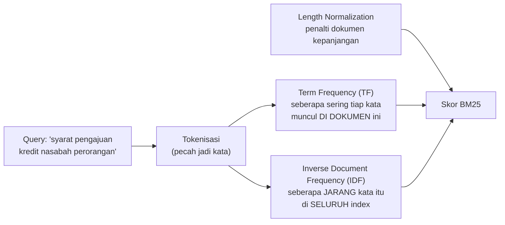

# Module 18: BM25 Search — Pencarian Kata Kunci di Samping Vector Search

## Tujuan

Menambahkan **BM25** (pencarian lexical/kata kunci) sebagai kemampuan baru di `VectorStore`, di samping vector search yang sudah ada sejak Module 13 — lewat method baru `search_bm25()`. Module ini juga menambah switch `search_method` (`"vector"` atau `"bm25"`) ke `/chat/stream`, supaya BM25 bisa langsung dicoba di alur chat sungguhan, bukan cuma lewat skrip terpisah — bandingkan dengan pola switch `use_rag` di Module 14 Bagian 2 Langkah 4. Menggabungkan BM25 dan vector search jadi satu (bukan pilih salah satu) lewat Reciprocal Rank Fusion (RRF) baru dibahas di Module 19, yang memperluas switch ini dengan opsi `"hybrid"`.

## Definisi

**BM25** adalah algoritma *lexical search* — mencocokkan **kata** secara harfiah antara query dan dokumen, dibobot berdasarkan seberapa jarang/khas kata itu muncul di seluruh index (Bagian 2). Ini kebalikan dari **vector/semantic search** yang sudah dipakai sejak Module 13: vector search mencocokkan **makna**, bukan kata persis, lewat kemiripan embedding. Keduanya bukan dua pilihan yang saling menggantikan, melainkan **saling melengkapi** — BM25 kuat di istilah eksak ("KTP", "NPWP") yang justru sering "diencerkan" maknanya oleh vector search, sementara vector search kuat menangkap parafrase yang tidak pernah bisa ditangkap BM25 sama sekali (Bagian 1).



## Hasil Akhir yang Diharapkan

- `VectorStore` punya method baru `search_bm25()`, tanpa perlu reindex `nala-docs`
- Untuk query kata kunci eksak ("KTP", "NPWP", "slip gaji"), hasil BM25 terbukti berbeda urutan dibanding vector murni (Module 13)
- Kita paham kenapa vector search murni bisa kalah oleh chunk pendek yang cuma "mirip" secara makna, dan kenapa BM25 menutup celah itu
- Kita paham cara kerja BM25 (TF, IDF, length normalization) lewat contoh sederhana dan kasus nyata NALA
- `/chat/stream` (satu-satunya endpoint chat NALA sejak Module 8) punya field baru `search_method` (`"vector"` default, atau `"bm25"`) — user bisa membandingkan langsung dua metode retrieval dari UI/curl yang sama, tanpa perlu masuk ke container

## 1. Kenapa Vector Search Murni Tidak Cukup

Module 15 Bagian 9 sudah mendokumentasikan kasus nyata yang jadi motivasi module ini. Pertanyaan *"Apa saja syarat pengajuan kredit untuk nasabah perorangan?"* punya jawaban lengkap di `sop-pengajuan-kredit.md`, tepat di chunk `### 2.1 Untuk Nasabah Perorangan` — tapi chunk itu baru berperingkat **#11 dari 14 chunk** saat vector search murni dijalankan, jauh di luar jangkauan `top_k=6` yang dipakai Module 15 (Bagian 8 Langkah 4). Chunk heading pendek (`## 2. Syarat dan Ketentuan Pengajuan Kredit`) justru mendapat *similarity score* lebih tinggi, karena vektornya "tajam" (fokus ke satu makna singkat), sementara chunk jawaban yang panjang (berisi KTP, KK, slip gaji, NPWP, usia, dst) menghasilkan vektor yang "diencerkan" oleh banyak sub-konsep sekaligus.

NALA saat itu tidak salah menjawab — dengan `top_k=3` yang dipakai Module 19 nanti, chunk jawaban yang tepat memang tidak pernah terlihat sama sekali. Menaikkan `top_k` ke 11 bukan solusi murah: mayoritas dari 11 chunk itu tidak relevan, dan mengirim itu semua ke `llama3.2:3b` (context window terbatas) berisiko mengencerkan fokus model, bukan membantunya.

**Akar masalahnya**: vector search murni bagus untuk menangkap *makna* (nasabah bertanya "syarat kredit", dokumen bicara "dokumen yang dibutuhkan" — beda kata, makna dekat), tapi lemah menangkap **kecocokan kata kunci eksak** — istilah seperti "KTP", "NPWP", "slip gaji", atau nomor SOP justru lebih baik ditangkap oleh pencarian lexical (keyword matching) klasik seperti **BM25**. Kedua metode punya kelemahan yang saling melengkapi:

| | Vector Search (semantic) | BM25 (lexical) |
|---|---|---|
| Kuat di | Makna yang mirip walau kata beda ("syarat kredit" ≈ "dokumen yang dibutuhkan") | Kecocokan istilah eksak ("KTP", "NPWP", nomor SOP) |
| Lemah di | Chunk pendek/heading bisa "menang" dibanding chunk panjang yang relevan (kasus di atas) | Tidak paham sinonim atau parafrase sama sekali |
| Butuh | Model embedding (`nomic-embed-text`) | Index teks biasa (sudah ada sejak Module 13 — field `text` di mapping `nala-docs`) |

Module ini membangun BM25 sebagai sinyal pelengkap. Module 19 nanti yang menggabungkan (fusion) keduanya jadi satu daftar peringkat — ini bukan mengganti vector search, ini menambah satu sinyal lagi supaya chunk yang relevan secara kata kunci *maupun* makna sama-sama punya kesempatan naik ke atas.

### Coba Langsung: Verifikasi Baseline Vector Search dengan Data Anda Sendiri

Angka "**#11 dari 14** chunk" di atas berasal dari index dan isi dokumen tertentu — bisa berbeda di komputer Anda tergantung dokumen apa saja yang sudah ter-*ingest*. Sebelum menulis kode apa pun di Bagian 4, jalankan dulu `search()` murni (vector, sudah ada sejak Module 13) untuk query yang sama, dan catat di posisi keberapa chunk `### 2.1 Untuk Nasabah Perorangan` muncul — ini baseline yang nanti dibandingkan lagi setelah `search_bm25()` ditulis:

```bash
docker compose exec api python -c "
from app.embeddings import embed_text
from app.vector_store import VectorStore

store = VectorStore(base_url='http://opensearch:9200', index_name='nala-docs')
query = 'Apa saja syarat pengajuan kredit untuk nasabah perorangan?'
query_embedding = embed_text(query, base_url='http://ollama:11434')

results = store.search(query_embedding, top_k=10)
for i, r in enumerate(results):
    print(i, round(r['score'], 4), '-', r['text'][:70])
"
```

✅ **Indikator sukses**: baris tercetak untuk tiap hasil — catat posisi (kalau muncul sama sekali di top-10) chunk `### 2.1 Untuk Nasabah Perorangan`. Angka ini yang jadi pembanding "sebelum" begitu `search_bm25()` selesai ditulis dan diuji di Bagian 4.

## 2. Apa itu BM25: Cara Kerja di Balik Layar

**BM25** (singkatan dari *Best Matching 25* — versi ke-25 dari rumus yang dikembangkan tim riset *information retrieval* mulai era 1970-1990an) adalah algoritma scoring standar untuk pencarian berbasis kata kunci, dipakai sebagai default oleh hampir semua search engine modern berbasis Lucene — termasuk OpenSearch dan Elasticsearch. Intuisinya sederhana: dokumen yang **lebih sering menyebut kata-kata dari query**, terutama kata-kata yang **jarang muncul** di seluruh koleksi dokumen (makanya lebih "khas"/informatif kalau sampai cocok), mendapat skor lebih tinggi.

Tiga komponen yang menyusun skor BM25 untuk satu dokumen relatif ke satu query:

- **Term Frequency (TF)** — seberapa sering tiap kata query muncul di dokumen itu. Makin sering, skor makin tinggi, tapi dengan efek jenuh (*saturating*): kata yang muncul 10 kali tidak otomatis dianggap 10× lebih relevan daripada yang muncul sekali — ada titik di mana pengulangan tambahan berhenti menaikkan skor secara linear.
- **Inverse Document Frequency (IDF)** — seberapa **jarang** kata itu muncul di seluruh index. Kata umum seperti "dan", "yang", "untuk" muncul di hampir semua dokumen sehingga kontribusinya ke skor kecil. Kata spesifik seperti "NPWP" atau "perorangan", yang cuma muncul di segelintir chunk, punya IDF tinggi — kecocokan dengan kata semacam ini jauh lebih bermakna secara statistik.
- **Length normalization** — dokumen yang jauh lebih panjang dari rata-rata index dikenai penalti ringan, supaya dokumen panjang tidak otomatis menang cuma karena secara kebetulan punya peluang lebih besar mengandung kata-kata query di suatu tempat.

Ketiganya digabung dalam formula:

```
BM25(D, Q) = Σ IDF(qᵢ) × [f(qᵢ,D) × (k1+1)] / [f(qᵢ,D) + k1 × (1 - b + b × |D|/avgdl)]
```

di mana `f(qᵢ,D)` adalah frekuensi kata `qᵢ` di dokumen `D`, `|D|` panjang dokumen `D`, `avgdl` rata-rata panjang dokumen di seluruh index, dan `k1`/`b` adalah konstanta tuning yang mengatur seberapa besar efek saturasi TF (`k1`) dan penalti panjang dokumen (`b`) — OpenSearch memakai default `k1=1.2`, `b=0.75`, dan module ini **tidak** men-tuning nilai itu secara khusus.


### Perbedaan Paling Mendasar dengan Vector Search

BM25 menghitung skor dari **kehadiran kata secara literal** (setelah tokenisasi dasar — lihat Bagian 3 soal keterbatasan analyzer) — ia tidak tahu apa pun soal makna. Kata "kredit" dan "pinjaman" dianggap sepenuhnya berbeda oleh BM25, walau maknanya dekat; di sinilah **vector search justru unggul**, karena embedding menangkap kedekatan makna (Module 13). Tapi sebaliknya, BM25 kebal terhadap masalah "vektor diencerkan" yang jadi akar masalah di Bagian 1: skor BM25 untuk sebuah chunk naik proporsional dengan seberapa banyak kata **query** yang cocok persis di dalamnya, tidak peduli topik lain apa saja yang ikut dibahas di chunk itu — beda dengan vector search yang merangkum **seluruh** isi chunk jadi satu vektor tunggal.

**Contoh sederhana dulu**, sebelum kembali ke kasus NALA — bayangkan tiga kalimat pendek yang sudah di-index (bukan dari dokumen NALA, murni ilustrasi generik supaya intuisinya jelas lebih dulu):

- Dokumen A: "Seekor kucing hitam duduk di atas meja."
- Dokumen B: "Anjing coklat berlari mengejar bola di taman."
- Dokumen C: "Kucing putih dan kucing hitam bermain bersama di taman."

Query: *"kucing hitam duduk"*

| Token dari query | Muncul di dokumen mana saja? | IDF (makin jarang, makin tinggi) |
|---|---|---|
| "kucing" | A (1×), C (2×) — ada di 2 dari 3 dokumen | Sedang |
| "hitam" | A (1×), C (1×) — ada di 2 dari 3 dokumen | Sedang |
| "duduk" | Cuma A (1×) — ada di 1 dari 3 dokumen | **Tinggi** — kata paling langka, paling diskriminatif |

Dokumen A cocok dengan **ketiga** kata query, termasuk kata paling langka "duduk" — BM25 kemungkinan besar memberi skor tertinggi ke Dokumen A. Dokumen C memang menyebut "kucing hitam" (bahkan "kucing" dua kali), tapi sama sekali tidak menyebut "duduk" — kata yang justru paling informatif di query ini, karena paling jarang muncul di seluruh koleksi. Inilah kenapa IDF penting: kecocokan pada kata langka lebih dari sekadar kecocokan pada kata umum yang muncul di mana-mana.

**Sekarang kembali ke kasus NALA** — intuisi yang sama persis berlaku, cuma skalanya lebih besar (belasan-puluhan potongan dokumen, bukan 3 kalimat) dan istilahnya spesifik domain finansial, bukan "kucing"/"anjing". Sebagai pengingat: dokumen SOP NALA sudah dipecah jadi beberapa **chunk** berdasarkan heading Markdown-nya (`chunk_markdown()`, Module 15) — satu chunk yang jadi contoh berulang di module ini berjudul `### 2.1 Untuk Nasabah Perorangan`, potongan dari `sop-pengajuan-kredit.md` yang berisi daftar syarat dokumen (KTP, KK, slip gaji, dst). Untuk query yang dipakai berulang di module ini — *"Apa saja syarat pengajuan kredit untuk nasabah perorangan?"* — begini token-token kuncinya cocok dengan chunk itu:

| Token dari query | Muncul di chunk `### 2.1`? | Kontribusi ke skor BM25 |
|---|---|---|
| "perorangan" | ✅ — persis di judul heading-nya | **Tinggi** — kata paling khas, jarang muncul di chunk lain sepanjang index |
| "nasabah" | ✅ — persis di judul heading-nya | **Tinggi** — IDF tinggi, tidak muncul di banyak chunk lain |
| "syarat" | ✅ — bagian dari konteks section 2 | Sedang |
| "pengajuan" | Mungkin muncul juga di chunk lain | Sedang |
| "kredit" | Muncul di hampir semua chunk (topik seluruh dokumen ini memang kredit) | **Rendah** — IDF rendah, kata ini terlalu umum di index ini untuk jadi pembeda |

Persis seperti "duduk" di contoh kucing tadi: "perorangan" dan "nasabah" adalah kata paling diskriminatif (jarang, spesifik) di query ini — itulah yang mendorong BM25 memberi skor tinggi ke chunk `### 2.1`, konsisten dengan angka pengujian nyata di Module 19 Bagian 4: BM25 menempatkan chunk ini di peringkat **#4 dari 14** chunk, jauh lebih tinggi dibanding vector search murni yang menaruhnya di peringkat **#11 dari 14** (Bagian 1) — bukti langsung bahwa BM25 dan vector search benar-benar menilai relevansi lewat mekanisme yang sama sekali berbeda, bukan cuma varian dari hal yang sama.

### Coba Langsung: Lihat Skor BM25 Mentah dari OpenSearch

Tidak perlu menunggu sampai `search_bm25()` ditulis di Bagian 4 untuk melihat BM25 bekerja — OpenSearch sudah punya kemampuan ini sejak index `nala-docs` dibuat (Module 13), karena field `text` di mapping-nya bertipe `text` (bukan `knn_vector`). Query `match` di bawah ini langsung memanggil BM25 bawaan OpenSearch lewat REST API biasa, tanpa satu baris kode Python aplikasi pun:

```bash
curl -s -X POST "http://localhost:9200/nala-docs/_search" \
  -H "Content-Type: application/json" \
  -d '{
    "size": 5,
    "query": { "match": { "text": "syarat pengajuan kredit nasabah perorangan" } }
  }' | python3 -m json.tool
```

Perhatikan field `"_score"` di tiap hasil — **itulah** angka yang dihasilkan formula BM25 di atas, dihitung OpenSearch di balik layar dari TF, IDF, dan length normalization tiap chunk relatif ke lima kata di query. Chunk dengan `_score` tertinggi ditaruh paling atas.

⚠️ **Catatan jujur**: dengan `size: 5`, chunk `### 2.1 Untuk Nasabah Perorangan` **belum tentu** langsung terlihat di lima hasil teratas — pada pengujian nyata ke data NALA (32 chunk: 3 SOP + 1 catatan cabang), chunk ini baru muncul di posisi **#6 dari 21** dokumen yang cocok, kalah dari heading section `## 2. Syarat dan Ketentuan Pengajuan Kredit` (skor 7.53) yang literal mengandung kata "syarat", "pengajuan", "kredit" sekaligus di judulnya — walau heading itu sendiri tidak berisi jawaban detail (KTP, KK, slip gaji, dst). Ini bukan kegagalan BM25, ini **bukti nyata** kenapa BM25 sendirian juga belum cukup (motivasi Module 19 menggabungkannya dengan vector search).

Kalau ingin tampilan lebih ringkas (cuma skor + potongan teks, tanpa metadata JSON penuh), pakai versi Python ini lewat container `api`:

```bash
docker compose exec api python -c "
import httpx

response = httpx.post(
    'http://opensearch:9200/nala-docs/_search',
    json={
        'size': 5,
        'query': {'match': {'text': 'syarat pengajuan kredit nasabah perorangan'}},
    },
)
for hit in response.json()['hits']['hits']:
    print(round(hit['_score'], 3), '-', hit['_source']['text'][:70])
"
```

✅ **Indikator sukses**: lima baris tercetak, terurut dari skor BM25 tertinggi ke terendah — bandingkan urutan ini dengan hasil `store.search()` (vector, Module 13) untuk query yang sama persis; urutannya kemungkinan besar berbeda, bukti konkret bahwa kedua metode benar-benar menilai relevansi dengan cara berbeda, persis seperti yang dijelaskan di atas.

⚠️ Ini **query mentah langsung ke OpenSearch** — belum lewat `VectorStore`, belum jadi bagian alur `/chat/stream` mana pun. Tujuannya murni eksplorasi supaya konsep BM25 di atas terasa nyata sebelum masuk ke kode aplikasi yang sesungguhnya di Bagian 4 (`search_bm25()`, yang membungkus query yang sama ini jadi method Python yang bisa dipanggil ulang).

### Coba Langsung: Cari Posisi Pasti Chunk Target di Data Anda

`size: 5` di atas cukup untuk melihat skor BM25 bekerja, tapi tidak cukup untuk **membuktikan** di posisi keberapa persis chunk yang Anda harapkan (`### 2.1 Untuk Nasabah Perorangan`) berada di antara **semua** dokumen yang cocok — kalau posisinya di luar 5 besar, `size: 5` cuma akan membuatnya terlihat "tidak ditemukan", padahal sebenarnya cuma belum ditampilkan. Naikkan `size` supaya semua hasil ikut kembali:

```bash
curl -s "http://localhost:9200/nala-docs/_search" -H "Content-Type: application/json" -d '{
  "size": 15,
  "_source": ["text","metadata"],
  "query": { "match": { "text": "syarat pengajuan kredit nasabah perorangan" } }
}'
```

Dua angka yang perlu dibaca dari response JSON-nya:

- **`hits.total.value`** — jumlah **total** dokumen yang cocok (bukan cuma yang ditampilkan). Untuk query di atas, biasanya berkisar belasan-dua puluhan — karena `match` query BM25 default memakai operator `OR` antar kata, jadi chunk yang mengandung **minimal satu** dari lima kata query saja sudah dihitung "cocok", walau skornya rendah.
- **Posisi chunk target di `hits.hits[]`** — array ini sudah terurut `_score` tertinggi ke terendah. Cari elemen dengan `"_id": "sop-pengajuan-kredit.md-3"` (atau `doc_id` chunk lain yang Anda harapkan), lalu hitung indeksnya (0-based) di array itu.

Kalau ingin dihitung otomatis (bukan cari manual di JSON), pakai versi Python lewat container `api`, memakai `search_bm25()` yang baru selesai dibangun di Bagian 4 di bawah:

```bash
docker compose exec api python -c "
from app.vector_store import VectorStore
store = VectorStore(base_url='http://opensearch:9200', index_name='nala-docs')
results = store.search_bm25('syarat pengajuan kredit nasabah perorangan', top_k=21)
for i, r in enumerate(results):
    tanda = '  <== target' if r['_id'] == 'sop-pengajuan-kredit.md-3' else ''
    print(i, round(r['score'], 3), r['_id'], tanda)
"
```

✅ **Indikator sukses**: baris dengan `<== target` tercetak di suatu posisi — catat angkanya. Ganti `'sop-pengajuan-kredit.md-3'` dengan `doc_id` chunk lain sesuai dokumen yang sudah Anda ingest sendiri (lihat `_id` di hasil `_search` biasa untuk tahu format `doc_id`-nya: `<nama-file>-<nomor-chunk>`, Module 15 Bagian 8).

## 3. Catatan Penting: BM25 Tidak Butuh Reindex

Kabar baik: mapping index `nala-docs` yang dibuat `VectorStore.ensure_index()` sejak Module 13 **sudah** punya field `"text": {"type": "text"}` di samping `"embedding": {"type": "knn_vector", ...}` (lihat `app/vector_store.py`, method `ensure_index()`). Field `text` bertipe `text` inilah yang otomatis bisa di-*query* dengan BM25 lewat query `match` — OpenSearch (seperti Elasticsearch) memakai BM25 sebagai algoritma scoring default untuk field bertipe `text`, tanpa konfigurasi tambahan apa pun. Artinya: **BM25 di module ini murni penambahan, bukan migrasi** — index yang sudah terisi dari ingest sebelumnya (Module 17) tidak perlu di-*reindex* atau dihapus.

Satu keterbatasan yang jujur perlu disebut: mapping ini tidak menentukan *analyzer* khusus untuk field `text`, jadi OpenSearch memakai analyzer default (`standard`) — bukan analyzer Bahasa Indonesia dengan stemming (mis. memahami "mengajukan", "pengajuan", "diajukan" sebagai satu kata dasar yang sama). Konsekuensinya: BM25 di module ini menang di pencocokan **token eksak** ("KTP", "NPWP", "slip gaji" — persis kasus di Bagian 1), bukan karena ia memahami morfologi Bahasa Indonesia. Menambahkan analyzer `indonesian` (tersedia sebagai plugin analysis-nya OpenSearch) akan meningkatkan recall BM25 lebih jauh, tapi **butuh reindex total** (analyzer hanya berlaku untuk dokumen yang di-index setelah mapping diubah) — di luar cakupan module ini, dicatat di sini supaya tidak ada yang mengira ini sudah otomatis berjalan.

## 4. Struktur Kode: Tambah `search_bm25()` di `app/vector_store.py`

### Prasyarat & Setup Sebelum Mulai

- Sudah menyelesaikan **Module 17** (`Nala/` berjalan lengkap: chat UI, streaming/multi-turn, upload, embedding/vector store, chunking, Airflow, RAG chain)
- Docker Desktop sudah dialokasikan resource yang cukup — minimal 16GB RAM (sama seperti kebutuhan sejak Module 12-17); module ini sendiri tidak menambah service Docker baru, jadi belum perlu menaikkan alokasi lagi

`Nala/` sudah dibangun bertahap sejak Module 1 dan berjalan lengkap sampai akhir Module 17 — module ini melanjutkan **edit langsung di folder yang sama** (`Nala/`), tidak ada folder baru yang perlu dibuat atau disalin. Sepanjang seluruh kurikulum hanya ada **satu** folder kode: `Nala/`.

Container dan volume Docker (`ollama`, `opensearch`, `airflow`, dst) yang sudah berjalan sejak Module 7-17 tetap dipakai apa adanya di module ini. Masuk ke folder dan jalankan service yang relevan:

```bash
cd Nala
docker compose up --build ollama opensearch api
```

Tiga service ini sudah pernah dijalankan sebelumnya — kalau model `llama3.2:3b` dan `nomic-embed-text` sudah pernah di-*pull* ke volume `ollama_data` sebelumnya, tidak perlu di-*pull* ulang (volume Docker persisten, selama tidak dihapus). Verifikasi:

```bash
docker compose exec ollama ollama list
```

Kalau `llama3.2:3b` dan `nomic-embed-text` sudah muncul, lanjut ke Langkah 1. Kalau belum, ulangi `docker compose exec ollama ollama pull <nama-model>` untuk masing-masing (lihat Module 2 materi.md (bagian Panduan Praktik) dan Module 11 materi.md untuk detail model yang dipakai).

Pastikan juga index `nala-docs` di OpenSearch masih terisi dari ingest sebelumnya:

```bash
curl http://localhost:9200/nala-docs/_count
```

Kalau `count` bernilai `0` (index kosong, misalnya karena volume `opensearch_data` baru), jalankan ulang ingest:

```bash
docker compose exec api python -c "from app.ingest import ingest_documents; print(ingest_documents('/app/knowledge-base'))"
```

**Langkah 1 — Tambah method `search_bm25()`**

```python
# app/vector_store.py
def search_bm25(self, query_text: str, top_k: int = 10) -> list[dict]:
    with httpx.Client() as client:
        response = client.post(
            f"{self.base_url}/{self.index_name}/_search",
            json={
                "size": top_k,
                "query": {"match": {"text": query_text}},
            },
            timeout=30.0,
        )
        response.raise_for_status()
        hits = response.json()["hits"]["hits"]
        return [
            {
                "_id": hit["_id"],
                "text": hit["_source"]["text"],
                "score": hit["_score"],
                "metadata": hit["_source"]["metadata"],
            }
            for hit in hits
        ]
```

Perhatikan kemiripannya dengan `search()` (Module 13): bedanya cuma bagian `query` — `{"match": {"text": query_text}}` (BM25 lexical, mencari `query_text` mentah, bukan embedding) menggantikan `{"knn": {...}}`. Ini query BM25 paling dasar di OpenSearch — tidak butuh konfigurasi index tambahan (lihat Bagian 3), field `text` sudah otomatis punya scoring BM25 bawaan.

**`_id` disertakan sejak awal** (bukan cuma `text`/`score`/`metadata` seperti `search()` versi Module 13) — ini identitas unik dokumen di OpenSearch, dibutuhkan Module 19 nanti untuk mencocokkan dokumen yang sama di dua daftar hasil (BM25 dan vector) saat fusion. Module ini belum memakainya, tapi menyertakannya sejak awal supaya `search_bm25()` tidak perlu diubah lagi nanti.

**▶️ Jalankan & lihat hasilnya**

```bash
docker compose up --build api
```

```bash
docker compose exec api python -c "
from app.vector_store import VectorStore
store = VectorStore(base_url='http://opensearch:9200', index_name='nala-docs')
results = store.search_bm25('syarat KTP NPWP slip gaji', top_k=5)
for r in results:
    print(r['score'], '-', r['text'][:60])
"
```

✅ **Indikator sukses**: tidak ada error, dan hasil teratas berisi kata-kata yang cocok persis dengan query ("KTP", "NPWP", "slip gaji") — bandingkan dengan hasil `store.search()` (vector) untuk query yang sama, urutannya kemungkinan besar berbeda.

<details>
<summary><strong>Pakai Claude Code? Salin prompt berikut, paste untuk eksekusi Langkah 1</strong></summary>

```
Tambah method baru search_bm25() di VectorStore (Module 18, Langkah 1)
— belum dipakai endpoint apa pun.

GOAL:
- Di Nala/app/vector_store.py, tambah method baru
  search_bm25(self, query_text: str, top_k: int = 10) -> list[dict]:
  POST ke {base_url}/{index_name}/_search dengan body {"size": top_k,
  "query": {"match": {"text": query_text}}}, parse hits, return list
  of dict {_id, text, score, metadata} (termasuk _id sejak awal, sama
  seperti pola yang dipakai search()).

CONTEXT:
- File ini (`app/vector_store.py`) sudah ada di `Nala/` sejak
  Module 13 — edit langsung di file yang sama, tidak ada folder lain
  yang perlu disalin.
- Field "text" di mapping index nala-docs (dibuat ensure_index())
  sudah bertipe "text" sejak Module 13 — BM25 bisa langsung dipakai
  tanpa reindex.
- _id disertakan sejak awal karena Module 19 nanti butuh identitas
  unik ini untuk mencocokkan dokumen antar dua daftar hasil saat
  fusion — belum dipakai di module ini.

GUARDRAIL:
- JANGAN ubah search() yang sudah ada.
- JANGAN ubah ensure_index() atau index_document().
- JANGAN sentuh app/main.py di langkah ini.
```

</details>

**📄 Kode lengkap** (`app/vector_store.py`, versi setelah Module 18):

```python
from urllib.parse import quote

import httpx


class VectorStore:
    def __init__(self, base_url: str, index_name: str):
        self.base_url = base_url
        self.index_name = index_name

    def ensure_index(self, dims: int = 768) -> None:
        with httpx.Client() as client:
            check = client.head(f"{self.base_url}/{self.index_name}", timeout=10.0)
            if check.status_code == 200:
                return
            response = client.put(
                f"{self.base_url}/{self.index_name}",
                json={
                    "settings": {"index": {"knn": True}},
                    "mappings": {
                        "properties": {
                            "text": {"type": "text"},
                            "embedding": {
                                "type": "knn_vector",
                                "dimension": dims,
                            },
                            "metadata": {"type": "object"},
                        }
                    },
                },
                timeout=30.0,
            )
            response.raise_for_status()

    def index_document(
        self, doc_id: str, text: str, embedding: list[float], metadata: dict
    ) -> None:
        with httpx.Client() as client:
            response = client.put(
                f"{self.base_url}/{self.index_name}/_doc/{quote(doc_id, safe='')}",
                json={"text": text, "embedding": embedding, "metadata": metadata},
                params={"refresh": "true"},
                timeout=30.0,
            )
            response.raise_for_status()

    def search(self, query_embedding: list[float], top_k: int = 3) -> list[dict]:
        with httpx.Client() as client:
            response = client.post(
                f"{self.base_url}/{self.index_name}/_search",
                json={
                    "size": top_k,
                    "query": {
                        "knn": {"embedding": {"vector": query_embedding, "k": top_k}}
                    },
                },
                timeout=30.0,
            )
            response.raise_for_status()
            hits = response.json()["hits"]["hits"]
            return [
                {
                    "text": hit["_source"]["text"],
                    "score": hit["_score"],
                    "metadata": hit["_source"]["metadata"],
                }
                for hit in hits
            ]

    def search_bm25(self, query_text: str, top_k: int = 10) -> list[dict]:
        with httpx.Client() as client:
            response = client.post(
                f"{self.base_url}/{self.index_name}/_search",
                json={
                    "size": top_k,
                    "query": {"match": {"text": query_text}},
                },
                timeout=30.0,
            )
            response.raise_for_status()
            hits = response.json()["hits"]["hits"]
            return [
                {
                    "_id": hit["_id"],
                    "text": hit["_source"]["text"],
                    "score": hit["_score"],
                    "metadata": hit["_source"]["metadata"],
                }
                for hit in hits
            ]
```

⚠️ **Catatan**: `search()` di atas **belum** punya key `_id` — itu baru ditambahkan di Module 19 Langkah 1, khusus supaya RRF bisa mencocokkan dokumen yang sama di dua daftar hasil. Module ini tidak menyentuh `search()` sama sekali.

### Troubleshooting

- **`search_bm25()` melempar error field `text` tidak ditemukan / query `match` gagal**: index `nala-docs` yang dipakai kemungkinan dibuat sebelum field `text` ada di mapping (versi index yang sangat lama) — hapus dan buat ulang index (`curl -X DELETE http://localhost:9200/nala-docs`) lalu jalankan ulang `ingest_documents()` (lihat Prasyarat & Setup Sebelum Mulai di atas).
- **Port sudah dipakai (8000/9200/11434)**: ubah mapping port yang bentrok di `docker-compose.yml`, atau pastikan container lama sudah benar-benar dimatikan (`docker compose down` di `Nala`).
- **`docker compose exec ollama ollama list` tidak menampilkan model**: model belum pernah di-pull ke volume container ini — jalankan ulang `docker compose exec ollama ollama pull <nama-model>` (lihat Prasyarat & Setup Sebelum Mulai di atas).

## 5. Switch `search_method`: Pilih BM25 atau Vector Search di `/chat/stream`

Sejauh ini `search_bm25()` cuma bisa dicoba lewat skrip Python terpisah (Bagian 4) — belum bisa dipakai lewat `/chat/stream` sungguhan. Langkah ini menambah switch `search_method` ke `ChatStreamRequest`, mengikuti pola yang sama dengan switch `use_rag` (Module 14 Bagian 2 Langkah 4): sebuah field request yang membiarkan **user** memilih, bukan hardcode di kode.

**Langkah 2 — Tambah field `search_method` dan cabang retrieval di `app/main.py`**

```python
# app/main.py
from typing import Literal


class ChatStreamRequest(BaseModel):
    messages: list[ChatMessage]
    use_rag: bool = True
    search_method: Literal["vector", "bm25"] = "vector"
```

`Literal["vector", "bm25"]` (bukan `str` biasa) memaksa FastAPI/Pydantic menolak request dengan nilai selain dua itu (respons `422`, bukan diam-diam diterima lalu error di tempat lain) — validasi ini didapat gratis tanpa kode tambahan. `= "vector"` sebagai default penting dengan alasan yang sama seperti `use_rag`: request lama tanpa field ini tetap valid dan tetap berperilaku seperti sebelumnya (vector search, Module 15).

Ubah blok retrieval di `chat_stream()` supaya bercabang berdasarkan `search_method`:

```python
# app/main.py, di dalam chat_stream(), menggantikan blok try/except yang ada
    if request.use_rag:
        try:
            if request.search_method == "bm25":
                results = vector_store.search_bm25(last_user_message, top_k=6)
            else:
                query_embedding = embed_text(last_user_message, base_url=OLLAMA_BASE_URL)
                results = vector_store.search(query_embedding, top_k=6)
        except httpx.HTTPError:
            results = []
    else:
        results = []
```

- **Cabang `"bm25"` tidak memanggil `embed_text()` sama sekali** — ini sengaja, bukan oversight. BM25 murni operasi teks di OpenSearch, tidak butuh model embedding apa pun. Konsekuensi nyata: `search_method="bm25"` menghemat satu panggilan Ollama dibanding `"vector"`, jadi biasanya sedikit lebih cepat — trade-off yang tidak selalu disadari kalau cuma baca teori BM25 vs vector.
- **Sisa logika grounding/fallback (`if results: ... else: ...`, Module 14) tidak berubah** — `search_bm25()` mengembalikan bentuk dict yang sama persis dengan `search()` (`text`, `score`, `metadata`, Bagian 4), jadi kode yang membaca `r["metadata"]["source"]`/`r["text"]` tetap jalan tanpa peduli metode mana yang dipakai.
- **`search_method` cuma relevan kalau `use_rag=True`** — kalau `use_rag=False`, kedua field retrieval (`search_method` apa pun) tidak pernah dibaca, konsisten dengan Module 14: mematikan RAG melewati retrieval sepenuhnya.

**▶️ Jalankan & lihat hasilnya**

```bash
docker compose up --build api
```

Bandingkan langsung — pertanyaan yang sama, dua metode berbeda:

```bash
curl -N -X POST http://localhost:8000/chat/stream \
  -H "Content-Type: application/json" \
  -d '{"messages": [{"role": "user", "content": "Apa saja syarat pengajuan kredit untuk nasabah perorangan?"}], "search_method": "vector"}'
```

```bash
curl -N -X POST http://localhost:8000/chat/stream \
  -H "Content-Type: application/json" \
  -d '{"messages": [{"role": "user", "content": "Apa saja syarat pengajuan kredit untuk nasabah perorangan?"}], "search_method": "bm25"}'
```

✅ **Indikator sukses**: kedua request sukses (bukan `422`), dan jawaban `search_method: "bm25"` terasa lebih menyebut detail spesifik (KTP, KK, slip gaji) dibanding `search_method: "vector"` — konsisten dengan hasil pengujian posisi chunk di Bagian 2. Coba juga kirim `"search_method": "salah-ketik"` — harus ditolak dengan status `422`, bukti validasi `Literal` bekerja.

<details>
<summary><strong>Pakai Claude Code? Salin prompt berikut, paste untuk eksekusi Langkah 2</strong></summary>

```
Tambah switch search_method ("vector"/"bm25") ke ChatStreamRequest dan
cabang retrieval di chat_stream() (Module 18, Bagian 5, Langkah 2).

GOAL:
- Di Nala/app/main.py:
  - Tambah `from typing import Literal` di baris import (kalau belum
    ada).
  - Tambah field search_method: Literal["vector", "bm25"] = "vector"
    ke ChatStreamRequest (model ini sudah punya field messages dan
    use_rag dari Module 14).
  - Di dalam chat_stream(), pada blok `if request.use_rag: try: ...`:
    tambah percabangan — kalau request.search_method == "bm25",
    panggil results = vector_store.search_bm25(last_user_message,
    top_k=6) (TANPA memanggil embed_text() sama sekali); selain itu
    (default "vector"), tetap panggil embed_text() lalu
    vector_store.search(query_embedding, top_k=6) seperti semula.

CONTEXT:
- search_bm25() sudah ada di app/vector_store.py sejak Bagian 4 module
  ini, return bentuknya sama persis dengan search() (list of dict
  dengan text/score/metadata) — logika grounding/fallback di bawah
  blok ini TIDAK perlu diubah.
- use_rag (Module 14) TETAP ada dan TIDAK berubah — search_method
  cuma relevan kalau use_rag=True.

GUARDRAIL:
- JANGAN ubah logika use_rag atau blok if/elif/else grounding-fallback
  di bawah blok retrieval.
- JANGAN ubah app/vector_store.py — search_bm25() sudah final dari
  Bagian 4.
- JANGAN sentuh chat.html di langkah ini kecuali diminta terpisah.
```

</details>

**Opsional — tambah dropdown di `chat.html`** supaya bisa dicoba dari browser, bukan cuma curl:

```html
<!-- app/templates/chat.html, di dekat toggle useRagToggle (Module 14) -->
<label class="search-method-select">
  Metode pencarian:
  <select id="searchMethodSelect">
    <option value="vector" selected>Vector (makna)</option>
    <option value="bm25">BM25 (kata kunci)</option>
  </select>
</label>
```

```javascript
// app/templates/chat.html, di dalam handler submit — menggantikan body Module 14
const useRag = document.getElementById("useRagToggle").checked;
const searchMethod = document.getElementById("searchMethodSelect").value;

const response = await fetch("/chat/stream", {
  method: "POST",
  headers: { "Content-Type": "application/json" },
  body: JSON.stringify({ messages: conversation, use_rag: useRag, search_method: searchMethod }),
});
```

⚠️ **Catatan forward-looking**: Module 19 nanti memperluas `Literal["vector", "bm25"]` menjadi `Literal["vector", "bm25", "hybrid"]` dan mengganti default-nya jadi `"hybrid"` — dropdown ini juga akan dapat opsi ketiga di sana. Switch ini sengaja dirancang supaya perluasan itu tinggal menambah satu opsi, bukan menulis ulang logikanya.

## 6. Checkpoint Praktik

Yang perlu dipastikan sebelum lanjut ke Module 19:

- [ ] `store.search_bm25()` mengembalikan hasil yang cocok kata kunci eksak dengan query
- [ ] Hasil `store.search_bm25()` terbukti berbeda urutan dibanding `store.search()` murni untuk query yang sama — chunk `### 2.1 Untuk Nasabah Perorangan` naik peringkat dibanding hasil vector murni di Bagian 1
- [ ] Kita paham komponen skor BM25 (TF, IDF, length normalization) dan kenapa itu berbeda mekanisme dari vector search
- [ ] `/chat/stream` menerima field `search_method` (`"vector"`/`"bm25"`), request dengan nilai lain ditolak `422`, dan `search_method="bm25"` terbukti tidak memanggil `embed_text()`
- [ ] `use_rag=False` tetap melewati retrieval sepenuhnya, tidak peduli nilai `search_method` apa pun (Module 14 tidak berubah)

Begitu kelima hal ini terverifikasi, lanjut ke Module 19 — menggabungkan `search_bm25()` dengan `search()` lewat Reciprocal Rank Fusion (RRF), lalu memperluas switch `search_method` ini dengan opsi `"hybrid"`.
