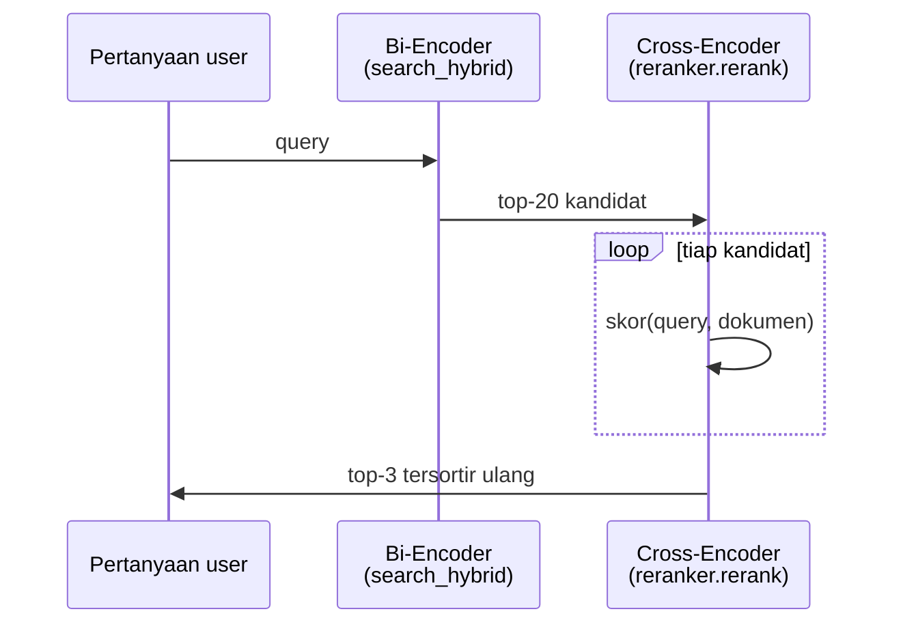
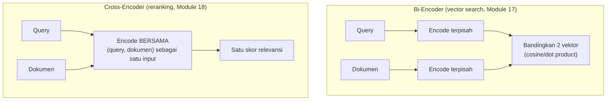
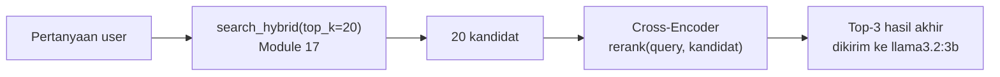

# Module 18: Reranking dengan Cross-Encoder

## Tujuan

Menambahkan cross-encoder reranking di atas kandidat top-20 hasil hybrid search Module 17, supaya urutan akhir yang dikirim ke LLM ditentukan oleh penilaian relevansi query-dokumen langsung, bukan cuma heuristik rank RRF.

## Definisi

**Reranking** adalah tahap tambahan setelah retrieval awal: alih-alih langsung memakai urutan hasil `search_hybrid()`, sekumpulan kandidat yang lebih besar (top-20) disortir ulang oleh model yang lebih presisi tapi lebih mahal, supaya top-K yang akhirnya dikirim ke LLM benar-benar yang paling relevan — bukan cuma yang menang secara heuristik RRF. Model presisi itu adalah **cross-encoder**: berbeda dari **bi-encoder** yang meng-encode query dan dokumen secara terpisah lalu membandingkan vektornya (cepat, karena vektor dokumen bisa dihitung sekali di awal dan disimpan), cross-encoder meng-encode pasangan (query, dokumen) sebagai satu input tunggal ke model, sehingga skor relevansinya jauh lebih akurat — tapi harus dihitung ulang untuk setiap pasangan setiap kali ada query baru, sehingga tidak praktis dipakai untuk mencari dari seluruh index (Bagian 1).

Karena mahalnya itu, cross-encoder tidak menggantikan bi-encoder — keduanya dipakai berurutan dalam pola **retrieve-then-rerank** (Bagian 2): bi-encoder (lewat `search_hybrid`) tetap dipakai untuk menyaring ribuan dokumen jadi kandidat kecil dengan cepat, baru cross-encoder menyortir ulang kandidat sekecil itu dengan teliti. Trade-off yang muncul dari pembagian kerja ini — latensi tambahan dan kebutuhan compute yang lebih besar — dibahas jujur dengan angka di Bagian 6, karena reranking bukan peningkatan tanpa ongkos.



## Hasil Akhir yang Diharapkan

- `app/reranker.py` (class `Reranker`, method `rerank()`) berjalan lokal offline lewat `sentence-transformers`/`cross-encoder/ms-marco-MiniLM-L-6-v2`, model di-*pre-pull* dan tersimpan di volume `hf_cache`
- `/chat/stream` (satu-satunya endpoint chat NALA sejak Module 8) memanggil `search_hybrid(top_k=20)` lalu `reranker.rerank(top_k=3)`, dengan `RERANK_ENABLED` sebagai katup pengaman yang bisa dimatikan lewat env var
- Bug infrastruktur nyata sudah diperbaiki: `torch` dipin ke build CPU-only (`+cpu`) supaya image `api` ~1.6GB, bukan ~9.6GB akibat varian CUDA default
- Dibuktikan dengan uji nyata: kasus keras Module 17 Bagian 8 (chunk `### 2.1` di posisi #7-8) terselesaikan — jawaban `/chat/stream` jadi akurat 100% dan lengkap 8 item setelah reranking aktif
- Trade-off latensi tercatat jujur dengan angka (~39 detik dengan reranking vs ~18 detik tanpa), dan temuan bahwa tanpa reranking `llama3.2:3b` tidak konsisten — kadang jujur "tidak ditemukan", kadang mengarang jawaban dari konteks yang kurang tepat

## 1. Kenapa Hybrid Search Saja Belum Cukup

Module 17 memperbaiki *recall* — chunk yang benar sekarang punya peluang jauh lebih besar masuk ke dalam kandidat teratas, berkat kombinasi BM25 (kata kunci eksak) dan vector search (makna). Tapi RRF (Reciprocal Rank Fusion) yang menggabungkan keduanya adalah **heuristik peringkat**, bukan penilaian relevansi yang sesungguhnya membaca isi query dan dokumen bersamaan. RRF hanya tahu "dokumen X ada di peringkat ke-2 versi BM25 dan peringkat ke-5 versi vector" — ia tidak pernah benar-benar "membaca" apakah isi dokumen X memang menjawab pertanyaannya.

Ini bedanya **bi-encoder** (dipakai vector search) dan **cross-encoder** (dipakai reranking):



- **Bi-encoder** (`nomic-embed-text`, dipakai `embed_text()` sejak Module 11) meng-encode query dan setiap dokumen **secara terpisah** menjadi vektor, lalu membandingkan jaraknya. Ini yang membuatnya cepat — vektor dokumen bisa dihitung sekali di awal (saat ingest) dan disimpan; saat query datang, cuma query yang perlu di-encode, lalu dibandingkan matematis (cosine similarity) dengan vektor-vektor yang sudah ada. Konsekuensinya: model tidak pernah "melihat" query dan dokumen bersamaan — ini yang menyebabkan kasus Bagian 1 Module 17 (chunk heading pendek "menang" secara vektor walau isinya tidak menjawab pertanyaan).
- **Cross-encoder** meng-encode **pasangan** (query, dokumen) sebagai **satu input tunggal** ke model, menghasilkan satu skor relevansi langsung. Karena model melihat query dan dokumen bersamaan (bukan dibandingkan setelah encode terpisah), skornya jauh lebih akurat untuk menilai "apakah dokumen ini benar-benar menjawab query ini" — tapi harus dihitung ulang untuk **setiap pasangan** setiap kali ada query baru; tidak bisa dihitung sekali lalu disimpan seperti bi-encoder.

Inilah kenapa cross-encoder tidak dipakai untuk mencari dari seluruh index (terlalu lambat kalau harus dijalankan ke ribuan dokumen), tapi sangat cocok untuk **menyortir ulang kandidat yang jumlahnya sudah kecil** — persis yang disiapkan Module 17: `search_hybrid()` sudah bisa dipanggil dengan `top_k=20` untuk mengambil kandidat lebih besar, cukup kecil untuk di-cross-encode satu-satu dalam hitungan detik, tapi cukup besar untuk kemungkinan besar sudah mencakup dokumen yang benar-benar relevan.

## 2. Alur: Retrieve Top-20, Rerank ke Top-K



Pola ini disebut **retrieve-then-rerank**: tahap pertama (`search_hybrid`, murah dan cepat) mengambil kandidat dalam jumlah cukup besar dengan asumsi longgar (asal dokumen yang benar ada **di dalam** top-20, urutan persisnya belum penting) — tahap kedua (cross-encoder, lebih mahal tapi jauh lebih akurat) baru menyortir 20 kandidat itu untuk menentukan urutan final yang benar-benar dikirim ke LLM.

## 3. Pilihan Model Cross-Encoder untuk Lingkungan Offline

Karena NALA offline/private-first, reranking **tidak** memakai API cloud apa pun — modelnya berjalan lokal lewat library `sentence-transformers` (Python), memakai model cross-encoder yang sudah dilatih sebelumnya (*pretrained*) dan bisa diunduh sekali lalu dipakai tanpa koneksi internet selanjutnya.

| | `cross-encoder/ms-marco-MiniLM-L-6-v2` (default) | `BAAI/bge-reranker-base` (opsional) |
|---|---|---|
| Ukuran | ~80 MB | ~1.1 GB |
| Bahasa latih | Inggris (MS MARCO) | Multilingual (termasuk Indonesia) |
| Kecepatan CPU | Cepat — cocok untuk laptop training 16GB | Lebih lambat, model jauh lebih besar |
| Kualitas untuk teks SOP Indonesia | Cukup baik untuk kecocokan istilah/struktur, tapi tidak dilatih memahami nuansa Bahasa Indonesia | Lebih baik memahami makna dalam Bahasa Indonesia, karena memang dilatih multilingual |

Sama seperti keputusan `llama3.2:3b` vs `qwen2.5:7b` di README utama pelatihan ini, module ini memakai **`cross-encoder/ms-marco-MiniLM-L-6-v2` sebagai default** — bukan karena kualitasnya untuk Bahasa Indonesia sempurna, tapi karena ukurannya kecil dan cepat di CPU, penting mengingat prasyarat komputer pelatihan ini hanya menjamin **16GB RAM** untuk seluruh stack (Ollama + OpenSearch + Airflow + FastAPI + reranker + Langfuse di Module 20 nanti). Model ini tetap bekerja cukup baik di sini karena banyak istilah kunci di dokumen SOP NALA berupa kata benda/singkatan yang mirip lintas bahasa (KTP, NPWP, kredit, approval) — kelemahannya baru terasa untuk query yang butuh pemahaman struktur kalimat Bahasa Indonesia yang lebih dalam.

**Opsi upgrade** (khusus peserta dengan RAM 32GB+, sama seperti catatan `qwen2.5:7b` di README): ganti `model_name` jadi `BAAI/bge-reranker-base` untuk kualitas reranking Bahasa Indonesia yang lebih baik, dengan konsekuensi ukuran unduhan ~14x lebih besar dan waktu inferensi yang lebih lama per kandidat.

## 4. Dua Kendala Offline yang Wajib Diantisipasi

Sebelum menulis kode, dua hal ini **wajib** disiapkan supaya module ini benar-benar bisa dijalankan di ruang pelatihan tanpa internet stabil saat sesi berlangsung:

1. **Model harus di-*pull* lebih dulu, sama seperti `ollama pull`.** `CrossEncoder(model_name)` dari `sentence-transformers` otomatis mengunduh bobot model dari HuggingFace Hub saat **pertama kali** dipanggil — kalau ini terjadi tepat saat kita menjalankan `docker compose up`, seluruh kelas akan menunggu unduhan bersamaan (dan gagal total kalau koneksi ruangan lambat/putus). Solusinya sama seperti pola `ollama pull` yang sudah dikenal sejak modul-modul awal (Module 2): jalankan pengunduhan **sekali, secara eksplisit**, sebelum sesi hands-on dimulai (lihat Langkah 2 di bawah), dan simpan hasilnya di **volume Docker** (`HF_HOME`) supaya tidak perlu diunduh ulang setiap kali container di-*rebuild*.
2. **`sentence-transformers` menarik `torch` sebagai dependency** — menambah kira-kira 2GB+ ke image `api`, dan build pertama akan terasa jauh lebih lama dibanding modul-modul sebelumnya. Ini bagian dari trade-off compute yang dibahas di Bagian 6 — baik kita ketahui dari awal supaya tidak mengira proses `docker compose up --build` yang lama sebagai tanda ada yang salah.

## 5. Struktur Kode yang Ditambahkan

Dua Tahap: **Tahap A** membuat file baru `app/reranker.py`, berdiri sendiri, belum dipakai siapa pun. **Tahap B** mengubah `/chat/stream` (satu-satunya endpoint chat NALA) supaya memanggil `search_hybrid(top_k=20)` lalu `reranker.rerank(..., top_k=3)`.

**Prasyarat sebelum mulai:**
- Sudah menyelesaikan **Module 17** — `Nala/` sudah punya `search_hybrid()` bekerja dan terhubung ke `/chat/stream`.
- Naikkan alokasi RAM Docker Desktop untuk menampung reranker:

| Setting | Minimal | Direkomendasikan | Alasan |
|---|---|---|---|
| **Memory (RAM)** | 16 GB | 20 GB+ jika tersedia | `sentence-transformers` + `torch` dimuat ke memori container `api` sepanjang ia berjalan — bobot model reranker (~80MB untuk default `ms-marco-MiniLM-L-6-v2`) ditambah overhead library `torch` yang cukup besar, di atas beban Ollama + OpenSearch + Airflow yang sudah ada. |
| **CPUs** | 4 | 4+ | Reranking adalah beban CPU tambahan yang nyata — cross-encoder dihitung per pasangan query-dokumen setiap request. |
| **Disk image size** | 100 GB | 120 GB+ | Dependency `torch` (dari `sentence-transformers`) menambah beberapa GB lagi ke image `api`. |

### Tahap A — Buat `app/reranker.py`

**Langkah 1 — Tambah dependency ke `requirements.txt`**

```
--extra-index-url https://download.pytorch.org/whl/cpu
torch==2.6.0+cpu
sentence-transformers==3.2.1
```

**Apa itu `torch`?** **PyTorch** (biasa disingkat `torch`) adalah library machine learning open-source dari Meta, salah satu yang paling banyak dipakai di dunia untuk menjalankan dan melatih model deep learning (neural network). `sentence-transformers` (library yang menyediakan `CrossEncoder`) dibangun di atas PyTorch — ia butuh PyTorch untuk benar-benar menjalankan model cross-encoder (memuat bobot model, menghitung skor relevansi tiap pasangan query-dokumen). Analoginya: Ollama yang sudah dipakai sejak Module 2 juga menjalankan model LLM lewat mesin inferensi internal (mirip cara kerja PyTorch) — bedanya Ollama membungkus semua itu jadi satu binary siap pakai, sementara `sentence-transformers` di Python butuh PyTorch sebagai library terpisah untuk melakukan hal serupa di dalam kode kita sendiri.

⚠️ **Jebakan umum — `torch` polos menarik varian GPU/CUDA secara default.** Kalau `torch` cuma ditulis sebagai dependency biasa dari `sentence-transformers` (tanpa baris `--extra-index-url` dan pin versi `+cpu` di atas), `pip` akan memasang varian **CUDA** secara default dari PyPI — menambah **~8GB** library NVIDIA (`nvidia-cusparselt`, `nvidia-cudnn`, dst) yang **tidak pernah dipakai**, karena container `api` di training ini tidak punya akses GPU sama sekali (`torch.cuda.is_available()` akan selalu `False`). Akibatnya image `api` bisa membengkak sampai **~9.6GB** — untuk peserta yang unduh bersamaan di kelas, ini pemborosan bandwidth dan disk yang signifikan, tanpa manfaat apa pun. Baris `--extra-index-url https://download.pytorch.org/whl/cpu` mengarahkan `pip` ke index PyTorch resmi yang cuma berisi build CPU-only, dan `torch==2.6.0+cpu` memastikan versi yang cocok benar-benar tersedia di index itu (versi lebih lama seperti `2.5.x+cpu` **tidak tersedia** di index CPU untuk beberapa arsitektur — cek dulu index-nya kalau ingin pin versi lain). Dengan perbaikan ini, image `api` yang tadinya ~9.6GB turun jadi **~1.6GB** — perbedaan besar untuk sesi training dengan banyak peserta men-download bersamaan.

<details>
<summary><strong>Pakai Claude Code? Salin prompt berikut, paste untuk eksekusi Langkah 1</strong></summary>

```
Tambah dependency reranker (torch CPU-only + sentence-transformers) ke
requirements.txt (Module 18, Langkah 1).

GOAL:
Di Nala/requirements.txt, tambah persis 3 baris baru (jangan ubah
dependency lain yang sudah ada):
--extra-index-url https://download.pytorch.org/whl/cpu
torch==2.6.0+cpu
sentence-transformers==3.2.1

CONTEXT:
- requirements.txt ini dipakai Docker untuk build image `api`.
- --extra-index-url + pin +cpu WAJIB supaya pip mengambil build
  torch CPU-only, bukan varian CUDA default (~8GB lebih besar,
  tidak pernah dipakai karena container tidak punya akses GPU).
- app/reranker.py yang memakai sentence-transformers baru dibuat di
  Langkah 3 — langkah ini cuma menyiapkan dependency-nya.

GUARDRAIL:
- JANGAN tulis torch tanpa baris --extra-index-url atau tanpa pin
  +cpu — itu persis bug yang sedang dihindari module ini.
- JANGAN ubah dependency lain di requirements.txt.
```

</details>

**Langkah 2 — Siapkan volume cache HuggingFace dan pre-pull model**

Di `docker-compose.yml`, tambahkan environment variable `HF_HOME` dan volume baru untuk service `api`:

```yaml
# docker-compose.yml
services:
  api:
    # ...service api yang sudah ada...
    environment:
      # ...environment yang sudah ada (OLLAMA_BASE_URL, dst)...
      - HF_HOME=/app/.cache/huggingface
    volumes:
      # ...volume yang sudah ada (knowledge-base)...
      - hf_cache:/app/.cache/huggingface

volumes:
  # ...volume yang sudah ada (ollama_data, opensearch_data)...
  hf_cache:
```

`HF_HOME` memberi tahu `sentence-transformers`/HuggingFace di mana menyimpan model yang diunduh — dengan mengarahkannya ke volume bernama (`hf_cache`, bukan folder di dalam container yang hilang tiap `docker compose down`), model yang sudah diunduh sekali akan **tetap ada** walau container dihapus dan dibuat ulang (`docker compose up --build`).

⚠️ Jalankan `cd Nala && docker compose up --build api` untuk build ulang image dengan dependency baru sebelum lanjut — build ini akan terasa **jauh lebih lama** dari modul-modul sebelumnya, karena `sentence-transformers` menarik `torch` sebagai dependency (Bagian 4). Ini normal, bukan tanda ada yang salah; tunggu sampai selesai, jangan diinterupsi di tengah jalan (image yang setengah jadi bisa korup dan perlu diulang dari awal).

Setelah build selesai, pre-pull modelnya sekali secara eksplisit — perintah ini butuh koneksi internet (mengunduh dari HuggingFace Hub), tapi begitu selesai model tersimpan di volume `hf_cache` dan **tidak** diunduh ulang walau container di-*rebuild* (selama volume tidak dihapus):

```bash
docker compose exec api python -c "
from sentence_transformers import CrossEncoder
CrossEncoder('cross-encoder/ms-marco-MiniLM-L-6-v2')
print('Model reranker berhasil diunduh dan siap dipakai offline.')
"
```

✅ **Indikator sukses**: pesan konfirmasi tercetak tanpa error.

<details>
<summary><strong>Pakai Claude Code? Salin prompt berikut, paste untuk eksekusi Langkah 2</strong></summary>

```
Siapkan volume cache HuggingFace untuk reranker (Module 18, Langkah 2).

GOAL:
Di Nala/docker-compose.yml, service api:
1. Tambah environment HF_HOME=/app/.cache/huggingface ke daftar
   environment yang sudah ada (OLLAMA_BASE_URL, dst) — jangan hapus
   yang lama.
2. Tambah volume baru hf_cache:/app/.cache/huggingface ke daftar
   volumes service api yang sudah ada (knowledge-base, dst) — jangan
   hapus yang lama.
3. Tambah hf_cache ke daftar top-level volumes (sejajar dengan
   ollama_data, opensearch_data yang sudah ada).

CONTEXT:
- Volume ini menyimpan model cross-encoder yang di-pre-pull manual
  lewat `docker compose exec api python -c "..."` — itu perintah
  shell yang dijalankan manusia setelah build, BUKAN bagian dari
  kode yang perlu ditulis di langkah ini.
- Tanpa HF_HOME diarahkan ke volume bernama, model akan diunduh
  ulang setiap kali container di-rebuild.

GUARDRAIL:
- JANGAN hapus environment/volume service api yang sudah ada dari
  module-module sebelumnya — cuma tambah baris baru.
- JANGAN jalankan perintah pre-pull atau docker compose apa pun —
  langkah ini cuma mengubah docker-compose.yml.
```

</details>

**Langkah 3 — Buat `app/reranker.py`**

```python
# app/reranker.py
from sentence_transformers import CrossEncoder


class Reranker:
    def __init__(self, model_name: str = "cross-encoder/ms-marco-MiniLM-L-6-v2"):
        self.model = CrossEncoder(model_name)

    def rerank(self, query: str, candidates: list[dict], top_k: int = 3) -> list[dict]:
        if not candidates:
            return []

        pairs = [(query, c["text"]) for c in candidates]
        scores = self.model.predict(pairs)

        scored = [
            {**candidate, "rerank_score": float(score)}
            for candidate, score in zip(candidates, scores)
        ]
        scored.sort(key=lambda c: c["rerank_score"], reverse=True)
        return scored[:top_k]
```

- **`CrossEncoder(model_name)`** di `__init__`: memuat model ke memori **sekali** saat instance `Reranker` dibuat (lihat Tahap B, Langkah 4 — dibuat sebagai instance modul-level di `main.py`, sama seperti `ollama_client` dan `vector_store`), bukan setiap kali `rerank()` dipanggil — memuat ulang model tiap request akan sangat lambat.
- **`pairs = [(query, c["text"]) for c in candidates]`**: cross-encoder butuh input berupa **pasangan** teks — di sinilah bedanya dengan bi-encoder yang cuma butuh satu teks per pemanggilan.
- **`self.model.predict(pairs)`**: menjalankan cross-encoder untuk **semua pasangan sekaligus** (satu pemanggilan `predict()`, bukan loop `predict()` satu-satu) — `sentence-transformers` melakukan *batching* secara internal, lebih efisien dibanding memanggil model 20 kali terpisah.
- **`{**candidate, "rerank_score": ...}`**: setiap kandidat (dict hasil dari `search_hybrid()`, sudah punya `_id`, `text`, `score`, `metadata`, `rrf_score`) ditambah satu key baru `rerank_score` — key lama tidak hilang, jadi kalau perlu *debugging* nanti bisa dibandingkan `rrf_score` (skor sebelum reranking) dengan `rerank_score` (skor sesudah).
- **`candidates=[]` → return `[]`**: dijaga eksplisit di baris pertama — kalau `search_hybrid()` sebelumnya mengembalikan list kosong (index kosong/OpenSearch tak terjangkau), `predict([])` pada `sentence-transformers` bisa berperilaku tidak terduga (tergantung versi) alih-alih meng-crash dengan jelas; mengecek lebih dulu jauh lebih aman.

<details>
<summary><strong>Pakai Claude Code? Salin prompt berikut, paste untuk eksekusi Langkah 3</strong></summary>

```
Buat app/reranker.py dengan class Reranker berbasis CrossEncoder
(Module 18, Langkah 3) — belum dipakai endpoint apa pun.

GOAL:
Buat Nala/app/reranker.py:
- import CrossEncoder dari sentence_transformers
- class Reranker dengan __init__(self, model_name: str =
  "cross-encoder/ms-marco-MiniLM-L-6-v2") yang menyimpan
  self.model = CrossEncoder(model_name)
- method rerank(self, query: str, candidates: list[dict], top_k:
  int = 3) -> list[dict]: return [] kalau candidates kosong; kalau
  tidak, bikin pairs = [(query, c["text"]) for c in candidates],
  scores = self.model.predict(pairs), gabung tiap candidate dengan
  key baru "rerank_score" (float(score)), sort menurun berdasarkan
  rerank_score, return top_k pertama.

CONTEXT:
- requirements.txt dan docker-compose.yml (dependency + volume cache
  model) sudah disiapkan Langkah 1-2 — langkah ini cuma menulis file
  Python-nya.
- Model akan di-pre-pull manual lewat docker compose exec (Langkah 2)
  sebelum dipakai, bukan bagian dari kode ini.
- Kandidat yang dikirim ke rerank() nanti berasal dari
  vector_store.search_hybrid(top_k=20) (Module 17) — setiap dict
  kandidat sudah punya key _id, text, score, metadata, rrf_score.

GUARDRAIL:
- JANGAN ubah app/vector_store.py atau app/main.py di langkah ini —
  reranker.py berdiri sendiri dulu, wiring ke endpoint itu Langkah 4-5.
- JANGAN hapus key lama (_id, text, score, metadata, rrf_score) dari
  dict kandidat — cuma tambah rerank_score.
```

</details>

**▶️ Jalankan & lihat hasilnya**

```bash
docker compose up --build api
```

```bash
docker compose exec api python -c "
from app.embeddings import embed_text
from app.vector_store import VectorStore
from app.reranker import Reranker

store = VectorStore(base_url='http://opensearch:9200', index_name='nala-docs')
reranker = Reranker()

query = 'Apa saja syarat pengajuan kredit untuk nasabah perorangan?'
query_embedding = embed_text(query, base_url='http://ollama:11434')

candidates = store.search_hybrid(query, query_embedding, top_k=20, candidate_pool=20)
print('--- Urutan RRF (sebelum rerank) ---')
for c in candidates[:5]:
    print(round(c['rrf_score'], 4), '-', c['text'][:60])

reranked = reranker.rerank(query, candidates, top_k=5)
print('--- Urutan setelah rerank ---')
for r in reranked:
    print(round(r['rerank_score'], 4), '-', r['text'][:60])
"
```

✅ **Indikator sukses**: tidak ada error, dan **urutan** hasil di dua bagian output kemungkinan besar berbeda — bukti cross-encoder menilai ulang relevansi, bukan sekadar mempertahankan urutan RRF. Perintah ini butuh waktu beberapa detik lebih lama dibanding `search_hybrid()` saja di Module 17 (20 pasangan query-dokumen dihitung satu per satu oleh cross-encoder) — ini normal, dibahas lebih lanjut di Bagian 6.

### Tahap B — Wiring ke `/chat/stream`

**Langkah 4 — Tambah instance `Reranker` dan flag `RERANK_ENABLED` di `app/main.py`**

```python
# app/main.py — tambahan import
from app.reranker import Reranker

# app/main.py — tambahan dekat instance vector_store yang sudah ada
RERANK_ENABLED = os.environ.get("RERANK_ENABLED", "true").lower() == "true"
reranker = Reranker() if RERANK_ENABLED else None
```

`RERANK_ENABLED` (default `"true"`) sengaja dibuat bisa dimatikan lewat environment variable — lihat Bagian 6 kenapa ini bukan sekadar fitur opsional kosmetik, tapi katup pengaman kalau alokasi RAM laptop peserta mulai mepet begitu Module 20 (Langfuse) menambah beban lagi di atas stack yang sudah ada.

<details>
<summary><strong>Pakai Claude Code? Salin prompt berikut, paste untuk eksekusi Langkah 4</strong></summary>

```
Tambah instance Reranker dan flag RERANK_ENABLED di app/main.py
(Module 18, Langkah 4).

GOAL:
Di Nala/app/main.py:
1. Tambah `from app.reranker import Reranker` ke import yang sudah
   ada.
2. Dekat instance vector_store yang sudah ada, tambah dua baris:
   RERANK_ENABLED = os.environ.get("RERANK_ENABLED", "true").lower()
   == "true", lalu reranker = Reranker() if RERANK_ENABLED else None.

CONTEXT:
- app/reranker.py sudah dibuat Langkah 3 dengan class Reranker dan
  method rerank(query, candidates, top_k).
- RERANK_ENABLED adalah katup pengaman lewat environment variable —
  belum dipakai di chat_stream() sampai Langkah 5.

GUARDRAIL:
- JANGAN wiring ke chat_stream() di langkah ini — itu Langkah 5
  terpisah.
- JANGAN hardcode RERANK_ENABLED = True tanpa membaca env var —
  harus bisa dimatikan lewat environment variable tanpa mengubah
  kode.
```

</details>

**Langkah 5 — Ubah alur retrieval di `/chat/stream`**

```python
# app/main.py — di dalam chat_stream(), menggantikan pemanggilan search_hybrid(top_k=3) dari Module 17
try:
    query_embedding = embed_text(last_user_message, base_url=OLLAMA_BASE_URL)
    candidates = vector_store.search_hybrid(
        query_text=last_user_message,
        query_embedding=query_embedding,
        top_k=20,
    )
    results = reranker.rerank(last_user_message, candidates, top_k=3) if reranker else candidates[:3]
except httpx.HTTPError:
    results = []
```

Perubahan intinya: `search_hybrid()` sekarang dipanggil dengan `top_k=20` (bukan `3`) untuk mengambil **kandidat**, bukan hasil final — hasil final baru didapat setelah `reranker.rerank(..., top_k=3)` memangkasnya. Kalau `RERANK_ENABLED=false` (`reranker is None`), sistem tetap berjalan dengan mengambil 3 kandidat teratas versi RRF langsung (`candidates[:3]`) — bukan error, cuma kembali ke perilaku Module 17 tanpa reranking.

<details>
<summary><strong>Pakai Claude Code? Salin prompt berikut, paste untuk eksekusi Langkah 5</strong></summary>

```
Wiring Reranker ke /chat/stream (Module 18, Langkah 5).

GOAL:
Di fungsi chat_stream() Nala/app/main.py: ganti pemanggilan
vector_store.search_hybrid() yang top_k=3 (dari Module 17) jadi
top_k=20, simpan hasilnya ke variabel `candidates` (bukan `results`),
lalu tambah baris `results = reranker.rerank(last_user_message,
candidates, top_k=3) if reranker else candidates[:3]`.

CONTEXT:
- reranker dan RERANK_ENABLED sudah dibuat Langkah 4.
- vector_store.search_hybrid() sudah ada sejak Module 17.
- /chat/stream adalah satu-satunya endpoint chat NALA sejak Module 8
  — tidak ada endpoint /chat lain untuk diubah.
- Blok try/except httpx.HTTPError di sekitar retrieval TIDAK berubah
  strukturnya — cuma isi di dalam try yang berubah.

GUARDRAIL:
- JANGAN ubah logika fallback NALA_SYSTEM_PROMPT_NO_CONTEXT (dipicu
  kalau `results` kosong) — itu tetap sama persis dari Module 13.
- JANGAN ubah top_k lain di luar retrieval (mis. HISTORY_WINDOW atau
  system prompt building).
```

</details>

**▶️ Jalankan & lihat hasilnya**

```bash
docker compose up --build api
```

```bash
curl -N -X POST http://localhost:8000/chat/stream \
  -H "Content-Type: application/json" \
  -d '{"messages": [{"role": "user", "content": "Apa saja syarat pengajuan kredit untuk nasabah perorangan?"}]}'
```

✅ **Indikator sukses**: jawaban tetap akurat (menyebut item dari `### 2.1`) seperti Module 17, muncul bertahap seperti biasa (flag `-N`), dan **response time terasa lebih lama** — 20 kandidat sekarang di-cross-encode setiap request, dibanding Module 17 yang langsung memotong ke 3 lewat RRF saja. Perlambatan ini nyata dan diharapkan — dibahas jujur di Bagian 6 sebagai trade-off, bukan bug. Untuk membandingkan langsung dengan reranking dimatikan (`RERANK_ENABLED=false`) — termasuk contoh nyata hasilnya dan kenapa perilakunya tidak konsisten — lihat Bagian 8.

**📄 Kode lengkap Tahap B** (bagian relevan `app/main.py` setelah Module 18):

```python
# app/main.py — bagian setup (tambahan dari Module 18)
from app.reranker import Reranker

# ...
RERANK_ENABLED = os.environ.get("RERANK_ENABLED", "true").lower() == "true"
reranker = Reranker() if RERANK_ENABLED else None


@app.post("/chat/stream")
def chat_stream(request: ChatStreamRequest) -> StreamingResponse:
    if not request.messages or request.messages[-1].role != "user":
        raise HTTPException(
            status_code=400,
            detail="messages harus non-kosong dan elemen terakhir harus role 'user'",
        )

    recent = request.messages[-HISTORY_WINDOW:]
    last_user_message = recent[-1].content

    try:
        query_embedding = embed_text(last_user_message, base_url=OLLAMA_BASE_URL)
        candidates = vector_store.search_hybrid(
            query_text=last_user_message,
            query_embedding=query_embedding,
            top_k=20,
        )
        results = reranker.rerank(last_user_message, candidates, top_k=3) if reranker else candidates[:3]
    except httpx.HTTPError:
        results = []

    if results:
        context = "\n\n".join(r["text"] for r in results)
        system_prompt = NALA_SYSTEM_PROMPT
        grounded_content = f"Konteks:\n{context}\n\nPertanyaan: {last_user_message}"
    else:
        system_prompt = NALA_SYSTEM_PROMPT_NO_CONTEXT
        grounded_content = last_user_message

    ollama_messages = [{"role": "system", "content": system_prompt}]
    ollama_messages += [{"role": m.role, "content": m.content} for m in recent[:-1]]
    ollama_messages.append({"role": "user", "content": grounded_content})

    return StreamingResponse(
        ollama_client.chat_stream(ollama_messages), media_type="text/plain"
    )
```

### Troubleshooting

- **`ModuleNotFoundError: No module named 'sentence_transformers'`**: `requirements.txt` belum ditambah (Langkah 1) atau image belum di-*rebuild* setelah ditambah — jalankan `docker compose up --build api` (bukan cuma `docker compose up`, perubahan dependency butuh rebuild image).
- **Build `api` terasa sangat lama / seperti macet setelah menambah `sentence-transformers`**: normal — `torch` adalah dependency besar (lihat Bagian 4). Tunggu, jangan interupsi build di tengah jalan (image yang setengah jadi bisa korup dan perlu diulang dari awal).
- **`CrossEncoder(...)` gagal/timeout saat dipanggil pertama kali**: kemungkinan besar belum di-*pre-pull* (Langkah 2) dan koneksi internet ruangan lambat/putus saat container mencoba mengunduh otomatis. Jalankan ulang Langkah 2 secara manual dengan koneksi yang stabil.
- **Model reranker diunduh ulang setiap kali `docker compose up --build`**: volume `hf_cache` belum ter-mount dengan benar, atau `HF_HOME` belum di-set — cek `docker-compose.yml` service `api` sesuai Langkah 2 di atas.
- **Semua service terasa sangat lambat / laptop panas / container ter-*kill***: alokasi RAM Docker Desktop kurang — lihat bagian Prasyarat di awal Bagian 5, naikkan ke 20GB+ kalau tersedia.

## 6. Trade-off Reranking: Latensi dan Compute, Bukan Gratis

Reranking **selalu** menambah latensi dan beban CPU — ini bukan detail kecil, tapi konsekuensi langsung dari cara kerjanya (Bagian 1): cross-encoder harus dihitung ulang untuk setiap pasangan, setiap request, karena tidak bisa di-precompute seperti bi-encoder.

**Yang didapat:**
- Presisi di posisi teratas (top-3/5) yang dikirim ke LLM jauh lebih relevan — persis kasus Module 17 Bagian 1, cross-encoder yang benar-benar "membaca" query+dokumen bersamaan jauh lebih mungkin menaruh chunk `### 2.1` di posisi #1, bukan cuma "masuk 20 besar".
- Mengurangi risiko LLM "mengencerkan" jawabannya karena menerima chunk yang kurang relevan bersama chunk yang relevan.

**Yang dibayar:**
- **Latensi bertambah nyata** — 20 pasangan di-cross-encode setiap request, di atas latensi hybrid search (dua query OpenSearch) dan generation LLM yang sudah ada. Di CPU laptop training, ini bisa menambah beberapa ratus milidetik hingga low-seconds per request, tergantung spesifikasi.
- **Beban RAM/CPU tambahan** — model cross-encoder (`torch` + bobot model) tetap dimuat di memori sepanjang container `api` berjalan, di atas beban Ollama + OpenSearch + Airflow yang sudah ada sejak modul-modul sebelumnya. Ini alasan kenapa Bagian 5 Langkah 4 menyediakan `RERANK_ENABLED=false` sebagai katup pengaman — kalau alokasi RAM laptop peserta sudah mepet begitu Module 20 (Langfuse) menambah dua service lagi, mematikan reranking sementara adalah pilihan yang sah, bukan mengorbankan seluruh stack.
- **Bukan solusi ajaib untuk kandidat yang memang tidak ada** — reranking cuma menyortir ulang kandidat yang *sudah* diambil `search_hybrid()`. Kalau dokumen yang benar tidak pernah masuk ke top-20 sejak awal (kasus ekstrem, jarang terjadi setelah Module 17, tapi mungkin untuk dokumen yang sangat panjang/beragam), reranking tidak bisa menemukannya — ia cuma bisa menyortir apa yang sudah ada di tangannya.

Untuk NALA, trade-off ini diterima dengan kondisi: reranking aktif secara default (kualitas jawaban lebih penting untuk kasus SOP finance), tapi tersedia sebagai fitur yang bisa dimatikan (`RERANK_ENABLED=false`) tanpa mengubah kode, bukan sesuatu yang dipaksakan aktif di semua kondisi hardware.

## 7. Checkpoint Praktik

Langkah eksekusi lengkap (termasuk pre-pull model) ada di Bagian 5, Langkah 1-5. Yang perlu dipastikan sebelum lanjut ke Module 19:

- [ ] Model `cross-encoder/ms-marco-MiniLM-L-6-v2` sudah ter-*pre-pull* dan tersimpan di volume `hf_cache` (tidak diunduh ulang setiap `docker compose up --build`)
- [ ] `reranker.rerank()` menghasilkan urutan yang bisa berbeda dari urutan RRF `search_hybrid()` untuk query yang sama
- [ ] `/chat/stream` tetap menjawab akurat dengan reranking aktif, response time terasa lebih lama dibanding Module 17 (diharapkan, bukan bug)
- [ ] `RERANK_ENABLED=false` (di `docker-compose.yml` atau env var saat menjalankan) membuat sistem tetap berjalan tanpa reranking, bukan error

## 8. Hasil Uji Nyata: Kasus Keras Module 17 Bagian 8 Terselesaikan

Pertanyaan yang jadi kasus keras di Module 17 Bagian 8 — *"Apa saja syarat pengajuan kredit untuk nasabah perorangan?"* (chunk jawaban `### 2.1` cuma di posisi #7-8, tidak masuk `top_k=3` hybrid search) — diuji ulang lewat `/chat/stream` setelah reranking aktif:

```bash
curl -N -X POST http://localhost:8000/chat/stream \
  -H "Content-Type: application/json" \
  -d '{"messages": [{"role": "user", "content": "Apa saja syarat pengajuan kredit untuk nasabah perorangan?"}]}'
```

Teks balasan (diterima bertahap, ditulis di sini sebagai hasil akhir setelah digabung):

```
Berdasarkan konteks yang diberikan, syarat pengajuan kredit untuk nasabah perorangan adalah:

- Fotokopi KTP yang masih berlaku (masa berlaku minimal 6 bulan)
- Fotokopi Kartu Keluarga
- Fotokopi Surat Nikah atau Akta Cerai (jika sudah menikah/cerai)
- Slip gaji 3 bulan terakhir atau surat keterangan penghasilan dari pemberi kerja
- Rekening tabungan/buku rekening 3 bulan terakhir
- Surat Pernyataan Penghasilan yang ditandatangani di atas materai Rp 10.000
- NPWP (bagi pengajuan di atas Rp 500 juta)
- Usia minimal 21 tahun, maksimal 60 tahun pada saat pengajuan
```

Jawaban ini **akurat 100% dan lengkap** — kedelapan poin cocok persis dengan `### 2.1` di `sop-pengajuan-kredit.md`, termasuk detail "maksimal 60 tahun" yang sebelum ada grounding (Module 13) pernah dikarang jadi "65 tahun". Progres lengkap untuk pertanyaan yang sama, dari sebelum Module 17 sampai sini:

| Tahap | Hasil |
|---|---|
| Sebelum Module 17 (vector search murni, tanpa grounding) | Halusinasi — "65 tahun" (salah), syarat pendidikan yang tidak ada di dokumen (dikarang) |
| Module 17 (hybrid search) | Jujur "tidak ditemukan" — grounding bekerja, tapi chunk jawaban di posisi #7-8, tidak masuk top-3 |
| Module 18 (+ reranking) | **Akurat 100%, lengkap 8 item, "60 tahun" benar** |

**Trade-off latensi juga terbukti nyata, bukan cuma klaim teoretis**: request di atas makan waktu **~39 detik** end-to-end di CPU laptop training (20 kandidat di-cross-encode, ditambah waktu generasi `llama3.2:3b`) — jauh lebih lama dari Module 17 (hybrid search saja, tanpa reranking, biasanya di bawah beberapa detik). Ini persis peringatan Bagian 6: reranking bukan gratis, dan untuk kasus produksi nyata, latensi sebesar ini perlu dipertimbangkan matang — apakah pengguna bersedia menunggu ~40 detik demi jawaban yang akurat, atau perlu dioptimasi lebih lanjut (model reranker lebih kecil, kurangi `candidate_pool`, jalankan di background dengan indikator loading, dll — di luar cakupan module ini).

### Temuan Tambahan: Tanpa Reranking, Model Tidak "Jujur Tidak Tahu" — Ia Mengarang dari Konteks yang Salah

Perbandingan langsung dengan `RERANK_ENABLED=false` (kembali ke perilaku Module 17: `top_k=3` langsung dari RRF, tanpa penyortiran ulang) untuk pertanyaan yang sama menghasilkan sesuatu yang **berbeda** dari yang mungkin diduga:

```bash
# Jalankan instance kedua dengan reranking dimatikan, tanpa mengganggu container utama
docker compose stop api
docker compose run --rm -d -e RERANK_ENABLED=false -p 8000:8000 --name nala-api-norerank api

curl -N -X POST http://localhost:8000/chat/stream \
  -H "Content-Type: application/json" \
  -d '{"messages": [{"role": "user", "content": "Apa saja syarat pengajuan kredit untuk nasabah perorangan?"}]}'

# Bersihkan lalu kembalikan ke mode normal
docker stop nala-api-norerank
docker compose up -d api
```

Hasilnya (~18 detik, jauh lebih cepat dari 39 detik dengan reranking — sesuai ekspektasi), teks balasan setelah digabung:

```
Berdasarkan dokumen internal yang tersedia, syarat pengajuan kredit untuk nasabah perorangan adalah sebagai berikut:

- Memiliki NPWP (Nomor Pokok Wajib Pajak) yang valid
- Memiliki pendapatan minimum yang ditentukan oleh PT Nusantara Finance
- Membuat proposal pengajuan kredit yang lengkap dan akurat
- Memiliki surat keterangan domisili yang valid
- Memiliki identitas yang valid, seperti KTP (Kartu Tanda Penduduk) atau SIM (Surat Izin Mengemudi)

Perlu diingat bahwa syarat-syarat tersebut dapat berubah sewaktu-waktu...
```

**Tidak satu pun** dari lima poin ini cocok dengan `### 2.1` di dokumen asli ("proposal pengajuan kredit", "surat keterangan domisili", "SIM" — semuanya tidak ada di SOP). Ini beda dari Module 17 Bagian 8, yang justru menghasilkan jawaban jujur "tidak ditemukan" untuk pertanyaan yang sama.

**Penting — perilaku ini tidak konsisten antar-percobaan, bukan jaminan mutlak.** Mengulang persis eksperimen yang sama (`RERANK_ENABLED=false`, pertanyaan identik) pada kesempatan lain menghasilkan respons yang **berbeda**:

```
Berdasarkan dokumen internal tersebut, saya tidak menemukan informasi tentang syarat pengajuan kredit untuk nasabah perorangan secara spesifik. Namun, saya dapat menyimpulkan bahwa syarat pengajuan kredit secara umum mungkin mencakup beberapa faktor, seperti:

* Kreditworthiness nasabah...

Namun, untuk informasi yang lebih spesifik dan akurat..., saya tidak dapat memberikan jawaban yang lebih lanjut karena informasi tersebut tidak disertakan dalam dokumen internal yang tersedia.
```

Kali ini modelnya justru **jujur ter-hedge** ("mungkin mencakup", lalu eksplisit mengaku tidak bisa menjawab lebih spesifik) — bukan mengarang lima poin seolah fakta seperti percobaan pertama. Dua percobaan, dua perilaku berbeda, dari kode dan data yang identik. Coba beberapa kali sendiri kalau ingin melihat kedua perilaku ini — kirim pertanyaan yang sama berulang kali dengan `RERANK_ENABLED=false`, lalu bandingkan dengan reranking aktif.

Ini persis konsekuensi dari cara kerja sampling LLM (`llama3.2:3b` tidak deterministik secara default — token demi token dipilih dengan sedikit keacakan, bukan selalu memilih token "terbaik" yang sama persis tiap kali). Kesimpulan yang **benar** untuk ditarik dari sini bukan "tanpa reranking pasti mengarang", tapi:

- **Tanpa reranking, kualitas jawaban tidak bisa diprediksi** — top-3 RRF memuat chunk yang "terasa berhubungan" (sama-sama bicara topik kredit) tapi bukan chunk `### 2.1` yang sebenarnya menjawab. Konteks yang "cukup dekat tapi tidak tepat" ini adalah situasi abu-abu bagi grounding: kadang model menyerah jujur, kadang model "mengisi celah" dengan detail generik yang terdengar masuk akal.
- **Dengan reranking, hasilnya jauh lebih konsisten** — dua percobaan berturut-turut (Bagian 8 di atas dan pengulangan di awal bagian ini) sama-sama menghasilkan jawaban akurat 100% dengan 8 item yang identik secara substansi. Karena chunk `### 2.1` yang benar-benar relevan masuk ke posisi atas, model tidak perlu "menebak-nebak" dari konteks yang ambigu.

**Implikasi jujur**: instruksi grounding di `NALA_SYSTEM_PROMPT` ("jawab HANYA dari konteks, jangan mengarang") **tidak sepenuhnya kebal** terhadap kasus "konteks ada tapi salah" — ia bekerja andal untuk kasus "konteks kosong/jelas tidak relevan" (Module 17 Bagian 8 selalu konsisten jujur "tidak ditemukan"), tapi untuk kasus abu-abu "konteks mirip tapi tidak tepat", perilaku model kecil (`llama3.2:3b`) jadi kurang bisa diprediksi. Reranking mengurangi peluang situasi abu-abu ini terjadi sama sekali — bukan cuma soal precision/urutan, tapi soal mengurangi ambiguitas yang jadi celah ketidakkonsistenan model.

## Kesimpulan

Module ini menambah satu tahap penyortiran ulang di atas fondasi hybrid search Module 17: alih-alih langsung mempercayai urutan RRF, sistem sekarang mengambil kandidat lebih besar (top-20) dan membiarkan model yang secara khusus dilatih menilai relevansi query-dokumen (cross-encoder) yang menentukan urutan akhir. Ini bukan penggantian hybrid search — keduanya bekerja berurutan: hybrid search memastikan dokumen yang benar **ada** di kandidat, reranking memastikan ia **naik ke posisi teratas**.

Sejauh ini, klaim "reranking membuat retrieval lebih baik" masih berdasarkan pengamatan kualitatif (baca jawaban, bandingkan manual) — belum ada angka. Module 19 membangun framework evaluasi untuk mengukur ini secara kuantitatif, membandingkan kualitas retrieval **sebelum** dan **sesudah** reranking dengan metrik precision, recall, dan MRR — supaya klaim "lebih baik" di module ini bisa dibuktikan, bukan sekadar dirasakan.
