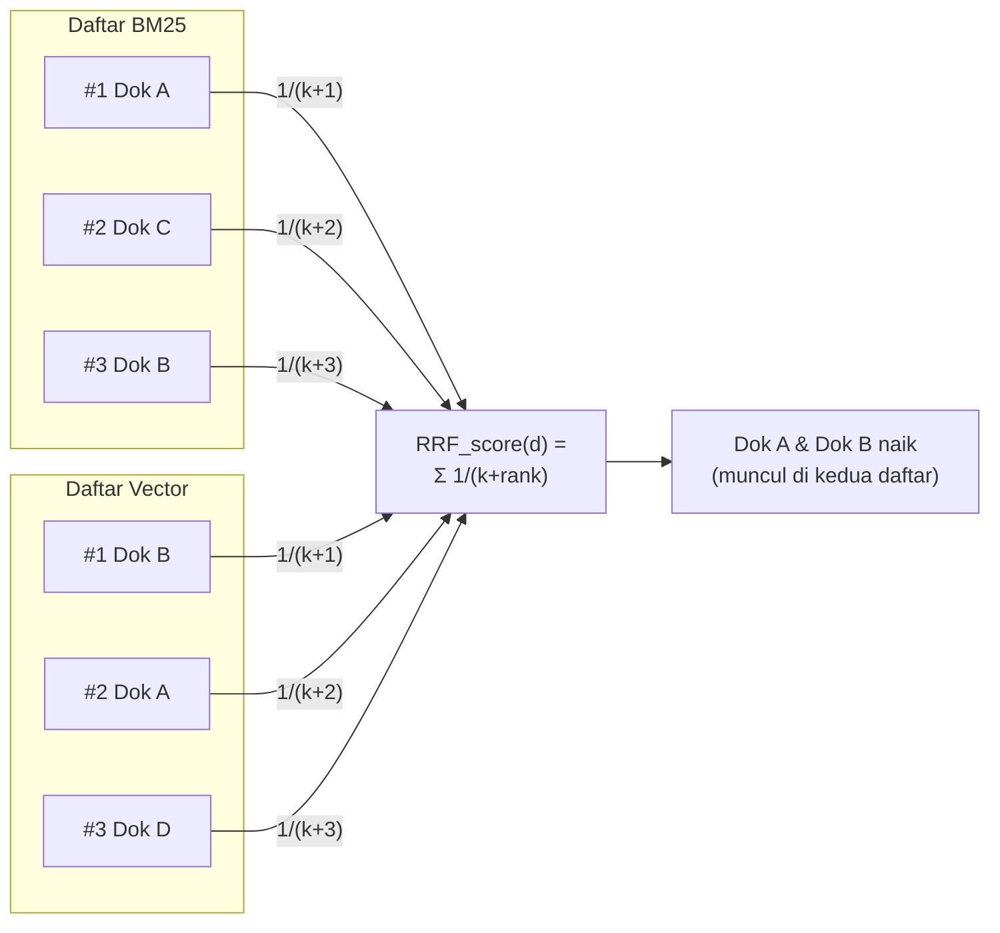

# Module 19: Hybrid Search — Menggabungkan BM25 + Vector lewat RRF

## Tujuan

Menggabungkan BM25 (Module 18) dan vector search (Module 13) jadi satu daftar peringkat lewat **Reciprocal Rank Fusion (RRF)** — method baru `search_hybrid()` di `VectorStore` — lalu menyambungkannya ke `/chat/stream`, satu-satunya endpoint chat NALA sejak Module 8. Ini menutup celah nyata yang didokumentasikan di Module 15 Bagian 9 dan dibuktikan lagi di Module 18 Bagian 1: chunk jawaban yang benar bisa kalah oleh chunk pendek yang cuma "mirip" secara makna.

## Definisi

Menggabungkan dua daftar hasil yang skornya beda skala (skor BM25 tidak berbatas, skor `knn` biasanya 0–1) ternyata bukan sekadar dijumlahkan — itu jebakan yang dibahas di Bagian 1. Solusinya di module ini adalah **Reciprocal Rank Fusion (RRF)**: teknik fusion yang sama sekali membuang skor mentah dan hanya melihat **posisi/rank** tiap dokumen di masing-masing daftar. Setiap dokumen dapat skor `1/(k + rank)` dari tiap daftar tempat ia muncul, lalu skor-skor itu dijumlahkan lintas daftar — dokumen yang sama-sama tinggi di kedua daftar akan menang, tanpa pernah perlu tahu "skor BM25 8.2 itu setara berapa skor vector" (Bagian 2).

Karena berbasis rank, RRF otomatis kebal terhadap masalah normalisasi skor yang jadi akar masalah `bool` query naif — inilah yang membuatnya jadi pendekatan fusion yang lebih *version-proof* dibanding menormalisasi skor secara manual.



## Hasil Akhir yang Diharapkan

- `VectorStore` punya method baru `search_hybrid()`, memakai `search()` (Module 13) dan `search_bm25()` (Module 18) di baliknya, tanpa perlu reindex `nala-docs`
- `/chat/stream` (satu-satunya endpoint chat NALA sejak Module 8) memanggil `search_hybrid()` (bukan `search()` murni) untuk retrieval
- Kita paham kenapa `bool` query naif (skor BM25 + skor `knn` dijumlah langsung) salah, dan kenapa RRF (berbasis rank, bukan skor mentah) jadi solusinya
- Diuji nyata dan dicatat jujur: hybrid search menaikkan recall di level kandidat, tapi untuk kasus keras "syarat kredit nasabah perorangan" chunk yang benar masih di posisi #8 — belum masuk `top_k=3`, motivasi langsung untuk Module 20 (reranking)

## 1. Jebakan Umum: `bool` Query Naif (Jangan Dipakai)

Cara paling intuitif yang sering dicoba pertama kali adalah menggabungkan `match` dan `knn` dalam satu query `bool`:

```json
// ANTI-POLA — jangan dipakai, lihat penjelasan di bawah
{
  "size": 3,
  "query": {
    "bool": {
      "should": [
        { "match": { "text": "syarat pengajuan kredit nasabah perorangan" } },
        { "knn": { "embedding": { "vector": [0.12, -0.03, "..."], "k": 3 } } }
      ]
    }
  }
}
```

Ini **tampak** benar dan bahkan bisa dieksekusi tanpa error — masalahnya baru terlihat begitu skor dibandingkan. Skor BM25 dari `match` tidak dibatasi rentang (bisa berupa angka seperti 8.2, 15.7, atau lebih — tergantung panjang dokumen dan frekuensi term), sementara skor `knn` di OpenSearch untuk banyak *space type* berkisar di rentang 0–1 (skor similarity yang dinormalisasi). Kalau keduanya dijumlahkan begitu saja dalam satu `bool.should`, hasilnya **didominasi skor yang skalanya lebih besar** — biasanya BM25 — bukan karena secara substantif BM25 memang harus menang, tapi murni karena satuan angkanya lebih besar. Efeknya: query ini bukan hybrid search yang seimbang, ia jadi BM25 search yang kebetulan ada sedikit noise dari vector search.

Ini justru **alasan kenapa normalisasi skor itu penting** sebelum dua metode retrieval digabung — bukan detail teknis kecil, tapi inti dari kenapa hybrid search butuh desain lebih dari sekadar "gabungkan dua query".

**Catatan produksi**: OpenSearch 2.11+ punya fitur bawaan untuk kasus ini — query khusus `hybrid` yang dipasangkan dengan *search pipeline* berisi `normalization-processor`, yang menormalisasi skor tiap sub-query (mis. min-max) sebelum digabung, dilakukan di sisi server. Ini pendekatan yang lebih efisien untuk skala produksi (satu request, bukan dua). Module ini tidak memakai jalur ini secara langsung — konfigurasi *search pipeline* butuh setup tambahan di luar `docker-compose.yml` yang sudah ada, dan detail parameternya bisa berbeda antar versi minor OpenSearch. Sebagai gantinya, module ini mengajarkan pendekatan yang lebih mudah diverifikasi dan version-proof: **fusion di sisi aplikasi (Python)**, memakai dua query terpisah yang masing-masing sudah dipakai sejak Module 13/18 (`search()` dan `search_bm25()`). Mekanismenya identik secara konsep, hanya lokasinya (aplikasi vs. server) yang berbeda — kalau nanti mau migrasi ke *search pipeline* bawaan OpenSearch di produksi, konsepnya (normalisasi sebelum fusion) sudah dipahami dari sini.

## 2. Reciprocal Rank Fusion (RRF): Fusion Tanpa Perlu Menormalisasi Skor

Alih-alih menormalisasi skor BM25 dan skor vector (yang butuh tahu rentang masing-masing di awal, rawan berubah tergantung data), module ini memakai **Reciprocal Rank Fusion (RRF)** — teknik fusion yang **mengabaikan skor mentah sama sekali** dan hanya memakai **peringkat (rank)** tiap dokumen di masing-masing daftar hasil:

$$\text{RRF\_score}(d) = \sum_{\text{daftar} \in \{BM25, Vector\}} \frac{1}{k + \text{rank}_{\text{daftar}}(d)}$$

Dengan `k` (konstanta, umumnya `60`) sebagai peredam supaya peringkat-peringkat teratas tidak mendominasi berlebihan. Dokumen yang muncul di peringkat atas di **kedua** daftar (BM25 maupun vector) akan mendapat skor RRF tertinggi — dokumen yang cuma muncul di satu daftar saja tetap dapat skor, tapi lebih rendah. Karena berbasis rank (bukan skor mentah), RRF otomatis kebal terhadap masalah skala yang membuat Bagian 1 gagal — tidak perlu tahu skor BM25 "biasanya" berapa dibanding skor `knn`.

**Contoh Kasus: Menggabungkan Dua Daftar Peringkat**

Anggap query "berapa lama proses cair KUR" menghasilkan dua daftar hasil terpisah — satu dari BM25 (cocok kata kunci), satu dari vector search (cocok makna) — masing-masing berisi 3 dokumen dengan skor mentah yang **skalanya sama sekali berbeda** (BM25 bisa puluhan, cosine cuma 0-1):

| Peringkat | Daftar BM25 (skor mentah) | Daftar Vector (skor mentah) |
|---|---|---|
| 1 | Dok C (skor 12.4) | Dok A (skor 0.91) |
| 2 | Dok A (skor 9.1) | Dok B (skor 0.85) |
| 3 | Dok B (skor 6.7) | Dok C (skor 0.79) |

RRF **membuang semua skor mentah itu** dan hanya memakai posisi peringkat (1, 2, 3, ...) memakai `k=60`:

```
RRF(Dok A) = 1/(60+2)  +  1/(60+1)  = 0.01613 + 0.01639 = 0.03252   (peringkat 2 di BM25, peringkat 1 di Vector)
RRF(Dok B) = 1/(60+3)  +  1/(60+2)  = 0.01587 + 0.01613 = 0.03200   (peringkat 3 di BM25, peringkat 2 di Vector)
RRF(Dok C) = 1/(60+1)  +  1/(60+3)  = 0.01639 + 0.01587 = 0.03226   (peringkat 1 di BM25, peringkat 3 di Vector)
```

| Dokumen | Peringkat BM25 | Peringkat Vector | Skor RRF | Peringkat gabungan |
|---|---|---|---|---|
| Dok A | 2 | 1 | **0.03252** | **1** — konsisten tinggi di kedua daftar |
| Dok C | 1 | 3 | 0.03226 | 2 — juara di satu daftar, lemah di daftar lain |
| Dok B | 3 | 2 | 0.03200 | 3 — konsisten sedang di kedua daftar |

**Dok A menang** bukan karena juara di salah satu daftar (dia peringkat 2 di BM25), tapi karena **konsisten baik di keduanya** — inilah inti RRF: dokumen yang relevan secara kata kunci **dan** makna diprioritaskan di atas dokumen yang cuma unggul di salah satu. Dok C sempat juara BM25 (peringkat 1) tapi lemah di vector (peringkat 3), jadi skor gabungannya turun ke posisi 2. Perhatikan juga betapa **kecil dan berdekatan** angka RRF-nya (0.032xx) — itu wajar, karena yang penting bukan besar-kecilnya angka, tapi urutan relatifnya.

## 3. Struktur Kode yang Ditambahkan

Dua Tahap: **Tahap A** menambah method baru `search_hybrid()` di `VectorStore`, belum dipakai siapa pun. **Tahap B** mengganti pemanggilan `vector_store.search()` di `/chat/stream` (`app/main.py`) jadi `vector_store.search_hybrid()`.

**Prasyarat**: sudah menyelesaikan **Module 18** (BM25 Search) — `search_bm25()` sudah ada dan sudah diuji berdiri sendiri.

### Tahap A — Tambah `search_hybrid()` di `app/vector_store.py`

**Langkah 1 — Tambah `_id` ke hasil `search()` yang sudah ada**

RRF butuh identitas unik tiap dokumen untuk mencocokkan kemunculannya di dua daftar hasil (BM25 dan vector) — `search()` yang sudah ada sejak Module 13 belum mengembalikan `_id` (ID dokumen OpenSearch, bukan `metadata`). `search_bm25()` (Module 18) sudah menyertakan `_id` sejak awal — sekarang giliran `search()` menyusul. Tambahkan satu key ke setiap hasil:

```python
# app/vector_store.py — di dalam method search() yang sudah ada
def search(self, query_embedding: list[float], top_k: int = 3) -> list[dict]:
    with httpx.Client() as client:
        response = client.post(
            f"{self.base_url}/{self.index_name}/_search",
            json={
                "size": top_k,
                "query": {
                    "knn": {"embedding": {"vector": query_embedding, "k": top_k}}
                },
            },
            timeout=30.0,
        )
        response.raise_for_status()
        hits = response.json()["hits"]["hits"]
        return [
            {
                "_id": hit["_id"],
                "text": hit["_source"]["text"],
                "score": hit["_score"],
                "metadata": hit["_source"]["metadata"],
            }
            for hit in hits
        ]
```

Satu-satunya perubahan: baris `"_id": hit["_id"],` ditambahkan ke dict hasil. Ini **tidak** memutus pemanggil yang sudah ada — kode Module 13 yang memakai `r["text"]` atau `r["metadata"]` tetap berfungsi, `_id` cuma key tambahan.

<details>
<summary><strong>Pakai Claude Code? Salin prompt berikut, paste untuk eksekusi Langkah 1</strong></summary>

```
Tambah key _id ke hasil search() yang sudah ada di VectorStore
(Module 19, Tahap A, Langkah 1) — belum dipakai method atau endpoint
baru apa pun.

GOAL:
- Di Nala/app/vector_store.py, method search() yang sudah ada:
  tambahkan key "_id": hit["_id"] ke setiap dict di list yang
  dikembalikan (selain "text", "score", "metadata" yang sudah ada).

CONTEXT:
- File ini (`app/vector_store.py`) sudah ada di `Nala/` sejak
  Module 13, dan sudah dapat method search_bm25() dari Module 18 —
  edit langsung di file yang sama, tidak ada folder lain yang perlu
  disalin.
- search_bm25() (Module 18) sudah menyertakan _id sejak awal — search()
  belum, ini yang diperbaiki di langkah ini.
- _id ini dibutuhkan RRF (Langkah 2) untuk mencocokkan dokumen yang
  sama di dua daftar hasil (BM25 dan vector).

GUARDRAIL:
- JANGAN ubah signature search() (nama, parameter, return type list
  of dict) — cuma tambah key _id ke tiap dict hasil.
- JANGAN ubah ensure_index(), index_document(), atau search_bm25().
- JANGAN sentuh app/main.py di langkah ini.
```

</details>

**Langkah 2 — Tambah method `search_hybrid()` dengan RRF**

```python
# app/vector_store.py
def search_hybrid(
    self,
    query_text: str,
    query_embedding: list[float],
    top_k: int = 3,
    candidate_pool: int = 20,
    rrf_k: int = 60,
) -> list[dict]:
    bm25_results = self.search_bm25(query_text, top_k=candidate_pool)
    vector_results = self.search(query_embedding, top_k=candidate_pool)

    fused_scores: dict[str, float] = {}
    doc_lookup: dict[str, dict] = {}

    for rank, hit in enumerate(bm25_results):
        fused_scores[hit["_id"]] = fused_scores.get(hit["_id"], 0.0) + 1.0 / (rrf_k + rank + 1)
        doc_lookup[hit["_id"]] = hit

    for rank, hit in enumerate(vector_results):
        fused_scores[hit["_id"]] = fused_scores.get(hit["_id"], 0.0) + 1.0 / (rrf_k + rank + 1)
        doc_lookup.setdefault(hit["_id"], hit)

    ranked_ids = sorted(fused_scores, key=fused_scores.get, reverse=True)[:top_k]
    return [
        {**doc_lookup[doc_id], "rrf_score": fused_scores[doc_id]}
        for doc_id in ranked_ids
    ]
```

- **`candidate_pool=20`**: jumlah kandidat yang diambil dari **masing-masing** metode (BM25 dan vector) sebelum fusion — bukan `top_k` final. Nilai ini dibuat lebih besar dari `top_k` supaya fusion punya cukup bahan untuk memilih dari kedua sisi; default `20` ini juga yang nanti dipakai apa adanya oleh Module 20 (reranking) sebagai ukuran *candidate set* sebelum cross-encoder menyortirnya ulang — bukan kebetulan, ini desain yang sengaja disiapkan untuk Module 20.
- **`doc_lookup`**: dictionary bantu supaya isi dokumen (`text`, `metadata`, dst) tidak perlu dicari ulang — disimpan begitu pertama kali ditemui. `setdefault()` pada loop `vector_results` sengaja dipakai (bukan `=`) supaya versi BM25 yang tersimpan lebih dulu tidak tertimpa kalau dokumen yang sama muncul di kedua daftar (isinya identik, cuma untuk menghindari kerja dua kali).
- **`rrf_k=60`**: konstanta standar RRF dari literatur information retrieval — meredam dominasi peringkat #1 supaya dokumen di peringkat #2-3 dari kedua daftar tetap kompetitif melawan dokumen yang cuma nomor #1 di satu daftar saja.
- Hasil akhir diurutkan berdasarkan `fused_scores` (menurun), dipotong ke `top_k`, dan tiap dict hasil ditambah key `rrf_score` (skor fusion, berbeda dari `score` yang merupakan skor asli BM25/vector sebelum digabung).

**▶️ Jalankan & lihat hasilnya**

```bash
docker compose up --build api
```

```bash
docker compose exec api python -c "
from app.embeddings import embed_text
from app.vector_store import VectorStore

store = VectorStore(base_url='http://opensearch:9200', index_name='nala-docs')
query = 'Apa saja syarat pengajuan kredit untuk nasabah perorangan?'
query_embedding = embed_text(query, base_url='http://ollama:11434')

results = store.search_hybrid(query, query_embedding, top_k=5, candidate_pool=20)
for r in results:
    print(round(r['rrf_score'], 4), '-', r['text'][:70])
"
```

✅ **Indikator sukses**: tidak ada error, dan chunk `### 2.1 Untuk Nasabah Perorangan` (yang di Module 15 Bagian 9 berperingkat #11 dari 14 lewat vector search murni) sekarang seharusnya muncul jauh lebih tinggi — idealnya masuk `top_k=5` — karena BM25 menangkap kecocokan kata "syarat", "perorangan" secara eksak, ditambah sinyal semantik dari vector search.

<details>
<summary><strong>Pakai Claude Code? Salin prompt berikut, paste untuk eksekusi Langkah 2</strong></summary>

```
Tambah method search_hybrid() dengan Reciprocal Rank Fusion (RRF) di
VectorStore (Module 19, Tahap A, Langkah 2) — belum dipakai endpoint
apa pun.

GOAL:
- Di Nala/app/vector_store.py, tambah
  method search_hybrid(self, query_text: str, query_embedding:
  list[float], top_k: int = 3, candidate_pool: int = 20, rrf_k: int
  = 60) -> list[dict]:
  1. bm25_results = self.search_bm25(query_text, top_k=candidate_pool)
  2. vector_results = self.search(query_embedding, top_k=candidate_pool)
  3. Hitung fused_scores: dict[str, float] — untuk tiap daftar, untuk
     tiap (rank, hit) lewat enumerate(): fused_scores[hit["_id"]] +=
     1.0 / (rrf_k + rank + 1) (default 0.0 kalau belum ada).
  4. doc_lookup: dict[str, dict] menyimpan hit pertama kali ditemui
     per _id (pakai setdefault() untuk hasil vector supaya tidak
     menimpa versi BM25 yang sudah tersimpan).
  5. Urutkan _id berdasarkan fused_scores menurun, ambil top_k.
  6. Return list of dict = isi doc_lookup untuk tiap _id terpilih,
     ditambah key "rrf_score": fused_scores[_id].

CONTEXT:
- search_bm25() (Module 18) dan _id di search() (Langkah 1) sudah ada.
- top_k default 3 tapi Module 20 nanti akan memanggil method ini
  dengan top_k=20 (candidate set untuk reranking) — desain method ini
  sudah harus mendukung top_k besar tanpa perubahan lagi.

GUARDRAIL:
- JANGAN ubah search() atau search_bm25() yang sudah ada.
- JANGAN sentuh app/main.py di langkah ini — itu Tahap B.
```

</details>

**📄 Kode lengkap Tahap A** (`app/vector_store.py`, versi setelah Module 19):

```python
from urllib.parse import quote

import httpx


class VectorStore:
    def __init__(self, base_url: str, index_name: str):
        self.base_url = base_url
        self.index_name = index_name

    def ensure_index(self, dims: int = 768) -> None:
        with httpx.Client() as client:
            check = client.head(f"{self.base_url}/{self.index_name}", timeout=10.0)
            if check.status_code == 200:
                return
            response = client.put(
                f"{self.base_url}/{self.index_name}",
                json={
                    "settings": {"index": {"knn": True}},
                    "mappings": {
                        "properties": {
                            "text": {"type": "text"},
                            "embedding": {
                                "type": "knn_vector",
                                "dimension": dims,
                            },
                            "metadata": {"type": "object"},
                        }
                    },
                },
                timeout=30.0,
            )
            response.raise_for_status()

    def index_document(
        self, doc_id: str, text: str, embedding: list[float], metadata: dict
    ) -> None:
        with httpx.Client() as client:
            response = client.put(
                f"{self.base_url}/{self.index_name}/_doc/{quote(doc_id, safe='')}",
                json={"text": text, "embedding": embedding, "metadata": metadata},
                params={"refresh": "true"},
                timeout=30.0,
            )
            response.raise_for_status()

    def search(self, query_embedding: list[float], top_k: int = 3) -> list[dict]:
        with httpx.Client() as client:
            response = client.post(
                f"{self.base_url}/{self.index_name}/_search",
                json={
                    "size": top_k,
                    "query": {
                        "knn": {"embedding": {"vector": query_embedding, "k": top_k}}
                    },
                },
                timeout=30.0,
            )
            response.raise_for_status()
            hits = response.json()["hits"]["hits"]
            return [
                {
                    "_id": hit["_id"],
                    "text": hit["_source"]["text"],
                    "score": hit["_score"],
                    "metadata": hit["_source"]["metadata"],
                }
                for hit in hits
            ]

    def search_bm25(self, query_text: str, top_k: int = 10) -> list[dict]:
        with httpx.Client() as client:
            response = client.post(
                f"{self.base_url}/{self.index_name}/_search",
                json={
                    "size": top_k,
                    "query": {"match": {"text": query_text}},
                },
                timeout=30.0,
            )
            response.raise_for_status()
            hits = response.json()["hits"]["hits"]
            return [
                {
                    "_id": hit["_id"],
                    "text": hit["_source"]["text"],
                    "score": hit["_score"],
                    "metadata": hit["_source"]["metadata"],
                }
                for hit in hits
            ]

    def search_hybrid(
        self,
        query_text: str,
        query_embedding: list[float],
        top_k: int = 3,
        candidate_pool: int = 20,
        rrf_k: int = 60,
    ) -> list[dict]:
        bm25_results = self.search_bm25(query_text, top_k=candidate_pool)
        vector_results = self.search(query_embedding, top_k=candidate_pool)

        fused_scores: dict[str, float] = {}
        doc_lookup: dict[str, dict] = {}

        for rank, hit in enumerate(bm25_results):
            fused_scores[hit["_id"]] = fused_scores.get(hit["_id"], 0.0) + 1.0 / (rrf_k + rank + 1)
            doc_lookup[hit["_id"]] = hit

        for rank, hit in enumerate(vector_results):
            fused_scores[hit["_id"]] = fused_scores.get(hit["_id"], 0.0) + 1.0 / (rrf_k + rank + 1)
            doc_lookup.setdefault(hit["_id"], hit)

        ranked_ids = sorted(fused_scores, key=fused_scores.get, reverse=True)[:top_k]
        return [
            {**doc_lookup[doc_id], "rrf_score": fused_scores[doc_id]}
            for doc_id in ranked_ids
        ]
```

### Tahap B — Ganti Pemanggilan di `/chat/stream`

**Langkah 3 — Ganti `vector_store.search()` jadi `vector_store.search_hybrid()`**

Di `app/main.py`, endpoint `/chat/stream` (satu-satunya endpoint chat NALA sejak Module 8, dibangun sebagai RAG chain di Module 14) memanggil:

```python
# SEBELUM (Module 14) — di dalam chat_stream()
query_embedding = embed_text(last_user_message, base_url=OLLAMA_BASE_URL)
results = vector_store.search(query_embedding, top_k=3)
```

Ganti jadi:

```python
# SESUDAH (Module 19) — di dalam chat_stream()
query_embedding = embed_text(last_user_message, base_url=OLLAMA_BASE_URL)
results = vector_store.search_hybrid(
    query_text=last_user_message,
    query_embedding=query_embedding,
    top_k=3,
)
```

Tidak ada yang lain berubah — blok `try/except httpx.HTTPError` di sekitarnya (fallback ke `NALA_SYSTEM_PROMPT_NO_CONTEXT`, lihat Module 14 Bagian 2.d) tetap sama persis, karena `search_hybrid()` bisa melempar `httpx.HTTPError` yang sama seperti `search()` (dua-duanya memanggil OpenSearch lewat `httpx`). `top_k=3` di module ini **belum** memakai `candidate_pool=20` secara sengaja — itu baru relevan mulai Module 20 begitu ada reranker yang bisa memanfaatkan kandidat sebanyak itu. Dengan `top_k=3`, `search_hybrid()` tetap mengambil 20 kandidat dari masing-masing metode di baliknya (default `candidate_pool=20`), tapi langsung memotong ke 3 teratas via RRF sebelum dikembalikan — cukup untuk manfaat hybrid search saja, sebelum reranking ditambahkan.

**▶️ Jalankan & lihat hasilnya**

```bash
docker compose up --build api
```

```bash
curl -N -X POST http://localhost:8000/chat/stream \
  -H "Content-Type: application/json" \
  -d '{"messages": [{"role": "user", "content": "Apa saja syarat pengajuan kredit untuk nasabah perorangan?"}]}'
```

✅ **Indikator sukses**: jawaban terasa lebih relevan dibanding sebelumnya, idealnya menyebut item konkret dari `### 2.1` (KTP, Kartu Keluarga, slip gaji, dst) — bandingkan dengan jawaban yang lebih umum/tidak lengkap yang didapat di Module 14 sebelum hybrid search ditambahkan, muncul bertahap seperti biasa (flag `-N`).

Tapi untuk pertanyaan spesifik ini, jawaban **belum tentu** sudah menyebut keempat item itu secara lengkap — hybrid search terbukti menaikkan peringkat chunk yang benar (dari #11 di vector murni jadi sekitar #8, lihat Bagian 4), tapi belum cukup untuk selalu masuk `top_k=3` di kasus keras ini. Kalau jawabannya masih bilang "tidak ditemukan informasi spesifik", itu **bukan tanda ada yang salah** — itu justru bukti grounding masih bekerja jujur (Module 14 Bagian 2.d), dan alasan kenapa Module 20 (reranking) berikutnya diperlukan. Lihat Bagian 4 untuk hasil uji nyata sebelum lanjut ke Module 20.

<details>
<summary><strong>Pakai Claude Code? Salin prompt berikut, paste untuk eksekusi Langkah 3</strong></summary>

```
Ganti vector_store.search() jadi vector_store.search_hybrid() di
/chat/stream (Module 19, Tahap B, Langkah 3).

GOAL:
- Di Nala/app/main.py:
  - Di dalam fungsi chat_stream() (endpoint /chat/stream — satu-
    satunya endpoint chat NALA): ganti pemanggilan `results =
    vector_store.search(query_embedding, top_k=3)` jadi `results =
    vector_store.search_hybrid(query_text=last_user_message,
    query_embedding=query_embedding, top_k=3)`.

CONTEXT:
- search_hybrid() sudah ada di app/vector_store.py sejak Tahap A.
- Blok try/except httpx.HTTPError di sekitar pemanggilan ini TIDAK
  berubah — search_hybrid() melempar httpx.HTTPError yang sama
  seperti search().

GUARDRAIL:
- JANGAN ubah urutan argumen embed_text() atau logika fallback
  NALA_SYSTEM_PROMPT_NO_CONTEXT.
- JANGAN ubah endpoint /health, /, /upload.
- JANGAN ubah app/vector_store.py di langkah ini — sudah selesai di
  Tahap A.
```

</details>

**📄 Kode lengkap Tahap B** (bagian relevan `app/main.py` setelah Module 19 — hanya menunjukkan fungsi yang berubah, sisanya identik dengan akhir Module 14):

```python
# app/main.py
@app.post("/chat/stream")
def chat_stream(request: ChatStreamRequest) -> StreamingResponse:
    if not request.messages or request.messages[-1].role != "user":
        raise HTTPException(
            status_code=400,
            detail="messages harus non-kosong dan elemen terakhir harus role 'user'",
        )

    recent = request.messages[-HISTORY_WINDOW:]
    last_user_message = recent[-1].content

    try:
        query_embedding = embed_text(last_user_message, base_url=OLLAMA_BASE_URL)
        results = vector_store.search_hybrid(
            query_text=last_user_message,
            query_embedding=query_embedding,
            top_k=3,
        )
    except httpx.HTTPError:
        results = []

    if results:
        context = "\n\n".join(r["text"] for r in results)
        system_prompt = NALA_SYSTEM_PROMPT
        grounded_content = f"Konteks:\n{context}\n\nPertanyaan: {last_user_message}"
    else:
        system_prompt = NALA_SYSTEM_PROMPT_NO_CONTEXT
        grounded_content = last_user_message

    ollama_messages = [{"role": "system", "content": system_prompt}]
    ollama_messages += [{"role": m.role, "content": m.content} for m in recent[:-1]]
    ollama_messages.append({"role": "user", "content": grounded_content})

    return StreamingResponse(
        ollama_client.chat_stream(ollama_messages), media_type="text/plain"
    )
```

### Troubleshooting

- **`search_hybrid()` melempar error field `text` tidak ditemukan / query `match` gagal**: index `nala-docs` yang dipakai kemungkinan dibuat sebelum field `text` ada di mapping (versi index yang sangat lama) — hapus dan buat ulang index (`curl -X DELETE http://localhost:9200/nala-docs`) lalu jalankan ulang `ingest_documents()`.
- **Port sudah dipakai (8000/9200/11434)**: ubah mapping port yang bentrok di `docker-compose.yml`, atau pastikan container lama sudah benar-benar dimatikan (`docker compose down` di `Nala`).
- **`docker compose exec ollama ollama list` tidak menampilkan model**: model belum pernah di-pull ke volume container ini — jalankan ulang `docker compose exec ollama ollama pull <nama-model>`.

## 4. Hasil Uji Nyata: Perbaikan Terukur, Belum Tuntas

Pengujian langsung terhadap index `nala-docs` (13 chunk `sop-pengajuan-kredit.md`) untuk query *"Apa saja syarat pengajuan kredit untuk nasabah perorangan?"* memberi angka konkret, bukan cuma klaim teoretis:

| Metode | Peringkat chunk `### 2.1 Untuk Nasabah Perorangan` |
|---|---|
| Vector murni (`store.search()`) | #11 dari 14 |
| BM25 saja (`store.search_bm25()`) | **#4** dari 14 |
| Hybrid RRF (`store.search_hybrid()`) | #8 dari 14 |

BM25 sendirian, untuk kasus spesifik ini, sebenarnya mengungguli hasil gabungan RRF — bukan aneh, ini konsekuensi logis dari RRF: dokumen ini kuat secara lexical (peringkat #4) tapi tetap lemah secara semantic (peringkat #11), jadi skor RRF gabungannya "ditarik turun" oleh komponen vector yang masih rendah. Hasilnya: **`top_k=3` di `/chat/stream` masih belum cukup untuk pertanyaan spesifik ini** — chunk yang benar ada di posisi #8, bukan di 3 besar.

### Alat Bantu: Cek Posisi Chunk Tertentu di Ketiga Metode

Angka-angka di tabel atas didapat dari index dan isi dokumen tertentu — bisa berbeda di komputer Anda tergantung dokumen apa saja yang sudah ter-*ingest*. Daripada percaya begitu saja pada angka di materi, pakai *helper* ini untuk mengecek posisi chunk **apa pun** yang Anda harapkan, untuk pertanyaan **apa pun**:

```python
# Tempel fungsi ini sekali di sesi python -c, lalu panggil untuk query/potongan apa pun
def cari_posisi(query_text, query_embedding, potongan_teks, max_k=50):
    """Cari posisi (rank, 0-based) sebuah chunk di search(), search_bm25(), dan search_hybrid().

    potongan_teks: sepotong kalimat unik yang pasti ada di chunk yang dicari
    (mis. 'Fotokopi KTP') — dipakai untuk mengenali chunk yang benar di
    daftar hasil, bukan dibandingkan dengan skor.
    """
    metode = {
        "Vector murni": store.search(query_embedding, top_k=max_k),
        "BM25 saja": store.search_bm25(query_text, top_k=max_k),
        "Hybrid RRF": store.search_hybrid(query_text, query_embedding, top_k=max_k, candidate_pool=max_k),
    }
    for label, hasil in metode.items():
        posisi = next((i for i, r in enumerate(hasil) if potongan_teks in r["text"]), None)
        if posisi is None:
            print(f"{label}: tidak ditemukan di top-{max_k}")
        else:
            print(f"{label}: posisi #{posisi} dari {len(hasil)}")
```

Contoh pemakaian lengkap (bisa langsung disalin ke `docker compose exec api python -c "..."`):

```bash
docker compose exec api python -c "
from app.embeddings import embed_text
from app.vector_store import VectorStore

store = VectorStore(base_url='http://opensearch:9200', index_name='nala-docs')

def cari_posisi(query_text, query_embedding, potongan_teks, max_k=50):
    metode = {
        'Vector murni': store.search(query_embedding, top_k=max_k),
        'BM25 saja': store.search_bm25(query_text, top_k=max_k),
        'Hybrid RRF': store.search_hybrid(query_text, query_embedding, top_k=max_k, candidate_pool=max_k),
    }
    for label, hasil in metode.items():
        posisi = next((i for i, r in enumerate(hasil) if potongan_teks in r['text']), None)
        if posisi is None:
            print(f'{label}: tidak ditemukan di top-{max_k}')
        else:
            print(f'{label}: posisi #{posisi} dari {len(hasil)}')

query = 'Apa saja syarat pengajuan kredit untuk nasabah perorangan?'
query_embedding = embed_text(query, base_url='http://ollama:11434')
cari_posisi(query, query_embedding, 'Fotokopi KTP')
"
```

Ganti `query` dengan pertanyaan apa pun yang ingin dicoba, dan `'Fotokopi KTP'` dengan potongan teks unik dari chunk yang Anda harapkan muncul — cara ini jauh lebih cepat daripada scroll manual lewat belasan baris hasil `print()`. `max_k=50` cukup besar untuk index saat ini yang masih berisi belasan-puluhan chunk; naikkan kalau index Anda sudah jauh lebih besar (banyak dokumen ter-*ingest*).

⚠️ **Jebakan umum — dua argumen ini gampang tertukar**: `query` (baris `query = '...'`) adalah **pertanyaan** yang mau dicari, sedangkan argumen ketiga `cari_posisi(query, query_embedding, '...')` adalah **potongan isi dokumen** yang diharapkan muncul di jawaban — bukan pertanyaannya lagi. Kalau keduanya tertukar (misal argumen ketiga ikut diisi pertanyaan, bukan potongan isi dokumen), hasilnya akan selalu "tidak ditemukan di top-N" untuk ketiga metode sekaligus — bukan berarti retrieval-nya gagal, tapi karena `potongan_teks` yang dicocokkan (`if potongan_teks in r["text"]`) memang tidak pernah muncul persis sebagai substring di teks chunk manapun. Kalau ketiga metode kompak "tidak ditemukan", curigai dulu argumen yang tertukar, baru curigai retrieval-nya.

Alat bantu yang sama ini juga berguna di Module 20 (mengecek apakah reranking benar-benar menaikkan posisi chunk yang diharapkan) dan Module 21 (dasar dari cara kerja framework evaluasi precision/recall/MRR) — jangan dihapus setelah dipakai di sini.

Ini bukan bug, dan bukan berarti hybrid search di module ini gagal — dibanding vector murni, hybrid search tetap terbukti menaikkan peringkat chunk yang benar (walau untuk kasus ini, tidak sebesar yang BM25 sendirian capai). Yang perlu dipahami jujur: RRF adalah kompromi yang tidak selalu optimal per-kasus — ia menyeimbangkan dua sinyal secara umum, bukan memilih "yang terbaik" untuk tiap query. Kasus keras seperti ini (dokumen kuat di satu sinyal, lemah di sinyal lain) adalah motivasi nyata untuk Module 20 (reranking), yang menilai relevansi tiap kandidat secara langsung — bukan mengombinasikan dua rank secara membabi buta.

## 5. Checkpoint Praktik

Langkah eksekusi lengkap ada di Bagian 3 di atas (Tahap A Langkah 1-2, Tahap B Langkah 3). Yang perlu dipastikan sebelum lanjut ke Module 20:

- [ ] `store.search_hybrid()` mengembalikan hasil yang berbeda urutannya dibanding `store.search()` murni, untuk query yang sama, dan skor `rrf_score` untuk chunk `### 2.1 Untuk Nasabah Perorangan` naik dibanding peringkatnya di `store.search()` murni (lihat Bagian 4 di atas — belum tentu masuk `top_k=3`, itu wajar di titik ini)
- [ ] `/chat/stream` tetap streaming bertahap dan menjawab dengan kualitas yang lebih baik dibanding sebelum hybrid search ditambahkan
- [ ] Kita paham kenapa `bool` query naif (skor BM25 + skor `knn` dijumlah langsung) salah, dan kenapa RRF (berbasis rank) jadi solusinya

## Kesimpulan

Module ini menutup celah yang secara eksplisit didokumentasikan sebagai keterbatasan di Module 15 Bagian 9 dan dibuktikan lagi lewat BM25 murni di Module 18: vector search murni bisa kalah oleh chunk pendek yang "kebetulan" mirip secara makna, padahal kecocokan kata kunci eksak justru menunjuk ke chunk yang benar. Hybrid search (BM25 + vector, digabung lewat RRF berbasis rank — bukan skor mentah yang rawan beda skala) memperbaiki ini **tanpa reindex** dan **tanpa mengubah kontrak endpoint** (`/chat/stream` tetap menerima/mengembalikan bentuk yang sama).

Yang belum diselesaikan (dan sudah dibuktikan langsung dengan angka di Bagian 4): hybrid search memperbaiki *recall* di level kandidat (dokumen yang benar kini punya peluang lebih besar masuk top-K yang lebih besar seperti `candidate_pool=20`), tapi belum tentu selalu menaruhnya di posisi #1-3 secara konsisten — kombinasi BM25+vector tetap heuristik berbasis rank, bukan penilaian relevansi langsung. Module 20 (Reranking) mengambil pool kandidat yang lebih besar (`candidate_pool=20`, sudah disiapkan di `search_hybrid()`) dan menyortirnya ulang pakai model yang secara khusus dilatih untuk menilai relevansi query-dokumen — dibahas berikutnya di Module 20.
