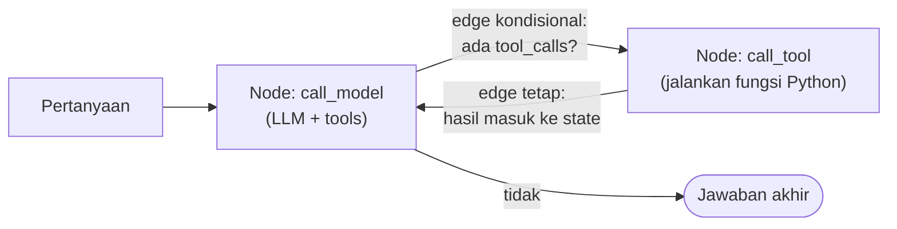
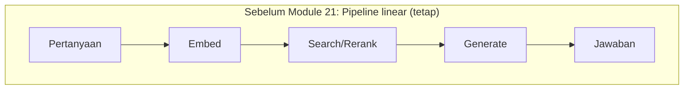
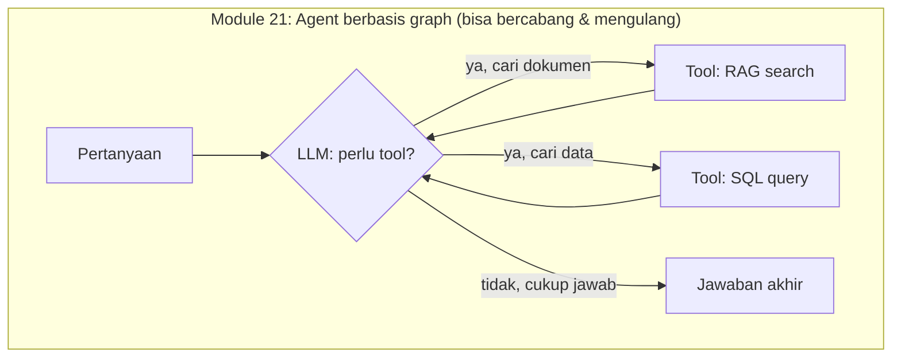
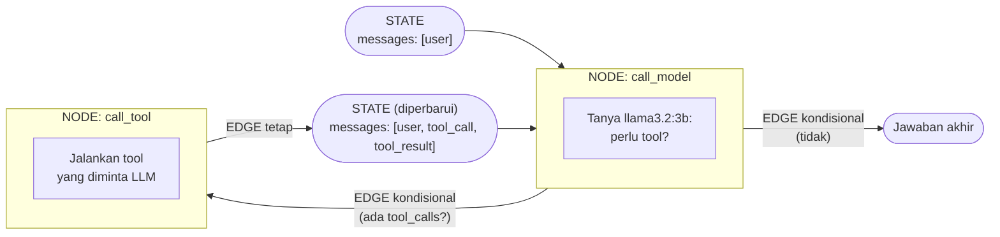
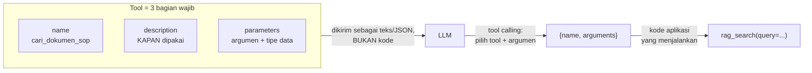
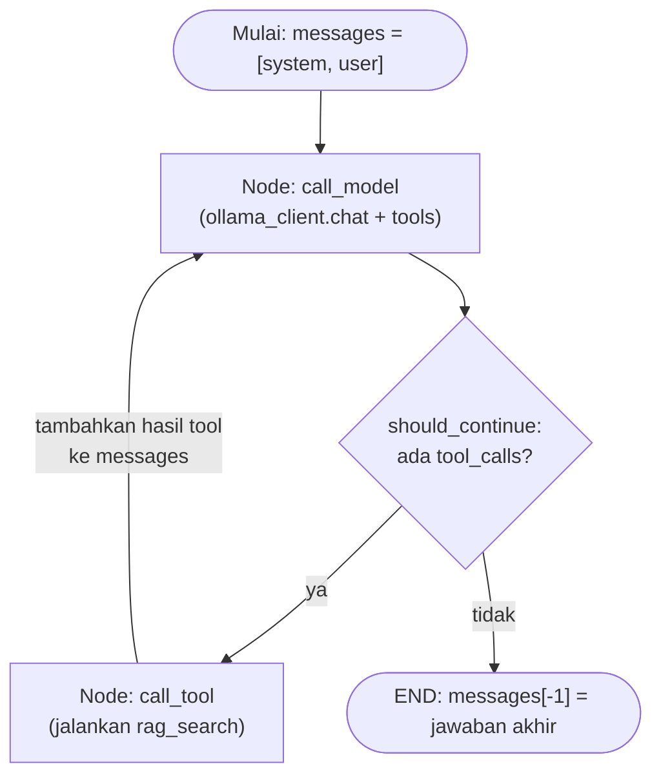

# Module 21: Desain Agent dengan LangGraph — Tool-Calling

## Tujuan

Mengubah NALA dari pipeline RAG linear (Module 6-19) menjadi agent berbasis LangGraph yang bisa memutuskan sendiri kapan perlu memanggil tool, dimulai dengan satu tool (pencarian dokumen SOP) sebagai fondasi sebelum tool kedua ditambahkan di Module 22.

## Definisi

**Agent**, dalam konteks module ini, adalah sistem yang memutuskan sendiri langkah apa yang perlu diambil untuk menjawab sebuah pertanyaan — berbeda dari **pipeline linear** (Module 6-19) yang urutan langkahnya selalu sama apa pun pertanyaannya. Keputusan itu diambil lewat **tool calling**: LLM diberi daftar "tool" (fungsi Python yang bisa dipanggil, masing-masing dengan skema nama/deskripsi/parameter) dan diminta memilih tool mana yang relevan — kalau ada — sebelum menyusun jawaban akhir. Ollama sendiri tidak pernah mengeksekusi tool apa pun; ia cuma memutuskan *tool mana* dan *argumen apa*, kode aplikasi yang benar-benar menjalankannya.

**LangGraph** adalah pustaka yang dipakai untuk merangkai keputusan itu jadi sebuah **graph**: kumpulan **node** (langkah kerja, ditulis sebagai fungsi Python) yang saling terhubung lewat **edge** (jalur antar-node, ada yang tetap dan ada yang **kondisional** — bercabang tergantung hasil node sebelumnya), dengan **state** (data yang mengalir dan terus bertambah dari satu node ke node berikutnya, di NALA berupa daftar `messages`) sebagai "memori kerja" bersama. Bedanya dengan pipeline lurus: graph bisa **loop back** — sebuah node bisa dilewati berkali-kali dalam satu request (mis. `call_tool` selalu kembali ke `call_model`) sampai model memutuskan tidak perlu tool lagi.



## Hasil Akhir yang Diharapkan

- `OllamaClient` punya method `chat()` baru yang mendukung parameter `tools`, tanpa mengubah `generate()`/`chat_stream()` yang sudah ada
- Logika retrieval RAG Module 8-19 sudah di-refactor jadi tool berdiri sendiri (`rag_search()` + `RAG_TOOL_SCHEMA`) yang mengembalikan teks konteks, bukan langsung memanggil LLM — dibuktikan lewat uji nyata (Bagian 7a) memakai `search_hybrid()` + reranker Module 16-17, bukan `search()` polos, supaya tidak regresi kualitas
- Graph LangGraph (`call_model` ↔ `call_tool`, dengan edge kondisional) sudah dibangun dan disambungkan ke endpoint `POST /chat` yang **baru dibuat** di module ini — logikanya adalah refactor dari retrieval yang sebelumnya hardcoded di `/chat/stream` (Module 8-19), bukan mengganti isi `/chat` yang sudah ada
- `/chat` tetap menjawab dengan kualitas setara Module 8-19 untuk pertanyaan seputar SOP, dan tetap bisa menjawab pertanyaan yang tidak butuh tool sama sekali (mis. sapaan) — kedua kasus sudah diuji langsung dan berhasil
- `/chat/stream` sengaja tidak disentuh sama sekali di module ini, tetap berjalan seperti sebelumnya
- Trace Langfuse `chat_agent` mencatat tiap node LangGraph (`agent_call_model`, `agent_tool:*`) sebagai observation terpisah dengan latency yang benar — bug nyata ditemukan lewat inspeksi trace (awalnya `latency: 0`, `observations: 0`) dan diperbaiki di Bagian 7b, bukan diasumsikan langsung benar

## 1. Kenapa NALA Butuh Jadi "Agent", Bukan Cuma Pipeline

Sejak Module 24, `/chat/stream` (satu-satunya endpoint chat NALA sampai sebelum module ini — lihat Module 7) bekerja dengan urutan langkah yang **selalu sama**, apapun pertanyaannya: terima pesan → embed → cari di vector store (Module 16-17: hybrid search + rerank) → susun prompt ber-konteks → generate jawaban. Urutan ini disebut **pipeline linear** — jalurnya lurus, tidak pernah bercabang, tidak pernah "mikir dulu langkah apa yang cocok".

Itu bekerja baik selama satu-satunya sumber jawaban adalah dokumen SOP. Tapi mulai module ini, NALA punya sumber jawaban **kedua**: data operasional (pengajuan kredit, klaim asuransi) yang tersimpan di database, bukan di dokumen teks. Pipeline linear tidak punya cara untuk memutuskan "pertanyaan ini butuh dokumen atau butuh angka dari database?" — keputusan itu harus ada di suatu tempat, dan LangGraph adalah alat yang dipakai untuk menaruhnya.

### a. Analogi untuk yang belum pernah pegang kode

Bayangkan pipeline Module 6-19 seperti **jalur produksi pabrik**: bahan mentah masuk di satu ujung, keluar produk jadi di ujung lain, urutan mesinnya tetap sama untuk semua bahan. Agent lewat LangGraph lebih mirip **resepsionis yang bisa mendelegasikan**: dia dengar pertanyaan, memutuskan "ini perlu saya cek ke bagian arsip (dokumen SOP) atau ke bagian data (database)?", kadang perlu cek ke **dua-duanya** sebelum bisa menjawab, dan kalau jawaban pertama masih kurang, dia bisa balik bertanya lagi ke bagian yang tadi — bukan cuma jalan satu arah.

### b. Bedanya secara teknis: pipeline vs graph





Perhatikan panah `B3 --> B2` dan `B4 --> B2`: setelah tool dipanggil, alur **kembali** ke node yang sama (LLM) untuk memutuskan langkah berikutnya — bisa berhenti (jawab), bisa panggil tool lain, atau (jarang tapi mungkin) panggil tool yang sama lagi dengan query berbeda. Inilah yang dimaksud "graph yang bisa loop back", beda dari pipeline Module 6-19 yang cuma bisa jalan satu arah dari kiri ke kanan.

### c. Tiga konsep inti LangGraph

LangGraph memodelkan agent dengan tiga elemen:

1. **State** — "memori kerja" yang dibawa berjalan dari satu node ke node berikutnya. Untuk NALA, state-nya sederhana: daftar `messages` (riwayat percakapan + hasil tool, format sama seperti yang sudah dipakai `/chat/stream` sejak Module 7) yang terus bertambah setiap kali ada langkah baru.
2. **Node** — satu langkah kerja, ditulis sebagai fungsi Python biasa yang menerima state dan mengembalikan perubahan ke state itu. NALA akan punya dua node: `call_model` (tanya ke `llama3.2:3b`, apakah perlu tool) dan `call_tool` (jalankan tool yang diminta, hasilnya dimasukkan lagi ke state).
3. **Edge** — jalur antar-node. Ada edge tetap (`call_tool` selalu kembali ke `call_model`) dan **edge kondisional** (`call_model` ke `call_tool` ATAU ke selesai, tergantung apakah LLM meminta tool).

Ketiganya kalau digambar bersama, persis begini posisinya di graph NALA — perhatikan label **STATE**, **NODE**, dan **EDGE** langsung menempel ke bagian yang dimaksud:



- **STATE** — muncul **dua kali** di diagram, dan itu disengaja: `S1` di awal (baru berisi pesan user) dan `S2` setelah `call_tool` (sudah bertambah hasil tool). Keduanya oval yang sama jenisnya — **data**, bukan node — cuma isinya beda karena sudah bertambah satu langkah. `call_model` yang dipanggil kedua kali menerima `S2`, bukan `S1` lagi — itulah yang membuatnya "tahu" hasil tool tanpa perlu memanggil tool yang sama lagi.
- **NODE** (dua kotak besar) adalah `call_model` dan `call_tool` — masing-masing satu fungsi Python yang menerima state, melakukan sesuatu, lalu mengembalikan perubahan ke state itu. Perhatikan: node **tidak pernah** terhubung langsung ke node lain tanpa state di antaranya — selalu "node → state (baru) → node berikutnya", persis yang ditunjukkan `S1`/`S2` di diagram.
- **EDGE** (label di atas panah) adalah jalur yang menghubungkan node ke state berikutnya — dua di antaranya **kondisional** (arahnya baru ditentukan setelah `call_model` selesai, tergantung ada `tool_calls` atau tidak), satu **tetap** (`call_tool` selalu mengalir ke `S2` lalu ke `call_model`, tidak pernah langsung ke `END`).

Yang membuat ini "agent" (bukan cuma percabangan `if/else` biasa) adalah **keputusan tool mana yang dipanggil, dan kapan berhenti, diambil oleh LLM itu sendiri** — bukan oleh aturan `if "kredit" in pertanyaan` yang ditulis manual oleh developer. Ini penting dipahami sebelum Module 23: kualitas keputusan ini bergantung pada kemampuan model, bukan pada logika kode — itu sebabnya routing bisa salah (lihat Module 23 Bagian 4), dan itu bukan bug di kode.

## 2. Apa itu Tool (Function) dan Tool Calling

**Tool** — kadang disebut **function**, dua istilah yang dipakai bergantian di dokumentasi OpenAI/Ollama/LangGraph, artinya sama — adalah kemampuan yang "ditawarkan" ke LLM lewat tiga bagian wajib: **nama** (identitas unik tool itu), **deskripsi** (kalimat yang menjelaskan KAPAN dan UNTUK APA tool ini dipakai), dan **skema parameter** (aturan JSON tentang argumen apa saja yang dibutuhkan, dan tipe datanya). Yang penting dipahami: **tool bukan kode yang "dijalankan" LLM** — LLM cuma membaca ketiga bagian ini sebagai teks/JSON, lalu memutuskan apakah salah satu tool relevan dengan pertanyaan yang sedang dijawabnya. Fungsi Python sesungguhnya (yang benar-benar melakukan pekerjaan, misalnya `rag_search()`) **tidak pernah dikirim ke LLM sama sekali** — LLM tidak tahu isi kodenya, cuma tahu "ada tool bernama X, gunanya Y, butuh argumen Z".

Contoh nyata dari NALA — skema tool pencarian dokumen SOP (dibangun lengkap di Bagian 4 Tahap B):

```python
RAG_TOOL_SCHEMA = {
    "type": "function",
    "function": {
        "name": "cari_dokumen_sop",
        "description": (
            "Mencari jawaban di dokumen SOP dan kebijakan internal PT Nusantara "
            "Finance — misalnya syarat/prosedur pengajuan kredit, prosedur klaim "
            "asuransi, kebijakan internal. Gunakan untuk pertanyaan tentang ATURAN "
            "atau PROSEDUR, bukan untuk angka/status transaksi spesifik milik "
            "nasabah tertentu (untuk itu ada tool lain, lihat Module 22)."
        ),
        "parameters": {
            "type": "object",
            "properties": {
                "query": {
                    "type": "string",
                    "description": "Pertanyaan atau topik yang ingin dicari di dokumen",
                },
            },
            "required": ["query"],
        },
    },
}
```

Perhatikan: field **`description`** (baik di level tool maupun di level tiap parameter) adalah **satu-satunya sinyal** yang dipakai LLM untuk memutuskan relevansi — bukan nama fungsinya (`cari_dokumen_sop` cuma label internal untuk kode, LLM tidak "mengerti" arti nama itu secara istimewa), dan tentu bukan isi kodenya (tidak pernah dilihat LLM). Kalimat deskripsi yang samar atau tumpang tindih dengan tool lain adalah penyebab paling umum routing yang salah (dibahas lebih jauh di Module 23) — menulis deskripsi tool yang tajam bukan detail kecil, tapi bagian paling menentukan dari desain agent.

**Tool calling** adalah nama untuk keseluruhan protokolnya: proses di mana LLM, alih-alih (atau selain) langsung menulis jawaban teks, bisa memilih mengembalikan **permintaan terstruktur** untuk menjalankan salah satu tool yang ditawarkan — lengkap dengan argumen yang menurutnya sesuai. LLM **berhenti** persis di titik ini: ia tidak pernah menjalankan apa pun sendiri, cuma memutuskan "tool mana" dan "argumen apa" — mekanisme detailnya, spesifik untuk Ollama dan Llama 3.2 yang dipakai NALA, dijelaskan di Bagian 3.



## 3. Tool-Calling Native di Ollama untuk Llama 3.2

Agar LLM bisa "meminta" sebuah tool dipanggil, Ollama menyediakan parameter `tools` di endpoint `/api/chat` (bukan `/api/generate` yang dipakai `OllamaClient.generate()` sejak Module 21 — `/api/generate` tidak mendukung tools). Model family Llama 3.2 (termasuk `llama3.2:3b` yang dipakai default sepanjang training ini — lihat README utama bagian "Rekomendasi Model LLM") sudah mendukung fitur ini, itulah salah satu alasan model ini dipilih sebagai default sejak Module 21.

Pola kerjanya:

1. Kita kirim `messages` **plus** daftar `tools` (skema JSON: nama tool, deskripsi, parameter yang diterima) ke `/api/chat`.
2. Kalau model memutuskan pertanyaan butuh tool, response-nya **bukan** teks jawaban biasa, tapi field `message.tool_calls` berisi nama tool + argumen yang ingin dipanggil (mis. `cari_dokumen_sop(query="syarat pengajuan kredit")`).
3. Kode kita (bukan Ollama) yang benar-benar **menjalankan** fungsi Python di balik tool itu — Ollama tidak pernah mengeksekusi kode apa pun, ia cuma memutuskan tool mana yang relevan dan argumennya.
4. Hasil eksekusi tool dikirim balik ke model sebagai pesan baru berperan `"tool"`, lalu model dipanggil lagi untuk menyusun jawaban akhir (atau meminta tool lain).

⚠️ **Catatan kejujuran teknis**: perilaku tool-calling Ollama bisa sedikit berbeda tergantung versi Ollama dan versi model yang di-pull — kalau `message.tool_calls` selalu kosong padahal pertanyaannya jelas butuh tool, cek dulu versi Ollama (`ollama --version`, disarankan versi yang cukup baru untuk mendukung tools) sebelum menyalahkan kode agent-nya.

## 4. Struktur Kode yang Ditambahkan

Melanjutkan langsung di `Nala/` (folder yang sama sejak Module 1 — lihat bagian Panduan Praktik di materi Module 20). Tiga tahap di module ini:

1. **Tahap A — Tambah kemampuan tool-calling ke `OllamaClient`**, tanpa membuat atau menyentuh endpoint apa pun dulu.
2. **Tahap B — Tulis tool pertama**: bungkus RAG chain Module 8-19 jadi fungsi `rag_search()` yang berdiri sendiri, plus skema tool-nya.
3. **Tahap C — Bangun graph LangGraph**, lalu buat endpoint baru `/chat` yang mendelegasikan ke agent (menggantikan pendekatan retrieval langsung yang dipakai `/chat/stream`, tapi sebagai endpoint terpisah, bukan mengubah `/chat/stream` itu sendiri).

### Tahap A — Tambah method `chat()` dengan dukungan `tools` ke `OllamaClient`

**Langkah 1 — Tambah dependency `langgraph`**

```
# requirements.txt — tambahkan baris baru
langgraph==0.2.39
```

**Langkah 2 — Tambah method `chat()` di `app/ollama_client.py`**

`OllamaClient` sejak Module 21 sudah punya `generate()` (non-streaming, lewat `/api/generate`) dan `chat_stream()` (streaming, lewat `/api/chat`, dipakai `/chat/stream` sejak Module 7). Tambahkan method ketiga — non-streaming, lewat `/api/chat`, dengan dukungan `tools`:

```python
# app/ollama_client.py — tambahkan di dalam class OllamaClient, di bawah generate()
def chat(self, messages: list[dict], tools: list[dict] | None = None) -> dict:
    payload = {"model": self.model, "messages": messages, "stream": False}
    if tools:
        payload["tools"] = tools

    with httpx.Client() as client:
        response = client.post(
            f"{self.base_url}/api/chat",
            json=payload,
            timeout=60.0,
        )
        response.raise_for_status()
        return response.json()["message"]
```

Bedanya dari `chat_stream()`: `stream: False` (bukan `True`), dan mengembalikan **satu dict `message` utuh** (berisi `role`, `content`, dan kalau ada, `tool_calls`) — bukan generator token demi token. Bedanya dari `generate()`: menerima riwayat `messages` (format sama seperti `chat_stream()`), bukan `system_prompt` + `user_message` terpisah, dan yang terpenting, **mendukung parameter `tools`** — inilah satu-satunya alasan method baru ini perlu ada, `generate()` yang sudah ada tidak bisa dipakai untuk tool-calling.

**▶️ Jalankan & lihat hasilnya**

```bash
docker compose exec api python -c "
from app.ollama_client import OllamaClient
client = OllamaClient(base_url='http://ollama:11434', model='llama3.2:3b')
result = client.chat(messages=[{'role': 'user', 'content': 'Halo, siapa kamu?'}])
print(result)
"
```

✅ **Indikator sukses**: tidak ada error, output berupa dict Python dengan key `role` (`'assistant'`) dan `content` (teks jawaban) — belum ada `tool_calls` karena belum dikirim parameter `tools` sama sekali di percobaan ini. Endpoint `/chat` belum dibuat sampai Tahap C, dan `/chat/stream` belum berubah perilaku sedikit pun — method `chat()` yang baru belum dipanggil dari mana pun di `main.py`.

<details>
<summary><strong>Pakai Claude Code? Salin prompt berikut, paste untuk eksekusi Langkah 1-2</strong></summary>

```
Tambah dependency langgraph dan method chat() baru (dengan dukungan
tools) ke OllamaClient (Module 21, Tahap A) — belum mengubah
endpoint apa pun.

GOAL:
1. Di Nala/requirements.txt: tambah baris
   baru di akhir: langgraph==0.2.39
2. Di Nala/app/ollama_client.py: tambah
   method baru `chat(self, messages: list[dict], tools: list[dict] |
   None = None) -> dict` di dalam class OllamaClient (setelah method
   generate() yang sudah ada). Method ini POST ke f"{self.base_url}/
   api/chat" dengan payload {"model": self.model, "messages": messages,
   "stream": False}, tambahkan key "tools": tools ke payload HANYA
   kalau parameter tools tidak None/kosong. timeout=60.0,
   response.raise_for_status(), return response.json()["message"]
   (dict utuh, bukan cuma field content).

CONTEXT:
- File ini sudah punya generate() (lewat /api/generate, non-streaming,
  tanpa tools) dan chat_stream() (lewat /api/chat, streaming, tanpa
  tools) dari Module 1-15 — JANGAN diubah, method chat() ini murni
  tambahan baru.

GUARDRAIL:
- JANGAN ubah generate() atau chat_stream() sama sekali.
- JANGAN sentuh app/main.py di langkah ini — belum ada yang memanggil
  chat() yang baru ditambahkan.
```

</details>

### Tahap B — Bungkus RAG chain jadi tool pertama

**Langkah 3 — Buat `app/tools/rag_tool.py`**

```bash
mkdir -p app/tools
touch app/tools/__init__.py
```

```python
# app/tools/rag_tool.py
import httpx

from app.embeddings import embed_text
from app.vector_store import VectorStore

RAG_TOOL_SCHEMA = {
    "type": "function",
    "function": {
        "name": "cari_dokumen_sop",
        "description": (
            "Mencari jawaban di dokumen SOP dan kebijakan internal PT Nusantara "
            "Finance — misalnya syarat/prosedur pengajuan kredit, prosedur klaim "
            "asuransi, kebijakan internal. Gunakan untuk pertanyaan tentang ATURAN "
            "atau PROSEDUR, bukan untuk angka/status transaksi spesifik milik "
            "nasabah tertentu (untuk itu ada tool lain, lihat Module 22)."
        ),
        "parameters": {
            "type": "object",
            "properties": {
                "query": {
                    "type": "string",
                    "description": "Pertanyaan atau topik yang ingin dicari di dokumen",
                },
            },
            "required": ["query"],
        },
    },
}


def rag_search(query: str, vector_store: VectorStore, ollama_base_url: str) -> str:
    try:
        query_embedding = embed_text(query, base_url=ollama_base_url)
        results = vector_store.search(query_embedding, top_k=3)
    except httpx.HTTPError:
        return "Tidak dapat mengakses knowledge base dokumen saat ini."

    if not results:
        return "Tidak ditemukan dokumen relevan di knowledge base untuk pertanyaan ini."

    return "\n\n".join(r["text"] for r in results)
```

`rag_search()` adalah **refactor**, bukan fitur baru — isinya persis logika retrieval yang sejak Module 8 (lalu ditingkatkan Module 16-17 dengan hybrid search + reranking) sudah ada di dalam `/chat/stream`, cuma sekarang dipisah jadi fungsi berdiri sendiri yang **mengembalikan teks konteks**, bukan langsung memanggil `ollama_client.generate()`. Perbedaan penting dari versi Module 8-19: fungsi ini **tidak lagi menyusun prompt atau memanggil LLM sama sekali** — itu sekarang tugas node `call_model` di graph (Langkah 5), tool hanya bertugas "ambil data", bukan "susun jawaban". `RAG_TOOL_SCHEMA` mengikuti format skema tools yang diterima Ollama `/api/chat` — `description` sengaja ditulis detail karena **inilah** satu-satunya petunjuk yang dipakai LLM untuk memutuskan kapan tool ini relevan (lihat Module 23 Bagian 2 soal betapa pentingnya kualitas description ini terhadap akurasi routing).

**▶️ Jalankan & lihat hasilnya**

```bash
docker compose exec api python -c "
from app.vector_store import VectorStore
from app.tools.rag_tool import rag_search

store = VectorStore(base_url='http://opensearch:9200', index_name='nala-docs')
result = rag_search('syarat pengajuan kredit', store, 'http://ollama:11434')
print(result[:200])
"
```

✅ **Indikator sukses**: tidak ada error, output berupa potongan teks dari `sop-pengajuan-kredit.md` (asumsi index OpenSearch sudah terisi dari Module 6-19) — bukti `rag_search()` bekerja identik dengan retrieval yang sebelumnya ada di `/chat/stream`, cuma sekarang bisa dipanggil terpisah.

<details>
<summary><strong>Pakai Claude Code? Salin prompt berikut, paste untuk eksekusi Langkah 3</strong></summary>

```
Refactor logika retrieval RAG yang sejak Module 8-19 ada di /chat/stream
jadi tool berdiri sendiri (Module 21, Tahap B) — belum
disambungkan ke agent atau endpoint mana pun.

GOAL:
1. Buat folder Nala/app/tools/ + file
   kosong __init__.py di dalamnya.
2. Buat Nala/app/tools/rag_tool.py berisi:
   a. Konstanta RAG_TOOL_SCHEMA (dict) — skema tool bergaya OpenAI
      function-calling: {"type": "function", "function": {"name":
      "cari_dokumen_sop", "description": "...", "parameters": {"type":
      "object", "properties": {"query": {"type": "string",
      "description": "..."}}, "required": ["query"]}}}. Isi
      "description" harus menjelaskan tool ini untuk pertanyaan
      ATURAN/PROSEDUR dari dokumen SOP, BUKAN untuk data transaksi
      spesifik.
   b. Fungsi rag_search(query: str, vector_store, ollama_base_url:
      str) -> str yang: try/except httpx.HTTPError di sekitar
      embed_text(query, base_url=ollama_base_url) lalu
      vector_store.search(query_embedding, top_k=3); kalau exception,
      return string pesan error yang jelas; kalau results kosong,
      return string "tidak ditemukan"; kalau ada isi, gabungkan
      r["text"] tiap hasil dengan "\n\n".join(...) dan return.

CONTEXT:
- embed_text ada di app/embeddings.py, VectorStore ada di
  app/vector_store.py (keduanya sudah ada dari Module 6-15, mungkin
  diperbarui Module 16 untuk hybrid search — jangan ubah keduanya).
- rag_search() TIDAK memanggil LLM/ollama_client sama sekali — hanya
  mengembalikan teks konteks mentah.

GUARDRAIL:
- JANGAN ubah app/main.py, app/embeddings.py, atau app/vector_store.py
  di langkah ini.
- JANGAN hapus logika retrieval yang masih ada di app/main.py — itu
  baru diganti di Langkah 6.
```

</details>

### Tahap C — Bangun graph LangGraph, buat endpoint `/chat`

**Langkah 4 — Tambah system prompt versi agent**

Di `app/system_prompt.py`, tambahkan satu konstanta baru:

```python
# app/system_prompt.py — tambahkan di bawah konstanta yang sudah ada
NALA_SYSTEM_PROMPT_AGENT = """Kamu adalah NALA, asisten AI internal PT Nusantara Finance.
Tugasmu adalah menjawab pertanyaan staff seputar SOP, kebijakan, dan data operasional perusahaan.
Kamu punya akses ke tool untuk mencari dokumen SOP internal. Gunakan tool itu setiap kali
pertanyaan menyangkut prosedur, syarat, atau kebijakan — jangan menjawab dari ingatanmu sendiri
untuk hal semacam itu.
Aturan:
- Jawab singkat, jelas, dan dalam Bahasa Indonesia.
- Jika hasil tool tidak relevan atau tidak cukup, katakan dengan jujur bahwa informasinya
  tidak ditemukan. Jangan mengarang jawaban.
- Jangan menjawab pertanyaan di luar konteks pekerjaan PT Nusantara Finance.
"""
```

Berbeda dari `NALA_SYSTEM_PROMPT`/`NALA_SYSTEM_PROMPT_NO_CONTEXT` (Module 12) yang mengasumsikan konteks **sudah** disisipkan ke prompt sebelum dikirim ke model, versi `_AGENT` ini tidak menyebut "konteks" sama sekali — modelnya sendiri yang memutuskan kapan perlu mengambil konteks lewat tool, baru menjawab setelah hasil tool tersedia sebagai pesan `role: "tool"` di riwayat.

**Langkah 5 — Buat `app/agent.py`**

```python
# app/agent.py
import operator
from typing import Annotated, TypedDict

from langgraph.graph import END, StateGraph

from app.tools.rag_tool import RAG_TOOL_SCHEMA, rag_search


class AgentState(TypedDict):
    messages: Annotated[list[dict], operator.add]


def build_agent(ollama_client, vector_store, ollama_base_url: str):
    tools_schema = [RAG_TOOL_SCHEMA]

    def call_model(state: AgentState) -> dict:
        response_message = ollama_client.chat(state["messages"], tools=tools_schema)
        return {"messages": [response_message]}

    def call_tool(state: AgentState) -> dict:
        last_message = state["messages"][-1]
        tool_messages = []
        for call in last_message.get("tool_calls", []):
            name = call["function"]["name"]
            args = call["function"]["arguments"]
            if name == "cari_dokumen_sop":
                result = rag_search(args["query"], vector_store, ollama_base_url)
            else:
                result = f"Tool '{name}' tidak dikenal."
            tool_messages.append({"role": "tool", "content": result})
        return {"messages": tool_messages}

    def should_continue(state: AgentState) -> str:
        last_message = state["messages"][-1]
        if last_message.get("tool_calls"):
            return "call_tool"
        return END

    graph = StateGraph(AgentState)
    graph.add_node("call_model", call_model)
    graph.add_node("call_tool", call_tool)
    graph.set_entry_point("call_model")
    graph.add_conditional_edges(
        "call_model", should_continue, {"call_tool": "call_tool", END: END}
    )
    graph.add_edge("call_tool", "call_model")

    return graph.compile()
```



Penjelasan tiap bagian:

- **`AgentState`**: `TypedDict` dengan satu field, `messages`. `Annotated[list[dict], operator.add]` adalah cara LangGraph tahu bagaimana **menggabungkan** hasil sebuah node ke state yang sudah ada — di sini artinya "tambahkan (`+=`) list baru ke list `messages` yang sudah ada", bukan menimpanya. Ini penting: `call_model` dan `call_tool` sama-sama cuma mengembalikan `{"messages": [...]}` berisi pesan **baru saja**, bukan seluruh riwayat — LangGraph yang menyambungkannya.
- **`build_agent(...)`**: dibuat sebagai fungsi (bukan graph global langsung di top-level module) supaya `ollama_client`, `vector_store`, dan `ollama_base_url` yang dipakai bisa disuntikkan dari `main.py` — sama seperti `OllamaClient`/`VectorStore` di `main.py` yang juga dibuat sekali sebagai instance module-level, bukan hardcoded di dalam `app/agent.py`.
- **`call_model`**: satu-satunya node yang bicara ke LLM. Mengirim seluruh riwayat `messages` beserta `tools_schema`, hasilnya (dict `message`, mungkin berisi `tool_calls`) langsung ditambahkan ke state.
- **`call_tool`**: **tidak** memanggil LLM sama sekali — murni menjalankan fungsi Python (`rag_search`) berdasarkan `tool_calls` yang diminta model di langkah sebelumnya, lalu membungkus hasilnya sebagai pesan `role: "tool"`. Kalau model meminta tool yang tidak ada di `TOOLS` (jarang terjadi, tapi mungkin kalau model "berhalusinasi" nama tool), dibalas dengan pesan error yang tetap membuat graph berjalan, bukan crash.
- **`should_continue`**: fungsi routing edge kondisional — mengecek apakah pesan terakhir dari `call_model` mengandung `tool_calls`. Kalau ya, lanjut ke `call_tool`; kalau tidak, `content` di pesan itu dianggap **jawaban final** dan graph berhenti (`END`).
- **`graph.add_edge("call_tool", "call_model")`**: edge tetap (bukan kondisional) — setelah tool selesai dijalankan, **selalu** kembali ke `call_model` supaya LLM bisa menyusun jawaban dari hasil tool (atau minta tool lain, kalau Module 22 menambah tool kedua).

**Langkah 6 — Buat endpoint `/chat`, sambungkan ke agent**

Di `app/main.py`, tambah import dan inisialisasi agent:

```python
# app/main.py
from app.agent import build_agent
from app.system_prompt import NALA_SYSTEM_PROMPT_AGENT

nala_agent = build_agent(
    ollama_client=ollama_client,
    vector_store=vector_store,
    ollama_base_url=OLLAMA_BASE_URL,
)
```

Lalu **buat** fungsi `chat()` (endpoint baru `POST /chat`, belum pernah ada sebelum module ini) yang mendelegasikan sepenuhnya ke agent — logikanya sengaja mengikuti kontrak sederhana `{message}` → `{reply}` (pola yang sama dengan `/chat` temporer Module 24), tapi jalur di baliknya sekarang agent dengan tool-calling, bukan `embed_text`/`vector_store.search`/`ollama_client.generate()` langsung seperti yang masih dipakai `/chat/stream` (Module 12, disempurnakan Module 16-19):

```python
# app/main.py
@app.post("/chat", response_model=ChatResponse)
def chat(request: ChatRequest) -> ChatResponse:
    initial_state = {
        "messages": [
            {"role": "system", "content": NALA_SYSTEM_PROMPT_AGENT},
            {"role": "user", "content": request.message},
        ]
    }
    final_state = nala_agent.invoke(initial_state)
    reply = final_state["messages"][-1]["content"]
    return ChatResponse(reply=reply)
```

`/chat` sengaja diberi kontrak sesederhana mungkin (`ChatRequest{message}` → `ChatResponse{reply}`) — bukan karena mempertahankan kontrak lama (endpoint ini baru), tapi karena mengikuti pola yang sudah dikenal sejak `/chat` temporer Module 24: kontrak paling sederhana, tanpa streaming, supaya `chat.html` (setelah toggle "Pakai Agent" ditambah Module 22) bisa memanggilnya tanpa penyesuaian besar.

⚠️ **Keputusan scope yang disengaja: `/chat/stream` TIDAK disentuh di module ini.** Endpoint itu tetap memakai retrieval langsung (Module 8-19), belum lewat agent — bukan karena "belum sempat diubah", tapi karena keputusan desain: `chat_stream()` di `OllamaClient` mengalirkan token satu per satu, sedangkan tool-calling butuh respons **utuh** dulu (`message.tool_calls`) sebelum tahu langkah berikutnya — menggabungkan keduanya (streaming + tool loop yang mungkin butuh beberapa putaran) menambah kompleksitas yang tidak sepadan untuk kurikulum ini. Karena itu rangkaian Module 20-24 membangun agent sebagai endpoint **baru** (`/chat`, non-streaming, bisa pakai tool) berdampingan dengan `/chat/stream` (tetap di kemampuan Module 16-19), bukan mengonversi `/chat/stream` menjadi agent. Module 22-24 semuanya dibangun di atas `/chat`, bukan `/chat/stream`.

**▶️ Jalankan & lihat hasilnya**

```bash
docker compose up --build api
```

```bash
curl -X POST http://localhost:8000/chat \
  -H "Content-Type: application/json" \
  -d '{"message": "Apa saja syarat pengajuan kredit untuk nasabah perorangan?"}'
```

✅ **Indikator sukses**: tidak ada error `500`, jawaban tetap berbasis dokumen SOP seperti sejak Module 8-19 (kualitasnya seharusnya setara, karena `rag_search()` adalah refactor, bukan perubahan logika retrieval). Cek juga log container `api` — kalau memungkinkan, tambahkan `print()` sementara di `call_model`/`call_tool` untuk melihat bahwa graph benar-benar melewati kedua node itu (dihapus lagi setelah verifikasi, atau ganti dengan `logging` semestinya — audit logging asli baru dibangun di Module 24). Coba juga pertanyaan yang **tidak butuh tool sama sekali**, misalnya "Halo, kamu siapa?" — jawaban tetap muncul tanpa error, membuktikan `should_continue` benar mengarahkan ke `END` langsung tanpa memanggil `call_tool`.

<details>
<summary><strong>Pakai Claude Code? Salin prompt berikut, paste untuk eksekusi Langkah 4-6</strong></summary>

```
Bangun graph LangGraph minimal dengan satu tool (RAG) dan buat
endpoint baru /chat yang mendelegasikan ke agent itu — logika
retrieval yang dipakainya adalah refactor dari yang sebelumnya
hardcoded di /chat/stream, TAPI /chat/stream sendiri tidak diubah
(Module 21, Tahap C).

GOAL:
1. Di Nala/app/system_prompt.py: tambah
   konstanta baru NALA_SYSTEM_PROMPT_AGENT (string) yang menjelaskan
   NALA punya tool pencarian dokumen SOP dan harus memakainya untuk
   pertanyaan prosedur/syarat/kebijakan, TANPA menyebut "konteks akan
   disisipkan" (beda dari NALA_SYSTEM_PROMPT lama).
2. Buat Nala/app/agent.py berisi:
   - class AgentState(TypedDict) dengan field messages: Annotated[list
     [dict], operator.add]
   - fungsi build_agent(ollama_client, vector_store, ollama_base_url)
     yang mendefinisikan node call_model (panggil
     ollama_client.chat(state["messages"], tools=[RAG_TOOL_SCHEMA]),
     return {"messages": [hasil]}), node call_tool (loop tool_calls di
     last_message, kalau nama "cari_dokumen_sop" panggil
     rag_search(args["query"], vector_store, ollama_base_url), bungkus
     tiap hasil jadi {"role": "tool", "content": hasil}, return
     {"messages": tool_messages}), fungsi should_continue (return
     "call_tool" kalau last_message ada tool_calls, else END), lalu
     rangkai pakai StateGraph: add_node call_model & call_tool,
     set_entry_point("call_model"), add_conditional_edges dari
     call_model pakai should_continue ke {"call_tool": "call_tool",
     END: END}, add_edge("call_tool", "call_model"), return
     graph.compile().
3. Di Nala/app/main.py:
   - Tambah import build_agent dari app.agent dan
     NALA_SYSTEM_PROMPT_AGENT dari app.system_prompt.
   - Buat instance nala_agent = build_agent(ollama_client=ollama_client,
     vector_store=vector_store, ollama_base_url=OLLAMA_BASE_URL) di
     dekat instance ollama_client/vector_store yang sudah ada.
   - BUAT fungsi chat() BARU (endpoint POST /chat, belum pernah ada
     sebelumnya) supaya: bangun initial_state = {"messages":
     [{"role": "system", "content": NALA_SYSTEM_PROMPT_AGENT},
     {"role": "user", "content": request.message}]}, panggil
     final_state = nala_agent.invoke(initial_state), reply =
     final_state["messages"][-1]["content"], return
     ChatResponse(reply=reply).

CONTEXT:
- app/tools/rag_tool.py (RAG_TOOL_SCHEMA, rag_search) sudah dibuat di
  Tahap B — JANGAN diubah.
- app/ollama_client.py sudah punya method chat() dari Tahap A —
  JANGAN diubah.
- Kontrak ChatRequest{message} -> ChatResponse{reply} TIDAK berubah.

GUARDRAIL:
- JANGAN ubah endpoint /chat/stream, /health, /, /upload — Module ini
  SENGAJA tidak menyentuh /chat/stream (lihat catatan scope di
  materi.md Bagian 4 Tahap C), tetap pakai retrieval langsung Module 8-19.
- JANGAN ubah signature ChatRequest/ChatResponse.
- JANGAN hapus NALA_SYSTEM_PROMPT/NALA_SYSTEM_PROMPT_NO_CONTEXT lama —
  keduanya masih dipakai /chat/stream.
```

</details>

**📄 Kode lengkap Module 21** (`app/agent.py`, `app/tools/rag_tool.py`, potongan relevan `app/main.py` — sudah ditampilkan utuh di Langkah 3, 5, 6 di atas; tidak ada file lain yang berubah).

## 5. Apa yang TIDAK Ada di Module Ini

- Tool kedua (SQL ke data operasional) — Module 22.
- Routing eksplisit antara dua tool, termasuk kasus gagal — Module 23 (module ini baru punya **satu** tool, jadi "routing" satu-satunya keputusan yang ada adalah "pakai tool atau tidak", belum "pakai tool yang mana").
- RBAC dan audit logging — Module 24.
- Perubahan pada `/chat/stream` — lihat catatan scope di Bagian 4 Tahap C di atas.

## 6. Checkpoint Praktik

Langkah eksekusi lengkap ada di bagian **Panduan Praktik** di bawah (Langkah 6-10). Yang perlu dipastikan sebelum lanjut ke Module 22:

- [ ] `docker compose exec api python -c "..."` di Langkah 1 Tahap A menunjukkan `OllamaClient.chat()` bekerja (dict dengan `role`/`content`)
- [ ] `rag_search()` (Tahap B) mengembalikan potongan teks dokumen SOP yang relevan
- [ ] `/chat` (endpoint baru) menjawab pertanyaan seputar SOP dengan kualitas setara `/chat/stream` Module 8-19 (logika retrieval-nya refactor, bukan regresi)
- [ ] `/chat` tetap menjawab pertanyaan yang tidak butuh dokumen (mis. sapaan) tanpa error
- [ ] `/chat/stream` masih berjalan seperti sebelumnya, tidak tersentuh sama sekali

## 7. Hasil Uji Nyata: Dua Penyesuaian dari Rencana Awal

Implementasi module ini sudah diuji langsung, dan menghasilkan **dua penyesuaian nyata** dari kode yang ditunjukkan di Langkah 1-6 di atas — dicatat di sini secara jujur, bukan disembunyikan seolah rencana awal sudah sempurna.

### a. `rag_search()` pakai hybrid search + reranker, bukan `search()` polos

Kode di Langkah 3 (Bagian 4 Tahap B) menunjukkan `rag_search()` memanggil `vector_store.search()` — vector search murni. Tapi Module 16-17 sudah membangun `search_hybrid()` (Module 16) dan `Reranker` (Module 17) yang jauh lebih akurat (dibuktikan dengan angka nyata: Hit Rate@3 naik dari 80% ke 100% setelah reranking, lihat Module 18 Bagian 9). Kalau `rag_search()` dibuat memakai `search()` polos, itu **regresi** — tool RAG di agent ini akan lebih buruk dari `/chat/stream` versi Module 16-19 yang menjadi acuan kualitasnya.

Implementasi final `rag_search()` diperbaiki supaya konsisten dengan Module 16-17:

```python
# app/tools/rag_tool.py — versi final, beda dari Langkah 3 di atas
def rag_search(query: str, vector_store: VectorStore, ollama_base_url: str, reranker=None) -> str:
    try:
        query_embedding = embed_text(query, base_url=ollama_base_url)
        candidates = vector_store.search_hybrid(query_text=query, query_embedding=query_embedding, top_k=20)
        results = reranker.rerank(query, candidates, top_k=3) if reranker else candidates[:3]
    except httpx.HTTPError:
        return "Tidak dapat mengakses knowledge base dokumen saat ini."

    if not results:
        return "Tidak ditemukan dokumen relevan di knowledge base untuk pertanyaan ini."

    return "\n\n".join(r["text"] for r in results)
```

`build_agent()` (Langkah 5) juga perlu menerima `reranker` sebagai parameter tambahan, diteruskan ke `rag_search()`:

```python
# app/agent.py — signature final
def build_agent(ollama_client, vector_store, ollama_base_url: str, reranker=None, trace=None, model_name: str = "llama3.2:3b"):
```

### b. Bug ditemukan lewat pengujian: trace Langfuse kehilangan latency dan observations

Setelah `/chat` (endpoint baru) dibangun di atas agent, trace `chat_agent` yang muncul di Langfuse ternyata **`latency: 0`, `observations: 0`** — dibandingkan trace `chat_stream` (masih pipeline lama Module 16-19) yang tetap `latency: ~14s`, `3 observations`. Ini ditemukan lewat inspeksi trace UI langsung, bukan dari membaca kode.

**Akar masalahnya**: instrumentasi Langfuse di `chat()` disederhanakan jadi cuma `trace.update()` di akhir — tidak ada `trace.span()`/`trace.generation()` di dalam node `call_model`/`call_tool`, jadi Langfuse tidak punya observation apa pun untuk menghitung durasi.

**Perbaikan**: `build_agent()` sekarang menerima parameter `trace` opsional, dipakai untuk membungkus tiap node dengan instrumentasi:

```python
# app/agent.py — call_model dan call_tool versi final
def call_model(state: AgentState) -> dict:
    generation = trace.generation(
        name="agent_call_model", model=model_name, input=state["messages"]
    ) if trace else None

    response_message = ollama_client.chat(state["messages"], tools=tools_schema)

    if generation:
        generation.end(output=response_message)
    return {"messages": [response_message]}


def call_tool(state: AgentState) -> dict:
    last_message = state["messages"][-1]
    tool_messages = []
    for call in last_message.get("tool_calls", []):
        name = call["function"]["name"]
        args = call["function"]["arguments"]

        span = trace.span(name=f"agent_tool:{name}", input=args) if trace else None

        if name == "cari_dokumen_sop":
            result = rag_search(args["query"], vector_store, ollama_base_url, reranker=reranker)
        else:
            result = f"Tool '{name}' tidak dikenal."

        if span:
            span.end(output={"result": result[:300]})
        tool_messages.append({"role": "tool", "content": result})
    return {"messages": tool_messages}
```

Karena `trace` dibuat **per-request** (satu trace per panggilan `/chat`), dan `build_agent()` sebelumnya dipanggil **sekali** di level modul saat aplikasi start, agent sekarang dibangun **ulang di dalam `chat()`** untuk tiap request, supaya `trace` request itu bisa dioper ke closure node-nya:

```python
# app/main.py — chat(), versi final
@app.post("/chat", response_model=ChatResponse)
def chat(request: ChatRequest) -> ChatResponse:
    trace = langfuse_client.trace(name="chat_agent", input={"message": request.message})

    agent = build_agent(
        ollama_client=ollama_client,
        vector_store=vector_store,
        ollama_base_url=OLLAMA_BASE_URL_DEFAULT,
        reranker=reranker,
        trace=trace,
        model_name=OLLAMA_MODEL_DEFAULT,
    )

    initial_state = {
        "messages": [
            {"role": "system", "content": NALA_SYSTEM_PROMPT_AGENT},
            {"role": "user", "content": request.message},
        ]
    }
    final_state = agent.invoke(initial_state)
    reply = final_state["messages"][-1]["content"]

    trace.update(output={"reply": reply, "message_count": len(final_state["messages"])})
    langfuse_client.flush()
    return ChatResponse(reply=reply)
```

`graph.compile()` (bagian akhir `build_agent()`) tidak melakukan I/O apa pun — cuma menyusun struktur graph di memori — jadi membangunnya ulang tiap request punya overhead yang bisa diabaikan, tidak sebanding dengan manfaat observability yang didapat.

**Hasil setelah perbaikan**: trace `chat_agent` untuk pertanyaan yang butuh tool menunjukkan `latency: ~30s`, **3 observations** — persis mencerminkan loop LangGraph yang terjadi: `agent_call_model` (LLM memutuskan pakai tool) → `agent_tool:cari_dokumen_sop` (tool dijalankan) → `agent_call_model` (LLM susun jawaban final dari hasil tool).

## Kesimpulan

Module ini tidak menambah kemampuan baru yang terasa dari sisi user — jawaban `/chat` (endpoint baru) untuk pertanyaan seputar SOP seharusnya terasa sama seperti jawaban `/chat/stream` di akhir Module 19. Yang berubah adalah **arsitektur di baliknya**: logika retrieval yang dulu hardcoded langsung di endpoint sekarang jadi tool yang dipanggil lewat keputusan LLM sendiri, dibungkus graph LangGraph dengan state dan edge kondisional. Fondasi ini sengaja dibangun dengan satu tool dulu, supaya perubahan arsitekturnya bisa diverifikasi terpisah dari kompleksitas tool kedua — yang baru ditambahkan di Module 22.

## Panduan Praktik

> Catatan penomoran: bagian ini memakai penomoran "Langkah" tersendiri (melanjutkan urutan global lintas-module: Module 20 = Langkah 1-5, module ini = Langkah 6-10) yang berbeda dari "Langkah 1-6" di dalam Bagian 4 di atas — keduanya kebetulan bertumpang tindih penomoran tapi berasal dari dua urutan yang terpisah, peninggalan dari saat panduan ini masih satu dokumen gabungan Module 20-24.

**Panduan Praktik — Module 21: Desain Agent dengan LangGraph — Tool-Calling**

Lanjutan langsung dari bagian Panduan Praktik di materi Module 20 — folder `Nala/` dan service `postgres` (dengan data operasional yang sudah Anda isi lewat form) harus sudah siap sebelum mulai di sini. Penomoran Langkah di bawah melanjutkan penomoran global dari Module 20 (Langkah 1-5), supaya referensi silang antar-bagian tetap konsisten.

### Prasyarat
- Module 20 selesai: service `postgres` sehat, tabel `pengajuan_kredit`/`klaim_asuransi` sudah berisi data (7 baris + 4 baris) lewat form `/data-operasional`, role `nala_readonly`/`nala_writer` terverifikasi dua arah.
- `docker compose up -d --build` sudah pernah dijalankan dari `Nala/` — kalau container belum jalan, jalankan ulang dari folder itu sebelum melanjutkan.

### Langkah 6: Tambah dependency `langgraph`, method `chat()` di `OllamaClient` (Module 21 Tahap A)

Ikuti Module 21 Bagian 4 Tahap A Langkah 1-2 (tambah `langgraph` ke `requirements.txt`, tambah method `chat()` ke `app/ollama_client.py`).

```bash
docker compose up --build --no-deps ollama api
```

```bash
docker compose exec api python -c "
from app.ollama_client import OllamaClient
client = OllamaClient(base_url='http://ollama:11434', model='llama3.2:3b')
result = client.chat(messages=[{'role': 'user', 'content': 'Halo, siapa kamu?'}])
print(result)
"
```

✅ **Indikator sukses**: dict Python dengan `role`/`content`, tidak ada error. `/chat` belum berubah perilaku.

### Langkah 7: Tool pertama — bungkus RAG chain (Module 21 Tahap B)

Ikuti Module 21 Bagian 4 Tahap B Langkah 3 (buat `app/tools/rag_tool.py`).

```bash
docker compose exec api python -c "
from app.vector_store import VectorStore
from app.tools.rag_tool import rag_search
store = VectorStore(base_url='http://opensearch:9200', index_name='nala-docs')
print(rag_search('syarat pengajuan kredit', store, 'http://ollama:11434')[:200])
"
```

✅ **Indikator sukses**: potongan teks dari dokumen SOP (asumsi index OpenSearch dari module-module sebelumnya masih terisi — kalau kosong, jalankan ulang ingest, lihat bagian Panduan Praktik module yang membangun Airflow ingest pipeline, Module 15).

### Langkah 8: Bangun graph LangGraph (Module 21 Tahap C)

Ikuti Module 21 Bagian 4 Tahap C Langkah 4-5 (system prompt agent + `app/agent.py`).

```bash
docker compose up --build api
```

✅ **Indikator sukses**: log `api` menunjukkan `Uvicorn running` tanpa traceback — `nala_agent` belum dipanggil dari endpoint mana pun di titik ini.

### Langkah 9: Sambungkan agent ke `/chat` (Module 21 Tahap C Langkah 6)

Ikuti Module 21 Bagian 4 Tahap C Langkah 6.

```bash
docker compose up --build api
```

```bash
curl -X POST http://localhost:8000/chat \
  -H "Content-Type: application/json" \
  -d '{"message": "Apa saja syarat pengajuan kredit untuk nasabah perorangan?"}'
```

✅ **Indikator sukses**: jawaban berbasis dokumen, kualitas setara Langkah 1 (agent memakai tool RAG, hasilnya seharusnya tidak berubah dari sebelum di-refactor).

### Langkah 10: Pastikan `/chat/stream` tidak tersentuh, dan pertanyaan tanpa tool tetap jalan

```bash
curl -N -X POST http://localhost:8000/chat/stream \
  -H "Content-Type: application/json" \
  -d '{"messages": [{"role": "user", "content": "Halo, kamu siapa?"}]}'
```

```bash
curl -X POST http://localhost:8000/chat \
  -H "Content-Type: application/json" \
  -d '{"message": "Halo, kamu siapa?"}'
```

✅ **Indikator sukses**: `/chat/stream` tetap streaming seperti sebelumnya (belum lewat agent, sesuai catatan scope Module 21 Bagian 4 Tahap C). `/chat` untuk sapaan tetap menjawab tanpa error — bukti `should_continue` mengarah ke `END` langsung tanpa memanggil tool. Module 21 selesai — lanjut ke bagian Panduan Praktik di materi Module 22.

### Troubleshooting

- **`message.tool_calls` selalu kosong padahal pertanyaannya jelas butuh tool**: cek versi Ollama (`docker compose exec ollama ollama --version`) — dukungan tool-calling butuh versi yang cukup baru. Cek juga `RAG_TOOL_SCHEMA` terkirim dengan benar sebagai parameter `tools` di `OllamaClient.chat()` (Module 21 Bagian 3, ⚠️ catatan kejujuran teknis).
- **Agent tampak "menggantung" lama (timeout)**: wajar sampai batas tertentu — setiap panggilan tool berarti minimal satu panggilan tambahan ke `llama3.2:3b`, jadi pertanyaan yang butuh tool otomatis lebih lambat dari pertanyaan tanpa tool.
- **Error umum lain** (`no configuration file provided`, `failed to read dockerfile`, port sudah dipakai, dsb.): lihat bagian Panduan Praktik > Troubleshooting di materi.md module-module sebelumnya (Module 6-15) — penyebab dan solusinya sama, tidak spesifik rangkaian Module 20-24.

---

Untuk informasi lebih lanjut, lihat [README utama](../README.md).
