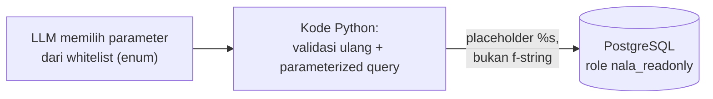
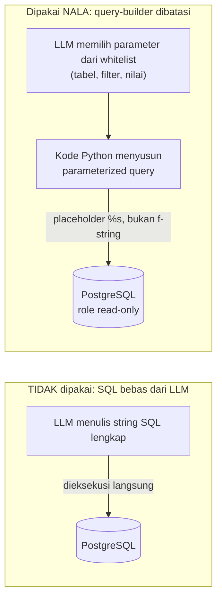

# Module 21: Tool Baru — Query SQL ke Data Operasional (PostgreSQL)

## Tujuan

Menambahkan tool kedua ke agent NALA (Module 20) untuk menjawab pertanyaan data transaksi operasional (status pengajuan kredit, klaim asuransi) yang tidak pernah ada di dokumen SOP, dengan pendekatan query-builder yang dibatasi (bukan SQL bebas dari LLM) supaya aman untuk data finansial nasabah. Module ini **tidak** menyiapkan PostgreSQL/seed/role dari nol — semua itu sudah dibangun dan diverifikasi di Module 19 (Setup Data Operasional). Module ini murni membangun kode tool yang **membaca** data yang sudah ada di sana, lewat role `nala_readonly` yang sudah tersedia.

## Definisi

Pendekatan umum untuk menjawab pertanyaan data lewat bahasa natural disebut **text-to-SQL**: LLM menerima skema tabel, lalu menulis query SQL lengkap sendiri. Tool SQL NALA **sengaja tidak** memakai pendekatan itu — sebagai gantinya dipakai **query-builder yang dibatasi (whitelisted)**: LLM cuma memilih parameter terstruktur (nama tabel, mode, filter) dari daftar tetap lewat `enum` skema tool, sementara kode Python sendiri yang menyusun query SQL final. Ini variasi dari pola **tool-use** yang sudah dikenal sejak Module 20 (tool RAG) — bedanya, tool ini menyentuh data transaksi finansial nasabah, sehingga risikonya jauh lebih tinggi kalau LLM diberi kebebasan penuh menulis SQL.

Keamanannya bertumpu pada **parameterized query** — nilai (status, `nasabah_id`) dikirim lewat placeholder `%s` terpisah dari struktur query, bukan digabung langsung ke string SQL (yang rentan **SQL injection**) — dipasang berlapis bersama validasi ulang di kode Python dan koneksi yang memakai role database `nala_readonly` (Module 19) yang secara struktural cuma bisa `SELECT`. Pola **defense in depth** ini (beberapa lapisan pertahanan independen, bukan mengandalkan satu titik saja) akan dipakai lagi dengan bentuk berbeda di Module 23 untuk RBAC.



## Hasil Akhir yang Diharapkan

- Tool `query_data_operasional` sudah dibangun: LLM hanya memilih parameter terstruktur dari whitelist (`enum` tabel/mode/status), kode Python yang menyusun query lewat parameterized query (`%s`), tidak ada jalur SQL bebas
- Tool ini memakai `get_connection()` yang sudah ada dari `app/db.py` (Module 19) — koneksi lewat role `nala_readonly`, tidak pernah lewat role tulis
- Tool ini terdaftar sebagai tool kedua di agent (`tools_schema`, cabang baru di `call_tool`) tanpa mengubah struktur graph dari Module 20
- `/chat` bisa menjawab pertanyaan jumlah/status data operasional maupun detail satu nasabah, memakai data yang sudah Anda tambahkan lewat `/data-operasional` di Module 19, sementara tool RAG (Module 20) tetap berfungsi berdampingan tanpa regresi
- `/chat` mendukung riwayat multi-turn (`history`, windowing 10 pesan) dan bisa dicoba langsung lewat toggle "Pakai Agent" di `chat.html`, tidak cuma lewat `curl`
- Angka mata uang (`jumlah_pengajuan`/`jumlah_klaim`) diformat eksplisit (`Rp 50.000.000`) di tool, dan pemanggilan tool tahan terhadap argumen tidak lengkap dari LLM (tidak crash jadi 500)
- Keterbatasan nyata model kecil didokumentasikan dengan angka (Bagian 6): sintesis jawaban dari hasil tool cuma berhasil ~20-33% dari percobaan berulang untuk kasus yang sama — dicatat jujur, bukan disembunyikan atau diklaim sudah terselesaikan

**Prasyarat**: Module 19 (service `postgres` sehat, tabel `pengajuan_kredit`/`klaim_asuransi` berisi data, role `nala_readonly` sudah ada dan terbukti hanya bisa `SELECT`) dan Module 20 (agent LangGraph dengan tool `cari_dokumen_sop` sudah jalan) harus sudah selesai.

## 1. Kenapa Dokumen SOP Saja Tidak Cukup

`sop-pengajuan-kredit.md` (dipakai sejak Module 5-14) menjelaskan **prosedur**: syarat dokumen, tahapan proses, estimasi waktu. Tapi staff finance sehari-hari juga bertanya hal yang jawabannya **tidak ada di prosedur mana pun**, karena jawabannya adalah data transaksi yang berubah setiap hari:

> "Berapa banyak pengajuan kredit yang statusnya masih pending minggu ini?"
> "Nasabah dengan ID N-00231, klaimnya sudah diproses belum?"

Tidak ada jumlah chunking atau reranking (Module 15-18) yang bisa membuat RAG menjawab ini dengan benar — jawabannya bukan tersembunyi di suatu dokumen yang belum ter-retrieve, jawabannya **tidak pernah ditulis di dokumen apa pun**, karena sifatnya data operasional yang berubah, bukan pengetahuan statis. Itu sebabnya PT Nusantara Finance butuh sumber data kedua: query langsung ke database operasional yang sudah disiapkan Module 19. Tool kedua ini yang dibangun di module ini, mengikuti pola tool pertama (Module 20) — fungsi Python biasa yang dipanggil lewat keputusan LLM, bukan hardcoded ke endpoint.

## 2. Risiko Nyata: Kenapa Tidak Boleh "LLM Menulis SQL Bebas"

Pendekatan paling gampang dibayangkan — dan **sengaja tidak dipakai di sini** — adalah: kirim skema tabel ke LLM, minta ia menulis query SQL lengkap sebagai argumen tool, lalu jalankan langsung ke database. Ini terdengar fleksibel, tapi punya dua masalah serius untuk sistem yang menyentuh data finansial nasabah sungguhan:

1. **SQL injection dari arah yang tidak biasa.** Bukan user jahat yang menyisipkan `; DROP TABLE` lewat form input (itu sudah lama diatasi lewat parameterized query di banyak sistem) — di sini risikonya adalah **LLM itu sendiri** yang bisa menghasilkan query destruktif atau bocor-data, baik karena salah paham konteks, halusinasi, maupun (skenario lebih serius untuk sistem produksi) prompt injection lewat konten yang di-retrieve (mis. dokumen yang sengaja diracuni berisi instruksi tersembunyi). LLM yang menulis SQL bebas berarti **string yang tidak sepenuhnya bisa diverifikasi aman, dieksekusi langsung** ke database produksi.
2. **Tidak ada batas query yang bisa dijalankan.** SQL bebas berarti LLM secara teori bisa menulis `SELECT *` tanpa `WHERE`, join ke tabel yang tidak seharusnya diakses role tertentu (lihat Module 23), atau query yang mahal secara performa (full table scan berulang).

### Pendekatan yang dipakai NALA: query-builder yang dibatasi (whitelisted), bukan SQL bebas

Alih-alih menerima string SQL dari LLM, tool SQL NALA menerima **parameter terstruktur** (nama tabel dari daftar tertentu, nama kolom filter dari daftar tertentu, nilai filter) — lalu **kode Python kita sendiri** yang menyusun query SQL final, selalu lewat parameterized query (placeholder `%s`, bukan f-string/format string). LLM tidak pernah punya kuasa menulis SQL mentah — ia cuma memilih dari pilihan yang sudah dibatasi developer, mirip mengisi form dropdown, bukan menulis surat bebas.



Lapisan keamanan tambahan yang dipakai bersama-sama (bukan mengandalkan satu saja):

- **Role database read-only.** Koneksi yang dipakai tool ini memakai user PostgreSQL dengan hak akses `SELECT` saja — role ini (`nala_readonly`) sudah dibuat dan diverifikasi dua arah di Module 19 — bahkan kalau ada celah di lapisan query-builder, user ini secara struktural tidak bisa `INSERT`/`UPDATE`/`DELETE`/`DROP`.
- **Whitelist nama tabel & kolom.** Nama tabel dan kolom filter yang boleh dipakai ditentukan lewat `enum` di skema tool (bukan string bebas) — LLM tidak bisa meminta tabel/kolom yang tidak terdaftar sama sekali, jadi tidak ada jalan untuk "menebak" nama tabel sensitif lain di database yang sama.
- **Limit baris & timeout.** Query selalu membawa `LIMIT` tetap dan timeout koneksi, supaya kesalahan/salah paham LLM (mis. lupa filter) tidak berujung menyedot seluruh tabel atau membebani database.

## 3. Struktur Kode yang Ditambahkan

Dua tahap: **Tahap A** membangun tool query-builder, **Tahap B** mendaftarkan tool kedua ini ke agent (Module 20). Tidak ada tahap setup database di module ini — service PostgreSQL, skema tabel, data, dan role `nala_readonly` semuanya sudah ada dari Module 19.

### Tahap A — Bangun tool query-builder

**Langkah 1 — Buat `app/tools/sql_tool.py`**

```python
# app/tools/sql_tool.py
import psycopg

from app.db import get_connection

SQL_TOOL_SCHEMA = {
    "type": "function",
    "function": {
        "name": "query_data_operasional",
        "description": (
            "Mengambil data operasional PT Nusantara Finance — pengajuan kredit atau "
            "klaim asuransi milik nasabah tertentu, atau ringkasan jumlah berdasarkan "
            "status. Gunakan untuk pertanyaan tentang STATUS, JUMLAH, atau DATA "
            "TRANSAKSI spesifik (bukan untuk pertanyaan tentang prosedur/syarat, itu "
            "tugas tool cari_dokumen_sop)."
        ),
        "parameters": {
            "type": "object",
            "properties": {
                "tabel": {
                    "type": "string",
                    "enum": ["pengajuan_kredit", "klaim_asuransi"],
                    "description": "Tabel data yang ingin diquery",
                },
                "mode": {
                    "type": "string",
                    "enum": ["hitung_per_status", "detail_nasabah"],
                    "description": (
                        "hitung_per_status: hitung jumlah baris per status (opsional "
                        "difilter status tertentu). detail_nasabah: ambil detail "
                        "baris untuk satu nasabah_id tertentu."
                    ),
                },
                "status": {
                    "type": "string",
                    "enum": ["pending", "disetujui", "ditolak", "pencairan", "diproses"],
                    "description": "Filter status (opsional, hanya untuk mode hitung_per_status)",
                },
                "nasabah_id": {
                    "type": "string",
                    "description": "ID nasabah (wajib untuk mode detail_nasabah), format N-XXXXX",
                },
            },
            "required": ["tabel", "mode"],
        },
    },
}

_ALLOWED_TABLES = {"pengajuan_kredit", "klaim_asuransi"}
_ALLOWED_STATUS = {"pending", "disetujui", "ditolak", "pencairan", "diproses"}
_MAX_ROWS = 20
_CURRENCY_COLUMNS = {"jumlah_pengajuan", "jumlah_klaim"}


def _format_value(col: str, val) -> str:
    if col in _CURRENCY_COLUMNS and val is not None:
        return f"Rp {val:,.0f}".replace(",", ".")
    return str(val)


def query_data_operasional(
    tabel: str, mode: str, status: str | None = None, nasabah_id: str | None = None
) -> str:
    if tabel not in _ALLOWED_TABLES:
        return f"Tabel '{tabel}' tidak dikenal/tidak diizinkan."

    try:
        with get_connection() as conn:
            with conn.cursor() as cur:
                if mode == "hitung_per_status":
                    if status is not None and status not in _ALLOWED_STATUS:
                        return f"Status '{status}' tidak dikenal."
                    if status:
                        cur.execute(
                            f"SELECT status, COUNT(*) FROM {tabel} WHERE status = %s GROUP BY status",  # noqa: S608
                            (status,),
                        )
                    else:
                        cur.execute(
                            f"SELECT status, COUNT(*) FROM {tabel} GROUP BY status"  # noqa: S608
                        )
                    rows = cur.fetchall()
                    if not rows:
                        return "Tidak ada data yang cocok."
                    return "\n".join(f"{s}: {c}" for s, c in rows)

                elif mode == "detail_nasabah":
                    if not nasabah_id:
                        return "nasabah_id wajib diisi untuk mode detail_nasabah."
                    cur.execute(
                        f"SELECT * FROM {tabel} WHERE nasabah_id = %s LIMIT %s",  # noqa: S608
                        (nasabah_id, _MAX_ROWS),
                    )
                    columns = [desc[0] for desc in cur.description]
                    rows = cur.fetchall()
                    if not rows:
                        return f"Tidak ditemukan data untuk nasabah_id '{nasabah_id}' di tabel {tabel}."
                    return "\n".join(
                        ", ".join(f"{col}={_format_value(col, val)}" for col, val in zip(columns, row))
                        for row in rows
                    )

                return f"Mode '{mode}' tidak dikenal."
    except psycopg.OperationalError:
        return "Tidak dapat terhubung ke database operasional saat ini."
```

`from app.db import get_connection` memakai fungsi yang **sudah ada** dari Module 19 — tidak ada dependency baru, tidak ada koneksi baru yang perlu dibuat di module ini. `get_connection()` memakai kredensial `nala_readonly` (dibuat & diverifikasi Module 19) — **bukan** `nala_admin` atau `nala_writer`. Ini konsekuensi langsung dari Bagian 2: koneksi yang dipakai untuk melayani pertanyaan LLM harus selalu lewat role paling terbatas yang cukup untuk tugasnya.

**`_format_value()` ditambahkan setelah uji nyata** (lihat Bagian 6) — tanpa ini, kolom `jumlah_pengajuan`/`jumlah_klaim` dikembalikan sebagai angka mentah (`50000000.00`), dan `llama3.2:3b` pernah salah membaca ulang angka itu jadi `Rp 500.000.000` (salah 10x lipat) saat menyusun kalimat jawaban. Memformat angka jadi `Rp 50.000.000` **langsung di tool**, sebelum dikirim ke LLM, mengurangi peluang model perlu "menghitung ulang" formatnya sendiri.

Penjelasan kenapa desain ini tetap aman walau **terlihat** memakai f-string untuk nama tabel (`f"SELECT ... FROM {tabel} ..."`):

- **`tabel` tidak pernah langsung dari teks bebas LLM** — nilainya dibatasi `enum` di `SQL_TOOL_SCHEMA` (`["pengajuan_kredit", "klaim_asuransi"]`), dan **diverifikasi ulang** di kode Python lewat `if tabel not in _ALLOWED_TABLES` sebelum dipakai di query apa pun — pengecekan dobel (skema tool + kode) karena skema tool bisa saja diabaikan model yang "nakal"/berhalusinasi, jadi validasi di kode Python adalah pertahanan yang sesungguhnya, skema tool hanya mengarahkan perilaku normal.
- **Nilai (bukan struktur query)** — seperti `status`, `nasabah_id` — **selalu** lewat placeholder `%s` dan parameter terpisah ke `cur.execute()`, tidak pernah digabung ke string SQL. Ini yang benar-benar mencegah SQL injection secara teknis: `%s` membuat psycopg mengirim nilai sebagai data ke PostgreSQL, bukan sebagai teks yang diparse jadi bagian query.
- **Tidak ada mode "SQL bebas"** — hanya dua `mode` yang terdaftar (`hitung_per_status`, `detail_nasabah`), masing-masing menyusun struktur query yang **fixed**, cuma nilainya yang berubah dari argumen. LLM tidak pernah bisa "menciptakan" bentuk query baru yang tidak dirancang developer.
- **`LIMIT` tetap** (`_MAX_ROWS = 20`) di `detail_nasabah` mencegah satu query menarik seluruh isi tabel walau `nasabah_id` salah ketik jadi pola yang cocok ke banyak baris.
- **Koneksi lewat `nala_readonly`** (Module 19) sebagai lapisan terakhir — bahkan kalau semua validasi di atas entah bagaimana gagal, database sendiri menolak apa pun selain `SELECT`.

<details>
<summary><strong>Pakai Claude Code? Salin prompt berikut, paste untuk eksekusi Langkah 1</strong></summary>

```
Bangun tool query SQL yang dibatasi (bukan SQL bebas) untuk data
operasional (Module 21, Tahap A).

GOAL:
- Buat Nala/app/tools/sql_tool.py:
  - SQL_TOOL_SCHEMA (dict skema tool, nama "query_data_operasional",
    parameter: tabel (enum pengajuan_kredit/klaim_asuransi, wajib),
    mode (enum hitung_per_status/detail_nasabah, wajib), status
    (enum status yang valid, opsional), nasabah_id (string, opsional
    wajib untuk mode detail_nasabah)).
  - _ALLOWED_TABLES, _ALLOWED_STATUS (set), _MAX_ROWS = 20.
  - fungsi query_data_operasional(tabel, mode, status=None,
    nasabah_id=None) -> str yang: validasi tabel ada di
    _ALLOWED_TABLES (return pesan error kalau tidak); buka koneksi
    via get_connection() (import dari app.db); mode
    "hitung_per_status": SELECT status, COUNT(*) FROM {tabel} [WHERE
    status = %s] GROUP BY status (%s placeholder untuk value status,
    BUKAN nama tabel/kolom yang selalu dari whitelist); mode
    "detail_nasabah": validasi nasabah_id ada, SELECT * FROM {tabel}
    WHERE nasabah_id = %s LIMIT %s (LIMIT pakai _MAX_ROWS); format
    hasil jadi string yang mudah dibaca; tangani
    psycopg.OperationalError dengan pesan error yang jelas, bukan
    crash.

CONTEXT:
- app/db.py (fungsi get_connection() memakai role nala_readonly)
  SUDAH ADA dari Module 19 — JANGAN buat ulang, cukup import.
- Tabel pengajuan_kredit dan klaim_asuransi, beserta role
  nala_readonly, sudah ada dan berisi data dari Module 19.

GUARDRAIL:
- JANGAN pernah menyusun query dengan menggabungkan nilai (status,
  nasabah_id) langsung ke dalam f-string SQL — WAJIB pakai placeholder
  %s dan parameter terpisah ke cur.execute().
- JANGAN tambahkan mode/parameter yang memungkinkan SQL bebas dari
  LLM.
- JANGAN ubah app/db.py, app/tools/rag_tool.py, atau struktur graph
  di app/agent.py yang sudah ada dari Module 19-20.
```

</details>

### Tahap B — Daftarkan tool kedua ke agent

**Langkah 2 — Perbarui `app/agent.py` supaya `call_tool` mengenali tool baru**

```python
# app/agent.py — ganti bagian relevan
from app.tools.rag_tool import RAG_TOOL_SCHEMA, rag_search
from app.tools.sql_tool import SQL_TOOL_SCHEMA, query_data_operasional


def build_agent(ollama_client, vector_store, ollama_base_url: str):
    tools_schema = [RAG_TOOL_SCHEMA, SQL_TOOL_SCHEMA]

    def call_model(state: AgentState) -> dict:
        response_message = ollama_client.chat(state["messages"], tools=tools_schema)
        return {"messages": [response_message]}

    def call_tool(state: AgentState) -> dict:
        last_message = state["messages"][-1]
        tool_messages = []
        for call in last_message.get("tool_calls", []):
            name = call["function"]["name"]
            args = call["function"]["arguments"]

            try:
                if name == "cari_dokumen_sop":
                    result = rag_search(args["query"], vector_store, ollama_base_url, reranker=reranker)
                elif name == "query_data_operasional":
                    result = query_data_operasional(**args)
                else:
                    result = f"Tool '{name}' tidak dikenal."
            except (TypeError, KeyError) as e:
                result = f"Tool '{name}' dipanggil dengan argumen tidak lengkap/tidak valid ({e}). Coba tanyakan ulang dengan lebih spesifik."

            tool_messages.append({"role": "tool", "content": result, "tool_call_id": call.get("id"), "name": name})
        return {"messages": tool_messages}

    # should_continue, graph.add_node/add_edge/compile() TIDAK berubah dari Module 20
    ...
```

Perubahan dibanding Module 20: `tools_schema` sekarang berisi **dua** skema (bukan satu), dan `call_tool` punya cabang `elif` baru yang memanggil `query_data_operasional(**args)`. Struktur graph itu sendiri (`call_model` → `should_continue` → `call_tool`/`END` → kembali ke `call_model`) **tidak berubah sama sekali** — inilah keuntungan pola LangGraph yang sudah dibangun di Module 20: menambah tool kedua tidak butuh mendesain ulang alur, cukup mendaftarkan skema baru dan menambah satu cabang di `call_tool`.

Dua penambahan lain (di luar rencana awal, ditemukan lewat uji nyata — lihat Bagian 6):

- **`try/except (TypeError, KeyError)`** di sekitar pemanggilan tool — sebelum ada ini, `llama3.2:3b` pernah memanggil `query_data_operasional` **tanpa** parameter `tabel` (wajib), menyebabkan `TypeError` yang meng-*crash* seluruh request jadi `500 Internal Server Error`. Tool-calling model kecil tidak selalu mengirim argumen lengkap — kode pemanggil tool harus tahan terhadap itu, bukan berasumsi argumen selalu benar.
- **`"tool_call_id": call.get("id")` dan `"name": name`** ditambahkan ke pesan `role: "tool"` — praktik standar protokol tool-calling (menghubungkan hasil tool ke permintaan spesifiknya) yang sebelumnya terlewat. Perbaikan ini **benar secara protokol**, tapi (diuji langsung, lihat Bagian 6) **tidak** menyelesaikan masalah inti ketidakkonsistenan model — tetap dipertahankan karena tidak merugikan dan lebih sesuai standar, bukan karena terbukti memperbaiki akurasi.

**▶️ Jalankan & lihat hasilnya**

```bash
docker compose up --build api
```

```bash
curl -X POST http://localhost:8000/chat \
  -H "Content-Type: application/json" \
  -d '{"message": "Berapa banyak pengajuan kredit yang statusnya pending?"}'
```

✅ **Indikator sukses**: jawaban menyebut angka **sesuai data yang sudah Anda tambahkan di Module 19** (bukan angka seed tetap — data `pengajuan_kredit` sekarang campuran seed minimal + apa pun yang Anda input lewat form `/data-operasional`). Kalau ingin memverifikasi manual angka pastinya:

```bash
docker compose exec postgres psql -U nala_admin -d nala_operasional -c "SELECT status, COUNT(*) FROM pengajuan_kredit GROUP BY status;"
```

dan bandingkan hasilnya dengan jawaban `/chat` — keduanya harus cocok. Coba juga (ganti `N-00231` dengan salah satu `nasabah_id` yang benar-benar ada di data Anda):

```bash
curl -X POST http://localhost:8000/chat \
  -H "Content-Type: application/json" \
  -d '{"message": "Bagaimana status pengajuan kredit nasabah N-00231?"}'
```

✅ Jawaban harus menyebut status yang sesuai dengan baris `nasabah_id` tersebut di database. Terakhir, verifikasi tool pertama (Module 20) tidak rusak:

```bash
curl -X POST http://localhost:8000/chat \
  -H "Content-Type: application/json" \
  -d '{"message": "Apa saja syarat pengajuan kredit untuk nasabah perorangan?"}'
```

✅ Jawaban tetap berbasis dokumen SOP seperti sebelumnya — bukti dua tool berdampingan tanpa saling mengganggu.

<details>
<summary><strong>Pakai Claude Code? Salin prompt berikut, paste untuk eksekusi Langkah 2</strong></summary>

```
Daftarkan tool query SQL sebagai tool kedua di agent (Module 21,
Tahap B).

GOAL:
- Di Nala/app/agent.py: import
  SQL_TOOL_SCHEMA dan query_data_operasional dari app.tools.sql_tool;
  tambahkan SQL_TOOL_SCHEMA ke list tools_schema (sekarang berisi dua
  skema); tambah cabang elif di dalam loop call_tool: kalau name ==
  "query_data_operasional", result = query_data_operasional(**args).

CONTEXT:
- app/agent.py sudah punya struktur graph lengkap dari Module 20 —
  struktur graph (node/edge) TIDAK berubah, hanya isi call_tool dan
  daftar tools_schema yang bertambah.
- app/tools/sql_tool.py (SQL_TOOL_SCHEMA, query_data_operasional)
  sudah dibangun di Tahap A module ini.
- Data dan role nala_readonly yang dipakai tool ini sudah ada dari
  Module 19.

GUARDRAIL:
- JANGAN ubah app/tools/rag_tool.py atau struktur graph (should_continue,
  add_node, add_edge) yang sudah ada dari Module 20.
- JANGAN tambahkan mode/parameter baru ke sql_tool.py di langkah ini —
  cukup daftarkan yang sudah ada.
```

</details>

### Tahap C — Dua penyesuaian tambahan (ditemukan lewat uji nyata)

**Langkah 3 — Perbarui `NALA_SYSTEM_PROMPT_AGENT` supaya menyebut KEDUA tool**

`NALA_SYSTEM_PROMPT_AGENT` ditulis di Module 20, saat agent baru punya **satu** tool — isinya cuma bilang "kamu punya akses ke tool untuk mencari dokumen SOP". Setelah tool kedua (`query_data_operasional`) didaftarkan di Langkah 2, system prompt itu **tidak lagi akurat** — dan ternyata ini bukan cuma soal kelengkapan dokumentasi: system prompt yang tidak menyebut tool kedua membuat `llama3.2:3b` lebih sering gagal memakai hasil tool itu dengan benar (lihat Bagian 6).

```python
# app/system_prompt.py — NALA_SYSTEM_PROMPT_AGENT, versi final Module 21
NALA_SYSTEM_PROMPT_AGENT = """Kamu adalah NALA, asisten AI serba bisa untuk PT Nusantara Finance.
Kamu punya akses ke dua tool:
1. cari_dokumen_sop — untuk pertanyaan tentang prosedur, syarat, atau kebijakan internal.
2. query_data_operasional — untuk pertanyaan tentang status, jumlah, atau detail data transaksi
   (pengajuan kredit, klaim asuransi) milik nasabah tertentu.
Gunakan tool yang sesuai dengan jenis pertanyaannya — jangan menjawab dari ingatanmu sendiri
untuk hal-hal itu.
Kalau sebuah tool sudah mengembalikan hasil, PERCAYA dan PAKAI hasil itu apa adanya untuk
menjawab — jangan bilang "tidak ditemukan" kalau hasil tool sebenarnya berisi data yang relevan.
Jika hasil tool benar-benar kosong atau tidak relevan, baru katakan dengan jujur bahwa
informasinya tidak ditemukan. Jangan mengarang jawaban.
"""
```

**Langkah 4 — Dukungan riwayat multi-turn di `/chat`, plus toggle di UI chat**

`/chat` (endpoint baru sejak Module 20) awalnya cuma menerima satu `message` (string), beda dari `/chat/stream` yang menerima `messages` (array riwayat) sejak Module 6. Ini artinya mode Agent (lewat `/chat`) awalnya **tidak** bisa memahami pertanyaan lanjutan tanpa konteks eksplisit. Diperbaiki dengan menambah field opsional `history`:

```python
# app/main.py — ChatMessage dipindah ke atas ChatRequest supaya bisa direferensikan
class ChatMessage(BaseModel):
    role: str
    content: str


class ChatRequest(BaseModel):
    message: str
    history: list[ChatMessage] = []
```

```python
# app/main.py — di dalam chat(), sebelum membangun initial_state
history_messages = [{"role": m.role, "content": m.content} for m in request.history]
recent_history = (history_messages + [{"role": "user", "content": request.message}])[-HISTORY_WINDOW:]

initial_state = {
    "messages": [
        {"role": "system", "content": NALA_SYSTEM_PROMPT_AGENT},
        *recent_history,
    ]
}
```

Windowing `HISTORY_WINDOW` (`=10`, sudah ada sejak Module 6 untuk `/chat/stream`) dipakai ulang di sini — konsisten, bukan angka baru. `history` bersifat **opsional** (`= []`) supaya pemanggilan `/chat` lama (cuma kirim `message`, tanpa `history`) tetap valid, tidak ada breaking change.

Supaya bisa dicoba langsung tanpa `curl`, `chat.html` juga ditambah **toggle** "Pakai Agent" — saat dicentang, form mengirim ke `/chat` (bukan `/chat/stream`) beserta `conversation` sebagai `history`, tanpa streaming (jawaban muncul sekaligus setelah agent selesai, bisa beberapa putaran tool-calling):

```javascript
// app/templates/chat.html — cabang baru di submit handler, singkatan
if (agentModeCheckbox.checked) {
    const history = conversation.slice(0, -1); // semua pesan sebelumnya, tidak termasuk pesan baru ini
    const response = await fetch("/chat", {
        method: "POST",
        headers: { "Content-Type": "application/json" },
        body: JSON.stringify({ message, history }),
    });
    const data = await response.json();
    fullReply = data.reply;
} else {
    // ...perilaku /chat/stream yang sudah ada, tidak berubah...
}
```

**▶️ Jalankan & lihat hasilnya**

```bash
docker compose up --build api
```

```bash
python3 -c "
import urllib.request, json

data = json.dumps({'message': 'Berapa banyak pengajuan kredit yang statusnya pending?', 'history': []}).encode()
req = urllib.request.Request('http://localhost:8000/chat', data=data, headers={'Content-Type': 'application/json'}, method='POST')
turn1 = json.loads(urllib.request.urlopen(req).read().decode())
print('Turn 1:', turn1['reply'])

history = [
    {'role': 'user', 'content': 'Berapa banyak pengajuan kredit yang statusnya pending?'},
    {'role': 'assistant', 'content': turn1['reply']},
]
data = json.dumps({'message': 'Kalau yang ditolak, ada berapa?', 'history': history}).encode()
req = urllib.request.Request('http://localhost:8000/chat', data=data, headers={'Content-Type': 'application/json'}, method='POST')
turn2 = json.loads(urllib.request.urlopen(req).read().decode())
print('Turn 2 (tanpa sebut \'pengajuan kredit\' lagi):', turn2['reply'])
"
```

✅ **Indikator sukses**: giliran 2 (yang tidak menyebut "pengajuan kredit" sama sekali) tetap dijawab dengan topik/tabel yang benar — bukti riwayat dari giliran 1 berhasil dipahami. (Catatan: `curl` biasa juga bisa dipakai, tapi Python di atas menghindari isu encoding/quoting untuk payload JSON bersarang di shell.)

**📄 Kode lengkap Module 21** (`app/tools/sql_tool.py`, `app/system_prompt.py`, potongan relevan `app/agent.py`/`app/main.py`/`app/templates/chat.html` — sudah ditampilkan utuh di Langkah 1-4 di atas).

## 4. Apa yang TIDAK Ada di Module Ini

- Routing eksplisit yang dijelaskan/didiagnosis mendalam antara dua tool — module ini baru **membuktikan** kedua tool bekerja lewat contoh pertanyaan yang jelas-jelas satu arah; kasus ambigu dan salah pilih tool baru dibahas Module 22.
- Pembatasan akses tool SQL berdasarkan role user — saat ini **siapa pun** yang memanggil `/chat` bisa memicu tool SQL. Ini **secara sengaja belum aman untuk production** dan diperbaiki di Module 23 (RBAC).
- Audit trail siapa mengakses data siapa — Module 23.

## 5. Checkpoint Praktik

Langkah eksekusi lengkap ada di bagian **Panduan Praktik** di bawah (Langkah 11-13). Yang perlu dipastikan sebelum lanjut ke Module 22:

- [ ] `app/tools/sql_tool.py` berhasil dibuat, `query_data_operasional` memakai `get_connection()` yang sudah ada (bukan koneksi baru)
- [ ] `/chat` bisa menjawab pertanyaan jumlah/status dari data operasional lewat `query_data_operasional`, dan angkanya cocok dengan data yang sudah Anda tambahkan di Module 19
- [ ] `/chat` bisa menjawab pertanyaan detail satu nasabah tertentu
- [ ] Tool RAG (Module 20) tetap berfungsi berdampingan, tidak ada regresi
- [ ] Multi-turn (Langkah 4) bekerja — pertanyaan lanjutan yang tidak menyebut ulang topik tetap dipahami lewat `history`

## 6. Hasil Uji Nyata: Tool Selalu Benar, Sintesis Jawaban Tidak Selalu

Module ini diuji jauh lebih dalam dari sekadar "jalankan sekali, lihat hasilnya" — pertanyaan yang sama (*"Bagaimana status pengajuan kredit nasabah N-00231?"*) dikirim **berulang kali** dalam kondisi identik, untuk melihat apakah hasilnya konsisten. Jawabannya: **tidak**.

Trace Langfuse (span `agent_tool:query_data_operasional`) mengonfirmasi **tool selalu mengembalikan data yang benar, setiap kali**, tanpa kecuali:
```
result: id=1, nasabah_id=N-00231, nama_nasabah=Budi Santoso, jumlah_pengajuan=Rp 50.000.000, status=pending, tanggal_pengajuan=2026-09-16, alasan_penolakan=None
```

Tapi generasi jawaban akhir (`agent_call_model` kedua, setelah hasil tool tersedia) **tidak selalu memakainya dengan benar**. Tiga kondisi diuji, masing-masing 3-5 kali berturut-turut:

| Kondisi | Tingkat keberhasilan | Catatan |
|---|---|---|
| Default (`OllamaClient.chat()` tanpa override) | 1/3 (33%) | Kadang jawaban lengkap & akurat, kadang "tidak ditemukan" padahal data ada |
| `temperature=0` (dicoba sebagai mitigasi) | 0/5 (0%) | **Lebih buruk** — bukan memperbaiki, malah mengunci model ke jalur jawaban yang salah secara konsisten |
| + `tool_call_id`/`name` di pesan tool (perbaikan protokol) | 1/5 (20%) | Tidak memperbaiki secara berarti; satu percobaan bahkan menghasilkan mode kegagalan baru (model "membocorkan" format skema tool mentah ke jawaban) |

**Kesimpulan jujur dari eksperimen ini**: ini bukan bug kode yang bisa diperbaiki dengan penyesuaian kecil — ini keterbatasan kapabilitas `llama3.2:3b` dalam mensintesis hasil tool terstruktur jadi kalimat jawaban, yang **tidak deterministik** dan **tidak membaik** dengan menurunkan `temperature` (temuan yang berlawanan dari intuisi umum "temperature rendah = lebih akurat" — di sini temperature rendah cuma bikin *konsisten*, bukan *benar*). `NALA_SYSTEM_PROMPT_AGENT` versi final (Langkah 3, dengan instruksi eksplisit "PERCAYA dan PAKAI hasil tool") membantu tapi tidak menghilangkan masalah ini sepenuhnya.

Ini konsisten dengan pola yang sudah berulang kali ditemukan sepanjang kurikulum ini (Module 16 Bagian 8 "Temuan Tambahan") — model kecil (3B parameter) punya batas kemampuan penalaran yang tidak bisa diatasi murni lewat rekayasa prompt/parameter. Kalau NALA production butuh akurasi lebih tinggi untuk kasus seperti ini, `qwen2.5:7b` (opsi upgrade RAM 32GB+, disebut sejak README utama) adalah jalur yang lebih realistis dibanding terus mengutak-atik prompt untuk model 3B.

## Kesimpulan

Tool kedua ini membuktikan pola dari Module 20 memang bisa berkembang: menambah kemampuan baru ke agent tidak berarti menulis ulang graph, cukup menambah skema tool dan cabang eksekusi. Module ini sengaja tidak menyentuh setup database sama sekali — Postgres, skema, data, dan pemisahan role sudah selesai di Module 19, jadi pekerjaan di sini murni soal **keamanan tool**: NALA sengaja tidak pernah membiarkan LLM menulis SQL bebas — pilihannya dibatasi lewat `enum` skema tool, divalidasi ulang di kode Python, dieksekusi lewat parameterized query, dan dijalankan lewat role database (`nala_readonly`, dari Module 19) yang secara struktural cuma bisa membaca. Lapisan-lapisan ini bekerja bersama supaya kesalahan di satu lapisan (termasuk model yang berhalusinasi atau salah paham) tidak otomatis berarti kebocoran atau kerusakan data.

## Panduan Praktik

> Catatan penomoran: bagian ini memakai penomoran "Langkah" tersendiri (melanjutkan urutan global lintas-module: Module 19 = Langkah 1-5, Module 20 = Langkah 6-10, module ini = Langkah 11-13) yang berbeda dari "Langkah 1-4" di dalam bagian struktur kode materi.md di atas — keduanya kebetulan bertumpang tindih penomoran tapi berasal dari dua urutan yang terpisah, peninggalan dari saat panduan ini masih satu dokumen gabungan Module 19-23.

**Panduan Praktik — Module 21: Tool Baru — Query SQL ke Data Operasional (PostgreSQL)**

Lanjutan langsung dari bagian Panduan Praktik di materi Module 20 — agent LangGraph dengan tool `cari_dokumen_sop` harus sudah jalan lewat `/chat` sebelum mulai di sini. Penomoran Langkah melanjutkan penomoran global (Module 19: Langkah 1-5, Module 20: Langkah 6-10).

### Prasyarat
- Module 20 selesai: endpoint `/chat` sudah membalas lewat agent (tool RAG), `/chat/stream` tidak berubah.
- Data operasional dari Module 19 (7 baris `pengajuan_kredit`, 4 baris `klaim_asuransi`) masih ada di database.

### Langkah 11: Tool query-builder untuk data operasional (Module 21)

Ikuti Module 21 `materi.md` bagian tool query-builder (`app/tools/sql_tool.py`) — dibangun di atas `get_connection()` (`app/db.py`) dan role `nala_readonly` yang sudah disiapkan Module 19, bukan raw SQL bebas dari LLM.

```bash
docker compose exec api python -c "
from app.tools.sql_tool import query_data_operasional
print(query_data_operasional(tabel='pengajuan_kredit', mode='hitung_per_status'))
"
```

✅ **Indikator sukses**: daftar status beserta jumlahnya (mis. `pending: 3`, dst.) sesuai data yang sudah dimasukkan lewat form di Module 19 Langkah 5.

### Langkah 12: Daftarkan tool SQL ke agent (Module 21)

Ikuti Module 21 `materi.md` bagian pendaftaran tool SQL ke agent (`app/agent.py`).

```bash
docker compose up --build api
```

```bash
curl -X POST http://localhost:8000/chat \
  -H "Content-Type: application/json" \
  -d '{"message": "Berapa banyak pengajuan kredit yang statusnya pending?"}'
```

✅ **Indikator sukses**: jawaban menyebut angka yang sesuai (`3`, mengikuti distribusi data Module 19 Langkah 5).

### Langkah 13: Uji detail nasabah, pastikan tool RAG tidak rusak

```bash
curl -X POST http://localhost:8000/chat \
  -H "Content-Type: application/json" \
  -d '{"message": "Bagaimana status pengajuan kredit nasabah N-00231?"}'

curl -X POST http://localhost:8000/chat \
  -H "Content-Type: application/json" \
  -d '{"message": "Apa saja syarat pengajuan kredit untuk nasabah perorangan?"}'
```

✅ **Indikator sukses**: pertanyaan pertama menyebut status `pending` untuk N-00231; pertanyaan kedua tetap menjawab dari dokumen SOP seperti sebelumnya. Module 21 selesai — lanjut ke bagian Panduan Praktik di materi Module 22.

### Troubleshooting

- **`permission denied for table ...` padahal seharusnya diizinkan**: tool SQL (Module 21) harus memakai `nala_readonly` (bukan `nala_admin`/`nala_writer`) — tertukar salah satunya akan memicu `permission denied` untuk operasi yang seharusnya sah.
- **Angka yang dijawab `/chat` tidak cocok dengan database**: verifikasi manual dulu isi tabel (`docker compose exec postgres psql -U nala_admin -d nala_operasional -c "SELECT status, COUNT(*) FROM pengajuan_kredit GROUP BY status;"`) — kalau datanya beda dari yang diasumsikan, ulangi Module 19 Langkah 5 sampai datanya sesuai target (7 baris `pengajuan_kredit`, 4 baris `klaim_asuransi`).
- **Error umum lain** (`no configuration file provided`, `failed to read dockerfile`, port sudah dipakai, dsb.): lihat bagian Panduan Praktik > Troubleshooting di materi.md module-module sebelumnya (Module 5-14) — penyebab dan solusinya sama, tidak spesifik rangkaian Module 19-23.

---

Untuk informasi lebih lanjut, lihat [README utama](../README.md).
