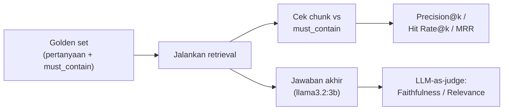
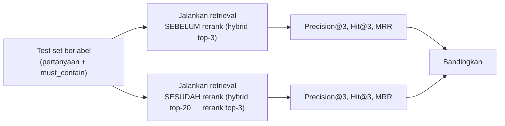

# Module 22: Framework Evaluasi RAG

## Tujuan

Membangun framework evaluasi retrieval berbasis test set berlabel kecil dan metrik terukur (Precision@k, Hit Rate@k, MRR), plus LLM-as-judge lokal, supaya klaim "hybrid search dan reranking lebih baik" bisa diukur ulang secara objektif — bukan cuma dibandingkan manual per pertanyaan seperti Module 18-20.

## Definisi

**Test set berlabel** (juga disebut *golden set*) adalah kumpulan pertanyaan yang jawaban benarnya sudah diketahui lebih dulu, dipakai untuk menjalankan retrieval berulang kali dengan hasil yang bisa dibandingkan secara objektif — bukan sekali coba lalu dibaca manual seperti Module 18-20. Di module ini, tiap pertanyaan diberi daftar **`must_contain`**: kata/frasa kunci yang pasti muncul di jawaban yang benar, dipakai sebagai proxy murah untuk menilai relevansi chunk (Bagian 3) — pengganti *qrels* (anotasi relevansi manual oleh ahli) yang di luar cakupan waktu pelatihan ini.

Dari test set itu dihitung tiga metrik retrieval (Bagian 2): **Precision@k** mengukur seberapa "bersih" k chunk teratas — berapa persen yang benar-benar relevan; **Hit Rate@k**, dipakai di sini sebagai proxy yang lebih sederhana untuk *recall* sesungguhnya, menjawab pertanyaan biner "apakah minimal satu chunk relevan berhasil masuk top-k"; dan **MRR (Mean Reciprocal Rank)** menangkap *posisi* — seberapa cepat chunk relevan pertama muncul, sehingga sensitif terhadap urutan hasil reranking, bukan cuma keanggotaannya. Ketiganya dipilih karena reranking (Module 20) menyortir ulang kandidat yang sama tanpa mengubah himpunannya — jadi hanya metrik yang peka urutan yang bisa membuktikan reranking benar-benar membantu.

Untuk menilai kualitas jawaban akhir (bukan cuma retrieval-nya), dipakai **LLM-as-judge**: model `llama3.2:3b` yang sama diberi prompt sempit untuk menskor **faithfulness** (apakah jawaban didukung penuh oleh konteks, atau modelnya berhalusinasi) dan **relevance** (apakah jawaban benar-benar menjawab pertanyaan yang diajukan) dengan skala 1-5. Karena judge-nya model kecil, skornya diperlakukan sebagai sinyal indikatif untuk menangkap kasus yang jelas buruk — bukan angka otoritatif untuk keputusan bisnis.



## Hasil Akhir yang Diharapkan

- `app/evaluation.py` berisi fungsi metrik murni (`is_relevant`, `precision_at_k`, `hit_rate_at_k`, `reciprocal_rank`), teruji lewat contoh dummy
- `app/eval_testset.py` berisi 10 pertanyaan berlabel (`must_contain`) dari `sop-pengajuan-kredit.md`
- `app/run_evaluation.py` bisa dijalankan (`python -m app.run_evaluation`) dan mencetak tabel perbandingan Precision@3/Hit Rate@3/MRR sebelum vs sesudah reranking, dengan delta — dibuktikan lewat uji nyata (Bagian 9): ketiga metrik naik setelah reranking (Precision@3 +0.133, Hit Rate@3 +0.400 hingga 100%, MRR +0.350), mengonfirmasi klaim kualitatif Module 18-20 dengan angka di seluruh 10 pertanyaan test set, bukan cuma satu contoh manual
- `app/llm_judge.py` menilai faithfulness dan relevance jawaban lewat `llama3.2:3b` sebagai judge lokal (offline, tanpa API cloud)
- Kita paham keterbatasan framework ini secara jujur: relevansi berbasis kata kunci adalah proxy (bukan anotasi manusia), test set 10 soal terlalu kecil untuk klaim statistik umum, dan skor LLM-judge model 3B bersifat indikatif/noisy, bukan otoritatif

## 1. Kenapa "Kelihatannya Lebih Baik" Tidak Cukup

Module 18, 19, dan 20 masing-masing diverifikasi dengan cara yang sama: kirim satu pertanyaan, baca jawabannya, bandingkan dengan sebelumnya secara manual. Ini cukup untuk membuktikan kode berjalan tanpa error — tapi tidak cukup untuk menjawab pertanyaan yang sebenarnya penting bagi PT Nusantara Finance: **apakah retrieval NALA, secara keseluruhan dan konsisten, benar-benar lebih baik setelah hybrid search dan reranking ditambahkan — atau cuma kebetulan lebih baik untuk satu-dua contoh pertanyaan yang dicoba?**

Satu pertanyaan yang dicoba manual tidak mewakili ratusan variasi pertanyaan yang akan diajukan staff sungguhan. Module ini membangun **test set berlabel kecil** (kumpulan pertanyaan dengan jawaban yang diketahui) dan **metrik terukur**, supaya perbandingan sebelum/sesudah reranking (dan evaluasi kualitas jawaban ke depannya) bisa dilakukan berulang, konsisten, dan objektif — bukan sekadar "kelihatannya lebih baik".



## 2. Metrik yang Dipakai — dan Kenapa Masing-Masing Penting

| Metrik | Menjawab pertanyaan | Formula (per query) |
|---|---|---|
| **Precision@k** | Dari k chunk yang dikirim ke LLM, berapa persen yang benar-benar relevan? | (jumlah chunk relevan di top-k) / k |
| **Hit Rate@k** (dipakai sebagai proxy Recall@k di module ini) | Apakah *setidaknya satu* chunk relevan ada di top-k? | 1 kalau ada, 0 kalau tidak |
| **MRR (Mean Reciprocal Rank)** | Seberapa tinggi posisi chunk relevan **pertama** muncul? | 1 / (peringkat chunk relevan pertama) |

**Catatan jujur soal "Recall"**: recall yang sesungguhnya (definisi standar information retrieval) adalah *(jumlah chunk relevan yang ditemukan) / (jumlah total chunk relevan yang ada di seluruh index)* — untuk menghitungnya secara benar, dibutuhkan anotasi manual yang mendaftar **semua** chunk relevan untuk tiap pertanyaan, bukan cuma satu. Test set kecil di module ini (Bagian 4) tidak melakukan anotasi selengkap itu — sebagai gantinya, dipakai **Hit Rate@k** sebagai proxy yang lebih sederhana: "apakah minimal satu chunk yang relevan berhasil ditemukan di top-k", tanpa mengklaim menghitung total populasi chunk relevan. Ini keterbatasan yang disengaja demi kepraktisan test set kecil — bukan diam-diam disamakan dengan recall yang sesungguhnya.

**Poin penting yang membedakan sebelum/sesudah reranking**: karena reranking (Module 20) **menyortir ulang** kandidat yang sama (top-20 dari `search_hybrid()`), bukan mengganti kandidatnya, maka **Hit Rate@20 akan selalu identik** sebelum dan sesudah reranking — himpunan 20 kandidatnya sama persis, cuma urutannya beda. Kalau tabel hasil di Bagian 9 menunjukkan Hit Rate@20 berubah antara sebelum/sesudah, itu tanda ada kesalahan di harness evaluasi, bukan efek nyata dari reranking. Yang **seharusnya** berubah oleh reranking adalah metrik pada potongan yang lebih kecil dan lebih sensitif urutan — **Precision@3**, **Hit Rate@3**, dan terutama **MRR** — karena ketiganya bergantung pada *urutan* dalam kandidat, bukan cuma keanggotaan di dalamnya.

### Cara membaca arah angka: naik = baik, turun = buruk

Ketiga metrik ini **"makin tinggi makin baik"** (rentang 0–1). Artinya **delta positif (`+`) selalu = perbaikan** dan **delta negatif (`−`) = penurunan kualitas retrieval**.

| Metrik | Arah baik | Naik (`+`) berarti | Turun (`−`) berarti |
|--------|-----------|--------------------|---------------------|
| **Precision@3** | ↑ makin tinggi makin baik | chunk relevan lebih padat di top-3 → jawaban fokus, hemat token | konteks tercemar chunk tak relevan |
| **Hit Rate@3** | ↑ (1.000 = sempurna) | lebih banyak pertanyaan dapat bahan relevan | ada pertanyaan tanpa chunk relevan di top-3 → "tidak ditemukan"/mengarang |
| **MRR** | ↑ makin tinggi makin baik | chunk relevan muncul di posisi lebih atas | chunk relevan ada tapi terkubur di bawah |

Interpretasi per metrik:

1. **Precision@3 — naik = BAIK.** Proporsi chunk relevan di 3 teratas bertambah → lebih sedikit chunk "sampah" ikut dikirim ke LLM → jawaban lebih fokus, hemat token, dan lebih kecil peluang model bingung/mengarang. **Turun = BURUK**: makin banyak chunk tak relevan mencemari konteks. *(Contoh: 0.300 → 0.433 = rata-rata chunk relevan di top-3 naik dari ~0,9 jadi ~1,3 dari 3.)*

2. **Hit Rate@3 — naik = BAIK.** Biner per pertanyaan: apakah ADA minimal satu chunk relevan di top-3. Naik = lebih banyak pertanyaan yang setidaknya punya "bahan benar" untuk dijawab; **1.000 = sempurna** (semua pertanyaan dapat bahan relevan). **Turun = BURUK**: ada pertanyaan yang sama sekali tak dapat chunk relevan di top-3 → NALA terpaksa bilang "tidak ditemukan" atau berisiko mengarang. *(Contoh: 0.600 → 1.000 = dari 6/10 jadi 10/10 pertanyaan berhasil.)*

3. **MRR — naik = BAIK.** Mengukur seberapa **tinggi** posisi chunk relevan pertama (posisi #1 → 1.0; #2 → 0.5; #3 → 0.33). Naik = chunk relevan cenderung lebih di atas → LLM melihatnya lebih dulu dan lebih kuat. **Turun = BURUK**: chunk relevan ada tapi terkubur di bawah. *(Contoh: 0.433 → 0.783 = chunk relevan pertama rata-rata naik dari sekitar posisi #2–3 ke mendekati posisi #1.)*

⚠️ **Satu pengecualian penting**: penurunan angka **baseline** ketika knowledge base bertambah dokumen distraktor (lihat Bagian 9 — mis. Hit Rate baseline turun dari ~0.800 ke 0.600 setelah dokumen POJK ditambahkan) **bukan** berarti sistemnya rusak/regresi kode. Itu tanda tugas retrieval jadi **lebih sulit** (lebih banyak chunk bersaing) — dan justru di situlah reranking membuktikan nilainya, karena delta perbaikannya malah membesar.

## 3. Relevansi Berbasis Kata Kunci: Proxy, Bukan Anotasi Manual

Untuk menilai apakah sebuah chunk hasil retrieval "relevan" terhadap sebuah pertanyaan, idealnya seorang ahli SOP di PT Nusantara Finance membaca tiap chunk dan memberi label relevan/tidak secara manual (disebut *qrels* — query relevance judgments — dalam riset IR). Itu di luar cakupan waktu pelatihan ini. Sebagai gantinya, module ini memakai heuristik yang jauh lebih murah tapi tetap masuk akal: setiap pertanyaan di test set diberi daftar `must_contain` — kata/frasa kunci yang **pasti** muncul di jawaban yang benar (diambil langsung dari isi dokumen SOP). Sebuah chunk dianggap "relevan" kalau ia memuat proporsi cukup besar dari kata-kata kunci itu.

```python
# app/evaluation.py
def is_relevant(chunk_text: str, must_contain: list[str]) -> bool:
    text_lower = chunk_text.lower()
    hits = sum(1 for kw in must_contain if kw.lower() in text_lower)
    return hits >= max(1, len(must_contain) // 2)
```

**Ini proxy, bukan ground truth sesungguhnya** — sebuah chunk bisa memuat kata-kata kunci tanpa benar-benar "menjawab" pertanyaan dengan tepat (*false positive*), atau menjawab dengan kalimat yang benar tapi kebetulan tidak memakai kata kunci yang sama persis (*false negative*, jarang terjadi di module ini karena `must_contain` diambil dari dokumen aslinya, bukan diparafrase). Untuk keperluan **membandingkan sebelum/sesudah reranking** pada test set yang sama, bias ini konsisten di kedua sisi perbandingan — jadi tetap valid untuk melihat *arah* perubahan (apakah reranking membantu atau tidak), walau angka absolutnya jangan diperlakukan sebagai kebenaran mutlak.

## 4. Test Set Berlabel: 10 Pertanyaan dari `sop-pengajuan-kredit.md`

Knowledge base yang tersedia saat ini di `Nala/knowledge-base/` berisi 6 dokumen: dua SOP markdown (`sop-pengajuan-kredit.md`, `sop-klaim-asuransi.md`), satu SOP dalam bentuk PDF (`sop-pembukaan-rekening-tabungan.pdf`) — ketiganya di-seed sejak Module 10 — satu catatan singkat hasil upload demo di Module 16 (`catatan-cabang-bandung.md`), plus dua dokumen regulasi nyata OJK yang ditambahkan saat mendemonstrasikan BM25/hybrid di Module 18-19: `pojk-6-2022-perlindungan-konsumen.pdf` dan penjelasannya `Peraturan OJK No. 6 Tahun 2022_Penjelasan.pdf` (batang tubuh POJK dipecah jadi ratusan chunk — sumber distraktor yang berguna untuk menguji ketahanan retrieval). Test set berikut tetap fokus ke `sop-pengajuan-kredit.md`, yang cukup kaya (5 bagian: tujuan dan ruang lingkup, syarat, tahapan proses, kontak, catatan) untuk membangun test set awal yang berarti. Kalau di deployment nyata knowledge base bertambah dokumen, format test set ini dirancang supaya tinggal ditambah entri baru, bukan ditulis ulang.

```python
# app/eval_testset.py
QA_TESTSET = [
    {
        "question": "Apa saja syarat pengajuan kredit untuk nasabah perorangan?",
        "must_contain": ["KTP", "Kartu Keluarga", "slip gaji", "NPWP"],
    },
    {
        "question": "Dokumen apa yang dibutuhkan badan usaha untuk mengajukan kredit?",
        "must_contain": ["Akte Pendirian", "NPWP Perusahaan", "Laporan Keuangan"],
    },
    {
        "question": "Berapa usia minimal dan maksimal nasabah perorangan untuk mengajukan kredit?",
        "must_contain": ["usia minimal 21 tahun", "maksimal 60 tahun"],
    },
    {
        "question": "Berapa lama proses verifikasi dokumen setelah pengajuan kredit?",
        "must_contain": ["2-3 hari kerja", "verifikasi kelengkapan dokumen"],
    },
    {
        "question": "Apa yang dilakukan tim Credit Analysis dalam proses penilaian kredit?",
        "must_contain": ["BI Checking", "debt-to-income ratio", "plafon kredit"],
    },
    {
        "question": "Berapa lama waktu persetujuan kredit untuk pengajuan di bawah Rp 500 juta?",
        "must_contain": ["processing time 1 hari kerja", "Komite Kredit"],
    },
    {
        "question": "Berapa lama pencairan dana setelah kredit disetujui?",
        "must_contain": ["2-3 hari kerja setelah approval", "Perjanjian Kredit"],
    },
    {
        "question": "Kapan NPWP dibutuhkan untuk pengajuan kredit perorangan?",
        "must_contain": ["NPWP", "bagi pengajuan di atas Rp 500 juta"],
    },
    {
        "question": "Bagaimana cara menghubungi bagian Customer Service NALA?",
        "must_contain": ["Ext. 1001", "cs@nusantarafinance.co.id"],
    },
    {
        "question": "Apa saja jenis kredit yang dilayani PT Nusantara Finance?",
        "must_contain": ["Kredit Konsumsi", "Kredit Modal Kerja", "Kredit Pemilikan Rumah"],
    },
]
```

Sepuluh pertanyaan ini **kecil secara sengaja** — cukup untuk mendemonstrasikan mekanisme evaluasi dan mendapat sinyal awal, tapi terlalu kecil untuk kesimpulan yang berlaku umum secara statistik (dibahas jujur di Bagian 7). Di deployment nyata, test set ini idealnya tumbuh ke puluhan/ratusan pertanyaan, mencakup variasi paraphrase dan seluruh dokumen SOP yang ada — bukan cuma satu file seperti di sini.

## 5. Struktur Kode yang Ditambahkan

Satu Tahap, empat Langkah: fungsi metrik (`app/evaluation.py`), test set (`app/eval_testset.py`, sudah ditulis di Bagian 4), skrip yang menjalankan keduanya dan mencetak tabel perbandingan, lalu LLM-as-judge lokal (Bagian 6).

**Prasyarat**: Module 21 sudah selesai — `Nala/` sudah punya reranking bekerja dan terhubung ke `/chat/stream` (Module 20), plus Langfuse sudah mencatat trace tiap request (Module 21). Tidak ada service Docker baru di module ini; alokasi RAM yang sama seperti Module 21 sudah cukup. Langfuse tidak wajib menyala untuk menjalankan evaluasi — tapi kalau menyala, tiap pemanggilan retrieval di dalam `run_evaluation.py` otomatis ikut ter-trace, sehingga pertanyaan yang skornya jeblok bisa langsung ditelusuri di dashboard.

**Langkah 1 — Fungsi metrik di `app/evaluation.py`**

```python
# app/evaluation.py
def is_relevant(chunk_text: str, must_contain: list[str]) -> bool:
    text_lower = chunk_text.lower()
    hits = sum(1 for kw in must_contain if kw.lower() in text_lower)
    return hits >= max(1, len(must_contain) // 2)


def precision_at_k(retrieved: list[dict], must_contain: list[str], k: int) -> float:
    top_k = retrieved[:k]
    if not top_k:
        return 0.0
    relevant_count = sum(1 for r in top_k if is_relevant(r["text"], must_contain))
    return relevant_count / len(top_k)


def hit_rate_at_k(retrieved: list[dict], must_contain: list[str], k: int) -> float:
    top_k = retrieved[:k]
    return 1.0 if any(is_relevant(r["text"], must_contain) for r in top_k) else 0.0


def reciprocal_rank(retrieved: list[dict], must_contain: list[str]) -> float:
    for i, r in enumerate(retrieved):
        if is_relevant(r["text"], must_contain):
            return 1.0 / (i + 1)
    return 0.0
```

- `precision_at_k`: proporsi chunk relevan di antara `k` chunk teratas — dipanggil dengan `k=3` untuk meniru persis apa yang benar-benar dikirim ke LLM (`/chat/stream` mengirim top-3, lihat Module 18-20).
- `hit_rate_at_k`: biner (0 atau 1) per pertanyaan — dirata-rata di Langkah 3 (`app/run_evaluation.py`) untuk semua pertanyaan di test set jadi persentase keberhasilan.
- `reciprocal_rank`: mengembalikan `1/posisi` chunk relevan **pertama** — kalau chunk relevan ada di posisi #1, nilainya `1.0`; posisi #2 → `0.5`; tidak ditemukan sama sekali → `0.0`. Rata-rata dari semua pertanyaan di test set (dihitung di Langkah 3) menghasilkan MRR.

**▶️ Jalankan & lihat hasilnya**

```bash
docker compose up --build api
```

```bash
docker compose exec api python -c "
from app.evaluation import is_relevant, precision_at_k, hit_rate_at_k, reciprocal_rank

dummy_results = [
    {'text': 'Kantor cabang buka Senin-Jumat'},
    {'text': 'Fotokopi KTP, Kartu Keluarga, slip gaji 3 bulan, NPWP untuk di atas 500 juta'},
    {'text': 'Estimasi waktu pencairan 2-3 hari kerja'},
]
must_contain = ['KTP', 'Kartu Keluarga', 'slip gaji', 'NPWP']

print('Precision@3:', precision_at_k(dummy_results, must_contain, k=3))
print('Hit Rate@3:', hit_rate_at_k(dummy_results, must_contain, k=3))
print('Reciprocal Rank:', reciprocal_rank(dummy_results, must_contain))
"
```

✅ **Indikator sukses**: `Precision@3` bernilai `0.333...` (cuma 1 dari 3 chunk dummy yang relevan), `Hit Rate@3` bernilai `1.0` (chunk relevan ada di posisi #2), `Reciprocal Rank` bernilai `0.5` (posisi #2 → `1/2`).

<details>
<summary><strong>Pakai Claude Code? Salin prompt berikut, paste untuk eksekusi Langkah 1</strong></summary>

```
Buat app/evaluation.py dengan fungsi metrik precision/hit-rate/MRR
(Module 22, Langkah 1) — belum dihubungkan ke retrieval sungguhan.

GOAL:
- Buat Nala/app/evaluation.py berisi 4
  fungsi:
  1. is_relevant(chunk_text: str, must_contain: list[str]) -> bool:
     hitung berapa kata di must_contain (case-insensitive) muncul di
     chunk_text, return True kalau jumlahnya >= max(1,
     len(must_contain) // 2).
  2. precision_at_k(retrieved: list[dict], must_contain: list[str],
     k: int) -> float: dari retrieved[:k], hitung proporsi yang
     is_relevant() True (pakai r["text"]); return 0.0 kalau
     retrieved[:k] kosong.
  3. hit_rate_at_k(retrieved: list[dict], must_contain: list[str], k:
     int) -> float: return 1.0 kalau ADA minimal satu r di
     retrieved[:k] yang is_relevant() True, else 0.0.
  4. reciprocal_rank(retrieved: list[dict], must_contain: list[str])
     -> float: loop enumerate(retrieved), return 1.0/(i+1) di posisi
     pertama yang is_relevant() True; return 0.0 kalau tidak ada yang
     relevan sama sekali.

CONTEXT:
- Dict di `retrieved` adalah hasil dari vector_store.search_hybrid()
  atau reranker.rerank() — selalu punya key "text" minimal.
- File ini fungsi murni (pure function), tidak memanggil OpenSearch
  atau Ollama sama sekali di sini.

GUARDRAIL:
- JANGAN tambah pemanggilan HTTP/network apa pun di file ini.
- JANGAN sentuh app/main.py, app/vector_store.py, app/reranker.py.
```

</details>

**Langkah 2 — Buat `app/eval_testset.py`**

Isi file ini persis seperti kode `QA_TESTSET` di Bagian 4 di atas — sepuluh dict `{"question": ..., "must_contain": [...]}`, disimpan sebagai satu konstanta list supaya mudah di-*import* dan ditambah entri baru ke depannya.

<details>
<summary><strong>Pakai Claude Code? Salin prompt berikut, paste untuk eksekusi Langkah 2</strong></summary>

```
Buat app/eval_testset.py (test set QA berlabel) — Module 22, Langkah 2.

GOAL:
- Buat Nala/app/eval_testset.py berisi satu konstanta QA_TESTSET: list
  of dict {"question": str, "must_contain": list[str]} — isi persis
  seperti yang tertulis di materi Module 22 Bagian 4 (10 pertanyaan
  tentang sop-pengajuan-kredit.md).

CONTEXT:
- File ini murni data test set (tidak ada logic), diimpor oleh
  app/run_evaluation.py (Langkah 3) lewat `from app.eval_testset
  import QA_TESTSET`.

GUARDRAIL:
- JANGAN ubah app/evaluation.py atau file lain.
- JANGAN memparafrase isi must_contain — salin persis dari Bagian 4
  (kata kunci diambil langsung dari dokumen SOP asli, bukan ditulis
  ulang dengan kata lain).
```

</details>

**Langkah 3 — Skrip perbandingan sebelum/sesudah reranking**

```python
# app/run_evaluation.py
from app.embeddings import embed_text
from app.eval_testset import QA_TESTSET
from app.evaluation import hit_rate_at_k, precision_at_k, reciprocal_rank
from app.reranker import Reranker
from app.vector_store import VectorStore

OLLAMA_BASE_URL = "http://ollama:11434"
OPENSEARCH_BASE_URL = "http://opensearch:9200"


def evaluate(retrieved_fn, label: str) -> dict:
    precisions, hits, rrs = [], [], []
    for item in QA_TESTSET:
        retrieved = retrieved_fn(item["question"])
        precisions.append(precision_at_k(retrieved, item["must_contain"], k=3))
        hits.append(hit_rate_at_k(retrieved, item["must_contain"], k=3))
        rrs.append(reciprocal_rank(retrieved, item["must_contain"]))

    n = len(QA_TESTSET)
    print(f"--- {label} ---")
    print(f"Precision@3 : {sum(precisions) / n:.3f}")
    print(f"Hit Rate@3  : {sum(hits) / n:.3f}")
    print(f"MRR         : {sum(rrs) / n:.3f}")
    return {"precision@3": sum(precisions) / n, "hit_rate@3": sum(hits) / n, "mrr": sum(rrs) / n}


if __name__ == "__main__":
    store = VectorStore(base_url=OPENSEARCH_BASE_URL, index_name="nala-docs")
    reranker = Reranker()

    def before_rerank(question: str) -> list[dict]:
        query_embedding = embed_text(question, base_url=OLLAMA_BASE_URL)
        return store.search_hybrid(question, query_embedding, top_k=3, candidate_pool=20)

    def after_rerank(question: str) -> list[dict]:
        query_embedding = embed_text(question, base_url=OLLAMA_BASE_URL)
        candidates = store.search_hybrid(question, query_embedding, top_k=20, candidate_pool=20)
        return reranker.rerank(question, candidates, top_k=3)

    before = evaluate(before_rerank, "SEBELUM Reranking (hybrid search saja)")
    after = evaluate(after_rerank, "SESUDAH Reranking (hybrid + cross-encoder)")

    print("\n--- Perbandingan ---")
    for metric in ["precision@3", "hit_rate@3", "mrr"]:
        delta = after[metric] - before[metric]
        print(f"{metric}: {before[metric]:.3f} -> {after[metric]:.3f} ({delta:+.3f})")
```

- **`before_rerank`**: memanggil `search_hybrid(..., top_k=3, ...)` langsung — persis alur Module 19 (tanpa reranking).
- **`after_rerank`**: memanggil `search_hybrid(..., top_k=20, ...)` untuk kandidat, lalu `reranker.rerank(..., top_k=3)` — persis alur Module 20.
- Kedua fungsi mengambil kandidat dari `candidate_pool=20` yang **sama** — perbedaan hasil murni berasal dari ada/tidaknya langkah reranking, bukan dari perbedaan jumlah kandidat awal yang diperiksa.

**▶️ Jalankan & lihat hasilnya**

```bash
docker compose up --build api
```

```bash
docker compose exec api python -m app.run_evaluation
```

✅ **Indikator sukses**: skrip mencetak tiga baris metrik untuk "SEBELUM Reranking" dan tiga baris untuk "SESUDAH Reranking", diikuti tabel perbandingan dengan delta (`+`/`-`). Untuk test set 10 pertanyaan ini, wajar melihat `MRR` dan `Precision@3` **sesudah** reranking sama atau lebih tinggi dari **sebelum** — kalau angkanya identik persis, kemungkinan besar knowledge base terlalu kecil untuk kandidat top-20 punya variasi urutan yang berarti (index seed awal cuma 4 dokumen kecil; setelah dua dokumen POJK ditambahkan di Bagian 4, variasi kandidatnya jauh lebih banyak — lihat Bagian 7).

**Troubleshooting**: kalau `docker compose exec api python -m app.run_evaluation` gagal dengan import error, pastikan `app/evaluation.py` (Langkah 1), `app/eval_testset.py` (Langkah 2), dan `app/run_evaluation.py` (Langkah 3) sudah dibuat semua, dan `docker compose up --build api` sudah dijalankan ulang setelah menambah file baru.

<details>
<summary><strong>Pakai Claude Code? Salin prompt berikut, paste untuk eksekusi Langkah 3</strong></summary>

```
Buat app/run_evaluation.py (skrip perbandingan sebelum/sesudah
reranking) — Module 22, Langkah 3.

GOAL:
- Buat Nala/app/run_evaluation.py:
  - Import QA_TESTSET, hit_rate_at_k/precision_at_k/reciprocal_rank
    dari app.evaluation, VectorStore, Reranker, embed_text.
  - Fungsi evaluate(retrieved_fn, label): loop QA_TESTSET, panggil
    retrieved_fn(item["question"]) untuk dapat hasil retrieval,
    hitung precision_at_k/hit_rate_at_k/reciprocal_rank(k=3) per
    item, cetak rata-rata ketiganya dengan label, return dict berisi
    ketiga rata-rata.
  - Di __main__: definisikan before_rerank() (search_hybrid top_k=3)
    dan after_rerank() (search_hybrid top_k=20 lalu reranker.rerank
    top_k=3), keduanya pakai candidate_pool=20. Jalankan evaluate()
    untuk keduanya, lalu cetak tabel delta antara before dan after
    untuk precision@3, hit_rate@3, mrr.

CONTEXT:
- app/evaluation.py (Langkah 1) dan app/eval_testset.py (Langkah 2)
  sudah ada. app/vector_store.py (Module 19), app/reranker.py
  (Module 20) sudah ada.
- Skrip ini dijalankan manual lewat `docker compose exec api python
  -m app.run_evaluation`, bukan endpoint FastAPI.

GUARDRAIL:
- JANGAN ubah app/main.py, app/vector_store.py, app/reranker.py,
  app/evaluation.py, app/eval_testset.py di langkah ini.
- before_rerank dan after_rerank WAJIB memakai candidate_pool yang
  sama (20) — perbedaan hasil harus murni dari reranking, bukan dari
  jumlah kandidat yang berbeda.
```

</details>

## 6. Faithfulness dan Relevance: LLM-as-Judge Lokal

Precision/Hit Rate/MRR mengukur kualitas **retrieval** (apakah chunk yang tepat ditemukan) — tapi tidak mengukur kualitas **jawaban akhir** yang dihasilkan `llama3.2:3b` dari chunk-chunk itu. Dua pertanyaan tambahan yang relevan di sini:

- **Faithfulness**: apakah jawaban benar-benar didukung oleh konteks yang diberikan, atau modelnya berhalusinasi menambahkan informasi yang tidak ada di konteks?
- **Relevance**: apakah jawaban benar-benar menjawab pertanyaan yang diajukan, bukan melenceng ke topik lain?

Karena NALA offline/private-first, evaluasi ini **tidak** memakai API judge cloud (GPT-4, Claude API, dst) — dijalankan lokal memakai `llama3.2:3b` yang sama, sebagai *judge*, dengan prompt yang sempit dan terstruktur:

**Langkah 4 — LLM-as-judge lokal di `app/llm_judge.py`**

```python
# app/llm_judge.py
import re

from app.ollama_client import OllamaClient

JUDGE_SYSTEM_PROMPT = """Kamu adalah evaluator jawaban AI. Kamu akan diberikan KONTEKS,
PERTANYAAN, dan JAWABAN. Tugasmu menilai dua hal dengan skor 1-5:
1. FAITHFULNESS: apakah JAWABAN didukung penuh oleh KONTEKS (bukan mengarang)?
   1 = mengarang total, 5 = seluruh klaim didukung konteks.
2. RELEVANCE: apakah JAWABAN benar-benar menjawab PERTANYAAN?
   1 = tidak nyambung, 5 = menjawab tepat sasaran.
Jawab HANYA dalam format persis:
FAITHFULNESS: <angka>
RELEVANCE: <angka>
Jangan tambahkan penjelasan lain."""


def judge_answer(judge_client: OllamaClient, context: str, question: str, answer: str) -> dict:
    prompt = f"KONTEKS:\n{context}\n\nPERTANYAAN:\n{question}\n\nJAWABAN:\n{answer}"
    raw = judge_client.generate(system_prompt=JUDGE_SYSTEM_PROMPT, user_message=prompt)

    faithfulness = re.search(r"FAITHFULNESS:\s*(\d)", raw)
    relevance = re.search(r"RELEVANCE:\s*(\d)", raw)
    return {
        "faithfulness": int(faithfulness.group(1)) if faithfulness else None,
        "relevance": int(relevance.group(1)) if relevance else None,
        "raw": raw,
    }
```

- Memakai ulang `OllamaClient.generate()` yang sudah ada sejak Module 6 — tidak butuh client baru, cuma system prompt yang berbeda.
- `re.search()` mengekstrak angka dari output model — dijaga dengan `if ... else None` karena model 3B **tidak selalu** patuh 100% pada format yang diminta; kalau parsing gagal, `None` menandakan hasil evaluasi untuk item itu tidak bisa dipakai, bukan mengasumsikan skor tertentu.
- Panggil `judge_client` dengan temperature serendah mungkin kalau `OllamaClient`/`generate()` mendukungnya (di luar cakupan perubahan module ini — `generate()` saat ini tidak mengekspos parameter `temperature`, jadi berjalan dengan default Ollama) — idealnya `temperature=0` untuk hasil judge yang lebih konsisten antar-run; dicatat sebagai potensi perbaikan, bukan diklaim sudah diterapkan.

**▶️ Jalankan & lihat hasilnya**

```bash
docker compose exec api python -c "
from app.llm_judge import judge_answer
from app.ollama_client import OllamaClient
import os

judge_client = OllamaClient(base_url='http://ollama:11434', model=os.environ.get('OLLAMA_MODEL', 'llama3.2:3b'))

context = 'Fotokopi KTP yang masih berlaku, Fotokopi Kartu Keluarga, Slip gaji 3 bulan terakhir'
question = 'Apa saja syarat pengajuan kredit untuk nasabah perorangan?'
answer = 'Syaratnya adalah fotokopi KTP, Kartu Keluarga, dan slip gaji 3 bulan terakhir.'

result = judge_answer(judge_client, context, question, answer)
print(result)
"
```

✅ **Indikator sukses**: output berisi `faithfulness` dan `relevance` bernilai 1-5 (bukan `None` — kalau `None`, model tidak mengikuti format yang diminta). Baca manual apakah skornya masuk akal untuk contoh ini — idealnya faithfulness dan relevance tinggi (4-5), karena `answer` memang murni berasal dari `context`.

**Troubleshooting**: kalau `judge_answer()` selalu mengembalikan `None` untuk `faithfulness`/`relevance`, `llama3.2:3b` kadang tidak mengikuti format output yang diminta secara persis — cek `result['raw']` untuk melihat apa yang sebenarnya dikembalikan model, dan coba jalankan ulang (model kecil tidak selalu konsisten di percobaan pertama).

<details>
<summary><strong>Pakai Claude Code? Salin prompt berikut, paste untuk eksekusi Langkah 4</strong></summary>

```
Buat app/llm_judge.py (LLM-as-judge lokal untuk faithfulness dan
relevance) — Module 22, Langkah 4.

GOAL:
- Buat Nala/app/llm_judge.py berisi:
  1. Konstanta JUDGE_SYSTEM_PROMPT (string) — system prompt yang
     meminta model menilai FAITHFULNESS dan RELEVANCE masing-masing
     dengan skor 1-5, dan menjawab HANYA dalam format persis
     "FAITHFULNESS: <angka>" lalu baris "RELEVANCE: <angka>", tanpa
     penjelasan lain. Teks lengkap persis seperti di materi Module 22
     Bagian 6.
  2. Fungsi judge_answer(judge_client: OllamaClient, context: str,
     question: str, answer: str) -> dict:
     - Susun user prompt "KONTEKS:\n{context}\n\nPERTANYAAN:\n
       {question}\n\nJAWABAN:\n{answer}".
     - Panggil judge_client.generate(system_prompt=JUDGE_SYSTEM_PROMPT,
       user_message=prompt) untuk dapat `raw`.
     - Pakai re.search(r"FAITHFULNESS:\s*(\d)", raw) dan
       re.search(r"RELEVANCE:\s*(\d)", raw) untuk ekstrak angka.
     - Return dict {"faithfulness": int(...) if match else None,
       "relevance": int(...) if match else None, "raw": raw}.

CONTEXT:
- Pakai ulang app/ollama_client.py (OllamaClient, sudah ada sejak
  Module 6) — jangan buat client HTTP baru.
- Model judge (`llama3.2:3b`) tidak selalu patuh 100% pada format
  yang diminta, karena itu regex-nya HARUS dijaga dengan
  `if match else None`, bukan diasumsikan selalu berhasil parse.

GUARDRAIL:
- JANGAN ubah app/ollama_client.py, app/evaluation.py,
  app/run_evaluation.py, app/eval_testset.py di langkah ini.
- JANGAN tambah parameter temperature ke generate() — di luar cakupan
  langkah ini (generate() saat ini tidak mengekspos parameter itu).
```

</details>

**Kejujuran soal keandalan LLM-as-judge dengan model 3B**: `llama3.2:3b` adalah model kecil — sebagai *judge*, skornya jauh lebih **noisy** (tidak konsisten antar-run untuk kasus yang mirip) dibanding model besar yang biasa dipakai sebagai judge di riset (GPT-4, Claude). Skor dari Bagian 6 ini sebaiknya diperlakukan sebagai **sinyal indikatif** untuk menangkap kasus yang jelas-jelas buruk (jawaban yang jelas mengarang, atau sama sekali tidak nyambung) — bukan sebagai angka otoritatif yang dipakai sendirian untuk keputusan penting. Spot-check manual oleh manusia (baca beberapa jawaban dan skornya, apakah masuk akal) tetap diperlukan, terutama sebelum dipakai sebagai metrik keputusan bisnis.

## 7. Keterbatasan Framework Evaluasi Ini — Jangan Overclaim

- **Test set 10 pertanyaan itu kecil.** Cukup untuk mendemonstrasikan mekanisme dan menangkap sinyal awal, tapi angka rata-rata dari 10 titik data tidak cukup kuat secara statistik untuk klaim "reranking meningkatkan precision sebesar X%" secara umum — satu-dua pertanyaan yang kebetulan berubah hasilnya bisa menggeser rata-rata secara signifikan.
- **Relevansi berbasis kata kunci (Bagian 3) adalah proxy, bukan anotasi manusia.** Cocok untuk membandingkan dua sistem pada test set yang sama, kurang cocok dijadikan angka absolut "sistem ini X% akurat".
- **Test set-nya kecil, meski knowledge base sudah bertambah.** Empat dokumen seed (2 SOP markdown, 1 PDF, 1 catatan) jadi dasar test set; sejak Module 18-19, dua dokumen regulasi POJK (ratusan chunk) ikut di-*ingest*, sehingga kandidat top-20 kini punya variasi nyata untuk disortir ulang — efek reranking lebih terlihat dibanding kalau index cuma berisi seed docs. Yang tetap jadi keterbatasan adalah **ukuran test set** (10 pertanyaan, fokus `sop-pengajuan-kredit.md`), bukan lagi ukuran knowledge base — 10 titik data belum kuat secara statistik.
- **LLM-as-judge dengan model 3B noisy** (Bagian 6) — dipakai sebagai sinyal tambahan, bukan pengganti precision/recall/MRR yang berbasis retrieval, apalagi pengganti review manusia untuk kasus penting.

Framework ini dirancang untuk **bertumbuh** — test set bertambah seiring dokumen SOP baru masuk, dan skrip `run_evaluation.py` bisa dijalankan ulang kapan saja (misalnya tiap kali ada perubahan pada `search_hybrid()` atau `Reranker`) sebagai regression check, bukan sekali jalan lalu dilupakan.

## 8. Checkpoint Praktik

Langkah eksekusi lengkap ada di Bagian 5 (Langkah 1-3) dan Bagian 6 (Langkah 4) di atas. Yang perlu dipastikan sebelum lanjut ke Module 23:

- [ ] `app/evaluation.py` lulus uji dummy (Bagian 5 Langkah 1) dengan angka yang sesuai perhitungan manual
- [ ] `python -m app.run_evaluation` berjalan tanpa error dan mencetak tabel perbandingan sebelum/sesudah reranking
- [ ] Hit Rate@20 (kalau dihitung terpisah) identik sebelum/sesudah reranking — kalau berbeda, ada bug di harness (lihat Bagian 2)
- [ ] Minimal satu contoh output `judge_answer()` sudah dibaca manual dan skornya masuk akal (spot-check, bukan dipercaya buta)

## 9. Hasil Uji Nyata: Klaim Module 18-20 Terbukti dengan Angka

Menjalankan `python -m app.run_evaluation` terhadap 10 pertanyaan test set di knowledge base terkini — **6 dokumen**: 4 seed (`sop-pengajuan-kredit.md`, `sop-klaim-asuransi.md`, `sop-pembukaan-rekening-tabungan.pdf`, `catatan-cabang-bandung.md`) plus dua dokumen regulasi POJK yang ditambahkan di Module 18-19 (Bagian 4, batang tubuh + penjelasan, ratusan chunk) — memberi hasil berikut:

| Metrik | Sebelum Reranking | Sesudah Reranking | Delta |
|---|---|---|---|
| Precision@3 | 0.300 | 0.433 | +0.133 |
| Hit Rate@3 | 0.600 | **1.000** | +0.400 |
| MRR | 0.433 | 0.783 | +0.350 |

Ketiga metrik naik ke arah yang diharapkan setelah reranking diaktifkan — bukan angka yang identik seperti yang diwaspadai kalau ada bug harness (Bagian 2), dan bukan pula perbaikan yang cuma terlihat di satu contoh yang kebetulan dipilih tangan. **Temuan paling meyakinkan**: Hit Rate@3 naik dari **60% ke 100%** — artinya *sebelum* reranking, **4 dari 10** pertanyaan gagal menemukan satu pun chunk relevan di top-3, sementara *sesudah* reranking **semua 10 pertanyaan** berhasil.

**Perhatikan baseline-nya lebih rendah dari sekadar 4 seed docs** (Hit Rate 0.600, bukan ~0.800): dua dokumen POJK menyumbang ratusan chunk distraktor yang menekan hybrid search murni. Justru di kondisi lebih ramai inilah reranking paling terasa — delta-nya membesar (Hit Rate **+0.400**, MRR **+0.350**), bukti bahwa makin banyak dokumen di knowledge base, cross-encoder makin krusial.

**Contoh konkret** (pertanyaan #1: *"Apa saja syarat pengajuan kredit untuk nasabah perorangan?"*): tanpa reranking, chunk jawaban sebenarnya — `### 2.1 Untuk Nasabah Perorangan` (berisi KTP, Kartu Keluarga, slip gaji, NPWP) — **tidak masuk top-3** hybrid, tergeser chunk umum seperti "Tujuan dan Ruang Lingkup" dan potongan POJK yang skornya ikut terangkat. Setelah cross-encoder menilai ulang 20 kandidat, chunk itu **melonjak ke posisi teratas** (rerank score ~4.6), sehingga jawaban akhir NALA menyebut KTP/Kartu Keluarga/slip gaji/NPWP dengan tepat — kasus keras yang didokumentasikan di Module 19 Bagian 4 dan Module 20 Bagian 8, kini terselesaikan dan terukur.

Ini melengkapi bukti kualitatif dari Module 18-20 (yang cuma menguji 1 pertanyaan secara manual, berulang kali, lewat `curl`) dengan bukti kuantitatif di seluruh test set sekaligus — persis tujuan module ini: mengubah "kelihatannya lebih baik" jadi "terbukti lebih baik, diukur dengan angka yang sama setiap kali".

## Kesimpulan

Module ini mengubah klaim "hybrid search dan reranking membuat NALA lebih baik" (Module 18-20) dari pengamatan kualitatif jadi sesuatu yang bisa diukur ulang: test set berlabel kecil, tiga metrik retrieval (Precision@3, Hit Rate@3, MRR) yang masing-masing menangkap aspek berbeda, dan LLM-as-judge lokal untuk faithfulness/relevance jawaban akhir — semuanya berjalan sepenuhnya offline, tanpa API cloud.

Yang jujur belum terselesaikan: framework ini kecil dan proxy-based (Bagian 7), bukan pengganti evaluasi produksi skala penuh. Tapi ia sudah cukup untuk hal yang paling penting di titik ini — mendeteksi kalau sebuah perubahan (mis. mengganti model reranker, mengubah `chunk_size`, atau menambah dokumen baru) membuat retrieval **membaik** atau **memburuk**, diukur dengan angka yang sama setiap kali, bukan tebak-tebakan.

**Dipakai berpasangan dengan Langfuse (Module 21)**, keduanya saling menutup celah: evaluasi batch memberi tahu **apakah** ada yang memburuk secara keseluruhan, trace per-request memberi tahu **kenapa** pada kasus tertentu. Alur kerja yang masuk akal: jalankan `run_evaluation.py`, lihat pertanyaan mana yang skornya jeblok, lalu buka trace pertanyaan itu di Langfuse untuk melihat persis di tahap mana retrieval-nya meleset — tanpa perlu mereproduksi ulang apa pun.

Rangkaian Module 18-22 secara keseluruhan mengangkat NALA dari sistem RAG dasar (Module 7-17, retrieval vector murni, tidak terukur) jadi sistem yang lebih akurat retrieval-nya (hybrid search + reranking), bisa didiagnosis per-request (observability), dan terukur kualitasnya (framework evaluasi). Yang **belum** disentuh: NALA masih hanya bisa menjawab dari dokumen SOP — belum bisa menjawab pertanyaan yang jawabannya ada di data operasional terstruktur (status pengajuan kredit tertentu, riwayat klaim seorang nasabah). Module 23 mulai menyiapkan itu: PostgreSQL untuk data operasional, sebelum Module 24-29 mengajari NALA memilih sendiri kapan menjawab dari dokumen dan kapan menjalankan query SQL — dengan Langfuse yang sudah terpasang siap merekam trace kedua jalur itu sekaligus.

