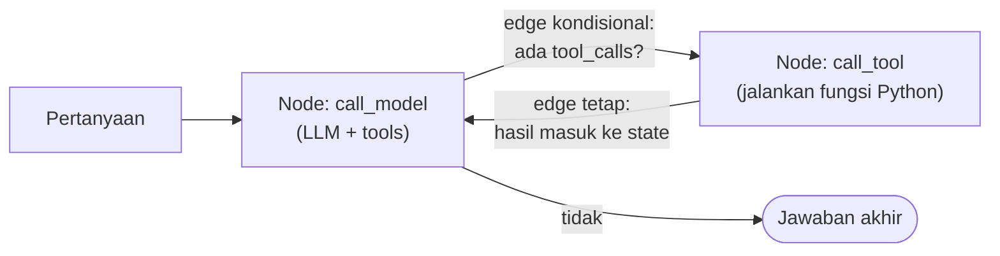
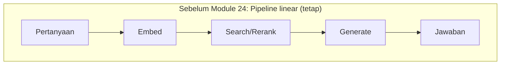
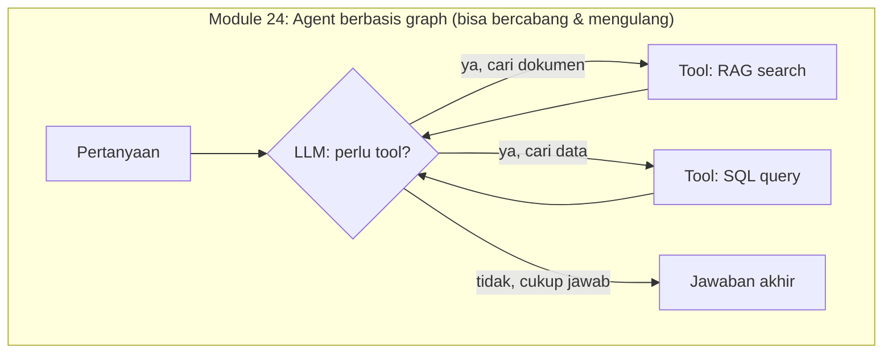
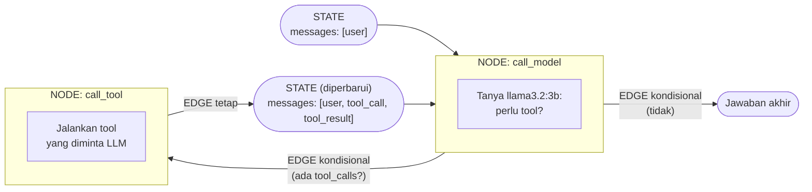
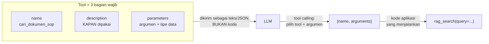
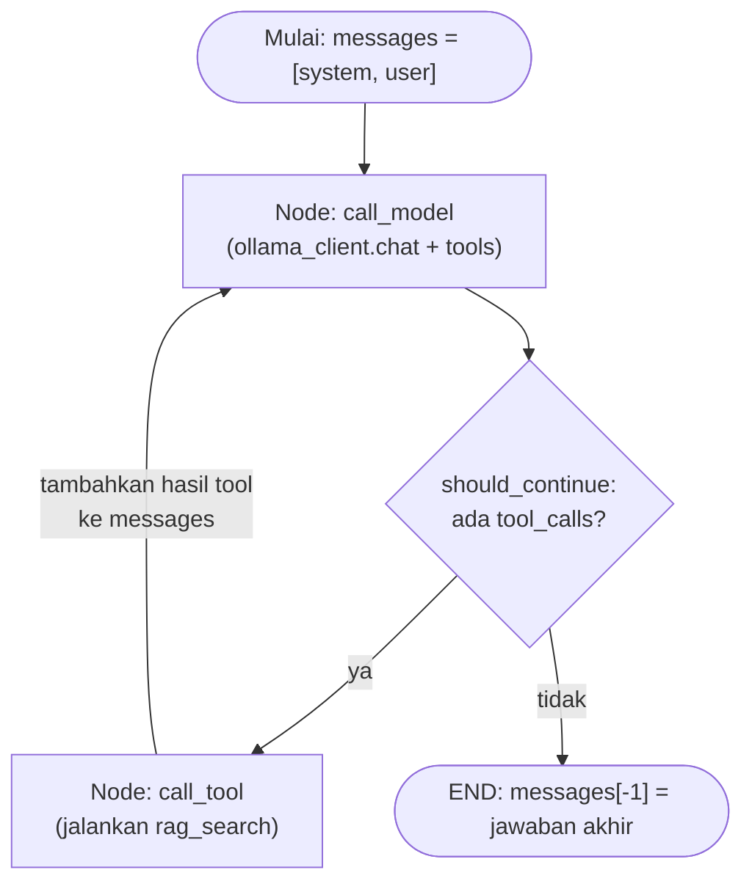

# Module 24: Desain Agent dengan LangGraph — Tool-Calling

## Tujuan

Mengubah NALA dari pipeline RAG linear (Module 7-22) menjadi agent berbasis LangGraph yang bisa memutuskan sendiri kapan perlu memanggil tool, dimulai dengan satu tool (pencarian dokumen SOP) sebagai fondasi sebelum tool kedua ditambahkan di Module 25.

## Definisi

**Agent**, dalam konteks module ini, adalah sistem yang memutuskan sendiri langkah apa yang perlu diambil untuk menjawab sebuah pertanyaan — berbeda dari **pipeline linear** (Module 7-22) yang urutan langkahnya selalu sama apa pun pertanyaannya. Keputusan itu diambil lewat **tool calling**: LLM diberi daftar "tool" (fungsi Python yang bisa dipanggil, masing-masing dengan skema nama/deskripsi/parameter) dan diminta memilih tool mana yang relevan — kalau ada — sebelum menyusun jawaban akhir. Ollama sendiri tidak pernah mengeksekusi tool apa pun; ia cuma memutuskan *tool mana* dan *argumen apa*, kode aplikasi yang benar-benar menjalankannya.

**LangGraph** adalah pustaka yang dipakai untuk merangkai keputusan itu jadi sebuah **graph**: kumpulan **node** (langkah kerja, ditulis sebagai fungsi Python) yang saling terhubung lewat **edge** (jalur antar-node, ada yang tetap dan ada yang **kondisional** — bercabang tergantung hasil node sebelumnya), dengan **state** (data yang mengalir dan terus bertambah dari satu node ke node berikutnya, di NALA berupa daftar `messages`) sebagai "memori kerja" bersama. Bedanya dengan pipeline lurus: graph bisa **loop back** — sebuah node bisa dilewati berkali-kali dalam satu request (mis. `call_tool` selalu kembali ke `call_model`) sampai model memutuskan tidak perlu tool lagi.



## Hasil Akhir yang Diharapkan

- `OllamaClient` punya method `chat()` baru yang mendukung parameter `tools`, tanpa mengubah `generate()`/`chat_stream()` yang sudah ada
- Logika retrieval RAG Module 9-22 sudah di-refactor jadi tool berdiri sendiri (`rag_search()` + `RAG_TOOL_SCHEMA`) yang mengembalikan teks konteks, bukan langsung memanggil LLM — memakai `search_hybrid()` + reranker Module 18-20, bukan `search()` polos, supaya tidak regresi kualitas (alasan lengkapnya dicatat di Bagian 7a)
- Graph LangGraph (`call_model` ↔ `call_tool`, dengan edge kondisional) sudah dibangun dan disambungkan ke endpoint `POST /chat` yang **dihidupkan kembali** di module ini — endpoint `/chat` beserta model `ChatRequest`/`ChatResponse`-nya pernah ada di Module 7 lalu dihapus total di Module 8 saat `/chat/stream` mengambil alih, jadi ketiganya perlu ditulis ulang di sini; logika di baliknya adalah refactor dari retrieval yang sebelumnya hardcoded di `/chat/stream` (Module 9-22)
- `/chat` tetap menjawab dengan kualitas setara Module 9-22 untuk pertanyaan seputar SOP, dan tetap bisa menjawab pertanyaan yang tidak butuh tool sama sekali (mis. sapaan) — kedua kasus sudah diuji langsung dan berhasil
- `/chat/stream` sengaja tidak disentuh sama sekali di module ini, tetap berjalan seperti sebelumnya
- Trace Langfuse `chat_agent` mencatat tiap node LangGraph (`agent_call_model`, `agent_tool:*`) sebagai observation terpisah dengan latency yang benar — instrumentasi ini bukan asumsi, tapi hasil bug nyata yang ditemukan lewat inspeksi trace (awalnya `latency: 0`, `observations: 0`), dicatat di Bagian 7b

## 1. Kenapa NALA Butuh Jadi "Agent", Bukan Cuma Pipeline

Sejak Module 8, `/chat/stream` (satu-satunya endpoint chat NALA sampai sebelum module ini — lihat Module 8) bekerja dengan urutan langkah yang **selalu sama**, apapun pertanyaannya: terima pesan → embed → cari di vector store (Module 18-20: hybrid search + rerank) → susun prompt ber-konteks → generate jawaban. Urutan ini disebut **pipeline linear** — jalurnya lurus, tidak pernah bercabang, tidak pernah "mikir dulu langkah apa yang cocok".

Itu bekerja baik selama satu-satunya sumber jawaban adalah dokumen SOP. Tapi mulai module ini, NALA punya sumber jawaban **kedua**: data operasional (pengajuan kredit, klaim asuransi) yang tersimpan di database, bukan di dokumen teks. Pipeline linear tidak punya cara untuk memutuskan "pertanyaan ini butuh dokumen atau butuh angka dari database?" — keputusan itu harus ada di suatu tempat, dan LangGraph adalah alat yang dipakai untuk menaruhnya.

### a. Analogi untuk yang belum pernah pegang kode

Bayangkan pipeline Module 7-22 seperti **jalur produksi pabrik**: bahan mentah masuk di satu ujung, keluar produk jadi di ujung lain, urutan mesinnya tetap sama untuk semua bahan. Agent lewat LangGraph lebih mirip **resepsionis yang bisa mendelegasikan**: dia dengar pertanyaan, memutuskan "ini perlu saya cek ke bagian arsip (dokumen SOP) atau ke bagian data (database)?", kadang perlu cek ke **dua-duanya** sebelum bisa menjawab, dan kalau jawaban pertama masih kurang, dia bisa balik bertanya lagi ke bagian yang tadi — bukan cuma jalan satu arah.

### b. Bedanya secara teknis: pipeline vs graph





Perhatikan panah `B3 --> B2` dan `B4 --> B2`: setelah tool dipanggil, alur **kembali** ke node yang sama (LLM) untuk memutuskan langkah berikutnya — bisa berhenti (jawab), bisa panggil tool lain, atau (jarang tapi mungkin) panggil tool yang sama lagi dengan query berbeda. Inilah yang dimaksud "graph yang bisa loop back", beda dari pipeline Module 7-22 yang cuma bisa jalan satu arah dari kiri ke kanan.

### c. Tiga konsep inti LangGraph

LangGraph memodelkan agent dengan tiga elemen:

1. **State** — "memori kerja" yang dibawa berjalan dari satu node ke node berikutnya. Untuk NALA, state-nya sederhana: daftar `messages` (riwayat percakapan + hasil tool, format sama seperti yang sudah dipakai `/chat/stream` sejak Module 8) yang terus bertambah setiap kali ada langkah baru.
2. **Node** — satu langkah kerja, ditulis sebagai fungsi Python biasa yang menerima state dan mengembalikan perubahan ke state itu. NALA akan punya dua node: `call_model` (tanya ke `llama3.2:3b`, apakah perlu tool) dan `call_tool` (jalankan tool yang diminta, hasilnya dimasukkan lagi ke state).
3. **Edge** — jalur antar-node. Ada edge tetap (`call_tool` selalu kembali ke `call_model`) dan **edge kondisional** (`call_model` ke `call_tool` ATAU ke selesai, tergantung apakah LLM meminta tool).

Ketiganya kalau digambar bersama, persis begini posisinya di graph NALA — perhatikan label **STATE**, **NODE**, dan **EDGE** langsung menempel ke bagian yang dimaksud:



- **STATE** — muncul **dua kali** di diagram, dan itu disengaja: `S1` di awal (baru berisi pesan user) dan `S2` setelah `call_tool` (sudah bertambah hasil tool). Keduanya oval yang sama jenisnya — **data**, bukan node — cuma isinya beda karena sudah bertambah satu langkah. `call_model` yang dipanggil kedua kali menerima `S2`, bukan `S1` lagi — itulah yang membuatnya "tahu" hasil tool tanpa perlu memanggil tool yang sama lagi.
- **NODE** (dua kotak besar) adalah `call_model` dan `call_tool` — masing-masing satu fungsi Python yang menerima state, melakukan sesuatu, lalu mengembalikan perubahan ke state itu. Perhatikan: node **tidak pernah** terhubung langsung ke node lain tanpa state di antaranya — selalu "node → state (baru) → node berikutnya", persis yang ditunjukkan `S1`/`S2` di diagram.
- **EDGE** (label di atas panah) adalah jalur yang menghubungkan node ke state berikutnya — dua di antaranya **kondisional** (arahnya baru ditentukan setelah `call_model` selesai, tergantung ada `tool_calls` atau tidak), satu **tetap** (`call_tool` selalu mengalir ke `S2` lalu ke `call_model`, tidak pernah langsung ke `END`).

Yang membuat ini "agent" (bukan cuma percabangan `if/else` biasa) adalah **keputusan tool mana yang dipanggil, dan kapan berhenti, diambil oleh LLM itu sendiri** — bukan oleh aturan `if "kredit" in pertanyaan` yang ditulis manual oleh developer. Ini penting dipahami sebelum Module 26: kualitas keputusan ini bergantung pada kemampuan model, bukan pada logika kode — itu sebabnya routing bisa salah (lihat Module 26 Bagian 4), dan itu bukan bug di kode.

## 2. Apa itu Tool (Function) dan Tool Calling

**Tool** — kadang disebut **function**, dua istilah yang dipakai bergantian di dokumentasi OpenAI/Ollama/LangGraph, artinya sama — adalah kemampuan yang "ditawarkan" ke LLM lewat tiga bagian wajib: **nama** (identitas unik tool itu), **deskripsi** (kalimat yang menjelaskan KAPAN dan UNTUK APA tool ini dipakai), dan **skema parameter** (aturan JSON tentang argumen apa saja yang dibutuhkan, dan tipe datanya). Yang penting dipahami: **tool bukan kode yang "dijalankan" LLM** — LLM cuma membaca ketiga bagian ini sebagai teks/JSON, lalu memutuskan apakah salah satu tool relevan dengan pertanyaan yang sedang dijawabnya. Fungsi Python sesungguhnya (yang benar-benar melakukan pekerjaan, misalnya `rag_search()`) **tidak pernah dikirim ke LLM sama sekali** — LLM tidak tahu isi kodenya, cuma tahu "ada tool bernama X, gunanya Y, butuh argumen Z".

Contoh nyata dari NALA — skema tool pencarian dokumen SOP (dibangun lengkap di Bagian 4 Tahap B):

```python
RAG_TOOL_SCHEMA = {
    "type": "function",
    "function": {
        "name": "cari_dokumen_sop",
        "description": (
            "Mencari jawaban di dokumen SOP dan kebijakan internal PT Nusantara "
            "Finance — misalnya syarat/prosedur pengajuan kredit, prosedur klaim "
            "asuransi, kebijakan internal. Gunakan untuk pertanyaan tentang ATURAN "
            "atau PROSEDUR, bukan untuk angka/status transaksi spesifik milik "
            "nasabah tertentu (untuk itu ada tool lain, lihat Module 25)."
        ),
        "parameters": {
            "type": "object",
            "properties": {
                "query": {
                    "type": "string",
                    "description": "Pertanyaan atau topik yang ingin dicari di dokumen",
                },
            },
            "required": ["query"],
        },
    },
}
```

Perhatikan: field **`description`** (baik di level tool maupun di level tiap parameter) adalah **satu-satunya sinyal** yang dipakai LLM untuk memutuskan relevansi — bukan nama fungsinya (`cari_dokumen_sop` cuma label internal untuk kode, LLM tidak "mengerti" arti nama itu secara istimewa), dan tentu bukan isi kodenya (tidak pernah dilihat LLM). Kalimat deskripsi yang samar atau tumpang tindih dengan tool lain adalah penyebab paling umum routing yang salah (dibahas lebih jauh di Module 26) — menulis deskripsi tool yang tajam bukan detail kecil, tapi bagian paling menentukan dari desain agent.

**Tool calling** adalah nama untuk keseluruhan protokolnya: proses di mana LLM, alih-alih (atau selain) langsung menulis jawaban teks, bisa memilih mengembalikan **permintaan terstruktur** untuk menjalankan salah satu tool yang ditawarkan — lengkap dengan argumen yang menurutnya sesuai. LLM **berhenti** persis di titik ini: ia tidak pernah menjalankan apa pun sendiri, cuma memutuskan "tool mana" dan "argumen apa" — mekanisme detailnya, spesifik untuk Ollama dan Llama 3.2 yang dipakai NALA, dijelaskan di Bagian 3.



### Contoh Tool Lain yang Umum Dipakai Agent AI (Bukan yang Dipakai NALA)

`cari_dokumen_sop` di atas cuma **satu** contoh — pada agent AI secara umum (bukan spesifik NALA), tool bisa membungkus hampir semua kemampuan yang bisa ditulis jadi fungsi dengan input/output jelas. Beberapa kategori yang umum dipakai di luar NALA, supaya gambaran "apa saja yang mungkin" lebih luas dari sekadar RAG search:

| Kategori tool | Contoh nyata | Dipakai untuk |
|---|---|---|
| **Pencarian dokumen internal** | `cari_dokumen_sop` (module ini) | Menjawab dari knowledge base sendiri — sudah dibangun Module 9-22 |
| **Query database** | `query_data_operasional` (Module 25) | Angka/status transaksi spesifik yang tidak ada di dokumen SOP, terlalu dinamis untuk di-embed |
| **Web search** | Tavily, SerpAPI, Bing Search API | Pertanyaan yang butuh informasi terkini di luar dokumen internal (kurs hari ini, berita terbaru) |
| **Kalkulator/eksekusi kode** | Python REPL, code interpreter | Perhitungan matematis presisi tinggi yang LLM sering salah kalau dihitung "dalam kepala" (mis. bunga majemuk berbulan-bulan) |
| **Kirim email/notifikasi** | SMTP tool, Slack/Teams webhook | Agent memicu aksi nyata ke sistem lain, misalnya notifikasi staff |
| **Baca/tulis file** | File read/write tool | Agent yang perlu memproses atau menghasilkan dokumen di luar chat |
| **Panggil API eksternal lain** | Cuaca, nilai tukar, CRM pihak ketiga | Data real-time yang bukan tanggung jawab NALA menyimpannya sendiri |
| **Kalender/penjadwalan** | Google Calendar API tool | Agent yang perlu membuat/mengecek jadwal atas nama user |

⚠️ **Kenapa NALA sengaja TIDAK memakai sebagian besar daftar ini**: NALA beroperasi di sektor finansial dengan data sensitif (Module 1) — setiap tool baru adalah **permukaan risiko baru** yang harus diaudit (bisakah tool ini bocorkan data? bisakah disalahgunakan lewat prompt injection dari dokumen yang di-ingest?). Tool eksekusi kode atau akses file bebas, misalnya, membuka risiko jauh lebih besar dibanding tool query yang dibatasi ketat seperti `cari_dokumen_sop` (cuma baca, parameter tunggal `query: string`) atau tool SQL Module 25 (dibatasi, bukan raw SQL bebas dari LLM — lihat Module 25 Bagian 2). **Total tool NALA di akhir kurikulum cuma dua**: RAG search (module ini) dan SQL query terbatas (Module 25) — desain yang sengaja sempit, bukan keterbatasan teknis, supaya RBAC dan audit logging (Module 27) tetap bisa mengontrol **persis** apa saja yang bisa dilakukan agent atas nama user tertentu. Menambah tool generik seperti web search atau eksekusi kode akan langsung memperluas cakupan audit itu secara signifikan — keputusan yang di luar cakupan training ini.

## 3. Tool-Calling Native di Ollama untuk Llama 3.2

Agar LLM bisa "meminta" sebuah tool dipanggil, Ollama menyediakan parameter `tools` di endpoint `/api/chat` (bukan `/api/generate` yang dipakai `OllamaClient.generate()` sejak Module 6 — `/api/generate` tidak mendukung tools). Model family Llama 3.2 (termasuk `llama3.2:3b` yang dipakai default sepanjang training ini — lihat README utama bagian "Rekomendasi Model LLM") sudah mendukung fitur ini, itulah salah satu alasan model ini dipilih sebagai default sejak Module 2.

Pola kerjanya:

1. Kita kirim `messages` **plus** daftar `tools` (skema JSON: nama tool, deskripsi, parameter yang diterima) ke `/api/chat`.
2. Kalau model memutuskan pertanyaan butuh tool, response-nya **bukan** teks jawaban biasa, tapi field `message.tool_calls` berisi nama tool + argumen yang ingin dipanggil (mis. `cari_dokumen_sop(query="syarat pengajuan kredit")`).
3. Kode kita (bukan Ollama) yang benar-benar **menjalankan** fungsi Python di balik tool itu — Ollama tidak pernah mengeksekusi kode apa pun, ia cuma memutuskan tool mana yang relevan dan argumennya.
4. Hasil eksekusi tool dikirim balik ke model sebagai pesan baru berperan `"tool"`, lalu model dipanggil lagi untuk menyusun jawaban akhir (atau meminta tool lain).

⚠️ **Catatan kejujuran teknis**: perilaku tool-calling Ollama bisa sedikit berbeda tergantung versi Ollama dan versi model yang di-pull — kalau `message.tool_calls` selalu kosong padahal pertanyaannya jelas butuh tool, cek dulu versi Ollama (`ollama --version`, disarankan versi yang cukup baru untuk mendukung tools) sebelum menyalahkan kode agent-nya.

## 4. Struktur Kode yang Ditambahkan

Melanjutkan langsung di `Nala/` (folder yang sama sejak Module 1 — lihat bagian "3. Struktur Kode yang Ditambahkan" → "Prasyarat" di materi Module 23). Tiga tahap di module ini:

1. **Tahap A — Tambah kemampuan tool-calling ke `OllamaClient`**, tanpa membuat atau menyentuh endpoint apa pun dulu.
2. **Tahap B — Tulis tool pertama**: bungkus RAG chain Module 9-22 jadi fungsi `rag_search()` yang berdiri sendiri, plus skema tool-nya.
3. **Tahap C — Bangun graph LangGraph**, lalu hidupkan kembali endpoint `/chat` (beserta model `ChatRequest`/`ChatResponse` yang dihapus di Module 8) supaya mendelegasikan ke agent — endpoint terpisah, bukan mengubah `/chat/stream` itu sendiri.

### Prasyarat

- Module 23 selesai: service `postgres` sehat, tabel `pengajuan_kredit`/`klaim_asuransi` sudah berisi data (7 baris + 4 baris) lewat form `/data-operasional`, role `nala_readonly`/`nala_writer` terverifikasi dua arah.
- Module 18-20 selesai: `vector_store.search_hybrid()` dan `Reranker` sudah ada dan bekerja — tool RAG yang dibangun di Langkah 3 memakai keduanya, bukan `search()` polos (alasannya di Bagian 7a).
- Module 21 selesai: `langfuse_client` (instance modul-level di `app/main.py`) dan env var `OLLAMA_MODEL` sudah ada — dipakai untuk instrumentasi trace agent di Langkah 5-6.
- `docker compose up -d --build` sudah pernah dijalankan dari `Nala/` — kalau container belum jalan, jalankan ulang dari folder itu sebelum melanjutkan.

### Tahap A — Tambah method `chat()` dengan dukungan `tools` ke `OllamaClient`

**Langkah 1 — Tambah dependency `langgraph`**

```
# requirements.txt — tambahkan baris baru
langgraph==0.2.39
```

<details>
<summary><strong>Pakai Claude Code? Salin prompt berikut, paste untuk eksekusi Langkah 1</strong></summary>

```
Tambah dependency langgraph ke requirements.txt (Module 24, Tahap A,
Langkah 1) — belum ada perubahan kode apa pun.

GOAL:
- Di Nala/requirements.txt: tambah baris
  baru di akhir: langgraph==0.2.39

CONTEXT:
- Dependency ini dibutuhkan untuk membangun graph agent di Langkah 5,
  tapi belum dipakai di mana pun sampai langkah itu.

GUARDRAIL:
- JANGAN ubah baris/dependency lain di requirements.txt.
- JANGAN sentuh file kode apa pun di langkah ini.
```

</details>

**Langkah 2 — Tambah method `chat()` di `app/ollama_client.py`**

`OllamaClient` sejak Module 6 sudah punya `generate()` (non-streaming, lewat `/api/generate`) dan `chat_stream()` (streaming, lewat `/api/chat`, dipakai `/chat/stream` sejak Module 8). Tambahkan method ketiga — non-streaming, lewat `/api/chat`, dengan dukungan `tools`:

```python
# app/ollama_client.py — tambahkan di dalam class OllamaClient, di bawah generate()
def chat(self, messages: list[dict], tools: list[dict] | None = None) -> dict:
    payload = {"model": self.model, "messages": messages, "stream": False}
    if tools:
        payload["tools"] = tools

    with httpx.Client() as client:
        response = client.post(
            f"{self.base_url}/api/chat",
            json=payload,
            timeout=60.0,
        )
        response.raise_for_status()
        return response.json()["message"]
```

Bedanya dari `chat_stream()`: `stream: False` (bukan `True`), dan mengembalikan **satu dict `message` utuh** (berisi `role`, `content`, dan kalau ada, `tool_calls`) — bukan generator token demi token. Bedanya dari `generate()`: menerima riwayat `messages` (format sama seperti `chat_stream()`), bukan `system_prompt` + `user_message` terpisah, dan yang terpenting, **mendukung parameter `tools`** — inilah satu-satunya alasan method baru ini perlu ada, `generate()` yang sudah ada tidak bisa dipakai untuk tool-calling.

**▶️ Jalankan & lihat hasilnya**

```bash
docker compose up --build --no-deps ollama api
```

```bash
docker compose exec api python -c "
from app.ollama_client import OllamaClient
client = OllamaClient(base_url='http://ollama:11434', model='llama3.2:3b')
result = client.chat(messages=[{'role': 'user', 'content': 'Halo, siapa kamu?'}])
print(result)
"
```

✅ **Indikator sukses**: tidak ada error, output berupa dict Python dengan key `role` (`'assistant'`) dan `content` (teks jawaban) — belum ada `tool_calls` karena belum dikirim parameter `tools` sama sekali di percobaan ini. Endpoint `/chat` belum dibuat sampai Tahap C, dan `/chat/stream` belum berubah perilaku sedikit pun — method `chat()` yang baru belum dipanggil dari mana pun di `main.py`.

<details>
<summary><strong>Pakai Claude Code? Salin prompt berikut, paste untuk eksekusi Langkah 2</strong></summary>

```
Tambah method chat() baru (dengan dukungan tools) ke OllamaClient
(Module 24, Tahap A, Langkah 2) — belum mengubah endpoint apa pun.

GOAL:
- Di Nala/app/ollama_client.py: tambah
  method baru `chat(self, messages: list[dict], tools: list[dict] |
  None = None) -> dict` di dalam class OllamaClient (setelah method
  generate() yang sudah ada). Method ini POST ke f"{self.base_url}/
  api/chat" dengan payload {"model": self.model, "messages": messages,
  "stream": False}, tambahkan key "tools": tools ke payload HANYA
  kalau parameter tools tidak None/kosong. timeout=60.0,
  response.raise_for_status(), return response.json()["message"]
  (dict utuh, bukan cuma field content).

CONTEXT:
- File ini sudah punya generate() (lewat /api/generate, non-streaming,
  tanpa tools) dan chat_stream() (lewat /api/chat, streaming, tanpa
  tools) dari Module 1-17 — JANGAN diubah, method chat() ini murni
  tambahan baru.
- requirements.txt sudah punya dependency langgraph dari Langkah 1.

GUARDRAIL:
- JANGAN ubah generate() atau chat_stream() sama sekali.
- JANGAN sentuh app/main.py di langkah ini — belum ada yang memanggil
  chat() yang baru ditambahkan.
```

</details>

### Tahap B — Bungkus RAG chain jadi tool pertama

**Langkah 3 — Buat `app/tools/rag_tool.py`**

```bash
mkdir -p app/tools
touch app/tools/__init__.py
```

```python
# app/tools/rag_tool.py
import httpx

from app.embeddings import embed_text
from app.vector_store import VectorStore

RAG_TOOL_SCHEMA = {
    "type": "function",
    "function": {
        "name": "cari_dokumen_sop",
        "description": (
            "Mencari jawaban di dokumen SOP dan kebijakan internal PT Nusantara "
            "Finance — misalnya syarat/prosedur pengajuan kredit, prosedur klaim "
            "asuransi, kebijakan internal. Gunakan untuk pertanyaan tentang ATURAN "
            "atau PROSEDUR, bukan untuk angka/status transaksi spesifik milik "
            "nasabah tertentu (untuk itu ada tool lain, lihat Module 25)."
        ),
        "parameters": {
            "type": "object",
            "properties": {
                "query": {
                    "type": "string",
                    "description": "Pertanyaan atau topik yang ingin dicari di dokumen",
                },
            },
            "required": ["query"],
        },
    },
}


def rag_search(
    query: str, vector_store: VectorStore, ollama_base_url: str, reranker=None
) -> str:
    try:
        query_embedding = embed_text(query, base_url=ollama_base_url)
        candidates = vector_store.search_hybrid(
            query_text=query, query_embedding=query_embedding, top_k=20
        )
        results = reranker.rerank(query, candidates, top_k=3) if reranker else candidates[:3]
    except httpx.HTTPError:
        return "Tidak dapat mengakses knowledge base dokumen saat ini."

    if not results:
        return "Tidak ditemukan dokumen relevan di knowledge base untuk pertanyaan ini."

    return "\n\n".join(r["text"] for r in results)
```

`rag_search()` adalah **refactor**, bukan fitur baru — isinya persis logika retrieval yang sejak Module 9 (lalu ditingkatkan Module 18-20 dengan hybrid search + reranking) sudah ada di dalam `/chat/stream`, cuma sekarang dipisah jadi fungsi berdiri sendiri yang **mengembalikan teks konteks**, bukan langsung memanggil `ollama_client.generate()`. Perbedaan penting dari versi Module 9-22: fungsi ini **tidak lagi menyusun prompt atau memanggil LLM sama sekali** — itu sekarang tugas node `call_model` di graph (Langkah 5), tool hanya bertugas "ambil data", bukan "susun jawaban". `RAG_TOOL_SCHEMA` mengikuti format skema tools yang diterima Ollama `/api/chat` — `description` sengaja ditulis detail karena **inilah** satu-satunya petunjuk yang dipakai LLM untuk memutuskan kapan tool ini relevan (lihat Module 26 Bagian 4.b soal betapa pentingnya kualitas description ini terhadap akurasi routing).

Perhatikan bahwa jalur retrievalnya **`search_hybrid(top_k=20)` lalu `reranker.rerank(..., top_k=3)`**, persis pola *retrieve-then-rerank* yang dipakai `/chat/stream` sejak Module 20 — **bukan** `vector_store.search()` polos. Ini disengaja: memakai vector search murni di sini akan jadi **regresi** terhadap Module 18-20 (tool RAG agent jadi lebih buruk dari `/chat/stream` yang jadi acuan kualitasnya). Kenapa perbedaan ini layak ditekankan — dan bagaimana persisnya ia ketahuan saat pengujian — dicatat di Bagian 7a. Parameter `reranker` dibuat **opsional** (`=None`, dengan fallback `candidates[:3]`) supaya `rag_search()` tetap bisa dipanggil terpisah untuk uji cepat, mengikuti pola `reranker = Reranker() if RERANK_ENABLED else None` yang sudah ada di `main.py` sejak Module 20.

**▶️ Jalankan & lihat hasilnya**

```bash
docker compose exec api python -c "
from app.vector_store import VectorStore
from app.reranker import Reranker
from app.tools.rag_tool import rag_search

store = VectorStore(base_url='http://opensearch:9200', index_name='nala-docs')
reranker = Reranker()
result = rag_search('syarat pengajuan kredit', store, 'http://ollama:11434', reranker=reranker)
print(result[:200])
"
```

✅ **Indikator sukses**: tidak ada error, output berupa potongan teks dari `sop-pengajuan-kredit.md` (asumsi index OpenSearch sudah terisi dari Module 7-22) — bukti `rag_search()` bekerja identik dengan retrieval yang sebelumnya ada di `/chat/stream` (hybrid search + reranking, Module 18-20), cuma sekarang bisa dipanggil terpisah. Perintah ini butuh beberapa detik lebih lama dari vector search polos karena 20 kandidat di-cross-encode satu per satu — normal, sudah dibahas Module 20 Bagian 6. Kalau hasilnya kosong, index OpenSearch mungkin belum terisi — jalankan ulang ingest lewat Airflow (Module 17).

<details>
<summary><strong>Pakai Claude Code? Salin prompt berikut, paste untuk eksekusi Langkah 3</strong></summary>

```
Refactor logika retrieval RAG yang sejak Module 9-22 ada di /chat/stream
jadi tool berdiri sendiri (Module 24, Tahap B) — belum
disambungkan ke agent atau endpoint mana pun.

GOAL:
1. Buat folder Nala/app/tools/ + file
   kosong __init__.py di dalamnya.
2. Buat Nala/app/tools/rag_tool.py berisi:
   a. Konstanta RAG_TOOL_SCHEMA (dict) — skema tool bergaya OpenAI
      function-calling: {"type": "function", "function": {"name":
      "cari_dokumen_sop", "description": "...", "parameters": {"type":
      "object", "properties": {"query": {"type": "string",
      "description": "..."}}, "required": ["query"]}}}. Isi
      "description" harus menjelaskan tool ini untuk pertanyaan
      ATURAN/PROSEDUR dari dokumen SOP, BUKAN untuk data transaksi
      spesifik.
   b. Fungsi rag_search(query: str, vector_store, ollama_base_url:
      str, reranker=None) -> str yang: try/except httpx.HTTPError di
      sekitar embed_text(query, base_url=ollama_base_url) lalu
      candidates = vector_store.search_hybrid(query_text=query,
      query_embedding=query_embedding, top_k=20), lalu results =
      reranker.rerank(query, candidates, top_k=3) kalau reranker tidak
      None, else candidates[:3]; kalau exception, return string pesan
      error yang jelas; kalau results kosong, return string "tidak
      ditemukan"; kalau ada isi, gabungkan r["text"] tiap hasil dengan
      "\n\n".join(...) dan return.

CONTEXT:
- embed_text ada di app/embeddings.py, VectorStore (dengan method
  search_hybrid() dari Module 18-19) ada di app/vector_store.py, dan
  class Reranker (method rerank()) ada di app/reranker.py sejak
  Module 20 — ketiganya sudah ada, JANGAN diubah.
- Jalur retrieval WAJIB search_hybrid(top_k=20) + rerank(top_k=3),
  sama seperti yang dipakai /chat/stream sejak Module 20. JANGAN pakai
  vector_store.search() polos — itu regresi kualitas terhadap
  Module 18-20.
- rag_search() TIDAK memanggil LLM/ollama_client sama sekali — hanya
  mengembalikan teks konteks mentah.

GUARDRAIL:
- JANGAN ubah app/main.py, app/embeddings.py, app/vector_store.py,
  atau app/reranker.py di langkah ini.
- JANGAN hapus logika retrieval yang masih ada di app/main.py — itu
  baru diganti di Langkah 6.
```

</details>

### Tahap C — Bangun graph LangGraph, hidupkan kembali endpoint `/chat`

**Langkah 4 — Tambah system prompt versi agent**

Di `app/system_prompt.py`, tambahkan satu konstanta baru:

```python
# app/system_prompt.py — tambahkan di bawah konstanta yang sudah ada
NALA_SYSTEM_PROMPT_AGENT = """Kamu adalah NALA, asisten AI internal PT Nusantara Finance.
Tugasmu adalah menjawab pertanyaan staff seputar SOP, kebijakan, dan data operasional perusahaan.
Kamu punya akses ke tool untuk mencari dokumen SOP internal. Gunakan tool itu setiap kali
pertanyaan menyangkut prosedur, syarat, atau kebijakan — jangan menjawab dari ingatanmu sendiri
untuk hal semacam itu.
Aturan:
- Jawab singkat, jelas, dan dalam Bahasa Indonesia.
- Jika hasil tool tidak relevan atau tidak cukup, katakan dengan jujur bahwa informasinya
  tidak ditemukan. Jangan mengarang jawaban.
- Jangan menjawab pertanyaan di luar konteks pekerjaan PT Nusantara Finance.
"""
```

Berbeda dari `NALA_SYSTEM_PROMPT`/`NALA_SYSTEM_PROMPT_NO_CONTEXT` (Module 14) yang mengasumsikan konteks **sudah** disisipkan ke prompt sebelum dikirim ke model, versi `_AGENT` ini tidak menyebut "konteks" sama sekali — modelnya sendiri yang memutuskan kapan perlu mengambil konteks lewat tool, baru menjawab setelah hasil tool tersedia sebagai pesan `role: "tool"` di riwayat.

**▶️ Jalankan & lihat hasilnya**

```bash
docker compose up --build --no-deps api
```

Graph dan endpoint `/chat` belum ada (baru dibangun di Langkah 5-6), jadi system prompt baru ini diuji langsung lewat `OllamaClient.chat()` (Langkah 2) dengan `RAG_TOOL_SCHEMA` (Langkah 3) — tiga potong yang sudah jadi, dirangkai manual:

```bash
docker compose exec api python -c "
from app.ollama_client import OllamaClient
from app.system_prompt import NALA_SYSTEM_PROMPT_AGENT
from app.tools.rag_tool import RAG_TOOL_SCHEMA

client = OllamaClient(base_url='http://ollama:11434', model='llama3.2:3b')
result = client.chat(
    messages=[
        {'role': 'system', 'content': NALA_SYSTEM_PROMPT_AGENT},
        {'role': 'user', 'content': 'Apa saja syarat pengajuan kredit untuk nasabah perorangan?'},
    ],
    tools=[RAG_TOOL_SCHEMA],
)
print('tool_calls:', result.get('tool_calls'))
print('content:', result.get('content'))
"
```

✅ **Indikator sukses**: `tool_calls` **tidak kosong** — berisi permintaan `cari_dokumen_sop` beserta argumen `query`, dan `content` justru kosong/pendek. Artinya model memilih **memanggil tool** alih-alih menjawab dari ingatannya sendiri, persis yang diminta `NALA_SYSTEM_PROMPT_AGENT`. Kalau `tool_calls` kosong dan model malah langsung mengarang jawaban syarat kredit, cek dulu versi Ollama (lihat ⚠️ catatan kejujuran teknis di Bagian 3) sebelum menyalahkan teks prompt-nya.

<details>
<summary><strong>Pakai Claude Code? Salin prompt berikut, paste untuk eksekusi Langkah 4</strong></summary>

```
Tambah system prompt versi agent ke system_prompt.py (Module 24,
Tahap C, Langkah 4) — belum membangun graph atau endpoint apa pun.

GOAL:
- Di Nala/app/system_prompt.py: tambah
  konstanta baru NALA_SYSTEM_PROMPT_AGENT (string) yang menjelaskan
  NALA punya tool pencarian dokumen SOP dan harus memakainya untuk
  pertanyaan prosedur/syarat/kebijakan, TANPA menyebut "konteks akan
  disisipkan" (beda dari NALA_SYSTEM_PROMPT lama). Isi persis:

  NALA_SYSTEM_PROMPT_AGENT = """Kamu adalah NALA, asisten AI internal PT Nusantara Finance.
  Tugasmu adalah menjawab pertanyaan staff seputar SOP, kebijakan, dan data operasional perusahaan.
  Kamu punya akses ke tool untuk mencari dokumen SOP internal. Gunakan tool itu setiap kali
  pertanyaan menyangkut prosedur, syarat, atau kebijakan — jangan menjawab dari ingatanmu sendiri
  untuk hal semacam itu.
  Aturan:
  - Jawab singkat, jelas, dan dalam Bahasa Indonesia.
  - Jika hasil tool tidak relevan atau tidak cukup, katakan dengan jujur bahwa informasinya
    tidak ditemukan. Jangan mengarang jawaban.
  - Jangan menjawab pertanyaan di luar konteks pekerjaan PT Nusantara Finance.
  """

CONTEXT:
- NALA_SYSTEM_PROMPT/NALA_SYSTEM_PROMPT_NO_CONTEXT (Module 14) sudah
  ada di file yang sama dan masih dipakai /chat/stream.

GUARDRAIL:
- JANGAN ubah atau hapus NALA_SYSTEM_PROMPT/NALA_SYSTEM_PROMPT_NO_CONTEXT
  yang sudah ada.
- JANGAN sentuh app/agent.py atau app/main.py di langkah ini.
```

</details>

**Langkah 5 — Buat `app/agent.py`**

```python
# app/agent.py
import operator
from typing import Annotated, TypedDict

from langgraph.graph import END, StateGraph

from app.tools.rag_tool import RAG_TOOL_SCHEMA, rag_search


class AgentState(TypedDict):
    messages: Annotated[list[dict], operator.add]


def build_agent(
    ollama_client,
    vector_store,
    ollama_base_url: str,
    reranker=None,
    trace=None,
    model_name: str = "llama3.2:3b",
):
    tools_schema = [RAG_TOOL_SCHEMA]

    def call_model(state: AgentState) -> dict:
        generation = trace.generation(
            name="agent_call_model", model=model_name, input=state["messages"]
        ) if trace else None

        response_message = ollama_client.chat(state["messages"], tools=tools_schema)

        if generation:
            generation.end(output=response_message)
        return {"messages": [response_message]}

    def call_tool(state: AgentState) -> dict:
        last_message = state["messages"][-1]
        tool_messages = []
        for call in last_message.get("tool_calls", []):
            name = call["function"]["name"]
            args = call["function"]["arguments"]

            span = trace.span(name=f"agent_tool:{name}", input=args) if trace else None

            if name == "cari_dokumen_sop":
                result = rag_search(args["query"], vector_store, ollama_base_url, reranker=reranker)
            else:
                result = f"Tool '{name}' tidak dikenal."

            if span:
                span.end(output={"result": result[:300]})
            tool_messages.append({"role": "tool", "content": result})
        return {"messages": tool_messages}

    def should_continue(state: AgentState) -> str:
        last_message = state["messages"][-1]
        if last_message.get("tool_calls"):
            return "call_tool"
        return END

    graph = StateGraph(AgentState)
    graph.add_node("call_model", call_model)
    graph.add_node("call_tool", call_tool)
    graph.set_entry_point("call_model")
    graph.add_conditional_edges(
        "call_model", should_continue, {"call_tool": "call_tool", END: END}
    )
    graph.add_edge("call_tool", "call_model")

    return graph.compile()
```



Penjelasan tiap bagian:

- **`AgentState`**: `TypedDict` dengan satu field, `messages`. `Annotated[list[dict], operator.add]` adalah cara LangGraph tahu bagaimana **menggabungkan** hasil sebuah node ke state yang sudah ada — di sini artinya "tambahkan (`+=`) list baru ke list `messages` yang sudah ada", bukan menimpanya. Ini penting: `call_model` dan `call_tool` sama-sama cuma mengembalikan `{"messages": [...]}` berisi pesan **baru saja**, bukan seluruh riwayat — LangGraph yang menyambungkannya.
- **`build_agent(...)`**: dibuat sebagai fungsi (bukan graph global langsung di top-level module) supaya semua dependensi yang dipakai node bisa disuntikkan dari `main.py` — `ollama_client`, `vector_store`, `ollama_base_url`, ditambah tiga parameter opsional: `reranker` (instance `Reranker` dari Module 20, diteruskan ke `rag_search()`), `trace` (trace Langfuse per-request dari Module 21), dan `model_name` (nama model yang dicatat di trace). Ketiganya opsional supaya `build_agent()` tetap bisa dipanggil polos saat uji cepat, tanpa Langfuse atau reranker aktif.
- **`call_model`**: satu-satunya node yang bicara ke LLM. Mengirim seluruh riwayat `messages` beserta `tools_schema`, hasilnya (dict `message`, mungkin berisi `tool_calls`) langsung ditambahkan ke state. Dibungkus `trace.generation(name="agent_call_model", ...)` supaya tiap putaran LLM muncul sebagai observation terpisah di Langfuse — tanpa ini trace `/chat` akan tercatat `latency: 0`, `observations: 0` (bug nyata, dicatat di Bagian 7b).
- **`call_tool`**: **tidak** memanggil LLM sama sekali — murni menjalankan fungsi Python (`rag_search`) berdasarkan `tool_calls` yang diminta model di langkah sebelumnya, lalu membungkus hasilnya sebagai pesan `role: "tool"`. Tiap pemanggilan tool dibungkus `trace.span(name=f"agent_tool:{name}", ...)`, dengan `output` dipotong `result[:300]` supaya isi konteks yang panjang tidak membanjiri UI trace. Kalau model meminta tool yang tidak ada di `tools_schema` (jarang terjadi, tapi mungkin kalau model "berhalusinasi" nama tool), dibalas dengan pesan error yang tetap membuat graph berjalan, bukan crash.
- **`if trace else None` di dua tempat**: pola yang membuat instrumentasi Langfuse sepenuhnya **opsional** — kalau `trace` tidak dioper (mis. saat uji `build_agent()` langsung dari shell), node tetap jalan normal tanpa mencatat apa pun, bukan crash karena `None.generation()`.
- **`should_continue`**: fungsi routing edge kondisional — mengecek apakah pesan terakhir dari `call_model` mengandung `tool_calls`. Kalau ya, lanjut ke `call_tool`; kalau tidak, `content` di pesan itu dianggap **jawaban final** dan graph berhenti (`END`).
- **`graph.add_edge("call_tool", "call_model")`**: edge tetap (bukan kondisional) — setelah tool selesai dijalankan, **selalu** kembali ke `call_model` supaya LLM bisa menyusun jawaban dari hasil tool (atau minta tool lain, kalau Module 25 menambah tool kedua).

**▶️ Jalankan & lihat hasilnya**

```bash
docker compose up --build --no-deps api
```

`main.py` belum menyentuh `app/agent.py` sama sekali di titik ini, jadi `Uvicorn running` saja belum membuktikan apa pun tentang file baru ini — graph-nya perlu disusun secara eksplisit:

```bash
docker compose exec api python -c "
from app.agent import build_agent
agent = build_agent(None, None, 'http://ollama:11434')
print(type(agent).__name__)
"
```

✅ **Indikator sukses**: tidak ada traceback, dan yang tercetak adalah nama class graph LangGraph yang sudah ter-compile — bukti `graph.compile()` benar-benar berhasil menyusun node dan edge-nya. `ollama_client`/`vector_store` sengaja diisi `None` di sini dan tetap aman, karena keduanya baru dipakai **saat node dijalankan**, bukan saat graph disusun; `trace`/`reranker` yang dibiarkan default `None` sekaligus membuktikan instrumentasi Langfuse memang opsional. `build_agent()` belum dipanggil dari `main.py`, jadi belum ada cara menguji perilaku graph lewat HTTP sampai Langkah 6.

<details>
<summary><strong>Pakai Claude Code? Salin prompt berikut, paste untuk eksekusi Langkah 5</strong></summary>

```
Bangun graph LangGraph minimal dengan satu tool (RAG) di app/agent.py
(Module 24, Tahap C, Langkah 5) — belum disambungkan ke endpoint
apa pun.

GOAL:
- Buat Nala/app/agent.py berisi:
  - class AgentState(TypedDict) dengan field messages: Annotated[list
    [dict], operator.add]
  - fungsi build_agent(ollama_client, vector_store, ollama_base_url:
    str, reranker=None, trace=None, model_name: str = "llama3.2:3b")
    yang mendefinisikan:
    - node call_model: buat generation = trace.generation(
      name="agent_call_model", model=model_name, input=state
      ["messages"]) kalau trace tidak None (else None); panggil
      ollama_client.chat(state["messages"], tools=[RAG_TOOL_SCHEMA]);
      kalau generation ada, generation.end(output=response_message);
      return {"messages": [hasil]}.
    - node call_tool: loop tool_calls di last_message; untuk tiap
      call buat span = trace.span(name=f"agent_tool:{name}",
      input=args) kalau trace tidak None (else None); kalau nama
      "cari_dokumen_sop" panggil rag_search(args["query"],
      vector_store, ollama_base_url, reranker=reranker), else pesan
      "tool tidak dikenal"; kalau span ada, span.end(output=
      {"result": result[:300]}); bungkus tiap hasil jadi {"role":
      "tool", "content": hasil}; return {"messages": tool_messages}.
    - fungsi should_continue (return "call_tool" kalau last_message
      ada tool_calls, else END), lalu rangkai pakai StateGraph:
      add_node call_model & call_tool, set_entry_point("call_model"),
      add_conditional_edges dari call_model pakai should_continue ke
      {"call_tool": "call_tool", END: END}, add_edge("call_tool",
      "call_model"), return graph.compile().

CONTEXT:
- app/tools/rag_tool.py (RAG_TOOL_SCHEMA, rag_search dengan parameter
  reranker) sudah dibuat di Tahap B — JANGAN diubah.
- app/ollama_client.py sudah punya method chat() dari Tahap A —
  JANGAN diubah.
- trace adalah objek trace Langfuse (Module 21) yang akan dioper
  per-request dari main.py di Langkah 6. Instrumentasi WAJIB opsional
  (pola `... if trace else None`) supaya build_agent() tanpa trace
  tetap jalan, bukan crash.

GUARDRAIL:
- JANGAN sentuh app/main.py di langkah ini — belum ada yang memanggil
  build_agent() dari sana sampai Langkah 6.
- JANGAN ubah app/tools/rag_tool.py atau app/ollama_client.py.
```

</details>

**Langkah 6 — Hidupkan kembali endpoint `/chat`, sambungkan ke agent**

Di `app/main.py`, tambah dulu import yang dibutuhkan:

```python
# app/main.py
from app.agent import build_agent
from app.system_prompt import NALA_SYSTEM_PROMPT_AGENT
```

Lalu **tulis ulang** kedua model Pydantic untuk kontrak `/chat`. Keduanya pernah ada di Module 7, tapi **dihapus total di Module 8** bersama endpoint `/chat` saat `/chat/stream` mengambil alih (lihat Module 8 Langkah 4) — jadi keduanya benar-benar tidak ada lagi di `main.py` dan harus ditulis kembali di sini, kalau tidak `chat()` di bawah akan langsung `NameError` saat import:

```python
# app/main.py — taruh di bawah ChatStreamRequest yang sudah ada (Module 8)
class ChatRequest(BaseModel):
    message: str


class ChatResponse(BaseModel):
    reply: str
```

Terakhir, **hidupkan kembali** fungsi `chat()` (endpoint `POST /chat`) yang mendelegasikan sepenuhnya ke agent — kontraknya persis sama seperti Module 7 (`{message}` → `{reply}`), tapi jalur di baliknya sekarang agent dengan tool-calling, bukan `ollama_client.generate()` langsung seperti dulu:

```python
# app/main.py
@app.post("/chat", response_model=ChatResponse)
def chat(request: ChatRequest) -> ChatResponse:
    trace = langfuse_client.trace(name="chat_agent", input={"message": request.message})

    agent = build_agent(
        ollama_client=ollama_client,
        vector_store=vector_store,
        ollama_base_url=OLLAMA_BASE_URL,
        reranker=reranker,
        trace=trace,
        model_name=os.environ.get("OLLAMA_MODEL", "llama3.2:3b"),
    )

    initial_state = {
        "messages": [
            {"role": "system", "content": NALA_SYSTEM_PROMPT_AGENT},
            {"role": "user", "content": request.message},
        ]
    }
    final_state = agent.invoke(initial_state)
    reply = final_state["messages"][-1]["content"]

    trace.update(output={"reply": reply, "message_count": len(final_state["messages"])})
    langfuse_client.flush()
    return ChatResponse(reply=reply)
```

Dua hal yang perlu diperhatikan di potongan ini:

- **Agent dibangun di dalam `chat()`, bukan sekali di level modul.** Ini konsekuensi langsung dari instrumentasi Langkah 5: `trace` dibuat **per-request** (satu trace Langfuse per panggilan `/chat`), sedangkan node `call_model`/`call_tool` menerima `trace` lewat **closure** dari `build_agent()`. Instance agent module-level (dibuat sekali saat aplikasi start) hanya bisa memegang satu `trace` selamanya — jadi agent harus dibangun ulang tiap request supaya trace request itu yang dipakai. Ongkosnya bisa diabaikan: `graph.compile()` tidak melakukan I/O apa pun, cuma menyusun struktur graph di memori.
- **`reranker` dan `langfuse_client` dipakai apa adanya** — keduanya sudah jadi instance modul-level di `main.py` sejak Module 20 dan Module 21, tidak ada yang perlu dibuat baru. `OLLAMA_MODEL` dibaca dari env dengan pola yang sama persis seperti yang sudah dipakai `traced_chat_stream()` (Module 21).

`/chat` sengaja diberi kontrak sesederhana mungkin (`ChatRequest{message}` → `ChatResponse{reply}`) — sama dengan kontrak Module 7, karena kontrak paling sederhana tanpa streaming sudah cukup untuk kebutuhan agent non-streaming ini, dan supaya `chat.html` (setelah toggle "Pakai Agent" ditambah Module 25) bisa memanggilnya tanpa penyesuaian besar.

⚠️ **Keputusan scope yang disengaja: `/chat/stream` TIDAK disentuh di module ini.** Endpoint itu tetap memakai retrieval langsung (Module 9-22), belum lewat agent — bukan karena "belum sempat diubah", tapi karena keputusan desain: `chat_stream()` di `OllamaClient` mengalirkan token satu per satu, sedangkan tool-calling butuh respons **utuh** dulu (`message.tool_calls`) sebelum tahu langkah berikutnya — menggabungkan keduanya (streaming + tool loop yang mungkin butuh beberapa putaran) menambah kompleksitas yang tidak sepadan untuk kurikulum ini. Karena itu rangkaian Module 23-27 membangun agent di endpoint **terpisah** (`/chat`, non-streaming, bisa pakai tool) berdampingan dengan `/chat/stream` (tetap di kemampuan Module 18-22), bukan mengonversi `/chat/stream` menjadi agent. Module 25-27 semuanya dibangun di atas `/chat`, bukan `/chat/stream`.

**▶️ Jalankan & lihat hasilnya**

```bash
docker compose up --build api
```

```bash
curl -X POST http://localhost:8000/chat \
  -H "Content-Type: application/json" \
  -d '{"message": "Apa saja syarat pengajuan kredit untuk nasabah perorangan?"}'
```

✅ **Indikator sukses**: tidak ada error `500`, jawaban tetap berbasis dokumen SOP seperti sejak Module 9-22 (kualitasnya seharusnya setara, karena `rag_search()` adalah refactor dengan jalur retrieval yang sama — hybrid search + reranking). Buka juga Langfuse UI (Module 21): harus muncul trace baru bernama **`chat_agent`** dengan **3 observations** dan latency yang wajar (bukan `0`) — `agent_call_model` → `agent_tool:cari_dokumen_sop` → `agent_call_model`, persis mencerminkan satu putaran loop LangGraph. Kalau latency-nya `0` dan observations-nya kosong, instrumentasi `trace` dari Langkah 5 belum tersambung (lihat Bagian 7b). Audit logging asli (siapa mengakses apa) baru dibangun di Module 27 — trace Langfuse ini murni untuk observability developer.

<details>
<summary><strong>Pakai Claude Code? Salin prompt berikut, paste untuk eksekusi Langkah 6</strong></summary>

```
Hidupkan kembali endpoint /chat, kali ini mendelegasikan ke agent
LangGraph yang sudah dibangun di Langkah 5 (Module 24, Tahap C,
Langkah 6) — logika retrieval di baliknya adalah refactor dari yang
sebelumnya hardcoded di /chat/stream, TAPI /chat/stream sendiri tidak
diubah.

GOAL:
- Di Nala/app/main.py:
  - Tambah import build_agent dari app.agent dan
    NALA_SYSTEM_PROMPT_AGENT dari app.system_prompt.
  - TULIS ULANG dua model Pydantic yang dihapus di Module 8, taruh di
    bawah class ChatStreamRequest yang sudah ada:
      class ChatRequest(BaseModel):
          message: str
      class ChatResponse(BaseModel):
          reply: str
    (BaseModel sudah di-import di file ini.)
  - BUAT fungsi chat() (endpoint POST /chat, dekorator
    @app.post("/chat", response_model=ChatResponse)) supaya:
    trace = langfuse_client.trace(name="chat_agent", input=
    {"message": request.message}); agent = build_agent(
    ollama_client=ollama_client, vector_store=vector_store,
    ollama_base_url=OLLAMA_BASE_URL, reranker=reranker, trace=trace,
    model_name=os.environ.get("OLLAMA_MODEL", "llama3.2:3b"));
    bangun initial_state = {"messages": [{"role": "system",
    "content": NALA_SYSTEM_PROMPT_AGENT}, {"role": "user",
    "content": request.message}]}; final_state = agent.invoke(
    initial_state); reply = final_state["messages"][-1]["content"];
    trace.update(output={"reply": reply, "message_count":
    len(final_state["messages"])}); langfuse_client.flush(); return
    ChatResponse(reply=reply).

CONTEXT:
- app/agent.py (build_agent, AgentState) sudah dibuat di Langkah 5 —
  JANGAN diubah.
- app/system_prompt.py sudah punya NALA_SYSTEM_PROMPT_AGENT dari
  Langkah 4 — JANGAN diubah.
- ChatRequest dan ChatResponse SUDAH TIDAK ADA lagi di main.py:
  keduanya dibuat di Module 7 lalu DIHAPUS di Module 8 bersama
  endpoint /chat. Harus ditulis ulang di langkah ini, jangan
  diasumsikan sudah ada.
- reranker (Module 20) dan langfuse_client (Module 21) sudah jadi
  instance modul-level di main.py — pakai apa adanya, jangan buat
  instance baru.

GUARDRAIL:
- build_agent() WAJIB dipanggil DI DALAM fungsi chat() (per-request),
  BUKAN sekali di level modul — karena trace Langfuse dibuat
  per-request dan dioper ke closure node lewat build_agent().
- JANGAN ubah endpoint /chat/stream, /health, /, /upload — Module ini
  SENGAJA tidak menyentuh /chat/stream (lihat catatan scope di
  materi.md Bagian 4 Tahap C), tetap pakai retrieval langsung Module 9-22.
- JANGAN ubah model ChatMessage/ChatStreamRequest yang sudah ada.
- JANGAN hapus NALA_SYSTEM_PROMPT/NALA_SYSTEM_PROMPT_NO_CONTEXT lama —
  keduanya masih dipakai /chat/stream.
```

</details>

**Langkah 7 — Pastikan `/chat/stream` tidak tersentuh, dan pertanyaan tanpa tool tetap jalan**

Langkah ini **murni verifikasi**, tidak mengubah satu baris kode pun — karena itu tidak ada prompt Claude Code di sini. Cukup jalankan dua perintah di bawah dan bandingkan hasilnya dengan indikator sukses.

```bash
curl -N -X POST http://localhost:8000/chat/stream \
  -H "Content-Type: application/json" \
  -d '{"messages": [{"role": "user", "content": "Halo, kamu siapa?"}]}'
```

```bash
curl -X POST http://localhost:8000/chat \
  -H "Content-Type: application/json" \
  -d '{"message": "Halo, kamu siapa?"}'
```

✅ **Indikator sukses**: `/chat/stream` tetap streaming seperti sebelumnya (belum lewat agent, sesuai catatan scope Bagian 4 Tahap C). `/chat` untuk sapaan tetap menjawab tanpa error — jawaban tetap muncul tanpa memanggil tool, membuktikan `should_continue` benar mengarahkan ke `END` langsung tanpa memanggil `call_tool`. Module 24 selesai — lanjut ke Module 25.

### Troubleshooting

- **`message.tool_calls` selalu kosong padahal pertanyaannya jelas butuh tool**: cek versi Ollama (`docker compose exec ollama ollama --version`) — dukungan tool-calling butuh versi yang cukup baru. Cek juga `RAG_TOOL_SCHEMA` terkirim dengan benar sebagai parameter `tools` di `OllamaClient.chat()` (Bagian 3, ⚠️ catatan kejujuran teknis).
- **Agent tampak "menggantung" lama (timeout)**: wajar sampai batas tertentu — setiap panggilan tool berarti minimal satu panggilan tambahan ke `llama3.2:3b`, jadi pertanyaan yang butuh tool otomatis lebih lambat dari pertanyaan tanpa tool.
- **Error umum lain** (`no configuration file provided`, `failed to read dockerfile`, port sudah dipakai, dsb.): lihat bagian praktik Module 7-17 materi.md — penyebab dan solusinya sama, tidak spesifik rangkaian Module 23-27.

**📄 Kode lengkap Module 24** — semua kode yang dibutuhkan sudah ditampilkan utuh di Langkah 1-6 di atas, dalam bentuk finalnya (tidak ada versi "perbaikan menyusul" yang harus diketik ulang di bagian lain): `requirements.txt` (Langkah 1), `app/ollama_client.py` (Langkah 2), `app/tools/rag_tool.py` (Langkah 3), `app/system_prompt.py` (Langkah 4), `app/agent.py` (Langkah 5), dan potongan relevan `app/main.py` (Langkah 6). Tidak ada file lain yang berubah di module ini.

## 5. Apa yang TIDAK Ada di Module Ini

- Tool kedua (SQL ke data operasional) — Module 25.
- Routing eksplisit antara dua tool, termasuk kasus gagal — Module 26 (module ini baru punya **satu** tool, jadi "routing" satu-satunya keputusan yang ada adalah "pakai tool atau tidak", belum "pakai tool yang mana").
- RBAC dan audit logging — Module 27.
- Perubahan pada `/chat/stream` — lihat catatan scope di Bagian 4 Tahap C di atas.

## 6. Checkpoint Praktik

Langkah eksekusi lengkap ada di Bagian 4 di atas (Langkah 1-7). Yang perlu dipastikan sebelum lanjut ke Module 25:

- [ ] `docker compose exec api python -c "..."` di Langkah 2 Tahap A menunjukkan `OllamaClient.chat()` bekerja (dict dengan `role`/`content`)
- [ ] `rag_search()` (Tahap B) mengembalikan potongan teks dokumen SOP yang relevan
- [ ] `rag_search()` memakai `search_hybrid(top_k=20)` + `reranker.rerank(..., top_k=3)` — **bukan** `vector_store.search()` polos (kalau masih `search()`, itu regresi terhadap Module 18-20, lihat Bagian 7a)
- [ ] `/chat` (endpoint yang dihidupkan kembali) menjawab pertanyaan seputar SOP dengan kualitas setara `/chat/stream` Module 9-22 (logika retrieval-nya refactor, bukan regresi)
- [ ] `/chat` tetap menjawab pertanyaan yang tidak butuh dokumen (mis. sapaan) tanpa error
- [ ] Trace Langfuse `chat_agent` muncul untuk tiap panggilan `/chat`, dengan latency yang wajar (bukan `0`) dan observation terpisah per node — `agent_call_model`, `agent_tool:cari_dokumen_sop`, `agent_call_model` (3 observations untuk pertanyaan yang butuh tool)
- [ ] `/chat/stream` masih berjalan seperti sebelumnya, tidak tersentuh sama sekali

## 7. Hasil Uji Nyata: Dua Temuan yang Membentuk Kode di Atas

Kode di Langkah 1-6 bukan rencana di atas kertas — ia sudah dijalankan, dan dua hal penting baru ketahuan **setelah** dijalankan. Keduanya dicatat di sini secara jujur, bukan disembunyikan seolah rancangan awal sudah sempurna sejak menit pertama. Bedanya dengan modul-modul awal: temuan di sini **sudah dibawa masuk** ke Langkah 3, 5, dan 6 di atas, jadi bagian ini murni laporan "kenapa kodenya berbentuk begitu" — tidak ada kode tambahan yang perlu diketik ulang di sini.

### a. Versi naif dengan `search()` polos adalah regresi terhadap Module 18-20

Rancangan awal `rag_search()` memanggil `vector_store.search(query_embedding, top_k=3)` — vector search murni, jalur yang dipakai NALA sampai Module 17. Secara fungsional itu jalan: tool mengembalikan teks, agent menjawab, tidak ada error. Justru itu yang membuatnya berbahaya — kegagalannya tidak muncul sebagai crash, tapi sebagai **kualitas jawaban yang diam-diam turun**.

Masalahnya baru terlihat saat jawaban `/chat` dibandingkan langsung dengan jawaban `/chat/stream` untuk pertanyaan yang sama. `/chat/stream` sejak Module 20 memakai `search_hybrid()` (Module 18-19) lalu `reranker.rerank()` (Module 20) — kombinasi yang sudah dibuktikan dengan angka: Hit Rate@3 naik dari 80% ke 100% setelah reranking aktif (Module 22 Bagian 9), dan kasus keras "syarat pengajuan kredit untuk nasabah perorangan" (chunk jawaban ada di posisi #7-8, di luar top-3) baru terjawab lengkap 8 item setelah reranking (Module 20 Bagian 8). Tool RAG yang memakai `search()` polos berarti agent di module ini **mundur ke kemampuan Module 17**, sementara endpoint lama di aplikasi yang sama tetap di kemampuan Module 20.

Ini bukan trade-off yang bisa dibenarkan dengan alasan "biar kodenya sederhana dulu": acuan kualitas `/chat` adalah `/chat/stream`, dan arsitektur baru yang menurunkan kualitas jawaban adalah regresi, bukan refactor. Karena itu **Langkah 3 di atas sudah langsung memakai `search_hybrid(top_k=20)` + `reranker.rerank(top_k=3)`** sejak versi pertama yang Anda tulis — bukan versi polos yang diperbaiki belakangan. Konsekuensi berantainya juga sudah ikut masuk ke Langkah 5-6: `rag_search()` menerima parameter `reranker`, `build_agent()` meneruskannya, dan `main.py` mengoper instance `reranker` yang memang sudah ada di sana sejak Module 20.

Pelajaran umumnya, di luar NALA: **setiap kali logika lama dipindah ke arsitektur baru, yang paling gampang hilang adalah peningkatan-peningkatan kecil yang ditumpuk bertahap di logika lama itu.** Refactor yang "kelihatan setara" sering kali diam-diam mengembalikan sistem ke versi beberapa module sebelumnya. Cara paling murah mendeteksinya adalah persis yang dipakai di sini: jalankan pertanyaan yang sama lewat jalur lama dan jalur baru, lalu bandingkan jawabannya — bukan cuma memastikan jalur baru tidak error.

### b. Trace Langfuse `chat_agent` awalnya kosong: `latency: 0`, `observations: 0`

Temuan kedua muncul setelah `/chat` berjalan dan trace-nya dibuka di Langfuse UI (Module 21). Trace `chat_agent` memang **terbentuk** — namanya muncul di daftar, input/output-nya terisi — tapi isinya tidak masuk akal:

| Trace | Latency | Observations |
|---|---|---|
| `chat_stream` (pipeline lama, Module 18-22) | ~14 detik | 3 |
| `chat_agent` (agent, versi awal) | **0** | **0** |

Padahal request-nya jelas-jelas makan waktu puluhan detik. Ini ditemukan lewat **inspeksi trace UI langsung**, bukan dari membaca kode — dari kode, instrumentasinya "terlihat ada" karena `trace.update()` dipanggil di akhir `chat()`.

**Akar masalahnya**: `trace.update()` di akhir request cuma mengisi output trace; ia tidak pernah menandai *kapan* sebuah langkah mulai dan selesai. Langfuse menghitung latency dari **observation** (`generation`/`span`) di dalam trace — kalau tidak ada satu pun observation, tidak ada apa pun untuk dihitung durasinya, dan trace-nya jadi cangkang kosong. Pipeline lama `/chat/stream` tidak kena masalah ini karena Module 21 sudah membungkus tiap tahapnya (`retrieval`, `rerank`, `llm_generate_stream`) dengan span/generation masing-masing; node LangGraph yang baru belum.

**Konsekuensinya ke desain kode**, dan inilah kenapa Langkah 5-6 di atas berbentuk seperti itu:

- `build_agent()` menerima parameter `trace` (dan `model_name`) supaya node `call_model`/`call_tool` bisa membungkus dirinya dengan `trace.generation()`/`trace.span()` — observability harus ada **di dalam** node, bukan cuma di sekeliling `invoke()`.
- Agent dibangun **ulang tiap request** di dalam `chat()`, bukan sekali di level modul. Ini bukan soal gaya: `trace` bersifat per-request, sementara node menerimanya lewat closure `build_agent()`. Instance agent module-level akan selamanya memegang trace dari request pertama saja. `graph.compile()` tidak melakukan I/O apa pun — cuma menyusun struktur graph di memori — jadi membangunnya ulang tiap request punya overhead yang bisa diabaikan, tidak sebanding dengan manfaat observability yang didapat.

**Hasil setelah instrumentasi terpasang**: trace `chat_agent` untuk pertanyaan yang butuh tool menunjukkan `latency: ~30s` dan **3 observations** — persis mencerminkan loop LangGraph yang terjadi: `agent_call_model` (LLM memutuskan pakai tool) → `agent_tool:cari_dokumen_sop` (tool dijalankan) → `agent_call_model` (LLM susun jawaban final dari hasil tool). Angka `~30s` itu sendiri konsisten dengan Module 20 Bagian 8 (~39 detik untuk `/chat/stream` dengan reranking): sebagian besar waktunya habis di cross-encoder dan dua putaran `llama3.2:3b`, bukan di LangGraph-nya.

Pelajaran umumnya: **instrumentasi yang "ada" belum tentu instrumentasi yang "bekerja"**. Trace yang terbentuk tapi kosong jauh lebih menyesatkan daripada tidak ada trace sama sekali — ia memberi rasa aman palsu bahwa sistem sudah terpantau. Satu-satunya cara memastikannya adalah membuka UI-nya dan melihat angkanya masuk akal, persis seperti yang dilakukan di **▶️ Jalankan & lihat hasilnya** Langkah 6.


## Kesimpulan

Module ini tidak menambah kemampuan baru yang terasa dari sisi user — jawaban `/chat` (dihidupkan kembali di module ini) untuk pertanyaan seputar SOP seharusnya terasa sama seperti jawaban `/chat/stream` di akhir Module 22. Yang berubah adalah **arsitektur di baliknya**: logika retrieval yang dulu hardcoded langsung di endpoint sekarang jadi tool yang dipanggil lewat keputusan LLM sendiri, dibungkus graph LangGraph dengan state dan edge kondisional. Fondasi ini sengaja dibangun dengan satu tool dulu, supaya perubahan arsitekturnya bisa diverifikasi terpisah dari kompleksitas tool kedua — yang baru ditambahkan di Module 25.

---

Untuk informasi lebih lanjut, lihat [README utama](../README.md).
