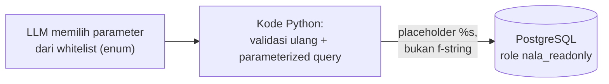
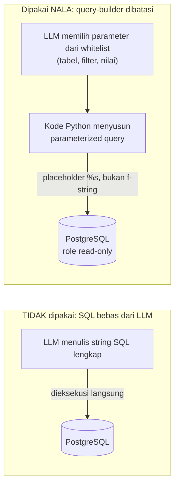
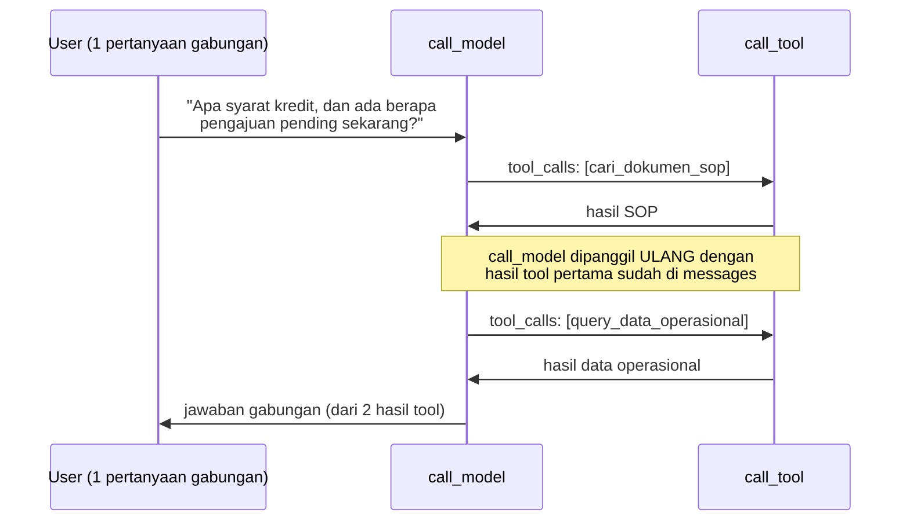

# Module 25: Tool Baru — Query SQL ke Data Operasional (PostgreSQL)

## Tujuan

Menambahkan tool kedua ke agent NALA (Module 24) untuk menjawab pertanyaan data transaksi operasional (status pengajuan kredit, klaim asuransi) yang tidak pernah ada di dokumen SOP, dengan pendekatan query-builder yang dibatasi (bukan SQL bebas dari LLM) supaya aman untuk data finansial nasabah. Module ini **tidak** menyiapkan PostgreSQL/seed/role dari nol — semua itu sudah dibangun dan diverifikasi di Module 23 (Setup Data Operasional). Module ini murni membangun kode tool yang **membaca** data yang sudah ada di sana, lewat role `nala_readonly` yang sudah tersedia. Sekaligus membuktikan dua level kemampuan function-calling secara bertahap: satu tool (Module 24) dan dua tool dengan LLM memilih salah satu — memakai keduanya sekaligus untuk satu pertanyaan gabungan baru dibahas Module 26.

## Definisi

Pendekatan umum untuk menjawab pertanyaan data lewat bahasa natural disebut **text-to-SQL**: LLM menerima skema tabel, lalu menulis query SQL lengkap sendiri. Tool SQL NALA **sengaja tidak** memakai pendekatan itu — sebagai gantinya dipakai **query-builder yang dibatasi (whitelisted)**: LLM cuma memilih parameter terstruktur (nama tabel, mode, filter) dari daftar tetap lewat `enum` skema tool, sementara kode Python sendiri yang menyusun query SQL final. Ini variasi dari pola **tool-use** yang sudah dikenal sejak Module 24 (tool RAG) — bedanya, tool ini menyentuh data transaksi finansial nasabah, sehingga risikonya jauh lebih tinggi kalau LLM diberi kebebasan penuh menulis SQL.

Keamanannya bertumpu pada **parameterized query** — nilai (status, `nasabah_id`) dikirim lewat placeholder `%s` terpisah dari struktur query, bukan digabung langsung ke string SQL (yang rentan **SQL injection**) — dipasang berlapis bersama validasi ulang di kode Python dan koneksi yang memakai role database `nala_readonly` (Module 23) yang secara struktural cuma bisa `SELECT`. Pola **defense in depth** ini (beberapa lapisan pertahanan independen, bukan mengandalkan satu titik saja) akan dipakai lagi dengan bentuk berbeda di Module 27 untuk RBAC.



## Hasil Akhir yang Diharapkan

- Tool `query_data_operasional` sudah dibangun: LLM hanya memilih parameter terstruktur dari whitelist (`enum` tabel/mode/status), kode Python yang menyusun query lewat parameterized query (`%s`), tidak ada jalur SQL bebas
- Tool ini memakai `get_connection()` yang sudah ada dari `app/db.py` (Module 23) — koneksi lewat role `nala_readonly`, tidak pernah lewat role tulis
- Tool ini terdaftar sebagai tool kedua di agent (`tools_schema`, cabang baru di `call_tool`) tanpa mengubah struktur graph dari Module 24
- `/chat` bisa menjawab pertanyaan jumlah/status data operasional maupun detail satu nasabah, memakai data yang sudah Anda tambahkan lewat `/data-operasional` di Module 23, sementara tool RAG (Module 24) tetap berfungsi berdampingan tanpa regresi
- `/chat` mendukung riwayat multi-turn (`history`, windowing 10 pesan) dan bisa dicoba langsung lewat toggle "Pakai Agent" di `chat.html`, tidak cuma lewat `curl`
- Angka mata uang (`jumlah_pengajuan`/`jumlah_klaim`) diformat eksplisit (`Rp 50.000.000`) di tool, dan pemanggilan tool tahan terhadap argumen tidak lengkap dari LLM (tidak crash jadi 500)
- Tiga level function-calling terbukti: satu tool (Module 24), dua tool dengan LLM memilih satu sesuai jenis pertanyaan, dan kedua tool dipanggil berurutan untuk satu pertanyaan gabungan (multi-hop, Bagian 4) — tanpa satu baris kode baru, murni konsekuensi desain graph Module 24
- Keterbatasan nyata model kecil didokumentasikan dengan angka (Bagian 7): sintesis jawaban dari hasil tool cuma berhasil ~20-33% dari percobaan berulang untuk kasus yang sama — dicatat jujur, bukan disembunyikan atau diklaim sudah terselesaikan

**Prasyarat**: Module 23 (service `postgres` sehat, tabel `pengajuan_kredit`/`klaim_asuransi` berisi data, role `nala_readonly` sudah ada dan terbukti hanya bisa `SELECT`) dan Module 24 (agent LangGraph dengan tool `cari_dokumen_sop` sudah jalan) harus sudah selesai.

## 1. Kenapa Dokumen SOP Saja Tidak Cukup

`sop-pengajuan-kredit.md` (dipakai sejak Module 7-17) menjelaskan **prosedur**: syarat dokumen, tahapan proses, estimasi waktu. Tapi staff finance sehari-hari juga bertanya hal yang jawabannya **tidak ada di prosedur mana pun**, karena jawabannya adalah data transaksi yang berubah setiap hari:

> "Berapa banyak pengajuan kredit yang statusnya masih pending minggu ini?"
> "Nasabah dengan ID N-00231, klaimnya sudah diproses belum?"

Tidak ada jumlah chunking atau reranking (Module 18-22) yang bisa membuat RAG menjawab ini dengan benar — jawabannya bukan tersembunyi di suatu dokumen yang belum ter-retrieve, jawabannya **tidak pernah ditulis di dokumen apa pun**, karena sifatnya data operasional yang berubah, bukan pengetahuan statis. Itu sebabnya PT Nusantara Finance butuh sumber data kedua: query langsung ke database operasional yang sudah disiapkan Module 23. Tool kedua ini yang dibangun di module ini, mengikuti pola tool pertama (Module 24) — fungsi Python biasa yang dipanggil lewat keputusan LLM, bukan hardcoded ke endpoint.

## 2. Risiko Nyata: Kenapa Tidak Boleh "LLM Menulis SQL Bebas"

Pendekatan paling gampang dibayangkan — dan **sengaja tidak dipakai di sini** — adalah: kirim skema tabel ke LLM, minta ia menulis query SQL lengkap sebagai argumen tool, lalu jalankan langsung ke database. Ini terdengar fleksibel, tapi punya dua masalah serius untuk sistem yang menyentuh data finansial nasabah sungguhan:

1. **SQL injection dari arah yang tidak biasa.** Bukan user jahat yang menyisipkan `; DROP TABLE` lewat form input (itu sudah lama diatasi lewat parameterized query di banyak sistem) — di sini risikonya adalah **LLM itu sendiri** yang bisa menghasilkan query destruktif atau bocor-data, baik karena salah paham konteks, halusinasi, maupun (skenario lebih serius untuk sistem produksi) prompt injection lewat konten yang di-retrieve (mis. dokumen yang sengaja diracuni berisi instruksi tersembunyi). LLM yang menulis SQL bebas berarti **string yang tidak sepenuhnya bisa diverifikasi aman, dieksekusi langsung** ke database produksi.
2. **Tidak ada batas query yang bisa dijalankan.** SQL bebas berarti LLM secara teori bisa menulis `SELECT *` tanpa `WHERE`, join ke tabel yang tidak seharusnya diakses role tertentu (lihat Module 27), atau query yang mahal secara performa (full table scan berulang).

### Pendekatan yang dipakai NALA: query-builder yang dibatasi (whitelisted), bukan SQL bebas

Alih-alih menerima string SQL dari LLM, tool SQL NALA menerima **parameter terstruktur** (nama tabel dari daftar tertentu, nama kolom filter dari daftar tertentu, nilai filter) — lalu **kode Python kita sendiri** yang menyusun query SQL final, selalu lewat parameterized query (placeholder `%s`, bukan f-string/format string). LLM tidak pernah punya kuasa menulis SQL mentah — ia cuma memilih dari pilihan yang sudah dibatasi developer, mirip mengisi form dropdown, bukan menulis surat bebas.



Lapisan keamanan tambahan yang dipakai bersama-sama (bukan mengandalkan satu saja):

- **Role database read-only.** Koneksi yang dipakai tool ini memakai user PostgreSQL dengan hak akses `SELECT` saja — role ini (`nala_readonly`) sudah dibuat dan diverifikasi dua arah di Module 23 — bahkan kalau ada celah di lapisan query-builder, user ini secara struktural tidak bisa `INSERT`/`UPDATE`/`DELETE`/`DROP`.
- **Whitelist nama tabel & kolom.** Nama tabel dan kolom filter yang boleh dipakai ditentukan lewat `enum` di skema tool (bukan string bebas) — LLM tidak bisa meminta tabel/kolom yang tidak terdaftar sama sekali, jadi tidak ada jalan untuk "menebak" nama tabel sensitif lain di database yang sama.
- **Limit baris & timeout.** Query selalu membawa `LIMIT` tetap dan timeout koneksi, supaya kesalahan/salah paham LLM (mis. lupa filter) tidak berujung menyedot seluruh tabel atau membebani database.

## 3. Struktur Kode yang Ditambahkan

Tiga tahap, total **5 Langkah**: **Tahap A** (Langkah 1) membangun tool query-builder, **Tahap B** (Langkah 2) mendaftarkan tool kedua ini ke agent (Module 24), **Tahap C** (Langkah 3-5) penyesuaian tambahan yang ditemukan lewat uji nyata. Tidak ada tahap setup database di module ini — service PostgreSQL, skema tabel, data, dan role `nala_readonly` semuanya sudah ada dari Module 23.

### Tahap A — Bangun tool query-builder

**Langkah 1 — Buat `app/tools/sql_tool.py`**

```python
# app/tools/sql_tool.py
import psycopg

from app.db import get_connection

SQL_TOOL_SCHEMA = {
    "type": "function",
    "function": {
        "name": "query_data_operasional",
        "description": (
            "Mengambil data operasional PT Nusantara Finance — pengajuan kredit atau "
            "klaim asuransi milik nasabah tertentu, atau ringkasan jumlah berdasarkan "
            "status. Gunakan untuk pertanyaan tentang STATUS, JUMLAH, atau DATA "
            "TRANSAKSI spesifik (bukan untuk pertanyaan tentang prosedur/syarat, itu "
            "tugas tool cari_dokumen_sop)."
        ),
        "parameters": {
            "type": "object",
            "properties": {
                "tabel": {
                    "type": "string",
                    "enum": ["pengajuan_kredit", "klaim_asuransi"],
                    "description": "Tabel data yang ingin diquery",
                },
                "mode": {
                    "type": "string",
                    "enum": ["hitung_per_status", "detail_nasabah"],
                    "description": (
                        "hitung_per_status: hitung jumlah baris per status (opsional "
                        "difilter status tertentu). detail_nasabah: ambil detail "
                        "baris untuk satu nasabah_id tertentu."
                    ),
                },
                "status": {
                    "type": "string",
                    "enum": ["pending", "disetujui", "ditolak", "pencairan", "diproses"],
                    "description": "Filter status (opsional, hanya untuk mode hitung_per_status)",
                },
                "nasabah_id": {
                    "type": "string",
                    "description": "ID nasabah (wajib untuk mode detail_nasabah), format N-XXXXX",
                },
            },
            "required": ["tabel", "mode"],
        },
    },
}

_ALLOWED_TABLES = {"pengajuan_kredit", "klaim_asuransi"}
_ALLOWED_STATUS = {"pending", "disetujui", "ditolak", "pencairan", "diproses"}
_MAX_ROWS = 20
_CURRENCY_COLUMNS = {"jumlah_pengajuan", "jumlah_klaim"}


def _format_value(col: str, val) -> str:
    if col in _CURRENCY_COLUMNS and val is not None:
        return f"Rp {val:,.0f}".replace(",", ".")
    return str(val)


def query_data_operasional(
    tabel: str, mode: str, status: str | None = None, nasabah_id: str | None = None
) -> str:
    if tabel not in _ALLOWED_TABLES:
        return f"Tabel '{tabel}' tidak dikenal/tidak diizinkan."

    try:
        with get_connection() as conn:
            with conn.cursor() as cur:
                if mode == "hitung_per_status":
                    if status is not None and status not in _ALLOWED_STATUS:
                        return f"Status '{status}' tidak dikenal."
                    if status:
                        cur.execute(
                            f"SELECT status, COUNT(*) FROM {tabel} WHERE status = %s GROUP BY status",  # noqa: S608
                            (status,),
                        )
                    else:
                        cur.execute(
                            f"SELECT status, COUNT(*) FROM {tabel} GROUP BY status"  # noqa: S608
                        )
                    rows = cur.fetchall()
                    if not rows:
                        return "Tidak ada data yang cocok."
                    return "\n".join(f"{s}: {c}" for s, c in rows)

                elif mode == "detail_nasabah":
                    if not nasabah_id:
                        return "nasabah_id wajib diisi untuk mode detail_nasabah."
                    cur.execute(
                        f"SELECT * FROM {tabel} WHERE nasabah_id = %s LIMIT %s",  # noqa: S608
                        (nasabah_id, _MAX_ROWS),
                    )
                    columns = [desc[0] for desc in cur.description]
                    rows = cur.fetchall()
                    if not rows:
                        return f"Tidak ditemukan data untuk nasabah_id '{nasabah_id}' di tabel {tabel}."
                    return "\n".join(
                        ", ".join(f"{col}={_format_value(col, val)}" for col, val in zip(columns, row))
                        for row in rows
                    )

                return f"Mode '{mode}' tidak dikenal."
    except psycopg.OperationalError:
        return "Tidak dapat terhubung ke database operasional saat ini."
```

`from app.db import get_connection` memakai fungsi yang **sudah ada** dari Module 23 — tidak ada dependency baru, tidak ada koneksi baru yang perlu dibuat di module ini. `get_connection()` memakai kredensial `nala_readonly` (dibuat & diverifikasi Module 23) — **bukan** `nala_admin` atau `nala_writer`. Ini konsekuensi langsung dari Bagian 2: koneksi yang dipakai untuk melayani pertanyaan LLM harus selalu lewat role paling terbatas yang cukup untuk tugasnya.

**`_format_value()` ditambahkan setelah uji nyata** (lihat Bagian 7) — tanpa ini, kolom `jumlah_pengajuan`/`jumlah_klaim` dikembalikan sebagai angka mentah (`50000000.00`), dan `llama3.2:3b` pernah salah membaca ulang angka itu jadi `Rp 500.000.000` (salah 10x lipat) saat menyusun kalimat jawaban. Memformat angka jadi `Rp 50.000.000` **langsung di tool**, sebelum dikirim ke LLM, mengurangi peluang model perlu "menghitung ulang" formatnya sendiri.

Penjelasan kenapa desain ini tetap aman walau **terlihat** memakai f-string untuk nama tabel (`f"SELECT ... FROM {tabel} ..."`):

- **`tabel` tidak pernah langsung dari teks bebas LLM** — nilainya dibatasi `enum` di `SQL_TOOL_SCHEMA` (`["pengajuan_kredit", "klaim_asuransi"]`), dan **diverifikasi ulang** di kode Python lewat `if tabel not in _ALLOWED_TABLES` sebelum dipakai di query apa pun — pengecekan dobel (skema tool + kode) karena skema tool bisa saja diabaikan model yang "nakal"/berhalusinasi, jadi validasi di kode Python adalah pertahanan yang sesungguhnya, skema tool hanya mengarahkan perilaku normal.
- **Nilai (bukan struktur query)** — seperti `status`, `nasabah_id` — **selalu** lewat placeholder `%s` dan parameter terpisah ke `cur.execute()`, tidak pernah digabung ke string SQL. Ini yang benar-benar mencegah SQL injection secara teknis: `%s` membuat psycopg mengirim nilai sebagai data ke PostgreSQL, bukan sebagai teks yang diparse jadi bagian query.
- **Tidak ada mode "SQL bebas"** — hanya dua `mode` yang terdaftar (`hitung_per_status`, `detail_nasabah`), masing-masing menyusun struktur query yang **fixed**, cuma nilainya yang berubah dari argumen. LLM tidak pernah bisa "menciptakan" bentuk query baru yang tidak dirancang developer.
- **`LIMIT` tetap** (`_MAX_ROWS = 20`) di `detail_nasabah` mencegah satu query menarik seluruh isi tabel walau `nasabah_id` salah ketik jadi pola yang cocok ke banyak baris.
- **Koneksi lewat `nala_readonly`** (Module 23) sebagai lapisan terakhir — bahkan kalau semua validasi di atas entah bagaimana gagal, database sendiri menolak apa pun selain `SELECT`.

⚠️ **Catatan soal `_ALLOWED_STATUS`**: set ini sengaja menggabungkan status **kedua** tabel dalam satu daftar, padahal `CHECK` constraint di `db/seed.sql` (Module 23) lebih ketat — `pencairan` hanya valid untuk `pengajuan_kredit`, `diproses` hanya untuk `klaim_asuransi`. Artinya kombinasi lintas-tabel seperti `tabel="klaim_asuransi"` + `status="pencairan"` **lolos** validasi Python (statusnya ada di whitelist gabungan), query tetap dijalankan, dan hasilnya selalu `Tidak ada data yang cocok.` — pesan yang benar secara teknis (memang tidak ada barisnya) tapi tidak menjelaskan bahwa kombinasinya memang mustahil. Ini aman (tidak ada risiko keamanan, whitelist tetap menutup nilai di luar daftar), cuma kurang informatif; memvalidasi status per tabel adalah latihan lanjutan yang wajar kalau ingin pesan errornya lebih tepat.

**▶️ Jalankan & lihat hasilnya**

```bash
docker compose exec api python -c "
from app.tools.sql_tool import query_data_operasional
print(query_data_operasional(tabel='pengajuan_kredit', mode='hitung_per_status'))
"
```

✅ **Indikator sukses**: daftar status beserta jumlahnya (mis. `pending: 3`, dst.) sesuai data yang sudah Anda masukkan lewat form `/data-operasional` di Module 23.

<details>
<summary><strong>Pakai Claude Code? Salin prompt berikut, paste untuk eksekusi Langkah 1</strong></summary>

```
Bangun tool query SQL yang dibatasi (bukan SQL bebas) untuk data
operasional (Module 25, Tahap A).

GOAL:
- Buat Nala/app/tools/sql_tool.py:
  - SQL_TOOL_SCHEMA (dict skema tool, nama "query_data_operasional",
    parameter: tabel (enum pengajuan_kredit/klaim_asuransi, wajib),
    mode (enum hitung_per_status/detail_nasabah, wajib), status
    (enum status yang valid, opsional), nasabah_id (string, opsional
    wajib untuk mode detail_nasabah)).
  - _ALLOWED_TABLES, _ALLOWED_STATUS (set), _MAX_ROWS = 20.
  - fungsi query_data_operasional(tabel, mode, status=None,
    nasabah_id=None) -> str yang: validasi tabel ada di
    _ALLOWED_TABLES (return pesan error kalau tidak); buka koneksi
    via get_connection() (import dari app.db); mode
    "hitung_per_status": SELECT status, COUNT(*) FROM {tabel} [WHERE
    status = %s] GROUP BY status (%s placeholder untuk value status,
    BUKAN nama tabel/kolom yang selalu dari whitelist); mode
    "detail_nasabah": validasi nasabah_id ada, SELECT * FROM {tabel}
    WHERE nasabah_id = %s LIMIT %s (LIMIT pakai _MAX_ROWS); format
    hasil jadi string yang mudah dibaca; tangani
    psycopg.OperationalError dengan pesan error yang jelas, bukan
    crash.

CONTEXT:
- app/db.py (fungsi get_connection() memakai role nala_readonly)
  SUDAH ADA dari Module 23 — JANGAN buat ulang, cukup import.
- Tabel pengajuan_kredit dan klaim_asuransi, beserta role
  nala_readonly, sudah ada dan berisi data dari Module 23.

GUARDRAIL:
- JANGAN pernah menyusun query dengan menggabungkan nilai (status,
  nasabah_id) langsung ke dalam f-string SQL — WAJIB pakai placeholder
  %s dan parameter terpisah ke cur.execute().
- JANGAN tambahkan mode/parameter yang memungkinkan SQL bebas dari
  LLM.
- JANGAN ubah app/db.py, app/tools/rag_tool.py, atau struktur graph
  di app/agent.py yang sudah ada dari Module 23-24.
```

</details>

### Tahap B — Daftarkan tool kedua ke agent

**Langkah 2 — Perbarui `app/agent.py` supaya `call_tool` mengenali tool baru**

```python
# app/agent.py — ganti bagian relevan
from app.tools.rag_tool import RAG_TOOL_SCHEMA, rag_search
from app.tools.sql_tool import SQL_TOOL_SCHEMA, query_data_operasional


def build_agent(ollama_client, vector_store, ollama_base_url: str, reranker=None, trace=None, model_name: str = "llama3.2:3b"):
    tools_schema = [RAG_TOOL_SCHEMA, SQL_TOOL_SCHEMA]

    def call_model(state: AgentState) -> dict:
        generation = trace.generation(
            name="agent_call_model", model=model_name, input=state["messages"]
        ) if trace else None

        response_message = ollama_client.chat(state["messages"], tools=tools_schema)

        if generation:
            generation.end(output=response_message)
        return {"messages": [response_message]}

    def call_tool(state: AgentState) -> dict:
        last_message = state["messages"][-1]
        tool_messages = []
        for call in last_message.get("tool_calls", []):
            name = call["function"]["name"]
            args = call["function"]["arguments"]

            span = trace.span(name=f"agent_tool:{name}", input=args) if trace else None

            try:
                if name == "cari_dokumen_sop":
                    result = rag_search(args["query"], vector_store, ollama_base_url, reranker=reranker)
                elif name == "query_data_operasional":
                    result = query_data_operasional(**args)
                else:
                    result = f"Tool '{name}' tidak dikenal."
            except (TypeError, KeyError) as e:
                result = f"Tool '{name}' dipanggil dengan argumen tidak lengkap/tidak valid ({e}). Coba tanyakan ulang dengan lebih spesifik."

            if span:
                span.end(output={"result": result[:300]})
            tool_messages.append({"role": "tool", "content": result, "tool_call_id": call.get("id"), "name": name})
        return {"messages": tool_messages}

    # should_continue, graph.add_node/add_edge/compile() TIDAK berubah dari Module 24
    ...
```

Perubahan dibanding Module 24: `tools_schema` sekarang berisi **dua** skema (bukan satu), dan `call_tool` punya cabang `elif` baru yang memanggil `query_data_operasional(**args)`. Signature `build_agent()` sendiri **tidak berubah** di langkah ini — parameter `reranker`, `trace`, dan `model_name` sudah ada sejak Module 24 Langkah 5 dan dipertahankan apa adanya di sini, supaya `reranker` yang dipakai di pemanggilan `rag_search()` tetap terdefinisi. Instrumentasi Langfuse (`trace.generation()` di `call_model`, `trace.span()` di `call_tool`) juga **dipertahankan apa adanya dari Module 24 Langkah 5** — jangan dihapus saat menambah cabang tool kedua, karena span `agent_tool:query_data_operasional` inilah yang nanti dipakai memverifikasi tool mana yang benar-benar terpanggil (Module 26 Bagian 2 dan Module 27 Bagian 6). Struktur graph itu sendiri (`call_model` → `should_continue` → `call_tool`/`END` → kembali ke `call_model`) **tidak berubah sama sekali** — inilah keuntungan pola LangGraph yang sudah dibangun di Module 24: menambah tool kedua tidak butuh mendesain ulang alur, cukup mendaftarkan skema baru dan menambah satu cabang di `call_tool`.

Dua penambahan lain (di luar rencana awal, ditemukan lewat uji nyata — lihat Bagian 7):

- **`try/except (TypeError, KeyError)`** di sekitar pemanggilan tool — sebelum ada ini, `llama3.2:3b` pernah memanggil `query_data_operasional` **tanpa** parameter `tabel` (wajib), menyebabkan `TypeError` yang meng-*crash* seluruh request jadi `500 Internal Server Error`. Tool-calling model kecil tidak selalu mengirim argumen lengkap — kode pemanggil tool harus tahan terhadap itu, bukan berasumsi argumen selalu benar.
- **`"tool_call_id": call.get("id")` dan `"name": name`** ditambahkan ke pesan `role: "tool"` — praktik standar protokol tool-calling (menghubungkan hasil tool ke permintaan spesifiknya) yang sebelumnya terlewat. Perbaikan ini **benar secara protokol**, tapi (diuji langsung, lihat Bagian 7) **tidak** menyelesaikan masalah inti ketidakkonsistenan model — tetap dipertahankan karena tidak merugikan dan lebih sesuai standar, bukan karena terbukti memperbaiki akurasi.

**▶️ Jalankan & lihat hasilnya**

```bash
docker compose up --build api
```

```bash
curl -X POST http://localhost:8000/chat \
  -H "Content-Type: application/json" \
  -d '{"message": "Berapa banyak pengajuan kredit yang statusnya pending?"}'
```

✅ **Indikator sukses**: jawaban menyebut angka **sesuai data yang sudah Anda tambahkan di Module 23** (bukan angka seed tetap — data `pengajuan_kredit` sekarang campuran seed minimal + apa pun yang Anda input lewat form `/data-operasional`). Kalau ingin memverifikasi manual angka pastinya:

```bash
docker compose exec postgres psql -U nala_admin -d nala_operasional -c "SELECT status, COUNT(*) FROM pengajuan_kredit GROUP BY status;"
```

dan bandingkan hasilnya dengan jawaban `/chat` — keduanya harus cocok. Coba juga (ganti `N-00231` dengan salah satu `nasabah_id` yang benar-benar ada di data Anda):

```bash
curl -X POST http://localhost:8000/chat \
  -H "Content-Type: application/json" \
  -d '{"message": "Bagaimana status pengajuan kredit nasabah N-00231?"}'
```

✅ Jawaban harus menyebut status yang sesuai dengan baris `nasabah_id` tersebut di database. Terakhir, verifikasi tool pertama (Module 24) tidak rusak:

```bash
curl -X POST http://localhost:8000/chat \
  -H "Content-Type: application/json" \
  -d '{"message": "Apa saja syarat pengajuan kredit untuk nasabah perorangan?"}'
```

✅ Jawaban tetap berbasis dokumen SOP seperti sebelumnya — bukti dua tool berdampingan tanpa saling mengganggu.

<details>
<summary><strong>Pakai Claude Code? Salin prompt berikut, paste untuk eksekusi Langkah 2</strong></summary>

```
Daftarkan tool query SQL sebagai tool kedua di agent (Module 25,
Tahap B).

GOAL:
- Di Nala/app/agent.py: import
  SQL_TOOL_SCHEMA dan query_data_operasional dari app.tools.sql_tool;
  tambahkan SQL_TOOL_SCHEMA ke list tools_schema (sekarang berisi dua
  skema); tambah cabang elif di dalam loop call_tool: kalau name ==
  "query_data_operasional", result = query_data_operasional(**args).

CONTEXT:
- app/agent.py sudah punya struktur graph lengkap dari Module 24 —
  struktur graph (node/edge) TIDAK berubah, hanya isi call_tool dan
  daftar tools_schema yang bertambah.
- call_model dan call_tool sudah ter-instrumentasi Langfuse sejak
  Module 24 Langkah 5 (trace.generation() di call_model, trace.span()
  bernama agent_tool:<nama> di call_tool) — itu tetap ada, cabang tool
  baru cuma disisipkan di dalam struktur yang sudah ada.
- app/tools/sql_tool.py (SQL_TOOL_SCHEMA, query_data_operasional)
  sudah dibangun di Tahap A module ini.
- Data dan role nala_readonly yang dipakai tool ini sudah ada dari
  Module 23.

GUARDRAIL:
- JANGAN ubah app/tools/rag_tool.py atau struktur graph (should_continue,
  add_node, add_edge) yang sudah ada dari Module 24.
- JANGAN hapus instrumentasi trace.generation()/trace.span() maupun
  parameter reranker/trace/model_name di build_agent() (Module 24
  Langkah 5) — span agent_tool:<nama> dipakai Bagian 4 dan Module 26 untuk
  memverifikasi tool mana yang benar-benar terpanggil.
- JANGAN tambahkan mode/parameter baru ke sql_tool.py di langkah ini —
  cukup daftarkan yang sudah ada.
```

</details>

### Dua Level Kemampuan Function-Calling yang Sudah Dibuktikan

Sengaja diverifikasi bertahap, bukan cuma "tambah tool lalu asumsikan semuanya beres":

**Level 1 — Function call ke satu tool** (dibuktikan Module 24 Bagian 4 Tahap C): agent cuma punya **satu** pilihan (`cari_dokumen_sop`) — satu-satunya keputusan LLM adalah "pakai tool ini atau tidak", bukan "tool mana". Ini fondasi tool-calling paling sederhana: skema tool dikirim, LLM baca `description`-nya, putuskan relevan atau tidak dengan pertanyaan yang masuk.

**Level 2 — Dua tool tersedia, LLM memilih SATU** (dibuktikan di Langkah 2 di atas): begitu `SQL_TOOL_SCHEMA` didaftarkan berdampingan dengan `RAG_TOOL_SCHEMA` di `tools_schema`, LLM punya dua pilihan setiap kali menerima pertanyaan. Tiga uji coba di **▶️ Jalankan & lihat hasilnya** (Langkah 2) sudah membuktikan ia memilih dengan benar berdasarkan jenis pertanyaan: pertanyaan status/jumlah data memicu `query_data_operasional`, pertanyaan syarat/prosedur memicu `cari_dokumen_sop`. **Tidak ada instruksi `if/else` eksplisit di kode** yang memutuskan ini — murni keputusan LLM berdasarkan `description` masing-masing tool (Module 24 Bagian 2).

**Level 3 — KEDUA tool dipanggil berurutan dalam SATU permintaan** (*multi-hop tool calling*, dibuktikan di Bagian 4 di bawah): LLM memanggil tool pertama, membaca hasilnya lewat `call_model` yang dipanggil ulang, lalu **memutuskan sendiri** masih perlu tool kedua sebelum menjawab — semua dalam satu request user, tanpa user perlu bertanya dua kali.

Ketiganya soal **berapa** tool yang dipakai dan **urutan**-nya. Yang belum disentuh sama sekali: kasus **ambigu**, di mana pertanyaannya bisa ditafsirkan butuh tool A *atau* tool B dan LLM salah pilih — itu topik **routing**, dibahas terpisah di Module 26.

### Tahap C — Dua penyesuaian tambahan (ditemukan lewat uji nyata)

**Langkah 3 — Perbarui `NALA_SYSTEM_PROMPT_AGENT` supaya menyebut KEDUA tool**

`NALA_SYSTEM_PROMPT_AGENT` ditulis di Module 24, saat agent baru punya **satu** tool — isinya cuma bilang "kamu punya akses ke tool untuk mencari dokumen SOP". Setelah tool kedua (`query_data_operasional`) didaftarkan di Langkah 2, system prompt itu **tidak lagi akurat** — dan ternyata ini bukan cuma soal kelengkapan dokumentasi: system prompt yang tidak menyebut tool kedua membuat `llama3.2:3b` lebih sering gagal memakai hasil tool itu dengan benar (lihat Bagian 6).

```python
# app/system_prompt.py — NALA_SYSTEM_PROMPT_AGENT, versi final Module 25
NALA_SYSTEM_PROMPT_AGENT = """Kamu adalah NALA, asisten AI serba bisa untuk PT Nusantara Finance.
Kamu punya akses ke dua tool:
1. cari_dokumen_sop — untuk pertanyaan tentang prosedur, syarat, atau kebijakan internal.
2. query_data_operasional — untuk pertanyaan tentang status, jumlah, atau detail data transaksi
   (pengajuan kredit, klaim asuransi) milik nasabah tertentu.
Gunakan tool yang sesuai dengan jenis pertanyaannya — jangan menjawab dari ingatanmu sendiri
untuk hal-hal itu.
Kalau sebuah tool sudah mengembalikan hasil, PERCAYA dan PAKAI hasil itu apa adanya untuk
menjawab — jangan bilang "tidak ditemukan" kalau hasil tool sebenarnya berisi data yang relevan.
Jika hasil tool benar-benar kosong atau tidak relevan, baru katakan dengan jujur bahwa
informasinya tidak ditemukan. Jangan mengarang jawaban.
"""
```

**▶️ Jalankan & lihat hasilnya**

```bash
docker compose up --build api
```

```bash
curl -X POST http://localhost:8000/chat \
  -H "Content-Type: application/json" \
  -d '{"message": "Bagaimana status pengajuan kredit nasabah N-00231?"}'
```

✅ **Indikator sukses**: jawaban **menyebut data yang berasal dari tool** (nama nasabah, jumlah, status) — bukan kalimat "tidak ditemukan" padahal datanya ada. Ingat temuan Bagian 7: keberhasilan sintesis jawaban oleh `llama3.2:3b` **tidak 100%** dan tidak deterministik, jadi ulangi perintah yang sama beberapa kali (3-5×). Yang dinilai di sini bukan "selalu benar", tapi "lebih sering memakai hasil tool dibanding sebelum system prompt diperbarui" — kalau **semua** percobaan gagal, cek dulu bahwa `NALA_SYSTEM_PROMPT_AGENT` versi baru memang yang dipakai di endpoint `/chat`.

<details>
<summary><strong>Pakai Claude Code? Salin prompt berikut, paste untuk eksekusi Langkah 3</strong></summary>

```
Perbarui system prompt agent supaya menyebut kedua tool (Module 25,
Tahap C, Langkah 3).

GOAL:
- Di Nala/app/system_prompt.py: perbarui NALA_SYSTEM_PROMPT_AGENT
  supaya menyebutkan DUA tool secara eksplisit: (1) cari_dokumen_sop
  untuk pertanyaan prosedur/syarat/kebijakan internal, (2)
  query_data_operasional untuk pertanyaan status/jumlah/detail data
  transaksi (pengajuan kredit, klaim asuransi) milik nasabah
  tertentu. Tambahkan instruksi eksplisit: kalau tool sudah
  mengembalikan hasil, PERCAYA dan PAKAI hasil itu apa adanya, jangan
  bilang "tidak ditemukan" kalau hasil tool sebenarnya relevan; kalau
  hasil tool benar-benar kosong/tidak relevan baru katakan jujur
  tidak ditemukan; jangan mengarang jawaban.

CONTEXT:
- app/system_prompt.py sudah ada dari Module 8, dan
  NALA_SYSTEM_PROMPT_AGENT ditambahkan di Module 24 saat agent baru
  punya satu tool (cari_dokumen_sop) — sekarang perlu diperbarui
  karena tool kedua (query_data_operasional) sudah didaftarkan di
  Langkah 2 module ini.

GUARDRAIL:
- JANGAN ubah tool schema (SQL_TOOL_SCHEMA/RAG_TOOL_SCHEMA) atau kode
  fungsi tool apa pun — ini murni perubahan teks system prompt.
- JANGAN hapus prompt lain (mis. NALA_SYSTEM_PROMPT untuk /chat/stream
  non-agent) yang sudah ada dari module sebelumnya.
```

</details>

**Langkah 4 — Dukungan `history` multi-turn di `/chat`**

`/chat` (endpoint baru sejak Module 24) awalnya cuma menerima satu `message` (string), beda dari `/chat/stream` yang menerima `messages` (array riwayat) sejak Module 8. Ini artinya mode Agent (lewat `/chat`) awalnya **tidak** bisa memahami pertanyaan lanjutan tanpa konteks eksplisit. Diperbaiki dengan menambah field opsional `history`:

```python
# app/main.py — ChatMessage dipindah ke atas ChatRequest supaya bisa direferensikan
class ChatMessage(BaseModel):
    role: str
    content: str


class ChatRequest(BaseModel):
    message: str
    history: list[ChatMessage] = []
```

```python
# app/main.py — di dalam chat(), sebelum membangun initial_state
history_messages = [{"role": m.role, "content": m.content} for m in request.history]
recent_history = (history_messages + [{"role": "user", "content": request.message}])[-HISTORY_WINDOW:]

initial_state = {
    "messages": [
        {"role": "system", "content": NALA_SYSTEM_PROMPT_AGENT},
        *recent_history,
    ]
}
```

Windowing `HISTORY_WINDOW` (`=10`, sudah ada sejak Module 8 untuk `/chat/stream`) dipakai ulang di sini — konsisten, bukan angka baru. `history` bersifat **opsional** (`= []`) supaya pemanggilan `/chat` lama (cuma kirim `message`, tanpa `history`) tetap valid, tidak ada breaking change.

**▶️ Jalankan & lihat hasilnya**

```bash
docker compose up --build api
```

```bash
python3 -c "
import urllib.request, json

data = json.dumps({'message': 'Berapa banyak pengajuan kredit yang statusnya pending?', 'history': []}).encode()
req = urllib.request.Request('http://localhost:8000/chat', data=data, headers={'Content-Type': 'application/json'}, method='POST')
turn1 = json.loads(urllib.request.urlopen(req).read().decode())
print('Turn 1:', turn1['reply'])

history = [
    {'role': 'user', 'content': 'Berapa banyak pengajuan kredit yang statusnya pending?'},
    {'role': 'assistant', 'content': turn1['reply']},
]
data = json.dumps({'message': 'Kalau yang ditolak, ada berapa?', 'history': history}).encode()
req = urllib.request.Request('http://localhost:8000/chat', data=data, headers={'Content-Type': 'application/json'}, method='POST')
turn2 = json.loads(urllib.request.urlopen(req).read().decode())
print('Turn 2 (tanpa sebut \'pengajuan kredit\' lagi):', turn2['reply'])
"
```

✅ **Indikator sukses**: giliran 2 (yang tidak menyebut "pengajuan kredit" sama sekali) tetap dijawab dengan topik/tabel yang benar — bukti riwayat dari giliran 1 berhasil dipahami. (Catatan: `curl` biasa juga bisa dipakai, tapi Python di atas menghindari isu encoding/quoting untuk payload JSON bersarang di shell.)

<details>
<summary><strong>Pakai Claude Code? Salin prompt berikut, paste untuk eksekusi Langkah 4</strong></summary>

```
Tambahkan dukungan riwayat multi-turn (history) ke endpoint /chat
(Module 25, Tahap C, Langkah 4).

GOAL:
- Di Nala/app/main.py: pindahkan/tambahkan model ChatMessage (role:
  str, content: str) di atas ChatRequest; tambahkan field opsional
  history: list[ChatMessage] = [] ke ChatRequest. Di dalam handler
  chat(), sebelum membangun initial_state: susun history_messages
  dari request.history, gabungkan dengan pesan user baru, lalu
  window-kan pakai HISTORY_WINDOW (variabel yang sudah ada sejak
  Module 8 untuk /chat/stream) sehingga cuma HISTORY_WINDOW pesan
  terakhir yang dipakai; masukkan hasilnya ke initial_state["messages"]
  setelah pesan system (NALA_SYSTEM_PROMPT_AGENT).

CONTEXT:
- app/main.py sudah punya endpoint /chat (dari Module 24, menerima
  message saja) dan /chat/stream (dari Module 8, sudah menerima
  messages/history dengan HISTORY_WINDOW) — pakai ulang konstanta
  HISTORY_WINDOW yang sama, jangan buat angka window baru.

GUARDRAIL:
- history WAJIB opsional dengan default [] — pemanggilan /chat lama
  (cuma kirim message, tanpa history) harus tetap valid, tidak boleh
  ada breaking change.
- JANGAN ubah struktur graph di app/agent.py atau perilaku
  /chat/stream yang sudah ada.
- JANGAN ubah HISTORY_WINDOW jadi angka lain.
- JANGAN sentuh app/templates/chat.html di langkah ini — itu Langkah
  5 terpisah.
```

</details>

**Langkah 5 — Toggle "Pakai Agent" di `chat.html`** (di dekat fieldset checkbox metode pencarian BM25/Vector dari Module 18-19 dan `useRerankingToggle` dari Module 20) supaya mode agent bisa dicoba dari browser, bukan cuma lewat `curl`:

```html
<!-- app/templates/chat.html, di dekat fieldset metode pencarian (Module 18-20) -->
<label class="agent-toggle">
  <input type="checkbox" id="agentModeToggle">
  Pakai Agent (RAG + SQL tool)
</label>
```

Tidak dicentang secara default — mode agent bersifat **opt-in**, supaya perilaku `/chat/stream` yang sudah dikenal sejak Module 8-20 tetap jadi jalur normal. Saat dicentang, form mengirim ke `/chat` (bukan `/chat/stream`) beserta `conversation` sebagai `history`, tanpa streaming (jawaban muncul sekaligus setelah agent selesai, bisa beberapa putaran tool-calling):

```javascript
// app/templates/chat.html — cabang baru di submit handler, singkatan
const agentMode = document.getElementById("agentModeToggle").checked;

if (agentMode) {
    const history = conversation.slice(0, -1); // semua pesan sebelumnya, tidak termasuk pesan baru ini
    const response = await fetch("/chat", {
        method: "POST",
        headers: { "Content-Type": "application/json" },
        body: JSON.stringify({ message, history }),
    });
    const data = await response.json();
    fullReply = data.reply;
} else {
    // ...perilaku /chat/stream yang sudah ada, tidak berubah...
}
```

⚠️ **Penting — empat kontrol retrieval lama tidak berpengaruh saat mode Agent aktif.** Perhatikan body request di cabang `agentMode`: yang dikirim cuma `{ message, history }`. Artinya `useRagToggle` (Module 14), `bm25Toggle` + `vectorToggle` (Module 18-19), dan `useRerankingToggle` (Module 20) **semuanya diabaikan** di jalur ini — bukan karena bug, tapi karena memang bukan lagi frontend yang memutuskan retrieval: agent-lah yang memutuskan sendiri apakah perlu mencari dokumen (lewat tool `cari_dokumen_sop`), dan `rag_search()` di dalam tool itu sudah memakai hybrid search + reranking secara internal (Module 24). Peserta yang tidak tahu ini akan mengira checkbox-nya rusak. Supaya UI jujur soal kontrol mana yang benar-benar berlaku, **disable** keempat checkbox itu selama toggle Agent dicentang dan aktifkan lagi saat dilepas — cukup satu handler `change`:

```javascript
// app/templates/chat.html — disable kontrol retrieval lama saat mode Agent aktif
const RETRIEVAL_TOGGLES = ["useRagToggle", "bm25Toggle", "vectorToggle", "useRerankingToggle"];

document.getElementById("agentModeToggle").addEventListener("change", (e) => {
  RETRIEVAL_TOGGLES.forEach((id) => {
    document.getElementById(id).disabled = e.target.checked;
  });
});
```

**▶️ Jalankan & lihat hasilnya**

```bash
docker compose up --build api
```

Buka `http://localhost:8000` di browser, **centang "Pakai Agent"**, lalu kirim pertanyaan data operasional (mis. *"Berapa banyak pengajuan kredit yang statusnya pending?"*). Setelah itu kirim pertanyaan lanjutan tanpa menyebut ulang topiknya (*"Kalau yang ditolak, ada berapa?"*) — sama seperti uji Python di Langkah 4, tapi sekarang lewat UI. Lalu lepas centangnya dan kirim pertanyaan prosedur biasa untuk memastikan jalur `/chat/stream` tidak berubah.

✅ **Indikator sukses**: dengan toggle dicentang, jawaban muncul **sekaligus** (tanpa efek ketik streaming) dan menyebut angka dari data operasional; dengan toggle dilepas, jawaban kembali streaming seperti Module 20. Keempat checkbox retrieval lama tampak **disabled** selama toggle Agent aktif. Ingat lagi temuan Bagian 6: sintesis jawaban oleh `llama3.2:3b` tidak 100% konsisten — ulangi beberapa kali; yang diuji di sini adalah **jalur UI-nya** (request sampai ke `/chat`, jawaban tampil), bukan akurasi jawaban tiap percobaan.

<details>
<summary><strong>Pakai Claude Code? Salin prompt berikut, paste untuk eksekusi Langkah 5</strong></summary>

```
Tambah toggle "Pakai Agent" (checkbox) ke chat.html supaya mode
agent /chat bisa dicoba dari browser (Module 25, Tahap C, Langkah 5).

GOAL:
- Di Nala/app/templates/chat.html:
  - Tambah <label class="agent-toggle"> berisi checkbox
    id="agentModeToggle" (TIDAK dicentang default) dengan teks
    "Pakai Agent (RAG + SQL tool)" — taruh di dekat fieldset metode
    pencarian (bm25Toggle/vectorToggle) dan useRerankingToggle yang
    sudah ada dari Module 18-20.
  - Di handler submit (JavaScript): baca
    agentMode = document.getElementById("agentModeToggle").checked.
    Kalau true, POST ke /chat (BUKAN /chat/stream) dengan body JSON
    { message, history } — history = conversation.slice(0, -1), yaitu
    semua pesan sebelumnya tanpa pesan baru ini — tanpa streaming,
    lalu tampilkan data.reply sekaligus. Kalau false, jalankan
    perilaku /chat/stream yang sudah ada, tidak berubah.
  - Tambah handler "change" pada agentModeToggle yang men-disable
    useRagToggle, bm25Toggle, vectorToggle, dan useRerankingToggle
    selama agent mode aktif, dan mengaktifkannya lagi saat dilepas.

CONTEXT:
- Endpoint /chat sudah menerima { message, history } sejak Langkah 4
  module ini — bagian ini murni UI, tidak ada perubahan backend.
- Saat mode Agent aktif, keempat checkbox retrieval lama memang tidak
  dikirim ke server: agent memutuskan retrieval sendiri lewat tool,
  dan rag_search() sudah memakai hybrid + reranking secara internal.
  Itu sebabnya checkbox-nya di-disable, bukan dihapus.

GUARDRAIL:
- JANGAN ubah app/main.py, app/agent.py, atau perilaku /chat/stream
  yang sudah ada.
- JANGAN hapus checkbox useRagToggle/bm25Toggle/vectorToggle/
  useRerankingToggle — cukup di-disable saat agent mode aktif.
- JANGAN centang agentModeToggle secara default.
```

</details>

**📄 Kode lengkap Module 25** (`app/tools/sql_tool.py` dan `NALA_SYSTEM_PROMPT_AGENT` di `app/system_prompt.py` ditampilkan utuh; potongan relevan `app/agent.py`/`app/main.py`/`app/templates/chat.html` ditampilkan di Langkah 1-5 di atas — bagian file-file itu yang **tidak berubah** di module ini, terutama struktur graph di `app/agent.py` dan logic streaming `chat.html`, lihat kode lengkap Module 24).

### Troubleshooting

- **`permission denied for table ...` padahal seharusnya diizinkan**: tool SQL (Langkah 1) harus memakai `nala_readonly` (bukan `nala_admin`/`nala_writer`) — tertukar salah satunya akan memicu `permission denied` untuk operasi yang seharusnya sah.
- **Angka yang dijawab `/chat` tidak cocok dengan database**: verifikasi manual isi tabel dengan perintah `psql` di atas (Langkah 2) — kalau datanya beda dari yang diasumsikan, ulangi pengisian lewat form `/data-operasional` (Module 23) sampai datanya sesuai target.
- **Error umum lain** (`no configuration file provided`, `failed to read dockerfile`, port sudah dipakai, dsb.): lihat bagian Troubleshooting di materi.md module-module sebelumnya (Module 7-17) — penyebab dan solusinya sama, tidak spesifik rangkaian Module 23-27.

## 4. Multi-Hop: Kedua Tool Dipanggil Berurutan dalam Satu Permintaan

**Multi-hop tool calling** adalah pola di mana agent memanggil lebih dari satu tool secara berurutan untuk menjawab **satu** pertanyaan. "Hop" merujuk ke tiap lompatan `call_model → call_tool` — dua hop berarti `call_tool` dipanggil dua kali sebelum jawaban final.

### a. Kenapa ini bukan fitur baru: konsekuensi desain graph Module 24

Module 24 Bagian 4 Tahap C membangun graph dengan dua edge: satu **kondisional** (`call_model → call_tool` atau `→ END`, tergantung `should_continue`), satu **tetap** (`call_tool → call_model`, selalu). Edge tetap inilah kuncinya — dikutip dari materi Module 24 saat pertama kali ditulis:

> "`graph.add_edge("call_tool", "call_model")`: edge tetap (bukan kondisional) — setelah tool selesai dijalankan, **selalu** kembali ke `call_model` supaya LLM bisa menyusun jawaban dari hasil tool (**atau minta tool lain**)."

Karena `call_tool` selalu kembali ke `call_model`, dan `call_model` tidak tahu (dan tidak perlu tahu) ini kunjungan pertama atau kedua — ia cuma melihat `state["messages"]` yang sekarang sudah berisi hasil tool pertama, lalu memutuskan lagi dari awal: masih perlu tool, atau sudah cukup? Kalau masih perlu (kali ini tool **kedua**), `should_continue` mengarahkannya ke `call_tool` lagi.



**Tidak ada batas jumlah hop yang di-hardcode** di mana pun — `should_continue` cuma mengecek "ada `tool_calls` atau tidak" di pesan **terakhir**, tidak peduli ini hop pertama, kedua, atau kesepuluh. Ini beda mendasar dari **pipeline tetap** (Module 9 Bagian 4), yang kalau mau mendukung "kadang butuh dua sumber data" harus ditulis eksplisit sebagai dua langkah di kode.

### b. Coba Langsung: pertanyaan yang butuh kedua tool sekaligus

Tiga pertanyaan yang **sengaja** dirancang butuh `cari_dokumen_sop` **dan** `query_data_operasional` — satu bagian kalimat mengarah ke prosedur (dokumen SOP), bagian lain ke data transaksi (database):

**▶️ Jalankan & lihat hasilnya**

```bash
curl -X POST http://localhost:8000/chat \
  -H "Content-Type: application/json" \
  -d '{"message": "Apa saja syarat pengajuan kredit untuk nasabah perorangan, dan ada berapa banyak pengajuan kredit yang statusnya pending saat ini?"}'
```

```bash
curl -X POST http://localhost:8000/chat \
  -H "Content-Type: application/json" \
  -d '{"message": "Bagaimana prosedur klaim asuransi, dan bagaimana status klaim nasabah N-00231?"}'
```

```bash
curl -X POST http://localhost:8000/chat \
  -H "Content-Type: application/json" \
  -d '{"message": "Berapa lama estimasi pencairan kredit setelah disetujui, dan berapa jumlah pengajuan yang statusnya disetujui sekarang?"}'
```

**Cara memverifikasi jumlah hop yang sebenarnya** (jangan menebak dari isi jawaban — jawaban yang lengkap belum tentu berarti kedua tool terpanggil, model kadang mengarang bagian yang tidak dicari):

- **Kalau Langfuse (Module 21) aktif**: buka trace request ini, cari span `agent_tool:*`. Multi-hop yang berhasil menampilkan **dua** span (`agent_tool:cari_dokumen_sop` dan `agent_tool:query_data_operasional`) dalam **satu** trace, dengan `agent_call_model` di antaranya. Kalau cuma ada satu span tool, LLM cuma memanggil satu tool dan mengabaikan bagian pertanyaan yang lain.
- **Tanpa Langfuse**: tambahkan `print()` sementara di `call_tool()` yang mencetak `name`, lalu lihat `docker compose logs -f api` — dua baris nama tool berbeda untuk satu request = dua hop.

**Uji berulang, catat sendiri hasilnya** — jangan percaya satu kali coba (konsisten dengan metodologi Bagian 7 di bawah). Jalankan masing-masing pertanyaan **5 kali**, catat:

| Pertanyaan | 1 | 2 | 3 | 4 | 5 | Berhasil (2 hop) |
|---|---|---|---|---|---|---|
| Syarat kredit + jumlah pending | | | | | | _/5 |
| Prosedur klaim + status nasabah | | | | | | _/5 |
| Estimasi pencairan + jumlah disetujui | | | | | | _/5 |

Isi tiap sel dengan jumlah hop yang benar-benar terjadi (dari Langfuse/log), bukan kesan membaca jawaban.

✅ **Indikator sukses**: minimal satu dari tiga pertanyaan menghasilkan **dua** span `agent_tool:*` berbeda dalam satu trace (atau dua baris nama tool di log) untuk satu request. Kalau sebagian percobaan cuma menghasilkan satu hop, itu **bukan kegagalan setup** — lihat bagian c.

### c. Kenapa tidak selalu konsisten: keterbatasan penalaran, bukan bug

Pola kegagalan yang umum terlihat:

- **Cuma memanggil tool untuk bagian pertama kalimat** — LLM "berhenti" setelah dapat hasil tool pertama, langsung menjawab sebagian, tidak menyadari separuh pertanyaan belum terjawab.
- **Memanggil tool yang salah untuk bagian kedua** — mencoba menjawab bagian data dari pengetahuan umum, atau dari hasil `cari_dokumen_sop` yang tidak relevan.
- **Kedua tool terpanggil tapi gagal menyintesis** — dua hop terjadi (bukti di trace), tapi jawaban akhir cuma memakai salah satu hasil. Ini persis mode kegagalan "sintesis" yang didokumentasikan di Bagian 7 untuk kasus satu-tool, muncul lagi di kasus dua-tool.

**Kenapa terjadi**: memutuskan "pertanyaan ini punya DUA kebutuhan info terpisah" adalah tugas penalaran yang lebih kompleks dibanding "pertanyaan ini butuh SATU tool yang mana". Model 3 miliar parameter punya kapasitas terbatas untuk memecah kalimat majemuk jadi sub-kebutuhan — bukan sesuatu yang bisa diperbaiki lewat rekayasa prompt kecil, konsisten dengan temuan `temperature=0` yang **memperburuk** konsistensi di Bagian 7.

**Mitigasi yang realistis** (bukan solusi sempurna):

- **System prompt lebih eksplisit** — menambah instruksi ke `NALA_SYSTEM_PROMPT_AGENT` (Tahap C Langkah 3) seperti "kalau pertanyaan punya beberapa bagian, pastikan semua bagian terjawab" — membantu sedikit, tidak menghilangkan masalah.
- **Model yang lebih besar** — `qwen2.5:7b` (opsi upgrade RAM 32GB+) punya kapasitas penalaran lebih baik untuk kasus ini.
- **Memecah jadi dua pertanyaan** — paling sederhana dan paling andal: staff bertanya dua kali secara terpisah (memakai `history` multi-turn dari Langkah 4) alih-alih satu kalimat majemuk. Trade-off UX vs keandalan yang jujur.

⚠️ **Yang perlu dipahami**: mekanisme multi-hop **terbukti bekerja** — graph memang mendukungnya tanpa kode tambahan. Yang tidak konsisten adalah **penalaran model kecil** dalam memutuskan kapan memakainya. Dua hal berbeda, jangan tertukar.

## 5. Apa yang TIDAK Ada di Module Ini

- Routing eksplisit yang dijelaskan/didiagnosis mendalam antara dua tool, termasuk kasus **ambigu** dan salah pilih — Module 26. Bagian 4 di atas cuma membahas *berapa* tool yang dipakai, bukan *tool mana yang tepat* saat pertanyaannya bisa ditafsirkan dua arah.
- Pembatasan jumlah hop maksimum atau proteksi infinite loop (LLM terus meminta tool tanpa berhenti) — `should_continue` di sini masih sepenuhnya mempercayai LLM akan berhenti sendiri. Pengamannya (`MAX_TOOL_ROUNDS` + node `force_answer`) dibangun di Module 26 Bagian 5.
- Pembatasan akses tool SQL berdasarkan role user — saat ini **siapa pun** yang memanggil `/chat` bisa memicu tool SQL. Ini **secara sengaja belum aman untuk production** dan diperbaiki di Module 27 (RBAC).
- Audit trail siapa mengakses data siapa — Module 27.

## 6. Checkpoint Praktik

Yang perlu dipastikan sebelum lanjut ke Module 26:

- [ ] `app/tools/sql_tool.py` berhasil dibuat, `query_data_operasional` memakai `get_connection()` yang sudah ada (bukan koneksi baru)
- [ ] `/chat` bisa menjawab pertanyaan jumlah/status dari data operasional lewat `query_data_operasional`, dan angkanya cocok dengan data yang sudah Anda tambahkan di Module 23
- [ ] `/chat` bisa menjawab pertanyaan detail satu nasabah tertentu
- [ ] Tool RAG (Module 24) tetap berfungsi berdampingan, tidak ada regresi
- [ ] Multi-turn (Langkah 4) bekerja — pertanyaan lanjutan yang tidak menyebut ulang topik tetap dipahami lewat `history`
- [ ] Checkbox `agentModeToggle` ("Pakai Agent") di `chat.html` (Langkah 5) berhasil mengarahkan request ke `/chat` (jawaban muncul sekaligus, bukan streaming), dan keempat checkbox retrieval lama (`useRagToggle`, `bm25Toggle`, `vectorToggle`, `useRerankingToggle`) di-disable selama toggle itu aktif
- [ ] Angka mata uang tampil sebagai `Rp 50.000.000` (bukan `50000000.00`) di hasil tool, dan pemanggilan tool dengan argumen tidak lengkap dari LLM menghasilkan pesan yang bisa dibaca — bukan `500 Internal Server Error`
- [ ] Minimal satu dari tiga pertanyaan gabungan (Bagian 4.b) berhasil memicu **dua hop** — diverifikasi lewat trace Langfuse atau log `api`, bukan dari kesan membaca jawaban
- [ ] Tabel percobaan berulang (Bagian 4.b) sudah diisi angka hop nyata dari lingkungan Anda sendiri, dan dipahami kenapa hasilnya tidak selalu konsisten (Bagian 4.c — keterbatasan penalaran model, bukan bug graph)

## 7. Hasil Uji Nyata: Tool Selalu Benar, Sintesis Jawaban Tidak Selalu

Module ini diuji jauh lebih dalam dari sekadar "jalankan sekali, lihat hasilnya" — pertanyaan yang sama (*"Bagaimana status pengajuan kredit nasabah N-00231?"*) dikirim **berulang kali** dalam kondisi identik, untuk melihat apakah hasilnya konsisten. Jawabannya: **tidak**.

Trace Langfuse (span `agent_tool:query_data_operasional`) mengonfirmasi **tool selalu mengembalikan data yang benar, setiap kali**, tanpa kecuali:
```
result: id=1, nasabah_id=N-00231, nama_nasabah=Budi Santoso, jumlah_pengajuan=Rp 50.000.000, status=pending, tanggal_pengajuan=2026-09-16, alasan_penolakan=None
```

Tapi generasi jawaban akhir (`agent_call_model` kedua, setelah hasil tool tersedia) **tidak selalu memakainya dengan benar**. Tiga kondisi diuji, masing-masing 3-5 kali berturut-turut:

| Kondisi | Tingkat keberhasilan | Catatan |
|---|---|---|
| Default (`OllamaClient.chat()` tanpa override) | 1/3 (33%) | Kadang jawaban lengkap & akurat, kadang "tidak ditemukan" padahal data ada |
| `temperature=0` (dicoba sebagai mitigasi) | 0/5 (0%) | **Lebih buruk** — bukan memperbaiki, malah mengunci model ke jalur jawaban yang salah secara konsisten |
| + `tool_call_id`/`name` di pesan tool (perbaikan protokol) | 1/5 (20%) | Tidak memperbaiki secara berarti; satu percobaan bahkan menghasilkan mode kegagalan baru (model "membocorkan" format skema tool mentah ke jawaban) |

**Kesimpulan jujur dari eksperimen ini**: ini bukan bug kode yang bisa diperbaiki dengan penyesuaian kecil — ini keterbatasan kapabilitas `llama3.2:3b` dalam mensintesis hasil tool terstruktur jadi kalimat jawaban, yang **tidak deterministik** dan **tidak membaik** dengan menurunkan `temperature` (temuan yang berlawanan dari intuisi umum "temperature rendah = lebih akurat" — di sini temperature rendah cuma bikin *konsisten*, bukan *benar*). `NALA_SYSTEM_PROMPT_AGENT` versi final (Langkah 3, dengan instruksi eksplisit "PERCAYA dan PAKAI hasil tool") membantu tapi tidak menghilangkan masalah ini sepenuhnya.

Ini konsisten dengan pola yang sudah berulang kali ditemukan sepanjang kurikulum ini (Module 20 Bagian 8 "Temuan Tambahan") — model kecil (3B parameter) punya batas kemampuan penalaran yang tidak bisa diatasi murni lewat rekayasa prompt/parameter. Kalau NALA production butuh akurasi lebih tinggi untuk kasus seperti ini, `qwen2.5:7b` (opsi upgrade RAM 32GB+, disebut sejak README utama) adalah jalur yang lebih realistis dibanding terus mengutak-atik prompt untuk model 3B.

## Kesimpulan

Tool kedua ini membuktikan pola dari Module 24 memang bisa berkembang: menambah kemampuan baru ke agent tidak berarti menulis ulang graph, cukup menambah skema tool dan cabang eksekusi. Module ini sengaja tidak menyentuh setup database sama sekali — Postgres, skema, data, dan pemisahan role sudah selesai di Module 23, jadi pekerjaan di sini murni soal **keamanan tool**: NALA sengaja tidak pernah membiarkan LLM menulis SQL bebas — pilihannya dibatasi lewat `enum` skema tool, divalidasi ulang di kode Python, dieksekusi lewat parameterized query, dan dijalankan lewat role database (`nala_readonly`, dari Module 23) yang secara struktural cuma bisa membaca. Lapisan-lapisan ini bekerja bersama supaya kesalahan di satu lapisan (termasuk model yang berhalusinasi atau salah paham) tidak otomatis berarti kebocoran atau kerusakan data.

---

Untuk informasi lebih lanjut, lihat [README utama](../README.md).
