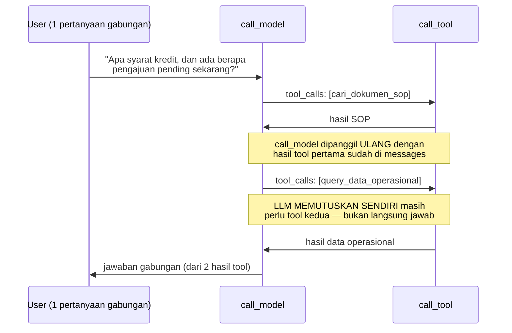
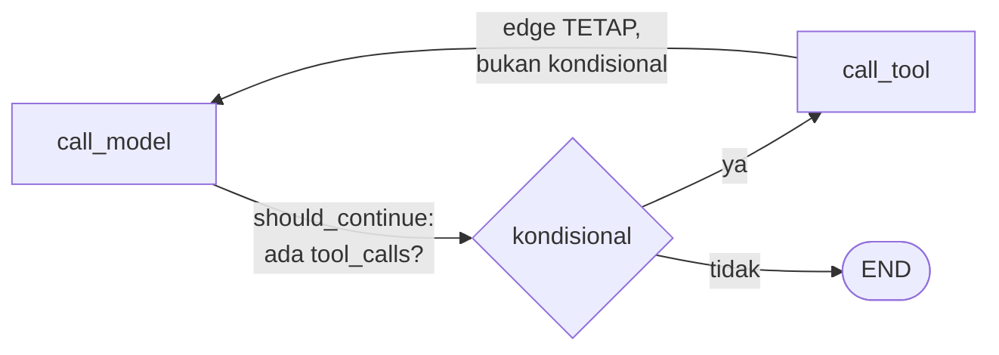

# Module 26: Multi-Hop Tool Calling — Memanggil Dua Tool Berurutan dalam Satu Permintaan

## Tujuan

Membuktikan level kemampuan function-calling ketiga (setelah Module 24: satu tool, Module 25: dua tool tapi LLM pilih salah satu) — agent NALA memanggil **kedua** tool (`cari_dokumen_sop` dan `query_data_operasional`) secara **berurutan** dalam **satu** permintaan user, untuk pertanyaan yang memang butuh keduanya sekaligus. Module ini **tidak menulis kode baru** — murni menguji dan mendokumentasikan kemampuan yang sudah ada sejak desain graph Module 24, plus mencatat jujur seberapa konsisten `llama3.2:3b` melakukannya.

## Definisi

**Multi-hop tool calling** adalah pola di mana agent memanggil lebih dari satu tool secara berurutan untuk menjawab **satu** pertanyaan — bukan LLM memilih satu tool lalu berhenti (Module 24-25), tapi LLM membaca hasil tool pertama, **memutuskan sendiri** masih ada yang perlu dicari lewat tool kedua, memanggilnya, baru menyusun jawaban akhir dari gabungan kedua hasil. "Hop" merujuk ke tiap lompatan `call_model → call_tool` — dua hop berarti dua kali `call_tool` dipanggil sebelum jawaban final.

Ini beda dari **routing** (Module 27): routing soal LLM memilih **tool mana** yang tepat untuk satu pertanyaan (keputusan eksklusif, "yang ini atau itu"); multi-hop soal LLM memilih **berapa tool** yang dibutuhkan dan **urutan** memanggilnya (keputusan inklusif, "yang ini dan itu, mana dulu").



## Hasil Akhir yang Diharapkan

- Dipahami **kenapa** multi-hop tidak butuh kode baru — konsekuensi langsung dari edge `call_tool → call_model` yang **tetap** (bukan kondisional) di graph Module 24
- Test set pertanyaan gabungan (butuh `cari_dokumen_sop` **dan** `query_data_operasional`) diuji **berulang kali**, bukan sekali coba — tingkat keberhasilan dicatat dengan angka nyata dari pengujian Anda sendiri, bukan klaim "pasti berhasil"
- Trace Langfuse (Module 22) dipakai untuk memverifikasi **jumlah hop** yang sebenarnya terjadi per request — bukan cuma menebak dari isi jawaban
- Dipahami jujur: ketidakkonsistenan multi-hop pada model kecil adalah keterbatasan **penalaran**, bukan bug kode — konsisten dengan pola yang sama di Module 20 Bagian 8 dan Module 25 Bagian 6
- `/chat` (Module 24) dan `/chat/stream` (Module 8) tetap berfungsi seperti sebelumnya — tidak ada perubahan kode di `app/agent.py`/`app/main.py`

**Prasyarat**: Module 24 (agent LangGraph dengan tool `cari_dokumen_sop`) dan Module 25 (tool kedua `query_data_operasional` terdaftar) harus sudah selesai dan berfungsi. Kalau Langfuse (Module 22) sudah aktif, verifikasi jumlah hop lewat trace jadi jauh lebih mudah — tidak wajib, tapi sangat direkomendasikan untuk module ini.

## 1. Kenapa Ini Bukan Fitur Baru: Konsekuensi Desain Graph Module 24

Module 24 Bagian 1 membangun graph LangGraph dengan dua edge: satu **kondisional** (`call_model → call_tool` atau `call_model → END`, tergantung `should_continue`), satu **tetap** (`call_tool → call_model`, selalu, tanpa syarat). Edge tetap inilah kuncinya — dikutip langsung dari materi Module 24 Bagian 4 Tahap C saat pertama kali ditulis:

> "`graph.add_edge("call_tool", "call_model")`: edge tetap (bukan kondisional) — setelah tool selesai dijalankan, **selalu** kembali ke `call_model` supaya LLM bisa menyusun jawaban dari hasil tool (**atau minta tool lain**, kalau Module 25 menambah tool kedua)."

Bagian yang digarisbawahi itu sudah mengantisipasi module ini sejak awal. Karena `call_tool` **selalu** kembali ke `call_model`, dan `call_model` sendiri tidak tahu (dan tidak perlu tahu) ini "kunjungan pertama" atau "kunjungan kedua" — ia cuma melihat `state["messages"]` yang sekarang sudah berisi hasil tool pertama, lalu memutuskan lagi dari awal: masih perlu tool, atau sudah cukup untuk menjawab? Kalau LLM memutuskan masih perlu tool (kali ini tool **kedua**), `should_continue` mengarahkannya ke `call_tool` lagi — loop berulang sampai `call_model` akhirnya tidak mengembalikan `tool_calls` sama sekali.



**Tidak ada batas jumlah hop yang di-hardcode** di mana pun dalam kode Module 24-25 — `should_continue` cuma mengecek "ada `tool_calls` atau tidak" di pesan **terakhir**, tidak peduli ini hop pertama, kedua, atau kesepuluh. Ini beda mendasar dari desain **pipeline tetap** (Module 9 Bagian 4, sebelum agent) yang kalau mau mendukung "kadang butuh dua sumber data" harus ditulis eksplisit sebagai dua langkah berurutan di kode — di sini, kemampuan itu **muncul otomatis** dari cara graph didesain, LLM sendiri yang memutuskan berapa hop yang dibutuhkan per pertanyaan.

**Yang membuat module ini perlu ada secara terpisah** bukan karena ada kode yang harus ditulis, tapi karena kemampuan ini **belum pernah dibuktikan** lewat pengujian nyata di Module 24-25 — kedua module itu sengaja memakai pertanyaan yang jelas cuma butuh **satu** tool (Module 25 Bagian tes eksplisit menyebut ini). Module ini yang pertama kali sengaja menguji kasus "butuh keduanya".

## 2. Coba Langsung: Pertanyaan yang Butuh Kedua Tool Sekaligus

Tiga contoh pertanyaan yang **sengaja** dirancang butuh `cari_dokumen_sop` **dan** `query_data_operasional` untuk dijawab lengkap — satu bagian kalimat mengarah ke prosedur/syarat (dokumen SOP), bagian lain mengarah ke data transaksi (database):

```bash
curl -X POST http://localhost:8000/chat \
  -H "Content-Type: application/json" \
  -d '{"message": "Apa saja syarat pengajuan kredit untuk nasabah perorangan, dan ada berapa banyak pengajuan kredit yang statusnya pending saat ini?"}'
```

```bash
curl -X POST http://localhost:8000/chat \
  -H "Content-Type: application/json" \
  -d '{"message": "Bagaimana prosedur klaim asuransi, dan bagaimana status klaim nasabah N-00231?"}'
```

```bash
curl -X POST http://localhost:8000/chat \
  -H "Content-Type: application/json" \
  -d '{"message": "Berapa lama estimasi pencairan kredit setelah disetujui, dan berapa jumlah pengajuan yang statusnya disetujui sekarang?"}'
```

**Cara memverifikasi jumlah hop yang sebenarnya terjadi** (jangan cuma menebak dari isi jawaban — jawaban yang lengkap **belum tentu** berarti kedua tool terpanggil, model kadang mengarang bagian yang tidak dicari):

- **Kalau Langfuse (Module 22) aktif**: buka trace request ini di dashboard Langfuse, cari span bertipe `agent_tool:*`. Untuk multi-hop yang **berhasil**, harus terlihat **dua** span (`agent_tool:cari_dokumen_sop` dan `agent_tool:query_data_operasional`) di dalam **satu** trace yang sama, dengan `agent_call_model` di antara keduanya (bukti `call_model` benar-benar dipanggil ulang di antara dua hop). Kalau cuma ada **satu** span tool, itu tandanya LLM cuma memanggil satu tool dan mengarang/mengabaikan bagian pertanyaan yang lain.
- **Tanpa Langfuse**: tambahkan `print()` sementara di `call_tool()` (`app/agent.py`) yang mencetak `name` tiap kali tool dipanggil, lalu lihat log container `api` (`docker compose logs -f api`) — kalau muncul dua baris nama tool berbeda untuk satu request, itu bukti dua hop terjadi.

**Uji berulang, catat sendiri hasilnya** — jangan percaya satu kali coba (konsisten dengan metodologi Module 20 Bagian 8 dan Module 25 Bagian 6, yang membuktikan model kecil tidak deterministik untuk tugas yang mirip). Jalankan **masing-masing** dari tiga pertanyaan di atas **5 kali berturut-turut**, catat di tabel:

| Pertanyaan | Percobaan 1 | 2 | 3 | 4 | 5 | Berhasil (2 hop) |
|---|---|---|---|---|---|---|
| Syarat kredit + jumlah pending | | | | | | _/5 |
| Prosedur klaim + status nasabah | | | | | | _/5 |
| Estimasi pencairan + jumlah disetujui | | | | | | _/5 |

Isi tiap sel dengan jumlah hop yang benar-benar terjadi (dari Langfuse/log), bukan dari kesan membaca jawaban. Angka **Anda sendiri** di tabel ini lebih bisa dipercaya daripada angka generik di materi manapun — karena bergantung pada data yang sudah Anda ingest, redaksi pertanyaan yang persis Anda pakai, dan variasi acak model itu sendiri.

## 3. Kenapa Tidak Selalu Konsisten: Keterbatasan Penalaran, Bukan Bug

Kalau dari tabel Bagian 2 Anda menemukan tidak semua percobaan menghasilkan 2 hop — itu **diharapkan**, bukan tanda ada yang salah dengan kode. Pola kegagalan yang umum terlihat:

- **Cuma memanggil tool untuk bagian pertama kalimat**, mengabaikan bagian kedua — LLM "berhenti" setelah dapat hasil tool pertama, langsung menjawab sebagian, tidak menyadari separuh pertanyaan lagi belum terjawab.
- **Memanggil tool yang salah untuk bagian kedua** — alih-alih `query_data_operasional`, LLM mencoba menjawab bagian data dari pengetahuan umum atau dari hasil `cari_dokumen_sop` yang sebenarnya tidak relevan.
- **Memanggil kedua tool tapi gagal menyintesis** — kedua hop terjadi (bukti di trace), tapi jawaban akhir cuma memakai salah satu hasil — ini persis mode kegagalan "sintesis" yang sudah didokumentasikan Module 25 Bagian 6 untuk kasus satu-tool, ternyata muncul lagi di kasus dua-tool.

**Kenapa ini terjadi**: memutuskan "pertanyaan ini punya DUA kebutuhan info yang terpisah" adalah tugas penalaran (*reasoning*) yang lebih kompleks dibanding memutuskan "pertanyaan ini butuh SATU tool yang mana" (Module 25). Model kecil (`llama3.2:3b`, 3 miliar parameter) punya kapasitas penalaran yang terbatas untuk memecah kalimat majemuk jadi sub-kebutuhan yang jelas — ini bukan sesuatu yang bisa diperbaiki lewat rekayasa prompt kecil, konsisten dengan temuan `temperature=0` yang **memperburuk** (bukan memperbaiki) konsistensi di Module 25 Bagian 6.

**Mitigasi yang realistis** (bukan solusi sempurna):

- **System prompt lebih eksplisit** — menambah instruksi ke `NALA_SYSTEM_PROMPT_AGENT` (Module 25 Bagian Tahap C) seperti "kalau pertanyaan punya beberapa bagian, pastikan semua bagian terjawab, pakai tool sebanyak yang perlu" — membantu sedikit, tapi tidak menghilangkan masalah (sama seperti pola di Module 25 Bagian 6 untuk perbaikan protokol `tool_call_id`).
- **Model yang lebih besar** — `qwen2.5:7b` (opsi upgrade RAM 32GB+, disebut sejak README utama) punya kapasitas penalaran lebih baik untuk memecah kalimat majemuk seperti ini, konsisten dengan rekomendasi yang sama di Module 25 Bagian 6.
- **Memecah jadi dua pertanyaan** — solusi paling sederhana dan paling andal: staff yang tahu butuh dua info sekaligus bisa saja bertanya dua kali secara terpisah (memakai `history` multi-turn dari Module 25 Langkah 4) alih-alih satu kalimat majemuk — trade-off UX vs keandalan yang jujur, bukan disembunyikan.

## 4. Apa yang TIDAK Ada di Module Ini

- Perubahan kode apa pun di `app/agent.py`, `app/main.py`, atau tool manapun — module ini murni pengujian dan dokumentasi kemampuan yang sudah ada.
- Jaminan/pemaksaan agar multi-hop selalu terjadi kalau memang dibutuhkan — di luar kemampuan realistis model 3B, lihat Bagian 3.
- Penanganan kasus **ambigu** (pertanyaan yang bisa ditafsirkan butuh satu tool ATAU tool lain, bukan jelas-jelas butuh keduanya) — itu topik **routing**, dibahas terpisah di Module 27.
- Pembatasan jumlah hop maksimum atau proteksi terhadap infinite loop (LLM yang terus-menerus meminta tool tanpa pernah berhenti) — risiko nyata untuk produksi, tapi di luar cakupan training ini; `should_continue` saat ini mempercayai LLM akan berhenti sendiri.

## Checkpoint Praktik

Yang perlu dipastikan sebelum lanjut ke Module 27:

- [ ] Dipahami kenapa multi-hop tidak butuh kode baru — konsekuensi edge tetap `call_tool → call_model` dari Module 24
- [ ] Minimal satu dari tiga pertanyaan uji di Bagian 2 berhasil memicu 2 hop (dua tool terpanggil), diverifikasi lewat trace Langfuse atau log — bukan cuma dari kesan membaca jawaban
- [ ] Tabel percobaan berulang (Bagian 2) sudah diisi dengan hasil nyata dari lingkungan Anda sendiri
- [ ] Dipahami perbedaan multi-hop (module ini: berapa tool & urutan) vs routing (Module 27: tool mana yang tepat)
- [ ] `/chat` dan `/chat/stream` tetap berfungsi seperti sebelumnya, tidak ada regresi

## Kesimpulan

Module ini tidak menambah satu baris kode pun ke `Nala/` — dan itu justru intinya. Kemampuan memanggil dua tool berurutan dalam satu permintaan sudah **built-in** sejak graph LangGraph pertama kali dirancang di Module 24, murni konsekuensi dari edge `call_tool → call_model` yang dibuat tetap (bukan kondisional). Yang dibuktikan di sini adalah kemampuan itu **benar-benar bekerja** pada kasus nyata (pertanyaan gabungan SOP + data operasional) — sekaligus mencatat jujur bahwa keandalannya dibatasi kapasitas penalaran model kecil, bukan oleh desain arsitekturnya.

Pelajaran yang lebih luas dari module ini: desain sebagai **graph** (bukan pipeline linear tetap) yang jadi tema sentral Module 24 Bagian 1 punya manfaat yang baru terlihat penuh di sini — kemampuan yang tidak pernah secara eksplisit "diprogram" (multi-hop) muncul sebagai efek samping alami dari struktur yang tepat. Module 27 selanjutnya membahas sisi lain dari fleksibilitas ini: kalau LLM bisa memutuskan sendiri berapa tool yang dipakai, ia juga bisa **salah** memutuskan tool mana yang relevan — itu topik routing.

---

Untuk informasi lebih lanjut, lihat [README utama](../README.md).
