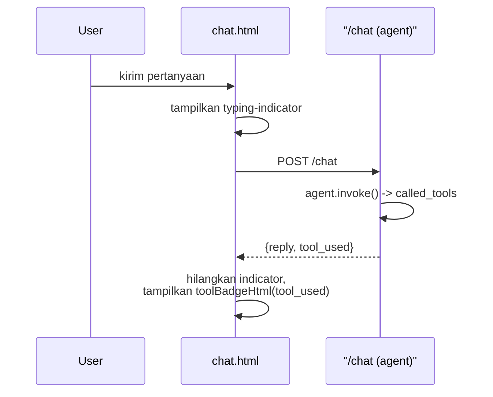

# Module 26: Polish Frontend untuk Demo Capstone

## Tujuan

Melakukan polish terakhir pada `chat.html`/`upload.html` (loading indicator, badge tool RAG-vs-SQL, cek responsif) supaya kemampuan backend yang sudah dibangun Module 5-23 terlihat jelas saat demo capstone, tanpa mengubah backend atau menambah framework baru.

## Definisi

**Polish** di module ini berarti membuat kemampuan yang **sudah ada** di backend terlihat jelas di UI — bukan **redesign** (mengubah struktur/gaya visual dasar) dan bukan menambah kemampuan baru (Bagian 1). Bedanya penting: redesign mengubah apa yang ada, polish cuma menyingkap apa yang sudah ada tapi belum terlihat.

**Tool-used badge** adalah label visual ("Dokumen SOP (RAG)" atau "Data Operasional (SQL)") yang menunjukkan tool mana yang **benar-benar** dipanggil agent (Module 19-23) untuk satu jawaban — diturunkan langsung dari `called_tools`, dan cuma tool dengan `diizinkan: True` yang dihitung, supaya tool yang ditolak RBAC tidak ikut ditandai seolah datanya benar-benar diambil (Bagian 2 Tahap B). Loading/typing indicator mengisi jeda **sebelum token pertama tiba** — beda dari streaming itu sendiri (sudah ada sejak Module 6), indikator ini cuma menutupi waktu tunggu retrieval + routing di backend supaya layar tidak terasa diam (Bagian 1). Kedua fitur ini tetap menjaga `escapeHtml()` di setiap render teks — mencegah **XSS** (*cross-site scripting*, kode berbahaya yang menyusup lewat teks yang di-render mentah) tetap jadi syarat, bukan sesuatu yang boleh dilonggarkan demi polish (Bagian 4).



## Hasil Akhir yang Diharapkan

- Indikator loading (tiga titik animasi) muncul di jeda sebelum token pertama, lalu hilang otomatis begitu jawaban mulai streaming.
- Badge "Dokumen SOP (RAG)" atau "Data Operasional (SQL)" tampil di mode Agent (`/chat`, non-streaming) sesuai tool yang benar-benar dipakai — lewat field `tool_used` di response JSON, bukan parsing stream (lihat Bagian 2 Tahap B kenapa).
- Halaman chat, upload, dan status tetap terlihat wajar (tidak terpotong/overflow) di lebar layar 375px dan 768px.
- `escapeHtml()` tetap dipertahankan di semua render teks baru, tanpa regresi keamanan XSS dari polish ini.

## 1. Kenapa Polish, Bukan Redesign

`chat.html` dan `upload.html` sudah berfungsi penuh sejak Module 5 — Module 5 (chat dasar), Module 6 (streaming + multi-turn), Module 13 (upload) sudah membangun fondasinya, dan Module 15-23 menambah kemampuan **di belakang layar** (hybrid search, reranking, agent routing RAG-vs-SQL) tanpa pernah menyentuh HTML/CSS lagi. Efeknya: NALA sekarang jauh lebih pintar dari yang **terlihat** — dari sisi UI, jawaban agentic Module 19-23 tetap muncul sebagai teks polos yang tidak beda tampilannya dari jawaban RAG polos Module 5-14.

Module ini **bukan** membangun ulang frontend — ini pass polish terakhir sebelum capstone, dengan tiga target konkret:

1. **Tool-used badge** — staf yang mendemokan NALA (dan penilai capstone) bisa melihat sekilas apakah jawaban berasal dari RAG dokumen atau SQL tool (Module 19-23), tanpa harus buka Langfuse.
2. **Loading/typing indicator** — sejak Module 6, jawaban sudah streaming token-demi-token, tapi jeda **sebelum** token pertama muncul (saat retrieval + agent routing berjalan di backend) masih terasa seperti layar diam.
3. **Cek layout responsif** — memastikan tampilan tetap wajar di layar sempit (laptop projector, tablet) untuk sesi demo capstone.

Ketiganya tetap dalam batasan desain yang sudah dipegang sejak awal: **server-rendered Jinja2 + vanilla CSS/JS, tanpa framework baru** — konsisten dengan keputusan desain di spec training ("frontend sengaja dibuat minimal ... supaya tidak menambah beban kurikulum di luar fokus AI/backend").

⚠️ **Asumsi yang perlu disesuaikan — dan hasil pengecekan nyata**: Module ini awalnya ditulis dengan asumsi endpoint agentic Module 19-23 mengembalikan metadata tool lewat baris JSON pertama di **stream**. Setelah dicek langsung ke implementasi nyata (Module 20 Bagian 3 Tahap C): routing RAG-vs-SQL (Module 19-23) **cuma terjadi di endpoint `/chat`** (mode Agent, non-streaming, dipicu checkbox "Pakai Agent" di `chat.html`) — `/chat/stream` **tetap RAG murni** sejak Module 5-14, sengaja tidak disentuh (keputusan desain eksplisit di Module 20). Jadi pendekatan streaming-metadata di rencana awal **tidak berlaku** untuk arsitektur ini — badge dipasang lewat field JSON biasa di response `/chat`, jauh lebih sederhana daripada parsing baris pertama stream. Kalau implementasi Anda berbeda (metadata tool memang ada di endpoint streaming), sesuaikan pendekatannya — tapi cek dulu endpoint mana yang benar-benar melakukan routing sebelum menulis kode, seperti yang kita lakukan di sini.

## 2. Struktur Kode yang Ditambahkan

Tiga penambahan di `app/templates/chat.html` dan `app/static/style.css`, dibangun bertahap:

1. **Tahap A — Loading indicator**, murni CSS + sedikit JS, tidak bergantung pada perubahan backend apa pun.
2. **Tahap B — Tool-used badge**, bergantung pada metadata dari endpoint agentic Module 19-23 (lihat asumsi di Bagian 1).
3. **Tahap C — Cek & perbaiki responsif**, murni CSS.

### Tahap A — Loading/Typing Indicator

**Langkah 1 — Tampilkan indikator sebelum token pertama tiba**

`chat.html` sejak Module 6 membuat elemen balasan NALA (`replyEl`) **kosong** sebelum stream mulai, lalu diisi bertahap. Jeda antara "elemen dibuat" dan "token pertama muncul" (waktu retrieval + agent routing + mulai generate) itulah yang terasa diam. Tambahkan indikator visual untuk jeda ini:

```html
<!-- app/templates/chat.html — di dalam handler submit, ganti pembuatan replyEl -->
<script>
    // ... variabel form, history, input, conversation sudah ada sejak Module 6 ...

    form.addEventListener("submit", async (e) => {
        e.preventDefault();
        const message = input.value;
        input.value = "";

        conversation.push({ role: "user", content: message });
        history.innerHTML += `<p class="user"><b>Anda:</b> ${escapeHtml(message)}</p>`;

        const replyEl = document.createElement("p");
        replyEl.className = "nala";
        replyEl.innerHTML = '<b>NALA:</b> <span class="typing-indicator"><span></span><span></span><span></span></span>';
        history.appendChild(replyEl);
        history.scrollTop = history.scrollHeight;

        const response = await fetch("/chat/stream", {
            method: "POST",
            headers: { "Content-Type": "application/json" },
            body: JSON.stringify({ messages: conversation }),
        });

        const reader = response.body.getReader();
        const decoder = new TextDecoder();
        let fullReply = "";
        let firstChunkReceived = false;

        while (true) {
            const { done, value } = await reader.read();
            if (done) break;
            if (!firstChunkReceived) {
                firstChunkReceived = true;
            }
            fullReply += decoder.decode(value, { stream: true });
            replyEl.innerHTML = `<b>NALA:</b> ${escapeHtml(fullReply)}`;
            history.scrollTop = history.scrollHeight;
        }

        conversation.push({ role: "assistant", content: fullReply });
        updateMeta();
    });
</script>
```

Perubahan dibanding Module 6: `replyEl` dibuat berisi `<span class="typing-indicator">` (tiga titik animasi CSS, lihat Langkah 2) **alih-alih** kosong. Begitu chunk pertama diterima (`decoder.decode` pertama kali menghasilkan isi), `replyEl.innerHTML` langsung ditimpa dengan `escapeHtml(fullReply)` — otomatis menghapus indikator karena elemen di-render ulang seluruhnya. `escapeHtml()` tetap dipertahankan persis seperti Module 6 — indikator ini **tidak** mengubah cara token ditampilkan setelah mulai muncul, cuma mengisi jeda sebelum token pertama.

**Langkah 2 — CSS animasi titik**

```css
/* app/static/style.css — tambahan Module 26 */
.typing-indicator {
    display: inline-flex;
    gap: 4px;
    vertical-align: middle;
}

.typing-indicator span {
    width: 6px;
    height: 6px;
    border-radius: 50%;
    background: #1e3a5f;
    opacity: 0.4;
    animation: typing-bounce 1.2s infinite ease-in-out;
}

.typing-indicator span:nth-child(2) { animation-delay: 0.2s; }
.typing-indicator span:nth-child(3) { animation-delay: 0.4s; }

@keyframes typing-bounce {
    0%, 60%, 100% { opacity: 0.4; transform: translateY(0); }
    30% { opacity: 1; transform: translateY(-3px); }
}
```

**▶️ Jalankan & lihat hasilnya**

```bash
docker compose up --build api
```

Buka `http://localhost:8000`, kirim pertanyaan yang butuh retrieval (misalnya soal SOP kredit) — perhatikan tiga titik animasi muncul **sebelum** teks jawaban mulai mengalir, lalu otomatis hilang begitu token pertama tiba.

✅ **Indikator sukses**: indikator titik muncul di jeda sebelum token pertama, hilang otomatis (bukan manual) begitu ada isi, dan jawaban tetap streaming bertahap seperti Module 6 setelahnya.

<details>
<summary><strong>Pakai Claude Code? Salin prompt berikut, paste untuk eksekusi Langkah 1-2</strong></summary>

```
Tambah typing indicator di chat.html sebelum token pertama muncul
(Module 26, Tahap A).

GOAL:
1. Di app/templates/chat.html, ubah bagian pembuatan replyEl di
   handler submit form: innerHTML awal replyEl diisi
   '<b>NALA:</b> <span class="typing-indicator"><span></span>
   <span></span><span></span></span>' (bukan kosong seperti Module 6),
   lalu tetap ditimpa penuh dengan escapeHtml(fullReply) begitu chunk
   pertama diterima dari stream (logika loop while(true) TIDAK
   berubah, cuma isi awal replyEl).
2. Di app/static/style.css, tambah class .typing-indicator (3 titik
   inline-flex, animasi CSS keyframes bounce dengan delay bertahap
   per titik).

CONTEXT:
- File ini versi Module 6 Tahap C (fetch ke /chat/stream, baca
  reader.getReader(), escapeHtml() di setiap update).

GUARDRAIL:
- JANGAN ubah endpoint /chat/stream atau logic fetch/reader — murni
  perubahan tampilan sisi client.
- JANGAN hapus escapeHtml() — WAJIB tetap dipakai di setiap render
  fullReply.
- JANGAN tambah library JS eksternal — CSS + vanilla JS saja.
```

</details>

### Tahap B — Badge Tool yang Dipakai Agent (RAG vs SQL)

**Langkah 3 — Tambah field `tool_used` di response `/chat`, tampilkan sebagai badge**

Karena routing RAG-vs-SQL cuma terjadi di `/chat` (non-streaming), pendekatannya jauh lebih sederhana dari rencana awal: tambahkan satu field ke `ChatResponse`, isi dari `called_tools` yang sudah dikembalikan `agent.invoke()` sejak Module 23 (RBAC) — tidak perlu endpoint tambahan atau parsing stream sama sekali.

```python
# app/main.py — ChatResponse bertambah satu field
class ChatResponse(BaseModel):
    reply: str
    tool_used: str = "none"
```

```python
# app/main.py — di akhir fungsi chat(), sebelum return
used_names = {entry["tool"] for entry in called_tools if entry["diizinkan"]}
if "query_data_operasional" in used_names and "cari_dokumen_sop" in used_names:
    tool_used = "mixed"
elif "query_data_operasional" in used_names:
    tool_used = "sql"
elif "cari_dokumen_sop" in used_names:
    tool_used = "rag"
else:
    tool_used = "none"

return ChatResponse(reply=reply, tool_used=tool_used)
```

Hanya tool yang **`diizinkan: True`** dihitung — kalau RBAC (Module 23) menolak percobaan SQL tool, itu tidak boleh muncul sebagai badge "Data Operasional (SQL)" karena datanya memang tidak pernah benar-benar diambil.

```javascript
// app/templates/chat.html — di dalam handler submit, cabang agentModeCheckbox.checked
const data = await response.json();
fullReply = data.reply || `Error: ${JSON.stringify(data)}`;
replyEl.innerHTML = `${toolBadgeHtml(data.tool_used)}<b>NALA:</b> ${escapeHtml(fullReply)}`;
```

```javascript
// app/templates/chat.html — helper function, taruh sebelum handler submit
function toolBadgeHtml(tool) {
    if (tool === "sql") return '<span class="tool-badge tool-sql">Data Operasional (SQL)</span> ';
    if (tool === "rag") return '<span class="tool-badge tool-rag">Dokumen SOP (RAG)</span> ';
    if (tool === "mixed") return '<span class="tool-badge tool-rag">Dokumen SOP (RAG)</span> <span class="tool-badge tool-sql">Data Operasional (SQL)</span> ';
    return "";
}
```

```css
/* app/static/style.css — tambahan */
.tool-badge {
    display: inline-block;
    font-size: 0.75em;
    padding: 2px 8px;
    border-radius: 10px;
    margin-right: 6px;
    font-weight: 600;
}

.tool-badge.tool-rag {
    background: #e0ecf7;
    color: #1e3a5f;
}

.tool-badge.tool-sql {
    background: #fde8d7;
    color: #8a4a00;
}
```

Mode biasa (`/chat/stream`, checkbox "Pakai Agent" tidak dicentang) **tidak pernah** menampilkan badge — sesuai kenyataan bahwa jalur ini murni RAG tanpa pilihan tool sama sekali, tidak ada yang perlu ditandai.

**▶️ Jalankan & lihat hasilnya**

```bash
docker compose up -d --build api
```

Centang "Pakai Agent", kirim satu pertanyaan yang jawabannya jelas dari dokumen SOP, lalu satu pertanyaan yang jelas butuh data operasional (role `staff_finance`/`supervisor`, bukan `staff_umum` — lihat Module 23 RBAC). Amati badge yang muncul di atas tiap balasan.

**Hasil uji nyata** — diverifikasi langsung lewat `/chat`:

| Pertanyaan | `tool_used` |
|---|---|
| "Apa saja syarat pengajuan kredit untuk nasabah perorangan?" | `rag` ✅ |
| "Berapa banyak pengajuan kredit yang statusnya pending?" | `sql` ✅ |
| "Halo, kamu siapa?" | `rag` (bukan `none`) |

Baris terakhir **bukan bug badge** — itu cerminan akurat dari perilaku model kecil yang sudah didokumentasikan di Module 22 Bagian 6: `llama3.2:3b` kadang memanggil `cari_dokumen_sop` untuk sapaan sederhana alih-alih menjawab langsung. Badge menampilkan tool yang **benar-benar** dipanggil — kalau routing-nya keliru, itu tetap ditampilkan apa adanya, bukan disembunyikan. Ini konsisten dengan filosofi kejujuran kurikulum ini: badge bukan alat untuk membuat NALA "terlihat" selalu benar, tapi alat untuk membuat perilaku sebenarnya (termasuk yang keliru) terlihat jelas saat demo.

✅ **Indikator sukses**: badge "Dokumen SOP (RAG)" dan "Data Operasional (SQL)" muncul dengan warna berbeda, sesuai tool yang sebenarnya dipakai agent — dicocokkan lewat `data.tool_used` di response JSON, bukan tebakan visual (verifikasi silang dengan trace Langfuse, Module 25 Bagian 2.a, kalau ragu).

<details>
<summary><strong>Pakai Claude Code? Salin prompt berikut, paste untuk eksekusi Langkah 3</strong></summary>

```
Tambah badge tool yang dipakai agent (RAG vs SQL) — lewat field JSON
di response /chat, BUKAN parsing stream (Module 26, Tahap B).

GOAL:
1. Di app/main.py: tambah field tool_used: str = "none" ke
   ChatResponse. Di akhir fungsi chat() (setelah called_tools sudah
   dihitung untuk audit logging), derive tool_used dari called_tools:
   "mixed" kalau cari_dokumen_sop DAN query_data_operasional sama-sama
   ada dengan diizinkan=True, "sql" kalau cuma query_data_operasional,
   "rag" kalau cuma cari_dokumen_sop, "none" kalau tidak ada (atau
   semua ditolak RBAC). Sertakan tool_used di return ChatResponse(...).
2. Di app/templates/chat.html: tambah helper toolBadgeHtml(tool) yang
   return HTML <span class="tool-badge tool-rag/tool-sql"> sesuai
   value, dipanggil di cabang agentModeCheckbox.checked SETELAH data
   JSON diterima dari /chat, disisipkan sebelum "<b>NALA:</b>".
3. Tambah CSS .tool-badge/.tool-badge.tool-rag/.tool-badge.tool-sql di
   app/static/style.css.

CONTEXT:
- Routing RAG-vs-SQL cuma terjadi di /chat (non-streaming, mode
  Agent) — /chat/stream TETAP RAG murni, TIDAK dapat badge (tidak ada
  pilihan tool untuk ditandai di jalur itu).
- called_tools sudah tersedia di final_state sejak Module 23
  (RBAC), formatnya list[{"tool": str, "diizinkan": bool}].

GUARDRAIL:
- JANGAN ubah endpoint /chat/stream — badge HANYA di jalur /chat.
- Tool yang diizinkan=False (ditolak RBAC) TIDAK BOLEH dihitung
  sebagai tool_used — itu bukan tool yang benar-benar dipakai.
- Pertahankan escapeHtml() untuk seluruh teks balasan.
```

</details>

### Tahap C — Cek Layout Responsif

**Langkah 4 — Verifikasi dan perbaiki lebar minimum**

`style.css` sejak Module 5 memakai `max-width: 640px; margin: 40px auto;` pada `body` — ini sudah cukup responsif secara default (lebar maksimum, bukan lebar tetap), tapi belum pernah diuji eksplisit di layar sempit. Tambahkan penyesuaian kecil untuk layar mobile/tablet:

```css
/* app/static/style.css — tambahan */
@media (max-width: 480px) {
    body {
        margin: 16px auto;
        padding: 0 12px;
    }

    #chat-form {
        flex-direction: column;
    }

    .chat-meta {
        flex-wrap: wrap;
        gap: 8px;
    }

    #history {
        height: 260px;
    }
}
```

Ini **bukan** desain mobile-first baru — cuma memastikan elemen yang sebelumnya diasumsikan cukup lebar (form chat dengan input+tombol sejajar, `.chat-meta` dari Module 6 Langkah 6) tidak terpotong atau bertumpuk aneh di layar sempit.

**▶️ Jalankan & lihat hasilnya**

Buka `http://localhost:8000` di browser, gunakan DevTools (mode responsif, `Ctrl+Shift+M`/`Cmd+Shift+M` di Chrome) untuk mensimulasikan lebar layar 375px (ukuran HP umum) dan 768px (tablet). Kirim beberapa pesan, buka juga `/upload` dan `/status/view` (Module 25).

✅ **Indikator sukses**: tidak ada elemen terpotong atau overflow horizontal di 375px, tombol dan input tetap bisa diklik/diketik dengan wajar, teks tidak keluar dari batas layar.

<details>
<summary><strong>Pakai Claude Code? Salin prompt berikut, paste untuk eksekusi Langkah 4</strong></summary>

```
Tambah media query responsif untuk layar sempit di style.css
(Module 26, Tahap C).

GOAL:
- Di app/static/style.css, tambah @media (max-width: 480px) yang:
  mengecilkan margin/padding body, mengubah #chat-form jadi
  flex-direction: column, membuat .chat-meta wrap dengan gap,
  mengecilkan tinggi #history jadi 260px.

CONTEXT:
- style.css sudah ada sejak Module 5 (body max-width 640px),
  ditambah .chat-meta dari Module 6, .typing-indicator dan
  .tool-badge dari Tahap A-B module ini.

GUARDRAIL:
- JANGAN redesign tampilan default (di atas 480px) — cuma tambah
  media query baru untuk layar sempit.
- JANGAN ubah HTML — murni CSS.
```

</details>

## 3. Apa yang TIDAK Ada di Module Ini

- Tidak ada redesign visual (warna, font, layout dasar) — itu keputusan desain yang sudah dipegang sejak Module 5, bukan sesuatu yang diubah di modul-modul akhir.
- Tidak ada framework frontend baru (React/Vue/build tooling) — tetap server-rendered Jinja2 + vanilla CSS/JS, sesuai batasan eksplisit di spec training.
- Tidak ada perubahan pada logika agent/routing RAG-vs-SQL Module 19-23 (`tool_used` di Tahap B murni membaca hasil `called_tools` yang sudah ada, bukan mengubah cara agent memutuskan), atau pada `/health` — module ini murni lapisan tampilan di atas yang sudah ada.

## 4. Checkpoint Praktik

- [ ] Loading indicator muncul di jeda sebelum token pertama, hilang otomatis begitu jawaban mulai mengalir
- [ ] Badge tool (RAG/SQL) muncul di mode Agent sesuai `tool_used` dari response `/chat` — dan mencerminkan tool yang **benar-benar** dipakai, termasuk saat routing model keliru (lihat hasil uji Bagian 2 Tahap B), bukan disesuaikan supaya "terlihat benar"
- [ ] Halaman chat, upload, dan status tetap terlihat wajar di lebar layar 375px dan 768px
- [ ] `escapeHtml()` tetap dipertahankan di semua render teks baru — tidak ada regresi keamanan XSS dari polish ini (lihat Module 25 Bagian 3 soal pentingnya sanitasi input/output)

## Panduan Praktik

> Catatan penomoran: bagian ini punya urutan **Langkah 1-2** sendiri (langkah eksekusi praktik), terpisah dari Langkah 1-4 yang sudah muncul di Bagian 2 Tahap A-C di atas (langkah penjelasan konsep/kode). Nomor di bawah ini merujuk ke urutan eksekusi panduan praktik, bukan ke Bagian 2.

### Prasyarat

- Module 24 (full-stack deployment) dan Module 25 (status page + checklist keamanan) sudah selesai — stack lengkap sudah jalan di `resources/starter-code/nala/`.

### Langkah 1: Implementasikan Module 26 (Polish Frontend)

Ikuti Langkah-langkah di Bagian 2 di atas:

- **Tahap A** — tambah typing indicator.
- **Tahap B** — tambah tool-used badge (RAG vs SQL).
- **Tahap C** — cek dan perbaiki layout responsif.

Setiap kali mengubah `app/main.py`, `app/templates/chat.html`, atau `app/static/style.css`, rebuild `api` saja (bukan seluruh stack):

```bash
docker compose up -d --build api
```

### Langkah 2: Uji Coba Menyeluruh via UI

Setelah Module 24-26 selesai, verifikasi semuanya langsung lewat browser (bukan cuma `curl`) — ini juga bentuk gladi bersih sebelum demo capstone, dan sekaligus dress rehearsal yang menyatukan hasil ketiga module tersebut:

- [ ] **Typing indicator** (Module 26 Tahap A) — buka `http://localhost:8000`, kirim pertanyaan apa saja di mode biasa maupun mode Agent. Tiga titik animasi harus muncul sebentar sebelum jawaban tampil, lalu hilang otomatis begitu token/jawaban pertama tiba.
- [ ] **Tool badge** (Module 26 Tahap B) — centang "Pakai Agent", pilih role `staff_finance`. Tanya soal SOP (mis. *"Apa saja syarat pengajuan kredit untuk nasabah perorangan?"*) → badge biru "Dokumen SOP (RAG)" muncul. Tanya soal data (mis. *"Berapa banyak pengajuan kredit yang statusnya pending?"*) → badge oranye "Data Operasional (SQL)". Coba juga role `staff_umum` dengan pertanyaan data — amati apakah badge muncul (lihat gap RBAC, Module 22 Bagian 6, sebelum menyimpulkan ini "salah").
- [ ] **Layout responsif** (Module 26 Tahap C) — buka DevTools (`Cmd+Shift+M`/`Ctrl+Shift+M`), set lebar 375px lalu 768px. Cek halaman Chat, `/status/view`, dan `/data-operasional` — tidak ada elemen terpotong/overflow horizontal.
- [ ] **Status page** (Module 25) — `http://localhost:8000/status/view`, pastikan auto-refresh (tunggu 15 detik, perhatikan halaman reload sendiri) dan semua service `ok`/hijau.
- [ ] **Adminer** (Module 23) — `http://localhost:8081`, login `nala_admin` + password dari `.env` (`POSTGRES_ADMIN_PASSWORD`, atau `changeme_dev_only` kalau belum pernah diganti/di-`ALTER USER`). Cek tabel `audit_log` menampilkan baris-baris dari pengujian di atas.
- [ ] **Langfuse** (`http://localhost:3000`) — cek trace dari percakapan barusan, termasuk field `tool_used` yang ikut tercatat di `trace.update()` (Module 26).

Kalau ada satu poin yang hasilnya tidak sesuai, cek dulu apakah itu memang gap/keterbatasan yang sudah didokumentasikan (Module 24 Bagian 4a, Module 22 Bagian 6, Module 23 Bagian 4) sebelum menganggapnya bug baru.

Setelah semua poin di atas terpenuhi, lanjutkan ke **Module 27 materi.md, bagian Panduan Praktik** (`../Module-27-Ethics-Governance/materi.md`) untuk diskusi etika & governance dan persiapan capstone.

### Troubleshooting

- **Badge tool tidak pernah muncul / selalu kosong**: badge dibaca dari field `tool_used` di response JSON `/chat` (mode Agent, non-streaming) — bukan dari parsing stream. Cek dulu response mentah lewat `curl -X POST http://localhost:8000/chat ...` dan pastikan `tool_used` benar-benar ada di JSON-nya; kalau tidak, cek `called_tools`/`diizinkan` di `app/main.py` (Bagian 2 Tahap B) sesuai implementasi Module 23 Anda.
- **Typing indicator tidak hilang otomatis / macet di tiga titik animasi**: cek `replyEl.innerHTML` benar-benar ditimpa penuh begitu chunk pertama diterima dari stream (bukan di-append) — lihat kode Langkah 1 Tahap A di Bagian 2 di atas.

## Kesimpulan

Module ini menutup pekerjaan frontend NALA: bukan dengan menambah kompleksitas, tapi dengan membuat kemampuan yang sudah ada (agent routing Module 19-23, streaming Module 5-14) **terlihat** oleh orang yang mendemokannya. Ketiga polish ini kecil secara kode, tapi berpengaruh besar untuk kualitas demo capstone — penilai yang melihat NALA menjawab dengan badge tool yang jelas dan tanpa jeda diam yang membingungkan akan lebih mudah menilai poin "fungsionalitas sistem" dan "presentasi & komunikasi hasil" di rubrik capstone (lihat `../Capstone/rubrik-penilaian.md`) secara akurat — bukan menebak-nebak apa yang sebenarnya terjadi di balik layar.
