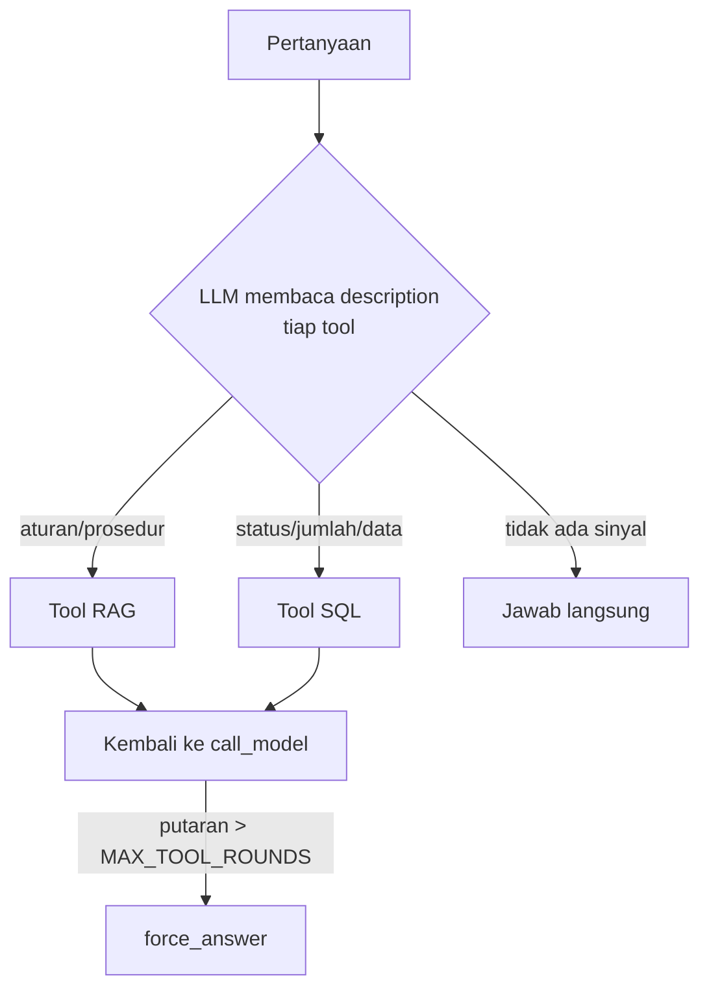
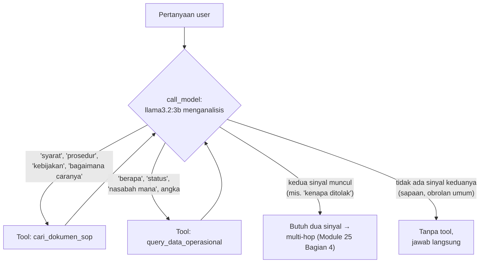

# Module 26: Routing — Menggabungkan RAG + SQL Tool dalam Satu Agent

## Tujuan

Memahami dan menguji bagaimana agent NALA memilih **tool mana** yang tepat antara tool RAG (Module 24) dan tool SQL (Module 25) untuk satu pertanyaan — termasuk pertanyaan ambigu yang bikin model salah pilih — lalu menambahkan pengaman batas putaran tool supaya kegagalan routing tidak berujung loop tanpa henti. (Kasus yang butuh **keduanya** secara berurutan sudah dibahas tuntas di Module 25 Bagian 4, "Multi-Hop".)

## Definisi

**Routing**, di sini, bukan komponen kode terpisah yang ditulis khusus — ia adalah nama untuk keputusan yang sudah diam-diam terjadi setiap kali node `call_model` dipanggil (Module 24): LLM membaca pertanyaan dan `description` tiap tool, lalu memutuskan mau pakai tool RAG (`cari_dokumen_sop`), tool SQL (`query_data_operasional`), atau tidak pakai tool sama sekali. Secara umum, tool RAG cocok untuk pertanyaan tentang **aturan/prosedur** yang jawabannya statis dan tertulis di dokumen, sementara tool SQL cocok untuk pertanyaan tentang **status/jumlah/data transaksi** yang berubah setiap hari dan tidak pernah ditulis di dokumen mana pun — dua sumber jawaban yang saling melengkapi, bukan saling menggantikan.

Ini beda dari **multi-hop tool calling** (Module 25 Bagian 4): routing soal LLM memilih **tool mana** yang tepat untuk satu pertanyaan (keputusan eksklusif, "yang ini atau itu"); multi-hop soal LLM memilih **berapa tool** yang dibutuhkan dan **urutan** memanggilnya (keputusan inklusif, "yang ini dan itu, mana dulu"). Keduanya berjalan di atas graph yang sama persis dari Module 24 — yang berbeda cuma pertanyaan yang diuji dan kegagalan yang diamati. Module 25 Bagian 4 sudah menguji tuntas sisi "berapa tool & urutannya"; module ini fokus penuh ke sisi "tool mana yang tepat", termasuk ketika model salah memilih.

Karena keputusan ini sepenuhnya bergantung pada kemampuan model membaca maksud pertanyaan (bukan aturan `if/else` yang pasti benar), routing bisa **salah** — model kecil seperti `llama3.2:3b` kadang memilih tool yang tidak tepat untuk pertanyaan ambigu. Module ini juga menambahkan pengaman **batas putaran tool** (`MAX_TOOL_ROUNDS`): kalau model terus-menerus meminta tool tanpa pernah berhenti, agent dipaksa menjawab dengan apa yang sudah ada lewat node `force_answer`, supaya kegagalan routing paling buruk sekalipun tidak berujung request yang menggantung tanpa batas.

> **Catatan soal penanda ✅ di module ini**: sebagian Langkah memakai `✅ **Indikator untuk dicatat**`, bukan `✅ **Indikator sukses**` seperti konvensi module lain. Ini disengaja — Langkah 1-3 bersifat **observasional**: hasilnya bergantung pada keputusan probabilistik model kecil, jadi tidak ada satu output tunggal yang bisa dinyatakan "sukses"/"gagal". Yang diminta adalah mencatat apa yang benar-benar terjadi. Langkah yang menulis kode dan punya hasil pasti (Langkah 4) tetap memakai `✅ **Indikator sukses**`.



## Hasil Akhir yang Diharapkan

- Kita sudah mencoba dan mencatat hasil routing untuk berbagai skenario pertanyaan (satu tool RAG, satu tool SQL, tanpa tool, dan pertanyaan ambigu) — skenario "butuh keduanya" cuma disinggung sebagai konteks di sini, mekanisme dan pengujian berulangnya sudah dibahas tuntas di Module 25 Bagian 4 (multi-hop)
- Kita paham bahwa routing sepenuhnya keputusan LLM berdasarkan `description` skema tool, bukan aturan `if/else` yang ditulis manual — dan bahwa model kecil (`llama3.2:3b`) bisa salah pilih, ini keterbatasan yang jujur diakui, bukan bug
- Agent punya pengaman `MAX_TOOL_ROUNDS` + node `force_answer`: kalau model terus meminta tool melebihi batas putaran, agent dipaksa menjawab dengan apa yang sudah ada, bukan berjalan tanpa batas
- Pengaman ini sudah dicoba dipicu dengan `MAX_TOOL_ROUNDS` diniatkan turun sementara ke `1` — dan kita paham bahwa memicunya secara organik dengan `llama3.2:3b` ternyata sulit (lihat Bagian 6.b, termasuk catatan jujur bahwa percobaan lama kemungkinan besar berjalan dengan nilai default `3`, jadi bagian ini perlu dijalankan ulang sendiri), sehingga verifikasi logikanya dilakukan juga langsung di level kode, bukan cuma lewat pengamatan end-to-end
- Tidak ada regresi pada pertanyaan sederhana satu-tool dari Module 24-25

## 1. Kenapa "Routing" Bukan Fitur Baru yang Perlu Dibangun dari Nol

Ini kemungkinan module paling ringan dari sisi kode baru di rangkaian Module 23-27, dan itu disengaja: graph LangGraph yang dibangun di Module 24 (`call_model` → `should_continue` → `call_tool`/`END`, dengan `call_tool` selalu kembali ke `call_model`) **sudah** mendukung dua tool tanpa perubahan struktural sejak Module 25 mendaftarkan `SQL_TOOL_SCHEMA` di samping `RAG_TOOL_SCHEMA`. "Routing" di sini bukan komponen kode terpisah yang harus ditulis — ia adalah **keputusan yang diambil model** setiap kali `call_model` dipanggil, berdasarkan `description` di skema tiap tool (Module 24 Bagian 4 Tahap B, Module 25 Bagian 3 Tahap A) dan isi percakapan sejauh itu.

Yang dibangun di module ini bukan mekanisme routing baru, tapi tiga hal yang justru lebih penting untuk sistem produksi: **memahami** bagaimana keputusan itu diambil, **menguji** dengan pertanyaan yang mewakili tiap skenario pilihan tool (pertanyaan yang jelas butuh dua tool sekaligus sudah diuji berulang di Module 25 Bagian 4), dan **menambahkan pengaman** untuk kasus ketika keputusan itu meleset atau berulang tanpa henti.



## 2. Contoh Pertanyaan per Skenario

Tabel ini dipakai sebagai bahan uji coba di Langkah 1 — bukan aturan `if/else` yang ditulis di kode mana pun, murni prediksi berdasarkan `description` tiap tool (lihat kembali isi `RAG_TOOL_SCHEMA`/`SQL_TOOL_SCHEMA` di Module 24-25 untuk melihat kenapa model "seharusnya" memilih begini):

| Pertanyaan | Ekspektasi tool | Kenapa |
|---|---|---|
| "Apa saja syarat pengajuan kredit untuk nasabah perorangan?" | `cari_dokumen_sop` saja | Menanyakan **aturan/prosedur** — persis yang disebut `description` RAG tool |
| "Berapa banyak pengajuan kredit yang statusnya pending minggu ini?" | `query_data_operasional` saja | Menanyakan **jumlah/status transaksi** — persis yang disebut `description` SQL tool |
| "Bagaimana status klaim asuransi nasabah N-00305?" | `query_data_operasional` saja | Data spesifik satu nasabah, bukan prosedur umum |
| "Kenapa pengajuan kredit nasabah N-00305 ditolak?" | **Keduanya** *(multi-hop, Module 25 Bagian 4)* — `query_data_operasional` (ambil `alasan_penolakan`, lihat data seed Module 23) lalu bisa jadi `cari_dokumen_sop` (kalau user lanjut bertanya "apa syarat supaya bisa diterima") | Butuh data transaksi spesifik dulu, baru (kalau perlu) konteks kebijakan |
| "Halo, kamu siapa?" | Tidak ada tool | Sapaan, tidak menyentuh dokumen atau data operasional |
| "Apa itu bunga majemuk?" | Tidak ada tool (idealnya) — atau NALA menjawab bahwa ini di luar cakupan | Di luar domain SOP/data operasional PT Nusantara Finance — lihat `NALA_SYSTEM_PROMPT_AGENT` (Module 24 Bagian 4 Langkah 4) yang membatasi topik |

**Langkah 1 — Jalankan keenam skenario lewat `/chat`, verifikasi lawan database**

Prasyarat: Module 25 selesai (urutannya Module 24 → 25 → 26) — `/chat` sudah bisa menjawab pertanyaan RAG maupun SQL secara terpisah tanpa regresi, dan perilaku multi-hop-nya sudah diuji serta dicatat. Jalankan **keenam** baris tabel di atas satu per satu lewat `curl`. Jangan cuma baca jawabannya sekilas — cocokkan isinya langsung dengan data asli:

```bash
curl -X POST http://localhost:8000/chat -H "Content-Type: application/json" \
  -d '{"message": "Apa saja syarat pengajuan kredit untuk nasabah perorangan?"}'

curl -X POST http://localhost:8000/chat -H "Content-Type: application/json" \
  -d '{"message": "Berapa banyak pengajuan kredit yang statusnya pending minggu ini?"}'

curl -X POST http://localhost:8000/chat -H "Content-Type: application/json" \
  -d '{"message": "Bagaimana status klaim asuransi nasabah N-00305?"}'

curl -X POST http://localhost:8000/chat -H "Content-Type: application/json" \
  -d '{"message": "Kenapa pengajuan kredit nasabah N-00305 ditolak?"}'

curl -X POST http://localhost:8000/chat -H "Content-Type: application/json" \
  -d '{"message": "Halo, kamu siapa?"}'

curl -X POST http://localhost:8000/chat -H "Content-Type: application/json" \
  -d '{"message": "Apa itu bunga majemuk?"}'
```

Untuk pertanyaan yang menyentuh data operasional, verifikasi jawabannya langsung terhadap database, jangan percaya begitu saja:

```bash
docker exec nala-postgres-1 psql -U nala_admin -d nala_operasional \
  -c "SELECT status, count(*) FROM pengajuan_kredit GROUP BY status;"

docker exec nala-postgres-1 psql -U nala_admin -d nala_operasional \
  -c "SELECT nasabah_id, status, alasan_penolakan FROM pengajuan_kredit WHERE nasabah_id='N-00305';"
```

✅ **Indikator untuk dicatat**: keenam baris tabel routing sudah dicoba **dan** jawabannya dicocokkan manual dengan data asli — bukan cuma "tool yang benar terpanggil". Hasil pengujian nyata (Bagian 6.a di bawah): tool yang dipanggil hampir selalu tepat, tapi jawaban akhir bisa mengarang detail yang tidak sesuai data (mis. alasan penolakan kredit) meski tool sudah mengembalikan data yang benar — sama seperti temuan Module 25 Bagian 6. Jalankan tabel ini lebih dari sekali kalau memungkinkan: hasil bisa berbeda antar-run untuk pertanyaan yang identik (lihat catatan non-determinisme di Bagian 6.a), jadi satu kali percobaan tidak cukup untuk klaim "sudah benar" atau "gagal".

## 3. Skenario "Butuh Dua Tool": Multi-Hop, Dibahas di Module 25 Bagian 4

Baris keempat tabel di atas — "Kenapa pengajuan kredit nasabah N-00305 ditolak?" — sebenarnya bukan kasus routing murni: kalau user lanjut bertanya "syarat supaya bisa diterima apa?", model perlu `query_data_operasional` (ambil `alasan_penolakan`, data seed Module 23) **lalu** `cari_dokumen_sop`, dua tool berurutan dalam dua putaran graph terpisah.

Itu multi-hop, bukan pilihan "tool mana" — dan **mekanisme maupun pengujian berulangnya sudah dibahas tuntas di Module 25 Bagian 4** (kenapa edge tetap `call_tool → call_model` dari Module 24 membuatnya mungkin tanpa kode baru, cara memverifikasi jumlah hop lewat trace Langfuse, dan seberapa konsisten `llama3.2:3b` melakukannya). Di sini baris itu cuma dipakai sebagai konteks — yang kita amati adalah apakah model memilih tool **pertama** yang tepat.

## 4. Kejujuran: Routing Bisa Salah, dan Itu Bukan Bug

Model kecil (`llama3.2:3b`) yang menjalankan keputusan ini **tidak selalu** memilih tool yang tepat. Ini bukan cacat implementasi — ini keterbatasan nyata model berukuran kecil dalam membaca maksud pertanyaan yang ambigu, dan perlu kita akui apa adanya, bukan ditutup-tutupi.

### a. Kasus gagal yang realistis untuk dicoba

**Langkah 2 — Uji pertanyaan ambigu, amati routing-nya**

```bash
curl -X POST http://localhost:8000/chat \
  -H "Content-Type: application/json" \
  -d '{"message": "Kredit saya gimana?"}'
```

Pertanyaan ini secara sengaja tidak jelas: "kredit saya gimana" bisa berarti "apa status pengajuan saya" (butuh `query_data_operasional`, tapi **tidak ada `nasabah_id`** yang disebutkan — model tidak tahu "saya" ini siapa) atau "bagaimana prosedurnya" (`cari_dokumen_sop`). Coba amati salah satu dari tiga kemungkinan hasil:

- Model memilih `query_data_operasional` tanpa `nasabah_id` yang valid → tool mengembalikan pesan error ("nasabah_id wajib diisi") → NALA idealnya lanjut bertanya balik "boleh sebutkan ID nasabah Anda?" (kalau `NALA_SYSTEM_PROMPT_AGENT` cukup jelas mengarahkan ke situ) — **atau** malah menjawab generik seolah tidak ada masalah, yang kurang membantu.
- Model memilih `cari_dokumen_sop` dan menjawab dari SOP umum, mengabaikan bahwa user kemungkinan menanyakan status pribadi.
- Model tidak memanggil tool sama sekali dan minta klarifikasi langsung — sebenarnya respons paling aman, tapi tidak dijamin terjadi.

✅ **Indikator untuk dicatat** (bukan "sukses"/"gagal" tunggal — tujuannya observasi): catat tool mana (kalau ada) yang dipanggil, apakah error tool tertangani dengan baik, apakah jawaban akhirnya membantu atau menyesatkan. Ini bahan diskusi kelas, bukan sesuatu yang "harus diperbaiki sampai selalu benar" — beberapa ambiguitas memang tidak bisa diselesaikan tanpa informasi tambahan dari user (di sinilah RBAC/audit Module 27 juga relevan: idealnya `nasabah_id` datang dari sesi login yang terautentikasi, bukan ditanyakan ke LLM lewat teks bebas — lihat Module 27 Bagian 2).

### b. Mitigasi yang bisa dilakukan (dan batasnya)

**Langkah 3 — Perbaiki `description` tool supaya sinyal lebih tajam**

Kalau routing salah tampak sering terjadi ke arah yang bisa diprediksi, salah satu langkah termurah adalah memperjelas `description` di `RAG_TOOL_SCHEMA`/`SQL_TOOL_SCHEMA` (lihat kembali Module 24-25) — description **adalah** sinyal utama yang dipakai model untuk membedakan tool, jadi kalimat yang lebih spesifik biasanya membantu. Contoh perbaikan kecil di `SQL_TOOL_SCHEMA`:

```python
# app/tools/sql_tool.py — perbaikan description, opsional
"description": (
    "Mengambil data operasional PT Nusantara Finance — pengajuan kredit atau "
    "klaim asuransi milik nasabah tertentu, atau ringkasan jumlah berdasarkan "
    "status. WAJIB dipakai untuk pertanyaan yang menyebut kata seperti 'status', "
    "'berapa banyak', 'sudah diproses belum', atau menyebut ID nasabah. JANGAN "
    "dipakai untuk pertanyaan tentang syarat/prosedur/kebijakan umum — itu tugas "
    "tool cari_dokumen_sop."
),
```

Menambahkan kata kunci eksplisit ("WAJIB dipakai untuk...", "JANGAN dipakai untuk...") sering membantu model kecil, tapi **bukan jaminan** — ini bukan aturan `if/else` yang dieksekusi pasti, description tetap cuma teks yang "dibaca" model sebagai konteks tambahan, keputusan akhirnya tetap probabilistik.

Terapkan perbaikan ini ke `app/tools/sql_tool.py`, lalu bandingkan hasilnya sebelum/sesudah dengan mengulangi pertanyaan ambigu dari Langkah 2.

**▶️ Jalankan & lihat hasilnya**

```bash
docker compose up --build api
```

```bash
curl -X POST http://localhost:8000/chat \
  -H "Content-Type: application/json" \
  -d '{"message": "Kredit saya gimana?"}'
```

✅ **Indikator untuk dicatat**: perbandingan sebelum/sesudah perbaikan description — tidak wajib "sempurna", tujuannya memahami bahwa description memengaruhi routing tapi bukan jaminan mutlak.

<details>
<summary><strong>Pakai Claude Code? Salin prompt berikut, paste untuk eksekusi Langkah 3</strong></summary>

```
Pertajam description SQL_TOOL_SCHEMA supaya sinyal routing ke tool SQL
lebih jelas dibanding tool RAG (Module 26, Langkah 3).

GOAL:
- Di Nala/app/tools/sql_tool.py, ganti field "description" di
  SQL_TOOL_SCHEMA menjadi:
  "Mengambil data operasional PT Nusantara Finance — pengajuan kredit
  atau klaim asuransi milik nasabah tertentu, atau ringkasan jumlah
  berdasarkan status. WAJIB dipakai untuk pertanyaan yang menyebut kata
  seperti 'status', 'berapa banyak', 'sudah diproses belum', atau
  menyebut ID nasabah. JANGAN dipakai untuk pertanyaan tentang
  syarat/prosedur/kebijakan umum — itu tugas tool cari_dokumen_sop."

CONTEXT:
- Tujuan: description tool adalah satu-satunya sinyal yang dibaca LLM
  untuk memilih antara tool RAG dan tool SQL (Module 24 Bagian 4 Tahap
  B, Module 25 Bagian 3 Tahap A) — kalimat yang lebih spesifik
  (termasuk kata "WAJIB"/"JANGAN") biasanya membantu model kecil
  memilih lebih tepat, meski bukan jaminan mutlak.
- Struktur skema tool (nama parameter, tipe) TIDAK berubah, hanya teks
  "description".

GUARDRAIL:
- JANGAN ubah field lain di SQL_TOOL_SCHEMA (nama tool, parameter,
  fungsi implementasi query_data_operasional).
- JANGAN sentuh RAG_TOOL_SCHEMA atau app/tools/rag_tool.py.
```

</details>

### c. Opsi upgrade model kalau routing tetap kurang

Bagian ini **bukan Langkah** — tidak ada kode yang ditulis, cuma catatan opsi konfigurasi kalau Langkah 2-3 belum cukup.

Sesuai catatan di README utama bagian "Rekomendasi Model LLM": `llama3.2:3b` dipilih sebagai default sepanjang training karena constraint RAM total stack (bukan cuma LLM) yang berjalan bersamaan di laptop kita (Ollama + OpenSearch + PostgreSQL + Airflow + FastAPI + LangGraph + Langfuse). Kalau setelah Langkah 2-3 akurasi routing dua-tool ini **masih** terasa kurang memadai untuk demo/capstone, dan laptop kita punya **RAM 32GB+**, `qwen2.5:7b` bisa dicoba sebagai alternatif opsional:

```bash
docker compose exec ollama ollama pull qwen2.5:7b
```

Lalu ganti env var `OLLAMA_MODEL` di `docker-compose.yml` (service `api`) dari `llama3.2:3b` ke `qwen2.5:7b`, `docker compose up --build api` ulang. Ini **bukan** default — hanya catatan tambahan kalau spesifikasi laptop kita memungkinkan, persis seperti yang digariskan README utama. Model yang lebih besar umumnya lebih baik membaca maksud pertanyaan ambigu, tapi trade-off RAM-nya nyata: sebaiknya jangan dipakai kalau laptop kita masih pas-pasan di 16GB, terutama kalau Module 29 nanti menyalakan seluruh stack production sekaligus.

⚠️ **Kalau routing tetap terasa buruk terus-menerus meski sudah memperbaiki `description` (Langkah 3)**: pertimbangkan opsi `qwen2.5:7b` di atas **hanya** kalau laptop punya RAM 32GB+ — jangan dipaksakan di laptop 16GB yang sudah menjalankan Ollama + OpenSearch + Airflow + PostgreSQL bersamaan, risiko container ter-*kill* karena kehabisan memory jauh lebih mengganggu daripada akurasi routing yang belum sempurna.

## 5. Pengaman: Batas Putaran Tool (Mencegah Loop Tanpa Henti)

Ada satu risiko teknis yang belum dibahas dari graph Module 24-25: `call_tool` selalu kembali ke `call_model`, dan tidak ada yang mencegah model meminta tool **berkali-kali tanpa henti** (mis. karena tool mengembalikan hasil yang menurut model kurang meyakinkan, ia mencoba lagi dengan argumen sedikit berbeda, berulang). Ini nyata bisa terjadi pada model kecil yang kurang percaya diri pada satu hasil tool. Tambahkan pengaman sederhana:

**Langkah 4 — Tambah batas putaran tool di `app/agent.py`**

```python
# app/agent.py — tambahan
import os  # kalau belum ada di bagian import teratas file

MAX_TOOL_ROUNDS = int(os.environ.get("MAX_TOOL_ROUNDS", "3"))


def _count_tool_rounds(messages: list[dict]) -> int:
    return sum(1 for m in messages if m.get("role") == "tool")
```

Di dalam `build_agent(...)`, tambahkan node `force_answer` dan perbarui `should_continue`:

```python
# app/agent.py — di dalam build_agent(), tambahan/perubahan
    def force_answer(state: AgentState) -> dict:
        response_message = ollama_client.chat(state["messages"])  # tanpa parameter tools
        return {"messages": [response_message]}

    def should_continue(state: AgentState) -> str:
        last_message = state["messages"][-1]
        if last_message.get("tool_calls"):
            if _count_tool_rounds(state["messages"]) >= MAX_TOOL_ROUNDS:
                return "force_answer"
            return "call_tool"
        return END

    graph = StateGraph(AgentState)
    graph.add_node("call_model", call_model)
    graph.add_node("call_tool", call_tool)
    graph.add_node("force_answer", force_answer)
    graph.set_entry_point("call_model")
    graph.add_conditional_edges(
        "call_model",
        should_continue,
        {"call_tool": "call_tool", "force_answer": "force_answer", END: END},
    )
    graph.add_edge("call_tool", "call_model")
    graph.add_edge("force_answer", END)
```

- **`_count_tool_rounds`**: menghitung berapa kali pesan `role: "tool"` sudah muncul di riwayat — proxy sederhana untuk "berapa putaran tool sudah dilewati" (bukan berapa banyak tool dipanggil per putaran, kalau model minta dua tool sekaligus dalam satu `tool_calls`, itu tetap dihitung sebagai penambahan ke jumlah pesan tool, wajar untuk batas pengaman yang tidak perlu presisi sempurna).
- **`MAX_TOOL_ROUNDS` dibaca dari env var**: nilainya diambil dari environment kalau ada, default `3` kalau tidak diset. Ini yang membuat eksperimen "turunkan batas ke 1" di bawah bisa dijalankan lewat `-e MAX_TOOL_ROUNDS=1` tanpa mengedit kode dan rebuild image. Kalau ditulis sebagai literal `MAX_TOOL_ROUNDS = 3`, env var apa pun **tidak akan berefek** — konstanta modul dievaluasi sekali saat import, tanpa pernah melihat environment.
- **`force_answer`**: dipanggil kalau batas `MAX_TOOL_ROUNDS` (default `3`, bisa di-override lewat env var) tercapai **dan** model masih ingin memanggil tool lagi — memanggil `ollama_client.chat()` **tanpa** parameter `tools`, memaksa model menjawab dengan apa pun yang sudah ada di riwayat, tidak diberi opsi memanggil tool lagi sama sekali di putaran ini.
- **`graph.add_edge("force_answer", END)`**: `force_answer` selalu berakhir di `END` — tidak ada jalan untuk masuk ke loop tool lagi setelahnya.

Ini keputusan desain yang jujur, bukan solusi sempurna: `force_answer` bisa saja menghasilkan jawaban yang kurang lengkap (model dipaksa menjawab walau merasa datanya kurang) — tapi trade-off ini diterima karena **lebih baik jawaban kurang lengkap daripada request yang menggantung tanpa batas** (dan berpotensi memicu banyak query database/embedding berulang tanpa manfaat).

**▶️ Jalankan & lihat hasilnya**

```bash
docker compose up --build api
```

```bash
curl -X POST http://localhost:8000/chat \
  -H "Content-Type: application/json" \
  -d '{"message": "Berapa banyak pengajuan kredit yang statusnya pending?"}'
```

✅ **Indikator sukses**: jawaban tetap benar seperti Module 25 (pertanyaan ini normalnya cuma butuh 1 putaran tool, jauh di bawah `MAX_TOOL_ROUNDS` default `3`, jadi `force_answer` seharusnya tidak pernah terpanggil di kasus ini — buktikan tidak ada regresi).

<details>
<summary><strong>Pakai Claude Code? Salin prompt berikut, paste untuk eksekusi Langkah 4</strong></summary>

```
Tambah pengaman batas putaran tool ke agent supaya tidak berpotensi
loop tak berhenti (Module 26, Langkah 4).

GOAL:
- Di Nala/app/agent.py:
  1. Pastikan "import os" ada di bagian import teratas file (tambahkan
     kalau belum ada). Tambah konstanta modul
     MAX_TOOL_ROUNDS = int(os.environ.get("MAX_TOOL_ROUNDS", "3"))
     — WAJIB dibaca dari environment, JANGAN ditulis sebagai literal
     angka, supaya nilainya bisa di-override lewat env var
     (`-e MAX_TOOL_ROUNDS=1`) saat container dijalankan, tanpa
     mengedit kode dan rebuild image. Tambah juga fungsi
     _count_tool_rounds(messages: list[dict]) -> int yang menghitung
     sum(1 for m in messages if m.get("role") == "tool").
  2. Di dalam build_agent(), tambah node baru force_answer(state) yang
     memanggil ollama_client.chat(state["messages"]) TANPA parameter
     tools sama sekali, return {"messages": [hasil]}.
  3. Ubah should_continue(state): kalau last_message punya tool_calls
     DAN _count_tool_rounds(state["messages"]) >= MAX_TOOL_ROUNDS,
     return "force_answer"; kalau ada tool_calls tapi belum mencapai
     batas, return "call_tool" seperti sebelumnya; kalau tidak ada
     tool_calls, return END seperti sebelumnya.
  4. Tambah graph.add_node("force_answer", force_answer); update
     add_conditional_edges dari call_model supaya mapping-nya jadi
     {"call_tool": "call_tool", "force_answer": "force_answer", END:
     END}; tambah graph.add_edge("force_answer", END).

CONTEXT:
- Tujuan: kalau model terus-menerus meminta tool tanpa pernah berhenti
  (bisa terjadi pada model kecil), setelah MAX_TOOL_ROUNDS putaran tool
  agent dipaksa menjawab tanpa opsi tool lagi, bukan berjalan tanpa
  batas.
- Struktur node call_model dan call_tool yang sudah ada dari Module 24-25 TIDAK diubah isinya, hanya edge dan node baru yang ditambahkan.

GUARDRAIL:
- JANGAN ubah isi call_model atau call_tool.
- JANGAN hapus edge call_tool -> call_model yang sudah ada.
- force_answer TIDAK BOLEH mengirim parameter tools ke
  ollama_client.chat() — itu intinya, supaya model tidak bisa minta
  tool lagi di putaran ini.
```

</details>

**Coba picu `force_answer` secara nyata** — turunkan `MAX_TOOL_ROUNDS` ke `1` lewat env var, tanpa mengubah/rebuild image (lebih cepat untuk eksperimen berulang daripada edit `app/agent.py`). Ini hanya bekerja kalau Langkah 4 sudah diterapkan dengan bentuk `int(os.environ.get(...))`:

```bash
docker compose stop api
docker compose run --rm -d -e MAX_TOOL_ROUNDS=1 -p 8000:8000 --name nala-api-force-test api

# verifikasi env var benar-benar terbaca kode di container test
docker exec nala-api-force-test python -c "from app.agent import MAX_TOOL_ROUNDS; print(MAX_TOOL_ROUNDS)"
```

**Jangan lewati perintah verifikasi di atas, dan catat outputnya.** Kalau yang tercetak `1`, env var benar-benar terbaca dan percobaan di bawah valid. Kalau yang tercetak `3`, berarti `MAX_TOOL_ROUNDS` masih literal di `app/agent.py` — env var diabaikan, dan apa pun hasil percobaan di bawah sebenarnya berjalan dengan batas `3`, bukan `1`. Selesaikan Langkah 4 dulu sebelum lanjut.

```bash
curl -X POST http://localhost:8000/chat \
  -H "Content-Type: application/json" \
  -d '{"message": "Kenapa pengajuan kredit nasabah N-00305 ditolak?"}'
```

⚠️ **Ekspektasi yang realistis** (bukan tebakan, ini temuan nyata di Bagian 6.b di bawah): kemungkinan besar `force_answer` **tidak akan terpicu** oleh percobaan di atas. Pengujian sungguhan menunjukkan `llama3.2:3b` cenderung membundel semua tool call yang dianggap perlu ke **satu** giliran (bukan berurutan lewat beberapa putaran), atau berhenti lebih dulu dan mengarang jawaban ketimbang meminta putaran tool tambahan — bahkan kalau diminta eksplisit. Jangan anggap ini kegagalan latihan; ini pola nyata yang perlu didokumentasikan.

✅ **Indikator sukses yang tetap valid**: NALA tetap memberi jawaban (tidak macet/timeout) di kedua kasus (baik `force_answer` benar-benar terpicu maupun tidak). Untuk memastikan pengaman ini **benar secara logika** walau sulit dipicu organik, verifikasi langsung di level kode — jalankan di dalam container test:

```bash
docker exec nala-api-force-test python -c "
from app.agent import _count_tool_rounds
messages = [
    {'role': 'system', 'content': 'x'},
    {'role': 'user', 'content': 'x'},
    {'role': 'assistant', 'content': '', 'tool_calls': [{'id': 'a', 'function': {'name': 'f', 'arguments': {}}}]},
    {'role': 'tool', 'content': 'hasil', 'tool_call_id': 'a', 'name': 'f'},
    {'role': 'assistant', 'content': '', 'tool_calls': [{'id': 'b', 'function': {'name': 'f', 'arguments': {}}}]},
]
print('tool rounds:', _count_tool_rounds(messages))  # harus 1
"
```

Bersihkan container test dan kembalikan yang normal, lalu kembalikan `MAX_TOOL_ROUNDS` ke `3` (default, tidak perlu ubah kode kalau tidak pernah diubah permanen):

```bash
docker stop nala-api-force-test
docker compose up -d api
```

⚠️ **Kalau agent tampak "menggantung" lama (timeout) untuk pertanyaan yang butuh dua tool**: wajar sampai batas tertentu — setiap putaran tool berarti minimal satu panggilan tambahan ke `llama3.2:3b` (Bagian 1), jadi pertanyaan yang butuh dua tool berurutan otomatis lebih lambat dari pertanyaan satu-tool. Kalau benar-benar tidak pernah selesai (bukan cuma lambat), pastikan `MAX_TOOL_ROUNDS`/`force_answer` (Langkah 4 di atas) sudah terpasang dengan benar. Untuk error umum lain (`no configuration file provided`, `failed to read dockerfile`, port sudah dipakai, dsb.) yang tidak spesifik ke rangkaian Module 23-27, lihat bagian troubleshooting di materi Module 7-17.

**📄 Kode lengkap Module 26** (`app/agent.py` versi lengkap dengan node `force_answer` — potongan relevan sudah ditampilkan utuh di Langkah 4 di atas; digabungkan dengan `app/agent.py` dari Module 24-25, tidak ada file lain yang berubah).

## 6. Hasil Uji Nyata

Bagian ini mendokumentasikan pengujian sungguhan yang dilakukan terhadap kode di atas — termasuk temuan yang **tidak sesuai rencana awal** — supaya kita tahu apa yang benar-benar terjadi, bukan versi ideal yang seharusnya terjadi.

### a. Tabel Bagian 2 dijalankan ulang lewat `/chat`

Keenam pertanyaan di Bagian 2 dijalankan langsung ke endpoint agent (`llama3.2:3b`, `MAX_TOOL_ROUNDS=3`, tanpa perubahan lain), lalu jawabannya diverifikasi manual terhadap isi database (`docker exec nala-postgres-1 psql ...`):

| Pertanyaan | Tool dipanggil | Hasil | Verifikasi |
|---|---|---|---|
| Syarat kredit nasabah perorangan | `cari_dokumen_sop` | ✅ Sesuai — daftar dokumen (KTP, KK, slip gaji) memang bagian syarat perorangan, bukan tercampur dengan syarat badan usaha | Dicocokkan manual dengan isi dokumen SOP |
| Jumlah pengajuan kredit status pending | `query_data_operasional` | ✅ Sesuai — "3 pengajuan pending" | `SELECT status, count(*) ... GROUP BY status` → pending=3 |
| Status klaim asuransi N-00305 | `query_data_operasional` | ✅ Sesuai — disetujui, Rp 15.000.000, 29 Agustus 2026 | Cocok dengan baris `klaim_asuransi` |
| Kenapa pengajuan kredit N-00305 ditolak | `query_data_operasional` | ❌ **Mengarang** — jawab "tidak memiliki surat keterangan penghasilan dari pemberi kerja yang valid", lalu menambahkan info SOP soal persetujuan Board 2 minggu yang tidak relevan dengan pertanyaan | Data asli di kolom `alasan_penolakan`: **"Skor kredit di bawah ambang batas minimum"** — sama sekali tidak disebut model |
| Halo, kamu siapa? | Tidak ada | ✅ Sesuai — perkenalan singkat, tidak halusinasi | — |
| Apa itu bunga majemuk? | Tidak ada | ❌ **Melanggar batasan domain** — menjawab panjang lebar soal bunga majemuk alih-alih menolak/mengarahkan kembali ke topik PT Nusantara Finance, walau `NALA_SYSTEM_PROMPT_AGENT` tidak eksplisit menyuruh menolak topik di luar domain (hanya menyuruh pakai tool untuk hal terkait SOP/data) | Dibandingkan dengan ekspektasi tabel Bagian 2 |

**4/6 sesuai ekspektasi, 2/6 gagal.** Catatan penting: pada percobaan sebelumnya (sesi lain, model & kode identik), pertanyaan pertama ("syarat perorangan") justru **gagal** — RAG mengambil bagian dokumen syarat badan usaha, bukan perorangan. Pada percobaan ini pertanyaan yang sama **berhasil**. Ini bukan kontradiksi — ini bukti langsung bahwa kegagalan routing/retrieval pada model sekecil ini **tidak konsisten antar-run untuk pertanyaan yang identik**, sejalan dengan temuan konsistensi sintesis jawaban di Module 25 Bagian 6. Jangan menjalankan tabel ini sekali lalu menyimpulkan "sudah beres" — jalankan berkali-kali kalau ingin klaim yang bisa dipercaya.

Kegagalan Q4 ("mengarang alasan penolakan") sangat mirip pola yang sudah didokumentasikan Module 25 Bagian 6: tool mengembalikan data yang benar (dibuktikan lewat `alasan_penolakan` di database), tapi model tidak memakainya saat menyusun jawaban akhir — ini bukan masalah routing (tool yang benar dipanggil), murni masalah sintesis.

### b. Pengaman `MAX_TOOL_ROUNDS`/`force_answer`: logikanya benar, tapi susah dipicu organik

Rencana awal Langkah 4 adalah: turunkan `MAX_TOOL_ROUNDS` ke `1`, ulangi pertanyaan dua-tool (baris keempat tabel Bagian 2), amati `force_answer` benar-benar mencegah loop. Percobaan nyata (`docker compose run --rm -e MAX_TOOL_ROUNDS=1 ...`) menunjukkan sesuatu yang tidak diantisipasi:

> ⚠️ **Catatan kejujuran metodologis — baca sebelum percaya angka di bawah.** Keempat percobaan ini dijalankan **sebelum** `MAX_TOOL_ROUNDS` dibuat env-aware (`int(os.environ.get(...))`). Pada versi kode saat itu, `MAX_TOOL_ROUNDS` masih literal `3` di `app/agent.py`, jadi flag `-e MAX_TOOL_ROUNDS=1` **tidak dibaca kode apa pun** — kemungkinan besar keempat percobaan sebenarnya berjalan dengan batas `3`, bukan `1` seperti yang diniatkan. Ini tidak membatalkan semua temuan (lihat kualifikasi per-temuan di bawah), tapi memang membuat satu klaim spesifik belum tersokong bukti. Materi ini tidak mengarang angka pengganti — **jalankan ulang sendiri** dengan kode Langkah 4 yang sudah env-aware, dan isi tabel kosong di bawah.

1. **Percobaan 1** — pertanyaan yang secara eksplisit minta dua data terpisah (status kredit nasabah A + status klaim nasabah B): model **membundel kedua `tool_calls` sekaligus dalam satu giliran** (`agent_call_model` pertama langsung berisi 2 `tool_calls`). Karena `_count_tool_rounds` menghitung jumlah pesan `role: "tool"` (bukan jumlah giliran `call_model`), ini tetap tercatat sebagai 1 putaran meski ada 2 hasil tool — `should_continue` tidak pernah mengembalikan `"force_answer"`.
2. **Percobaan 2** — pertanyaan kondisional ("kalau statusnya ditolak, baru cari SOP syaratnya") yang seharusnya baru bisa diputuskan **setelah** melihat hasil tool pertama: model tetap membundel kedua tool call di giliran pertama, tanpa menunggu hasil round 1.
3. **Percobaan 3** — state riwayat dibuat manual (bukan dari model) supaya sudah ada 1 putaran tool selesai, lalu `agent.invoke()` dipanggil langsung supaya `call_model` sungguhan (model asli, bukan simulasi) yang memutuskan giliran berikutnya. Hasilnya: model **tidak meminta tool kedua sama sekali** — ia langsung menjawab, dan jawabannya **mengarang** isi SOP yang sama sekali tidak pernah diambil dari `cari_dokumen_sop` (bertentangan langsung dengan instruksi `NALA_SYSTEM_PROMPT_AGENT`: "Jangan mengarang jawaban").
4. **Percobaan 4** — sama seperti #3, tapi pesan user ditambahi instruksi eksplisit "WAJIB panggil tool cari_dokumen_sop, jangan jawab dari ingatanmu": model tetap tidak mengeluarkan `tool_calls` sungguhan — ia hanya **menulis di teks jawaban** "saya akan memanggil tool cari_dokumen_sop..." lalu lanjut mengarang isi SOP tanpa benar-benar memanggilnya.

Karena `should_continue` cuma mengarahkan ke `force_answer` ketika `last_message` **punya** `tool_calls` DAN batas putaran tercapai, dan di keempat percobaan ini `last_message` tidak pernah punya `tool_calls` pada titik yang relevan (baik karena dibundel di awal, atau karena model berhenti minta tool), `force_answer` **tidak pernah benar-benar tereksekusi lewat jalur nyata** di keempat percobaan ini.

**Mana temuan yang tetap berlaku, mana yang belum tersokong** (mengingat batas yang sebenarnya aktif kemungkinan `3`, bukan `1`):

- **Percobaan 1 & 2 tetap berlaku** — temuannya adalah model membundel semua `tool_calls` ke satu giliran. Perilaku ini terjadi di sisi model, sebelum `should_continue` mengevaluasi batas apa pun, jadi nilai `MAX_TOOL_ROUNDS` tidak memengaruhinya.
- **Percobaan 3 & 4 tetap berlaku** — keduanya memakai state riwayat buatan dan `agent.invoke()` langsung; temuannya adalah model berhenti minta tool dan mengarang. Sama sekali tidak lewat jalur env var.
- **Yang belum tersokong bukti**: klaim sempit bahwa `force_answer` **tetap** tidak akan terpicu ketika `MAX_TOOL_ROUNDS` benar-benar bernilai `1`. Ini yang perlu dijalankan ulang.

**Jalankan ulang sendiri dan catat hasilnya di sini** (pola tabel percobaan berulang sama seperti Module 25 Bagian 4.b — angka Anda sendiri lebih bisa dipercaya daripada angka di materi manapun). Pakai perintah `docker compose run --rm -d -e MAX_TOOL_ROUNDS=1 ...` dari Langkah 4, **setelah** memastikan `print(MAX_TOOL_ROUNDS)` di container test benar-benar mencetak `1`:

| Percobaan | Nilai `MAX_TOOL_ROUNDS` terverifikasi (output `print`) | Pertanyaan yang dipakai | Jumlah pesan `role: "tool"` tercatat | `force_answer` terpicu? | Catatan |
|---|---|---|---|---|---|
| 1 | | | | | |
| 2 | | | | | |
| 3 | | | | | |
| 4 | | | | | |
| 5 | | | | | |

**Verifikasi yang tetap dilakukan** (supaya klaim "pengaman ini bekerja" tidak sekadar asumsi): logika `should_continue` diuji langsung di level kode dengan state buatan yang meniru situasi 1 putaran tool sudah lewat dan `last_message` punya `tool_calls`:

```python
messages_after_1_round = [
    {"role": "system", "content": "..."},
    {"role": "user", "content": "..."},
    {"role": "assistant", "content": "", "tool_calls": [...]},  # putaran 1
    {"role": "tool", "content": "...", "tool_call_id": "x", "name": "..."},
    {"role": "assistant", "content": "", "tool_calls": [...]},  # model minta putaran 2
]
# _count_tool_rounds(...) == 1, MAX_TOOL_ROUNDS == 1
# → should_continue(...) mengembalikan "force_answer" — TERKONFIRMASI
```

**Kesimpulan jujur soal bagian ini**: kode pengaman `MAX_TOOL_ROUNDS`/`force_answer` **benar secara logika** (dibuktikan langsung, bukan diasumsikan), tapi kondisi yang memicunya di dunia nyata — model meminta tool secara berurutan sampai melewati batas — **jarang atau tidak pernah terjadi secara organik** dengan `llama3.2:3b` pada skenario yang dicoba — dengan kualifikasi penting: bukti untuk bagian "tidak pernah terjadi secara organik" ini **belum kuat**, karena batas yang benar-benar aktif saat percobaan kemungkinan `3`, bukan `1` (lihat catatan metodologis di atas). Perlakukan ini sebagai indikasi awal yang konsisten dengan Percobaan 1-4, bukan kesimpulan final — tabel kosong di atas ada supaya Anda bisa menguatkan atau membantahnya sendiri. Pola kegagalan model kecil ini justru kebalikan dari yang diantisipasi Langkah 4: bukan meminta tool **terlalu banyak** (risiko yang coba dicegah `force_answer`), tapi berhenti **terlalu cepat** dan mengarang jawaban begitu ada 1 hasil tool di riwayat — bahkan ketika diperintah eksplisit untuk memanggil tool lagi. `force_answer` tetap berguna sebagai pengaman defensif untuk model lain (mis. `qwen2.5:7b` yang mungkin lebih "gigih" minta tool berulang), tapi untuk `llama3.2:3b` spesifik, risiko yang lebih mendesak untuk ditangani sebenarnya adalah halusinasi saat berhenti dini — sesuatu yang di luar cakupan pengaman ini dan belum ada mitigasinya di rangkaian Module 23-27.

## 7. Apa yang TIDAK Ada di Module Ini

- Pembatasan siapa yang boleh memicu tool SQL — Module 27 (RBAC).
- Pencatatan tool mana yang dipanggil untuk keperluan audit — Module 27 (sengaja belum dicatat permanen di sini, walau secara teknis bisa dilihat manual dari log kalau `print()` debug Module 24 masih ada).
- Perubahan pada `/chat/stream` — masih sama seperti Module 24 Bagian 4 Tahap C, tetap di luar cakupan rangkaian Module 23-27.

## 8. Checkpoint Praktik

Langkah eksekusi lengkap ada di Langkah 1-4 di bagian-bagian sebelumnya (Bagian 2, 4, 5 — Bagian 4.c bukan Langkah, cuma catatan opsi upgrade model). Yang perlu dipastikan sebelum lanjut ke Module 27:

- [ ] Keenam baris tabel Bagian 2 sudah dicoba **lebih dari sekali**, hasil routing dan kebenaran jawabannya dicatat (tool mana yang dipanggil, jawaban dicocokkan manual dengan isi database/dokumen — lihat Bagian 6.a) — jangan simpulkan dari satu kali percobaan, hasilnya bisa beda antar-run untuk pertanyaan yang sama
- [ ] Kasus ambigu Bagian 4.a sudah dicoba minimal sekali, hasilnya didiskusikan (bukan harus "benar", cukup dipahami kenapa)
- [ ] `MAX_TOOL_ROUNDS` sudah env-aware (`int(os.environ.get("MAX_TOOL_ROUNDS", "3"))`, Langkah 4), dibuktikan dengan `print(MAX_TOOL_ROUNDS)` di container test yang benar-benar mencetak `1` saat dijalankan dengan `-e MAX_TOOL_ROUNDS=1` — kalau masih tercetak `3`, percobaan pemicuan `force_answer` tidak valid
- [ ] Logika `should_continue`/`force_answer` sudah diverifikasi benar lewat pengujian langsung di level kode (Bagian 6.b) — ini yang wajib; percobaan end-to-end dengan `MAX_TOOL_ROUNDS=1` dijalankan sendiri dan hasilnya diisi ke tabel kosong Bagian 6.b (percobaan yang sudah terdokumentasi di materi kemungkinan berjalan dengan default `3`, jadi bukan bukti yang bisa dipinjam)
- [ ] Dipahami bahwa memicu `force_answer` secara organik dengan `llama3.2:3b` bisa jadi sulit — kalau memang tidak terpicu, itu temuan yang sah untuk dicatat, bukan kegagalan pengujian
- [ ] Tidak ada regresi pada pertanyaan sederhana satu-tool dari Module 24-25

## Kesimpulan

Module ini tidak menambah tool baru — ia menunjukkan bahwa desain graph dari Module 24 (edge kondisional + loop-back) sudah cukup fleksibel untuk menangani routing dua-tool tanpa perubahan struktural — sama seperti graph itu juga sudah cukup untuk multi-hop tanpa kode baru, yang dibuktikan terpisah di Module 25 Bagian 4. Yang ditambahkan justru kejujuran teknis: routing berbasis LLM kecil **akan** kadang salah, itu bukan cacat implementasi tapi batas kemampuan model — mitigasinya (description tool yang lebih tajam, opsi upgrade ke `qwen2.5:7b` untuk laptop yang mampu) mengurangi tapi tidak menghilangkan masalah ini, dan pengaman `MAX_TOOL_ROUNDS`/`force_answer` memastikan kegagalan routing paling buruk sekalipun (loop tak berhenti) tidak membuat sistem macet — **meski pengujian nyata (Bagian 6.b) menunjukkan mode kegagalan `llama3.2:3b` yang lebih sering justru berhenti terlalu cepat dan mengarang, bukan meminta tool berlebihan**, jadi pengaman ini lebih relevan sebagai jaring pengaman defensif untuk model lain daripada risiko yang paling sering muncul di kurikulum ini. Module 27 menutup rangkaian Module 23-27 dengan lapisan yang sengaja belum disentuh di sini: siapa boleh memicu tool mana, dan jejak audit atas semua keputusan ini.

---

Untuk informasi lebih lanjut, lihat [README utama](../README.md).
