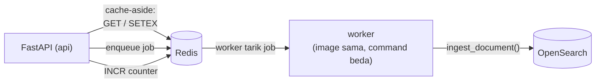
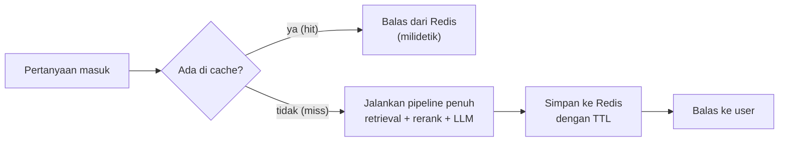
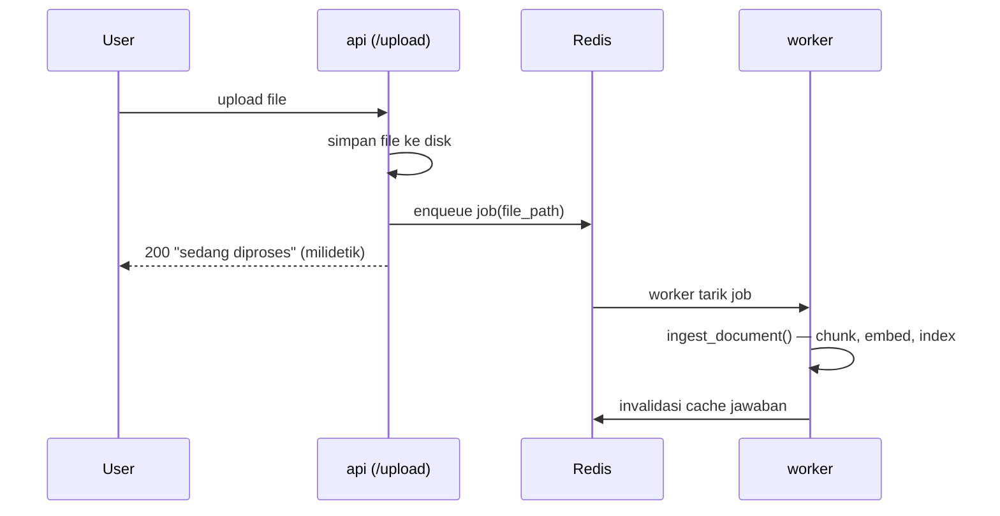

# Module 28: Redis — Cache, Job Queue, dan Rate Limiting

## Tujuan

Menambahkan **satu** service Redis yang melayani **tiga** kebutuhan berbeda sekaligus: cache jawaban (supaya pertanyaan berulang tidak memanggil LLM lagi), job queue (supaya `/upload` tidak lagi memblokir user selama embedding berjalan), dan rate limiting (menutup celah yang sejak Module 1-27 dibiarkan terbuka). Ketiganya memakai instance Redis yang sama — satu container, tiga pola pemakaian.

## Definisi

**Redis** adalah *in-memory key-value store* — database yang menyimpan data di RAM, bukan di disk, sehingga baca/tulisnya berorde mikrodetik. Karena datanya di memori, Redis tidak cocok jadi penyimpan utama (data bisa hilang saat restart, kecuali dikonfigurasi persistence), tapi sangat cocok untuk data yang **boleh hilang** atau **bisa dihitung ulang** — persis tiga kasus di module ini.

Tiga pola yang dipakai, masing-masing memanfaatkan sifat Redis yang berbeda:

- **Cache** memakai pola *cache-aside*: sebelum mengerjakan sesuatu yang mahal, cek dulu apakah hasilnya sudah ada; kalau ada pakai itu, kalau belum kerjakan lalu simpan. Yang dimanfaatkan: kecepatan baca dan **TTL** (*time to live*) — kemampuan menyuruh Redis menghapus sendiri sebuah key setelah sekian detik.
- **Job queue** memakai pola *producer-consumer*: `/upload` cuma menitipkan pekerjaan ke antrian lalu langsung membalas, sementara proses **worker** terpisah yang benar-benar mengerjakannya. Yang dimanfaatkan: Redis sebagai antrian yang bisa dibaca proses lain.
- **Rate limiting** memakai pola *counter dengan TTL*: tiap request menaikkan penghitung milik satu pemakai, penghitungnya hangus sendiri setelah jendela waktu lewat. Yang dimanfaatkan: operasi `INCR` yang **atomik** — dua request bersamaan tidak mungkin menghasilkan hitungan yang meleset.



## Hasil Akhir yang Diharapkan

- Service `redis` berjalan di Docker Compose dan dipakai oleh tiga jalur berbeda di `app/` — bukan tiga service terpisah
- `app/cache.py` menyimpan jawaban `/chat` dengan key yang menyertakan **`role`** — pertanyaan sama dari role berbeda **tidak** saling memakai cache (ini soal keamanan, bukan optimasi; lihat Langkah 3)
- Cache di-*invalidate* otomatis tiap kali dokumen baru selesai di-ingest — jawaban basi tidak bertahan sampai TTL habis
- `/upload` membalas dalam hitungan milidetik dengan `job_id`, proses embedding pindah ke service `worker` — menutup masalah "user menunggu lama, bisa timeout" yang dicatat Module 17 Bagian 2
- `app/rate_limit.py` membatasi request per-IP per-jendela-waktu di `/chat`, `/chat/stream`, `/upload`, dan `/data-operasional` — untuk endpoint tulis `/data-operasional` ini rate limit adalah **defense-in-depth** (sejak Module 27 Tahap 0 semua halaman sudah wajib login; yang belum ada di endpoint tulis ini cuma **pembatasan role** — semua user yang login masih bisa menulis)
- Keterbatasan tiap pola dicatat jujur: cache bisa basi, fixed-window rate limit bisa ditembus di batas jendela, per-IP lemah di belakang NAT/proxy

**Prasyarat**: Module 27 (RBAC & Audit Logging) sudah selesai — `/chat` sudah menerima `role`/`user_id`, dan `audit_log` sudah mencatat tiap pemanggilan tool. Redis menambah satu container kecil (~50-100MB) plus satu container `worker` yang memakai **image yang sama** dengan `api` — beban RAM tambahannya jauh lebih ringan dibanding Langfuse atau OpenSearch.

## 1. Kenapa Redis, dan Kenapa Satu Service untuk Tiga Kebutuhan

Tiga masalah yang sampai titik ini dibiarkan terbuka, masing-masing dengan alasannya sendiri:

| Masalah | Sejak kapan diketahui | Status sebelum module ini |
|---|---|---|
| `/upload` memblokir user selama embedding | Module 17 Bagian 2 mencatatnya sebagai alasan Airflow dibutuhkan | Dibiarkan — Airflow menjawab kasus batch, bukan kasus "satu dokumen baru diupload" |
| Pertanyaan identik memanggil LLM ulang dari nol | Module 20 mengukur ~39 detik per request dengan reranking | Dibiarkan — belum ada mekanisme menyimpan hasil |
| Tidak ada rate limiting di endpoint manapun | Module 23 menambahkan endpoint tulis `/data-operasional` (kini wajib login sejak Module 27, tapi tanpa pembatasan kuota) | Dibiarkan — sebelum ada Redis, tidak ada tempat menyimpan hitungan request yang dipakai bersama lintas worker |

Ketiganya bisa diselesaikan dengan tiga teknologi berbeda (in-memory dict untuk cache, Celery/RabbitMQ untuk queue, nginx untuk rate limit). Module ini sengaja memakai **satu** Redis untuk ketiganya — bukan karena Redis paling optimal untuk masing-masing, tapi karena:

1. **Satu container, bukan tiga.** Stack NALA sudah berat (delapan service sebelum module ini). Menambah satu service ringan yang menjawab tiga kebutuhan jauh lebih realistis untuk laptop 16GB dibanding tiga service khusus.
2. **Satu model mental.** Ketiganya sebenarnya pola yang sama: simpan sesuatu di memori, beri batas waktu, baca dari proses lain. Mempelajari satu tool untuk tiga kasus membuat polanya kelihatan, bukan terhafal terpisah.
3. **Ini memang praktik umum.** Di banyak sistem produksi nyata, satu Redis memang melayani cache + queue + rate limit + session sekaligus.

⚠️ **Kejujuran soal skala training**: untuk satu peserta dengan satu instance `api`, cache in-memory Python biasa (`functools.lru_cache`) sudah memberi manfaat kecepatan yang hampir sama, tanpa container tambahan. Redis baru benar-benar **diperlukan** kalau ada lebih dari satu instance `api` (cache harus dibagi), cache harus bertahan setelah restart, atau — seperti kasus job queue di Tahap B — pekerjaannya memang harus dijalankan proses lain. Module ini memakai Redis karena alasan ketiga itu nyata, dan dua lainnya ikut menumpang.

## 2. Tiga Pola Pemakaian Redis

### a. Cache-aside



Yang membuat pola ini benar atau salah bukan mekanismenya — itu sepele — tapi **apa yang masuk ke dalam key**. Dua hal yang gampang terlewat dan keduanya dibahas di Langkah 3: `role` (kalau tidak ikut, jawaban milik `supervisor` bisa terbaca `staff_umum`) dan parameter retrieval (`search_method`, `use_reranking` — pertanyaan sama dengan setelan berbeda menghasilkan jawaban berbeda).

### b. Producer-consumer (job queue)



Bedanya dengan Airflow (Module 17): Airflow dipicu **jadwal/manual** untuk memproses **seluruh folder**; job queue dipicu **event** (satu file diupload) untuk memproses **satu dokumen**. Keduanya menjalankan fungsi yang sama (`ingest_document()`/`ingest_documents()`) dan bisa hidup berdampingan — bukan saling menggantikan.

### c. Counter dengan TTL (rate limiting)

Tiap request menaikkan satu penghitung yang kuncinya memuat identitas pemakai dan nomor jendela waktu. Penghitung itu diberi umur sepanjang jendela, lalu hangus sendiri. Kalau nilainya melewati batas, request ditolak `429`.

Kenapa Redis dan bukan variabel Python biasa: operasi `INCR` di Redis bersifat **atomik**. Dua request yang datang bersamaan tetap menghasilkan hitungan `1` lalu `2`, tidak pernah dua-duanya membaca `0` lalu sama-sama menulis `1`. Dengan dict Python di proses yang sama hal itu masih mungkin terjadi, apalagi kalau nanti ada lebih dari satu worker/instance.

## 3. Struktur Kode yang Ditambahkan

Tiga Tahap, delapan Langkah. **Tahap A** menyalakan Redis dan memakainya untuk cache. **Tahap B** menambahkan job queue plus service `worker` baru. **Tahap C** memasang rate limiting.

### Tahap A — Nyalakan Redis dan Cache Jawaban

**Langkah 1 — Tambah service `redis` dan dependency Python**

```yaml
# docker-compose.yml — service baru
  redis:
    image: redis:7-alpine
    container_name: nala-redis
    ports:
      - "6379:6379"
    command: redis-server --maxmemory 256mb --maxmemory-policy allkeys-lru
    healthcheck:
      test: ["CMD", "redis-cli", "ping"]
      interval: 5s
      timeout: 3s
      retries: 5
```

Tambahkan juga `redis` ke `depends_on` service `api` (`condition: service_healthy`, karena redis punya healthcheck), dan pasang dua dependency Python ini. **Catatan (khusus proyek NALA):** karena `requirements.txt` kita berisi `torch` (~230MB) yang lambat/berisiko diunduh ulang di jaringan tidak stabil, `redis`+`rq` ditaruh di **layer `Dockerfile` terpisah** (sama seperti `itsdangerous` di Module 27) supaya layer besar tetap kena cache:

```dockerfile
# Dockerfile — setelah RUN pip install itsdangerous
RUN pip install --no-cache-dir --timeout 120 --retries 10 redis==5.0.8 rq==1.16.2
```

> Kalau jaringanmu stabil, menambah `redis==5.0.8` dan `rq==1.16.2` langsung ke `requirements.txt` juga sah — hasil akhirnya sama, cuma berisiko memicu unduh ulang `torch` saat rebuild.

- **`redis:7-alpine`** — varian Alpine dipilih karena image-nya kecil (~40MB) dan Redis tidak butuh apa pun dari OS selain dirinya sendiri.
- **`--maxmemory 256mb`** — batas tegas supaya Redis tidak ikut menghabiskan RAM yang sudah diperebutkan Ollama, OpenSearch, dan reranker. Tanpa batas ini, Redis akan terus tumbuh sampai OS yang memaksa berhenti.
- **`--maxmemory-policy allkeys-lru`** — begitu batas tercapai, Redis membuang key yang paling lama tidak dipakai. Ini **aman untuk cache** (data bisa dihitung ulang) tapi perlu disadari konsekuensinya untuk job queue: job bisa ikut terbuang kalau memori penuh. Di skala training ini tidak akan terjadi; di produksi, queue biasanya dipisah ke instance Redis sendiri dengan policy `noeviction`.
- **Port `6379` di-*publish*** supaya bisa diinspeksi lewat `redis-cli` dari laptop. Untuk produksi ini justru sebaiknya ditutup — Redis tanpa password yang terbuka ke jaringan adalah celah serius (lihat Bagian 4).

**▶️ Jalankan & lihat hasilnya**

```bash
docker compose up -d redis
docker compose exec redis redis-cli ping
```

✅ **Indikator sukses**: balasannya `PONG`. Cek juga batas memorinya benar-benar terpasang:

```bash
docker compose exec redis redis-cli config get maxmemory
```

harus menunjukkan `268435456` (256MB dalam byte), bukan `0`.

<details>
<summary><strong>Pakai Claude Code? Salin prompt berikut, paste untuk eksekusi Langkah 1</strong></summary>

```
Tambah service redis ke docker-compose.yml dan dependency Python
(Module 28, Tahap A, Langkah 1) — belum ada kode aplikasi yang
memakainya.

GOAL:
- Di Nala/docker-compose.yml: tambah service `redis` dengan image
  redis:7-alpine, container_name nala-redis, publish port 6379:6379,
  command `redis-server --maxmemory 256mb --maxmemory-policy
  allkeys-lru`, dan healthcheck `redis-cli ping` (interval 5s,
  timeout 3s, retries 5).
- Tambahkan `redis` ke daftar depends_on service `api`
  (condition: service_healthy).
- Di Nala/Dockerfile: tambah layer terpisah `RUN pip install
  --no-cache-dir --timeout 120 --retries 10 redis==5.0.8 rq==1.16.2`
  setelah layer itsdangerous (JANGAN masukkan ke requirements.txt —
  jaga layer torch tetap cache-hit). rq dipakai Tahap B, ditambahkan
  sekarang supaya image cuma di-rebuild sekali.

CONTEXT:
- docker-compose.yml sudah berisi ollama, opensearch,
  opensearch-dashboards, airflow, postgres, langfuse, langfuse-db,
  api dari Module 1-27 — jangan ubah service-service itu.

GUARDRAIL:
- JANGAN buat volume persistence untuk redis di langkah ini — data
  cache dan queue di module ini memang boleh hilang saat restart.
- JANGAN sentuh app/ di langkah ini — belum ada kode yang memakai
  Redis sampai Langkah 2.
```

</details>

**Langkah 2 — Buat `app/cache.py`**

```python
# app/cache.py
import hashlib
import os

import redis

REDIS_URL = os.environ.get("REDIS_URL", "redis://redis:6379/0")
CACHE_TTL_SECONDS = int(os.environ.get("CACHE_TTL_SECONDS", "3600"))

redis_client = redis.Redis.from_url(REDIS_URL, decode_responses=True)


def _answer_key(question: str, role: str, search_method: str, use_reranking: bool) -> str:
    raw = f"{question}|{role}|{search_method}|{use_reranking}"
    digest = hashlib.sha256(raw.encode()).hexdigest()
    return f"nala:answer:{digest}"


def get_cached_answer(question: str, role: str, search_method: str, use_reranking: bool) -> str | None:
    try:
        return redis_client.get(_answer_key(question, role, search_method, use_reranking))
    except redis.RedisError:
        return None


def set_cached_answer(question: str, role: str, search_method: str, use_reranking: bool, answer: str) -> None:
    try:
        redis_client.setex(
            _answer_key(question, role, search_method, use_reranking),
            CACHE_TTL_SECONDS,
            answer,
        )
    except redis.RedisError:
        pass


def invalidate_answer_cache() -> int:
    """Hapus semua cache jawaban. Dipanggil tiap kali dokumen baru selesai di-ingest."""
    try:
        keys = list(redis_client.scan_iter(match="nala:answer:*", count=100))
        if keys:
            redis_client.delete(*keys)
        return len(keys)
    except redis.RedisError:
        return 0
```

- **`role` masuk ke dalam key** — ini bagian paling penting di seluruh file, dan alasannya keamanan, bukan performa. Sejak Module 27, jawaban untuk pertanyaan yang sama **berbeda** tergantung role: `staff_umum` tidak boleh memicu tool SQL, `staff_finance` boleh. Kalau `role` tidak ikut jadi key, jawaban berisi data operasional yang dihasilkan untuk `supervisor` akan tersaji apa adanya ke `staff_umum` berikutnya yang bertanya hal sama — kebocoran data lewat cache, dan RBAC Module 27 jadi sia-sia tanpa satu baris kode pun yang terlihat salah.
- **`search_method` dan `use_reranking` juga masuk** dengan alasan yang lebih sederhana: pertanyaan sama dengan setelan retrieval berbeda memang menghasilkan jawaban berbeda (Module 18-20). Tanpa keduanya, mengubah setelan di UI tidak akan terasa efeknya karena selalu kena cache lama.
- **SHA-256, bukan pertanyaannya langsung** — key jadi panjang tetap dan bebas karakter aneh (spasi, tanda baca, newline) yang merepotkan saat diinspeksi lewat `redis-cli`.
- **`setex`, bukan `set` + `expire`** — satu operasi, jadi tidak mungkin ada key tanpa TTL kalau prosesnya mati di antara dua perintah.
- **`scan_iter`, bukan `keys()`** — `KEYS` memindai seluruh keyspace sekaligus dan **memblokir** Redis selama itu (Redis single-threaded untuk eksekusi perintah). `SCAN` memecahnya jadi potongan kecil. Di 100 key bedanya tidak terasa; kebiasaan ini yang menyelamatkan saat key-nya ratusan ribu.
- **Semua dibungkus `try/except redis.RedisError`** — cache adalah optimasi, bukan kebutuhan. Kalau Redis mati, NALA harus tetap menjawab (lebih lambat), bukan ikut gagal. `get` mengembalikan `None` (dianggap cache miss), `set` diam saja.

**▶️ Jalankan & lihat hasilnya**

```bash
docker compose up -d --build api
```

```bash
docker compose exec api python -c "
from app.cache import set_cached_answer, get_cached_answer, invalidate_answer_cache

set_cached_answer('tes pertanyaan', 'staff_finance', 'hybrid', True, 'jawaban tes')
print('role sama     :', get_cached_answer('tes pertanyaan', 'staff_finance', 'hybrid', True))
print('role beda     :', get_cached_answer('tes pertanyaan', 'staff_umum', 'hybrid', True))
print('setelan beda  :', get_cached_answer('tes pertanyaan', 'staff_finance', 'bm25', True))
print('dihapus       :', invalidate_answer_cache(), 'key')
"
```

✅ **Indikator sukses**: baris pertama mencetak `jawaban tes`, dua baris berikutnya mencetak `None`, baris terakhir menunjukkan jumlah key yang dihapus. Dua `None` itulah buktinya — pemisahan cache per-role dan per-setelan benar-benar bekerja, bukan cuma niat di komentar kode.

<details>
<summary><strong>Pakai Claude Code? Salin prompt berikut, paste untuk eksekusi Langkah 2</strong></summary>

```
Buat app/cache.py (cache jawaban berbasis Redis) — Module 28,
Tahap A, Langkah 2. Belum disambungkan ke endpoint manapun.

GOAL:
- Buat Nala/app/cache.py berisi:
  - REDIS_URL dari os.environ.get("REDIS_URL",
    "redis://redis:6379/0"), CACHE_TTL_SECONDS dari
    os.environ.get("CACHE_TTL_SECONDS", "3600") di-int().
  - redis_client = redis.Redis.from_url(REDIS_URL,
    decode_responses=True).
  - _answer_key(question, role, search_method, use_reranking):
    gabungkan keempatnya dipisah "|", hash SHA-256, return
    f"nala:answer:{digest}".
  - get_cached_answer(...) -> str | None: redis_client.get(key).
  - set_cached_answer(..., answer): redis_client.setex(key,
    CACHE_TTL_SECONDS, answer).
  - invalidate_answer_cache() -> int: kumpulkan key lewat
    redis_client.scan_iter(match="nala:answer:*", count=100), hapus
    semuanya dengan satu delete(*keys), return jumlahnya.
  - SEMUA fungsi dibungkus try/except redis.RedisError — get return
    None, set diam (pass), invalidate return 0. Cache adalah
    optimasi; Redis mati tidak boleh membuat NALA gagal menjawab.

CONTEXT:
- Service redis sudah ada di docker-compose sejak Langkah 1, dan
  dependency `redis` sudah ada di requirements.txt.
- role WAJIB masuk ke dalam key: sejak Module 27 jawaban berbeda
  per role (staff_umum tidak boleh memicu tool SQL), jadi cache yang
  tidak memisahkan role akan membocorkan data antar role.

GUARDRAIL:
- JANGAN pakai redis_client.keys() — pakai scan_iter, KEYS memblokir
  Redis.
- JANGAN pakai set() lalu expire() terpisah — pakai setex().
- JANGAN sentuh app/main.py di langkah ini — wiring ada di Langkah 3.
```

</details>

**Langkah 3 — Sambungkan cache ke `/chat`**

Cache hit perlu bisa dibedakan dari jawaban hasil pipeline, jadi `ChatResponse` bertambah satu field penanda:

```python
# app/main.py — ChatResponse bertambah satu field
class ChatResponse(BaseModel):
    reply: str
    tool_used: str = "none"
```

> **Penyesuaian NALA:** sejak Module 27, `role` datang dari **sesi login** (`user = get_current_user(http_request)`), **bukan** `request.role`. Jadi key cache pakai `user["role"]`. Selain itu, request multi-turn (punya `history`) **tidak** di-cache.

```python
# app/main.py — di dalam chat(), setelah user = get_current_user(...) & rate limit,
# SEBELUM agent dibangun
from app.cache import get_cached_answer, set_cached_answer

    cacheable = not request.history  # multi-turn tidak di-cache
    if cacheable:
        cached = get_cached_answer(request.message, user["role"], "hybrid", True)
        if cached is not None:
            # Cache hit tetap dicatat audit (pertanyaan tetap terjadi) — keputusan sadar
            log_audit(user_id=user["user_id"], role=user["role"],
                      pertanyaan=request.message, tool_dipanggil="cache", akses_diizinkan=True)
            return ChatResponse(reply=cached, tool_used="cache")

    # ... agent.invoke() seperti biasa, hasilnya masuk ke `reply`, audit tool berjalan ...

    if cacheable:
        set_cached_answer(request.message, user["role"], "hybrid", True, reply)
    return ChatResponse(reply=reply)
```

- **Yang di-cache cuma `/chat` (mode Agent), bukan `/chat/stream`.** Alasannya teknis: `/chat` mengembalikan satu string utuh, gampang disimpan dan dikembalikan. `/chat/stream` mengalirkan token satu per satu — untuk men-cache-nya perlu menampung seluruh teks sambil tetap mengalirkannya, lalu saat cache hit memutar ulang teks tersimpan sebagai stream palsu. Bisa dilakukan, tapi menambah kompleksitas yang tidak sepadan di titik ini; dicatat di Bagian 5 sebagai yang sengaja tidak dikerjakan.
- **`tool_used="cache"`** — untuk sekarang field ini cuma dibaca lewat `curl`; badge visualnya dipasang di Module 29, yang juga mengisi field yang sama dengan `rag`/`sql` saat pipeline benar-benar jalan. Penandanya penting untuk demo: tanpa itu, jawaban instan terlihat seperti pipeline yang ajaib cepat, padahal pipeline-nya tidak jalan sama sekali.
- **Multi-turn tidak ikut di-cache**: kalau `request.history` tidak kosong, jawabannya bergantung pada seluruh riwayat, bukan cuma pertanyaan terakhir — men-cache-nya dengan key berbasis `message` saja akan salah. Pertimbangkan melewati cache untuk request yang punya `history` (satu `if` tambahan), atau masukkan ringkasan riwayat ke dalam key.

**▶️ Jalankan & lihat hasilnya**

```bash
docker compose up -d --build api
```

Karena role dari sesi, login dulu untuk simpan cookie (dan pra-panaskan qwen bila perlu — lihat catatan cold-start Module 27):

```bash
# login sebagai staff_finance
curl -s -c /tmp/sf.txt -X POST http://localhost:8000/login -d 'username=sari.finance&password=nala123'

# request pertama (miss — pipeline penuh) lalu kedua (hit — dari cache)
Q='{"message": "Apa saja syarat pengajuan kredit untuk nasabah perorangan?"}'
time curl -s -b /tmp/sf.txt -X POST http://localhost:8000/chat -H "Content-Type: application/json" -d "$Q" > /dev/null
time curl -s -b /tmp/sf.txt -X POST http://localhost:8000/chat -H "Content-Type: application/json" -d "$Q" > /dev/null

# request ketiga sebagai staff_umum (role beda → cache beda → miss lagi)
curl -s -c /tmp/bu.txt -X POST http://localhost:8000/login -d 'username=budi.umum&password=nala123'
time curl -s -b /tmp/bu.txt -X POST http://localhost:8000/chat -H "Content-Type: application/json" -d "$Q" > /dev/null
```

✅ **Indikator sukses**: request **kedua** (role sama) selesai jauh lebih cepat dari yang pertama — berbeda orde besaran, karena LLM dan reranker tidak dipanggil (`tool_used="cache"`). Request **ketiga** (role berbeda) kembali lama seperti yang pertama — bukti key per-role bekerja (cache `staff_finance` tidak dipakai `staff_umum`).

<details>
<summary><strong>Pakai Claude Code? Salin prompt berikut, paste untuk eksekusi Langkah 3</strong></summary>

```
Sambungkan cache jawaban ke endpoint /chat (Module 28, Tahap A,
Langkah 3).

GOAL:
- Di Nala/app/main.py:
  - Tambah import get_cached_answer, set_cached_answer dari
    app.cache.
  - Di dalam handler chat(), SEBELUM agent dibangun/di-invoke (setelah
    guard login & rate limit): kalau request.history KOSONG, panggil
    get_cached_answer(request.message, user["role"], "hybrid", True) —
    role dari SESI (user = get_current_user), BUKAN request.role. Kalau
    hasilnya bukan None: catat log_audit(tool_dipanggil="cache") lalu
    return ChatResponse(reply=<hasil cache>, tool_used="cache") tanpa
    menjalankan agent.
  - Setelah agent selesai dan `reply` didapat (kalau history kosong):
    panggil set_cached_answer(request.message, user["role"], "hybrid",
    True, reply) sebelum return.

CONTEXT:
- app/cache.py sudah dibuat Langkah 2 dan sudah tahan terhadap Redis
  mati (semua fungsinya dibungkus try/except).
- ChatRequest hanya punya message + history; role/user_id datang dari
  SESI login (get_current_user), bukan body — sejak Module 27.
- /chat/stream SENGAJA tidak di-cache di module ini (streaming butuh
  penanganan berbeda) — jangan sentuh endpoint itu.

GUARDRAIL:
- JANGAN cache request yang punya history tidak kosong — jawabannya
  bergantung riwayat, bukan cuma pesan terakhir. Lewati cache untuk
  kasus itu.
- JANGAN ubah logika RBAC/audit logging Module 27 — cache dicek
  SEBELUM agent, tapi audit tetap harus mencatat request yang kena
  cache kalau memang itu yang diinginkan; kalau ragu, catat sebagai
  keputusan terbuka di materi, jangan diam-diam menghilangkan audit.
- JANGAN sentuh /chat/stream, /upload, /data-operasional.
```

</details>

### Tahap B — Job Queue untuk `/upload`

**Langkah 4 — Buat `app/queue.py` dan `app/jobs.py`**

```python
# app/queue.py
import os

from redis import Redis
from rq import Queue

redis_conn = Redis.from_url(os.environ.get("REDIS_URL", "redis://redis:6379/0"))
ingest_queue = Queue("ingest", connection=redis_conn, default_timeout=1800)
```

```python
# app/jobs.py
from app.cache import invalidate_answer_cache
from app.ingest import ingest_document


def ingest_document_job(file_path: str) -> dict:
    chunks = ingest_document(file_path)
    invalidated = invalidate_answer_cache()
    return {"file": file_path, "chunks": chunks, "cache_invalidated": invalidated}
```

- **`default_timeout=1800`** (30 menit) — embedding dokumen besar di CPU bisa lama. Default RQ cuma 180 detik, yang akan membunuh job di tengah jalan untuk PDF berhalaman banyak.
- **`app/jobs.py` sengaja dipisah dari `app/queue.py`** — worker mengimpor fungsi job-nya lewat path string (`app.jobs.ingest_document_job`), jadi modulnya harus bisa diimpor tanpa ikut menarik seluruh `main.py` (yang akan menyalakan FastAPI dan reranker di proses worker — mubazir).
- **Invalidasi cache ada di dalam job, bukan di `/upload`** — ini penting. Cache baru boleh dibuang **setelah** dokumen benar-benar ter-index, bukan saat file baru tersimpan. Kalau dibalik, ada jendela waktu di mana cache sudah kosong tapi dokumen belum ter-index: pertanyaan yang masuk di jendela itu akan dijalankan ulang penuh dan hasilnya (yang belum memuat dokumen baru) tersimpan lagi sebagai cache "segar".

**Langkah 5 — Tambah service `worker`**

```yaml
# docker-compose.yml — service baru
  worker:
    build: .
    container_name: nala-worker
    command: rq worker ingest --url redis://redis:6379/0
    environment:
      OLLAMA_BASE_URL: http://ollama:11434
      OPENSEARCH_BASE_URL: http://opensearch:9200
      KNOWLEDGE_BASE_PATH: /app/knowledge-base
      REDIS_URL: redis://redis:6379/0
    volumes:
      - ./knowledge-base:/app/knowledge-base
    depends_on:
      redis:
        condition: service_healthy
      opensearch:
        condition: service_healthy
      ollama:
        condition: service_started
```

- **`build: .` — image yang sama persis dengan `api`.** Yang membedakan cuma `command`-nya. Ini pola umum dan hemat: tidak ada Dockerfile kedua yang harus dijaga tetap sinkron, dan `docker compose build` cukup sekali.
- **Volume `knowledge-base` wajib ikut di-mount** — worker membaca file yang disimpan `api`. Kalau volume-nya beda, worker akan melempar `FileNotFoundError` untuk file yang jelas-jelas baru diupload; ini kesalahan yang mudah terjadi dan membingungkan.
- **Env var-nya disalin dari `api`**, bukan diwarisi otomatis — Compose tidak mewariskan environment antar service walau image-nya sama.

**▶️ Jalankan & lihat hasilnya**

```bash
docker compose up -d --build worker
docker compose logs -f worker
```

✅ **Indikator sukses**: log menunjukkan RQ worker menyala dan mendengarkan queue `ingest` (barisnya memuat kata `Listening on ingest`). Biarkan jendela log ini terbuka — akan dipakai di Langkah 6 untuk melihat job masuk secara langsung.

<details>
<summary><strong>Pakai Claude Code? Salin prompt berikut, paste untuk eksekusi Langkah 4-5</strong></summary>

```
Buat job queue RQ dan service worker (Module 28, Tahap B, Langkah
4-5). Endpoint /upload BELUM diubah di langkah ini.

GOAL:
- Buat Nala/app/queue.py: redis_conn = Redis.from_url(os.environ.get(
  "REDIS_URL", "redis://redis:6379/0")); ingest_queue = Queue(
  "ingest", connection=redis_conn, default_timeout=1800).
- Buat Nala/app/jobs.py: fungsi ingest_document_job(file_path: str)
  -> dict yang memanggil ingest_document(file_path) dari app.ingest,
  lalu invalidate_answer_cache() dari app.cache, return dict berisi
  file, chunks, cache_invalidated.
- Di Nala/docker-compose.yml: tambah service `worker` dengan
  build: . (image sama dengan api), container_name nala-worker,
  command `rq worker ingest --url redis://redis:6379/0`, environment
  OLLAMA_BASE_URL/OPENSEARCH_BASE_URL/KNOWLEDGE_BASE_PATH/REDIS_URL
  (salin nilainya dari service api), volume
  ./knowledge-base:/app/knowledge-base, dan depends_on redis
  (service_healthy), opensearch (service_healthy), ollama
  (service_started).

CONTEXT:
- ingest_document() sudah ada di app/ingest.py sejak Module 14 dan
  di-upgrade jadi level-chunk di Module 15 — mengembalikan jumlah
  chunk.
- app/cache.py sudah ada dari Langkah 2.
- rq sudah ada di requirements.txt sejak Langkah 1.

GUARDRAIL:
- JANGAN impor app.main di app/jobs.py — worker tidak boleh ikut
  menyalakan FastAPI atau memuat reranker.
- JANGAN letakkan invalidate_answer_cache() di /upload — harus di
  dalam job, setelah ingest selesai.
- JANGAN buat Dockerfile kedua untuk worker — pakai image yang sama
  dengan api.
```

</details>

**Langkah 6 — Ubah `/upload` jadi enqueue**

```python
# app/main.py — di dalam upload_document(), menggantikan pemanggilan ingest_document() langsung
from app.queue import ingest_queue

    job = ingest_queue.enqueue("app.jobs.ingest_document_job", dest_path)
    message = (
        f"Dokumen '{file.filename}' berhasil diunggah dan sedang diproses di background "
        f"(job {job.id}). Daftar dokumen akan memuat chunk-nya begitu proses selesai."
    )
```

Perubahan perilakunya nyata dan perlu disampaikan ke peserta: `/upload` **tidak lagi tahu** berapa chunk yang dihasilkan, karena saat ia membalas, pekerjaannya memang belum dikerjakan. Pesan konfirmasi yang dulu menyebut jumlah chunk (Module 16) sekarang tidak bisa lagi — itu konsekuensi wajar dari memindahkan kerja ke background, bukan kemunduran.

**▶️ Jalankan & lihat hasilnya**

```bash
docker compose up -d --build api
```

```bash
echo "Kantor cabang NALA di Surabaya buka Senin sampai Jumat, pukul 08.00 sampai 16.00 WIB." > catatan-cabang-surabaya.md

time curl -s -X POST http://localhost:8000/upload -F "file=@catatan-cabang-surabaya.md" > /dev/null
```

✅ **Indikator sukses**: `curl`-nya selesai hampir instan — **bandingkan dengan Module 16**, di mana perintah yang sama menunggu seluruh proses embedding selesai. Lalu lihat jendela log worker dari Langkah 5: job muncul, dikerjakan, dan selesai di sana. Terakhir, buktikan dokumennya benar-benar masuk:

```bash
curl -s "http://localhost:9200/nala-docs/_count"
```

Angkanya bertambah — meski `/upload` sudah membalas jauh sebelum itu terjadi.

<details>
<summary><strong>Pakai Claude Code? Salin prompt berikut, paste untuk eksekusi Langkah 6</strong></summary>

```
Ubah /upload dari pemrosesan sinkron jadi enqueue job (Module 28,
Tahap B, Langkah 6).

GOAL:
- Di Nala/app/main.py, handler upload_document():
  - Tambah import ingest_queue dari app.queue.
  - Ganti pemanggilan langsung ingest_document(dest_path) (beserta
    blok try/except httpx.HTTPError di sekitarnya yang menghitung
    chunk) menjadi: job = ingest_queue.enqueue(
    "app.jobs.ingest_document_job", dest_path).
  - Ubah pesan konfirmasi jadi menyebut bahwa dokumen sedang
    diproses di background beserta job.id — JANGAN lagi menyebut
    jumlah chunk, karena saat membalas prosesnya memang belum jalan.
  - Bagian penyimpanan file ke KNOWLEDGE_BASE_PATH dan render ulang
    upload.html dengan list dokumen TIDAK berubah.

CONTEXT:
- app/queue.py (ingest_queue) dan app/jobs.py
  (ingest_document_job) sudah dibuat di Langkah 4.
- Service worker sudah jalan sejak Langkah 5 dan mendengarkan queue
  "ingest".
- Fungsi job dirujuk lewat string path "app.jobs.ingest_document_job"
  supaya app/main.py tidak perlu mengimpor app/jobs.py.

GUARDRAIL:
- JANGAN hapus penyimpanan file ke disk — worker membaca file dari
  path itu.
- JANGAN panggil ingest_document() langsung lagi di main.py.
- JANGAN sentuh endpoint /chat, /chat/stream, /data-operasional.
```

</details>

### Tahap C — Rate Limiting

**Langkah 7 — Buat `app/rate_limit.py`**

```python
# app/rate_limit.py
import os
import time

from fastapi import HTTPException, Request

from app.cache import redis_client

RATE_LIMIT_MAX = int(os.environ.get("RATE_LIMIT_MAX", "20"))
RATE_LIMIT_WINDOW = int(os.environ.get("RATE_LIMIT_WINDOW", "60"))


def check_rate_limit(request: Request, bucket: str, max_requests: int | None = None) -> None:
    limit = max_requests if max_requests is not None else RATE_LIMIT_MAX
    client_ip = request.client.host if request.client else "unknown"
    window = int(time.time()) // RATE_LIMIT_WINDOW
    key = f"nala:ratelimit:{bucket}:{client_ip}:{window}"

    try:
        count = redis_client.incr(key)
        if count == 1:
            redis_client.expire(key, RATE_LIMIT_WINDOW)
    except Exception:
        return  # Redis mati -> jangan kunci pintu, catat sebagai keputusan sadar

    if count > limit:
        raise HTTPException(
            status_code=429,
            detail=f"Terlalu banyak request. Coba lagi dalam {RATE_LIMIT_WINDOW} detik.",
        )
```

- **Nomor jendela dari `int(time.time()) // RATE_LIMIT_WINDOW`** — semua request dalam 60 detik yang sama menghasilkan angka yang sama, jadi berbagi satu counter. Begitu menit berganti, key-nya berubah dan hitungan mulai dari nol.
- **`expire` cuma dipasang saat `count == 1`** — kalau dipasang tiap request, umur key terus diperpanjang dan jendelanya tidak pernah benar-benar berakhir untuk pemakai yang aktif terus.
- **`INCR` atomik** — inilah alasan pola ini dipakai Redis dan bukan variabel Python. Dua request bersamaan tidak mungkin sama-sama membaca `0`.
- **Redis mati → request diloloskan, bukan ditolak.** Ini **keputusan sadar** yang harus disampaikan ke peserta, karena arah sebaliknya juga masuk akal. Melolosnya berarti: kalau Redis tumbang, NALA tetap melayani tapi tanpa perlindungan (*fail-open*). Menolaknya berarti Redis jadi titik kegagalan tunggal yang bisa mematikan seluruh layanan (*fail-closed*). Untuk sistem internal seperti NALA, fail-open lebih masuk akal; untuk endpoint yang melindungi sesuatu yang berbahaya, fail-closed lebih tepat. Perhatikan ini **berlawanan** dengan pilihan RBAC Module 27, yang sengaja fail-safe ke `staff_umum` — dan memang seharusnya begitu: yang satu melindungi kapasitas, yang satu melindungi data.

**Langkah 8 — Pasang ke endpoint**

Di kode NALA, handler ini sudah punya parameter `Request` dan guard login (Module 27). Urutannya: **cek login → cek rate limit → (cache) → proses.**

```python
# app/main.py
from app.rate_limit import check_rate_limit

@app.post("/chat", response_model=ChatResponse)
def chat(http_request: Request, request: ChatRequest) -> ChatResponse:
    if not get_current_user(http_request):        # login (Module 27)
        raise HTTPException(status_code=401, detail="Belum login")
    check_rate_limit(http_request, bucket="chat")  # Module 28
    ...  # lalu cache-aside + agent

@app.post("/chat/stream")
def chat_stream(http_request: Request, request: ChatStreamRequest) -> StreamingResponse:
    if not get_current_user(http_request):
        raise HTTPException(status_code=401, detail="Belum login")
    check_rate_limit(http_request, bucket="chat")
    ...

@app.post("/upload", response_class=HTMLResponse)
def upload_document(request: Request, file: UploadFile = File(...)):
    if not get_current_user(request):
        return RedirectResponse("/login", status_code=303)
    check_rate_limit(request, bucket="upload", max_requests=5)
    ...
```

Dan endpoint tulis `/data-operasional` (Module 23) — kini sudah wajib login (Module 27 Tahap 0), tapi belum ada pembatasan role maupun kuota; rate limit menambah lapisan pelindung:

```python
# app/main.py — kedua endpoint POST /data-operasional
    check_rate_limit(request, bucket="data-operasional", max_requests=10)
```

- **`bucket` memisahkan kuota per jenis endpoint** — membanjiri `/upload` tidak ikut menghabiskan jatah `/chat` milik orang yang sama. Batas `/upload` sengaja lebih kecil (5) karena satu request memicu pekerjaan yang jauh lebih berat.
- **`/data-operasional` sudah wajib login (Module 27), tapi belum ada pembatasan role** — rate limiting **bukan** pengganti itu. Urutannya sudah benar (autentikasi dulu di Module 27, rate limit sekarang), tapi yang masih kurang: setiap user yang login — termasuk `staff_umum` — masih bisa menulis data operasional (mestinya hanya `staff_finance`/`supervisor`). Rate limit hanya memperlambat penyalahgunaan (10/menit), tidak membatasi *siapa* yang boleh menulis. Status jujurnya: **login ✅, kuota ✅, pembatasan role ❌ (belum)**.

**▶️ Jalankan & lihat hasilnya**

```bash
docker compose up -d --build api
```

```bash
# login dulu (rate limit dicek SETELAH guard login), simpan cookie
curl -s -c /tmp/bu.txt -X POST http://localhost:8000/login -d 'username=budi.umum&password=nala123'

for i in $(seq 1 25); do
  printf "%s " "$(curl -s -o /dev/null -w '%{http_code}' -b /tmp/bu.txt -X POST http://localhost:8000/chat \
    -H 'Content-Type: application/json' \
    -d '{"message": "halo"}')"
done; echo
```

✅ **Indikator sukses**: deretan `200` untuk 20 request pertama, lalu berubah jadi `429` di sisanya. Tunggu 60 detik, jalankan ulang — kembali `200`, bukti jendela waktunya benar-benar hangus. Cek juga counter-nya ada di Redis:

```bash
docker compose exec redis redis-cli --scan --pattern "nala:ratelimit:*"
```

<details>
<summary><strong>Pakai Claude Code? Salin prompt berikut, paste untuk eksekusi Langkah 7-8</strong></summary>

```
Buat rate limiting berbasis Redis dan pasang ke endpoint (Module 28,
Tahap C, Langkah 7-8).

GOAL:
- Buat Nala/app/rate_limit.py:
  - RATE_LIMIT_MAX (default 20) dan RATE_LIMIT_WINDOW (default 60)
    dari environment, di-int().
  - check_rate_limit(request: Request, bucket: str, max_requests:
    int | None = None) -> None: ambil client_ip dari request.client
    (fallback "unknown"); hitung window = int(time.time()) //
    RATE_LIMIT_WINDOW; key = f"nala:ratelimit:{bucket}:{client_ip}:
    {window}"; count = redis_client.incr(key); kalau count == 1
    panggil redis_client.expire(key, RATE_LIMIT_WINDOW); kalau count
    melebihi limit, raise HTTPException(429) dengan pesan berbahasa
    Indonesia. Bungkus operasi Redis dengan try/except yang
    me-return (fail-open) kalau Redis tidak terjangkau.
  - Impor redis_client dari app.cache, jangan bikin koneksi baru.
- Di Nala/app/main.py: panggil check_rate_limit di awal handler
  /chat (bucket "chat"), /chat/stream (bucket "chat"), /upload
  (bucket "upload", max_requests=5), dan KEDUA endpoint POST
  /data-operasional (bucket "data-operasional", max_requests=10).
  Untuk endpoint yang belum punya parameter Request, tambahkan
  (mis. http_request: Request) tanpa mengubah field body-nya.

CONTEXT:
- redis_client sudah ada di app/cache.py sejak Langkah 2.
- /data-operasional (Module 23) adalah endpoint TULIS; sudah wajib
  login sejak Module 27 tapi belum dibatasi per role, jadi rate
  limit-nya dibuat paling ketat (defense-in-depth).

GUARDRAIL:
- JANGAN pasang expire() di setiap request — hanya saat count == 1,
  supaya jendela waktunya tidak terus diperpanjang.
- JANGAN ubah signature body request (ChatRequest/ChatStreamRequest)
  — cuma tambah parameter Request milik FastAPI.
- JANGAN membuat rate limiting fail-closed (menolak saat Redis mati)
  tanpa menuliskannya sebagai keputusan sadar — default module ini
  fail-open.
```

</details>

## 4. Trade-off dan Kejujuran

**Cache bisa menyajikan jawaban basi.** TTL satu jam adalah jaring pengaman, bukan mekanisme utama — yang sesungguhnya menjaga kesegaran adalah invalidasi saat ingest (Langkah 4). Tapi itu cuma menangkap perubahan yang lewat `/upload`. Dokumen yang masuk lewat Airflow (Module 17) atau yang di-ingest manual dari terminal **tidak** memicu invalidasi, jadi cache bisa memuat jawaban lama sampai TTL-nya habis. Menutup ini berarti memanggil `invalidate_answer_cache()` dari DAG Airflow juga — di luar cakupan module ini, tapi layak dicatat.

**Fixed-window rate limit bisa ditembus di batas jendela.** Dengan batas 20 per 60 detik, seseorang bisa mengirim 20 request di detik ke-59 dan 20 lagi di detik ke-61 — 40 request dalam dua detik, semuanya lolos, karena nomor jendelanya berbeda. Solusi yang lebih rapat (*sliding window log*, *token bucket*) lebih kompleks dan tidak dikerjakan di sini. Untuk tujuan module ini — mencegah satu skrip membanjiri Ollama — fixed window sudah memadai.

**Rate limiting ini sengaja fail-open, dan itu konsekuensi operasional yang perlu disadari.** Kalau `redis` mati, `check_rate_limit()` menelan error dan request tetap diloloskan — NALA tetap melayani, tapi pembatasnya diam-diam hilang. Pilihan ini diambil supaya matinya satu service pendukung tidak ikut mematikan fungsi utama. Konsekuensinya: Redis yang tumbang bukan cuma soal performa (cache kosong, antrian berhenti), tapi juga menurunkan postur keamanan tanpa ada yang terlihat gagal dari sisi user. Kebalikannya — *fail-safe*, menolak request saat Redis mati — adalah pilihan yang sama sahnya untuk sistem yang lebih ketat; yang tidak boleh adalah memilih salah satunya tanpa sadar.

**Per-IP itu proksi yang lemah untuk identitas.** Semua peserta di satu jaringan kantor bisa terlihat sebagai satu IP (NAT) dan berbagi kuota; sebaliknya, satu orang dengan koneksi berpindah bisa mendapat kuota berkali-kali. Begitu ada autentikasi sungguhan, kuncinya sebaiknya `user_id`, bukan IP.

**Redis di module ini tanpa password dan port-nya terbuka.** Ini disengaja supaya bisa diinspeksi lewat `redis-cli` saat belajar. Untuk produksi: hapus `ports:` (cukup diakses lewat jaringan internal Compose) dan pasang `--requirepass`. Redis terbuka tanpa password adalah salah satu celah yang paling sering dieksploitasi di internet.

**Satu Redis untuk tiga guna punya konsekuensi.** Policy `allkeys-lru` yang aman untuk cache berarti job di antrian **juga** bisa terbuang kalau memori penuh. Di skala training ini tidak akan terjadi (256MB jauh lebih dari cukup untuk ratusan key), tapi di produksi, queue biasanya dipisah ke instance Redis sendiri dengan `noeviction`.

## 5. Apa yang TIDAK Ada di Module Ini

- **Cache untuk `/chat/stream`** — perlu menampung teks sambil mengalirkannya lalu memutar ulang saat cache hit; bisa dilakukan, tapi kompleksitasnya tidak sepadan di sini (Langkah 3).
- **Halaman status job** — `/upload` mengembalikan `job.id` tapi tidak ada endpoint untuk menanyakan progresnya. Peserta memantau lewat log worker. Menambah `GET /upload/status/{job_id}` yang memanggil `job.get_status()` adalah perluasan yang wajar.
- **Retry otomatis untuk job yang gagal** — RQ mendukungnya (`Retry(max=3)`), tidak dipasang di sini supaya kegagalan terlihat jelas saat belajar, bukan tersembunyi di balik percobaan ulang.
- **Persistence Redis** — tidak ada volume; restart berarti cache kosong dan antrian hilang. Untuk cache itu tidak masalah; untuk queue produksi, perlu dipertimbangkan.
- **Pembatasan role untuk `/data-operasional`** — endpoint tulis ini sudah wajib login (Module 27 Tahap 0) dan kini kena rate limit, tapi **belum dibatasi per role**: semua user yang login (termasuk `staff_umum`) masih bisa menulis. Idealnya hanya `staff_finance`/`supervisor` — perluasan RBAC yang wajar, di luar cakupan module ini.

## 6. Checkpoint Praktik

Langkah eksekusi lengkap ada di Bagian 3 (Tahap A Langkah 1-3, Tahap B Langkah 4-6, Tahap C Langkah 7-8). Yang perlu dipastikan sebelum lanjut ke Module 29:

- [ ] `docker compose exec redis redis-cli ping` membalas `PONG`, dan `maxmemory` benar-benar terpasang (bukan `0`)
- [ ] Uji `app/cache.py` (Langkah 2) menunjukkan `None` untuk role berbeda dan setelan retrieval berbeda — bukti pemisahan key bekerja
- [ ] Request `/chat` kedua untuk pertanyaan identik selesai **berbeda orde besaran** dari yang pertama, dan request ketiga dengan role berbeda kembali lambat
- [ ] Worker menyala dan log-nya menunjukkan `Listening on ingest`
- [ ] `/upload` membalas hampir instan (bandingkan dengan Module 16), job terlihat dikerjakan di log worker, dan `nala-docs/_count` bertambah **setelah** balasan diterima
- [ ] 25 request beruntun ke `/chat` menghasilkan ~20 `200` lalu `429`, dan kembali `200` setelah 60 detik
- [ ] Dipahami kenapa `role` wajib masuk ke key cache (kebocoran data antar role), dan kenapa rate limit di sini fail-open sementara RBAC Module 27 fail-safe

---

Untuk informasi lebih lanjut, lihat [README utama](../README.md).
