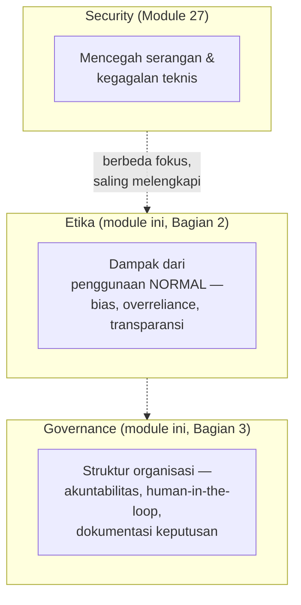
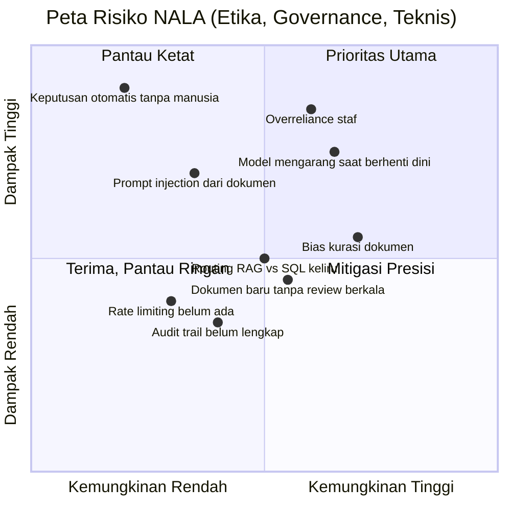

# Module 29: Etika & Governance AI

## Tujuan

Membahas secara konseptual (sesi diskusi, tanpa kode) tiga area yang **belum** disentuh checklist keamanan Module 27: bias dalam jawaban NALA, ketergantungan berlebihan staf pada jawaban AI, dan tata kelola (governance) — siapa bertanggung jawab, kapan manusia wajib turun tangan, bagaimana keputusan didokumentasikan. Tujuannya supaya kita paham **"aman secara teknis" (Module 27) tidak otomatis berarti "bertanggung jawab secara etis dan tata kelola"** — dan tahu pertanyaan apa yang harus terus diajukan setelah training ini selesai, bukan cuma sekali saat demo capstone.

## Definisi

**Etika AI** adalah prinsip tentang bagaimana sistem AI seharusnya berperilaku secara bertanggung jawab — adil, transparan, tidak merugikan penggunanya — dan ini berbeda dari **security** (Module 27): security mencegah **serangan atau kegagalan teknis** (kredensial bocor, prompt injection, akses tidak sah), sementara etika membahas dampak yang muncul dari **penggunaan normal, tanpa ada yang menyerang sama sekali** — misalnya NALA menjawab dengan bias karena dokumen sumbernya sendiri tidak lengkap, bukan karena diserang siapa pun.

**Governance AI** (tata kelola AI) adalah struktur, proses, dan kebijakan organisasi untuk mengawasi siklus hidup sistem AI — siapa yang berwenang menyetujui dokumen baru masuk knowledge base, siapa yang bertanggung jawab kalau NALA memberi jawaban yang merugikan, dan kapan keputusan **harus** tetap di tangan manusia, bukan diserahkan ke NALA. Konsep pendukungnya: **human-in-the-loop** — memastikan keputusan berdampak signifikan (misal persetujuan akhir kredit) tetap melibatkan manusia yang bisa meninjau, bukan sepenuhnya otomatis; dan **akuntabilitas** — kejelasan siapa yang bisa dimintai pertanggungjawaban atas satu keputusan atau jawaban yang dihasilkan sistem.

## Hasil Akhir yang Diharapkan

- Kita bisa membedakan security, etika, dan governance sebagai tiga lensa berbeda — bukan tiga nama untuk hal yang sama
- Kita bisa menyebutkan minimal dua sumber bias yang realistis untuk NALA (bukan bias training model, tapi bias dari kurasi dokumen internal)
- Kita paham kenapa "tool-used badge" (Module 28) sebenarnya juga langkah transparansi, bukan cuma polish UX
- Kita bisa menjawab: kapan keputusan NALA **harus** tetap direview manusia sebelum dieksekusi, khusus untuk kasus PT Nusantara Finance
- Kita paham materi ini adalah **prinsip umum**, bukan kepatuhan terhadap regulasi spesifik — dan tahu ke mana harus bertanya kalau butuh kepastian hukum sungguhan

## 1. Kenapa Ini Bukan Duplikat Checklist Keamanan Module 27

Module 27 sudah menjawab "apakah kita cukup hati-hati dari sisi teknis" — secrets tidak bocor, RBAC diterapkan, prompt injection diakui sebagai risiko terbuka. Tapi sebuah sistem bisa **lolos semua checklist keamanan itu** dan tetap bermasalah secara etis atau tata kelola. Contoh konkret: NALA yang secrets-nya aman, RBAC-nya benar, dan tidak pernah diserang siapa pun — tapi kebetulan dokumen SOP yang di-index cuma mencakup skenario nasabah tertentu, sehingga jawabannya konsisten kurang akurat untuk skenario lain. Tidak ada yang "menyerang" sistem ini — masalahnya muncul dari penggunaan normal, sehari-hari.

Tiga pertanyaan yang belum terjawab Module 27:

1. **"Apakah jawaban NALA adil untuk semua jenis nasabah/skenario?"** — pertanyaan etika (Bagian 2), bukan keamanan.
2. **"Siapa yang bertanggung jawab kalau NALA salah, dan siapa yang berwenang mengubah apa yang boleh dijawabnya?"** — pertanyaan governance (Bagian 3).
3. **"Apakah kita boleh mengklaim sistem ini 'sesuai regulasi'?"** — dijawab jujur di Bagian 5: **tidak**, bukan cakupan training ini.

## 2. Etika: Tiga Risiko Nyata pada NALA

### a. Bias dari Kurasi Dokumen, Bukan dari Training Model

Bias yang sering dibahas untuk LLM besar biasanya soal data training model itu sendiri — di luar kendali NALA, karena `llama3.2:3b` dipakai apa adanya (Module 1). Tapi NALA punya sumber bias **yang sepenuhnya dalam kendali tim NALA**: dokumen apa yang masuk `knowledge-base/` (Module 10). Grounding (Module 13 Bagian 4) membuat NALA menjawab **hanya** dari dokumen yang di-index — kalau dokumen itu cuma mencakup satu jenis nasabah, satu jenis produk, atau ditulis dari sudut pandang tertentu, NALA mewariskan keterbatasan itu secara konsisten, walau secara teknis "grounding-nya bekerja dengan benar".

Ini kenapa **siapa yang menyetujui dokumen masuk knowledge base** (Bagian 3) bukan cuma soal proses administratif — itu keputusan yang langsung menentukan siapa yang terlayani dengan baik oleh NALA dan siapa yang tidak.

### b. Overreliance — Ketergantungan Berlebihan pada Jawaban AI

`NALA_SYSTEM_PROMPT` (Module 1) sudah menginstruksikan model untuk jujur mengaku tidak tahu, dan grounding (Module 13 Bagian 4) membuat jawaban terikat ke dokumen — tapi instruksi prompt **membantu, bukan jaminan mutlak** (dicatat eksplisit sejak Module 13 Bagian 4: model kecil tetap bisa sesekali mengabaikan instruksi). Risiko nyatanya bukan di sisi teknis, tapi di sisi kebiasaan staf: kalau NALA terbiasa benar, staf bisa berhenti memverifikasi jawaban sebelum menindaklanjutinya — terutama untuk keputusan yang berdampak langsung ke nasabah (persetujuan kredit, klaim asuransi).

Prinsip yang perlu ditanamkan sejak awal penggunaan: NALA adalah **alat bantu pencarian informasi**, bukan pengambil keputusan akhir. Keputusan yang berdampak signifikan (Bagian 3) tetap harus melalui manusia yang berwenang.

### c. Transparansi: Apakah User Tahu dari Mana Jawaban Itu Berasal?

Module 28 menambahkan badge "tool yang dipakai agent" (RAG vs SQL) — sebelumnya dijelaskan sebagai polish UX, tapi lensa etika melihatnya berbeda: itu adalah **langkah transparansi**. Staf yang tahu jawaban berasal dari dokumen SOP (bisa diverifikasi ke sumbernya) vs dari query data operasional (Module 21-25) vs jawaban generik tanpa konteks (Module 13 Bagian 2, fallback `NALA_SYSTEM_PROMPT_NO_CONTEXT`) — punya dasar berbeda untuk memutuskan seberapa besar mempercayai jawaban itu. Tanpa badge ini, ketiganya terlihat sama-sama "meyakinkan", padahal tingkat keandalannya berbeda jauh.

## 3. Governance: Pertanyaan yang Harus Terus Diajukan Setelah Training

Berbeda dari etika (dampak dari pemakaian sehari-hari), governance adalah soal **struktur organisasi** yang harus ada supaya pertanyaan-pertanyaan di Bagian 2 punya jawaban yang jelas, bukan diserahkan ke insting masing-masing staf:

- **Akuntabilitas**: kalau NALA memberi jawaban yang salah dan staf menindaklanjutinya sehingga merugikan nasabah, siapa yang bertanggung jawab — staf yang menindaklanjuti, tim yang mengelola knowledge base, atau tim yang men-deploy sistem? Governance yang baik menjawab ini **sebelum** insiden terjadi, bukan sesudahnya.
- **Review sebelum dokumen baru masuk**: proses persetujuan yang jelas sebelum SOP baru di-upload (Module 15) atau di-ingest lewat Airflow (Module 16) — siapa yang berwenang menyetujui, dan apakah ada verifikasi bahwa dokumen itu representatif (menghindari bias Bagian 2.a).
- **Kapan manusia wajib turun tangan**: untuk PT Nusantara Finance, keputusan final seperti persetujuan kredit atau pembayaran klaim **tidak boleh** sepenuhnya otomatis dari jawaban NALA — NALA membantu staf **menemukan** informasi (syarat, prosedur, estimasi waktu), tapi keputusan tetap milik staf berwenang. Ini prinsip human-in-the-loop yang disebut di Definisi.
- **Audit trail sebagai alat governance**: RBAC & Audit Logging (Module 25) sebelumnya dibangun sebagai kontrol akses — dari lensa governance, log itu juga bukti untuk investigasi kalau ada keputusan yang dipertanyakan di kemudian hari: siapa bertanya apa, kapan, dan tool apa yang dipakai NALA untuk menjawab.
- **Review berkala, bukan sekali jadi**: dokumen SOP berubah, data operasional berubah, bahkan performa model bisa terasa berbeda seiring waktu. Governance yang sehat menjadwalkan peninjauan ulang berkala — bukan menganggap sistem yang lolos demo capstone berarti selesai selamanya.

## 4. Peta Risiko: Menyatukan Etika, Governance, dan Celah Teknis yang Sudah Ditemukan

Bagian 2-3 membahas risiko etika dan governance satu per satu — tapi keduanya bukan satu-satunya risiko yang sudah ditemukan sepanjang training ini. Beberapa celah **teknis** yang sudah didokumentasikan jujur di module-module sebelumnya (bukan hipotetis, semuanya sudah diuji nyata) sebenarnya juga risiko yang sama pentingnya untuk dilihat bersama, bukan terpisah-pisah per module. Peta di bawah ini menyatukan semuanya dalam satu pandangan: sumbu mendatar **kemungkinan terjadi**, sumbu tegak **dampak kalau terjadi**.

| Risiko | Kategori | Kemungkinan / Dampak | Status mitigasi | Rujukan |
|---|---|---|---|---|
| Overreliance staf pada jawaban AI | Etika | Sedang / **Tinggi** | Sebagian — instruksi grounding membantu, tidak menjamin | Bagian 2.b |
| Model mengarang saat berhenti dini (bukan meminta tool lagi) | Teknis | Sedang-Tinggi / Tinggi | Belum — ditemukan lewat pengujian nyata, belum ada mitigasi | Module 24 Bagian 6.b |
| Bias dari kurasi dokumen yang tidak representatif | Etika | Tinggi / Sedang | Belum — bergantung proses review manusia yang belum diformalkan | Bagian 2.a, Bagian 3 |
| Prompt injection dari isi dokumen | Teknis/Keamanan | Rendah-Sedang / Tinggi | Diakui terbuka, belum dimitigasi | Module 27 Bagian 3.c |
| Routing RAG vs SQL keliru | Teknis | Sedang / Sedang | Sebagian — pengaman `force_answer` ada, tapi pola kegagalan nyata beda dari yang diantisipasi | Module 24 |
| Dokumen baru masuk tanpa proses review berkala | Governance | Sedang / Sedang | Belum diformalkan — baru sebatas rekomendasi | Bagian 3 |
| Rate limiting belum ada | Teknis/Keamanan | Rendah-Sedang / Sedang | Diakui terbuka, belum dimitigasi | Module 27 Bagian 3.d |
| Audit trail belum lengkap (`ringkasan_data_diakses` kosong) | Governance | Sedang / Rendah-Sedang | Sebagian — skema sudah ada, isinya belum lengkap | Module 25 |
| Keputusan berdampak signifikan tereksekusi tanpa manusia | Governance | Rendah (kalau kebijakan ditegakkan) / **Sangat tinggi** | Bergantung penuh pada kebijakan organisasi, bukan kode | Bagian 3 |

Tiga hal yang perlu dibaca dari peta ini, bukan sekadar posisi titik-titiknya:

1. **Risiko yang tampak "kecil kemungkinan" belum tentu boleh diabaikan** — "keputusan otomatis tanpa manusia" ada di ujung kiri (jarang terjadi **kalau** kebijakan ditegakkan), tapi dampaknya paling tinggi dari semua risiko di peta ini. Inilah alasan human-in-the-loop (Bagian 3) ditulis sebagai prinsip wajib, bukan saran opsional — bukan karena sering terjadi, tapi karena akibatnya kalau terjadi tidak sebanding dengan kemungkinannya yang rendah.
2. **Risiko teknis dan risiko etika/governance saling memperkuat, bukan berdiri sendiri** — "model mengarang saat berhenti dini" (temuan teknis Module 21-25) secara langsung memperbesar risiko "overreliance staf" (etika): kalau staf terbiasa percaya NALA dan modelnya sesekali mengarang tanpa tanda apa pun, kombinasi keduanya jauh lebih berbahaya daripada masing-masing sendirian.
3. **"Belum dimitigasi" bukan berarti "tidak boleh dipakai"** — training ini konsisten jujur tentang apa yang **belum** selesai (lihat gaya checklist Module 27 Bagian 3). Peta ini bukan alasan menunda pemakaian NALA, tapi daftar prioritas **apa yang harus dikerjakan lebih dulu** kalau NALA benar-benar mau dipakai staf finance sungguhan, di luar training ini.

## 5. Prinsip Umum, Bukan Kepatuhan Regulasi Spesifik

⚠️ **Penting dipahami dengan jujur**: materi Bagian 2-3 di atas adalah **prinsip umum tata kelola AI** yang berlaku luas di berbagai kerangka kerja internasional (semangatnya sejalan dengan prinsip-prinsip seperti akuntabilitas, transparansi, dan human oversight yang dibahas di banyak kerangka AI governance global) — bukan panduan kepatuhan terhadap regulasi spesifik sektor jasa keuangan di Indonesia atau di negara mana pun. Materi ini **tidak** mengklaim NALA sudah atau akan otomatis patuh terhadap regulasi tertentu.

Organisasi yang sungguhan ingin men-deploy sistem seperti NALA **wajib** berkonsultasi dengan tim legal/compliance internal mereka sendiri untuk memastikan kepatuhan terhadap regulasi yang berlaku — termasuk (tapi tidak terbatas pada) ketentuan sektor jasa keuangan dan perlindungan data pribadi yang relevan di yurisdiksi mereka. Training ini memberi kerangka berpikir (Bagian 2-3) untuk memulai diskusi itu, bukan pengganti nasihat hukum.

## 6. Diskusi Kelompok

Sebelum lanjut ke persiapan capstone, diskusikan dalam kelompok (10-15 menit):

1. Untuk case study capstone kelompok Anda (`../Capstone/case-study-brief.md`), dokumen apa yang **tidak** ada di knowledge base tapi seharusnya ada supaya jawaban NALA lebih representatif?
2. Sebutkan satu skenario konkret di mana staf PT Nusantara Finance bisa terlalu percaya jawaban NALA tanpa verifikasi — apa akibatnya kalau itu terjadi?
3. Siapa, secara realistis di organisasi seperti PT Nusantara Finance, yang seharusnya punya wewenang menyetujui dokumen SOP baru masuk ke NALA?

**Jawaban tidak perlu diserahkan tertulis** — ini sesi diskusi untuk menajamkan perspektif sebelum presentasi capstone, terutama untuk kriteria "pemahaman teknis tentang trade-off" di rubrik penilaian (`../Capstone/rubrik-penilaian.md`).

## 7. Checkpoint Diskusi

- [ ] Kita bisa membedakan security (Module 27), etika (Bagian 2), dan governance (Bagian 3) dengan kata-kata sendiri
- [ ] Kita bisa menyebutkan sumber bias NALA yang berasal dari kurasi dokumen, bukan dari training model
- [ ] Kita paham overreliance sebagai risiko perilaku staf, bukan bug teknis
- [ ] Kita bisa menjelaskan kenapa tool-used badge (Module 28) juga berfungsi sebagai transparansi
- [ ] Kita bisa menyebutkan minimal satu keputusan yang harus tetap di tangan manusia untuk kasus PT Nusantara Finance
- [ ] Kita bisa membaca peta risiko Bagian 4 dan menjelaskan kenapa risiko dengan kemungkinan rendah tapi dampak sangat tinggi (mis. keputusan otomatis tanpa manusia) tetap harus diprioritaskan
- [ ] Kita paham materi ini prinsip umum, bukan kepatuhan regulasi spesifik — dan tahu itu harus dikonsultasikan ke tim legal/compliance sungguhan

## Panduan Praktik

### Prasyarat

- Module 26-28 sudah selesai — stack full-stack sudah jalan dan lolos Uji Coba Menyeluruh (Module 28 materi.md, bagian Panduan Praktik, Langkah 2).

### Langkah 1: Diskusi Etika & Governance

Tidak ada kode atau perintah terminal di langkah ini — Module 29 murni sesi diskusi. Baca Bagian 1-5 di atas (security vs etika vs governance, bias dari kurasi dokumen, overreliance, transparansi, akuntabilitas/human-in-the-loop, peta risiko yang menyatukan temuan etika/governance/teknis dari seluruh training), lalu diskusikan bertiga pertanyaan di Bagian 6 dalam kelompok — jawabannya jadi bahan konkret untuk kriteria "pemahaman teknis tentang trade-off" di rubrik capstone (`../Capstone/rubrik-penilaian.md`). Pastikan poin checkpoint Bagian 7 terpenuhi sebelum lanjut ke persiapan capstone.

### Langkah 2: Persiapan Capstone

Sebelum sesi presentasi, pastikan:

- [ ] Seluruh stack (`docker compose ps`) masih `Up`/`healthy` — restart yang perlu sebelum giliran presentasi tiba.
- [ ] Dokumen dan data untuk studi kasus capstone (`../Capstone/case-study-brief.md`) sudah di-upload/di-ingest.
- [ ] Baca `../Capstone/template-presentasi.md` dan siapkan materi sesuai outline-nya.
- [ ] Baca `../Capstone/rubrik-penilaian.md` supaya tahu persis apa yang dinilai.

### Troubleshooting

- **Capstone: demo gagal di tengah presentasi**: siapkan fallback — screenshot/rekaman singkat dari uji coba sebelumnya, supaya kegagalan teknis di depan penilai tidak menggagalkan seluruh presentasi. Ini bagian wajar dari mendemokan sistem yang benar-benar jalan (bukan mockup), dan cara menghadapinya sendiri adalah bagian dari yang dinilai di rubrik ("presentasi & komunikasi hasil").

## Kesimpulan

Module 27 dan Module 29 adalah dua lensa yang saling melengkapi, bukan saling menggantikan: Module 27 menjawab "apakah sistem ini aman secara teknis", Module 29 menjawab "apakah kita bertanggung jawab menggunakannya". Keduanya penting untuk dibawa ke presentasi capstone — sistem yang lolos checklist keamanan tapi tidak pernah dipikirkan dampak etis dan tata kelolanya bukan sistem yang siap dipakai staf finance sungguhan, walau demonya berjalan mulus. Setelah ini, lanjut ke **Persiapan Capstone** — bawa pertanyaan Bagian 5 ke diskusi kelompok Anda sebagai bahan presentasi.
