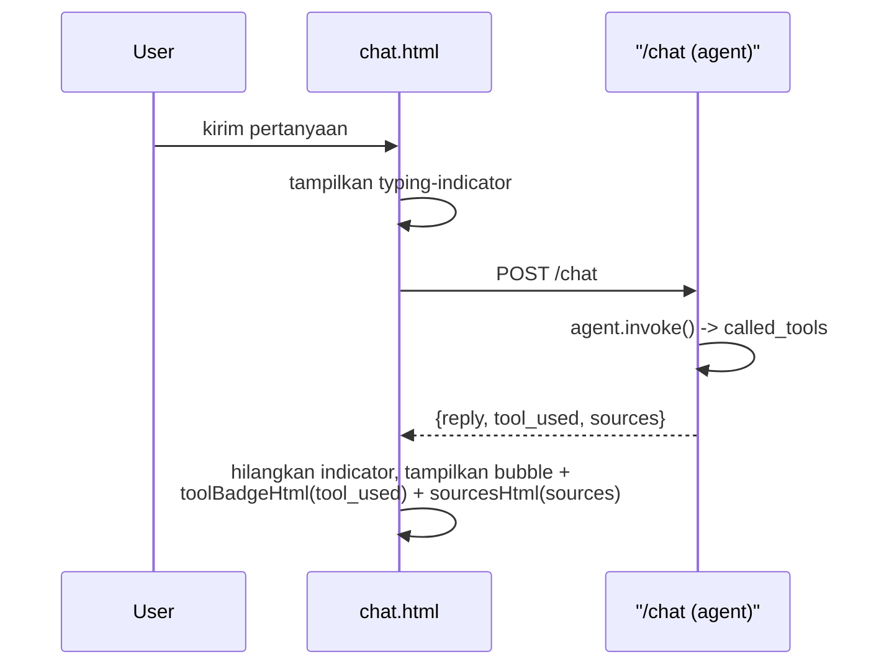

# Module 29: Polish Frontend untuk Demo

## Tujuan

Melakukan polish terakhir pada `chat.html` — loading indicator, badge tool RAG-vs-SQL, tema gelap ala antarmuka chat modern, bubble percakapan, dan lampiran nama dokumen sumber di bawah jawaban — plus cek responsif untuk `chat.html`/`upload.html`/`data_operasional.html`, supaya kemampuan backend yang sudah dibangun Module 7-28 terlihat jelas saat NALA ditunjukkan ke orang lain, tanpa menambah framework baru.

## Definisi

**Polish** di module ini berarti membuat kemampuan yang **sudah ada** di backend terlihat jelas di UI — bukan menambah kemampuan baru (Bagian 1). Sebagian besar langkah di sini murni menyingkap apa yang sudah ada tapi belum terlihat; satu tahap (Tahap C) memang mengubah tampilan dasarnya — palet warna dan bentuk baris percakapan — karena tampilan bawaan Module 7 dibuat sekadar berfungsi, bukan untuk dipandang selama sesi demo.

**Tool-used badge** adalah label visual ("📄 Dokumen SOP" atau "🗄️ Data operasional") yang menunjukkan tool mana yang **benar-benar** dipanggil agent (Module 23-27) untuk satu jawaban — diturunkan langsung dari `called_tools`, dan cuma tool dengan `diizinkan: True` yang dihitung, supaya tool yang ditolak RBAC tidak ikut ditandai seolah datanya benar-benar diambil (Bagian 2 Tahap B). Loading/typing indicator mengisi jeda **sebelum token pertama tiba** — beda dari streaming itu sendiri (sudah ada sejak Module 8), indikator ini cuma menutupi waktu tunggu retrieval + routing di backend supaya layar tidak terasa diam (Bagian 1). Kedua fitur ini tetap menjaga `escapeHtml()` di setiap render teks — mencegah **XSS** (*cross-site scripting*, kode berbahaya yang menyusup lewat teks yang di-render mentah) tetap jadi syarat, bukan sesuatu yang boleh dilonggarkan demi polish (Bagian 4).

**Bubble** adalah satu balon pesan berlatar dan bersudut membulat, dirata-kanan untuk pesan user dan rata-kiri untuk jawaban NALA — menggantikan paragraf polos berawalan `Anda:`/`NALA:` dari Module 7, supaya giliran bicara terbaca dari bentuk, bukan dari label (Tahap C Langkah 6). **Lampiran sumber** adalah daftar nama file dokumen yang benar-benar dibaca agent untuk menyusun satu jawaban — diambil dari `metadata.source` yang sudah disimpan `ingest_document()` sejak Module 14, dialirkan lewat `called_tools` yang sama dengan badge, lalu ditampilkan di bawah teks jawaban (Tahap C Langkah 7). Fungsinya bukan hiasan: tanpa itu, penanya tidak punya cara memverifikasi jawaban selain percaya — dan inilah bentuk paling konkret dari transparansi yang dibahas Module 31 Bagian 2.c.



## Hasil Akhir yang Diharapkan

- Indikator loading (tiga titik animasi) muncul di jeda sebelum token pertama, lalu hilang otomatis begitu jawaban mulai streaming.
- Perbedaan **role** (`staff_umum`/`staff_finance`/`supervisor`) didemokan lewat **login** sebagai akun seeded yang berbeda: `role`/`user_id` diambil dari sesi login (Module 27 Tahap 0: `/login`, `SessionMiddleware`, `get_current_user`), bukan dari input di halaman chat. Badge "Data operasional (SQL)" muncul saat login sebagai `sari.finance` (staff_finance) atau `andi.super` (supervisor) — tanpa dropdown apa pun di `chat.html`.
- Badge "📄 Dokumen SOP" atau "🗄️ Data operasional" tampil di mode Agent (`/chat`, non-streaming) sesuai tool yang benar-benar dipakai — lewat field `tool_used` di response JSON, bukan parsing stream (lihat Bagian 2 Tahap B kenapa).
- Tema gelap terpasang lewat tujuh CSS custom property di `:root`, sehingga seluruh palet punya satu sumber kebenaran dan bisa diganti dari satu tempat.
- Setiap pesan tampil sebagai bubble — user rata kanan, NALA rata kiri — dan jawaban streaming tetap bertambah token demi token **di dalam** bubble yang sama.
- Jawaban mode Agent yang berasal dari dokumen SOP menampilkan blok "Sumber dokumen" berisi nama file yang benar-benar dibaca; jawaban dari SQL tool atau dari cache tidak menampilkannya.
- Halaman chat, upload, dan data operasional tetap terlihat wajar (tidak terpotong/overflow) di lebar layar 375px dan 768px.
- `escapeHtml()` tetap dipertahankan di semua render teks baru, tanpa regresi keamanan XSS dari polish ini.

## 1. Kenapa Polish — dan Satu Tahap yang Memang Redesign

`chat.html` dan `upload.html` sudah berfungsi penuh sejak Module 7 — Module 7 (chat dasar), Module 8 (streaming + multi-turn), Module 16 (upload) sudah membangun fondasinya. Sejak itu, sentuhan ke HTML/CSS cuma berupa **kontrol kecil** yang ditambahkan seperlunya: toggle `use_rag` (Module 14), dua checkbox metode pencarian (Module 18-19), checkbox rerank (Module 20), dan checkbox "Pakai Agent" (Module 25) — masing-masing satu-dua baris, tanpa pernah memikirkan tampilan atau pengalaman pakainya secara menyeluruh. Semua **kemampuan** besarnya (hybrid search, reranking, agent routing RAG-vs-SQL, RBAC) dibangun di belakang layar. Efeknya: NALA sekarang jauh lebih pintar dari yang **terlihat** — dari sisi UI, jawaban agentic Module 23-27 tetap muncul sebagai teks polos yang tidak beda tampilannya dari jawaban RAG polos Module 7-17.

Module ini **bukan** membangun ulang frontend dari nol — ini pass terakhir sebelum NALA ditunjukkan ke orang di luar tim yang membangunnya, dengan lima target konkret:

1. **Tool-used badge** — staf yang mendemokan NALA, dan siapa pun yang menontonnya, bisa melihat sekilas apakah jawaban berasal dari RAG dokumen atau SQL tool (Module 23-27), tanpa harus buka Langfuse. Perbedaan role tidak perlu kontrol baru di `chat.html`: `role`/`user_id` sudah datang dari **sesi login** (Module 27 Tahap 0), jadi badge "Data operasional (SQL)" cukup dipicu dengan login sebagai `sari.finance`/`andi.super` — tidak ada dropdown role yang perlu dibangun (Bagian 2 Tahap B Langkah 3).
2. **Loading/typing indicator** — sejak Module 8, jawaban sudah streaming token-demi-token, tapi jeda **sebelum** token pertama muncul (saat retrieval + agent routing berjalan di backend) masih terasa seperti layar diam.
3. **Tema dan bubble** — ini satu-satunya bagian yang benar-benar mengubah tampilan dasar, dan itu disengaja. Tampilan bawaan Module 7 dibuat sekadar cukup untuk membuktikan endpoint jalan; untuk dipandang selama 15 menit demo di depan penilai, teks polos hitam-putih tanpa pemisah antar-giliran bicara membuat penonton sulit mengikuti percakapan. Batasan "tanpa framework" tetap dipegang — yang berubah cuma CSS dan struktur dua elemen di `chat.html`.
4. **Lampiran dokumen sumber** — menampilkan nama file yang benar-benar dibaca agent untuk menyusun jawaban. Datanya sudah ada sejak Module 14 tapi selama ini dibuang di `rag_search()`; ini melengkapi badge: badge menjawab "dari mana jenis sumbernya", lampiran menjawab "dokumen mana persisnya".
5. **Cek layout responsif** — memastikan tampilan tetap wajar di layar sempit (laptop projector, tablet) saat NALA didemokan. Sengaja ditaruh **setelah** tema dan bubble, supaya yang diverifikasi adalah tampilan final, bukan tampilan yang sudah usang satu tahap.

Kelimanya tetap dalam batasan desain yang sudah dipegang sejak awal: **server-rendered Jinja2 + vanilla CSS/JS, tanpa framework baru, tanpa CDN, tanpa build step** — konsisten dengan keputusan desain di spec training ("frontend sengaja dibuat minimal ... supaya tidak menambah beban kurikulum di luar fokus AI/backend").

⚠️ **Asumsi yang perlu disesuaikan — dan hasil pengecekan nyata**: Module ini awalnya ditulis dengan asumsi endpoint agentic Module 23-27 mengembalikan metadata tool lewat baris JSON pertama di **stream**. Setelah dicek langsung ke implementasi nyata (Module 24 Bagian 4 Tahap C): routing RAG-vs-SQL (Module 23-27) **cuma terjadi di endpoint `/chat`** (mode Agent, non-streaming, dipicu checkbox "Pakai Agent" di `chat.html`) — `/chat/stream` **tetap RAG murni** sejak Module 7-17, sengaja tidak disentuh (keputusan desain eksplisit di Module 24). Jadi pendekatan streaming-metadata di rencana awal **tidak berlaku** untuk arsitektur ini — badge dipasang lewat field JSON biasa di response `/chat`, jauh lebih sederhana daripada parsing baris pertama stream. Kalau implementasi Anda berbeda (metadata tool memang ada di endpoint streaming), sesuaikan pendekatannya — tapi cek dulu endpoint mana yang benar-benar melakukan routing sebelum menulis kode, seperti yang kita lakukan di sini. Catatan ini soal **endpoint mana** yang disentuh; soal **kondisi `chat.html` Anda saat ini** (sudah berisi empat kontrol dari Module 14-25, jadi Module 29 hanya boleh berupa diff, bukan tulis ulang) dibahas di peringatan awal Tahap A Langkah 1.

## 2. Struktur Kode yang Ditambahkan

**Prasyarat sebelum mulai**: Module 28 (Redis: cache, queue, rate limiting) sudah selesai — seluruh stack `Nala/` sudah jalan, termasuk `redis` dan `worker`.

Empat tahap berisi kode (Tahap A-D) di `app/templates/chat.html`, `app/static/style.css`, dan — khusus Tahap C Langkah 7 — `app/tools/rag_tool.py`, `app/agent.py`, `app/main.py`, plus satu tahap verifikasi tanpa kode (Tahap E), dibangun bertahap. Setiap kali salah satu tahap mengubah `app/main.py`, `app/templates/chat.html`, atau `app/static/style.css`, cukup rebuild service `api` saja — bukan seluruh stack (`ollama`, `opensearch`, dsb tidak perlu ikut di-rebuild):

1. **Tahap A — Loading indicator**, murni CSS + sedikit JS, tidak bergantung pada perubahan backend apa pun.
2. **Tahap B — Tool-used badge**, bergantung pada metadata dari endpoint agentic Module 23-27 (lihat asumsi di Bagian 1). Perbedaan role sudah ditangani sesi login (Module 27 Tahap 0), jadi badge SQL cukup dipicu dengan login sebagai `sari.finance`/`andi.super` — tidak ada dropdown role di `chat.html` (Langkah 3 menjelaskan kenapa).
3. **Tahap C — Tema gelap, bubble, dan lampiran sumber**. Dua langkah pertama murni CSS + sedikit JS; langkah ketiga menyentuh backend (`rag_tool.py`, `agent.py`, `main.py`) karena nama dokumen sumber perlu dialirkan dari hasil retrieval sampai ke response.
4. **Tahap D — Cek & perbaiki responsif**, murni CSS.
5. **Tahap E — Dress rehearsal end-to-end**, murni verifikasi manual lewat browser, tidak ada perubahan kode.

### Tahap A — Loading/Typing Indicator

📌 **Catatan penting sebelum mulai**: indikator "sedang mengetik" ini **bukan** fitur baru — sudah ada sejak Module 8 (dulu berupa `.typing` dengan teks tiga titik statis). Yang dikerjakan Module 29 di sini **bukan menambah dari nol, tapi me-restyle/menyelaraskan** indikator lama itu menjadi `.typing-indicator` dengan tiga titik animasi *bounce* supaya cocok dengan tema gelap (Tahap C). Detail teknis di bawah tetap berlaku — anggap sebagai penggantian tampilan indikator yang sudah ada, bukan pembangunan indikator baru.

**Langkah 1 — Tampilkan indikator sebelum token pertama tiba**

`chat.html` sejak Module 8 membuat elemen balasan NALA (`replyEl`) sebelum stream mulai, lalu diisi bertahap; indikator "sedang mengetik" versi lama sudah mengisi jeda antara "elemen dibuat" dan "token pertama muncul" (waktu retrieval + agent routing + mulai generate). Yang dilakukan langkah ini adalah **mengganti** indikator lama itu dengan varian animasi *bounce* untuk tema gelap:

⚠️ **Baca ini sebelum menempel kode**: `chat.html` yang Anda pegang sekarang **bukan** versi Module 8 lagi. Sejak itu ia sudah bertambah empat kontrol — `useRagToggle` (Module 14), fieldset `bm25Toggle`+`vectorToggle` (Module 18-19), `useRerankingToggle` (Module 20), dan checkbox "Pakai Agent" yang mencabangkan request ke `/chat` (Module 25). Langkah ini adalah **diff satu baris** di atas versi itu, bukan penulisan ulang handler. Menempel ulang handler versi Module 8 akan menghapus empat modul fitur sekaligus.

Yang benar-benar berubah cuma isi awal `replyEl`:

```javascript
// app/templates/chat.html — di dalam handler submit, SATU baris yang berubah
const replyEl = document.createElement("p");
replyEl.className = "nala";
// Module 8: sudah ada indikator "sedang mengetik" versi lama (.typing, titik statis).
// Module 29: RESTYLE ke .typing-indicator tiga titik animasi bounce (CSS-nya di Langkah 2).
replyEl.innerHTML = '<b>NALA:</b> <span class="typing-indicator"><span></span><span></span><span></span></span>';
history.appendChild(replyEl);
history.scrollTop = history.scrollHeight;
```

Sisa handler **tidak disentuh sama sekali**. Blok di bawah ini ditampilkan bukan untuk disalin, tapi supaya jelas apa yang **tidak boleh hilang** saat Anda menempel perubahan di atas:

```javascript
// app/templates/chat.html — konteks yang SUDAH ADA, JANGAN diubah/dihapus
const useRag = document.getElementById("useRagToggle").checked;              // Module 14
const bm25On = document.getElementById("bm25Toggle").checked;                // Module 18
const vectorOn = document.getElementById("vectorToggle").checked;            // Module 18
let searchMethod = "hybrid";                                                 // Module 19
if (bm25On && !vectorOn) searchMethod = "bm25";
else if (vectorOn && !bm25On) searchMethod = "vector";
const useReranking = document.getElementById("useRerankingToggle").checked;  // Module 20

if (agentModeCheckbox.checked) {                    // Module 25 — mode Agent, non-streaming
    // ... POST ke /chat dengan { message, history } ...
} else {
    const response = await fetch("/chat/stream", {  // Module 8, jalur RAG murni
        method: "POST",
        headers: { "Content-Type": "application/json" },
        body: JSON.stringify({
            messages: conversation,
            use_rag: useRag,                        // Module 14
            search_method: searchMethod,            // Module 18-19
            use_reranking: useReranking,            // Module 20
        }),
    });
    // ... loop while(true) membaca reader, TIDAK berubah ...
}
```

Perubahan dibanding Module 8: `replyEl` dibuat berisi `<span class="typing-indicator">` (tiga titik animasi CSS *bounce*, lihat Langkah 2) **menggantikan** indikator versi lama. Begitu chunk pertama diterima (`decoder.decode` pertama kali menghasilkan isi), `replyEl.innerHTML` langsung ditimpa dengan `escapeHtml(fullReply)` — otomatis menghapus indikator karena elemen di-render ulang seluruhnya, tanpa perlu flag/variabel penanda tambahan. `escapeHtml()` tetap dipertahankan persis seperti Module 8 — indikator ini **tidak** mengubah cara token ditampilkan setelah mulai muncul, cuma mengisi jeda sebelum token pertama.

Karena `replyEl` dibuat **sebelum** percabangan mode, indikator ini otomatis berlaku untuk **kedua** jalur: mode biasa (`/chat/stream`) maupun mode Agent (`/chat`) — di mode Agent jedanya justru lebih terasa, karena jawaban baru muncul sekaligus setelah seluruh putaran tool-calling selesai.

<details>
<summary><strong>Pakai Claude Code? Salin prompt berikut, paste untuk eksekusi Langkah 1</strong></summary>

```
Tambah elemen typing indicator di replyEl sebelum token pertama
muncul (Module 29, Tahap A, Langkah 1).

GOAL:
Di app/templates/chat.html, ubah SATU baris di handler submit form:
innerHTML awal replyEl diisi '<b>NALA:</b>
<span class="typing-indicator"><span></span><span></span>
<span></span></span>' (bukan kosong seperti Module 8), lalu tetap
ditimpa penuh dengan escapeHtml(fullReply) begitu chunk pertama
diterima dari stream (logika loop while(true) TIDAK berubah, cuma
isi awal replyEl). Ini diff minimal, BUKAN penulisan ulang handler.

CONTEXT:
- File ini versi akhir Module 25 (sudah punya checkbox useRagToggle
  dari Module 14, fieldset bm25Toggle+vectorToggle dari Module 18-19,
  useRerankingToggle dari Module 20, dan checkbox "Pakai Agent" yang
  mencabangkan request ke /chat) — BUKAN versi Module 8.
- CSS untuk class .typing-indicator belum ada — itu Langkah 2,
  dikerjakan terpisah setelah ini.

GUARDRAIL:
- JANGAN tulis ulang handler submit dari awal — cuma ubah isi awal
  replyEl, sisanya biarkan apa adanya.
- JANGAN hapus field use_rag / search_method / use_reranking dari body
  request ke /chat/stream, maupun cabang mode Agent ke /chat.
- JANGAN hapus atau ubah pembacaan useRagToggle, bm25Toggle,
  vectorToggle, useRerankingToggle, dan checkbox "Pakai Agent".
- JANGAN ubah endpoint /chat/stream atau logic fetch/reader — murni
  perubahan tampilan sisi client.
- JANGAN hapus escapeHtml() — WAJIB tetap dipakai di setiap render
  fullReply.
- JANGAN tambah library JS eksternal — CSS + vanilla JS saja.
```

</details>

**Langkah 2 — CSS animasi titik**

```css
/* app/static/style.css — tambahan Module 29 */
.typing-indicator {
    display: inline-flex;
    gap: 4px;
    vertical-align: middle;
}

.typing-indicator span {
    width: 6px;
    height: 6px;
    border-radius: 50%;
    background: #1e3a5f;
    opacity: 0.4;
    animation: typing-bounce 1.2s infinite ease-in-out;
}

.typing-indicator span:nth-child(2) { animation-delay: 0.2s; }
.typing-indicator span:nth-child(3) { animation-delay: 0.4s; }

@keyframes typing-bounce {
    0%, 60%, 100% { opacity: 0.4; transform: translateY(0); }
    30% { opacity: 1; transform: translateY(-3px); }
}
```

<details>
<summary><strong>Pakai Claude Code? Salin prompt berikut, paste untuk eksekusi Langkah 2</strong></summary>

```
Tambah CSS animasi typing indicator (Module 29, Tahap A, Langkah 2).

GOAL:
Di app/static/style.css, tambah class .typing-indicator (3 titik
inline-flex, animasi CSS keyframes bounce dengan delay bertahap per
titik) persis seperti kode di materi.md Bagian 2 Tahap A Langkah 2.

CONTEXT:
- app/templates/chat.html (Langkah 1) sudah merender
  <span class="typing-indicator"><span></span><span></span>
  <span></span></span> — class ini baru berefek visual setelah CSS
  ini ditambahkan.

GUARDRAIL:
- JANGAN ubah HTML/JS di chat.html — itu sudah selesai di Langkah 1.
- JANGAN ubah style CSS lain yang sudah ada — cuma tambah class baru.
```

</details>

**▶️ Jalankan & lihat hasilnya**

```bash
docker compose up --build api
```

Buka `http://localhost:8000`, kirim pertanyaan yang butuh retrieval (misalnya soal SOP kredit) — perhatikan tiga titik animasi muncul **sebelum** teks jawaban mulai mengalir, lalu otomatis hilang begitu token pertama tiba.

✅ **Indikator sukses**: indikator titik muncul di jeda sebelum token pertama, hilang otomatis (bukan manual) begitu ada isi, dan jawaban tetap streaming bertahap seperti Module 8 setelahnya.

**Troubleshooting**

- **Typing indicator tidak hilang otomatis / macet di tiga titik animasi**: cek `replyEl.innerHTML` benar-benar ditimpa penuh begitu chunk pertama diterima dari stream (bukan di-append) — lihat kode Langkah 1 di atas.

### Tahap B — Pemilih Role + Badge Tool yang Dipakai Agent (RAG vs SQL)

**Langkah 3 — Role dari sesi login (bukan dropdown)**

Sebelum badge dibangun, penting memahami dari **mana** `role`/`user_id` datang. Di implementasi NALA saat ini, keduanya **tidak** diketik atau dipilih di halaman chat — mereka datang dari **sesi login** yang sudah dibangun di **Module 27 Tahap 0**: endpoint `/login` + `SessionMiddleware` menandatangani cookie sesi, dan setiap request ke `/chat` memanggil `get_current_user(request)` untuk mengambil `role`/`user_id` dari sesi itu. `ChatRequest` sendiri **cuma** berisi `{message, history}` — tidak ada field `role`/`user_id` di dalamnya.

Karena itu, **dropdown role di `chat.html` justru akan menyesatkan**: kalau kita tambahkan `<select id="roleSelect">` lalu kirim `role` di body JSON, Pydantic akan **membuang** field yang tidak dideklarasikan di `ChatRequest` — dropdown jadi kontrol *no-op* yang terlihat berpengaruh padahal tidak. Backend tetap memakai role dari sesi login, apa pun yang dipilih di dropdown. Jadi langkah ini **tidak menambah kode apa pun** ke `chat.html`.

Untuk mendemokan **perbedaan role**, caranya adalah **logout lalu login sebagai akun seeded yang berbeda** (semua ber-password `nala123`):

| Login sebagai | `role` | Contoh perilaku badge |
|---|---|---|
| `budi.umum` | `staff_umum` | Tool SQL ditolak RBAC → badge SQL tidak muncul |
| `sari.finance` | `staff_finance` | Pertanyaan data → badge "🗄️ Data operasional" muncul |
| `andi.super` | `supervisor` | Akses paling luas → badge SQL juga muncul |

Jadi badge "Data operasional (SQL)" (Langkah 4) memang **tidak** bergantung pada langkah ini — ia cukup dipicu dengan login sebagai `sari.finance`/`andi.super`. Fail-safe Module 27 tetap berlaku: kalau login sebagai `budi.umum` (staff_umum), `_tools_for_role("staff_umum")` tidak mengirim `SQL_TOOL_SCHEMA` ke model (Module 27 Bagian 3 Tahap C), jadi tool SQL tidak pernah dipanggil dan badge SQL tidak muncul.

**Langkah ini tidak perlu kode lagi** — sesi login sudah menyediakan `role`/`user_id` sejak Module 27 Tahap 0. Kalau `chat.html` Anda masih punya sisa dropdown role/`user_id` dari draf lama, **hapus** — bukan sekadar tidak dipakai, tapi menyesatkan (Pydantic membuang field-nya). Cabang mode Agent cukup mengirim body `{message, history}` seperti Module 25.

**▶️ Jalankan & lihat hasilnya**

```bash
docker compose up -d --build api
```

Login sebagai `budi.umum` (staff_umum), centang "Pakai Agent", tanya *"Berapa banyak pengajuan kredit yang statusnya pending?"*. Lalu **logout**, login sebagai `sari.finance` (staff_finance), dan ulangi pertanyaan yang sama. Cek juga tabel `audit_log` (lewat Adminer, Module 27) — kolom `role` dan `user_id` harus mengikuti akun yang login, bukan `staff_umum`/`anonim` terus-menerus.

✅ **Indikator sukses**: baris baru di `audit_log` mencatat `role` dan `user_id` sesuai akun yang login (bukan default `staff_umum`/`anonim`), dan jawaban saat login `sari.finance` berbeda dari jawaban saat login `budi.umum` untuk pertanyaan data yang sama — persis seperti perbedaan yang sebelumnya cuma bisa dilihat lewat `curl` di Module 27.

**Langkah 4 — Tambah field `tool_used` di response `/chat`, tampilkan sebagai badge**

Karena routing RAG-vs-SQL cuma terjadi di `/chat` (non-streaming), pendekatannya jauh lebih sederhana dari rencana awal: field `tool_used` sudah ada di `ChatResponse` sejak Module 28 (dipakai untuk menandai cache hit), tinggal diisi dari `called_tools` yang sudah dikembalikan `agent.invoke()` sejak Module 27 (RBAC) — tidak perlu endpoint tambahan atau parsing stream sama sekali.

```python
# app/main.py — ChatResponse, sudah seperti ini sejak Module 28
class ChatResponse(BaseModel):
    reply: str
    tool_used: str = "none"
```

```python
# app/main.py — di akhir fungsi chat(), sebelum return
used_names = {entry["tool"] for entry in called_tools if entry["diizinkan"]}
if "query_data_operasional" in used_names and "cari_dokumen_sop" in used_names:
    tool_used = "mixed"  # dua tool untuk satu jawaban = kasus multi-hop, Module 25 Bagian 4
elif "query_data_operasional" in used_names:
    tool_used = "sql"
elif "cari_dokumen_sop" in used_names:
    tool_used = "rag"
else:
    tool_used = "none"

return ChatResponse(reply=reply, tool_used=tool_used)
```

Field `tool_used` sendiri **sudah ada** di `ChatResponse` sejak Module 28 (dipakai untuk menandai cache hit); yang baru di Module 29 adalah **derivasi** nilai `rag`/`sql`/`mixed` dari `called_tools` (blok di atas) plus lampiran `sources` di Langkah 7 — bukan penambahan field-nya.

Hanya tool yang **`diizinkan: True`** dihitung — kalau RBAC (Module 27) menolak percobaan SQL tool, itu tidak boleh muncul sebagai badge "🗄️ Data operasional" karena datanya memang tidak pernah benar-benar diambil.

Nilai `"mixed"` (kedua tool dipakai untuk satu jawaban) adalah persis **kasus multi-hop Module 25 Bagian 4**: satu pertanyaan gabungan yang butuh dokumen SOP **dan** data operasional sekaligus, dijawab lewat dua putaran tool-calling di graph yang sama (Module 25 Bagian 4.a). Badge ganda ini jadi cara paling cepat melihat dari UI apakah multi-hop benar-benar terjadi — atau apakah model berhenti di satu tool saja dan menjawab separuh (pola kegagalan yang sudah didokumentasikan Module 25 Bagian 4.c).

```javascript
// app/templates/chat.html — di dalam handler submit, cabang agentModeCheckbox.checked
const data = await response.json();
fullReply = data.reply || `Error: ${JSON.stringify(data)}`;
replyEl.innerHTML = `${toolBadgeHtml(data.tool_used)}<b>NALA:</b> ${escapeHtml(fullReply)}`;
```

⚠️ **Satu detail yang gampang bikin `ReferenceError`**: `let fullReply = "";` harus berada **di atas** percabangan `if (agentModeCheckbox.checked)`, bukan di dalam cabang stream seperti aslinya di Module 8. Kedua cabang mengisinya, dan `conversation.push({ role: "assistant", content: fullReply })` di akhir handler membacanya setelah percabangan selesai — kalau deklarasinya masih terkurung di cabang `else`, cabang Agent akan menabrak variabel yang tidak pernah dideklarasikan. Lihat posisinya di **📄 Kode lengkap** di akhir Tahap D.

```javascript
// app/templates/chat.html — helper function, taruh sebelum handler submit
function toolBadgeHtml(tool) {
    const badges = {
        rag: ["tool-rag", "📄 Dokumen SOP"],
        sql: ["tool-sql", "🗄️ Data operasional"],
        cache: ["tool-cache", "⚡ Dari cache"],  // jawaban dari Redis (Module 28)
    };
    // "mixed" = dua tool untuk satu jawaban, kasus multi-hop (Module 25 Bagian 4)
    if (tool === "mixed") return toolBadgeHtml("rag") + toolBadgeHtml("sql");
    const b = badges[tool];
    return b ? `<span class="tool-badge ${b[0]}">${b[1]}</span>` : "";
}
```

```css
/* app/static/style.css — tambahan (warna cocok tema gelap Tahap C) */
.tool-badge {
    display: inline-block;
    margin-top: 8px;
    margin-right: 6px;
    padding: 2px 8px;
    font-size: 0.75em;
    border-radius: 999px;
    font-weight: 600;
}

.tool-rag { background: #1e3a34; color: #6ee7b7; }   /* hijau — Dokumen SOP (RAG) */
.tool-sql { background: #1e293b; color: #93c5fd; }   /* biru  — Data operasional (SQL) */
.tool-cache { background: #3a2f14; color: #fcd34d; } /* amber — Dari cache */
```

Mode biasa (`/chat/stream`, checkbox "Pakai Agent" tidak dicentang) **tidak pernah** menampilkan badge — sesuai kenyataan bahwa jalur ini murni RAG tanpa pilihan tool sama sekali, tidak ada yang perlu ditandai.

<details>
<summary><strong>Pakai Claude Code? Salin prompt berikut, paste untuk eksekusi Langkah 4</strong></summary>

```
Tambah badge tool yang dipakai agent (RAG vs SQL) — lewat field JSON
di response /chat, BUKAN parsing stream (Module 29, Tahap B,
Langkah 4).

GOAL:
1. Di app/main.py: field tool_used: str = "none" SUDAH ada di
   ChatResponse sejak Module 28 (cache hit) — jangan tambah ulang.
   Di akhir fungsi chat() (setelah called_tools sudah dihitung untuk
   audit logging), derive tool_used dari called_tools:
   "mixed" kalau cari_dokumen_sop DAN query_data_operasional sama-sama
   ada dengan diizinkan=True, "sql" kalau cuma query_data_operasional,
   "rag" kalau cuma cari_dokumen_sop, "none" kalau tidak ada (atau
   semua ditolak RBAC). Sertakan tool_used di return ChatResponse(...).
2. Di app/templates/chat.html: tambah helper toolBadgeHtml(tool) yang
   return HTML <span class="tool-badge tool-rag/tool-sql/tool-cache">
   dengan label ber-emoji "📄 Dokumen SOP" / "🗄️ Data operasional" /
   "⚡ Dari cache" ("mixed" = dua badge rag+sql), dipanggil di cabang
   agentModeCheckbox.checked SETELAH data JSON diterima dari /chat.
3. Tambah CSS .tool-badge + .tool-rag (hijau) / .tool-sql (biru) /
   .tool-cache (amber) di app/static/style.css, warna cocok tema gelap.

CONTEXT:
- Routing RAG-vs-SQL cuma terjadi di /chat (non-streaming, mode
  Agent) — /chat/stream TETAP RAG murni, TIDAK dapat badge (tidak ada
  pilihan tool untuk ditandai di jalur itu).
- role/user_id datang dari sesi login (Module 27 Tahap 0,
  get_current_user), BUKAN dari body request — badge SQL dipicu dengan
  login sebagai sari.finance/andi.super, tanpa dropdown role.
- called_tools sudah tersedia di final_state sejak Module 27
  (RBAC), formatnya list[{"tool": str, "diizinkan": bool}].

GUARDRAIL:
- JANGAN ubah endpoint /chat/stream — badge HANYA di jalur /chat.
- Tool yang diizinkan=False (ditolak RBAC) TIDAK BOLEH dihitung
  sebagai tool_used — itu bukan tool yang benar-benar dipakai.
- Pertahankan escapeHtml() untuk seluruh teks balasan.
```

</details>

**▶️ Jalankan & lihat hasilnya**

```bash
docker compose up -d --build api
```

Centang "Pakai Agent", kirim satu pertanyaan yang jawabannya jelas dari dokumen SOP, lalu satu pertanyaan yang jelas butuh data operasional — untuk yang kedua, **login sebagai `sari.finance` (staff_finance) atau `andi.super` (supervisor)**, password `nala123` (kalau login sebagai `budi.umum`/staff_umum, tool SQL tidak pernah dipanggil sama sekali, jadi badge SQL memang tidak akan muncul — lihat Module 27 Bagian 4.a). Amati badge yang muncul di atas tiap balasan.

**Hasil uji nyata** — diverifikasi langsung lewat `/chat`:

| Pertanyaan | `tool_used` |
|---|---|
| "Apa saja syarat pengajuan kredit untuk nasabah perorangan?" | `rag` ✅ |
| "Berapa banyak pengajuan kredit yang statusnya pending?" | `sql` ✅ |
| "Halo, kamu siapa?" | `rag` (bukan `none`) |

Baris terakhir **bukan bug badge** — itu cerminan akurat dari perilaku model kecil yang sudah didokumentasikan di Module 26 Bagian 6: `llama3.2:3b` kadang memanggil `cari_dokumen_sop` untuk sapaan sederhana alih-alih menjawab langsung. Badge menampilkan tool yang **benar-benar** dipanggil — kalau routing-nya keliru, itu tetap ditampilkan apa adanya, bukan disembunyikan. Ini konsisten dengan filosofi kejujuran kurikulum ini: badge bukan alat untuk membuat NALA "terlihat" selalu benar, tapi alat untuk membuat perilaku sebenarnya (termasuk yang keliru) terlihat jelas saat demo.

✅ **Indikator sukses**: badge "📄 Dokumen SOP" (hijau) dan "🗄️ Data operasional" (biru) muncul dengan warna berbeda, sesuai tool yang sebenarnya dipakai agent — dicocokkan lewat `data.tool_used` di response JSON, bukan tebakan visual (verifikasi silang dengan trace Langfuse dari Module 21 kalau ragu).

**Troubleshooting**

- **Badge tool tidak pernah muncul / selalu kosong**: badge dibaca dari field `tool_used` di response JSON `/chat` (mode Agent, non-streaming) — bukan dari parsing stream. Cek dulu response mentah lewat `curl -X POST http://localhost:8000/chat ...` dan pastikan `tool_used` benar-benar ada di JSON-nya; kalau tidak, cek `called_tools`/`diizinkan` di `app/main.py` (Langkah 4 di atas) sesuai implementasi Module 27 Anda.
- **Badge SQL tidak pernah muncul, badge RAG muncul normal**: kemungkinan besar Anda sedang login sebagai `budi.umum` (staff_umum). **Logout lalu login sebagai `sari.finance`/`andi.super`** (password `nala123`) — role diambil dari sesi login (Module 27 Tahap 0), jadi selama login sebagai staff_umum tool SQL tidak pernah dipanggil (fail-safe Module 27).

### Tahap C — Tema Gelap, Bubble Chat, dan Lampiran Sumber

Tiga langkah ini adalah satu-satunya bagian module ini yang benar-benar **mengubah tampilan**, bukan cuma menyingkap kemampuan yang sudah ada. Batasannya tetap sama seperti yang dipegang sejak Module 7: server-rendered Jinja2 + vanilla CSS/JS, **tanpa framework, tanpa CDN, tanpa build step**. Yang berubah cuma palet warna, bentuk baris percakapan, dan satu blok kecil di bawah jawaban.

**Langkah 5 — Ganti palet warna jadi tema gelap**

`style.css` sejak Module 7 memakai warna terang bawaan browser tanpa palet eksplisit. Ganti jadi tema gelap yang didefinisikan sekali lewat CSS custom property, supaya setiap warna punya satu sumber kebenaran:

```css
/* app/static/style.css — taruh di paling atas file */
:root {
    --bg: #212121;
    --surface: #2f2f2f;
    --surface-user: #3a3a3a;
    --text: #ececec;
    --text-muted: #9b9b9b;
    --border: #4d4d4d;
    --accent: #10a37f;
}

body {
    background: var(--bg);
    color: var(--text);
    font-family: system-ui, -apple-system, "Segoe UI", sans-serif;
    max-width: 760px;
    margin: 0 auto;
    padding: 24px 16px 40px;
    line-height: 1.55;
}

h1 {
    font-size: 1.3rem;
    font-weight: 600;
}

nav a,
.user-bar a {
    color: var(--accent);
    text-decoration: none;
}

#history {
    background: var(--bg);
    border: 1px solid var(--border);
    border-radius: 12px;
    padding: 16px;
    height: 420px;
    overflow-y: auto;
}

#chat-form input[type="text"] {
    background: var(--surface);
    color: var(--text);
    border: 1px solid var(--border);
    border-radius: 10px;
    padding: 12px 14px;
}

#chat-form button {
    background: var(--accent);
    color: #fff;
    border: none;
    border-radius: 10px;
    padding: 12px 18px;
    cursor: pointer;
}

/* Deretan kontrol Module 14-25 ikut menyesuaikan warna, bukan disembunyikan. */
fieldset,
.rag-toggle,
.rerank-toggle,
.agent-toggle {
    color: var(--text-muted);
    border-color: var(--border);
}
```

- **Tujuh token di `:root`, bukan warna yang ditulis berulang.** Kalau nanti temanya mau diganti (misal kembali terang untuk proyektor yang pucat), yang disunting cuma tujuh baris di satu tempat — bukan berburu kode warna di seluruh file. Ini alasan yang sama kenapa `OLLAMA_MODEL` jadi env var sejak Module 6, bukan ditulis ulang di tiap pemanggilan.
- **`max-width` naik dari 640px ke 760px.** Bubble memakan ruang horizontal lebih banyak daripada paragraf polos; di 640px, bubble dengan `max-width: 78%` (Langkah 6) jadi terasa sempit dan teksnya patah terlalu sering.
- **`#history` diberi tinggi tetap dan `overflow-y: auto`.** Sebelumnya area riwayat tumbuh terus ke bawah dan mendorong form kirim keluar layar saat percakapan panjang — masalah yang baru terasa saat demo dengan banyak pertanyaan berurutan.
- **Kontrol lama ikut diwarnai, bukan disembunyikan.** Checkbox RAG/BM25/vector/rerank/agent dari Module 14-25 tetap terlihat dan tetap berfungsi. Menyembunyikannya demi tampilan "bersih" akan membuang kemampuan yang justru perlu didemokan.

**▶️ Jalankan & lihat hasilnya**

```bash
docker compose up -d --build api
```

Buka `http://localhost:8000` dan lakukan **hard refresh** (`Cmd+Shift+R`/`Ctrl+Shift+R`) — browser sering menyimpan `style.css` lama di cache, dan ini penyebab paling umum "kode sudah benar tapi tampilan tidak berubah".

✅ **Indikator sukses**: latar halaman gelap, tombol "Kirim" hijau, area riwayat punya bingkai membulat dengan tinggi tetap, dan seluruh checkbox dari Module 14-25 masih terlihat serta masih bisa dicentang.

<details>
<summary><strong>Pakai Claude Code? Salin prompt berikut, paste untuk eksekusi Langkah 5</strong></summary>

```
Ganti palet warna style.css NALA jadi tema gelap
(Module 29, Tahap C, Langkah 5).

GOAL:
- Di app/static/style.css, tambahkan blok :root berisi tujuh custom
  property: --bg #212121, --surface #2f2f2f, --surface-user #3a3a3a,
  --text #ececec, --text-muted #9b9b9b, --border #4d4d4d,
  --accent #10a37f.
- Ubah body: background var(--bg), color var(--text), font-family
  system-ui, max-width 760px, margin 0 auto, padding 24px 16px 40px,
  line-height 1.55.
- Beri gaya: h1, nav a / .user-bar a (warna --accent),
  #history (bingkai --border, radius 12px, height 420px,
  overflow-y auto), input teks dan tombol di #chat-form,
  serta fieldset/.rag-toggle/.rerank-toggle/.agent-toggle
  supaya ikut warna gelap.

CONTEXT:
- style.css sudah berisi aturan dari Module 7-8 dan
  .typing-indicator + .tool-badge dari Tahap A-B module ini.
- Semua warna HARUS lewat var(--...), jangan hardcode ulang.

GUARDRAIL:
- JANGAN memakai framework CSS, CDN, atau @import font eksternal —
  batasan "vanilla CSS, tanpa framework" tetap berlaku.
- JANGAN menghapus atau menyembunyikan (display:none) kontrol
  useRagToggle, bm25Toggle, vectorToggle, useRerankingToggle,
  atau agentModeToggle — semuanya harus tetap terlihat.
- JANGAN sentuh chat.html di langkah ini — murni CSS.
```

</details>

**Langkah 6 — Ubah baris percakapan jadi bubble**

Sejak Module 7, tiap pesan dirender sebagai satu `<p>` dengan awalan `<b>Anda:</b>` / `<b>NALA:</b>`. Ganti jadi struktur dua lapis — baris pembungkus yang mengatur perataan kiri/kanan, dan bubble di dalamnya yang membawa latar dan sudut membulat:

```javascript
// app/templates/chat.html — helper baru, taruh dekat escapeHtml()
function addRow(who) {
    const row = document.createElement("div");
    row.className = `msg-row ${who}`;
    const bubble = document.createElement("div");
    bubble.className = "bubble";
    row.appendChild(bubble);
    history.appendChild(row);
    history.scrollTop = history.scrollHeight;
    return bubble;
}
```

Lalu ganti dua tempat di handler submit — pesan user dan elemen balasan:

```javascript
// app/templates/chat.html — di dalam handler submit
// SEBELUM: history.innerHTML += `<p class="user"><b>Anda:</b> ...`;
addRow("user").textContent = message;

// SEBELUM: const replyEl = document.createElement("p"); replyEl.className = "nala"; ...
const replyEl = addRow("nala");
replyEl.innerHTML = '<span class="typing-indicator"><span></span><span></span><span></span></span>';
```

Sisa handler **tidak berubah sama sekali**: `replyEl` tetap elemen yang ditulisi di cabang Agent maupun cabang streaming, cuma awalan `<b>NALA:</b>` yang dilepas karena posisi bubble sudah menyatakan siapa yang bicara:

```javascript
// cabang Agent (Langkah 4), tanpa awalan "NALA:"
replyEl.innerHTML = `${toolBadgeHtml(data.tool_used)}${escapeHtml(fullReply)}`;

// cabang streaming, tanpa awalan "NALA:"
replyEl.innerHTML = escapeHtml(fullReply);
```

```css
/* app/static/style.css — tambahan */
.msg-row {
    display: flex;
    margin-bottom: 14px;
}

.msg-row.user {
    justify-content: flex-end;
}

.msg-row.nala {
    justify-content: flex-start;
}

.bubble {
    max-width: 78%;
    padding: 10px 14px;
    border-radius: 16px;
    white-space: pre-wrap;
    overflow-wrap: anywhere;
}

.msg-row.user .bubble {
    background: var(--surface-user);
    border-bottom-right-radius: 4px;
}

.msg-row.nala .bubble {
    background: var(--surface);
    border-bottom-left-radius: 4px;
}
```

- **`addRow()` mengembalikan bubble, bukan baris pembungkusnya.** Ini bagian yang paling mudah salah: `replyEl` dipakai lagi di empat tempat lain (typing indicator, cabang Agent, loop streaming, penanganan error). Kalau yang dikembalikan baris pembungkus, tiap penulisan akan menimpa bubble-nya sendiri dan streaming berhenti tampil.
- **`textContent` untuk pesan user, bukan `innerHTML` + `escapeHtml()`.** Keduanya aman; `textContent` lebih sederhana karena browser yang menangani escaping. Untuk balasan NALA kita tetap butuh `innerHTML` (ada badge HTML di depannya), jadi di sana `escapeHtml()` **wajib** dipertahankan.
- **`white-space: pre-wrap`** menjaga baris baru dari jawaban LLM tetap terlihat — sebelumnya jawaban berformat daftar menjadi satu paragraf panjang yang menempel.
- **`overflow-wrap: anywhere`** mencegah string panjang tanpa spasi (nama file, URL) mendorong bubble melewati lebar layar.
- **Awalan `<b>Anda:</b>`/`<b>NALA:</b>` dilepas.** Posisi kanan/kiri plus warna bubble sudah membedakan keduanya. Kalau Anda ingin tetap menampilkannya, taruh sebagai elemen terpisah **di luar** `.bubble` supaya tidak ikut tertimpa saat streaming menulis ulang isi bubble.

**▶️ Jalankan & lihat hasilnya**

Hard refresh, lalu kirim dua-tiga pertanyaan di mode biasa (streaming) maupun mode Agent.

✅ **Indikator sukses**: pesan Anda muncul sebagai bubble rata kanan, jawaban NALA sebagai bubble rata kiri, dan di mode biasa teks jawaban tetap **bertambah token demi token di dalam bubble** — bukan muncul sekaligus di akhir, dan bukan membuat bubble baru tiap token.

<details>
<summary><strong>Pakai Claude Code? Salin prompt berikut, paste untuk eksekusi Langkah 6</strong></summary>

```
Ubah baris chat jadi bubble di chat.html + style.css
(Module 29, Tahap C, Langkah 6).

GOAL:
- Di app/templates/chat.html, tambah helper addRow(who) yang membuat
  <div class="msg-row {who}"> berisi <div class="bubble">, menempelkannya
  ke #history, scroll ke bawah, lalu MENGEMBALIKAN elemen bubble.
- Ganti render pesan user jadi: addRow("user").textContent = message;
- Ganti pembuatan elemen balasan jadi: const replyEl = addRow("nala");
  lalu isi dengan span.typing-indicator seperti Langkah 1.
- Lepas awalan "<b>NALA:</b>" dari setiap penulisan replyEl.innerHTML.
- Di app/static/style.css tambah .msg-row (flex, margin-bottom 14px),
  .msg-row.user (justify-content flex-end), .msg-row.nala (flex-start),
  .bubble (max-width 78%, padding 10px 14px, border-radius 16px,
  white-space pre-wrap, overflow-wrap anywhere), dan latar bubble
  memakai var(--surface-user) untuk user, var(--surface) untuk nala.

CONTEXT:
- replyEl dipakai ulang di cabang Agent, loop streaming, dan blok
  error. addRow() HARUS mengembalikan bubble-nya, bukan .msg-row,
  supaya keempat penulisan itu tetap mengenai elemen yang sama.
- toolBadgeHtml() dari Langkah 4 tetap dipanggil di cabang Agent.

GUARDRAIL:
- JANGAN hapus escapeHtml() di render balasan NALA — innerHTML masih
  dipakai di sana karena ada badge HTML di depan teks.
- JANGAN buat elemen bubble baru di dalam loop streaming — satu bubble
  per balasan, isinya yang diperbarui.
- JANGAN ubah logika fetch, conversation, atau updateMeta().
```

</details>

**Langkah 7 — Tampilkan lampiran dokumen sumber di bawah jawaban**

Saat NALA menjawab dari dokumen SOP, penanya tidak punya cara memverifikasi jawabannya selain percaya. Padahal nama file sumbernya **sudah** ada di dalam sistem sejak Module 14 — `ingest_document()` menyimpannya sebagai `metadata.source` untuk tiap chunk, dan `search_hybrid()` mengembalikannya utuh. Yang hilang cuma jalur dari hasil retrieval ke layar: `rag_search()` membuang metadata itu dan cuma mengembalikan teks gabungan.

Perbaiki di tiga titik, dari belakang ke depan. Pertama, `rag_search()` mengembalikan sumbernya juga:

```python
# app/tools/rag_tool.py — ubah return type dan ketiga titik return
def rag_search(
    query: str, vector_store: VectorStore, ollama_base_url: str, reranker=None
) -> tuple[str, list[str]]:
    try:
        query_embedding = embed_text(query, base_url=ollama_base_url)
        candidates = vector_store.search_hybrid(
            query_text=query, query_embedding=query_embedding, top_k=20
        )
        results = reranker.rerank(query, candidates, top_k=3) if reranker else candidates[:3]
    except httpx.HTTPError:
        return "Tidak dapat mengakses knowledge base dokumen saat ini.", []

    if not results:
        return "Tidak ditemukan dokumen relevan di knowledge base untuk pertanyaan ini.", []

    # dict.fromkeys = dedup yang mempertahankan urutan; tiga chunk bisa
    # berasal dari satu file yang sama.
    sumber = list(dict.fromkeys(r["metadata"].get("source", "(tanpa nama)") for r in results))
    return "\n\n".join(r["text"] for r in results), sumber
```

Kedua, agent menempelkan sumber itu ke `called_tools` — kanal yang **sudah** mengalir ke `/chat` sejak Module 27 dan sudah dipakai badge di Langkah 4:

```python
# app/agent.py — di dalam call_tool(), cabang cari_dokumen_sop
                    result, sumber = rag_search(
                        args["query"], vector_store, ollama_base_url, reranker=reranker
                    )
                    called.append({"tool": name, "diizinkan": True, "sumber": sumber})
```

Ketiga, `/chat` meneruskannya ke response:

```python
# app/main.py — ChatResponse bertambah satu field
class ChatResponse(BaseModel):
    reply: str
    tool_used: str = "none"
    sources: list[str] = []
```

```python
# app/main.py — di akhir fungsi chat(), setelah tool_used dihitung
sources: list[str] = []
for entry in called_tools:
    if entry["diizinkan"]:
        sources.extend(entry.get("sumber", []))
sources = list(dict.fromkeys(sources))

return ChatResponse(reply=reply, tool_used=tool_used, sources=sources)
```

Terakhir, render di bawah teks jawaban:

```javascript
// app/templates/chat.html — helper baru, taruh dekat toolBadgeHtml()
function sourcesHtml(sources) {
    if (!sources || sources.length === 0) return "";
    const items = sources.map((s) => `<li>${escapeHtml(s)}</li>`).join("");
    return `<div class="sources"><span class="sources-title">Sumber dokumen</span><ul>${items}</ul></div>`;
}
```

```javascript
// app/templates/chat.html — cabang Agent, render akhir
replyEl.innerHTML =
    `${toolBadgeHtml(data.tool_used)}${escapeHtml(fullReply)}${sourcesHtml(data.sources)}`;
```

```css
/* app/static/style.css — tambahan */
.sources {
    margin-top: 10px;
    padding-top: 8px;
    border-top: 1px solid var(--border);
    font-size: 0.8rem;
    color: var(--text-muted);
}

.sources-title {
    font-weight: 600;
}

.sources ul {
    margin: 4px 0 0;
    padding-left: 18px;
}
```

- **Memakai `called_tools`, bukan kanal baru.** Badge (Langkah 4) sudah menumpang kanal ini; lampiran sumber ikut menumpang yang sama. Menambah mekanisme kedua untuk data yang mengalir lewat jalur identik cuma menambah tempat yang bisa rusak.
- **Hanya tool yang `diizinkan` dihitung** — konsisten dengan aturan badge di Langkah 4. Kalau RBAC menolak sebuah tool, dokumennya memang tidak pernah dibaca, jadi tidak boleh muncul sebagai sumber.
- **`escapeHtml()` pada nama file itu wajib, bukan opsional.** Nama file datang dari dokumen yang **diunggah user** lewat `/upload` (Module 16). File bernama `.md` akan tersimpan apa adanya sebagai `metadata.source`; menyuntikkannya mentah ke `innerHTML` mengubah fitur transparansi jadi celah XSS.
- **`r["metadata"].get("source", ...)`, bukan `r["metadata"]["source"]`.** Semua dokumen yang di-ingest lewat `ingest_document()` memang punya `source`, tapi dokumen uji yang pernah dimasukkan manual lewat `curl` ke OpenSearch (seperti `test-1` di Module 18) bisa tidak punya — dan `KeyError` di sini akan menjatuhkan seluruh jawaban, bukan cuma lampirannya.
- **Jawaban dari cache tidak punya lampiran.** `set_cached_answer()` (Module 28 Langkah 3) cuma menyimpan teks jawaban, bukan daftar sumbernya. Jadi pertanyaan yang diulang akan muncul dengan badge "⚡ Dari cache" dan **tanpa** blok sumber. Ini keterbatasan nyata, bukan bug — menutupnya berarti mengubah bentuk data yang disimpan di Redis.

**Enhancement — nama sumber jadi link ke dokumen (di luar Module 29 asli):**

Supaya nama file di blok "Sumber" bisa **diklik** dan membuka dokumennya:

- **Endpoint `GET /kb/{filename}`** (`app/main.py`) menyajikan file dari `knowledge-base/`, **dilindungi login** dan aman dari *path traversal*: hanya `os.path.basename(filename)` yang cocok dengan daftar `list_knowledge_base_documents()` (whitelist ekstensi + keberadaan file) yang dilayani; selain itu `404`.
- **`sourcesHtml()`** membungkus tiap nama jadi `<a href="/kb/<encodeURIComponent(nama)>" target="_blank" rel="noopener">` — `escapeHtml` tetap dipakai pada teks nama (anti-XSS).
- **Mode streaming** (`/chat/stream`, non-agent) juga dapat blok sumber: sumber dihitung **sebelum** stream mulai (dari `results`) dan dikirim lewat **response header `X-Sources`** (JSON). Body stream tetap teks polos; UI membaca `response.headers.get("X-Sources")` lalu melampirkan sumber setelah stream selesai. Header dipilih karena aman — tidak mencampur metadata ke dalam aliran teks.
- Bonus: nama dokumen di halaman **Knowledge Base** (`/upload`) juga jadi link `/kb/...`.

*(Perlu verifikasi runtime setelah rebuild.)* Catatan: PDF terbuka inline di tab baru; `.md`/`.txt` tampil sebagai teks.

**▶️ Jalankan & lihat hasilnya**

```bash
docker compose up -d --build api worker
```

Centang "Pakai Agent", lalu tanya sesuatu yang jawabannya ada di dokumen SOP, misalnya *"Apa saja syarat pengajuan kredit untuk nasabah perorangan?"*. Gunakan pertanyaan yang **belum pernah** ditanyakan, supaya tidak kena cache.

✅ **Indikator sukses**: di bawah jawaban muncul blok "Sumber dokumen" berisi nama file (mis. `sop-pengajuan-kredit.md`). Lalu tanya sesuatu yang **tidak** memicu RAG (mis. *"Berapa banyak pengajuan kredit yang statusnya pending?"* saat login sebagai `sari.finance`) — badge SQL muncul **tanpa** blok sumber, karena jawabannya memang bukan dari dokumen.

<details>
<summary><strong>Pakai Claude Code? Salin prompt berikut, paste untuk eksekusi Langkah 7</strong></summary>

```
Tampilkan lampiran dokumen sumber di jawaban mode Agent
(Module 29, Tahap C, Langkah 7).

GOAL:
- app/tools/rag_tool.py: ubah rag_search() supaya mengembalikan
  tuple[str, list[str]] — teks gabungan DAN daftar nama file unik
  dari r["metadata"].get("source", "(tanpa nama)"), dedup dengan
  dict.fromkeys supaya urutannya terjaga. Ketiga jalur return
  (error HTTP, hasil kosong, hasil normal) harus mengembalikan tuple.
- app/agent.py: di call_tool() cabang cari_dokumen_sop, unpack
  hasilnya dan simpan sebagai
  called.append({"tool": name, "diizinkan": True, "sumber": sumber}).
- app/main.py: tambah field sources: list[str] = [] di ChatResponse;
  di akhir chat(), kumpulkan sumber dari called_tools yang
  diizinkan, dedup, kembalikan di ChatResponse.
- app/templates/chat.html: tambah sourcesHtml(sources) yang
  mengembalikan "" kalau kosong, selain itu <div class="sources">
  berisi judul + <ul> nama file. Panggil di cabang Agent setelah
  teks jawaban.
- app/static/style.css: gaya .sources (border-top, font kecil,
  warna --text-muted), .sources-title, .sources ul.

CONTEXT:
- metadata.source diisi ingest_document() sejak Module 14.
- called_tools sudah mengalir dari agent ke /chat sejak Module 27,
  dan sudah dipakai toolBadgeHtml() di Langkah 4 — pakai kanal yang
  SAMA, jangan bikin jalur baru.
- rag_search() hanya dipanggil dari satu tempat (app/agent.py).

GUARDRAIL:
- WAJIB escapeHtml() tiap nama file sebelum masuk innerHTML — nama
  file berasal dari upload user, jadi ini permukaan XSS.
- JANGAN pakai r["metadata"]["source"] langsung — pakai .get()
  dengan default, karena ada dokumen uji lama tanpa field itu.
- JANGAN sentuh /chat/stream — lampiran sumber sengaja hanya untuk
  mode Agent (lihat Bagian 3).
- JANGAN ubah cara set_cached_answer() menyimpan data di Redis.
```

</details>

<details>
<summary><strong>Pakai Claude Code? Salin prompt berikut, paste untuk eksekusi Enhancement (nama sumber jadi link)</strong></summary>

```
Jadikan nama dokumen sumber sebagai LINK yang bisa dibuka, di kedua
mode chat (Module 29, enhancement Langkah 7).

GOAL:
- app/main.py: tambah endpoint GET /kb/{filename} yang menyajikan file
  dari KNOWLEDGE_BASE_PATH via FileResponse. WAJIB: cek login dulu
  (get_current_user, 401 kalau None); ambil safe = os.path.basename(
  filename); kalau safe TIDAK ada di list_knowledge_base_documents()
  → raise HTTPException(404). Ini pengaman path traversal — jangan
  join filename mentah ke path. Import FileResponse dari
  fastapi.responses.
- app/main.py (/chat/stream): SEBELUM return StreamingResponse, hitung
  stream_sources = list(dict.fromkeys(r["metadata"]["source"] for r in
  results)) HANYA kalau request.use_rag dan results tidak kosong (else
  []). Kirim lewat header: StreamingResponse(..., headers={"X-Sources":
  json.dumps(stream_sources)}). Body stream TETAP teks polos — jangan
  campur metadata ke aliran teks. Import json.
- app/templates/chat.html: sourcesHtml(sources) bungkus tiap nama jadi
  <a href="/kb/${encodeURIComponent(s)}" target="_blank" rel="noopener">
  ${escapeHtml(s)}</a> di dalam <li>. Di cabang streaming: setelah
  fetch, baca streamSources = JSON.parse(response.headers.get(
  "X-Sources") || "[]") (bungkus try/catch); setelah loop stream
  selesai, set replyBubble.innerHTML = escapeHtml(fullReply) +
  sourcesHtml(streamSources).
- app/templates/upload.html: nama dokumen di daftar Knowledge Base jadi
  <a href="/kb/{{ doc | urlencode }}" target="_blank" rel="noopener">.

CONTEXT:
- Fitur ini MEMPERLUAS Langkah 7: mode Agent sudah punya sources di
  ChatResponse; enhancement ini menambah (a) endpoint penyaji file,
  (b) link di sourcesHtml, (c) sumber untuk mode streaming lewat header.
- list_knowledge_base_documents() sudah ada di main.py (whitelist
  ekstensi .md/.txt/.pdf + keberadaan file).

GUARDRAIL:
- Endpoint /kb WAJIB login-protected + path-safe (basename + whitelist).
  JANGAN pernah os.path.join(KNOWLEDGE_BASE_PATH, filename) mentah.
- escapeHtml tetap dipakai pada teks nama file (anti-XSS) meski sudah
  jadi link.
- Enhancement ini SENGAJA menambah sumber ke /chat/stream (lewat header,
  bukan body) — ini mengesampingkan guardrail "jangan sentuh
  /chat/stream" dari Langkah 7 asli, dengan cara yang aman.
```

</details>

### Tahap D — Cek Layout Responsif

**Langkah 8 — Verifikasi dan perbaiki lebar minimum**

`style.css` sejak Module 7 memakai `max-width: 640px; margin: 40px auto;` pada `body` — ini sudah cukup responsif secara default (lebar maksimum, bukan lebar tetap), tapi belum pernah diuji eksplisit di layar sempit. Tambahkan penyesuaian kecil untuk layar mobile/tablet:

```css
/* app/static/style.css — tambahan */
@media (max-width: 480px) {
    body {
        margin: 16px auto;
        padding: 0 12px;
    }

    #chat-form {
        flex-direction: column;
    }

    .chat-meta {
        flex-wrap: wrap;
        gap: 8px;
    }

    #history {
        height: 260px;
    }

    /* Deretan kontrol yang menumpuk sejak Module 14-29 — bagian paling lebar
       di halaman ini, dan paling rawan bertumpuk/overflow di 375px. */
    fieldset.search-method-select {
        display: flex;
        flex-direction: column;
        gap: 6px;
        max-width: 100%;
        box-sizing: border-box;
    }

    .rag-toggle,
    .rerank-toggle,
    .agent-toggle,
    fieldset.search-method-select label {
        display: block;
        max-width: 100%;
    }

    /* Bubble (Tahap C Langkah 6) boleh lebih lebar di layar sempit —
       78% di 375px menyisakan lajur kosong yang tidak berguna. */
    .bubble {
        max-width: 88%;
    }
}
```

Ini **bukan** desain mobile-first baru — cuma memastikan elemen yang sebelumnya diasumsikan cukup lebar tidak terpotong atau bertumpuk aneh di layar sempit: form chat dengan input+tombol sejajar, `.chat-meta` dari Module 8 Langkah 6, dan — yang paling kritis — deretan kontrol yang sudah menumpuk sejak Module 14 (`useRagToggle`, fieldset `bm25Toggle`+`vectorToggle`, `useRerankingToggle`, dan "Pakai Agent"). Di 640px kelima kontrol itu masih muat sejajar; di 375px mereka bertumpuk kalau tidak dipaksa jadi satu kolom.

<details>
<summary><strong>Pakai Claude Code? Salin prompt berikut, paste untuk eksekusi Langkah 8</strong></summary>

```
Tambah media query responsif untuk layar sempit di style.css
(Module 29, Tahap D, Langkah 8).

GOAL:
- Di app/static/style.css, tambah @media (max-width: 480px) yang:
  mengecilkan margin/padding body, mengubah #chat-form jadi
  flex-direction: column, membuat .chat-meta wrap dengan gap,
  mengecilkan tinggi #history jadi 260px, DAN memaksa deretan kontrol
  jadi satu kolom: fieldset.search-method-select jadi flex column
  dengan gap dan max-width 100% + box-sizing border-box; label toggle
  (.rag-toggle, .rerank-toggle, .agent-toggle, label di dalam
  fieldset) jadi display block dengan max-width 100%.

CONTEXT:
- style.css sudah ada sejak Module 7 (body max-width 640px),
  ditambah .chat-meta dari Module 8, .search-method-select dari
  Module 18-19, .rerank-toggle dari Module 20, serta
  .typing-indicator dan .tool-badge dari Tahap A-B module ini.
- role/user_id datang dari sesi login (Module 27 Tahap 0), TIDAK ada
  dropdown role/user_id di chat.html — jangan tambah selector untuknya.

GUARDRAIL:
- JANGAN redesign tampilan default (di atas 480px) — cuma tambah
  media query baru untuk layar sempit.
- JANGAN ubah HTML — murni CSS.
```

</details>

**▶️ Jalankan & lihat hasilnya**

Buka `http://localhost:8000` di browser, gunakan DevTools (mode responsif, `Ctrl+Shift+M`/`Cmd+Shift+M` di Chrome) untuk mensimulasikan lebar layar 375px (ukuran HP umum) dan 768px (tablet). Kirim beberapa pesan, buka juga `/upload` dan `/data-operasional`.

✅ **Indikator sukses**: tidak ada elemen terpotong atau overflow horizontal di 375px, tombol dan input tetap bisa diklik/diketik dengan wajar, teks tidak keluar dari batas layar.

<details>
<summary><strong>📄 Kode lengkap — <code>app/templates/chat.html</code> setelah Tahap A-D</strong></summary>

⚠️ **JANGAN tempel blok ini sebagai pengganti file utuh.** Ini **rujukan pembanding / diff**, bukan salinan lengkap `chat.html` Anda. `chat.html` aktual punya potongan yang **tidak** tercantum di sini — handler tombol `reset-btn` ("Mulai percakapan baru"), penonaktifan `submitBtn`/input saat request berjalan (dengan `finally` yang mengaktifkannya lagi), dan listener untuk `RETRIEVAL_TOGGLES`. Kalau Anda menimpa file dengan blok ini, semua itu hilang. Perlakukan blok ini sebagai **diff**: pakai untuk mengecek bahwa `chat.html` Anda masih punya semua kontrol dari Module 14-25 setelah polish Module 29 — kalau ada yang hilang dari file Anda tapi ada di sini, itu regresi; kembalikan potongannya saja, bukan seluruh file.

Dua nama yang perlu diklarifikasi lebih dulu, karena Module 25 cuma menyebut variabel `agentModeCheckbox` tanpa menentukan markup-nya: di sini checkbox "Pakai Agent" diberi `id="agentModeToggle"` (konsisten dengan pola `useRagToggle`/`useRerankingToggle`) dan wrapper `class="agent-toggle"` — **konvensi module ini**, bukan sesuatu yang ditetapkan Module 25. Kalau `chat.html` Anda sudah memakai id/class lain untuk checkbox itu, pertahankan nama Anda dan sesuaikan selector di media query Langkah 8; yang penting jangan ada dua nama berbeda untuk satu kontrol yang sama.

```html
<!-- app/templates/chat.html — versi akhir setelah Module 29 Tahap A-D -->
<div id="history"></div>

<label class="rag-toggle">
  <input type="checkbox" id="useRagToggle" checked>
  Pakai RAG (cari dari dokumen)
</label>                                              <!-- Module 14 -->

<fieldset class="search-method-select">               <!-- Module 18-19 -->
  <legend>Metode pencarian (centang keduanya = Hybrid):</legend>
  <label><input type="checkbox" id="bm25Toggle" checked> BM25 (kata kunci)</label>
  <label><input type="checkbox" id="vectorToggle" checked> Vector (makna)</label>
</fieldset>

<label class="rerank-toggle">                         <!-- Module 20 -->
  <input type="checkbox" id="useRerankingToggle" checked>
  Rerank hasil (cross-encoder)
</label>

<label class="agent-toggle">                          <!-- Module 25 -->
  <input type="checkbox" id="agentModeToggle">
  Pakai Agent (data operasional + SOP)
</label>
<!-- Tidak ada dropdown role/user_id: keduanya datang dari sesi login
     (Module 27 Tahap 0), bukan dari kontrol di halaman ini. -->

<form id="chat-form">
  <input type="text" id="message" placeholder="Tanya NALA seputar SOP..." required>
  <button type="submit">Kirim</button>
</form>
```

```javascript
// app/templates/chat.html — handler submit lengkap setelah Module 29 Tahap A-D
const form = document.getElementById("chat-form");
const history = document.getElementById("history");
const input = document.getElementById("message");
const agentModeCheckbox = document.getElementById("agentModeToggle");   // Module 25

let conversation = [];

// escapeHtml() dan updateMeta() dari Module 8 — tidak berubah.

function toolBadgeHtml(tool) {                                          // Module 29 Langkah 4
    const badges = {
        rag: ["tool-rag", "📄 Dokumen SOP"],
        sql: ["tool-sql", "🗄️ Data operasional"],
        cache: ["tool-cache", "⚡ Dari cache"],  // jawaban dari Redis (Module 28)
    };
    // "mixed" = dua tool untuk satu jawaban, kasus multi-hop (Module 25 Bagian 4)
    if (tool === "mixed") return toolBadgeHtml("rag") + toolBadgeHtml("sql");
    const b = badges[tool];
    return b ? `<span class="tool-badge ${b[0]}">${b[1]}</span>` : "";
}

function sourcesHtml(sources) {                                         // Module 29 Langkah 7
    if (!sources || sources.length === 0) return "";
    const items = sources.map((s) => `<li>${escapeHtml(s)}</li>`).join("");
    return `<div class="sources"><span class="sources-title">Sumber dokumen</span><ul>${items}</ul></div>`;
}

function addRow(who) {                                                  // Module 29 Langkah 6
    const row = document.createElement("div");
    row.className = `msg-row ${who}`;
    const bubble = document.createElement("div");
    bubble.className = "bubble";
    row.appendChild(bubble);
    history.appendChild(row);
    history.scrollTop = history.scrollHeight;
    return bubble;                      // bubble, BUKAN row — replyEl ditulisi berkali-kali
}

form.addEventListener("submit", async (e) => {
    e.preventDefault();
    const message = input.value;
    input.value = "";

    conversation.push({ role: "user", content: message });
    addRow("user").textContent = message;                                // Module 29 Langkah 6

    const replyEl = addRow("nala");                                      // Module 29 Langkah 6
    // Module 29 Langkah 1: indikator mengisi jeda sebelum jawaban/token pertama.
    replyEl.innerHTML = '<span class="typing-indicator"><span></span><span></span><span></span></span>';

    const useRag = document.getElementById("useRagToggle").checked;              // Module 14
    const bm25On = document.getElementById("bm25Toggle").checked;                // Module 18
    const vectorOn = document.getElementById("vectorToggle").checked;            // Module 18
    let searchMethod = "hybrid";                                                 // Module 19
    if (bm25On && !vectorOn) searchMethod = "bm25";
    else if (vectorOn && !bm25On) searchMethod = "vector";
    const useReranking = document.getElementById("useRerankingToggle").checked;  // Module 20

    let fullReply = "";

    if (agentModeCheckbox.checked) {
        // === Mode Agent: /chat, non-streaming (Module 25) ===
        // role/user_id TIDAK dikirim di body — diambil server dari sesi login
        // (Module 27 Tahap 0, get_current_user). ChatRequest cuma {message, history}.
        const agentHistory = conversation.slice(0, -1);

        const response = await fetch("/chat", {
            method: "POST",
            headers: { "Content-Type": "application/json" },
            body: JSON.stringify({ message, history: agentHistory }),
        });

        const data = await response.json();
        fullReply = data.reply || `Error: ${JSON.stringify(data)}`;
        replyEl.innerHTML =
            `${toolBadgeHtml(data.tool_used)}${escapeHtml(fullReply)}${sourcesHtml(data.sources)}`;
        history.scrollTop = history.scrollHeight;
    } else {
        // === Mode biasa: /chat/stream, RAG murni (Module 8-20) ===
        const response = await fetch("/chat/stream", {
            method: "POST",
            headers: { "Content-Type": "application/json" },
            body: JSON.stringify({
                messages: conversation,
                use_rag: useRag,
                search_method: searchMethod,
                use_reranking: useReranking,
            }),
        });

        const reader = response.body.getReader();
        const decoder = new TextDecoder();

        while (true) {
            const { done, value } = await reader.read();
            if (done) break;
            // Token pertama otomatis menimpa typing-indicator.
            fullReply += decoder.decode(value, { stream: true });
            replyEl.innerHTML = escapeHtml(fullReply);
            history.scrollTop = history.scrollHeight;
        }
    }

    conversation.push({ role: "assistant", content: fullReply });
    updateMeta();
});
```

Sembilan hal yang **wajib** masih ada di file Anda setelah Module 29 — ini daftar periksa anti-regresi:

1. `useRagToggle` → field `use_rag` (Module 14)
2. `bm25Toggle` + `vectorToggle` → field `search_method`, centang keduanya = `"hybrid"` (Module 18-19)
3. `useRerankingToggle` → field `use_reranking` (Module 20)
4. Cabang `agentModeCheckbox.checked` → POST ke `/chat` dengan body `{message, history}` saja (Module 25)
5. `role`/`user_id` datang dari **sesi login** (Module 27 Tahap 0), **bukan** dari kontrol di `chat.html` — tidak boleh ada dropdown role/`user_id` di halaman ini (Pydantic membuang field yang tak dideklarasikan di `ChatRequest`)
6. `escapeHtml()` di **setiap** render teks balasan **dan** di tiap nama file pada `sourcesHtml()` (Module 8, dipertahankan Bagian 4)
7. `addRow()` mengembalikan **bubble**, bukan `.msg-row` — kalau tertukar, streaming berhenti tampil (Langkah 6)
8. Satu bubble per balasan: loop streaming memperbarui isi `replyEl`, **tidak** membuat elemen baru tiap token (Langkah 6)
9. `sourcesHtml(data.sources)` dipanggil di cabang Agent, dan mengembalikan `""` saat `sources` kosong (Langkah 7)

</details>

### Tahap E — Uji Coba Menyeluruh via UI (Dress Rehearsal)

**Langkah 9 — Uji coba menyeluruh via browser**

Setelah Tahap A-D selesai, verifikasi semuanya langsung lewat browser (bukan cuma `curl`) — ini juga bentuk gladi bersih sebelum NALA didemokan, menyatukan hasil seluruh rangkaian module sekaligus:

- [ ] **Typing indicator** (Tahap A) — buka `http://localhost:8000`, kirim pertanyaan apa saja di mode biasa maupun mode Agent. Tiga titik animasi harus muncul sebentar sebelum jawaban tampil, lalu hilang otomatis begitu token/jawaban pertama tiba.
- [ ] **Role dari sesi login** (Tahap B Langkah 3) — **login sebagai `andi.super`** (supervisor, password `nala123`), centang "Pakai Agent", kirim satu pertanyaan. Lalu cek di Adminer bahwa baris `audit_log` terbaru mencatat `role='supervisor'` (bukan `staff_umum`) — bukti `role`/`user_id` diambil dari sesi login, bukan jatuh ke fail-safe Module 27. (Tidak ada dropdown role di halaman ini — perbedaan role didemokan lewat logout/login.)
- [ ] **Tool badge** (Tahap B Langkah 4) — **login sebagai `sari.finance`** (staff_finance), centang "Pakai Agent". Tanya soal SOP (mis. *"Apa saja syarat pengajuan kredit untuk nasabah perorangan?"*) → badge hijau "📄 Dokumen SOP" muncul. Tanya soal data (mis. *"Berapa banyak pengajuan kredit yang statusnya pending?"*) → badge biru "🗄️ Data operasional". Lalu logout dan **login sebagai `budi.umum`** (staff_umum), ulangi pertanyaan data — badge SQL **tidak** akan muncul, dan itu memang benar: lihat gap RBAC di **Module 27 Bagian 4.b** sebelum menyimpulkan ini "salah".
- [ ] **Tema dan bubble** (Tahap C Langkah 5-6) — latar gelap, tombol Kirim hijau, pesan Anda rata kanan dan jawaban NALA rata kiri. Di mode biasa, perhatikan jawaban **bertambah token demi token di dalam satu bubble** — kalau tiap token membuat bubble baru, `addRow()` terpanggil di dalam loop.
- [ ] **Lampiran sumber** (Tahap C Langkah 7) — centang "Pakai Agent", tanya sesuatu dari SOP yang **belum pernah** ditanyakan (supaya tidak kena cache). Blok "Sumber dokumen" muncul di bawah jawaban berisi nama file. Ulangi pertanyaan yang sama: kali ini badge "⚡ Dari cache" muncul **tanpa** blok sumber — itu perilaku yang benar, bukan bug (lihat Langkah 7).
- [ ] **Layout responsif** (Tahap D) — buka DevTools (`Cmd+Shift+M`/`Ctrl+Shift+M`), set lebar 375px lalu 768px. Cek halaman Chat, `/upload`, dan `/data-operasional` — tidak ada elemen terpotong/overflow horizontal.
- [ ] **Adminer** (Module 27) — `http://localhost:8081`, login `nala_admin` + password PostgreSQL yang dipakai stack Anda (default `changeme_dev_only` kalau belum pernah diganti/di-`ALTER USER`, lihat Module 23). Cek tabel `audit_log` menampilkan baris-baris dari pengujian di atas.
- [ ] **Cache Redis** (Module 28) — ulangi satu pertanyaan mode Agent yang persis sama. Jawaban kedua harus muncul hampir seketika dengan badge "⚡ Dari cache", bukti `get_cached_answer()` kena.
- [ ] **Langfuse** (`http://localhost:3000`) — cek trace dari percakapan barusan (Module 21).

Kalau ada satu poin yang hasilnya tidak sesuai, cek dulu apakah itu memang gap/keterbatasan yang sudah didokumentasikan (Module 26 Bagian 6, Module 27 Bagian 4.b, Module 28 Bagian 4) sebelum menganggapnya bug baru.

Setelah semua poin di atas terpenuhi, lanjutkan ke dua module teori: **Module 30** (`../Module-30-Jenis-Arsitektur-RAG/materi.md`) dan **Module 31** (`../Module-31-Ethics-Governance/materi.md`), lalu **Module 32** (`../Module-32-Stress-Testing/materi.md`) yang menguji perilaku stack di bawah beban.

## 3. Apa yang TIDAK Ada di Module Ini

- Tidak ada **lampiran sumber di mode biasa** (`/chat/stream`). Datanya sebenarnya ada — `results` beserta `metadata.source` sudah terkumpul sebelum streaming dimulai. Yang mahal adalah mengirimkannya: `/chat/stream` mengalirkan teks polos (`media_type="text/plain"`), jadi menyisipkan daftar sumber berarti merancang protokol pembingkai (mis. satu baris JSON di depan) **dan** menulis pembaca ber-buffer di frontend yang menangani kasus batas chunk memotong baris itu. Untuk satu pass polish, itu tidak sepadan — dan ini alasan yang sama yang membuat badge juga dipasang lewat field JSON di `/chat`, bukan lewat stream (Bagian 1).
- Tidak ada **lampiran sumber untuk jawaban dari cache**. `set_cached_answer()` (Module 28) hanya menyimpan teks jawaban, jadi pertanyaan yang diulang kehilangan daftar sumbernya. Menutupnya berarti mengubah bentuk data yang disimpan di Redis — perubahan Module 28, bukan module ini.
- Tidak ada **tautan yang bisa diklik** ke dokumen sumber — yang ditampilkan cuma nama file, bukan URL ke isinya, dan bukan kutipan potongan teks yang dipakai. Menampilkan chunk persisnya adalah perluasan yang wajar dan tidak sulit, tapi menambah ruang layar yang cukup banyak di tiap jawaban.
- Tidak ada redesign menyeluruh: yang diubah cuma palet warna dan bentuk baris percakapan (Tahap C). Struktur halaman, susunan kontrol, dan alur navigasi tetap seperti Module 7 — dan tidak ada mode terang/gelap yang bisa dipilih user, cuma satu tema tetap.
- Tidak ada framework frontend baru (React/Vue/build tooling) — tetap server-rendered Jinja2 + vanilla CSS/JS, sesuai batasan eksplisit di spec training.
- **Login/session sudah dibangun** — bukan absen. Module 27 Tahap 0 sudah menambahkan `/login`, `SessionMiddleware`, dan `get_current_user`, jadi `role`/`user_id` diambil dari sesi login yang tertandatangani, bukan dari input di halaman chat. Yang **belum** dikerjakan cuma pengerasan tingkat produksi (mis. hashing password — akun seeded di `app/auth.py` masih menyimpan password apa adanya), bukan mekanisme login-nya sendiri. Module 29 tidak menyentuh lapisan ini sama sekali; ia murni lapisan tampilan.
- Tidak ada perubahan pada logika agent/routing RAG-vs-SQL Module 23-27 (`tool_used` di Tahap B murni membaca hasil `called_tools` yang sudah ada, bukan mengubah cara agent memutuskan), atau pada `/health` — module ini murni lapisan tampilan di atas yang sudah ada.

## 4. Checkpoint Praktik

- [ ] Loading indicator muncul di jeda sebelum token pertama, hilang otomatis begitu jawaban mulai mengalir
- [ ] `role`/`user_id` datang dari **sesi login** (Module 27 Tahap 0), bukan dropdown — **login sebagai role berbeda** mengubah `tool_used`: pertanyaan data yang sama menghasilkan `tool_used="none"` saat login `budi.umum` (staff_umum, tool SQL ditolak RBAC) tapi `tool_used="sql"` saat login `sari.finance` (staff_finance)
- [ ] Badge tool (RAG/SQL) muncul di mode Agent sesuai `tool_used` dari response `/chat` — dan mencerminkan tool yang **benar-benar** dipakai, termasuk saat routing model keliru (lihat hasil uji Bagian 2 Tahap B), bukan disesuaikan supaya "terlihat benar"
- [ ] Tema gelap terpasang lewat token `:root`, dan **semua** kontrol Module 14-25 masih terlihat serta berfungsi (tidak ada yang tersembunyi demi kerapian)
- [ ] Pesan tampil sebagai bubble kiri/kanan, dan jawaban streaming bertambah di dalam satu bubble yang sama — bukan satu bubble per token
- [ ] Jawaban mode Agent dari dokumen SOP menampilkan blok "Sumber dokumen"; jawaban SQL dan jawaban dari cache tidak — dan kita paham kenapa keduanya memang begitu
- [ ] Halaman chat, upload, dan data operasional tetap terlihat wajar di lebar layar 375px dan 768px
- [ ] `escapeHtml()` tetap dipertahankan di semua render teks baru — **termasuk nama file di lampiran sumber**, yang berasal dari dokumen yang diunggah user lewat `/upload` (Module 16) dan karenanya adalah permukaan XSS yang nyata, bukan teoretis

## Kesimpulan

Module ini menutup pekerjaan frontend NALA: bukan dengan menambah kompleksitas, tapi dengan membuat kemampuan yang sudah ada (agent routing Module 23-27, streaming Module 7-17, retrieval Module 9-22) **terlihat** oleh orang yang mendemokannya. Tema dan bubble mengurus keterbacaan; badge dan lampiran sumber mengurus sesuatu yang lebih penting dari estetika — **kemampuan penonton memverifikasi jawaban**. Sebuah jawaban yang benar tapi tidak bisa ditelusuri asalnya tetap meminta penontonnya untuk sekadar percaya, dan itu persis kebiasaan yang dibahas Module 31 sebagai *overreliance*. Kelima polish ini kecil secara kode, tapi menentukan apakah orang yang menonton NALA bisa menilai sendiri apa yang sebenarnya terjadi di balik layar — atau cuma bisa menebak.
