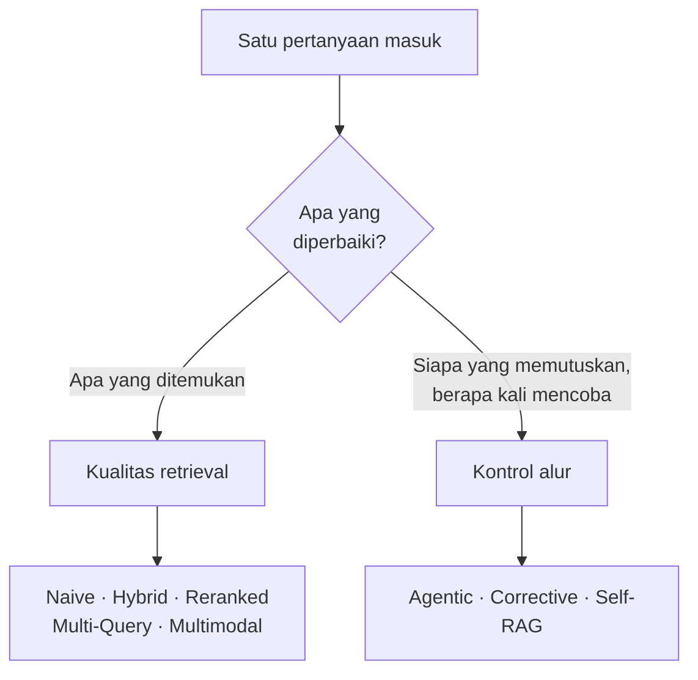
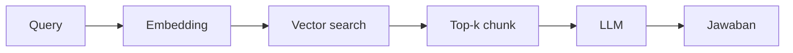
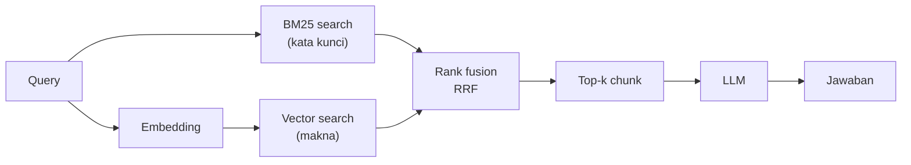
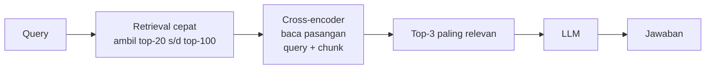
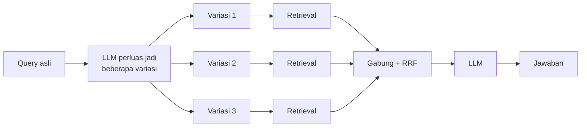
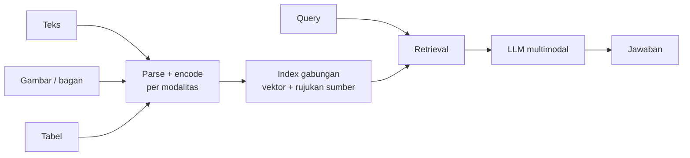
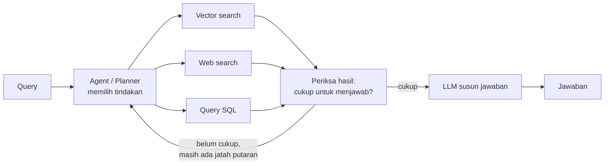
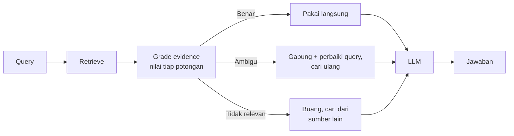
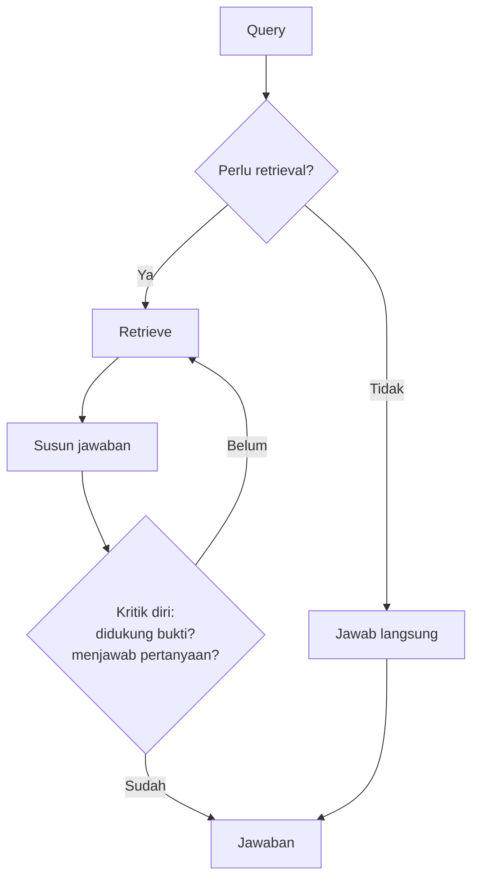

# Module 30: Jenis-Jenis Arsitektur RAG

## Tujuan

Mengenali arsitektur RAG yang umum dipakai di industri beserta diagram alurnya masing-masing, memahami masalah spesifik yang diselesaikan tiap arsitektur, dan tahu harga yang harus dibayar untuk memakainya. Module ini murni teori — tidak ada kode maupun perintah terminal.

## Definisi

**Arsitektur RAG** adalah pola susunan komponen retrieval dan generation: apa yang dicari, bagaimana hasilnya disaring, dan siapa yang memutuskan langkah berikutnya.

Yang sering membingungkan saat membaca daftar "N arsitektur RAG" adalah bahwa daftar-daftar itu biasanya mencampur dua tingkat yang berbeda. Ada yang mengubah **kualitas retrieval** — apa yang berhasil ditemukan — seperti hybrid search, reranking, atau perluasan query. Ada pula yang mengubah **kontrol alur** — siapa yang memutuskan dan berapa kali sistem boleh mencoba — seperti agentic, corrective, atau self-RAG. Keduanya kerap disebut "arsitektur" dengan bobot yang sama, padahal menambahkan reranker adalah penambahan satu komponen, sementara mengubah alur jadi agentic mengubah bentuk seluruh sistem.

Karena itu module ini menyusun petanya berdasarkan **apa yang berubah**, bukan berdasarkan urutan populer.

## Hasil Akhir yang Diharapkan

- Kita bisa membedakan arsitektur yang memperbaiki **kualitas retrieval** dari yang memperbaiki **kontrol alur**, dan memberi contoh masing-masing
- Kita bisa membaca diagram alur tiap arsitektur dan menjelaskan urutan langkahnya dengan kata-kata sendiri
- Untuk tiap arsitektur, kita bisa menyebutkan **gejala** yang menandakan sebuah sistem mulai membutuhkannya
- Kita paham bahwa tiap arsitektur punya harga — latensi, biaya, atau beban pemeliharaan — dan bisa menyebutkannya
- Kita bisa membaca daftar "N arsitektur RAG" di internet secara kritis, termasuk mengenali apa yang tidak disebutkan di sana

---

## 1. Naive RAG

Bentuk paling dasar, dan fondasi semua arsitektur lain. Pertanyaan diubah jadi vektor, dicocokkan dengan vektor potongan dokumen di index, lalu potongan paling mirip ditempelkan ke prompt sebagai konteks.

**Masalah yang diselesaikan**: model bisa menjawab dari dokumen yang tidak pernah ia lihat saat training, dan jawabannya bisa ditelusuri ke sumbernya.

**Gejala kelemahannya**: pencarian berbasis makna meleset pada istilah yang harus cocok **persis** — nomor peraturan, kode produk, nama formulir, singkatan internal. Embedding memampatkan makna, dan dalam proses itu justru membuang kekhasan token yang jarang muncul.

**Harganya**: paling murah. Satu kali embedding, satu kali pencarian.

---

## 2. Hybrid RAG

Menjalankan dua pencarian berdampingan — **BM25** yang mencocokkan kata kunci secara leksikal, dan **vector search** yang mencocokkan makna — lalu menggabungkan hasilnya.

**Masalah yang diselesaikan**: menutup titik buta Naive RAG pada istilah spesifik, tanpa kehilangan kemampuan menangkap parafrase.

**Kenapa penggabungannya berbasis peringkat, bukan skor**: skor BM25 dan skor cosine similarity berada di skala yang berbeda dan tidak bisa dijumlahkan begitu saja. **RRF** (*Reciprocal Rank Fusion*) menghindari masalah itu dengan hanya melihat **urutan**: tiap dokumen diberi nilai `1/(k + peringkat)` di masing-masing daftar, lalu dijumlahkan. Konstanta `k` (umumnya 60) meredam pengaruh berlebihan dari peringkat teratas.

**Harganya**: dua pencarian, bukan satu. Index harus menyimpan teks asli **dan** vektor.

---

## 3. Reranked RAG

Retrieval cepat mengambil kandidat dalam jumlah besar, lalu model yang lebih teliti membaca ulang tiap kandidat bersama pertanyaannya dan mengurutkannya kembali.

**Bedanya dengan embedding**: embedding memampatkan pertanyaan dan dokumen jadi vektor **secara terpisah**, jadi model tidak pernah membaca keduanya bersamaan. **Cross-encoder** membaca pasangan pertanyaan-dan-dokumen sekaligus, sehingga bisa menangkap keterkaitan halus yang hilang saat dipampatkan. Konsekuensinya ia jauh lebih akurat sekaligus jauh lebih lambat — karena itu dipakai untuk menyaring puluhan kandidat, bukan untuk mencari di seluruh index.

**Masalah yang diselesaikan**: potongan yang benar sebenarnya sudah ditemukan, tapi terkubur di peringkat delapan sehingga tidak ikut terkirim ke model.

**Harganya**: latensi bertambah signifikan, karena tiap kandidat harus dilewatkan model. Semakin besar kandidatnya, semakin lambat.

---

## 4. Multi-Query RAG / RAG-Fusion

Satu pertanyaan user diperluas jadi beberapa variasi oleh LLM, masing-masing dicari secara terpisah, lalu semua hasilnya digabung dan diperingkat ulang.

**Masalah yang diselesaikan**: kesenjangan kosakata. User mengetik dengan istilah sehari-hari, dokumen ditulis dengan istilah formal. Satu rumusan query saja sering tidak cukup menjembatani keduanya.

**Gejala membutuhkannya**: jawaban sering meleset padahal dokumennya jelas ada, dan ketika pertanyaan diketik ulang dengan kata lain, dokumennya langsung ketemu.

**Harganya**: satu panggilan LLM tambahan **sebelum** retrieval, ditambah 3-5 kali lipat beban query ke search engine. Ini menambah latensi di depan, sebelum satu token jawaban pun keluar.

---

## 5. Multimodal RAG

Dokumen tidak selalu berupa teks. Ada tabel, diagram alur, tangkapan layar, foto, hasil pindai. Multimodal RAG meng-encode dan mencari konten non-teks itu, lalu mengirimkannya ke model yang bisa "melihat".

**Masalah yang diselesaikan**: informasi penting yang hidup di luar paragraf. Ekstraksi teks biasa hanya mengambil lapisan teks — tabel bisa masuk sebagai deretan angka tanpa struktur, dan halaman hasil pindai masuk sebagai **string kosong**. Sistem lalu menjawab "tidak ditemukan", bukan "saya tidak bisa membaca ini" — kegagalan yang tidak terlihat sebagai kegagalan.

**Gejala membutuhkannya**: dokumen sumber banyak berupa hasil pindai, atau informasi kuncinya ada di tabel dan bagan.

**Harganya**: model multimodal lebih besar dan lebih mahal; pipeline ingest butuh OCR dan pendeteksi tata letak; penyimpanan index membengkak.

---

## 6. Agentic RAG

Pada RAG chain biasa, urutannya pasti: setiap pertanyaan memicu retrieval, selalu. Pada Agentic RAG, model diberi daftar **tool** dan memutuskan sendiri apakah perlu mencari, tool mana yang dipakai, dan apakah perlu memanggil lagi setelah melihat hasilnya.

**Masalah yang diselesaikan**: tidak semua pertanyaan butuh retrieval, dan tidak semua pertanyaan dijawab oleh sumber yang sama. Sapaan tidak perlu pencarian; pertanyaan gabungan mungkin butuh dua sumber berurutan.

**Gejala membutuhkannya**: ada lebih dari satu jenis sumber data, dan pemilihannya tidak bisa ditentukan dari kata kunci saja.

**Harganya** — dan ini pertukaran yang mendasar: fleksibilitas ditukar dengan **kepastian**. Alur tetap selalu melakukan hal yang sama dan gampang di-debug; agent bisa memilih salah. Kualitas keputusannya bergantung penuh pada kemampuan model mengikuti instruksi tool, dan model kecil kerap tidak konsisten di sini. Perlu pengaman batas putaran, atau agent bisa berputar tanpa henti.

---

## 7. Corrective RAG (CRAG)

Setelah retrieval dan **sebelum** menyusun jawaban, ada langkah penilaian eksplisit terhadap bukti yang ditemukan. Hasil penilaian menentukan tindakan berikutnya.

**Masalah yang diselesaikan**: retrieval **selalu** mengembalikan sesuatu. Kalau tidak ada yang relevan, ia tetap mengembalikan potongan paling mirip — dan model akan menjawab percaya diri dari bahan yang buruk.

**Yang sering dikira CRAG padahal bukan**: pembatas jumlah putaran. Mekanisme yang berkata "sudah tiga kali mencoba, sekarang jawab dengan apa pun yang ada" adalah **pembatas**, bukan penilai bukti — ia tidak pernah melihat isi potongan dan tidak pernah menyimpulkan "bukti ini tidak relevan". Perbedaan ini penting karena keduanya terdengar seperti "koreksi".

**Gejala membutuhkannya**: sistem menjawab yakin dari dokumen yang **ada tapi tidak menjawab pertanyaan** — bukan mengarang dari nol, tapi memaksakan potongan yang kebetulan lolos retrieval. Ini pola kegagalan yang paling sulit dideteksi user, karena jawabannya terdengar bersumber.

**Harganya**: satu tahap penilaian tambahan per pertanyaan, dan bisa memicu pencarian putaran kedua.

---

## 8. Self-RAG

Model menilai pekerjaannya sendiri di beberapa titik: apakah pertanyaan ini perlu retrieval, apakah jawaban yang disusun benar-benar didukung bukti, dan apakah sudah menjawab yang ditanyakan.

**Masalah yang diselesaikan**: menyatukan keputusan retrieval dan kontrol kualitas ke dalam satu model, tanpa komponen penilai terpisah.

**Peringatan penting**: arsitektur ini bersandar pada kemampuan model **menilai dirinya sendiri secara jujur**. Model yang sama yang menyusun jawaban juga yang memutuskan jawaban itu sudah cukup baik. Pada model kecil, kritik-diri cenderung optimistis — ia lebih sering menyatakan "sudah didukung bukti" daripada menemukan kesalahannya sendiri. Hasilnya lapisan yang terlihat canggih tapi tidak menambah keandalan.

**Harganya**: beberapa panggilan model per satu jawaban, dan keandalan yang sulit dijamin tanpa model yang kuat.

---

## 9. Membaca Daftar "N Arsitektur RAG" di Internet

Grafik semacam ini banyak beredar dan berguna sebagai pengingat nama. Tiga hal yang perlu diwaspadai saat membacanya:

- **Tingkatnya dicampur.** "Reranked RAG" dan "Agentic RAG" kerap ditaruh sebagai dua butir setara, padahal yang pertama menambah satu komponen dan yang kedua mengubah bentuk seluruh alur.
- **Nomornya bukan urutan belajar maupun urutan bangun.** Ada grafik yang menaruh Agentic RAG di nomor satu dan Naive RAG di nomor dua, padahal Naive adalah fondasi yang harus ada lebih dulu.
- **Harganya hampir tidak pernah disebut.** Tiap kotak terlihat sama murahnya. Kenyataannya, jarak antara menambah reranker dan membangun pipeline multimodal — dalam pekerjaan, latensi, biaya, dan beban pemeliharaan — sangat jauh.

Dan yang paling menentukan hasil justru **tidak muncul di grafik manapun**: kualitas dokumen sumber, strategi chunking, serta cara mengukur apakah sebuah perubahan benar-benar memperbaiki keadaan. Sistem dengan arsitektur paling canggih tetap menjawab buruk kalau dokumennya tidak lengkap — dan tanpa cara mengukur, tidak ada yang bisa membuktikan satu arsitektur lebih baik dari yang lain.

**Prinsip yang bisa dibawa pulang**: tambahkan arsitektur ketika Anda bisa menyebutkan **gejala** yang mendorongnya, dan punya **cara mengukur** apakah gejalanya hilang. Kalau keduanya belum ada, yang ditambahkan adalah kompleksitas, bukan kemampuan.

## Checkpoint Diskusi

- [ ] Kita bisa membedakan arsitektur yang memperbaiki kualitas retrieval dari yang memperbaiki kontrol alur, dengan satu contoh masing-masing
- [ ] Kita bisa menjelaskan kenapa RRF menggabungkan berdasarkan peringkat, bukan berdasarkan skor mentah
- [ ] Kita bisa menjelaskan beda cross-encoder dan embedding, serta kenapa cross-encoder tidak dipakai untuk mencari di seluruh index
- [ ] Kita bisa menjelaskan kenapa pembatas jumlah putaran **bukan** Corrective RAG
- [ ] Kita bisa menyebutkan alasan Self-RAG berisiko kalau dijalankan dengan model kecil
- [ ] Untuk tiap arsitektur, kita bisa menyebutkan satu gejala konkret yang menandakan sistem mulai membutuhkannya
- [ ] Kita bisa menyebutkan harga dari minimal tiga arsitektur — latensi, biaya, atau beban pemeliharaan

**Bahan diskusi kelompok (10-15 menit)**: pikirkan satu sistem tanya-jawab yang relevan dengan pekerjaan Anda. Bentuk dokumennya seperti apa — paragraf, tabel, hasil pindai, atau prosedur berurutan panjang? Dari delapan arsitektur di atas, mana yang paling relevan untuk bentuk dokumen itu, dan mana yang jelas berlebihan? Jawabannya ditentukan oleh **dokumen dan pertanyaan Anda**, bukan oleh urutan populer di internet.

## Kesimpulan

Delapan arsitektur di atas bukan tangga yang harus dinaiki sampai puncak. Masing-masing menjawab gejala yang berbeda, dan sebagian besar **tidak** akan pernah dibutuhkan tergantung bentuk dokumen dan jenis pertanyaan yang dihadapi.

Naive RAG adalah fondasi yang selalu ada. Hybrid dan reranking adalah dua penambahan dengan rasio manfaat-terhadap-biaya paling baik di kebanyakan kasus. Sisanya — multi-query, multimodal, corrective, self-RAG — adalah jawaban atas masalah spesifik yang harus benar-benar Anda alami lebih dulu sebelum layak dibayar harganya.

Kemampuan yang sebenarnya dilatih di sini bukan menghafal delapan nama, tapi mengenali gejalanya lebih dulu, memilih dengan sadar, dan bisa menjelaskan pilihan itu kepada orang lain.

Lanjut ke **Module 31** (`../Module-31-Ethics-Governance/materi.md`): diskusi etika dan tata kelola.
